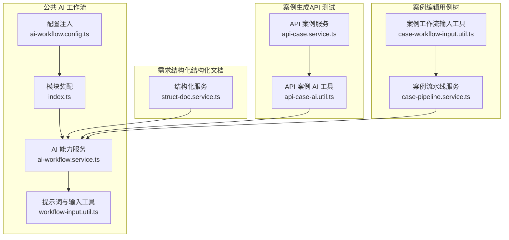
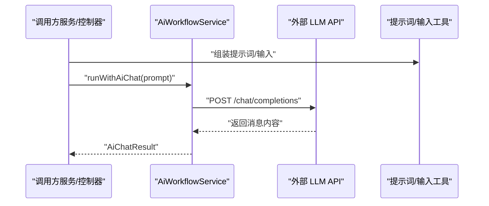
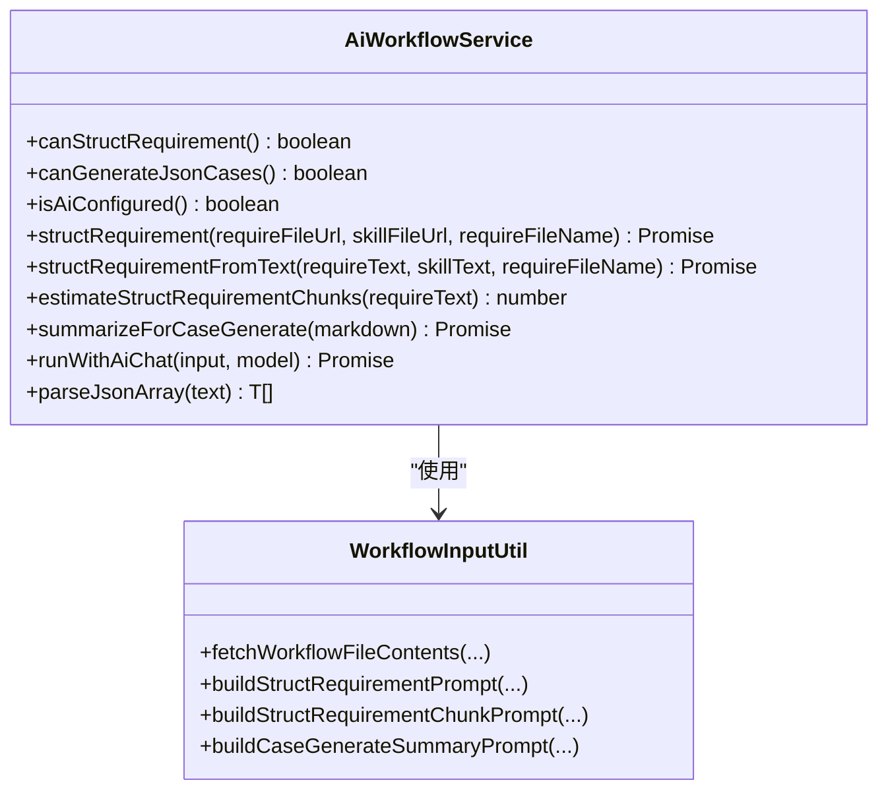
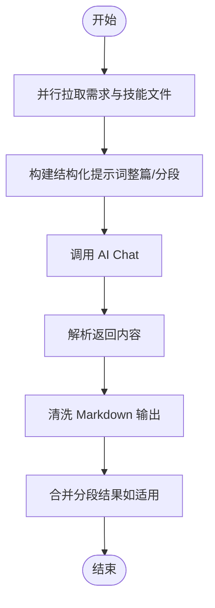
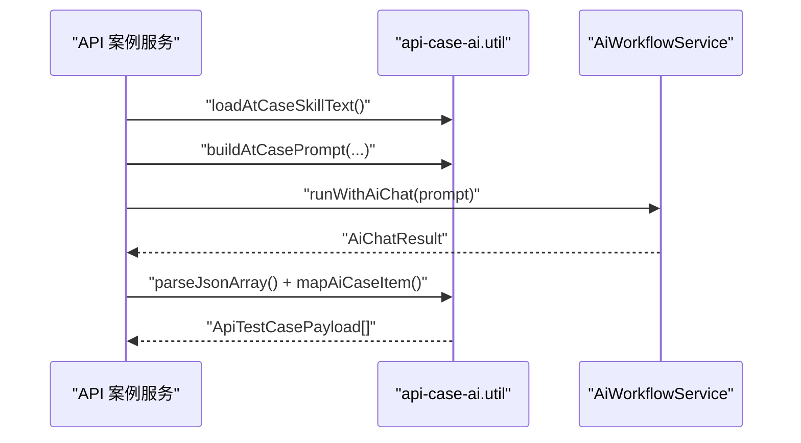
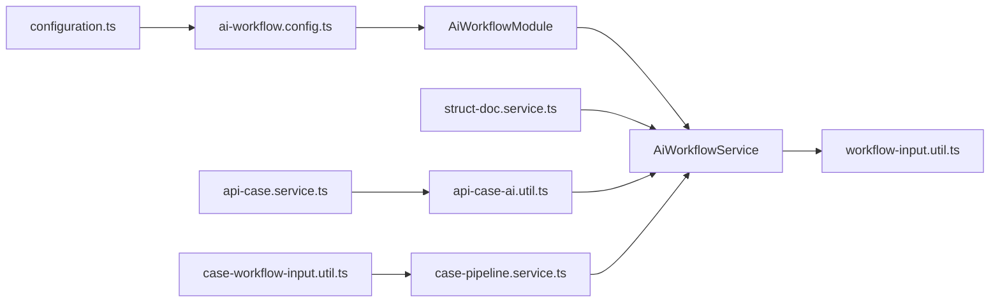

# AI 工作流系统

<cite>
**本文引用的文件**
- [apps/api/src/common/ai-workflow/ai-workflow.config.ts](file://apps/api/src/common/ai-workflow/ai-workflow.config.ts)
- [apps/api/src/common/ai-workflow/service/ai-workflow.service.ts](file://apps/api/src/common/ai-workflow/service/ai-workflow.service.ts)
- [apps/api/src/common/ai-workflow/util/workflow-input.util.ts](file://apps/api/src/common/ai-workflow/util/workflow-input.util.ts)
- [apps/api/src/common/ai-workflow/index.ts](file://apps/api/src/common/ai-workflow/index.ts)
- [apps/api/src/modules/case-editor/util/case-workflow-input.util.ts](file://apps/api/src/modules/case-editor/util/case-workflow-input.util.ts)
- [apps/api/src/modules/api-test/util/api-case-ai.util.ts](file://apps/api/src/modules/api-test/util/api-case-ai.util.ts)
- [apps/api/src/config/configuration.ts](file://apps/api/src/config/configuration.ts)
- [apps/api/src/modules/case-editor/service/case-pipeline.service.ts](file://apps/api/src/modules/case-editor/service/case-pipeline.service.ts)
- [apps/api/src/modules/struct-doc/service/struct-doc.service.ts](file://apps/api/src/modules/struct-doc/service/struct-doc.service.ts)
- [apps/api/src/modules/api-test/service/api-case.service.ts](file://apps/api/src/modules/api-test/service/api-case.service.ts)
</cite>

## 目录
1. [引言](#引言)
2. [项目结构](#项目结构)
3. [核心组件](#核心组件)
4. [架构总览](#架构总览)
5. [详细组件分析](#详细组件分析)
6. [依赖关系分析](#依赖关系分析)
7. [性能考虑](#性能考虑)
8. [故障排查指南](#故障排查指南)
9. [结论](#结论)
10. [附录](#附录)

## 引言
本文件面向 AI 工作流系统的开发者与运维人员，系统性阐述需求结构化、案例生成与测试要点定义的 AI 集成架构与实现细节。重点覆盖：
- LLM API 集成与提示词工程
- 工作流编排与配置管理
- 输入输出处理与错误恢复策略
- 多服务提供商的适配与切换思路
- 在案例生成、需求提取与测试要点定义中的应用示例
- 性能优化与成本控制建议
- 监控、日志与调试方法

## 项目结构
AI 工作流相关代码主要位于后端应用的公共模块与业务模块中：
- 公共 AI 工作流模块：负责配置注入、LLM 调用、提示词构建与结构化解析
- 业务模块：
  - 需求结构化（结构化文档模块）
  - 案例生成（API 测试模块）
  - 案例编辑（用例树与工作流）

图表来源
- [apps/api/src/common/ai-workflow/ai-workflow.config.ts:1-21](file://apps/api/src/common/ai-workflow/ai-workflow.config.ts#L1-L21)
- [apps/api/src/common/ai-workflow/service/ai-workflow.service.ts:1-347](file://apps/api/src/common/ai-workflow/service/ai-workflow.service.ts#L1-L347)
- [apps/api/src/common/ai-workflow/util/workflow-input.util.ts:1-185](file://apps/api/src/common/ai-workflow/util/workflow-input.util.ts#L1-L185)
- [apps/api/src/common/ai-workflow/index.ts:1-21](file://apps/api/src/common/ai-workflow/index.ts#L1-L21)
- [apps/api/src/modules/struct-doc/service/struct-doc.service.ts](file://apps/api/src/modules/struct-doc/service/struct-doc.service.ts)
- [apps/api/src/modules/api-test/util/api-case-ai.util.ts:1-201](file://apps/api/src/modules/api-test/util/api-case-ai.util.ts#L1-L201)
- [apps/api/src/modules/api-test/service/api-case.service.ts](file://apps/api/src/modules/api-test/service/api-case.service.ts)
- [apps/api/src/modules/case-editor/util/case-workflow-input.util.ts:1-152](file://apps/api/src/modules/case-editor/util/case-workflow-input.util.ts#L1-L152)
- [apps/api/src/modules/case-editor/service/case-pipeline.service.ts](file://apps/api/src/modules/case-editor/service/case-pipeline.service.ts)

章节来源
- [apps/api/src/common/ai-workflow/index.ts:1-21](file://apps/api/src/common/ai-workflow/index.ts#L1-L21)
- [apps/api/src/config/configuration.ts:1-48](file://apps/api/src/config/configuration.ts#L1-L48)

## 核心组件
- 配置注入与类型
  - 注入令牌与配置类型定义，从应用配置中抽取 AI 工作流子配置
- AI 能力服务
  - 支持需求结构化、案例生成摘要、通用 LLM 调用、JSON 数组解析与重试
- 提示词与输入工具
  - 从 URL 读取文件内容、拼装结构化与分段结构化提示词、构建案例生成摘要提示词
- 业务集成点
  - 结构化文档模块、API 案例生成、案例编辑工作流

章节来源
- [apps/api/src/common/ai-workflow/ai-workflow.config.ts:1-21](file://apps/api/src/common/ai-workflow/ai-workflow.config.ts#L1-L21)
- [apps/api/src/common/ai-workflow/service/ai-workflow.service.ts:1-347](file://apps/api/src/common/ai-workflow/service/ai-workflow.service.ts#L1-L347)
- [apps/api/src/common/ai-workflow/util/workflow-input.util.ts:1-185](file://apps/api/src/common/ai-workflow/util/workflow-input.util.ts#L1-L185)
- [apps/api/src/modules/case-editor/util/case-workflow-input.util.ts:1-152](file://apps/api/src/modules/case-editor/util/case-workflow-input.util.ts#L1-L152)
- [apps/api/src/modules/api-test/util/api-case-ai.util.ts:1-201](file://apps/api/src/modules/api-test/util/api-case-ai.util.ts#L1-L201)

## 架构总览
系统通过“配置注入 + 服务封装 + 提示词工程”的方式，将外部 LLM API 与内部业务流程解耦。核心交互如下：

图表来源
- [apps/api/src/common/ai-workflow/service/ai-workflow.service.ts:214-278](file://apps/api/src/common/ai-workflow/service/ai-workflow.service.ts#L214-L278)
- [apps/api/src/common/ai-workflow/util/workflow-input.util.ts:65-90](file://apps/api/src/common/ai-workflow/util/workflow-input.util.ts#L65-L90)

## 详细组件分析

### AI 工作流配置与模块装配
- 配置项
  - 需求结构化技能 URL、案例生成推广 URL、AI Chat 基础地址、模型、API Key、重试次数
- 模块装配
  - 通过配置提供者将配置注入容器，导出配置令牌与服务

章节来源
- [apps/api/src/config/configuration.ts:35-46](file://apps/api/src/config/configuration.ts#L35-L46)
- [apps/api/src/common/ai-workflow/ai-workflow.config.ts:1-21](file://apps/api/src/common/ai-workflow/ai-workflow.config.ts#L1-L21)
- [apps/api/src/common/ai-workflow/index.ts:1-21](file://apps/api/src/common/ai-workflow/index.ts#L1-L21)

### AI 能力服务（AiWorkflowService）
- 能力判定
  - canStructRequirement / canGenerateJsonCases / isAiConfigured
- 需求结构化
  - 支持整篇与分段结构化，自动预估分段数量，合并输出并清洗 Markdown
- 案例生成摘要
  - 将结构化 Markdown 压缩为“案例生成用需求总结”
- 通用 LLM 调用
  - 自动补全 chat/completions 路径、设置请求参数、带重试的 HTTP 调用
- JSON 解析
  - 支持裸 JSON 与代码块包裹的 JSON 数组解析
- 错误处理
  - 明确的输入校验、空响应检测、逐次重试与最终异常抛出

图表来源
- [apps/api/src/common/ai-workflow/service/ai-workflow.service.ts:38-347](file://apps/api/src/common/ai-workflow/service/ai-workflow.service.ts#L38-L347)
- [apps/api/src/common/ai-workflow/util/workflow-input.util.ts:53-183](file://apps/api/src/common/ai-workflow/util/workflow-input.util.ts#L53-L183)

章节来源
- [apps/api/src/common/ai-workflow/service/ai-workflow.service.ts:1-347](file://apps/api/src/common/ai-workflow/service/ai-workflow.service.ts#L1-L347)

### 提示词与输入工具
- 文件拉取与解析
  - 从 URL 并行拉取需求文档与技能文档，解析为纯文本
- 结构化提示词
  - 整篇与分段两种提示词模板，支持文件名、元信息与输出约束
- 案例生成摘要提示词
  - 将结构化 Markdown 压缩为“案例生成摘要”，限定输出结构与要点

图表来源
- [apps/api/src/common/ai-workflow/util/workflow-input.util.ts:53-146](file://apps/api/src/common/ai-workflow/util/workflow-input.util.ts#L53-L146)
- [apps/api/src/common/ai-workflow/service/ai-workflow.service.ts:75-179](file://apps/api/src/common/ai-workflow/service/ai-workflow.service.ts#L75-L179)

章节来源
- [apps/api/src/common/ai-workflow/util/workflow-input.util.ts:1-185](file://apps/api/src/common/ai-workflow/util/workflow-input.util.ts#L1-L185)

### 案例生成（API 测试）集成
- 技能模板加载
  - 从本地文件加载案例技能模板
- 提示词构建
  - 替换交易码、接口名、方法、路径与结构化文档
- AI 生成与映射
  - 调用 AI Chat 获取 JSON 案例数组，映射为统一的用例载荷

图表来源
- [apps/api/src/modules/api-test/util/api-case-ai.util.ts:61-94](file://apps/api/src/modules/api-test/util/api-case-ai.util.ts#L61-L94)
- [apps/api/src/common/ai-workflow/service/ai-workflow.service.ts:214-278](file://apps/api/src/common/ai-workflow/service/ai-workflow.service.ts#L214-L278)

章节来源
- [apps/api/src/modules/api-test/util/api-case-ai.util.ts:1-201](file://apps/api/src/modules/api-test/util/api-case-ai.util.ts#L1-L201)
- [apps/api/src/modules/api-test/service/api-case.service.ts](file://apps/api/src/modules/api-test/service/api-case.service.ts)

### 案例编辑工作流输入
- 测试要点映射
  - 从实体映射为工作流输入结构，包含系统/模块/测试要点等字段
- 场景提示词与自然语言约束
  - 将场景提示词包与自然语言约束拼入测试要点块
- 工作流输入组装
  - 生成“需求前景 + 测试要点”工作流输入，用于案例生成

章节来源
- [apps/api/src/modules/case-editor/util/case-workflow-input.util.ts:1-152](file://apps/api/src/modules/case-editor/util/case-workflow-input.util.ts#L1-L152)

### 结构化文档模块集成
- 结构化能力判定
  - 依赖需求结构化技能 URL 与 AI Chat 的可用性
- 分段结构化与合并
  - 长文档自动分段，逐段调用 AI Chat，最后合并并清洗输出

章节来源
- [apps/api/src/modules/struct-doc/service/struct-doc.service.ts](file://apps/api/src/modules/struct-doc/service/struct-doc.service.ts)
- [apps/api/src/common/ai-workflow/service/ai-workflow.service.ts:47-179](file://apps/api/src/common/ai-workflow/service/ai-workflow.service.ts#L47-L179)

## 依赖关系分析
- 配置来源
  - 通过配置工厂从环境变量加载 aiWorkflow 子配置
- 模块依赖
  - AiWorkflowModule 向外导出配置令牌与服务，被结构化文档、API 案例、案例编辑等模块依赖
- 服务耦合
  - AiWorkflowService 与提示词工具松耦合，便于替换不同提示词策略
- 外部依赖
  - 通过 HTTP 调用外部 LLM API，具备重试与日志记录

图表来源
- [apps/api/src/config/configuration.ts:35-46](file://apps/api/src/config/configuration.ts#L35-L46)
- [apps/api/src/common/ai-workflow/ai-workflow.config.ts:1-21](file://apps/api/src/common/ai-workflow/ai-workflow.config.ts#L1-L21)
- [apps/api/src/common/ai-workflow/index.ts:1-21](file://apps/api/src/common/ai-workflow/index.ts#L1-L21)
- [apps/api/src/common/ai-workflow/service/ai-workflow.service.ts:1-347](file://apps/api/src/common/ai-workflow/service/ai-workflow.service.ts#L1-L347)
- [apps/api/src/common/ai-workflow/util/workflow-input.util.ts:1-185](file://apps/api/src/common/ai-workflow/util/workflow-input.util.ts#L1-L185)
- [apps/api/src/modules/struct-doc/service/struct-doc.service.ts](file://apps/api/src/modules/struct-doc/service/struct-doc.service.ts)
- [apps/api/src/modules/api-test/util/api-case-ai.util.ts:1-201](file://apps/api/src/modules/api-test/util/api-case-ai.util.ts#L1-L201)
- [apps/api/src/modules/case-editor/util/case-workflow-input.util.ts:1-152](file://apps/api/src/modules/case-editor/util/case-workflow-input.util.ts#L1-L152)
- [apps/api/src/modules/case-editor/service/case-pipeline.service.ts](file://apps/api/src/modules/case-editor/service/case-pipeline.service.ts)

章节来源
- [apps/api/src/common/ai-workflow/index.ts:1-21](file://apps/api/src/common/ai-workflow/index.ts#L1-L21)
- [apps/api/src/modules/case-editor/service/case-pipeline.service.ts](file://apps/api/src/modules/case-editor/service/case-pipeline.service.ts)

## 性能考虑
- 分段结构化
  - 对长文档自动分段，降低单次调用上下文压力，提升稳定性与可控性
- 并行文件拉取
  - 需求与技能文件并行拉取，减少等待时间
- 重试与退避
  - 可配置重试次数，避免瞬时网络波动导致失败
- 输出清洗
  - 统一清洗 Markdown 输出，减少下游解析开销
- 成本控制建议
  - 优先使用更低成本模型进行草稿生成，再以更高精度模型进行最终校验
  - 控制提示词长度与分段数量，避免不必要的 token 消耗
  - 对热点数据进行缓存（如技能模板、常用摘要），减少重复调用

## 故障排查指南
- 常见错误与定位
  - AI Chat 未配置：检查 AI_CHAT_URL、REQ_DOC_SKILL_URL、CASE_DOC_PROMOTE_URL
  - 空响应：确认提示词构建正确、模型参数合理、返回内容非空
  - JSON 解析失败：确认 AI 输出包裹在 JSON 数组或代码块中
  - 文件拉取失败：检查 URL 可达性、内容类型与文件扩展名推断
- 日志与可观测性
  - 服务内置日志记录请求结果与长度，便于快速定位问题
  - 建议在网关层记录请求 ID 与响应状态，结合服务日志进行追踪
- 回滚与降级
  - 当 LLM 不可用时，可回退至本地模板或静态样例
  - 对关键路径增加熔断与降级策略，保障核心功能可用

章节来源
- [apps/api/src/common/ai-workflow/service/ai-workflow.service.ts:80-87](file://apps/api/src/common/ai-workflow/service/ai-workflow.service.ts#L80-L87)
- [apps/api/src/common/ai-workflow/service/ai-workflow.service.ts:248-278](file://apps/api/src/common/ai-workflow/service/ai-workflow.service.ts#L248-L278)
- [apps/api/src/common/ai-workflow/util/workflow-input.util.ts:32-51](file://apps/api/src/common/ai-workflow/util/workflow-input.util.ts#L32-L51)

## 结论
本系统通过“配置驱动 + 服务封装 + 提示词工程”的方式，实现了需求结构化、案例生成与测试要点定义的 AI 工作流。其优势在于：
- 清晰的模块边界与依赖注入，便于替换与扩展
- 针对长文档的分段结构化策略，兼顾性能与准确性
- 完善的错误处理与日志记录，便于运维与调试
- 可配置的重试与成本控制策略，满足生产环境要求

## 附录

### 使用示例

- 需求结构化（结构化文档模块）
  - 准备需求文件 URL 与技能文件 URL
  - 调用服务进行结构化，支持整篇与分段模式
  - 输出清洗后的 Markdown，用于后续案例生成

章节来源
- [apps/api/src/common/ai-workflow/service/ai-workflow.service.ts:75-179](file://apps/api/src/common/ai-workflow/service/ai-workflow.service.ts#L75-L179)
- [apps/api/src/common/ai-workflow/util/workflow-input.util.ts:53-146](file://apps/api/src/common/ai-workflow/util/workflow-input.util.ts#L53-L146)

- 案例生成（API 测试模块）
  - 加载案例技能模板，构建提示词（包含交易码、接口信息与结构化文档）
  - 调用 AI Chat 获取 JSON 案例数组，映射为统一用例载荷

章节来源
- [apps/api/src/modules/api-test/util/api-case-ai.util.ts:61-94](file://apps/api/src/modules/api-test/util/api-case-ai.util.ts#L61-L94)

- 测试要点定义（案例编辑工作流）
  - 组装“需求前景 + 测试要点”工作流输入
  - 结合场景提示词与自然语言约束，生成案例树 Markdown 列表

章节来源
- [apps/api/src/modules/case-editor/util/case-workflow-input.util.ts:118-151](file://apps/api/src/modules/case-editor/util/case-workflow-input.util.ts#L118-L151)

### 配置清单
- aiWorkflow 子配置
  - reqDocSkillUrl：需求结构化技能 URL
  - caseDocPromoteUrl：案例生成推广 URL
  - aiChat.url：AI Chat 基础地址
  - aiChat.model：模型名称
  - aiChat.apiKey：API Key
  - aiChat.retryTime：重试次数

章节来源
- [apps/api/src/config/configuration.ts:35-46](file://apps/api/src/config/configuration.ts#L35-L46)