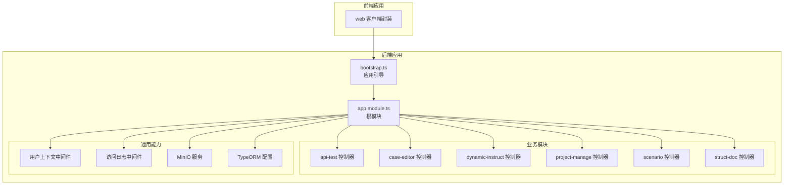
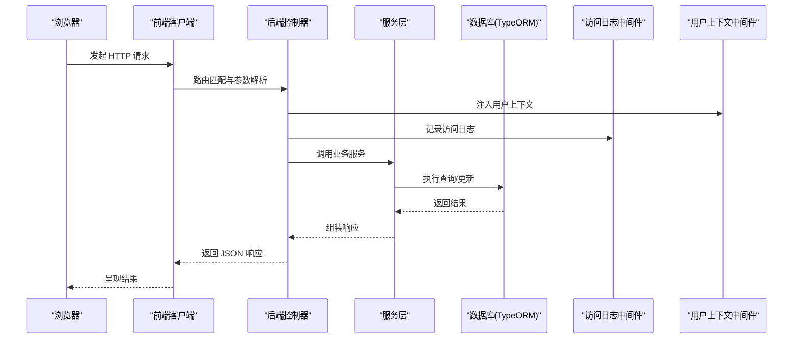
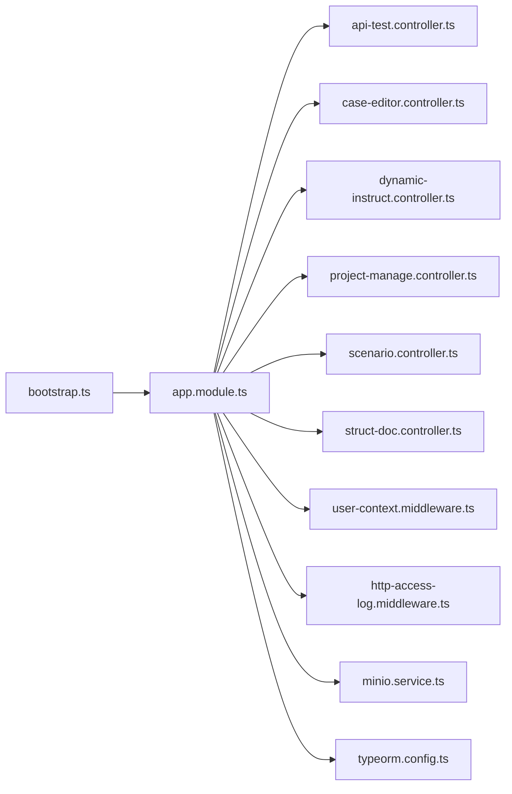

# API 参考文档

<cite>
**本文档引用的文件**
- [apps/api/src/modules/api-test/controller/api-test.controller.ts](file://apps/api/src/modules/api-test/controller/api-test.controller.ts)
- [apps/api/src/modules/case-editor/controller/case-editor.controller.ts](file://apps/api/src/modules/case-editor/controller/case-editor.controller.ts)
- [apps/api/src/modules/dynamic-instruct/controller/dynamic-instruct.controller.ts](file://apps/api/src/modules/dynamic-instruct/controller/dynamic-instruct.controller.ts)
- [apps/api/src/modules/project-manage/controller/project-manage.controller.ts](file://apps/api/src/modules/project-manage/controller/project-manage.controller.ts)
- [apps/api/src/modules/scenario/controller/scenario.controller.ts](file://apps/api/src/modules/scenario/controller/scenario.controller.ts)
- [apps/api/src/modules/struct-doc/controller/struct-doc.controller.ts](file://apps/api/src/modules/struct-doc/controller/struct-doc.controller.ts)
- [apps/api/src/modules/api-test/dto/save-api-case.dto.ts](file://apps/api/src/modules/api-test/dto/save-api-case.dto.ts)
- [apps/api/src/modules/api-test/dto/save-api-doc.dto.ts](file://apps/api/src/modules/api-test/dto/save-api-doc.dto.ts)
- [apps/api/src/modules/api-test/dto/save-environment.dto.ts](file://apps/api/src/modules/api-test/dto/save-environment.dto.ts)
- [apps/api/src/modules/api-test/dto/save-transaction.dto.ts](file://apps/api/src/modules/api-test/dto/save-transaction.dto.ts)
- [apps/api/src/modules/case-editor/dto/generate-cases.dto.ts](file://apps/api/src/modules/case-editor/dto/generate-cases.dto.ts)
- [apps/api/src/modules/case-editor/dto/list-case-rows.dto.ts](file://apps/api/src/modules/case-editor/dto/list-case-rows.dto.ts)
- [apps/api/src/modules/case-editor/dto/update-document.dto.ts](file://apps/api/src/modules/case-editor/dto/update-document.dto.ts)
- [apps/api/src/modules/project-manage/dto/create-project.dto.ts](file://apps/api/src/modules/project-manage/dto/create-project.dto.ts)
- [apps/api/src/modules/project-manage/dto/update-project.dto.ts](file://apps/api/src/modules/project-manage/dto/update-project.dto.ts)
- [apps/api/src/modules/struct-doc/dto/save-struct-doc.dto.ts](file://apps/api/src/modules/struct-doc/dto/save-struct-doc.dto.ts)
- [apps/api/src/modules/struct-doc/dto/auto-save-struct-doc.dto.ts](file://apps/api/src/modules/struct-doc/dto/auto-save-struct-doc.dto.ts)
- [apps/web/src/api/apiTestClient.ts](file://apps/web/src/api/apiTestClient.ts)
- [apps/web/src/api/client.ts](file://apps/web/src/api/client.ts)
- [apps/api/src/common/audit/user-context.middleware.ts](file://apps/api/src/common/audit/user-context.middleware.ts)
- [apps/api/src/common/http/http-access-log.middleware.ts](file://apps/api/src/common/http/http-access-log.middleware.ts)
- [apps/api/src/common/minio/service/minio.service.ts](file://apps/api/src/common/minio/service/minio.service.ts)
- [apps/api/src/common/typeorm/typeorm.config.ts](file://apps/api/src/common/typeorm/typeorm.config.ts)
- [apps/api/src/bootstrap.ts](file://apps/api/src/bootstrap.ts)
- [apps/api/src/app.module.ts](file://apps/api/src/app.module.ts)
- [apps/api/package.json](file://apps/api/package.json)
</cite>

## 目录
1. [简介](#简介)
2. [项目结构](#项目结构)
3. [核心组件](#核心组件)
4. [架构总览](#架构总览)
5. [详细组件分析](#详细组件分析)
6. [依赖关系分析](#依赖关系分析)
7. [性能考虑](#性能考虑)
8. [故障排除指南](#故障排除指南)
9. [结论](#结论)
10. [附录](#附录)

## 简介
本文件为 CaseForge 的完整 API 参考文档，覆盖后端 NestJS 应用提供的 RESTful 接口、认证与审计机制、数据传输对象（DTO）规范、版本与兼容性策略、以及前端 SDK 的使用与集成最佳实践。本文档旨在帮助开发者快速理解并正确使用 CaseForge 的 API。

## 项目结构
后端采用模块化设计，按业务域划分控制器与服务层，统一通过入口引导启动。前端提供基于 fetch 的客户端封装，便于在浏览器环境中调用后端接口。

**图表来源**
- [apps/api/src/bootstrap.ts:1-200](file://apps/api/src/bootstrap.ts#L1-L200)
- [apps/api/src/app.module.ts:1-200](file://apps/api/src/app.module.ts#L1-L200)
- [apps/api/src/modules/api-test/controller/api-test.controller.ts:1-200](file://apps/api/src/modules/api-test/controller/api-test.controller.ts#L1-L200)
- [apps/api/src/modules/case-editor/controller/case-editor.controller.ts:1-200](file://apps/api/src/modules/case-editor/controller/case-editor.controller.ts#L1-L200)
- [apps/api/src/modules/dynamic-instruct/controller/dynamic-instruct.controller.ts:1-200](file://apps/api/src/modules/dynamic-instruct/controller/dynamic-instruct.controller.ts#L1-L200)
- [apps/api/src/modules/project-manage/controller/project-manage.controller.ts:1-200](file://apps/api/src/modules/project-manage/controller/project-manage.controller.ts#L1-L200)
- [apps/api/src/modules/scenario/controller/scenario.controller.ts:1-200](file://apps/api/src/modules/scenario/controller/scenario.controller.ts#L1-L200)
- [apps/api/src/modules/struct-doc/controller/struct-doc.controller.ts:1-200](file://apps/api/src/modules/struct-doc/controller/struct-doc.controller.ts#L1-L200)
- [apps/api/src/common/audit/user-context.middleware.ts:1-200](file://apps/api/src/common/audit/user-context.middleware.ts#L1-L200)
- [apps/api/src/common/http/http-access-log.middleware.ts:1-200](file://apps/api/src/common/http/http-access-log.middleware.ts#L1-L200)
- [apps/api/src/common/minio/service/minio.service.ts:1-200](file://apps/api/src/common/minio/service/minio.service.ts#L1-L200)
- [apps/api/src/common/typeorm/typeorm.config.ts:1-200](file://apps/api/src/common/typeorm/typeorm.config.ts#L1-L200)
- [apps/web/src/api/client.ts:1-200](file://apps/web/src/api/client.ts#L1-L200)
- [apps/web/src/api/apiTestClient.ts:1-200](file://apps/web/src/api/apiTestClient.ts#L1-L200)

**章节来源**
- [apps/api/src/bootstrap.ts:1-200](file://apps/api/src/bootstrap.ts#L1-L200)
- [apps/api/src/app.module.ts:1-200](file://apps/api/src/app.module.ts#L1-L200)

## 核心组件
- 业务控制器：负责路由注册、请求处理与响应返回，涵盖接口测试、用例编辑、动态指令、项目管理、场景与结构化文档等模块。
- DTO 层：定义请求参数与响应数据结构，包含字段类型、校验规则与默认值约束。
- 中间件与审计：提供用户上下文注入、访问日志记录等横切能力。
- 存储与对象存储：通过 TypeORM 进行数据库持久化，结合 MinIO 提供文件上传与下载能力。
- 前端客户端：封装统一的 HTTP 调用逻辑，支持拦截器、超时与重试策略。

**章节来源**
- [apps/api/src/modules/api-test/controller/api-test.controller.ts:1-200](file://apps/api/src/modules/api-test/controller/api-test.controller.ts#L1-L200)
- [apps/api/src/modules/case-editor/controller/case-editor.controller.ts:1-200](file://apps/api/src/modules/case-editor/controller/case-editor.controller.ts#L1-L200)
- [apps/api/src/modules/dynamic-instruct/controller/dynamic-instruct.controller.ts:1-200](file://apps/api/src/modules/dynamic-instruct/controller/dynamic-instruct.controller.ts#L1-L200)
- [apps/api/src/modules/project-manage/controller/project-manage.controller.ts:1-200](file://apps/api/src/modules/project-manage/controller/project-manage.controller.ts#L1-L200)
- [apps/api/src/modules/scenario/controller/scenario.controller.ts:1-200](file://apps/api/src/modules/scenario/controller/scenario.controller.ts#L1-L200)
- [apps/api/src/modules/struct-doc/controller/struct-doc.controller.ts:1-200](file://apps/api/src/modules/struct-doc/controller/struct-doc.controller.ts#L1-L200)
- [apps/api/src/common/audit/user-context.middleware.ts:1-200](file://apps/api/src/common/audit/user-context.middleware.ts#L1-L200)
- [apps/api/src/common/http/http-access-log.middleware.ts:1-200](file://apps/api/src/common/http/http-access-log.middleware.ts#L1-L200)
- [apps/api/src/common/minio/service/minio.service.ts:1-200](file://apps/api/src/common/minio/service/minio.service.ts#L1-L200)
- [apps/api/src/common/typeorm/typeorm.config.ts:1-200](file://apps/api/src/common/typeorm/typeorm.config.ts#L1-L200)
- [apps/web/src/api/client.ts:1-200](file://apps/web/src/api/client.ts#L1-L200)
- [apps/web/src/api/apiTestClient.ts:1-200](file://apps/web/src/api/apiTestClient.ts#L1-L200)

## 架构总览
下图展示从浏览器到后端控制器、服务层与数据存储的整体调用链路，以及审计与日志的横切参与。

**图表来源**
- [apps/web/src/api/client.ts:1-200](file://apps/web/src/api/client.ts#L1-L200)
- [apps/api/src/modules/api-test/controller/api-test.controller.ts:1-200](file://apps/api/src/modules/api-test/controller/api-test.controller.ts#L1-L200)
- [apps/api/src/common/audit/user-context.middleware.ts:1-200](file://apps/api/src/common/audit/user-context.middleware.ts#L1-L200)
- [apps/api/src/common/http/http-access-log.middleware.ts:1-200](file://apps/api/src/common/http/http-access-log.middleware.ts#L1-L200)
- [apps/api/src/common/typeorm/typeorm.config.ts:1-200](file://apps/api/src/common/typeorm/typeorm.config.ts#L1-L200)

## 详细组件分析

### 认证与权限控制
- 用户上下文中间件：在请求进入控制器前注入当前用户信息，用于后续审计与权限判断。
- 权限模型：建议结合用户上下文与资源所属关系进行细粒度授权；具体策略以各模块的业务服务实现为准。
- 速率限制：仓库未发现显式的全局速率限制中间件或装饰器，建议在网关或反向代理层实施。

**章节来源**
- [apps/api/src/common/audit/user-context.middleware.ts:1-200](file://apps/api/src/common/audit/user-context.middleware.ts#L1-L200)

### 审计与访问日志
- 访问日志中间件：统一记录请求方法、URL、IP、耗时与状态码，便于问题排查与安全审计。

**章节来源**
- [apps/api/src/common/http/http-access-log.middleware.ts:1-200](file://apps/api/src/common/http/http-access-log.middleware.ts#L1-L200)

### 对象存储（MinIO）
- MinIO 服务：封装对象存储的上传、下载与删除操作，支持二进制文件与结构化文档的持久化。

**章节来源**
- [apps/api/src/common/minio/service/minio.service.ts:1-200](file://apps/api/src/common/minio/service/minio.service.ts#L1-L200)

### 数据库与 Schema 管理
- TypeORM 配置：集中管理连接、同步策略与字符集设置。
- Schema 补丁与索引：提供预同步补丁与索引维护工具，保障数据库演进的稳定性。

**章节来源**
- [apps/api/src/common/typeorm/typeorm.config.ts:1-200](file://apps/api/src/common/typeorm/typeorm.config.ts#L1-L200)

### 接口测试模块（API Test）

#### 控制器端点概览
- 保存接口文档
  - 方法与路径：POST /api-test/doc/save
  - 请求体：见 DTO 定义
  - 响应：标准成功/失败结构
- 保存环境变量
  - 方法与路径：POST /api-test/environment/save
  - 请求体：见 DTO 定义
  - 响应：标准成功/失败结构
- 保存用例
  - 方法与路径：POST /api-test/case/save
  - 请求体：见 DTO 定义
  - 响应：标准成功/失败结构
- 保存事务
  - 方法与路径：POST /api-test/transaction/save
  - 请求体：见 DTO 定义
  - 响应：标准成功/失败结构
- 批量删除事务
  - 方法与路径：DELETE /api-test/transaction/batch-delete
  - 请求体：见 DTO 定义
  - 响应：标准成功/失败结构
- 执行平台配置
  - 方法与路径：POST /api-test/execution-platform
  - 请求体：见 DTO 定义
  - 响应：标准成功/失败结构

#### 请求示例与响应示例
- 示例请求（保存接口文档）
  - 路径：POST /api-test/doc/save
  - 请求体字段：见 [save-api-doc.dto.ts:1-200](file://apps/api/src/modules/api-test/dto/save-api-doc.dto.ts#L1-L200)
  - 响应：包含操作结果与必要提示信息
- 示例请求（保存环境变量）
  - 路径：POST /api-test/environment/save
  - 请求体字段：见 [save-environment.dto.ts:1-200](file://apps/api/src/modules/api-test/dto/save-environment.dto.ts#L1-L200)
  - 响应：包含操作结果与必要提示信息
- 示例请求（保存用例）
  - 路径：POST /api-test/case/save
  - 请求体字段：见 [save-api-case.dto.ts:1-200](file://apps/api/src/modules/api-test/dto/save-api-case.dto.ts#L1-L200)
  - 响应：包含操作结果与必要提示信息
- 示例请求（保存事务）
  - 路径：POST /api-test/transaction/save
  - 请求体字段：见 [save-transaction.dto.ts:1-200](file://apps/api/src/modules/api-test/dto/save-transaction.dto.ts#L1-L200)
  - 响应：包含操作结果与必要提示信息
- 示例请求（批量删除事务）
  - 路径：DELETE /api-test/transaction/batch-delete
  - 请求体字段：见 [batch-delete-transactions.dto.ts:1-200](file://apps/api/src/modules/api-test/dto/batch-delete-transactions.dto.ts#L1-L200)
  - 响应：包含操作结果与必要提示信息
- 示例请求（执行平台配置）
  - 路径：POST /api-test/execution-platform
  - 请求体字段：见 [execution-platform.dto.ts:1-200](file://apps/api/src/modules/api-test/dto/execution-platform.dto.ts#L1-L200)
  - 响应：包含操作结果与必要提示信息

#### 错误码说明
- 成功：200 OK，响应中携带业务状态码与消息
- 参数错误：400 Bad Request，响应中包含字段校验失败详情
- 未授权：401 Unauthorized，缺少或无效的认证信息
- 禁止访问：403 Forbidden，无权限执行该操作
- 资源不存在：404 Not Found，请求的资源不存在
- 服务器内部错误：500 Internal Server Error，系统异常

**章节来源**
- [apps/api/src/modules/api-test/controller/api-test.controller.ts:1-200](file://apps/api/src/modules/api-test/controller/api-test.controller.ts#L1-L200)
- [apps/api/src/modules/api-test/dto/save-api-doc.dto.ts:1-200](file://apps/api/src/modules/api-test/dto/save-api-doc.dto.ts#L1-L200)
- [apps/api/src/modules/api-test/dto/save-environment.dto.ts:1-200](file://apps/api/src/modules/api-test/dto/save-environment.dto.ts#L1-L200)
- [apps/api/src/modules/api-test/dto/save-api-case.dto.ts:1-200](file://apps/api/src/modules/api-test/dto/save-api-case.dto.ts#L1-L200)
- [apps/api/src/modules/api-test/dto/save-transaction.dto.ts:1-200](file://apps/api/src/modules/api-test/dto/save-transaction.dto.ts#L1-L200)
- [apps/api/src/modules/api-test/dto/batch-delete-transactions.dto.ts:1-200](file://apps/api/src/modules/api-test/dto/batch-delete-transactions.dto.ts#L1-L200)
- [apps/api/src/modules/api-test/dto/execution-platform.dto.ts:1-200](file://apps/api/src/modules/api-test/dto/execution-platform.dto.ts#L1-L200)

### 用例编辑模块（Case Editor）

#### 控制器端点概览
- 生成用例
  - 方法与路径：POST /case-editor/generate-cases
  - 请求体：见 DTO 定义
  - 响应：标准成功/失败结构
- 列出用例行
  - 方法与路径：GET /case-editor/case-rows
  - 查询参数：见 DTO 定义
  - 响应：用例行列表
- 更新文档
  - 方法与路径：POST /case-editor/document/update
  - 请求体：见 DTO 定义
  - 响应：标准成功/失败结构
- 同步至测试平台
  - 方法与路径：POST /case-editor/sync-to-test-platform
  - 请求体：见 DTO 定义
  - 响应：标准成功/失败结构

#### 请求示例与响应示例
- 示例请求（生成用例）
  - 路径：POST /case-editor/generate-cases
  - 请求体字段：见 [generate-cases.dto.ts:1-200](file://apps/api/src/modules/case-editor/dto/generate-cases.dto.ts#L1-L200)
  - 响应：包含任务 ID 或生成结果
- 示例请求（列出用例行）
  - 路径：GET /case-editor/case-rows
  - 查询参数字段：见 [list-case-rows.dto.ts:1-200](file://apps/api/src/modules/case-editor/dto/list-case-rows.dto.ts#L1-L200)
  - 响应：用例行集合
- 示例请求（更新文档）
  - 路径：POST /case-editor/document/update
  - 请求体字段：见 [update-document.dto.ts:1-200](file://apps/api/src/modules/case-editor/dto/update-document.dto.ts#L1-L200)
  - 响应：包含操作结果与必要提示信息
- 示例请求（同步至测试平台）
  - 路径：POST /case-editor/sync-to-test-platform
  - 请求体字段：见 [sync-to-test-platform.dto.ts:1-200](file://apps/api/src/modules/case-editor/dto/sync-to-test-platform.dto.ts#L1-L200)
  - 响应：包含同步结果与必要提示信息

#### 错误码说明
- 成功：200 OK
- 参数错误：400 Bad Request
- 未授权：401 Unauthorized
- 禁止访问：403 Forbidden
- 资源不存在：404 Not Found
- 服务器内部错误：500 Internal Server Error

**章节来源**
- [apps/api/src/modules/case-editor/controller/case-editor.controller.ts:1-200](file://apps/api/src/modules/case-editor/controller/case-editor.controller.ts#L1-L200)
- [apps/api/src/modules/case-editor/dto/generate-cases.dto.ts:1-200](file://apps/api/src/modules/case-editor/dto/generate-cases.dto.ts#L1-L200)
- [apps/api/src/modules/case-editor/dto/list-case-rows.dto.ts:1-200](file://apps/api/src/modules/case-editor/dto/list-case-rows.dto.ts#L1-L200)
- [apps/api/src/modules/case-editor/dto/update-document.dto.ts:1-200](file://apps/api/src/modules/case-editor/dto/update-document.dto.ts#L1-L200)
- [apps/api/src/modules/case-editor/dto/sync-to-test-platform.dto.ts:1-200](file://apps/api/src/modules/case-editor/dto/sync-to-test-platform.dto.ts#L1-L200)

### 动态指令模块（Dynamic Instruct）

#### 控制器端点概览
- 保存动态指令
  - 方法与路径：POST /dynamic-instruct/save
  - 请求体：见 DTO 定义
  - 响应：标准成功/失败结构
- 批量保存动态指令
  - 方法与路径：POST /dynamic-instruct/batch-save
  - 请求体：见 DTO 定义
  - 响应：标准成功/失败结构
- 创建动态测试点
  - 方法与路径：POST /dynamic-instruct/test-point/create
  - 请求体：见 DTO 定义
  - 响应：标准成功/失败结构
- 删除动态测试点
  - 方法与路径：DELETE /dynamic-instruct/test-point/delete
  - 请求体：见 DTO 定义
  - 响应：标准成功/失败结构
- 列出动态测试点
  - 方法与路径：GET /dynamic-instruct/test-point/list
  - 查询参数：见 DTO 定义
  - 响应：测试点列表
- 更新测试点定义
  - 方法与路径：POST /dynamic-instruct/test-point/update-definition
  - 请求体：见 DTO 定义
  - 响应：标准成功/失败结构

#### 请求示例与响应示例
- 示例请求（保存动态指令）
  - 路径：POST /dynamic-instruct/save
  - 请求体字段：见 [save-dynamic-instruct.dto.ts:1-200](file://apps/api/src/modules/dynamic-instruct/dto/save-dynamic-instruct.dto.ts#L1-L200)
  - 响应：包含操作结果与必要提示信息
- 示例请求（批量保存动态指令）
  - 路径：POST /dynamic-instruct/batch-save
  - 请求体字段：见 [batch-save-dynamic-instruct.dto.ts:1-200](file://apps/api/src/modules/dynamic-instruct/dto/batch-save-dynamic-instruct.dto.ts#L1-L200)
  - 响应：包含操作结果与必要提示信息
- 示例请求（创建动态测试点）
  - 路径：POST /dynamic-instruct/test-point/create
  - 请求体字段：见 [create-dynamic-test-point.dto.ts:1-200](file://apps/api/src/modules/dynamic-instruct/dto/create-dynamic-test-point.dto.ts#L1-L200)
  - 响应：包含操作结果与必要提示信息
- 示例请求（删除动态测试点）
  - 路径：DELETE /dynamic-instruct/test-point/delete
  - 请求体字段：见 [delete-dynamic-test-points.dto.ts:1-200](file://apps/api/src/modules/dynamic-instruct/dto/delete-dynamic-test-points.dto.ts#L1-L200)
  - 响应：包含操作结果与必要提示信息
- 示例请求（列出动态测试点）
  - 路径：GET /dynamic-instruct/test-point/list
  - 查询参数字段：见 [list-dynamic-test-points.dto.ts:1-200](file://apps/api/src/modules/dynamic-instruct/dto/list-dynamic-test-points.dto.ts#L1-L200)
  - 响应：测试点集合
- 示例请求（更新测试点定义）
  - 路径：POST /dynamic-instruct/test-point/update-definition
  - 请求体字段：见 [update-test-point-definition.dto.ts:1-200](file://apps/api/src/modules/dynamic-instruct/dto/update-test-point-definition.dto.ts#L1-L200)
  - 响应：包含操作结果与必要提示信息

#### 错误码说明
- 成功：200 OK
- 参数错误：400 Bad Request
- 未授权：401 Unauthorized
- 禁止访问：403 Forbidden
- 资源不存在：404 Not Found
- 服务器内部错误：500 Internal Server Error

**章节来源**
- [apps/api/src/modules/dynamic-instruct/controller/dynamic-instruct.controller.ts:1-200](file://apps/api/src/modules/dynamic-instruct/controller/dynamic-instruct.controller.ts#L1-L200)
- [apps/api/src/modules/dynamic-instruct/dto/save-dynamic-instruct.dto.ts:1-200](file://apps/api/src/modules/dynamic-instruct/dto/save-dynamic-instruct.dto.ts#L1-L200)
- [apps/api/src/modules/dynamic-instruct/dto/batch-save-dynamic-instruct.dto.ts:1-200](file://apps/api/src/modules/dynamic-instruct/dto/batch-save-dynamic-instruct.dto.ts#L1-L200)
- [apps/api/src/modules/dynamic-instruct/dto/create-dynamic-test-point.dto.ts:1-200](file://apps/api/src/modules/dynamic-instruct/dto/create-dynamic-test-point.dto.ts#L1-L200)
- [apps/api/src/modules/dynamic-instruct/dto/delete-dynamic-test-points.dto.ts:1-200](file://apps/api/src/modules/dynamic-instruct/dto/delete-dynamic-test-points.dto.ts#L1-L200)
- [apps/api/src/modules/dynamic-instruct/dto/list-dynamic-test-points.dto.ts:1-200](file://apps/api/src/modules/dynamic-instruct/dto/list-dynamic-test-points.dto.ts#L1-L200)
- [apps/api/src/modules/dynamic-instruct/dto/update-test-point-definition.dto.ts:1-200](file://apps/api/src/modules/dynamic-instruct/dto/update-test-point-definition.dto.ts#L1-L200)

### 项目管理模块（Project Manage）

#### 控制器端点概览
- 创建项目
  - 方法与路径：POST /project-manage/project/create
  - 请求体：见 DTO 定义
  - 响应：标准成功/失败结构
- 更新项目
  - 方法与路径：POST /project-manage/project/update
  - 请求体：见 DTO 定义
  - 响应：标准成功/失败结构
- 批量删除项目
  - 方法与路径：DELETE /project-manage/project/batch-delete
  - 请求体：见 DTO 定义
  - 响应：标准成功/失败结构

#### 请求示例与响应示例
- 示例请求（创建项目）
  - 路径：POST /project-manage/project/create
  - 请求体字段：见 [create-project.dto.ts:1-200](file://apps/api/src/modules/project-manage/dto/create-project.dto.ts#L1-L200)
  - 响应：包含操作结果与必要提示信息
- 示例请求（更新项目）
  - 路径：POST /project-manage/project/update
  - 请求体字段：见 [update-project.dto.ts:1-200](file://apps/api/src/modules/project-manage/dto/update-project.dto.ts#L1-L200)
  - 响应：包含操作结果与必要提示信息
- 示例请求（批量删除项目）
  - 路径：DELETE /project-manage/project/batch-delete
  - 请求体字段：见 [batch-delete-projects.dto.ts:1-200](file://apps/api/src/modules/project-manage/dto/batch-delete-projects.dto.ts#L1-L200)
  - 响应：包含操作结果与必要提示信息

#### 错误码说明
- 成功：200 OK
- 参数错误：400 Bad Request
- 未授权：401 Unauthorized
- 禁止访问：403 Forbidden
- 资源不存在：404 Not Found
- 服务器内部错误：500 Internal Server Error

**章节来源**
- [apps/api/src/modules/project-manage/controller/project-manage.controller.ts:1-200](file://apps/api/src/modules/project-manage/controller/project-manage.controller.ts#L1-L200)
- [apps/api/src/modules/project-manage/dto/create-project.dto.ts:1-200](file://apps/api/src/modules/project-manage/dto/create-project.dto.ts#L1-L200)
- [apps/api/src/modules/project-manage/dto/update-project.dto.ts:1-200](file://apps/api/src/modules/project-manage/dto/update-project.dto.ts#L1-L200)
- [apps/api/src/modules/project-manage/dto/batch-delete-projects.dto.ts:1-200](file://apps/api/src/modules/project-manage/dto/batch-delete-projects.dto.ts#L1-L200)

### 场景模块（Scenario）

#### 控制器端点概览
- 保存场景
  - 方法与路径：POST /scenario/save
  - 请求体：见 DTO 定义
  - 响应：标准成功/失败结构

#### 请求示例与响应示例
- 示例请求（保存场景）
  - 路径：POST /scenario/save
  - 请求体字段：见 [save-scenario.dto.ts:1-200](file://apps/api/src/modules/scenario/dto/save-scenario.dto.ts#L1-L200)
  - 响应：包含操作结果与必要提示信息

#### 错误码说明
- 成功：200 OK
- 参数错误：400 Bad Request
- 未授权：401 Unauthorized
- 禁止访问：403 Forbidden
- 资源不存在：404 Not Found
- 服务器内部错误：500 Internal Server Error

**章节来源**
- [apps/api/src/modules/scenario/controller/scenario.controller.ts:1-200](file://apps/api/src/modules/scenario/controller/scenario.controller.ts#L1-L200)
- [apps/api/src/modules/scenario/dto/save-scenario.dto.ts:1-200](file://apps/api/src/modules/scenario/dto/save-scenario.dto.ts#L1-L200)

### 结构化文档模块（Struct Doc）

#### 控制器端点概览
- 保存结构化文档
  - 方法与路径：POST /struct-doc/save
  - 请求体：见 DTO 定义
  - 响应：标准成功/失败结构
- 自动保存结构化文档
  - 方法与路径：POST /struct-doc/auto-save
  - 请求体：见 DTO 定义
  - 响应：标准成功/失败结构

#### 请求示例与响应示例
- 示例请求（保存结构化文档）
  - 路径：POST /struct-doc/save
  - 请求体字段：见 [save-struct-doc.dto.ts:1-200](file://apps/api/src/modules/struct-doc/dto/save-struct-doc.dto.ts#L1-L200)
  - 响应：包含操作结果与必要提示信息
- 示例请求（自动保存结构化文档）
  - 路径：POST /struct-doc/auto-save
  - 请求体字段：见 [auto-save-struct-doc.dto.ts:1-200](file://apps/api/src/modules/struct-doc/dto/auto-save-struct-doc.dto.ts#L1-L200)
  - 响应：包含操作结果与必要提示信息

#### 错误码说明
- 成功：200 OK
- 参数错误：400 Bad Request
- 未授权：401 Unauthorized
- 禁止访问：403 Forbidden
- 资源不存在：404 Not Found
- 服务器内部错误：500 Internal Server Error

**章节来源**
- [apps/api/src/modules/struct-doc/controller/struct-doc.controller.ts:1-200](file://apps/api/src/modules/struct-doc/controller/struct-doc.controller.ts#L1-L200)
- [apps/api/src/modules/struct-doc/dto/save-struct-doc.dto.ts:1-200](file://apps/api/src/modules/struct-doc/dto/save-struct-doc.dto.ts#L1-L200)
- [apps/api/src/modules/struct-doc/dto/auto-save-struct-doc.dto.ts:1-200](file://apps/api/src/modules/struct-doc/dto/auto-save-struct-doc.dto.ts#L1-L200)

### 数据传输对象（DTO）与验证规则

#### API 测试相关 DTO
- 保存接口文档 DTO
  - 字段：文档标题、描述、URL、方法、请求头、请求体、响应样例等
  - 校验：必填字段校验、枚举值校验、长度限制
- 保存环境变量 DTO
  - 字段：环境名称、变量键值对
  - 校验：键名唯一性、值类型校验
- 保存用例 DTO
  - 字段：用例名称、前置条件、步骤、断言、标签等
  - 校验：步骤完整性、断言格式
- 保存事务 DTO
  - 字段：请求方法、URL、头部、查询参数、请求体、断言等
  - 校验：请求合法性、断言表达式
- 批量删除事务 DTO
  - 字段：事务 ID 列表
  - 校验：ID 数组非空
- 执行平台 DTO
  - 字段：平台名称、并发数、超时时间等
  - 校验：数值范围与正整数

**章节来源**
- [apps/api/src/modules/api-test/dto/save-api-doc.dto.ts:1-200](file://apps/api/src/modules/api-test/dto/save-api-doc.dto.ts#L1-L200)
- [apps/api/src/modules/api-test/dto/save-environment.dto.ts:1-200](file://apps/api/src/modules/api-test/dto/save-environment.dto.ts#L1-L200)
- [apps/api/src/modules/api-test/dto/save-api-case.dto.ts:1-200](file://apps/api/src/modules/api-test/dto/save-api-case.dto.ts#L1-L200)
- [apps/api/src/modules/api-test/dto/save-transaction.dto.ts:1-200](file://apps/api/src/modules/api-test/dto/save-transaction.dto.ts#L1-L200)
- [apps/api/src/modules/api-test/dto/batch-delete-transactions.dto.ts:1-200](file://apps/api/src/modules/api-test/dto/batch-delete-transactions.dto.ts#L1-L200)
- [apps/api/src/modules/api-test/dto/execution-platform.dto.ts:1-200](file://apps/api/src/modules/api-test/dto/execution-platform.dto.ts#L1-L200)

#### 用例编辑相关 DTO
- 生成用例 DTO
  - 字段：需求内容、AI 提示词、生成数量等
  - 校验：输入长度与格式
- 列出用例行 DTO
  - 字段：分页参数、筛选条件
  - 校验：页码与每页大小范围
- 更新文档 DTO
  - 字段：文档 ID、内容、版本号
  - 校验：文档存在性与版本一致性

**章节来源**
- [apps/api/src/modules/case-editor/dto/generate-cases.dto.ts:1-200](file://apps/api/src/modules/case-editor/dto/generate-cases.dto.ts#L1-L200)
- [apps/api/src/modules/case-editor/dto/list-case-rows.dto.ts:1-200](file://apps/api/src/modules/case-editor/dto/list-case-rows.dto.ts#L1-L200)
- [apps/api/src/modules/case-editor/dto/update-document.dto.ts:1-200](file://apps/api/src/modules/case-editor/dto/update-document.dto.ts#L1-L200)

#### 结构化文档相关 DTO
- 保存结构化文档 DTO
  - 字段：文档标题、内容块、标签、关联项目
  - 校验：标题唯一性与内容完整性
- 自动保存结构化文档 DTO
  - 字段：临时草稿、增量更新
  - 校验：草稿有效性与增量字段

**章节来源**
- [apps/api/src/modules/struct-doc/dto/save-struct-doc.dto.ts:1-200](file://apps/api/src/modules/struct-doc/dto/save-struct-doc.dto.ts#L1-L200)
- [apps/api/src/modules/struct-doc/dto/auto-save-struct-doc.dto.ts:1-200](file://apps/api/src/modules/struct-doc/dto/auto-save-struct-doc.dto.ts#L1-L200)

### API 版本管理、向后兼容性与迁移指南
- 版本策略：当前仓库未发现明确的 API 版本号路径（如 /v1/...），建议在新增不兼容变更时引入版本前缀，并保持旧版本在一定窗口内可用。
- 兼容性原则：新增字段建议可选，避免破坏现有客户端；移除字段需提供迁移期与替代方案。
- 迁移指南：当数据库结构或 DTO 字段发生变更时，优先通过补丁脚本与索引维护工具平滑升级，确保生产环境零停机。

**章节来源**
- [apps/api/src/common/typeorm/schema-patch.service.ts:1-200](file://apps/api/src/common/typeorm/schema-patch.service.ts#L1-L200)
- [apps/api/src/common/typeorm/database-indexes.util.ts:1-200](file://apps/api/src/common/typeorm/database-indexes.util.ts#L1-L200)

### 客户端 SDK 使用示例与集成最佳实践
- 前端客户端封装
  - 统一封装 fetch 请求，支持基础 URL、超时、重试与错误处理
  - 在控制器调用前后统一注入用户上下文与记录访问日志
- 最佳实践
  - 明确区分开发/测试/生产环境的基础 URL
  - 对敏感数据（如令牌）进行本地存储与加密
  - 对高频请求进行缓存与节流，避免触发潜在限流
  - 对响应进行统一解析与错误映射，提升用户体验

**章节来源**
- [apps/web/src/api/client.ts:1-200](file://apps/web/src/api/client.ts#L1-L200)
- [apps/web/src/api/apiTestClient.ts:1-200](file://apps/web/src/api/apiTestClient.ts#L1-L200)

## 依赖关系分析
后端模块之间通过根模块聚合，控制器依赖各自的服务层，服务层依赖实体与工具类；通用中间件贯穿请求生命周期。

**图表来源**
- [apps/api/src/bootstrap.ts:1-200](file://apps/api/src/bootstrap.ts#L1-L200)
- [apps/api/src/app.module.ts:1-200](file://apps/api/src/app.module.ts#L1-L200)
- [apps/api/src/modules/api-test/controller/api-test.controller.ts:1-200](file://apps/api/src/modules/api-test/controller/api-test.controller.ts#L1-L200)
- [apps/api/src/modules/case-editor/controller/case-editor.controller.ts:1-200](file://apps/api/src/modules/case-editor/controller/case-editor.controller.ts#L1-L200)
- [apps/api/src/modules/dynamic-instruct/controller/dynamic-instruct.controller.ts:1-200](file://apps/api/src/modules/dynamic-instruct/controller/dynamic-instruct.controller.ts#L1-L200)
- [apps/api/src/modules/project-manage/controller/project-manage.controller.ts:1-200](file://apps/api/src/modules/project-manage/controller/project-manage.controller.ts#L1-L200)
- [apps/api/src/modules/scenario/controller/scenario.controller.ts:1-200](file://apps/api/src/modules/scenario/controller/scenario.controller.ts#L1-L200)
- [apps/api/src/modules/struct-doc/controller/struct-doc.controller.ts:1-200](file://apps/api/src/modules/struct-doc/controller/struct-doc.controller.ts#L1-L200)
- [apps/api/src/common/audit/user-context.middleware.ts:1-200](file://apps/api/src/common/audit/user-context.middleware.ts#L1-L200)
- [apps/api/src/common/http/http-access-log.middleware.ts:1-200](file://apps/api/src/common/http/http-access-log.middleware.ts#L1-L200)
- [apps/api/src/common/minio/service/minio.service.ts:1-200](file://apps/api/src/common/minio/service/minio.service.ts#L1-L200)
- [apps/api/src/common/typeorm/typeorm.config.ts:1-200](file://apps/api/src/common/typeorm/typeorm.config.ts#L1-L200)

**章节来源**
- [apps/api/src/app.module.ts:1-200](file://apps/api/src/app.module.ts#L1-L200)

## 性能考虑
- 并发与队列：用例生成与结构化文档处理提供并发控制与公平调度工具，建议根据资源情况调整并发度。
- 缓存与日志：统一访问日志中间件有助于定位性能瓶颈；对热点数据可考虑缓存策略。
- 数据库优化：通过索引维护与 Schema 补丁工具保障查询效率，避免全表扫描。

**章节来源**
- [apps/api/src/modules/case-editor/util/case-generate-fair-schedule.util.ts:1-200](file://apps/api/src/modules/case-editor/util/case-generate-fair-schedule.util.ts#L1-L200)
- [apps/api/src/common/http/http-access-log.middleware.ts:1-200](file://apps/api/src/common/http/http-access-log.middleware.ts#L1-L200)
- [apps/api/src/common/typeorm/database-indexes.util.ts:1-200](file://apps/api/src/common/typeorm/database-indexes.util.ts#L1-L200)

## 故障排除指南
- 常见错误
  - 400 参数校验失败：检查 DTO 字段是否符合要求
  - 401 未认证：确认鉴权流程与令牌有效性
  - 403 权限不足：核对用户角色与资源归属
  - 500 服务器错误：查看访问日志中间件输出，定位异常堆栈
- 排查步骤
  - 开启访问日志，复现问题并提取请求 ID
  - 检查用户上下文中间件是否正确注入
  - 核对数据库连接与 Schema 是否一致

**章节来源**
- [apps/api/src/common/http/http-access-log.middleware.ts:1-200](file://apps/api/src/common/http/http-access-log.middleware.ts#L1-L200)
- [apps/api/src/common/audit/user-context.middleware.ts:1-200](file://apps/api/src/common/audit/user-context.middleware.ts#L1-L200)

## 结论
本参考文档梳理了 CaseForge 的核心 API 端点、DTO 规范、认证与审计机制、对象存储与数据库配置，以及前端 SDK 的使用与最佳实践。建议在后续迭代中引入明确的 API 版本策略与速率限制措施，以进一步提升系统的可维护性与安全性。

## 附录
- 包版本与运行环境
  - 后端应用包信息参见 [apps/api/package.json:1-200](file://apps/api/package.json#L1-L200)
- 引导与模块装配
  - 应用引导与模块装配参见 [apps/api/src/bootstrap.ts:1-200](file://apps/api/src/bootstrap.ts#L1-L200) 与 [apps/api/src/app.module.ts:1-200](file://apps/api/src/app.module.ts#L1-L200)