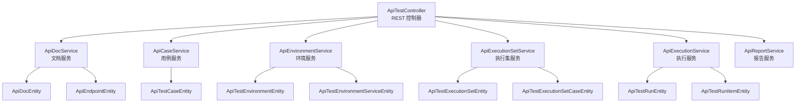
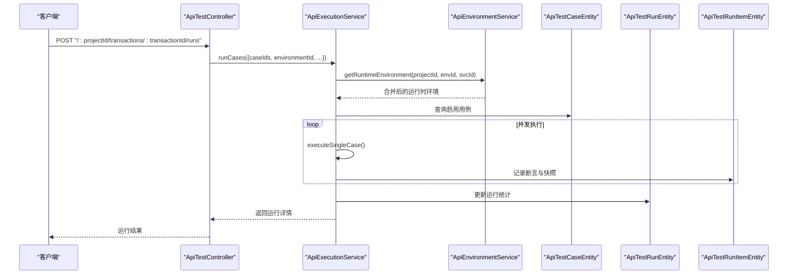
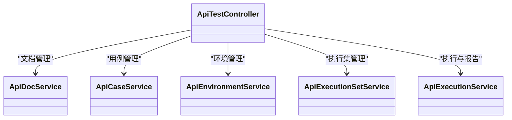

# API 测试 API

<cite>
**本文引用的文件**
- [apps/api/src/modules/api-test/controller/api-test.controller.ts](file://apps/api/src/modules/api-test/controller/api-test.controller.ts)
- [apps/api/src/modules/api-test/service/api-doc.service.ts](file://apps/api/src/modules/api-test/service/api-doc.service.ts)
- [apps/api/src/modules/api-test/service/api-case.service.ts](file://apps/api/src/modules/api-test/service/api-case.service.ts)
- [apps/api/src/modules/api-test/service/api-environment.service.ts](file://apps/api/src/modules/api-test/service/api-environment.service.ts)
- [apps/api/src/modules/api-test/service/api-execution-set.service.ts](file://apps/api/src/modules/api-test/service/api-execution-set.service.ts)
- [apps/api/src/modules/api-test/service/api-execution.service.ts](file://apps/api/src/modules/api-test/service/api-execution.service.ts)
- [apps/api/src/modules/api-test/dto/save-api-doc.dto.ts](file://apps/api/src/modules/api-test/dto/save-api-doc.dto.ts)
- [apps/api/src/modules/api-test/dto/save-api-case.dto.ts](file://apps/api/src/modules/api-test/dto/save-api-case.dto.ts)
- [apps/api/src/modules/api-test/dto/execution-platform.dto.ts](file://apps/api/src/modules/api-test/dto/execution-platform.dto.ts)
- [apps/api/src/modules/api-test/dto/save-environment.dto.ts](file://apps/api/src/modules/api-test/dto/save-environment.dto.ts)
- [apps/api/src/modules/api-test/dto/save-transaction.dto.ts](file://apps/api/src/modules/api-test/dto/save-transaction.dto.ts)
- [apps/api/src/modules/api-test/entity/api-doc.entity.ts](file://apps/api/src/modules/api-test/entity/api-doc.entity.ts)
- [apps/api/src/modules/api-test/entity/api-test-case.entity.ts](file://apps/api/src/modules/api-test/entity/api-test-case.entity.ts)
- [apps/api/src/modules/api-test/entity/api-test-environment.entity.ts](file://apps/api/src/modules/api-test/entity/api-test-environment.entity.ts)
- [apps/api/src/modules/api-test/entity/api-test-execution-set.entity.ts](file://apps/api/src/modules/api-test/entity/api-test-execution-set.entity.ts)
</cite>

## 目录
1. [简介](#简介)
2. [项目结构](#项目结构)
3. [核心组件](#核心组件)
4. [架构总览](#架构总览)
5. [详细组件分析](#详细组件分析)
6. [依赖关系分析](#依赖关系分析)
7. [性能考量](#性能考量)
8. [故障排查指南](#故障排查指南)
9. [结论](#结论)
10. [附录](#附录)

## 简介
本文件为“API 测试模块”的完整 RESTful 接口文档，覆盖以下能力：
- 接口文档管理：导入 Excel、解析结构化、自动保存、查询端点列表
- 测试用例创建与批量生成：手动创建、AI/模板生成、批量删除
- 环境配置与运行：执行环境、环境服务叠加、并发控制
- 执行集管理：执行集 CRUD、替换用例、按执行集运行
- 报告导出：支持 xlsx/pdf 导出
- 断言与变量：请求变量替换、断言执行、运行结果统计

所有接口均基于 NestJS 控制器暴露，并通过 Swagger 注解标注。

## 项目结构
API 测试模块采用分层设计：
- 控制器层：统一暴露 RESTful 端点
- 服务层：封装业务逻辑（文档、用例、环境、执行集、执行、报告）
- DTO 层：输入输出参数校验与文档注解
- 实体层：TypeORM 映射数据库表结构

图表来源
- [apps/api/src/modules/api-test/controller/api-test.controller.ts:56-507](file://apps/api/src/modules/api-test/controller/api-test.controller.ts#L56-L507)
- [apps/api/src/modules/api-test/service/api-doc.service.ts:29-248](file://apps/api/src/modules/api-test/service/api-doc.service.ts#L29-L248)
- [apps/api/src/modules/api-test/service/api-case.service.ts:28-279](file://apps/api/src/modules/api-test/service/api-case.service.ts#L28-L279)
- [apps/api/src/modules/api-test/service/api-environment.service.ts:20-254](file://apps/api/src/modules/api-test/service/api-environment.service.ts#L20-L254)
- [apps/api/src/modules/api-test/service/api-execution-set.service.ts:22-197](file://apps/api/src/modules/api-test/service/api-execution-set.service.ts#L22-L197)
- [apps/api/src/modules/api-test/service/api-execution.service.ts:25-316](file://apps/api/src/modules/api-test/service/api-execution.service.ts#L25-L316)

章节来源
- [apps/api/src/modules/api-test/controller/api-test.controller.ts:56-507](file://apps/api/src/modules/api-test/controller/api-test.controller.ts#L56-L507)

## 核心组件
- ApiTestController：集中暴露所有 API 测试相关端点
- ApiDocService：文档上传、解析、结构化、保存、查询
- ApiCaseService：用例 CRUD、AI/模板生成、批量删除
- ApiEnvironmentService：执行环境 CRUD、环境服务 CRUD、运行时合并
- ApiExecutionSetService：执行集 CRUD、用例替换、最后运行状态更新
- ApiExecutionService：并发执行用例/执行集、断言、运行记录与明细
- DTO：输入输出参数校验与 Swagger 注解
- 实体：数据库持久化模型

章节来源
- [apps/api/src/modules/api-test/service/api-doc.service.ts:29-248](file://apps/api/src/modules/api-test/service/api-doc.service.ts#L29-L248)
- [apps/api/src/modules/api-test/service/api-case.service.ts:28-279](file://apps/api/src/modules/api-test/service/api-case.service.ts#L28-L279)
- [apps/api/src/modules/api-test/service/api-environment.service.ts:20-254](file://apps/api/src/modules/api-test/service/api-environment.service.ts#L20-L254)
- [apps/api/src/modules/api-test/service/api-execution-set.service.ts:22-197](file://apps/api/src/modules/api-test/service/api-execution-set.service.ts#L22-L197)
- [apps/api/src/modules/api-test/service/api-execution.service.ts:25-316](file://apps/api/src/modules/api-test/service/api-execution.service.ts#L25-L316)

## 架构总览
下图展示控制器到服务层的调用关系及关键数据流：

图表来源
- [apps/api/src/modules/api-test/controller/api-test.controller.ts:448-462](file://apps/api/src/modules/api-test/controller/api-test.controller.ts#L448-L462)
- [apps/api/src/modules/api-test/service/api-execution.service.ts:38-114](file://apps/api/src/modules/api-test/service/api-execution.service.ts#L38-L114)

## 详细组件分析

### 接口文档管理
- 上传接口文档（Excel）
  - 方法与路径：POST /:projectId/transactions/:transactionId/document/upload
  - 查询参数：force（可选，布尔字符串）
  - 表单字段：file（xls/xlsx）
  - 成功后触发解析与结构化
  - 响应：返回文档对象（含端点列表、可进入用例/执行器标记等）
  - 状态码：200；错误：400（文件类型不支持/未选择文件）、404（交易码不存在）

- 解析并结构化文档
  - 方法与路径：POST /:projectId/transactions/:transactionId/document/structure
  - 触发从 MinIO 下载源文件并解析为端点集合
  - 响应：文档对象（含端点列表）

- 获取文档
  - 方法与路径：GET /:projectId/transactions/:transactionId/document
  - 响应：文档对象（含端点列表、临时/结构化 Markdown、上传文件访问链接）

- 自动保存结构化草稿
  - 方法与路径：PATCH /:projectId/transactions/:transactionId/document/auto-save
  - 请求体：tempStructuredMarkdown（字符串）
  - 响应：文档对象

- 保存文档
  - 方法与路径：PATCH /:projectId/transactions/:transactionId/document
  - 请求体：structuredMarkdown（字符串）或 endpoints（数组）
  - 校验：至少保留一个端点；结构化内容不能为空
  - 响应：文档对象

- 查询端点列表
  - 方法与路径：GET /:projectId/transactions/:transactionId/endpoints
  - 响应：端点数组（若文档不存在则为空数组）

- 查询上传状态
  - 方法与路径：GET /:projectId/transactions/:transactionId/upload-status
  - 响应：hasExisting（是否存在）、sourceDocName（文件名）

章节来源
- [apps/api/src/modules/api-test/controller/api-test.controller.ts:131-227](file://apps/api/src/modules/api-test/controller/api-test.controller.ts#L131-L227)
- [apps/api/src/modules/api-test/service/api-doc.service.ts:43-190](file://apps/api/src/modules/api-test/service/api-doc.service.ts#L43-L190)
- [apps/api/src/modules/api-test/dto/save-api-doc.dto.ts:5-21](file://apps/api/src/modules/api-test/dto/save-api-doc.dto.ts#L5-L21)

### 测试用例管理
- 列出用例
  - 方法与路径：GET /:projectId/transactions/:transactionId/cases
  - 支持按当前用户过滤（当提供 transactionId 时）

- 创建用例
  - 方法与路径：POST /:projectId/transactions/:transactionId/cases
  - 请求体：SaveApiCaseDto（必填：title、request.method、request.path、expected.statusCode）
  - 响应：用例对象（含关联端点信息）

- 更新用例
  - 方法与路径：PATCH /:projectId/transactions/:transactionId/cases/:caseId
  - 请求体：SaveApiCaseDto（endpointId 变更时需校验归属）
  - 响应：用例对象

- 删除用例
  - 方法与路径：DELETE /:projectId/transactions/:transactionId/cases/:caseId
  - 响应：{ ok: true }

- 批量删除交易码
  - 方法与路径：POST /:projectId/transactions/batch-delete
  - 请求体：BatchDeleteTransactionsDto（ids 数组）
  - 响应：删除结果

- 生成用例（AI/模板兜底）
  - 方法与路径：POST /:projectId/transactions/:transactionId/cases/generate
  - 请求体：GenerateApiCasesDto（endpointIds 可选）
  - 响应：{ count, cases }

章节来源
- [apps/api/src/modules/api-test/controller/api-test.controller.ts:229-276](file://apps/api/src/modules/api-test/controller/api-test.controller.ts#L229-L276)
- [apps/api/src/modules/api-test/service/api-case.service.ts:44-230](file://apps/api/src/modules/api-test/service/api-case.service.ts#L44-L230)
- [apps/api/src/modules/api-test/dto/save-api-case.dto.ts:18-92](file://apps/api/src/modules/api-test/dto/save-api-case.dto.ts#L18-L92)

### 环境配置与运行
- 列出执行环境
  - 方法与路径：GET /:projectId/environments

- 创建执行环境
  - 方法与路径：POST /:projectId/environments
  - 请求体：SaveApiEnvironmentDto（baseUrl 必填；token 仅在保存时提交，加密存储；isDefault 自动维护唯一默认）
  - 响应：环境对象（tokenMasked 用于前端显示）

- 更新执行环境
  - 方法与路径：PATCH /:projectId/environments/:environmentId
  - 请求体：SaveApiEnvironmentDto（token 存在时加密更新）
  - 响应：环境对象

- 删除执行环境
  - 方法与路径：DELETE /:projectId/environments/:environmentId
  - 响应：{ ok: true }

- 列出环境服务
  - 方法与路径：GET /:projectId/environments/:environmentId/services

- 创建环境服务
  - 方法与路径：POST /:projectId/environments/:environmentId/services
  - 请求体：SaveApiEnvironmentServiceDto（name 必填；baseUrl/pathPrefix 二选一或组合；headers/variables 叠加）
  - 响应：环境服务对象

- 更新环境服务
  - 方法与路径：PATCH /:projectId/environments/:environmentId/services/:serviceId
  - 请求体：SaveApiEnvironmentServiceDto
  - 响应：环境服务对象

- 删除环境服务
  - 方法与路径：DELETE /:projectId/environments/:environmentId/services/:serviceId
  - 响应：{ ok: true }

- 运行用例
  - 方法与路径：POST /:projectId/transactions/:transactionId/runs
  - 请求体：RunApiCasesDto（caseIds 必填；environmentId 必填；concurrency 默认 5，上限 10）
  - 响应：运行详情（包含每个用例的断言与快照）

- 运行执行集
  - 方法与路径：POST /:projectId/transactions/:transactionId/execution-sets/:setId/runs
  - 请求体：RunExecutionSetDto（environmentId 必填；concurrency 可选）
  - 响应：执行集运行详情（并回写执行集最后运行统计）

- 列出运行记录
  - 方法与路径：GET /:projectId/runs
  - 响应：最近 50 条运行记录

- 获取运行详情
  - 方法与路径：GET /:projectId/runs/:runId
  - 响应：运行记录 + 用例执行明细

章节来源
- [apps/api/src/modules/api-test/controller/api-test.controller.ts:278-475](file://apps/api/src/modules/api-test/controller/api-test.controller.ts#L278-L475)
- [apps/api/src/modules/api-test/service/api-environment.service.ts:29-135](file://apps/api/src/modules/api-test/service/api-environment.service.ts#L29-L135)
- [apps/api/src/modules/api-test/service/api-execution.service.ts:38-177](file://apps/api/src/modules/api-test/service/api-execution.service.ts#L38-L177)
- [apps/api/src/modules/api-test/dto/save-environment.dto.ts:10-43](file://apps/api/src/modules/api-test/dto/save-environment.dto.ts#L10-L43)
- [apps/api/src/modules/api-test/dto/execution-platform.dto.ts:4-69](file://apps/api/src/modules/api-test/dto/execution-platform.dto.ts#L4-L69)
- [apps/api/src/modules/api-test/dto/save-api-case.dto.ts:94-111](file://apps/api/src/modules/api-test/dto/save-api-case.dto.ts#L94-L111)

### 执行集管理
- 列出执行集
  - 方法与路径：GET /:projectId/transactions/:transactionId/execution-sets

- 创建执行集
  - 方法与路径：POST /:projectId/transactions/:transactionId/execution-sets
  - 请求体：SaveApiExecutionSetDto（name 必填；description 可选；enabled 默认 true）

- 更新执行集
  - 方法与路径：PATCH /:projectId/transactions/:transactionId/execution-sets/:setId
  - 请求体：SaveApiExecutionSetDto

- 删除执行集
  - 方法与路径：DELETE /:projectId/transactions/:transactionId/execution-sets/:setId
  - 响应：{ ok: true }

- 替换执行集用例
  - 方法与路径：PUT /:projectId/transactions/:transactionId/execution-sets/:setId/cases
  - 请求体：ReplaceExecutionSetCasesDto（caseIds 数组，去重并校验归属）
  - 响应：{ caseIds }

章节来源
- [apps/api/src/modules/api-test/controller/api-test.controller.ts:367-429](file://apps/api/src/modules/api-test/controller/api-test.controller.ts#L367-L429)
- [apps/api/src/modules/api-test/service/api-execution-set.service.ts:33-134](file://apps/api/src/modules/api-test/service/api-execution-set.service.ts#L33-L134)
- [apps/api/src/modules/api-test/dto/execution-platform.dto.ts:35-54](file://apps/api/src/modules/api-test/dto/execution-platform.dto.ts#L35-L54)

### 报告与导出
- 报告汇总
  - 方法与路径：GET /:projectId/transactions/:transactionId/reports/summary
  - 查询参数：runId（可选）
  - 响应：汇总指标（如通过数、总数、通过率等）

- 导出报告
  - 方法与路径：POST /:projectId/transactions/:transactionId/reports/export
  - 请求体：ExportApiReportDto（format: "xlsx"|"pdf"；runId 必填）
  - 响应：二进制流（xlsx/pdf），设置 Content-Type 与 Content-Disposition

章节来源
- [apps/api/src/modules/api-test/controller/api-test.controller.ts:477-505](file://apps/api/src/modules/api-test/controller/api-test.controller.ts#L477-L505)
- [apps/api/src/modules/api-test/dto/save-api-case.dto.ts:113-121](file://apps/api/src/modules/api-test/dto/save-api-case.dto.ts#L113-L121)

### 数据模型与复杂度
- 文档与端点
  - 结构化状态枚举：idle/processing/completed/failed
  - 端点排序：按 sort 字段升序
- 用例
  - 关联端点，优先级/极性/状态/启用标志等字段
- 环境与服务
  - 环境默认唯一性由服务层保证；服务可叠加 baseUrl/pathPrefix/headers/variables
- 执行集
  - 链接表维护用例顺序；最后运行统计字段便于快速概览

章节来源
- [apps/api/src/modules/api-test/entity/api-doc.entity.ts:15-80](file://apps/api/src/modules/api-test/entity/api-doc.entity.ts#L15-L80)
- [apps/api/src/modules/api-test/entity/api-test-case.entity.ts:21-94](file://apps/api/src/modules/api-test/entity/api-test-case.entity.ts#L21-L94)
- [apps/api/src/modules/api-test/entity/api-test-environment.entity.ts:10-51](file://apps/api/src/modules/api-test/entity/api-test-environment.entity.ts#L10-L51)
- [apps/api/src/modules/api-test/entity/api-test-execution-set.entity.ts:10-61](file://apps/api/src/modules/api-test/entity/api-test-execution-set.entity.ts#L10-L61)

## 依赖关系分析
- 控制器依赖各服务进行业务处理
- 服务层依赖 TypeORM Repository 进行数据持久化
- 执行服务依赖环境服务构建运行时变量与请求快照
- 执行集服务与执行服务协作完成批量运行与统计回写

图表来源
- [apps/api/src/modules/api-test/controller/api-test.controller.ts:56-68](file://apps/api/src/modules/api-test/controller/api-test.controller.ts#L56-L68)

章节来源
- [apps/api/src/modules/api-test/controller/api-test.controller.ts:56-68](file://apps/api/src/modules/api-test/controller/api-test.controller.ts#L56-L68)

## 性能考量
- 并发执行：默认并发 5，最大 10；按用例数量动态分配
- 请求超时：单次 HTTP 请求 30 秒超时
- 变量替换：深度替换与路径变量替换，避免重复计算
- 响应截断：对大响应体进行截断，防止内存膨胀
- 统计聚合：执行集运行完成后回写最后统计，减少查询成本

章节来源
- [apps/api/src/modules/api-test/service/api-execution.service.ts:22-23](file://apps/api/src/modules/api-test/service/api-execution.service.ts#L22-L23)

## 故障排查指南
- 上传文档
  - 错误：未选择文件/扩展名不支持 → 400
  - 解决：确保文件为 xls/xlsx，或传 force=true 覆盖
- 结构化失败
  - 现象：processing 后变为 failed，附带错误信息
  - 解决：检查 Excel 内容是否包含 METHOD+路径或标准表格
- 用例生成
  - 错误：未指定交易码或无可用端点 → 400
  - AI 失败时回退模板生成，确保有基础用例
- 环境与服务
  - 错误：环境服务不存在或禁用 → 404
  - 默认环境缺失时自动补设
- 执行
  - 错误：未找到可执行启用用例 → 400
  - 请求异常：记录 error 状态与错误消息
- 报告导出
  - 确保 runId 对应的运行记录存在且已完成

章节来源
- [apps/api/src/modules/api-test/service/api-doc.service.ts:54-124](file://apps/api/src/modules/api-test/service/api-doc.service.ts#L54-L124)
- [apps/api/src/modules/api-test/service/api-case.service.ts:162-230](file://apps/api/src/modules/api-test/service/api-case.service.ts#L162-L230)
- [apps/api/src/modules/api-test/service/api-environment.service.ts:87-135](file://apps/api/src/modules/api-test/service/api-environment.service.ts#L87-L135)
- [apps/api/src/modules/api-test/service/api-execution.service.ts:38-114](file://apps/api/src/modules/api-test/service/api-execution.service.ts#L38-L114)

## 结论
本模块提供了完整的 API 测试生命周期管理：从接口文档导入与结构化，到用例生成与执行，再到执行集编排与报告导出。通过环境与环境服务的灵活叠加，满足多场景、多服务的测试需求；通过并发执行与断言机制，保障测试效率与质量。

## 附录

### 端点一览与规范
- 路径参数
  - :projectId：项目 ID（UUID）
  - :transactionId：交易码 ID（UUID）
  - :environmentId：执行环境 ID（UUID）
  - :environmentServiceId：环境服务 ID（UUID）
  - :setId：执行集 ID（UUID）
  - :caseId：用例 ID（UUID）
  - :runId：运行记录 ID（UUID）

- 公共响应
  - 成功：200；部分写入型操作可能返回 201
  - 客户端错误：400（参数/业务校验失败）
  - 未授权/资源不存在：401/403/404
  - 服务器错误：500

- 文件上传
  - Content-Type：multipart/form-data
  - 支持扩展：xls、xlsx
  - 上传后存于 MinIO，返回访问 URL

- 并发与限流
  - 单次运行最大并发 10，默认 5
  - 单次请求超时 30 秒

- 变量与断言
  - 变量来源：环境 variables + secrets（加密存储）
  - 断言：基于 expected 配置与实际响应比对
  - 请求快照：脱敏头（Authorization/Token/Secret 等）

章节来源
- [apps/api/src/modules/api-test/controller/api-test.controller.ts:52-507](file://apps/api/src/modules/api-test/controller/api-test.controller.ts#L52-L507)
- [apps/api/src/modules/api-test/service/api-execution.service.ts:22-23](file://apps/api/src/modules/api-test/service/api-execution.service.ts#L22-L23)