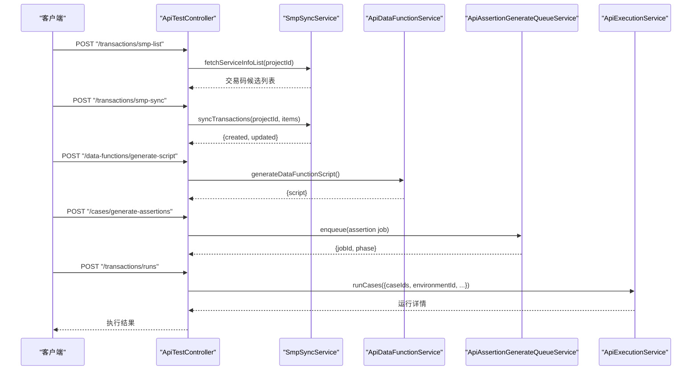
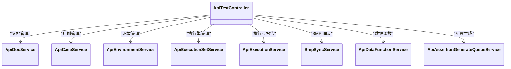

# API 测试 API

<cite>
**本文引用的文件**
- [apps/api/src/modules/api-test/controller/api-test.controller.ts](file://apps/api/src/modules/api-test/controller/api-test.controller.ts)
- [apps/api/src/modules/api-test/service/smp-sync.service.ts](file://apps/api/src/modules/api-test/service/smp-sync.service.ts)
- [apps/api/src/modules/api-test/service/api-data-function.service.ts](file://apps/api/src/modules/api-test/service/api-data-function.service.ts)
- [apps/api/src/modules/api-test/service/api-assertion-generate-queue.service.ts](file://apps/api/src/modules/api-test/service/api-assertion-generate-queue.service.ts)
- [apps/api/src/modules/api-test/dto/smp-sync-transactions.dto.ts](file://apps/api/src/modules/api-test/dto/smp-sync-transactions.dto.ts)
- [apps/api/src/modules/api-test/dto/save-data-function.dto.ts](file://apps/api/src/modules/api-test/dto/save-data-function.dto.ts)
- [apps/api/src/modules/api-test/service/api-doc.service.ts](file://apps/api/src/modules/api-test/service/api-doc.service.ts)
- [apps/api/src/modules/api-test/service/api-case.service.ts](file://apps/api/src/modules/api-test/service/api-case.service.ts)
- [apps/api/src/modules/api-test/service/api-environment.service.ts](file://apps/api/src/modules/api-test/service/api-environment.service.ts)
- [apps/api/src/modules/api-test/service/api-execution-set.service.ts](file://apps/api/src/modules/api-test/service/api-execution-set.service.ts)
- [apps/api/src/modules/api-test/service/api-execution.service.ts](file://apps/api/src/modules/api-test/service/api-execution.service.ts)
</cite>

## 更新摘要
**变更内容**
- 新增服务管理平台（SMP）同步功能：交易码候选列表获取、批量同步、详情刷新与变更检测
- 新增数据函数管理：数据库连接管理、SQL/脚本函数执行、内置函数模板、AI 生成脚本
- 新增断言生成队列：基于 AI 的响应体断言自动生成、任务状态查询与结果获取
- 增强测试执行能力：调试运行、步骤调试记录、批量请求配置修改
- 新增步骤库管理：API 用例步骤的增删改查

## 目录
1. [简介](#简介)
2. [项目结构](#项目结构)
3. [核心组件](#核心组件)
4. [架构总览](#架构总览)
5. [详细组件分析](#详细组件分析)
6. [依赖关系分析](#依赖关系分析)
7. [性能考量](#性能考量)
8. [故障排查指南](#故障排查指南)
9. [结论](#结论)
10. [附录](#附录)

## 简介
本文件为"API 测试模块"的完整 RESTful 接口文档，覆盖以下能力：
- 接口文档管理：导入 Excel、解析结构化、自动保存、查询端点列表
- 测试用例创建与批量生成：手动创建、AI/模板生成、批量删除
- 环境配置与运行：执行环境、环境服务叠加、并发控制
- 执行集管理：执行集 CRUD、替换用例、按执行集运行
- 报告导出：支持 xlsx/pdf 导出
- 断言与变量：请求变量替换、断言执行、运行结果统计
- **新增**：服务管理平台（SMP）集成：交易码同步、详情刷新、变更检测
- **新增**：数据函数管理：数据库连接、SQL/脚本函数、内置函数模板、AI 脚本生成
- **新增**：断言生成队列：AI 驱动的响应体断言自动生成与管理
- **新增**：调试执行：单案例调试、步骤调试记录、批量请求配置修改

所有接口均基于 NestJS 控制器暴露，并通过 Swagger 注解标注。

## 项目结构
API 测试模块采用分层设计：
- 控制器层：统一暴露 RESTful 端点
- 服务层：封装业务逻辑（文档、用例、环境、执行集、执行、报告、SMP 同步、数据函数、断言队列）
- DTO 层：输入输出参数校验与文档注解
- 实体层：TypeORM 映射数据库表结构

```mermaid
graph TB
C["ApiTestController<br/>REST 控制器"] --> D["ApiDocService<br/>文档服务"]
C --> K["ApiCaseService<br/>用例服务"]
C --> E["ApiEnvironmentService<br/>环境服务"]
C --> S["ApiExecutionSetService<br/>执行集服务"]
C --> X["ApiExecutionService<br/>执行服务"]
C --> R["ApiReportService<br/>报告服务"]
C --> SMP["SmpSyncService<br/>SMP 同步服务"]
C --> DF["ApiDataFunctionService<br/>数据函数服务"]
C --> AQ["ApiAssertionGenerateQueueService<br/>断言生成队列"]
D --> ED["ApiDocEntity"]
D --> EP["ApiEndpointEntity"]
K --> EC["ApiTestCaseEntity"]
E --> ENV["ApiTestEnvironmentEntity"]
E --> SV["ApiTestEnvironmentServiceEntity"]
S --> SET["ApiTestExecutionSetEntity"]
S --> SETC["ApiTestExecutionSetCaseEntity"]
X --> RUN["ApiTestRunEntity"]
X --> RUNI["ApiTestRunItemEntity"]
SMP --> STX["ApiTransactionEntity"]
DF --> DBCONN["ApiDatabaseConnectionEntity"]
DF --> DFUNC["ApiDataFunctionEntity"]
AQ --> AJOB["ApiAssertionGenerateJobEntity"]
```

图表来源
- [apps/api/src/modules/api-test/controller/api-test.controller.ts:77-95](file://apps/api/src/modules/api-test/controller/api-test.controller.ts#L77-L95)
- [apps/api/src/modules/api-test/service/smp-sync.service.ts:47-60](file://apps/api/src/modules/api-test/service/smp-sync.service.ts#L47-L60)
- [apps/api/src/modules/api-test/service/api-data-function.service.ts:115-120](file://apps/api/src/modules/api-test/service/api-data-function.service.ts#L115-L120)
- [apps/api/src/modules/api-test/service/api-assertion-generate-queue.service.ts:49-53](file://apps/api/src/modules/api-test/service/api-assertion-generate-queue.service.ts#L49-L53)

章节来源
- [apps/api/src/modules/api-test/controller/api-test.controller.ts:77-95](file://apps/api/src/modules/api-test/controller/api-test.controller.ts#L77-L95)

## 核心组件
- ApiTestController：集中暴露所有 API 测试相关端点
- ApiDocService：文档上传、解析、结构化、保存、查询
- ApiCaseService：用例 CRUD、AI/模板生成、批量删除
- ApiEnvironmentService：执行环境 CRUD、环境服务 CRUD、运行时合并
- ApiExecutionSetService：执行集 CRUD、用例替换、最后运行状态更新
- ApiExecutionService：并发执行用例/执行集、断言、运行记录与明细
- **新增** SmpSyncService：服务管理平台数据同步、交易码候选列表获取、详情刷新与变更检测
- **新增** ApiDataFunctionService：数据库连接管理、SQL/脚本函数执行、内置函数模板、AI 脚本生成
- **新增** ApiAssertionGenerateQueueService：AI 断言生成队列管理、任务调度、状态查询
- DTO：输入输出参数校验与 Swagger 注解
- 实体：数据库持久化模型

章节来源
- [apps/api/src/modules/api-test/service/smp-sync.service.ts:47-60](file://apps/api/src/modules/api-test/service/smp-sync.service.ts#L47-L60)
- [apps/api/src/modules/api-test/service/api-data-function.service.ts:115-120](file://apps/api/src/modules/api-test/service/api-data-function.service.ts#L115-L120)
- [apps/api/src/modules/api-test/service/api-assertion-generate-queue.service.ts:49-53](file://apps/api/src/modules/api-test/service/api-assertion-generate-queue.service.ts#L49-L53)

## 架构总览
下图展示控制器到服务层的调用关系及关键数据流：

```mermaid
sequenceDiagram
participant Client as "客户端"
participant Ctrl as "ApiTestController"
participant SMP as "SmpSyncService"
participant DF as "ApiDataFunctionService"
participant AQ as "ApiAssertionGenerateQueueService"
participant Exec as "ApiExecutionService"
Client->>Ctrl : POST "/transactions/smp-list"
Ctrl->>SMP : fetchServiceInfoList(projectId)
SMP-->>Ctrl : 交易码候选列表
Client->>Ctrl : POST "/transactions/smp-sync"
Ctrl->>SMP : syncTransactions(projectId, items)
SMP-->>Ctrl : {created, updated}
Client->>Ctrl : POST "/data-functions/generate-script"
Ctrl->>DF : generateDataFunctionScript()
DF-->>Ctrl : {script}
Client->>Ctrl : POST "/cases/generate-assertions"
Ctrl->>AQ : enqueue(assertion job)
AQ-->>Ctrl : {jobId, phase}
Client->>Ctrl : POST "/transactions/runs"
Ctrl->>Exec : runCases({caseIds, environmentId, ...})
Exec-->>Ctrl : 运行详情
Ctrl-->>Client : 执行结果
```

图表来源
- [apps/api/src/modules/api-test/controller/api-test.controller.ts:277-290](file://apps/api/src/modules/api-test/controller/api-test.controller.ts#L277-L290)
- [apps/api/src/modules/api-test/controller/api-test.controller.ts:194-214](file://apps/api/src/modules/api-test/controller/api-test.controller.ts#L194-L214)
- [apps/api/src/modules/api-test/controller/api-test.controller.ts:816-847](file://apps/api/src/modules/api-test/controller/api-test.controller.ts#L816-L847)
- [apps/api/src/modules/api-test/controller/api-test.controller.ts:906-923](file://apps/api/src/modules/api-test/controller/api-test.controller.ts#L906-L923)

## 详细组件分析

### 服务管理平台（SMP）同步
- 拉取交易码候选列表
  - 方法与路径：POST /:projectId/transactions/smp-list
  - 响应：交易码候选数组（包含 code、name、description、reqCode、taskId、serviceCode、reqSystemId 等字段）
  - 错误：项目未配置需求编号时返回 400

- 同步选中的服管交易码到本地
  - 方法与路径：POST /:projectId/transactions/smp-sync
  - 请求体：SmpSyncTransactionsDto（items 数组，包含交易码选择信息）
  - 响应：{ created: number; updated: number }
  - 事务处理：批量 upsert，保持排序顺序

- 从服管平台刷新交易详情并检测变更
  - 方法与路径：POST /:projectId/transactions/:transactionId/smp-refresh
  - 响应：{ changed: boolean; needsRegenerate: boolean; syncStatus; callServiceList; serviceTestList; approvalInfoList }
  - 变更检测：通过 hash 对比上次拉取的数据，标记是否需要重新生成

章节来源
- [apps/api/src/modules/api-test/controller/api-test.controller.ts:277-302](file://apps/api/src/modules/api-test/controller/api-test.controller.ts#L277-L302)
- [apps/api/src/modules/api-test/service/smp-sync.service.ts:65-166](file://apps/api/src/modules/api-test/service/smp-sync.service.ts#L65-L166)
- [apps/api/src/modules/api-test/service/smp-sync.service.ts:192-322](file://apps/api/src/modules/api-test/service/smp-sync.service.ts#L192-L322)
- [apps/api/src/modules/api-test/dto/smp-sync-transactions.dto.ts:54-63](file://apps/api/src/modules/api-test/dto/smp-sync-transactions.dto.ts#L54-L63)

### 数据函数管理
- 数据库连接管理
  - 列出连接：GET /:projectId/database-connections
  - 创建连接：POST /:projectId/database-connections
  - 更新连接：PATCH /:projectId/database-connections/:id
  - 删除连接：DELETE /:projectId/database-connections/:id
  - 测试连接：POST /:projectId/database-connections/:id/test
  - 获取元数据：GET /:projectId/database-connections/:id/metadata

- 数据函数管理
  - 列出函数：GET /:projectId/data-functions
  - 创建函数：POST /:projectId/data-functions
  - 更新函数：PATCH /:projectId/data-functions/:id
  - 删除函数：DELETE /:projectId/data-functions/:id
  - 预览函数：POST /:projectId/data-functions/preview
  - AI 生成脚本：POST /:projectId/data-functions/generate-script

- 内置函数模板
  - DATE_YYYYMMDD：当前日期 yyyyMMdd
  - DATETIME_YYYYMMDDHHMMSS：当前日期时间 yyyyMMddHHmmss
  - TIMESTAMP_MS：当前毫秒时间戳
  - UUID：UUID v4
  - RANDOM_4：四位随机数字

- 支持的数据库类型
  - MySQL 系列：MariaDB、MySQL、TiDB、OceanBase-MySQL、GoldenDB、GaussDB-MySQL
  - PostgreSQL 系列：PostgreSQL、KingbaseES、GaussDB
  - Oracle 系列：Oracle、OceanBase-Oracle
  - 其他：DM8

章节来源
- [apps/api/src/modules/api-test/controller/api-test.controller.ts:120-214](file://apps/api/src/modules/api-test/controller/api-test.controller.ts#L120-L214)
- [apps/api/src/modules/api-test/service/api-data-function.service.ts:122-263](file://apps/api/src/modules/api-test/service/api-data-function.service.ts#L122-L263)
- [apps/api/src/modules/api-test/service/api-data-function.service.ts:265-486](file://apps/api/src/modules/api-test/service/api-data-function.service.ts#L265-L486)
- [apps/api/src/modules/api-test/dto/save-data-function.dto.ts:15-58](file://apps/api/src/modules/api-test/dto/save-data-function.dto.ts#L15-L58)

### 断言生成队列
- 入队生成断言
  - 方法与路径：POST /:projectId/transactions/:transactionId/cases/generate-assertions
  - 请求体：{ caseId?, transport, messageFormat, polarity, statusCode, headers, body }
  - 响应：{ jobId, phase }
  - 队列机制：异步处理，支持取消和状态查询

- 查询断言生成任务状态
  - 方法与路径：GET /:projectId/transactions/:transactionId/cases/generate-assertions/status
  - 查询参数：caseId?、jobId?
  - 响应：{ jobId, phase, queuePosition, estimatedWaitSeconds, elapsedSeconds, resultCount?, errorMessage?, globalQueuedCount, globalRunningCount, slotWaitingCount }

- 获取断言生成结果
  - 方法与路径：GET /:projectId/transactions/:transactionId/cases/generate-assertions/result
  - 查询参数：caseId?、jobId?
  - 响应：{ assertions: ApiAssertion[] }

- 取消断言生成任务
  - 方法与路径：POST /:projectId/transactions/:transactionId/cases/generate-assertions/cancel
  - 请求体：{ caseId?, jobId? }
  - 响应：{ ok: true }

章节来源
- [apps/api/src/modules/api-test/controller/api-test.controller.ts:816-904](file://apps/api/src/modules/api-test/controller/api-test.controller.ts#L816-L904)
- [apps/api/src/modules/api-test/service/api-assertion-generate-queue.service.ts:83-146](file://apps/api/src/modules/api-test/service/api-assertion-generate-queue.service.ts#L83-L146)
- [apps/api/src/modules/api-test/service/api-assertion-generate-queue.service.ts:148-266](file://apps/api/src/modules/api-test/service/api-assertion-generate-queue.service.ts#L148-L266)

### 调试执行与步骤库
- 调试执行单案例
  - 方法与路径：POST /:projectId/transactions/:transactionId/cases/debug-run
  - 请求体：{ request, expected?, polarity?, environmentId?, target?, stepId?, environmentServiceId?, caseId?, encoding? }
  - 特性：不保存执行记录，支持步骤调试记录持久化

- 步骤调试记录管理
  - 列出记录：GET /:projectId/cases/:caseId/steps/:stepId/debug-records
  - 清理记录：DELETE /:projectId/cases/:caseId/steps/:stepId/debug-records

- 步骤库管理
  - 列出步骤库：GET /api-test/step-library
  - 创建步骤库：POST /api-test/step-library
  - 更新步骤库：PATCH /api-test/step-library/:id
  - 删除步骤库：DELETE /api-test/step-library/:id

- 批量修改用例请求配置
  - 方法与路径：PATCH /:projectId/transactions/:transactionId/cases/request-config
  - 请求体：BatchPatchApiCaseRequestDto（caseIds、patch、environmentId、environmentServiceId、encoding）

章节来源
- [apps/api/src/modules/api-test/controller/api-test.controller.ts:97-118](file://apps/api/src/modules/api-test/controller/api-test.controller.ts#L97-L118)
- [apps/api/src/modules/api-test/controller/api-test.controller.ts:433-448](file://apps/api/src/modules/api-test/controller/api-test.controller.ts#L433-L448)
- [apps/api/src/modules/api-test/controller/api-test.controller.ts:757-814](file://apps/api/src/modules/api-test/controller/api-test.controller.ts#L757-L814)

### 接口文档管理
- 上传接口文档（Excel）
  - 方法与路径：POST /:projectId/transactions/:transactionId/document/upload
  - 查询参数：force（可选，布尔字符串）
  - 表单字段：file（xls/xlsx）
  - 成功后触发解析与结构化
  - 响应：返回文档对象（含端点列表、可进入用例/执行器标记等）
  - 状态码：200；错误：400（文件类型不支持/未选择文件）、404（交易码不存在）

- 解析并结构化文档
  - 方法与路径：POST /:projectId/transactions/:transactionId/document/structure
  - 触发从 MinIO 下载源文件并解析为端点集合
  - 响应：文档对象（含端点列表）

- 获取文档
  - 方法与路径：GET /:projectId/transactions/:transactionId/document
  - 响应：文档对象（含端点列表、临时/结构化 Markdown、上传文件访问链接）

- 自动保存结构化草稿
  - 方法与路径：PATCH /:projectId/transactions/:transactionId/document/auto-save
  - 请求体：tempStructuredMarkdown（字符串）
  - 响应：文档对象

- 保存文档
  - 方法与路径：PATCH /:projectId/transactions/:transactionId/document
  - 请求体：structuredMarkdown（字符串）或 endpoints（数组）
  - 校验：至少保留一个端点；结构化内容不能为空
  - 响应：文档对象

- 查询端点列表
  - 方法与路径：GET /:projectId/transactions/:transactionId/endpoints
  - 响应：端点数组（若文档不存在则为空数组）

- 查询上传状态
  - 方法与路径：GET /:projectId/transactions/:transactionId/upload-status
  - 响应：hasExisting（是否存在）、sourceDocName（文件名）

章节来源
- [apps/api/src/modules/api-test/controller/api-test.controller.ts:304-413](file://apps/api/src/modules/api-test/controller/api-test.controller.ts#L304-L413)
- [apps/api/src/modules/api-test/service/api-doc.service.ts:43-190](file://apps/api/src/modules/api-test/service/api-doc.service.ts#L43-L190)

### 测试用例管理
- 列出用例
  - 方法与路径：GET /:projectId/transactions/:transactionId/cases
  - 支持按当前用户过滤（当提供 transactionId 时）

- 创建用例
  - 方法与路径：POST /:projectId/transactions/:transactionId/cases
  - 请求体：SaveApiCaseDto（必填：title、request.method、request.path、expected.statusCode）
  - 响应：用例对象（含关联端点信息）

- 更新用例
  - 方法与路径：PATCH /:projectId/transactions/:transactionId/cases/:caseId
  - 请求体：SaveApiCaseDto（endpointId 变更时需校验归属）
  - 响应：用例对象

- 删除用例
  - 方法与路径：DELETE /:projectId/transactions/:transactionId/cases/:caseId
  - 响应：{ ok: true }

- 批量删除交易码
  - 方法与路径：POST /:projectId/transactions/batch-delete
  - 请求体：BatchDeleteTransactionsDto（ids 数组）
  - 响应：删除结果

- 生成用例（AI/模板兜底）
  - 方法与路径：POST /:projectId/transactions/:transactionId/cases/generate
  - 请求体：GenerateApiCasesDto（endpointIds 可选）
  - 响应：{ count, cases }

章节来源
- [apps/api/src/modules/api-test/controller/api-test.controller.ts:415-564](file://apps/api/src/modules/api-test/controller/api-test.controller.ts#L415-L564)
- [apps/api/src/modules/api-test/service/api-case.service.ts:44-230](file://apps/api/src/modules/api-test/service/api-case.service.ts#L44-L230)

### 环境配置与运行
- 列出执行环境
  - 方法与路径：GET /:projectId/environments

- 创建执行环境
  - 方法与路径：POST /:projectId/environments
  - 请求体：SaveApiEnvironmentDto（baseUrl 必填；token 仅在保存时提交，加密存储；isDefault 自动维护唯一默认）
  - 响应：环境对象（tokenMasked 用于前端显示）

- 更新执行环境
  - 方法与路径：PATCH /:projectId/environments/:environmentId
  - 请求体：SaveApiEnvironmentDto（token 存在时加密更新）
  - 响应：环境对象

- 删除执行环境
  - 方法与路径：DELETE /:projectId/environments/:environmentId
  - 响应：{ ok: true }

- 列出环境服务
  - 方法与路径：GET /:projectId/environments/:environmentId/services

- 创建环境服务
  - 方法与路径：POST /:projectId/environments/:environmentId/services
  - 请求体：SaveApiEnvironmentServiceDto（name 必填；baseUrl/pathPrefix 二选一或组合；headers/variables 叠加）
  - 响应：环境服务对象

- 更新环境服务
  - 方法与路径：PATCH /:projectId/environments/:environmentId/services/:serviceId
  - 请求体：SaveApiEnvironmentServiceDto
  - 响应：环境服务对象

- 删除环境服务
  - 方法与路径：DELETE /:projectId/environments/:environmentId/services/:serviceId
  - 响应：{ ok: true }

- 运行用例
  - 方法与路径：POST /:projectId/transactions/:transactionId/runs
  - 请求体：RunApiCasesDto（caseIds 必填；environmentId 必填；concurrency 默认 5，上限 10）
  - 响应：运行详情（包含每个用例的断言与快照）

- 运行执行集
  - 方法与路径：POST /:projectId/transactions/:transactionId/execution-sets/:setId/runs
  - 请求体：RunExecutionSetDto（environmentId 必填；concurrency 可选）
  - 响应：执行集运行详情（并回写执行集最后运行统计）

- 列出运行记录
  - 方法与路径：GET /:projectId/runs
  - 响应：最近 50 条运行记录

- 获取运行详情
  - 方法与路径：GET /:projectId/runs/:runId
  - 响应：运行记录 + 用例执行明细

章节来源
- [apps/api/src/modules/api-test/controller/api-test.controller.ts:566-755](file://apps/api/src/modules/api-test/controller/api-test.controller.ts#L566-L755)
- [apps/api/src/modules/api-test/service/api-environment.service.ts:29-135](file://apps/api/src/modules/api-test/service/api-environment.service.ts#L29-L135)
- [apps/api/src/modules/api-test/service/api-execution.service.ts:38-177](file://apps/api/src/modules/api-test/service/api-execution.service.ts#L38-L177)

### 执行集管理
- 列出执行集
  - 方法与路径：GET /:projectId/transactions/:transactionId/execution-sets

- 创建执行集
  - 方法与路径：POST /:projectId/transactions/:transactionId/execution-sets
  - 请求体：SaveApiExecutionSetDto（name 必填；description 可选；enabled 默认 true）

- 更新执行集
  - 方法与路径：PATCH /:projectId/transactions/:transactionId/execution-sets/:setId
  - 请求体：SaveApiExecutionSetDto

- 删除执行集
  - 方法与路径：DELETE /:projectId/transactions/:transactionId/execution-sets/:setId
  - 响应：{ ok: true }

- 替换执行集用例
  - 方法与路径：PUT /:projectId/transactions/:transactionId/execution-sets/:setId/cases
  - 请求体：ReplaceExecutionSetCasesDto（caseIds 数组，去重并校验归属）
  - 响应：{ caseIds }

章节来源
- [apps/api/src/modules/api-test/controller/api-test.controller.ts:670-737](file://apps/api/src/modules/api-test/controller/api-test.controller.ts#L670-L737)
- [apps/api/src/modules/api-test/service/api-execution-set.service.ts:33-134](file://apps/api/src/modules/api-test/service/api-execution-set.service.ts#L33-L134)

### 报告与导出
- 报告汇总
  - 方法与路径：GET /:projectId/transactions/:transactionId/reports/summary
  - 查询参数：runId（可选）
  - 响应：汇总指标（如通过数、总数、通过率等）

- 导出报告
  - 方法与路径：POST /:projectId/transactions/:transactionId/reports/export
  - 请求体：ExportApiReportDto（format: "xlsx"|"pdf"；runId 必填）
  - 响应：二进制流（xlsx/pdf），设置 Content-Type 与 Content-Disposition

章节来源
- [apps/api/src/modules/api-test/controller/api-test.controller.ts:943-971](file://apps/api/src/modules/api-test/controller/api-test.controller.ts#L943-L971)

### 数据模型与复杂度
- 文档与端点
  - 结构化状态枚举：idle/processing/completed/failed
  - 端点排序：按 sort 字段升序
- 用例
  - 关联端点，优先级/极性/状态/启用标志等字段
- 环境与服务
  - 环境默认唯一性由服务层保证；服务可叠加 baseUrl/pathPrefix/headers/variables
- 执行集
  - 链接表维护用例顺序；最后运行统计字段便于快速概览
- **新增** SMP 交易码
  - 同步状态：pending/success/changed/failed/cancelled
  - 变更检测：通过 hash 对比服务调用信息和测试信息
- **新增** 数据函数
  - 支持 SQL、JavaScript、Python 脚本执行
  - 内置函数模板：日期、时间戳、UUID、随机数
- **新增** 断言生成任务
  - 任务状态：queued/running/completed/failed/cancelled
  - 队列管理：并发控制、位置估算、等待时间计算

章节来源
- [apps/api/src/modules/api-test/entity/api-doc.entity.ts:15-80](file://apps/api/src/modules/api-test/entity/api-doc.entity.ts#L15-L80)
- [apps/api/src/modules/api-test/entity/api-test-case.entity.ts:21-94](file://apps/api/src/modules/api-test/entity/api-test-case.entity.ts#L21-L94)
- [apps/api/src/modules/api-test/entity/api-test-environment.entity.ts:10-51](file://apps/api/src/modules/api-test/entity/api-test-environment.entity.ts#L10-L51)
- [apps/api/src/modules/api-test/entity/api-test-execution-set.entity.ts:10-61](file://apps/api/src/modules/api-test/entity/api-test-execution-set.entity.ts#L10-L61)

## 依赖关系分析
- 控制器依赖各服务进行业务处理
- 服务层依赖 TypeORM Repository 进行数据持久化
- 执行服务依赖环境服务构建运行时变量与请求快照
- 执行集服务与执行服务协作完成批量运行与统计回写
- **新增** SMP 同步服务依赖服务管理平台客户端进行数据拉取
- **新增** 数据函数服务支持多种数据库驱动和脚本执行引擎
- **新增** 断言生成队列服务集成 AI 工作流进行智能断言生成

```mermaid
classDiagram
class ApiTestController
class ApiDocService
class ApiCaseService
class ApiEnvironmentService
class ApiExecutionSetService
class ApiExecutionService
class SmpSyncService
class ApiDataFunctionService
class ApiAssertionGenerateQueueService
ApiTestController --> ApiDocService : "文档管理"
ApiTestController --> ApiCaseService : "用例管理"
ApiTestController --> ApiEnvironmentService : "环境管理"
ApiTestController --> ApiExecutionSetService : "执行集管理"
ApiTestController --> ApiExecutionService : "执行与报告"
ApiTestController --> SmpSyncService : "SMP 同步"
ApiTestController --> ApiDataFunctionService : "数据函数"
ApiTestController --> ApiAssertionGenerateQueueService : "断言生成"
```

图表来源
- [apps/api/src/modules/api-test/controller/api-test.controller.ts:77-95](file://apps/api/src/modules/api-test/controller/api-test.controller.ts#L77-L95)

章节来源
- [apps/api/src/modules/api-test/controller/api-test.controller.ts:77-95](file://apps/api/src/modules/api-test/controller/api-test.controller.ts#L77-L95)

## 性能考量
- 并发执行：默认并发 5，最大 10；按用例数量动态分配
- 请求超时：单次 HTTP 请求 30 秒超时
- 变量替换：深度替换与路径变量替换，避免重复计算
- 响应截断：对大响应体进行截断，防止内存膨胀
- 统计聚合：执行集运行完成后回写最后统计，减少查询成本
- **新增** 队列管理：断言生成任务使用数据库队列，支持并发控制和恢复
- **新增** 脚本执行：JavaScript/Python 脚本执行限制 2 秒超时，防止长时间运行
- **新增** 数据库连接：连接池大小限制为 1，防止资源耗尽

章节来源
- [apps/api/src/modules/api-test/service/api-execution.service.ts:22-23](file://apps/api/src/modules/api-test/service/api-execution.service.ts#L22-L23)
- [apps/api/src/modules/api-test/service/api-assertion-generate-queue.service.ts:268-281](file://apps/api/src/modules/api-test/service/api-assertion-generate-queue.service.ts#L268-L281)
- [apps/api/src/modules/api-test/service/api-data-function.service.ts:372-440](file://apps/api/src/modules/api-test/service/api-data-function.service.ts#L372-L440)

## 故障排查指南
- 上传文档
  - 错误：未选择文件/扩展名不支持 → 400
  - 解决：确保文件为 xls/xlsx，或传 force=true 覆盖
- 结构化失败
  - 现象：processing 后变为 failed，附带错误信息
  - 解决：检查 Excel 内容是否包含 METHOD+路径或标准表格
- 用例生成
  - 错误：未指定交易码或无可用端点 → 400
  - AI 失败时回退模板生成，确保有基础用例
- 环境与服务
  - 错误：环境服务不存在或禁用 → 404
  - 默认环境缺失时自动补设
- 执行
  - 错误：未找到可执行启用用例 → 400
  - 请求异常：记录 error 状态与错误消息
- 报告导出
  - 确保 runId 对应的运行记录存在且已完成
- **新增** SMP 同步
  - 错误：项目未配置需求编号 → 400
  - 错误：SMP API 调用失败 → 检查网络连接和认证配置
  - 变更检测：通过 hash 对比判断数据是否变化
- **新增** 数据函数
  - 错误：数据库连接失败 → 检查连接配置和网络
  - 错误：SQL 语法错误 → 验证 SQL 语句格式
  - 错误：脚本执行超时 → 优化脚本逻辑，避免复杂计算
- **新增** 断言生成
  - 错误：AI Chat 未配置 → 检查 AI_CHAT_URL 环境变量
  - 错误：队列任务失败 → 查看任务状态和错误信息

章节来源
- [apps/api/src/modules/api-test/service/api-doc.service.ts:54-124](file://apps/api/src/modules/api-test/service/api-doc.service.ts#L54-L124)
- [apps/api/src/modules/api-test/service/api-case.service.ts:162-230](file://apps/api/src/modules/api-test/service/api-case.service.ts#L162-L230)
- [apps/api/src/modules/api-test/service/api-environment.service.ts:87-135](file://apps/api/src/modules/api-test/service/api-environment.service.ts#L87-L135)
- [apps/api/src/modules/api-test/service/api-execution.service.ts:38-114](file://apps/api/src/modules/api-test/service/api-execution.service.ts#L38-L114)
- [apps/api/src/modules/api-test/service/smp-sync.service.ts:65-166](file://apps/api/src/modules/api-test/service/smp-sync.service.ts#L65-L166)
- [apps/api/src/modules/api-test/service/api-data-function.service.ts:165-210](file://apps/api/src/modules/api-test/service/api-data-function.service.ts#L165-L210)
- [apps/api/src/modules/api-test/service/api-assertion-generate-queue.service.ts:299-348](file://apps/api/src/modules/api-test/service/api-assertion-generate-queue.service.ts#L299-L348)

## 结论
本模块提供了完整的 API 测试生命周期管理：从接口文档导入与结构化，到用例生成与执行，再到执行集编排与报告导出。通过环境与环境服务的灵活叠加，满足多场景、多服务的测试需求；通过并发执行与断言机制，保障测试效率与质量。

**新增功能**进一步增强了系统的企业级集成能力：
- 服务管理平台（SMP）集成实现了与企业服务治理平台的无缝对接
- 数据函数管理提供了强大的数据处理和转换能力
- 断言生成队列利用 AI 技术提升了测试用例的智能化水平
- 调试执行功能为开发和测试人员提供了便捷的调试工具

这些新功能共同构成了一个更加完善、智能、高效的 API 测试解决方案。

## 附录

### 端点一览与规范
- 路径参数
  - :projectId：项目 ID（UUID）
  - :transactionId：交易码 ID（UUID）
  - :environmentId：执行环境 ID（UUID）
  - :environmentServiceId：环境服务 ID（UUID）
  - :setId：执行集 ID（UUID）
  - :caseId：用例 ID（UUID）
  - :runId：运行记录 ID（UUID）

- 公共响应
  - 成功：200；部分写入型操作可能返回 201
  - 客户端错误：400（参数/业务校验失败）
  - 未授权/资源不存在：401/403/404
  - 服务器错误：500

- 文件上传
  - Content-Type：multipart/form-data
  - 支持扩展：xls、xlsx
  - 上传后存于 MinIO，返回访问 URL

- 并发与限流
  - 单次运行最大并发 10，默认 5
  - 单次请求超时 30 秒

- 变量与断言
  - 变量来源：环境 variables + secrets（加密存储）
  - 断言：基于 expected 配置与实际响应比对
  - 请求快照：脱敏头（Authorization/Token/Secret 等）

- **新增** SMP 同步
  - 需要项目配置需求编号才能同步
  - 支持增量同步和变更检测
  - 事务保证数据一致性

- **新增** 数据函数
  - 支持多种数据库类型的连接
  - JavaScript/Python 脚本安全执行
  - 内置函数模板快速生成常用数据

- **新增** 断言生成
  - 基于 AI 的智能断言生成
  - 队列化管理，支持并发控制
  - 任务状态跟踪和结果获取

章节来源
- [apps/api/src/modules/api-test/controller/api-test.controller.ts:52-971](file://apps/api/src/modules/api-test/controller/api-test.controller.ts#L52-L971)
- [apps/api/src/modules/api-test/service/api-execution.service.ts:22-23](file://apps/api/src/modules/api-test/service/api-execution.service.ts#L22-L23)