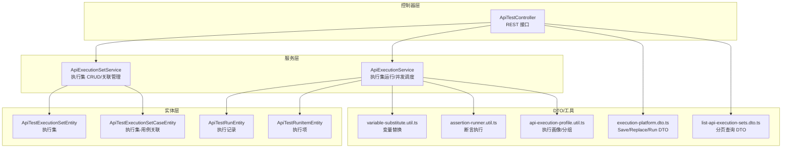
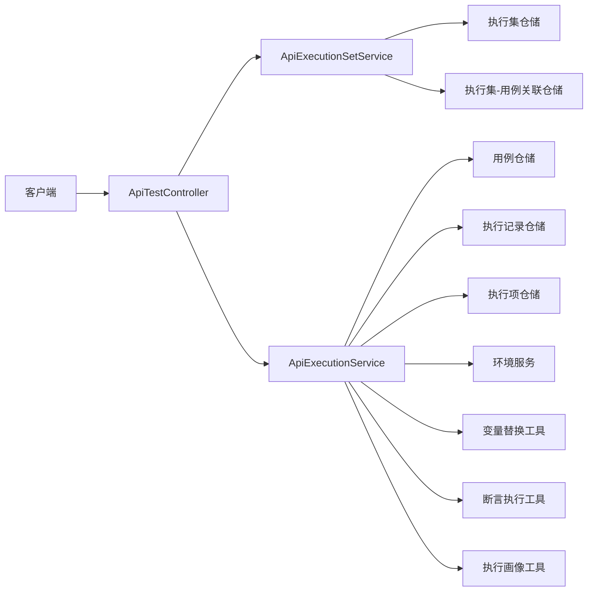
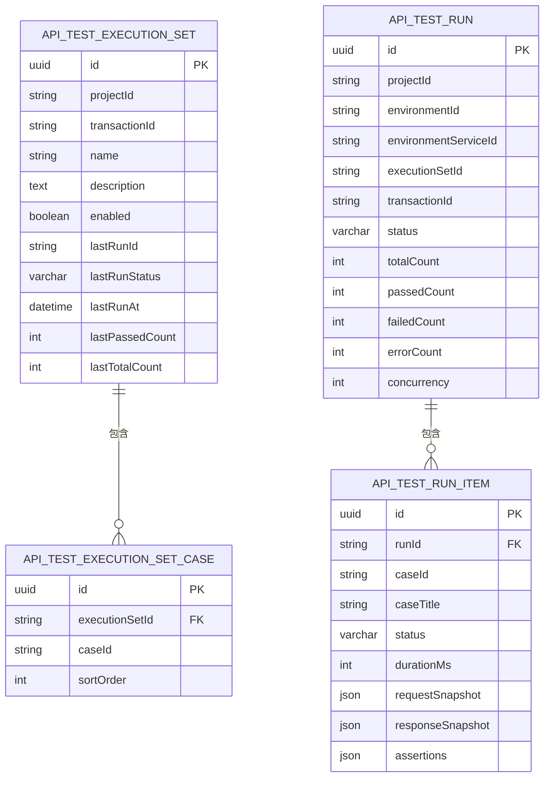
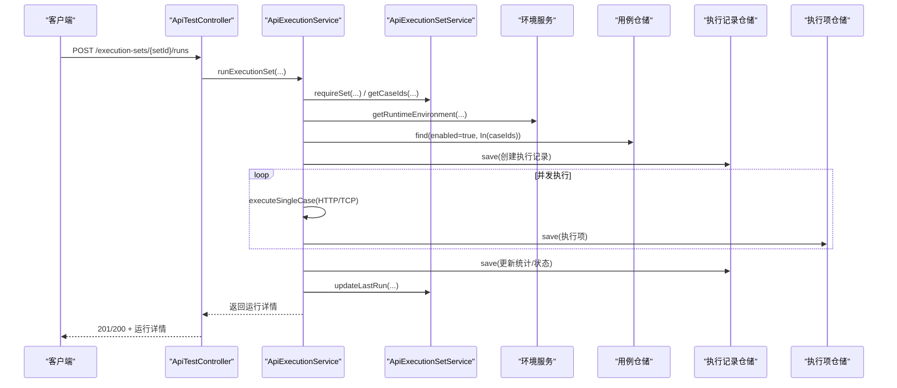
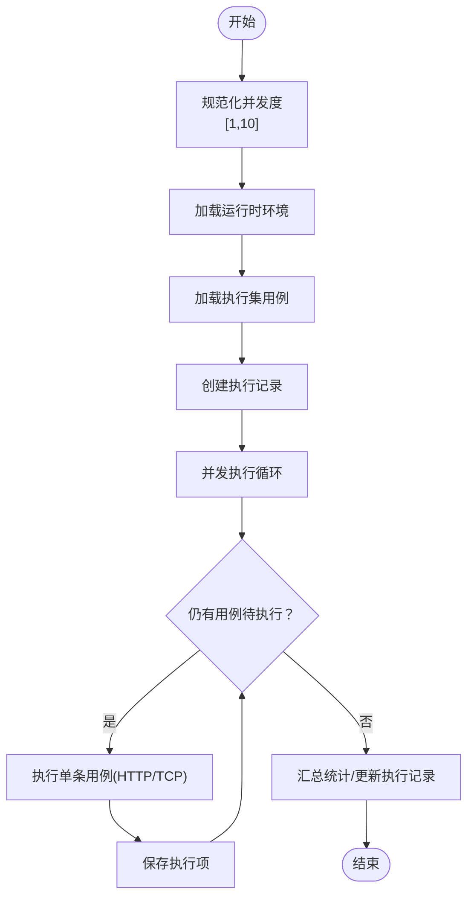
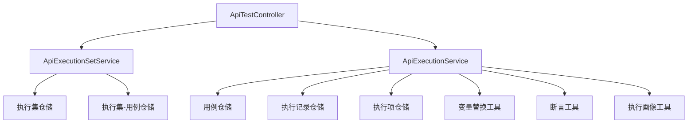

# 执行集管理

<cite>
**本文引用的文件**
- [apps/api/src/modules/api-test/controller/api-test.controller.ts](file://apps/api/src/modules/api-test/controller/api-test.controller.ts)
- [apps/api/src/modules/api-test/service/api-execution-set.service.ts](file://apps/api/src/modules/api-test/service/api-execution-set.service.ts)
- [apps/api/src/modules/api-test/service/api-execution.service.ts](file://apps/api/src/modules/api-test/service/api-execution.service.ts)
- [apps/api/src/modules/api-test/dto/execution-platform.dto.ts](file://apps/api/src/modules/api-test/dto/execution-platform.dto.ts)
- [apps/api/src/modules/api-test/dto/list-api-execution-sets.dto.ts](file://apps/api/src/modules/api-test/dto/list-api-execution-sets.dto.ts)
- [apps/api/src/modules/api-test/entity/api-test-execution-set.entity.ts](file://apps/api/src/modules/api-test/entity/api-test-execution-set.entity.ts)
- [apps/api/src/modules/api-test/entity/api-test-execution-set-case.entity.ts](file://apps/api/src/modules/api-test/entity/api-test-execution-set-case.entity.ts)
- [apps/api/src/modules/api-test/entity/api-test-run.entity.ts](file://apps/api/src/modules/api-test/entity/api-test-run.entity.ts)
- [apps/api/src/modules/api-test/entity/api-test-run-item.entity.ts](file://apps/api/src/modules/api-test/entity/api-test-run-item.entity.ts)
- [packages/shared/src/api-execution-profile.util.ts](file://packages/shared/src/api-execution-profile.util.ts)
- [apps/api/src/modules/api-test/util/variable-substitute.util.ts](file://apps/api/src/modules/api-test/util/variable-substitute.util.ts)
- [apps/api/src/modules/api-test/util/assertion-runner.util.ts](file://apps/api/src/modules/api-test/util/assertion-runner.util.ts)
</cite>

## 目录
1. [简介](#简介)
2. [项目结构](#项目结构)
3. [核心组件](#核心组件)
4. [架构总览](#架构总览)
5. [详细组件分析](#详细组件分析)
6. [依赖分析](#依赖分析)
7. [性能考虑](#性能考虑)
8. [故障排查指南](#故障排查指南)
9. [结论](#结论)
10. [附录](#附录)

## 简介
本文件为“执行集管理”模块的完整 API 文档，覆盖执行集的创建、更新、删除、查询与运行接口；执行集与用例的关联关系、执行顺序控制、并发配置与执行策略；执行集运行流程、批量替换用例、执行集复制与模板化能力；以及调度算法、资源分配与性能优化的技术说明。读者无需深入源码即可理解如何通过 API 管理执行集及其运行。

## 项目结构
执行集管理相关代码主要位于后端应用的 API 模块中，采用按功能域分层组织：
- 控制器层：暴露 REST 接口，负责路由与参数校验
- 服务层：封装业务逻辑，包括执行集管理与执行调度
- 实体层：定义数据库表结构及索引
- DTO 层：定义请求/响应数据结构与校验规则
- 工具层：变量替换、断言执行等通用能力

图表来源
- [apps/api/src/modules/api-test/controller/api-test.controller.ts:422-503](file://apps/api/src/modules/api-test/controller/api-test.controller.ts#L422-L503)
- [apps/api/src/modules/api-test/service/api-execution-set.service.ts:29-100](file://apps/api/src/modules/api-test/service/api-execution-set.service.ts#L29-L100)
- [apps/api/src/modules/api-test/service/api-execution.service.ts:54-182](file://apps/api/src/modules/api-test/service/api-execution.service.ts#L54-L182)
- [apps/api/src/modules/api-test/entity/api-test-execution-set.entity.ts:10-61](file://apps/api/src/modules/api-test/entity/api-test-execution-set.entity.ts#L10-L61)
- [apps/api/src/modules/api-test/entity/api-test-execution-set-case.entity.ts:9-29](file://apps/api/src/modules/api-test/entity/api-test-execution-set-case.entity.ts#L9-L29)
- [apps/api/src/modules/api-test/entity/api-test-run.entity.ts:11-61](file://apps/api/src/modules/api-test/entity/api-test-run.entity.ts#L11-L61)
- [apps/api/src/modules/api-test/entity/api-test-run-item.entity.ts:13-58](file://apps/api/src/modules/api-test/entity/api-test-run-item.entity.ts#L13-L58)
- [apps/api/src/modules/api-test/dto/execution-platform.dto.ts:106-147](file://apps/api/src/modules/api-test/dto/execution-platform.dto.ts#L106-L147)
- [apps/api/src/modules/api-test/dto/list-api-execution-sets.dto.ts:6-20](file://apps/api/src/modules/api-test/dto/list-api-execution-sets.dto.ts#L6-L20)
- [packages/shared/src/api-execution-profile.util.ts:198-239](file://packages/shared/src/api-execution-profile.util.ts#L198-L239)
- [apps/api/src/modules/api-test/util/variable-substitute.util.ts:1-43](file://apps/api/src/modules/api-test/util/variable-substitute.util.ts#L1-L43)
- [apps/api/src/modules/api-test/util/assertion-runner.util.ts:62-106](file://apps/api/src/modules/api-test/util/assertion-runner.util.ts#L62-L106)

章节来源
- [apps/api/src/modules/api-test/controller/api-test.controller.ts:422-503](file://apps/api/src/modules/api-test/controller/api-test.controller.ts#L422-L503)
- [apps/api/src/modules/api-test/service/api-execution-set.service.ts:29-100](file://apps/api/src/modules/api-test/service/api-execution-set.service.ts#L29-L100)
- [apps/api/src/modules/api-test/service/api-execution.service.ts:54-182](file://apps/api/src/modules/api-test/service/api-execution.service.ts#L54-L182)

## 核心组件
- 执行集实体：存储执行集元数据、启用状态、最近一次运行统计等
- 关联实体：记录执行集中用例的排序与归属
- 执行记录实体：记录一次执行的整体状态、并发度、计数与完成时间
- 执行项实体：记录单个用例的执行结果、断言与快照
- 执行集服务：提供执行集 CRUD、用例替换、用例 ID 查询、最后运行更新
- 执行服务：提供执行集运行、并发调度、HTTP/TCP 执行、断言与结果聚合
- DTO：定义保存、替换、运行、分页查询的数据结构与约束
- 工具：变量替换、断言执行、执行画像与分组

章节来源
- [apps/api/src/modules/api-test/entity/api-test-execution-set.entity.ts:10-61](file://apps/api/src/modules/api-test/entity/api-test-execution-set.entity.ts#L10-L61)
- [apps/api/src/modules/api-test/entity/api-test-execution-set-case.entity.ts:9-29](file://apps/api/src/modules/api-test/entity/api-test-execution-set-case.entity.ts#L9-L29)
- [apps/api/src/modules/api-test/entity/api-test-run.entity.ts:11-61](file://apps/api/src/modules/api-test/entity/api-test-run.entity.ts#L11-L61)
- [apps/api/src/modules/api-test/entity/api-test-run-item.entity.ts:13-58](file://apps/api/src/modules/api-test/entity/api-test-run-item.entity.ts#L13-L58)
- [apps/api/src/modules/api-test/service/api-execution-set.service.ts:29-245](file://apps/api/src/modules/api-test/service/api-execution-set.service.ts#L29-L245)
- [apps/api/src/modules/api-test/service/api-execution.service.ts:54-492](file://apps/api/src/modules/api-test/service/api-execution.service.ts#L54-L492)
- [apps/api/src/modules/api-test/dto/execution-platform.dto.ts:106-147](file://apps/api/src/modules/api-test/dto/execution-platform.dto.ts#L106-L147)
- [apps/api/src/modules/api-test/dto/list-api-execution-sets.dto.ts:6-20](file://apps/api/src/modules/api-test/dto/list-api-execution-sets.dto.ts#L6-L20)
- [packages/shared/src/api-execution-profile.util.ts:198-239](file://packages/shared/src/api-execution-profile.util.ts#L198-L239)
- [apps/api/src/modules/api-test/util/variable-substitute.util.ts:1-43](file://apps/api/src/modules/api-test/util/variable-substitute.util.ts#L1-L43)
- [apps/api/src/modules/api-test/util/assertion-runner.util.ts:62-106](file://apps/api/src/modules/api-test/util/assertion-runner.util.ts#L62-L106)

## 架构总览
执行集管理遵循“控制器-服务-实体”的分层架构，控制器负责路由与参数校验，服务层处理业务逻辑，实体层映射数据库表。执行集运行由执行服务统一调度，支持 HTTP/TCP 两种传输协议，并通过并发模型提升吞吐。

图表来源
- [apps/api/src/modules/api-test/controller/api-test.controller.ts:422-503](file://apps/api/src/modules/api-test/controller/api-test.controller.ts#L422-L503)
- [apps/api/src/modules/api-test/service/api-execution-set.service.ts:29-37](file://apps/api/src/modules/api-test/service/api-execution-set.service.ts#L29-L37)
- [apps/api/src/modules/api-test/service/api-execution.service.ts:54-64](file://apps/api/src/modules/api-test/service/api-execution.service.ts#L54-L64)
- [apps/api/src/modules/api-test/entity/api-test-execution-set.entity.ts:10-61](file://apps/api/src/modules/api-test/entity/api-test-execution-set.entity.ts#L10-L61)
- [apps/api/src/modules/api-test/entity/api-test-execution-set-case.entity.ts:9-29](file://apps/api/src/modules/api-test/entity/api-test-execution-set-case.entity.ts#L9-L29)
- [apps/api/src/modules/api-test/entity/api-test-run.entity.ts:11-61](file://apps/api/src/modules/api-test/entity/api-test-run.entity.ts#L11-L61)
- [apps/api/src/modules/api-test/entity/api-test-run-item.entity.ts:13-58](file://apps/api/src/modules/api-test/entity/api-test-run-item.entity.ts#L13-L58)
- [apps/api/src/modules/api-test/util/variable-substitute.util.ts:1-43](file://apps/api/src/modules/api-test/util/variable-substitute.util.ts#L1-L43)
- [apps/api/src/modules/api-test/util/assertion-runner.util.ts:62-106](file://apps/api/src/modules/api-test/util/assertion-runner.util.ts#L62-L106)
- [packages/shared/src/api-execution-profile.util.ts:198-239](file://packages/shared/src/api-execution-profile.util.ts#L198-L239)

## 详细组件分析

### 执行集 API 定义
- 列出执行集
  - 方法与路径：GET /api-test/{projectId}/transactions/{transactionId}/execution-sets
  - 查询参数：page、pageSize（受分页选项约束）
  - 返回：分页列表，包含每个执行集的用例数量与用例 ID 列表
  - 复杂度：一次查询执行集列表 + 一次查询关联用例（按排序升序），随后进行可见性过滤与孤儿链接清理
- 创建执行集
  - 方法与路径：POST /api-test/{projectId}/transactions/{transactionId}/execution-sets
  - 请求体：SaveApiExecutionSetDto（名称、描述、启用状态）
  - 返回：执行集详情（公开字段）
- 更新执行集
  - 方法与路径：PATCH /api-test/{projectId}/transactions/{transactionId}/execution-sets/{setId}
  - 请求体：SaveApiExecutionSetDto（名称、描述、启用状态可选）
  - 返回：更新后的执行集详情
- 删除执行集
  - 方法与路径：DELETE /api-test/{projectId}/transactions/{transactionId}/execution-sets/{setId}
  - 行为：级联删除执行集-用例关联与执行集本身
  - 返回：{ ok: true }
- 替换执行集中的用例
  - 方法与路径：PUT /api-test/{projectId}/transactions/{transactionId}/execution-sets/{setId}/cases
  - 请求体：ReplaceExecutionSetCasesDto（用例 ID 数组）
  - 行为：去重后校验用例归属，清空旧关联并按数组顺序写入新关联
  - 返回：新的用例 ID 列表与数量
- 运行执行集
  - 方法与路径：POST /api-test/{projectId}/transactions/{transactionId}/execution-sets/{setId}/runs
  - 请求体：RunExecutionSetDto（环境 ID、可选服务 ID、并发度、编码）
  - 行为：读取执行集内用例 ID，委托执行服务运行，完成后更新执行集最近运行统计

章节来源
- [apps/api/src/modules/api-test/controller/api-test.controller.ts:422-503](file://apps/api/src/modules/api-test/controller/api-test.controller.ts#L422-L503)
- [apps/api/src/modules/api-test/dto/execution-platform.dto.ts:106-147](file://apps/api/src/modules/api-test/dto/execution-platform.dto.ts#L106-L147)
- [apps/api/src/modules/api-test/dto/list-api-execution-sets.dto.ts:6-20](file://apps/api/src/modules/api-test/dto/list-api-execution-sets.dto.ts#L6-L20)
- [apps/api/src/modules/api-test/service/api-execution-set.service.ts:102-166](file://apps/api/src/modules/api-test/service/api-execution-set.service.ts#L102-L166)
- [apps/api/src/modules/api-test/service/api-execution.service.ts:145-182](file://apps/api/src/modules/api-test/service/api-execution.service.ts#L145-L182)

### 执行集与用例的关联关系
- 关联实体包含执行集 ID、用例 ID 与排序字段，保证执行顺序
- 查询执行集时会返回其关联用例 ID 列表与数量，用于前端展示
- 替换用例时按数组顺序写入排序字段，实现顺序控制
- 可见性校验确保仅对当前用户在指定交易码下可见的用例进行操作

图表来源
- [apps/api/src/modules/api-test/entity/api-test-execution-set.entity.ts:10-61](file://apps/api/src/modules/api-test/entity/api-test-execution-set.entity.ts#L10-L61)
- [apps/api/src/modules/api-test/entity/api-test-execution-set-case.entity.ts:9-29](file://apps/api/src/modules/api-test/entity/api-test-execution-set-case.entity.ts#L9-L29)
- [apps/api/src/modules/api-test/entity/api-test-run.entity.ts:11-61](file://apps/api/src/modules/api-test/entity/api-test-run.entity.ts#L11-L61)
- [apps/api/src/modules/api-test/entity/api-test-run-item.entity.ts:13-58](file://apps/api/src/modules/api-test/entity/api-test-run-item.entity.ts#L13-L58)

章节来源
- [apps/api/src/modules/api-test/entity/api-test-execution-set.entity.ts:10-61](file://apps/api/src/modules/api-test/entity/api-test-execution-set.entity.ts#L10-L61)
- [apps/api/src/modules/api-test/entity/api-test-execution-set-case.entity.ts:9-29](file://apps/api/src/modules/api-test/entity/api-test-execution-set-case.entity.ts#L9-L29)
- [apps/api/src/modules/api-test/entity/api-test-run.entity.ts:11-61](file://apps/api/src/modules/api-test/entity/api-test-run.entity.ts#L11-L61)
- [apps/api/src/modules/api-test/entity/api-test-run-item.entity.ts:13-58](file://apps/api/src/modules/api-test/entity/api-test-run-item.entity.ts#L13-L58)

### 执行集运行流程
- 控制器接收运行请求，解析并发度与编码
- 执行服务加载运行时环境，读取执行集内用例 ID 并校验
- 使用并发模型逐个执行用例，分别处理 HTTP 与 TCP 场景
- 记录执行项结果与断言，汇总统计并更新执行记录
- 最终返回运行详情

图表来源
- [apps/api/src/modules/api-test/controller/api-test.controller.ts:487-503](file://apps/api/src/modules/api-test/controller/api-test.controller.ts#L487-L503)
- [apps/api/src/modules/api-test/service/api-execution.service.ts:145-182](file://apps/api/src/modules/api-test/service/api-execution.service.ts#L145-L182)
- [apps/api/src/modules/api-test/service/api-execution-set.service.ts:176-192](file://apps/api/src/modules/api-test/service/api-execution-set.service.ts#L176-L192)

章节来源
- [apps/api/src/modules/api-test/controller/api-test.controller.ts:487-503](file://apps/api/src/modules/api-test/controller/api-test.controller.ts#L487-L503)
- [apps/api/src/modules/api-test/service/api-execution.service.ts:66-182](file://apps/api/src/modules/api-test/service/api-execution.service.ts#L66-L182)
- [apps/api/src/modules/api-test/service/api-execution-set.service.ts:176-192](file://apps/api/src/modules/api-test/service/api-execution-set.service.ts#L176-L192)

### 并发配置与调度算法
- 并发度范围：最小 1，最大 10，默认 5
- 调度模型：固定大小并发池，按顺序分发用例，所有协程并行执行直至完成
- 超时控制：HTTP 请求默认超时 30 秒；TCP 请求同样使用默认超时
- 编码处理：根据请求/服务/环境配置应用 Content-Type 的字符集，或使用 GBK 等编码发送 TCP 报文

图表来源
- [apps/api/src/modules/api-test/service/api-execution.service.ts:66-143](file://apps/api/src/modules/api-test/service/api-execution.service.ts#L66-L143)
- [apps/api/src/modules/api-test/service/api-execution.service.ts:477-491](file://apps/api/src/modules/api-test/service/api-execution.service.ts#L477-L491)

章节来源
- [apps/api/src/modules/api-test/service/api-execution.service.ts:24-26](file://apps/api/src/modules/api-test/service/api-execution.service.ts#L24-L26)
- [apps/api/src/modules/api-test/service/api-execution.service.ts:66-143](file://apps/api/src/modules/api-test/service/api-execution.service.ts#L66-L143)
- [apps/api/src/modules/api-test/service/api-execution.service.ts:477-491](file://apps/api/src/modules/api-test/service/api-execution.service.ts#L477-L491)

### 批量替换用例与执行顺序控制
- 替换接口会去重输入用例 ID，并校验其归属与存在性
- 清空旧关联后按数组顺序写入新关联，sortOrder 即为执行顺序
- 查询执行集时按 sortOrder 升序、创建时间升序返回用例

章节来源
- [apps/api/src/modules/api-test/service/api-execution-set.service.ts:140-166](file://apps/api/src/modules/api-test/service/api-execution-set.service.ts#L140-L166)
- [apps/api/src/modules/api-test/service/api-execution-set.service.ts:168-174](file://apps/api/src/modules/api-test/service/api-execution-set.service.ts#L168-L174)

### 执行策略与环境配置
- 环境服务提供运行时环境（基础 URL、头部、变量、密钥、服务列表等）
- 支持 HTTP 与 TCP 两种传输；TCP 可配置长度前缀帧格式与编码
- 内容类型与字符集自动推断或显式指定；敏感头信息脱敏输出
- 执行画像工具用于汇总不同传输/格式的用例分布，辅助批量执行策略制定

章节来源
- [apps/api/src/modules/api-test/service/api-execution.service.ts:83-87](file://apps/api/src/modules/api-test/service/api-execution.service.ts#L83-L87)
- [apps/api/src/modules/api-test/service/api-execution.service.ts:228-418](file://apps/api/src/modules/api-test/service/api-execution.service.ts#L228-L418)
- [packages/shared/src/api-execution-profile.util.ts:198-239](file://packages/shared/src/api-execution-profile.util.ts#L198-L239)

### 执行集复制与模板化
- 当前仓库未提供直接的“复制执行集”或“模板化执行集”的接口
- 可通过以下方式间接实现：
  - 先创建新执行集（POST）
  - 获取原执行集用例 ID（查询接口或内部方法）
  - 使用替换接口将用例复制到新执行集（PUT）
- 若需跨交易码复用，可在替换时校验用例归属并按需调整

章节来源
- [apps/api/src/modules/api-test/controller/api-test.controller.ts:431-485](file://apps/api/src/modules/api-test/controller/api-test.controller.ts#L431-L485)
- [apps/api/src/modules/api-test/service/api-execution-set.service.ts:102-166](file://apps/api/src/modules/api-test/service/api-execution-set.service.ts#L102-L166)

## 依赖分析
- 控制器依赖服务：ApiTestController 依赖 ApiExecutionSetService 与 ApiExecutionService
- 服务依赖仓储：执行集服务依赖执行集与关联实体仓储；执行服务依赖用例、执行记录与执行项仓储
- 工具依赖：执行服务依赖变量替换与断言工具；共享包提供执行画像工具
- 数据一致性：执行集删除时级联删除关联；执行项删除时级联删除

图表来源
- [apps/api/src/modules/api-test/controller/api-test.controller.ts:61-72](file://apps/api/src/modules/api-test/controller/api-test.controller.ts#L61-L72)
- [apps/api/src/modules/api-test/service/api-execution-set.service.ts:30-37](file://apps/api/src/modules/api-test/service/api-execution-set.service.ts#L30-L37)
- [apps/api/src/modules/api-test/service/api-execution.service.ts:55-64](file://apps/api/src/modules/api-test/service/api-execution.service.ts#L55-L64)

章节来源
- [apps/api/src/modules/api-test/controller/api-test.controller.ts:61-72](file://apps/api/src/modules/api-test/controller/api-test.controller.ts#L61-L72)
- [apps/api/src/modules/api-test/service/api-execution-set.service.ts:30-37](file://apps/api/src/modules/api-test/service/api-execution-set.service.ts#L30-L37)
- [apps/api/src/modules/api-test/service/api-execution.service.ts:55-64](file://apps/api/src/modules/api-test/service/api-execution.service.ts#L55-L64)

## 性能考虑
- 并发度上限与默认值：限制最大并发避免资源争用，合理设置默认并发以平衡吞吐与稳定性
- 超时控制：HTTP/TCP 默认超时减少长时间阻塞，提高系统可用性
- 编码处理：优先使用 UTF-8，必要时使用 iconv 支持其他编码，避免乱码与传输错误
- 结果截断：响应体过大时截断输出，降低存储与序列化开销
- 索引设计：执行集与执行记录均具备高效查询索引，减少分页与筛选成本
- 变量替换与断言：深度替换与断言执行为 O(n) 遍历，建议在用例规模较大时关注 JSON Path 性能

章节来源
- [apps/api/src/modules/api-test/service/api-execution.service.ts:24-26](file://apps/api/src/modules/api-test/service/api-execution.service.ts#L24-L26)
- [apps/api/src/modules/api-test/service/api-execution.service.ts:509-537](file://apps/api/src/modules/api-test/service/api-execution.service.ts#L509-L537)
- [apps/api/src/modules/api-test/service/api-execution.service.ts:606-610](file://apps/api/src/modules/api-test/service/api-execution.service.ts#L606-L610)
- [apps/api/src/modules/api-test/entity/api-test-execution-set.entity.ts:11-15](file://apps/api/src/modules/api-test/entity/api-test-execution-set.entity.ts#L11-L15)
- [apps/api/src/modules/api-test/entity/api-test-run.entity.ts:12-12](file://apps/api/src/modules/api-test/entity/api-test-run.entity.ts#L12-L12)

## 故障排查指南
- 执行集不存在：requireSet 抛出未找到异常
- 用例不可见或不属于当前交易码：替换用例时校验失败，提示部分案例不存在、已删除或归属不符
- 执行集为空：运行前校验用例列表，若为空则抛出异常
- 环境配置错误：HTTP 需要 http(s):// 基础地址；TCP 需要 host:port；缺失或格式错误会抛出异常
- 请求失败：HTTP/TCP 执行异常会被捕获并记录错误断言与错误信息
- 断言未通过：根据期望状态码、响应体与耗时断言生成明细

章节来源
- [apps/api/src/modules/api-test/service/api-execution-set.service.ts:194-202](file://apps/api/src/modules/api-test/service/api-execution-set.service.ts#L194-L202)
- [apps/api/src/modules/api-test/service/api-execution-set.service.ts:204-220](file://apps/api/src/modules/api-test/service/api-execution-set.service.ts#L204-L220)
- [apps/api/src/modules/api-test/service/api-execution.service.ts:153-164](file://apps/api/src/modules/api-test/service/api-execution.service.ts#L153-L164)
- [apps/api/src/modules/api-test/service/api-execution.service.ts:436-475](file://apps/api/src/modules/api-test/service/api-execution.service.ts#L436-L475)
- [apps/api/src/modules/api-test/service/api-execution.service.ts:306-330](file://apps/api/src/modules/api-test/service/api-execution.service.ts#L306-L330)
- [apps/api/src/modules/api-test/util/assertion-runner.util.ts:62-106](file://apps/api/src/modules/api-test/util/assertion-runner.util.ts#L62-L106)

## 结论
执行集管理模块提供了完善的执行集生命周期管理与运行调度能力，支持用例顺序控制、并发配置与多协议执行。通过清晰的分层架构与严格的参数校验，系统在易用性与可靠性之间取得良好平衡。对于复制与模板化场景，可通过现有接口组合实现；未来可扩展复制接口以进一步提升效率。

## 附录
- 分页参数：page 最小为 1，pageSize 受预设选项约束
- 执行画像：支持按传输与格式分组统计，辅助批量执行策略制定
- 变量替换：支持嵌套对象与数组的递归替换，便于动态参数注入

章节来源
- [apps/api/src/modules/api-test/dto/list-api-execution-sets.dto.ts:6-20](file://apps/api/src/modules/api-test/dto/list-api-execution-sets.dto.ts#L6-L20)
- [packages/shared/src/api-execution-profile.util.ts:258-279](file://packages/shared/src/api-execution-profile.util.ts#L258-L279)
- [apps/api/src/modules/api-test/util/variable-substitute.util.ts:13-31](file://apps/api/src/modules/api-test/util/variable-substitute.util.ts#L13-L31)