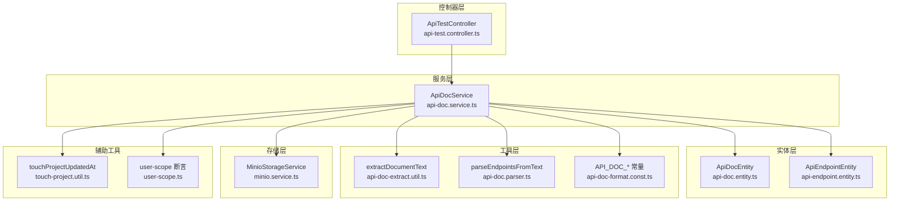
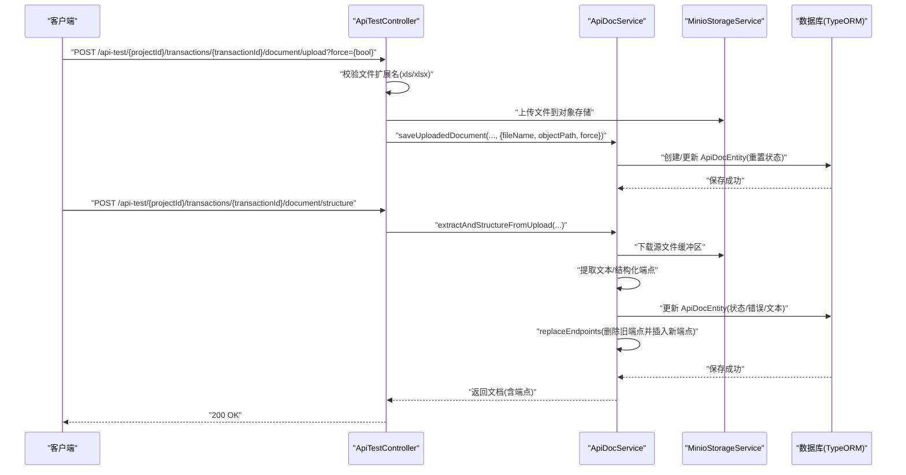
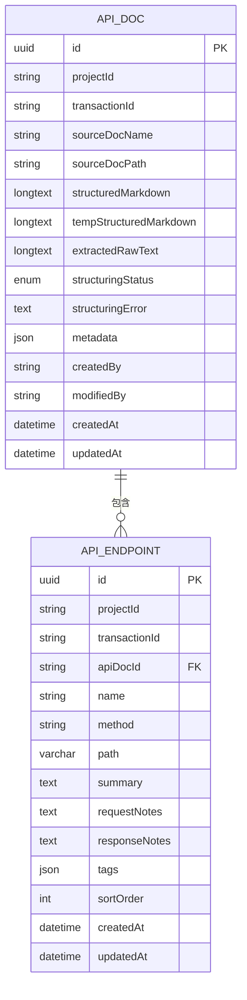
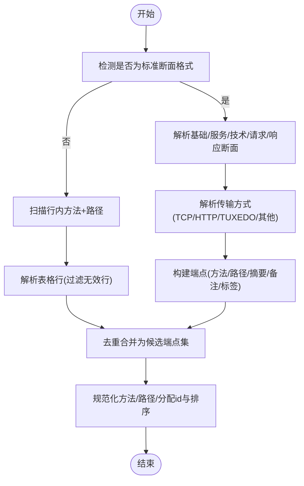
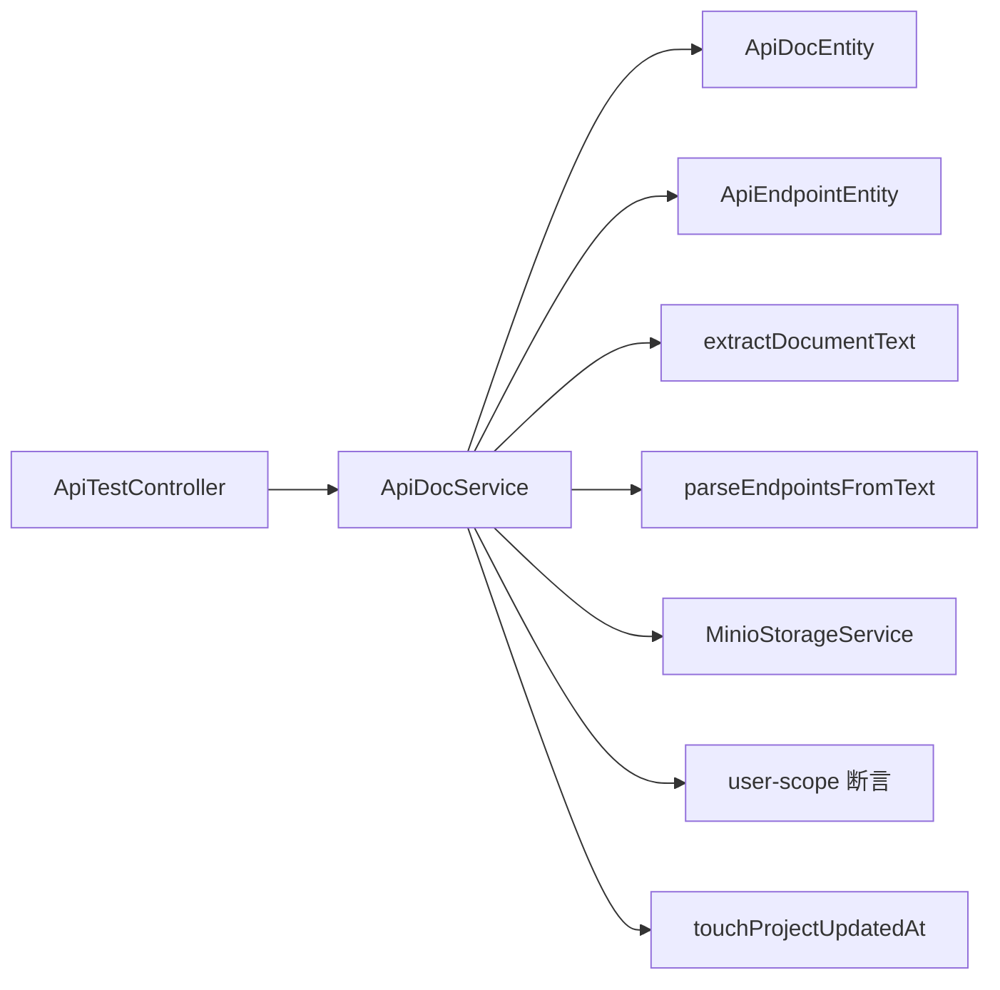

# 接口文档管理

<cite>
**本文引用的文件**
- [apps/api/src/modules/api-test/controller/api-test.controller.ts](file://apps/api/src/modules/api-test/controller/api-test.controller.ts)
- [apps/api/src/modules/api-test/service/api-doc.service.ts](file://apps/api/src/modules/api-test/service/api-doc.service.ts)
- [apps/api/src/modules/api-test/entity/api-doc.entity.ts](file://apps/api/src/modules/api-test/entity/api-doc.entity.ts)
- [apps/api/src/modules/api-test/entity/api-endpoint.entity.ts](file://apps/api/src/modules/api-test/entity/api-endpoint.entity.ts)
- [apps/api/src/modules/api-test/dto/save-api-doc.dto.ts](file://apps/api/src/modules/api-test/dto/save-api-doc.dto.ts)
- [apps/api/src/modules/api-test/util/api-doc-extract.util.ts](file://apps/api/src/modules/api-test/util/api-doc-extract.util.ts)
- [apps/api/src/modules/api-test/util/api-doc.parser.ts](file://apps/api/src/modules/api-test/util/api-doc.parser.ts)
- [apps/api/src/modules/api-test/util/api-doc-format.const.ts](file://apps/api/src/modules/api-test/util/api-doc-format.const.ts)
- [apps/api/src/common/minio/service/minio.service.ts](file://apps/api/src/common/minio/service/minio.service.ts)
- [apps/api/src/common/project/touch-project.util.ts](file://apps/api/src/common/project/touch-project.util.ts)
- [apps/api/src/common/audit/user-scope.ts](file://apps/api/src/common/audit/user-scope.ts)
</cite>

## 目录
1. [简介](#简介)
2. [项目结构](#项目结构)
3. [核心组件](#核心组件)
4. [架构总览](#架构总览)
5. [详细组件分析](#详细组件分析)
6. [依赖关系分析](#依赖关系分析)
7. [性能考虑](#性能考虑)
8. [故障排查指南](#故障排查指南)
9. [结论](#结论)
10. [附录](#附录)

## 简介
本文件面向“接口文档管理”模块，系统性梳理接口文档的上传、解析、结构化处理、自动保存与手动保存等全流程能力。重点覆盖以下接口：
- Excel 文档上传接口：支持 multipart/form-data 上传，校验扩展名，写入对象存储，并触发后续处理流程。
- 文档解析接口：从已上传的 Excel 中提取文本，结构化为接口端点集合。
- 端点列表获取接口：按交易码维度返回结构化后的端点列表。
- 自动保存与手动保存：支持临时结构化内容的自动保存，以及基于 Markdown 的手动保存。

同时，文档阐述了文档状态管理（空闲/处理中/已完成/失败）、强制覆盖机制（force 参数）、文件存储策略（MinIO 对象路径与访问链接），并给出请求与响应示例、版本控制与变更追踪机制说明。

## 项目结构
围绕接口文档管理的核心文件组织如下：
- 控制器层：定义 REST API 入口，负责参数解析、鉴权与调用服务层。
- 服务层：封装业务逻辑，包括文档状态流转、端点替换、结构化文本处理与持久化。
- 实体层：数据库模型，承载文档元数据、结构化内容与端点集合。
- 工具层：文档文本提取（Excel/通用）、端点解析与格式化常量。
- DTO 层：输入参数的数据契约，约束请求体字段类型与可选性。
- 存储层：MinIO 对象存储服务，用于上传与访问文档文件。

图表来源
- [apps/api/src/modules/api-test/controller/api-test.controller.ts:58-564](file://apps/api/src/modules/api-test/controller/api-test.controller.ts#L58-L564)
- [apps/api/src/modules/api-test/service/api-doc.service.ts:32-281](file://apps/api/src/modules/api-test/service/api-doc.service.ts#L32-L281)
- [apps/api/src/modules/api-test/entity/api-doc.entity.ts:24-86](file://apps/api/src/modules/api-test/entity/api-doc.entity.ts#L24-L86)
- [apps/api/src/modules/api-test/entity/api-endpoint.entity.ts:13-67](file://apps/api/src/modules/api-test/entity/api-endpoint.entity.ts#L13-L67)
- [apps/api/src/modules/api-test/util/api-doc-extract.util.ts:12-61](file://apps/api/src/modules/api-test/util/api-doc-extract.util.ts#L12-L61)
- [apps/api/src/modules/api-test/util/api-doc.parser.ts:114-213](file://apps/api/src/modules/api-test/util/api-doc.parser.ts#L114-L213)
- [apps/api/src/modules/api-test/util/api-doc-format.const.ts:1-10](file://apps/api/src/modules/api-test/util/api-doc-format.const.ts#L1-L10)
- [apps/api/src/common/minio/service/minio.service.ts](file://apps/api/src/common/minio/service/minio.service.ts)
- [apps/api/src/common/project/touch-project.util.ts](file://apps/api/src/common/project/touch-project.util.ts)
- [apps/api/src/common/audit/user-scope.ts](file://apps/api/src/common/audit/user-scope.ts)

章节来源
- [apps/api/src/modules/api-test/controller/api-test.controller.ts:58-564](file://apps/api/src/modules/api-test/controller/api-test.controller.ts#L58-L564)
- [apps/api/src/modules/api-test/service/api-doc.service.ts:32-281](file://apps/api/src/modules/api-test/service/api-doc.service.ts#L32-L281)

## 核心组件
- 控制器（ApiTestController）
  - 提供上传、解析、获取文档、自动保存、手动保存、端点列表等接口。
  - 使用文件拦截器处理 multipart/form-data；对文件扩展名进行白名单校验。
  - 支持强制覆盖参数（force=“true”）以允许重复上传。
- 服务（ApiDocService）
  - 维护文档状态机（idle/processing/completed/failed），记录错误信息。
  - 封装“保存已上传文档”“从上传文件解析结构化”“自动保存/手动保存”“端点替换”等流程。
  - 通过 MinIO 获取/上传文件，生成访问链接。
- 实体（ApiDocEntity、ApiEndpointEntity）
  - 文档实体包含源文件名/路径、结构化 Markdown、临时结构化 Markdown、原始提取文本、状态与错误信息、元数据等。
  - 端点实体包含所属文档、项目、交易码、方法、路径、排序等。
- 工具（api-doc-extract.util、api-doc.parser、api-doc-format.const）
  - Excel 文本提取与断面拼接。
  - 端点解析：支持“标准 Excel 结构化断面”与“自由文本/表格”两种模式。
  - 定义 Excel 分节标题与分隔符常量。
- DTO（save-api-doc.dto）
  - 定义自动保存与手动保存的请求体字段。

章节来源
- [apps/api/src/modules/api-test/controller/api-test.controller.ts:135-244](file://apps/api/src/modules/api-test/controller/api-test.controller.ts#L135-L244)
- [apps/api/src/modules/api-test/service/api-doc.service.ts:48-281](file://apps/api/src/modules/api-test/service/api-doc.service.ts#L48-L281)
- [apps/api/src/modules/api-test/entity/api-doc.entity.ts:15-86](file://apps/api/src/modules/api-test/entity/api-doc.entity.ts#L15-L86)
- [apps/api/src/modules/api-test/entity/api-endpoint.entity.ts:13-67](file://apps/api/src/modules/api-test/entity/api-endpoint.entity.ts#L13-L67)
- [apps/api/src/modules/api-test/util/api-doc-extract.util.ts:12-61](file://apps/api/src/modules/api-test/util/api-doc-extract.util.ts#L12-L61)
- [apps/api/src/modules/api-test/util/api-doc.parser.ts:114-213](file://apps/api/src/modules/api-test/util/api-doc.parser.ts#L114-L213)
- [apps/api/src/modules/api-test/util/api-doc-format.const.ts:1-10](file://apps/api/src/modules/api-test/util/api-doc-format.const.ts#L1-L10)
- [apps/api/src/modules/api-test/dto/save-api-doc.dto.ts:1-22](file://apps/api/src/modules/api-test/dto/save-api-doc.dto.ts#L1-L22)

## 架构总览
下图展示“上传 → 解析 → 结构化 → 保存”的端到端流程，以及与存储、状态机与端点替换的关系。

图表来源
- [apps/api/src/modules/api-test/controller/api-test.controller.ts:135-189](file://apps/api/src/modules/api-test/controller/api-test.controller.ts#L135-L189)
- [apps/api/src/modules/api-test/service/api-doc.service.ts:59-129](file://apps/api/src/modules/api-test/service/api-doc.service.ts#L59-L129)
- [apps/api/src/common/minio/service/minio.service.ts](file://apps/api/src/common/minio/service/minio.service.ts)

## 详细组件分析

### 上传接口：Excel 文档上传
- 路径与方法
  - POST /api-test/{projectId}/transactions/{transactionId}/document/upload
- 查询参数
  - force: 可选字符串，当值为 "true" 时允许覆盖已存在的文档。
- 请求体
  - multipart/form-data，字段名为 file，内容为 Excel 文件（xls/xlsx）。
- 鉴权与校验
  - 校验文件扩展名白名单（xls/xlsx）。
  - 校验项目归属与交易码存在性。
- 处理流程
  - 将文件上传至对象存储，构建对象路径（按项目与交易码组织）。
  - 调用服务层保存上传记录（设置状态为空闲，清空错误信息）。
  - 更新项目最近修改时间。
- 响应
  - 返回当前文档的公开视图（包含端点列表、状态、可生成用例标记等）。
- 错误处理
  - 未选择文件：400
  - 扩展名不合法：400
  - 已存在且未传 force=true：400
  - 交易码不存在：404
- 示例
  - 请求
    - POST /api-test/proj-xxx/transactions/trans-yyy/document/upload?force=true
    - Content-Type: multipart/form-data
    - Body: file=<Excel文件>
  - 响应
    - 201/200
    - 返回文档对象（含 sourceDocUrl、endpoints、status 等）

章节来源
- [apps/api/src/modules/api-test/controller/api-test.controller.ts:135-166](file://apps/api/src/modules/api-test/controller/api-test.controller.ts#L135-L166)
- [apps/api/src/modules/api-test/service/api-doc.service.ts:59-80](file://apps/api/src/modules/api-test/service/api-doc.service.ts#L59-L80)

### 解析接口：解析并结构化接口文档
- 路径与方法
  - POST /api-test/{projectId}/transactions/{transactionId}/document/structure
- 请求体
  - 无
- 处理流程
  - 校验交易码存在性。
  - 若无源文件路径，抛出 400。
  - 设置状态为 processing，清空错误信息。
  - 下载源文件缓冲区，提取文本（Excel/通用），结构化为端点集合。
  - 若未识别到端点，抛出 400。
  - 替换端点集合（删除旧端点并插入新端点），回填原始文本与结构化 Markdown。
  - 设置状态为 completed，更新项目最近修改时间。
- 错误处理
  - 未上传文档：400
  - 无法识别端点：400
  - 异常：状态置为 failed，并记录错误信息。
- 响应
  - 返回文档对象（含端点列表、状态、可生成用例标记等）。

章节来源
- [apps/api/src/modules/api-test/controller/api-test.controller.ts:179-189](file://apps/api/src/modules/api-test/controller/api-test.controller.ts#L179-L189)
- [apps/api/src/modules/api-test/service/api-doc.service.ts:82-129](file://apps/api/src/modules/api-test/service/api-doc.service.ts#L82-L129)

### 端点列表获取接口
- 路径与方法
  - GET /api-test/{projectId}/transactions/{transactionId}/endpoints
- 响应
  - 返回该交易码下的端点数组（若文档不存在则返回空数组）。

章节来源
- [apps/api/src/modules/api-test/controller/api-test.controller.ts:234-244](file://apps/api/src/modules/api-test/controller/api-test.controller.ts#L234-L244)
- [apps/api/src/modules/api-test/service/api-doc.service.ts:191-223](file://apps/api/src/modules/api-test/service/api-doc.service.ts#L191-L223)

### 自动保存接口
- 路径与方法
  - PATCH /api-test/{projectId}/transactions/{transactionId}/document/auto-save
- 请求体
  - tempStructuredMarkdown: 可选字符串，表示临时结构化 Markdown。
- 处理流程
  - 确保文档存在，更新 tempStructuredMarkdown 字段。
- 响应
  - 返回文档对象（含端点列表、状态等）。

章节来源
- [apps/api/src/modules/api-test/controller/api-test.controller.ts:199-210](file://apps/api/src/modules/api-test/controller/api-test.controller.ts#L199-L210)
- [apps/api/src/modules/api-test/service/api-doc.service.ts:131-140](file://apps/api/src/modules/api-test/service/api-doc.service.ts#L131-L140)
- [apps/api/src/modules/api-test/dto/save-api-doc.dto.ts:16-21](file://apps/api/src/modules/api-test/dto/save-api-doc.dto.ts#L16-L21)

### 手动保存接口
- 路径与方法
  - PATCH /api-test/{projectId}/transactions/{transactionId}/document
- 请求体
  - structuredMarkdown: 可选字符串，表示最终结构化 Markdown。
  - endpoints: 可选数组，显式指定端点集合。
- 处理流程
  - 若未提供 Markdown 且无临时/历史 Markdown，抛出 400。
  - 若 endpoints 为空，则尝试从 Markdown 解析端点；否则确保端点 id/方法/路径规范化。
  - 替换端点集合，更新结构化 Markdown 与状态为 completed，更新项目最近修改时间。
- 响应
  - 返回文档对象（含端点列表、状态等）。

章节来源
- [apps/api/src/modules/api-test/controller/api-test.controller.ts:212-232](file://apps/api/src/modules/api-test/controller/api-test.controller.ts#L212-L232)
- [apps/api/src/modules/api-test/service/api-doc.service.ts:142-174](file://apps/api/src/modules/api-test/service/api-doc.service.ts#L142-L174)
- [apps/api/src/modules/api-test/dto/save-api-doc.dto.ts:5-14](file://apps/api/src/modules/api-test/dto/save-api-doc.dto.ts#L5-L14)

### 文档获取接口
- 路径与方法
  - GET /api-test/{projectId}/transactions/{transactionId}/document
- 响应
  - 返回文档对象（包含源文件访问链接、端点列表、状态、统计信息等）。

章节来源
- [apps/api/src/modules/api-test/controller/api-test.controller.ts:191-197](file://apps/api/src/modules/api-test/controller/api-test.controller.ts#L191-L197)
- [apps/api/src/modules/api-test/service/api-doc.service.ts:191-223](file://apps/api/src/modules/api-test/service/api-doc.service.ts#L191-L223)

### 文档生成提示词保存接口
- 路径与方法
  - PATCH /api-test/{projectId}/transactions/{transactionId}/document/generation
- 请求体
  - promptIds: 可选字符串数组，保存生成用例所用提示词 ID 列表。
- 处理流程
  - 合并现有元数据，更新项目最近修改时间。
- 响应
  - 返回文档对象。

章节来源
- [apps/api/src/modules/api-test/controller/api-test.controller.ts:221-232](file://apps/api/src/modules/api-test/controller/api-test.controller.ts#L221-L232)
- [apps/api/src/modules/api-test/service/api-doc.service.ts:176-189](file://apps/api/src/modules/api-test/service/api-doc.service.ts#L176-L189)

### 数据模型与状态机
- 文档实体（ApiDocEntity）
  - 关键字段：源文件名/路径、结构化 Markdown、临时结构化 Markdown、原始提取文本、状态（枚举）、错误信息、元数据、创建/更新时间等。
  - 状态机：idle → processing → completed 或 failed。
- 端点实体（ApiEndpointEntity）
  - 关键字段：所属文档、项目、交易码、方法、路径、排序、标签、创建/更新时间等。
- 关系
  - 一个文档可包含多个端点；端点删除时级联删除。

图表来源
- [apps/api/src/modules/api-test/entity/api-doc.entity.ts:24-86](file://apps/api/src/modules/api-test/entity/api-doc.entity.ts#L24-L86)
- [apps/api/src/modules/api-test/entity/api-endpoint.entity.ts:13-67](file://apps/api/src/modules/api-test/entity/api-endpoint.entity.ts#L13-L67)

章节来源
- [apps/api/src/modules/api-test/entity/api-doc.entity.ts:15-86](file://apps/api/src/modules/api-test/entity/api-doc.entity.ts#L15-L86)
- [apps/api/src/modules/api-test/entity/api-endpoint.entity.ts:13-67](file://apps/api/src/modules/api-test/entity/api-endpoint.entity.ts#L13-L67)

### 端点解析算法
- 输入
  - 文本：来自 Excel 提取或用户 Markdown。
- 解析策略
  - 若满足“标准 Excel 结构化断面”格式，则优先解析“基础信息/服务信息/技术信息/请求报文/响应报文”断面，推导方法与路径。
  - 否则，扫描行内 HTTP 方法与路径，或解析表格行，去重后生成端点。
- 规范化
  - 方法统一大写；路径统一以 “/” 开头；为每个端点分配唯一 id 与排序号。
- 输出
  - 端点数组（包含名称、方法、路径、摘要、备注、标签等）。

图表来源
- [apps/api/src/modules/api-test/util/api-doc.parser.ts:114-213](file://apps/api/src/modules/api-test/util/api-doc.parser.ts#L114-L213)
- [apps/api/src/modules/api-test/util/api-doc-format.const.ts:1-10](file://apps/api/src/modules/api-test/util/api-doc-format.const.ts#L1-L10)

章节来源
- [apps/api/src/modules/api-test/util/api-doc.parser.ts:114-213](file://apps/api/src/modules/api-test/util/api-doc.parser.ts#L114-L213)
- [apps/api/src/modules/api-test/util/api-doc-format.const.ts:1-10](file://apps/api/src/modules/api-test/util/api-doc-format.const.ts#L1-L10)

### 文件存储策略与访问
- 存储位置
  - 使用 MinIO 对象存储，对象路径按“项目/交易码/文件名”组织。
- 访问方式
  - 通过服务层生成可访问 URL，前端可直接下载。
- 上传流程
  - 控制器接收文件，写入 MinIO，随后服务层记录源文件名与路径。

章节来源
- [apps/api/src/modules/api-test/controller/api-test.controller.ts:155-159](file://apps/api/src/modules/api-test/controller/api-test.controller.ts#L155-L159)
- [apps/api/src/modules/api-test/service/api-doc.service.ts:213-215](file://apps/api/src/modules/api-test/service/api-doc.service.ts#L213-L215)
- [apps/api/src/common/minio/service/minio.service.ts](file://apps/api/src/common/minio/service/minio.service.ts)

### 版本控制与变更追踪
- 版本控制
  - 文档实体包含 createdAt/updatedAt，可用于版本对比与审计。
- 变更追踪
  - 服务层在每次保存/结构化后调用项目时间戳更新函数，便于前端感知变更。
  - 端点删除/新增采用“替换”策略，便于后续差异计算与归档。

章节来源
- [apps/api/src/modules/api-test/entity/api-doc.entity.ts:80-84](file://apps/api/src/modules/api-test/entity/api-doc.entity.ts#L80-L84)
- [apps/api/src/modules/api-test/service/api-doc.service.ts:119-121](file://apps/api/src/modules/api-test/service/api-doc.service.ts#L119-L121)
- [apps/api/src/common/project/touch-project.util.ts](file://apps/api/src/common/project/touch-project.util.ts)

## 依赖关系分析
- 控制器依赖服务层与存储服务，服务层依赖实体与工具层，工具层依赖常量与第三方库。
- 事务与项目范围断言由用户作用域工具保障，避免越权访问。
- 端点替换采用“全量替换”策略，保证一致性。

图表来源
- [apps/api/src/modules/api-test/controller/api-test.controller.ts:58-564](file://apps/api/src/modules/api-test/controller/api-test.controller.ts#L58-L564)
- [apps/api/src/modules/api-test/service/api-doc.service.ts:32-281](file://apps/api/src/modules/api-test/service/api-doc.service.ts#L32-L281)
- [apps/api/src/common/audit/user-scope.ts](file://apps/api/src/common/audit/user-scope.ts)
- [apps/api/src/common/project/touch-project.util.ts](file://apps/api/src/common/project/touch-project.util.ts)

章节来源
- [apps/api/src/modules/api-test/controller/api-test.controller.ts:58-564](file://apps/api/src/modules/api-test/controller/api-test.controller.ts#L58-L564)
- [apps/api/src/modules/api-test/service/api-doc.service.ts:32-281](file://apps/api/src/modules/api-test/service/api-doc.service.ts#L32-L281)

## 性能考虑
- Excel 解析
  - 读取所有工作表并拼接为文本，建议控制单次上传文档大小与行数，避免内存峰值过高。
- 端点解析
  - 正则扫描与表格解析复杂度与文本长度线性相关，建议在前端做分页/分段展示。
- 存储与网络
  - 大文件上传建议使用分片或压缩；MinIO 读写需关注带宽与延迟。
- 并发与锁
  - 结构化过程会替换端点，建议在高并发场景下引入幂等与重试策略，避免重复解析。

## 故障排查指南
- 上传失败
  - 未选择文件：检查 multipart 字段名是否为 file。
  - 扩展名不合法：确认文件为 xls/xlsx。
  - 已存在且未传 force=true：传入 force=true 覆盖。
- 解析失败
  - 未上传文档：先执行上传接口。
  - 无法识别端点：检查 Excel 是否符合标准断面或 Markdown 表格格式。
  - 异常：查看文档 structuringError 字段。
- 端点列表为空
  - 确认已成功结构化；或手动保存时提供了有效 endpoints。
- 权限问题
  - 确认项目归属与交易码存在性；使用受信用户上下文。

章节来源
- [apps/api/src/modules/api-test/controller/api-test.controller.ts:146-153](file://apps/api/src/modules/api-test/controller/api-test.controller.ts#L146-L153)
- [apps/api/src/modules/api-test/service/api-doc.service.ts:68-70](file://apps/api/src/modules/api-test/service/api-doc.service.ts#L68-L70)
- [apps/api/src/modules/api-test/service/api-doc.service.ts:85-87](file://apps/api/src/modules/api-test/service/api-doc.service.ts#L85-L87)
- [apps/api/src/modules/api-test/service/api-doc.service.ts:99-103](file://apps/api/src/modules/api-test/service/api-doc.service.ts#L99-L103)
- [apps/api/src/modules/api-test/service/api-doc.service.ts:123-128](file://apps/api/src/modules/api-test/service/api-doc.service.ts#L123-L128)

## 结论
接口文档管理模块通过清晰的控制器-服务-实体分层，实现了从 Excel 上传、文本提取、端点解析到结构化保存的完整闭环。其状态机设计、强制覆盖机制与对象存储集成，使得流程可控、可追溯。建议在生产环境中结合前端分段展示与后端幂等重试策略，进一步提升稳定性与用户体验。

## 附录

### API 定义与示例

- 上传接口
  - 方法：POST
  - 路径：/api-test/{projectId}/transactions/{transactionId}/document/upload?force={bool}
  - 请求头：Content-Type: multipart/form-data
  - 请求体字段：
    - file: Excel 文件（xls/xlsx）
    - force: "true"（可选，允许覆盖）
  - 成功响应：201/200，返回文档对象（包含 sourceDocUrl、endpoints、status 等）
  - 失败响应：400/404

- 解析接口
  - 方法：POST
  - 路径：/api-test/{projectId}/transactions/{transactionId}/document/structure
  - 请求体：无
  - 成功响应：200，返回文档对象（endpoints 已更新）
  - 失败响应：400（未上传/无法识别端点）

- 端点列表获取
  - 方法：GET
  - 路径：/api-test/{projectId}/transactions/{transactionId}/endpoints
  - 成功响应：200，返回端点数组

- 自动保存
  - 方法：PATCH
  - 路径：/api-test/{projectId}/transactions/{transactionId}/document/auto-save
  - 请求体字段：tempStructuredMarkdown（可选）
  - 成功响应：200，返回文档对象

- 手动保存
  - 方法：PATCH
  - 路径：/api-test/{projectId}/transactions/{transactionId}/document
  - 请求体字段：structuredMarkdown（可选）、endpoints（可选数组）
  - 成功响应：200，返回文档对象
  - 失败响应：400（内容为空/端点为空）

- 文档获取
  - 方法：GET
  - 路径：/api-test/{projectId}/transactions/{transactionId}/document
  - 成功响应：200，返回文档对象（含 sourceDocUrl、endpoints、统计信息）

- 文档生成提示词保存
  - 方法：PATCH
  - 路径：/api-test/{projectId}/transactions/{transactionId}/document/generation
  - 请求体字段：promptIds（可选数组）
  - 成功响应：200，返回文档对象

章节来源
- [apps/api/src/modules/api-test/controller/api-test.controller.ts:135-244](file://apps/api/src/modules/api-test/controller/api-test.controller.ts#L135-L244)
- [apps/api/src/modules/api-test/dto/save-api-doc.dto.ts:1-22](file://apps/api/src/modules/api-test/dto/save-api-doc.dto.ts#L1-L22)