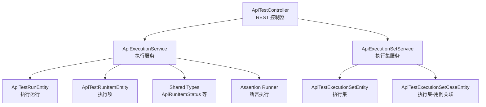
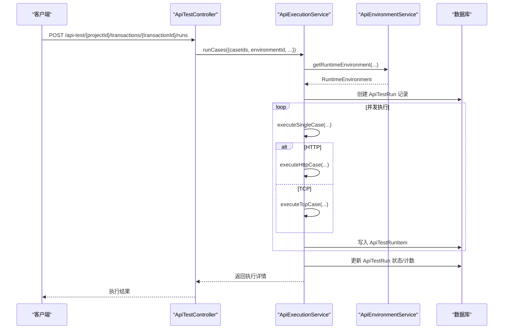
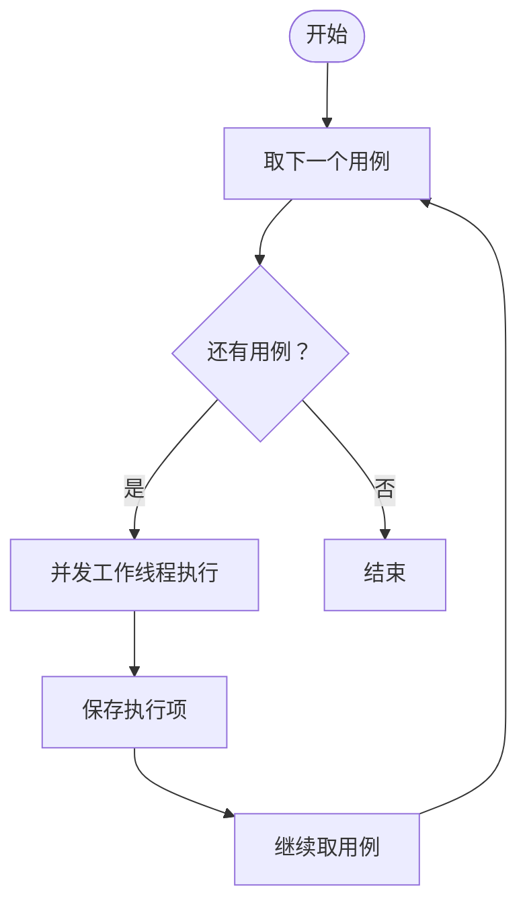
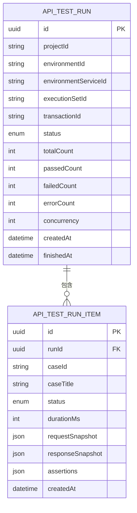
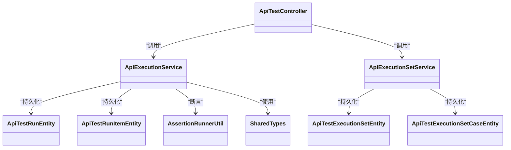

# 测试执行与运行

<cite>
**本文引用的文件**
- [apps/api/src/modules/api-test/controller/api-test.controller.ts](file://apps/api/src/modules/api-test/controller/api-test.controller.ts)
- [apps/api/src/modules/api-test/service/api-execution.service.ts](file://apps/api/src/modules/api-test/service/api-execution.service.ts)
- [apps/api/src/modules/api-test/service/api-execution-set.service.ts](file://apps/api/src/modules/api-test/service/api-execution-set.service.ts)
- [apps/api/src/modules/api-test/entity/api-test-run.entity.ts](file://apps/api/src/modules/api-test/entity/api-test-run.entity.ts)
- [apps/api/src/modules/api-test/entity/api-test-run-item.entity.ts](file://apps/api/src/modules/api-test/entity/api-test-run-item.entity.ts)
- [apps/api/src/modules/api-test/entity/api-test-execution-set.entity.ts](file://apps/api/src/modules/api-test/entity/api-test-execution-set.entity.ts)
- [apps/api/src/modules/api-test/entity/api-test-execution-set-case.entity.ts](file://apps/api/src/modules/api-test/entity/api-test-execution-set-case.entity.ts)
- [apps/api/src/modules/api-test/dto/save-api-case.dto.ts](file://apps/api/src/modules/api-test/dto/save-api-case.dto.ts)
- [apps/api/src/modules/api-test/dto/execution-platform.dto.ts](file://apps/api/src/modules/api-test/dto/execution-platform.dto.ts)
- [packages/shared/src/api-test.ts](file://packages/shared/src/api-test.ts)
- [apps/api/src/modules/api-test/util/assertion-runner.util.ts](file://apps/api/src/modules/api-test/util/assertion-runner.util.ts)
</cite>

## 目录
1. [简介](#简介)
2. [项目结构](#项目结构)
3. [核心组件](#核心组件)
4. [架构总览](#架构总览)
5. [详细组件分析](#详细组件分析)
6. [依赖关系分析](#依赖关系分析)
7. [性能考量](#性能考量)
8. [故障排查指南](#故障排查指南)
9. [结论](#结论)
10. [附录](#附录)

## 简介
本文件为“测试执行与运行”模块的详细 API 文档，覆盖以下能力：
- 单个用例执行与执行集批量执行
- 执行参数配置（并发度、编码、环境服务选择）
- 超时控制与错误处理
- 结果收集、状态追踪与报告导出
- 并发调度、性能优化与资源管理建议
- 故障恢复与重试策略建议

该模块基于 NestJS 构建，采用 TypeORM 持久化执行记录与结果，并通过控制器暴露 REST 接口。

## 项目结构
围绕“测试执行与运行”的关键文件组织如下：
- 控制器层：对外暴露执行、查询、报告导出等接口
- 服务层：封装执行逻辑、并发调度、断言与环境变量替换
- 实体层：持久化执行集、执行运行、执行项
- DTO 层：输入参数校验与 API 规范
- 共享类型：统一的运行状态、请求/期望模型
- 断言工具：统一的断言执行与通过判定

图表来源
- [apps/api/src/modules/api-test/controller/api-test.controller.ts:59-564](file://apps/api/src/modules/api-test/controller/api-test.controller.ts#L59-L564)
- [apps/api/src/modules/api-test/service/api-execution.service.ts:54-492](file://apps/api/src/modules/api-test/service/api-execution.service.ts#L54-L492)
- [apps/api/src/modules/api-test/service/api-execution-set.service.ts:29-245](file://apps/api/src/modules/api-test/service/api-execution-set.service.ts#L29-L245)
- [apps/api/src/modules/api-test/entity/api-test-run.entity.ts:11-62](file://apps/api/src/modules/api-test/entity/api-test-run.entity.ts#L11-L62)
- [apps/api/src/modules/api-test/entity/api-test-run-item.entity.ts:13-59](file://apps/api/src/modules/api-test/entity/api-test-run-item.entity.ts#L13-L59)
- [apps/api/src/modules/api-test/entity/api-test-execution-set.entity.ts:10-62](file://apps/api/src/modules/api-test/entity/api-test-execution-set.entity.ts#L10-L62)
- [apps/api/src/modules/api-test/entity/api-test-execution-set-case.entity.ts:9-30](file://apps/api/src/modules/api-test/entity/api-test-execution-set-case.entity.ts#L9-L30)
- [packages/shared/src/api-test.ts:1-91](file://packages/shared/src/api-test.ts#L1-L91)
- [apps/api/src/modules/api-test/util/assertion-runner.util.ts:62-107](file://apps/api/src/modules/api-test/util/assertion-runner.util.ts#L62-L107)

章节来源
- [apps/api/src/modules/api-test/controller/api-test.controller.ts:59-564](file://apps/api/src/modules/api-test/controller/api-test.controller.ts#L59-L564)
- [apps/api/src/modules/api-test/service/api-execution.service.ts:54-492](file://apps/api/src/modules/api-test/service/api-execution.service.ts#L54-L492)
- [apps/api/src/modules/api-test/service/api-execution-set.service.ts:29-245](file://apps/api/src/modules/api-test/service/api-execution-set.service.ts#L29-L245)
- [apps/api/src/modules/api-test/entity/api-test-run.entity.ts:11-62](file://apps/api/src/modules/api-test/entity/api-test-run.entity.ts#L11-L62)
- [apps/api/src/modules/api-test/entity/api-test-run-item.entity.ts:13-59](file://apps/api/src/modules/api-test/entity/api-test-run-item.entity.ts#L13-L59)
- [apps/api/src/modules/api-test/entity/api-test-execution-set.entity.ts:10-62](file://apps/api/src/modules/api-test/entity/api-test-execution-set.entity.ts#L10-L62)
- [apps/api/src/modules/api-test/entity/api-test-execution-set-case.entity.ts:9-30](file://apps/api/src/modules/api-test/entity/api-test-execution-set-case.entity.ts#L9-L30)
- [packages/shared/src/api-test.ts:1-91](file://packages/shared/src/api-test.ts#L1-L91)
- [apps/api/src/modules/api-test/util/assertion-runner.util.ts:62-107](file://apps/api/src/modules/api-test/util/assertion-runner.util.ts#L62-L107)

## 核心组件
- 执行控制器（ApiTestController）
  - 提供执行集批量执行、单用例执行、执行记录查询、报告导出等接口
- 执行服务（ApiExecutionService）
  - 单用例执行、HTTP/TCP 请求、断言、并发调度、运行与项持久化
- 执行集服务（ApiExecutionSetService）
  - 执行集 CRUD、用例集合管理、最后运行记录回填
- 实体（TypeORM）
  - ApiTestRunEntity、ApiTestRunItemEntity、ApiTestExecutionSetEntity、ApiTestExecutionSetCaseEntity
- 类型与断言
  - ApiRunItemStatus、ApiCaseRequest、ApiCaseExpected、AssertionResult
  - 断言执行与通过判定

章节来源
- [apps/api/src/modules/api-test/controller/api-test.controller.ts:59-564](file://apps/api/src/modules/api-test/controller/api-test.controller.ts#L59-L564)
- [apps/api/src/modules/api-test/service/api-execution.service.ts:54-492](file://apps/api/src/modules/api-test/service/api-execution.service.ts#L54-L492)
- [apps/api/src/modules/api-test/service/api-execution-set.service.ts:29-245](file://apps/api/src/modules/api-test/service/api-execution-set.service.ts#L29-L245)
- [apps/api/src/modules/api-test/entity/api-test-run.entity.ts:11-62](file://apps/api/src/modules/api-test/entity/api-test-run.entity.ts#L11-L62)
- [apps/api/src/modules/api-test/entity/api-test-run-item.entity.ts:13-59](file://apps/api/src/modules/api-test/entity/api-test-run-item.entity.ts#L13-L59)
- [apps/api/src/modules/api-test/entity/api-test-execution-set.entity.ts:10-62](file://apps/api/src/modules/api-test/entity/api-test-execution-set.entity.ts#L10-L62)
- [apps/api/src/modules/api-test/entity/api-test-execution-set-case.entity.ts:9-30](file://apps/api/src/modules/api-test/entity/api-test-execution-set-case.entity.ts#L9-L30)
- [packages/shared/src/api-test.ts:1-91](file://packages/shared/src/api-test.ts#L1-L91)
- [apps/api/src/modules/api-test/util/assertion-runner.util.ts:62-107](file://apps/api/src/modules/api-test/util/assertion-runner.util.ts#L62-L107)

## 架构总览
系统采用分层设计：控制器负责路由与参数校验，服务层承载业务流程，实体层负责数据持久化。执行流程从控制器进入，经由执行服务完成并发调度与断言，最终写入运行与项表；执行集服务用于管理执行集及其用例集合。

图表来源
- [apps/api/src/modules/api-test/controller/api-test.controller.ts:505-519](file://apps/api/src/modules/api-test/controller/api-test.controller.ts#L505-L519)
- [apps/api/src/modules/api-test/service/api-execution.service.ts:66-143](file://apps/api/src/modules/api-test/service/api-execution.service.ts#L66-L143)

## 详细组件分析

### 接口定义与参数说明
- 批量执行（执行集）
  - 方法与路径：POST /api-test/{projectId}/transactions/{transactionId}/execution-sets/{setId}/runs
  - 请求体字段：environmentId（必填）、environmentServiceId（可选）、concurrency（可选，默认值见服务端）、encoding（可选）
  - 响应：返回本次执行详情（包含运行与项）
- 单用例执行
  - 方法与路径：POST /api-test/{projectId}/transactions/{transactionId}/runs
  - 请求体字段：caseIds（必填，数组）、environmentId（必填）、environmentServiceId（可选）、concurrency（可选）
  - 响应：返回本次执行详情
- 查询执行记录
  - 列表：GET /api-test/{projectId}/runs
  - 详情：GET /api-test/{projectId}/runs/{runId}

章节来源
- [apps/api/src/modules/api-test/controller/api-test.controller.ts:487-532](file://apps/api/src/modules/api-test/controller/api-test.controller.ts#L487-L532)
- [apps/api/src/modules/api-test/dto/save-api-case.dto.ts:107-124](file://apps/api/src/modules/api-test/dto/save-api-case.dto.ts#L107-L124)
- [apps/api/src/modules/api-test/dto/execution-platform.dto.ts:129-147](file://apps/api/src/modules/api-test/dto/execution-platform.dto.ts#L129-L147)

### 执行参数配置
- 并发度（concurrency）
  - 默认并发：5；最大并发：10；最小为 1
  - 影响：并发调度线程数量，决定同时执行的用例数
- 编码（encoding）
  - 可在请求体传入，影响 HTTP Content-Type charset 与 TCP/消息体编码
- 环境与服务选择
  - environmentId：目标环境
  - environmentServiceId：在环境中选择具体服务（按传输协议匹配）

章节来源
- [apps/api/src/modules/api-test/service/api-execution.service.ts:24-26](file://apps/api/src/modules/api-test/service/api-execution.service.ts#L24-L26)
- [apps/api/src/modules/api-test/service/api-execution.service.ts:79-82](file://apps/api/src/modules/api-test/service/api-execution.service.ts#L79-L82)
- [apps/api/src/modules/api-test/service/api-execution.service.ts:420-434](file://apps/api/src/modules/api-test/service/api-execution.service.ts#L420-L434)
- [apps/api/src/modules/api-test/dto/save-api-case.dto.ts:121-124](file://apps/api/src/modules/api-test/dto/save-api-case.dto.ts#L121-L124)
- [apps/api/src/modules/api-test/dto/execution-platform.dto.ts:139-147](file://apps/api/src/modules/api-test/dto/execution-platform.dto.ts#L139-L147)

### 并发控制与调度
- 并发调度算法
  - 使用固定大小的并发池，循环分配待执行用例，等待所有并发任务完成
- 并发度范围
  - 最小 1，最大 10；默认 5
- 并发安全
  - 每个用例独立执行，结果写入数据库后汇总运行统计

图表来源
- [apps/api/src/modules/api-test/service/api-execution.service.ts:477-491](file://apps/api/src/modules/api-test/service/api-execution.service.ts#L477-L491)

章节来源
- [apps/api/src/modules/api-test/service/api-execution.service.ts:477-491](file://apps/api/src/modules/api-test/service/api-execution.service.ts#L477-L491)

### 超时设置与重试机制
- HTTP 请求超时
  - 使用 AbortSignal.timeout 设置默认超时（毫秒级）
- TCP 请求超时
  - 自定义 Socket 定时器，超时触发销毁连接并抛错
- 重试机制
  - 当前实现未内置自动重试；可在上层调用侧进行重试编排

章节来源
- [apps/api/src/modules/api-test/service/api-execution.service.ts:26-26](file://apps/api/src/modules/api-test/service/api-execution.service.ts#L26-L26)
- [apps/api/src/modules/api-test/service/api-execution.service.ts:272-273](file://apps/api/src/modules/api-test/service/api-execution.service.ts#L272-L273)
- [apps/api/src/modules/api-test/service/api-execution.service.ts:548-551](file://apps/api/src/modules/api-test/service/api-execution.service.ts#L548-L551)

### 执行结果收集与状态追踪
- 运行记录（ApiTestRunEntity）
  - 字段：状态、总数、通过/失败/错误计数、并发度、创建/完成时间
- 执行项（ApiTestRunItemEntity）
  - 字段：用例 ID/标题、状态、耗时、请求/响应快照、断言结果
- 状态枚举
  - ApiRunItemStatus：passed、failed、error、skipped（共享类型）

图表来源
- [apps/api/src/modules/api-test/entity/api-test-run.entity.ts:11-62](file://apps/api/src/modules/api-test/entity/api-test-run.entity.ts#L11-L62)
- [apps/api/src/modules/api-test/entity/api-test-run-item.entity.ts:13-59](file://apps/api/src/modules/api-test/entity/api-test-run-item.entity.ts#L13-L59)
- [packages/shared/src/api-test.ts:5-5](file://packages/shared/src/api-test.ts#L5-L5)

章节来源
- [apps/api/src/modules/api-test/entity/api-test-run.entity.ts:11-62](file://apps/api/src/modules/api-test/entity/api-test-run.entity.ts#L11-L62)
- [apps/api/src/modules/api-test/entity/api-test-run-item.entity.ts:13-59](file://apps/api/src/modules/api-test/entity/api-test-run-item.entity.ts#L13-L59)
- [packages/shared/src/api-test.ts:5-5](file://packages/shared/src/api-test.ts#L5-L5)

### 断言与结果判定
- 断言类型
  - 状态码断言、响应时间断言、JSONPath/包含/相等/正则断言
- 通过判定
  - 所有断言均通过才视为“通过”，否则“失败”
- 断言结果结构
  - 包含名称、期望、实际、是否通过、可选消息

章节来源
- [apps/api/src/modules/api-test/util/assertion-runner.util.ts:62-107](file://apps/api/src/modules/api-test/util/assertion-runner.util.ts#L62-L107)
- [packages/shared/src/api-test.ts:84-91](file://packages/shared/src/api-test.ts#L84-L91)

### 报告导出与查询
- 报告导出
  - POST /api-test/{projectId}/transactions/{transactionId}/reports/export
  - 支持格式：xlsx、pdf、html
- 执行记录查询
  - GET /api-test/{projectId}/runs（分页、按时间倒序）
  - GET /api-test/{projectId}/runs/{runId}（详情：运行+项）

章节来源
- [apps/api/src/modules/api-test/controller/api-test.controller.ts:534-562](file://apps/api/src/modules/api-test/controller/api-test.controller.ts#L534-L562)
- [apps/api/src/modules/api-test/controller/api-test.controller.ts:521-532](file://apps/api/src/modules/api-test/controller/api-test.controller.ts#L521-L532)

### 执行集管理
- 执行集 CRUD
  - 列表、创建、更新、删除
- 用例集合管理
  - 替换执行集中的用例集合（保持排序）
- 最后运行回填
  - 执行完成后更新执行集的 lastRunId、lastRunStatus、lastRunAt、lastPassedCount、lastTotalCount

章节来源
- [apps/api/src/modules/api-test/service/api-execution-set.service.ts:39-100](file://apps/api/src/modules/api-test/service/api-execution-set.service.ts#L39-L100)
- [apps/api/src/modules/api-test/service/api-execution-set.service.ts:102-138](file://apps/api/src/modules/api-test/service/api-execution-set.service.ts#L102-L138)
- [apps/api/src/modules/api-test/service/api-execution-set.service.ts:140-166](file://apps/api/src/modules/api-test/service/api-execution-set.service.ts#L140-L166)
- [apps/api/src/modules/api-test/service/api-execution-set.service.ts:176-192](file://apps/api/src/modules/api-test/service/api-execution-set.service.ts#L176-L192)
- [apps/api/src/modules/api-test/entity/api-test-execution-set.entity.ts:10-62](file://apps/api/src/modules/api-test/entity/api-test-execution-set.entity.ts#L10-L62)
- [apps/api/src/modules/api-test/entity/api-test-execution-set-case.entity.ts:9-30](file://apps/api/src/modules/api-test/entity/api-test-execution-set-case.entity.ts#L9-L30)

## 依赖关系分析
- 控制器依赖执行服务与执行集服务
- 执行服务依赖环境服务、断言工具与数据库仓储
- 执行集服务依赖执行集与执行集-用例关联仓储
- 共享类型被执行服务与断言工具使用

图表来源
- [apps/api/src/modules/api-test/controller/api-test.controller.ts:61-72](file://apps/api/src/modules/api-test/controller/api-test.controller.ts#L61-L72)
- [apps/api/src/modules/api-test/service/api-execution.service.ts:55-64](file://apps/api/src/modules/api-test/service/api-execution.service.ts#L55-L64)
- [apps/api/src/modules/api-test/service/api-execution-set.service.ts:30-37](file://apps/api/src/modules/api-test/service/api-execution-set.service.ts#L30-L37)
- [apps/api/src/modules/api-test/entity/api-test-run.entity.ts:11-62](file://apps/api/src/modules/api-test/entity/api-test-run.entity.ts#L11-L62)
- [apps/api/src/modules/api-test/entity/api-test-run-item.entity.ts:13-59](file://apps/api/src/modules/api-test/entity/api-test-run-item.entity.ts#L13-L59)
- [apps/api/src/modules/api-test/entity/api-test-execution-set.entity.ts:10-62](file://apps/api/src/modules/api-test/entity/api-test-execution-set.entity.ts#L10-L62)
- [apps/api/src/modules/api-test/entity/api-test-execution-set-case.entity.ts:9-30](file://apps/api/src/modules/api-test/entity/api-test-execution-set-case.entity.ts#L9-L30)
- [apps/api/src/modules/api-test/util/assertion-runner.util.ts:62-107](file://apps/api/src/modules/api-test/util/assertion-runner.util.ts#L62-L107)
- [packages/shared/src/api-test.ts:1-91](file://packages/shared/src/api-test.ts#L1-L91)

## 性能考量
- 并发度调优
  - 根据目标服务吞吐与网络带宽调整 concurrency；避免超过服务端限流
- 超时设置
  - HTTP 使用默认超时，TCP 自定义超时；建议根据业务场景在上层调参
- 编码与消息帧
  - TCP 长度前缀帧可减少粘包问题；合理设置编码与帧宽
- 数据库写入
  - 批量写入执行项后一次性更新运行统计，降低事务开销
- 日志与快照
  - 响应体截断（默认阈值）避免过大数据写入；敏感头信息脱敏

章节来源
- [apps/api/src/modules/api-test/service/api-execution.service.ts:24-26](file://apps/api/src/modules/api-test/service/api-execution.service.ts#L24-L26)
- [apps/api/src/modules/api-test/service/api-execution.service.ts:606-610](file://apps/api/src/modules/api-test/service/api-execution.service.ts#L606-L610)
- [apps/api/src/modules/api-test/service/api-execution.service.ts:596-604](file://apps/api/src/modules/api-test/service/api-execution.service.ts#L596-L604)

## 故障排查指南
- 常见错误与定位
  - 未找到可执行的启用案例：检查用例 ID 是否存在且启用
  - 执行集为空：确认执行集中是否已添加用例
  - HTTP Base URL 配置错误：需以 http(s):// 开头，否则抛出异常
  - TCP 服务缺少 host/port：需在服务或 Base URL 中提供
  - 请求失败：执行项 responseSnapshot 中包含错误信息
- 建议排查步骤
  - 校验环境与服务配置
  - 查看执行详情中的请求/响应快照与断言结果
  - 检查并发度与超时设置是否合理
  - 关注数据库中运行与项的状态变化

章节来源
- [apps/api/src/modules/api-test/service/api-execution.service.ts:96-98](file://apps/api/src/modules/api-test/service/api-execution.service.ts#L96-L98)
- [apps/api/src/modules/api-test/service/api-execution.service.ts:162-164](file://apps/api/src/modules/api-test/service/api-execution.service.ts#L162-L164)
- [apps/api/src/modules/api-test/service/api-execution.service.ts:454-457](file://apps/api/src/modules/api-test/service/api-execution.service.ts#L454-L457)
- [apps/api/src/modules/api-test/service/api-execution.service.ts:471-474](file://apps/api/src/modules/api-test/service/api-execution.service.ts#L471-L474)
- [apps/api/src/modules/api-test/service/api-execution.service.ts:306-330](file://apps/api/src/modules/api-test/service/api-execution.service.ts#L306-L330)
- [apps/api/src/modules/api-test/service/api-execution.service.ts:393-417](file://apps/api/src/modules/api-test/service/api-execution.service.ts#L393-L417)

## 结论
本模块提供了完整的测试执行与运行能力，覆盖单用例与执行集批量执行、参数配置、并发调度、断言与结果持久化。通过清晰的分层设计与实体模型，能够稳定支撑测试自动化与回归执行。建议在生产环境中结合业务场景对并发度、超时与编码进行精细化调优，并在上层引入重试与熔断策略以提升鲁棒性。

## 附录
- API 列表与示例
  - 批量执行（执行集）：POST /api-test/{projectId}/transactions/{transactionId}/execution-sets/{setId}/runs
  - 单用例执行：POST /api-test/{projectId}/transactions/{transactionId}/runs
  - 查询执行记录：GET /api-test/{projectId}/runs；GET /api-test/{projectId}/runs/{runId}
  - 报告导出：POST /api-test/{projectId}/transactions/{transactionId}/reports/export
- 关键类型参考
  - ApiRunItemStatus、ApiCaseRequest、ApiCaseExpected、AssertionResult

章节来源
- [apps/api/src/modules/api-test/controller/api-test.controller.ts:487-562](file://apps/api/src/modules/api-test/controller/api-test.controller.ts#L487-L562)
- [packages/shared/src/api-test.ts:5-91](file://packages/shared/src/api-test.ts#L5-L91)