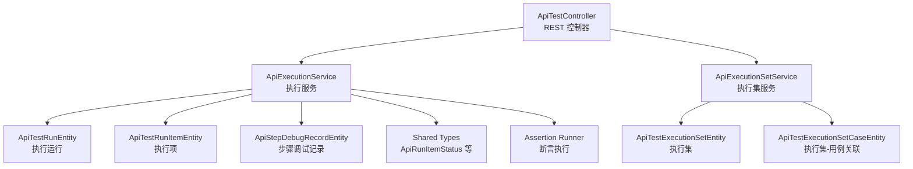
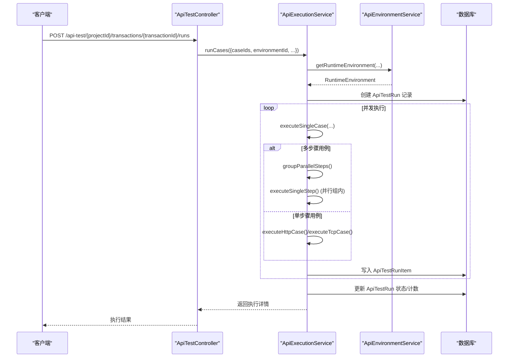
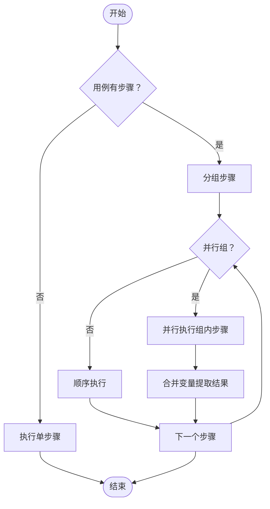
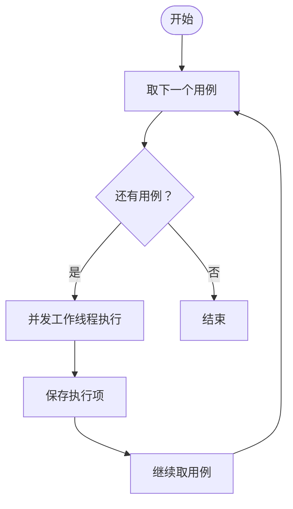
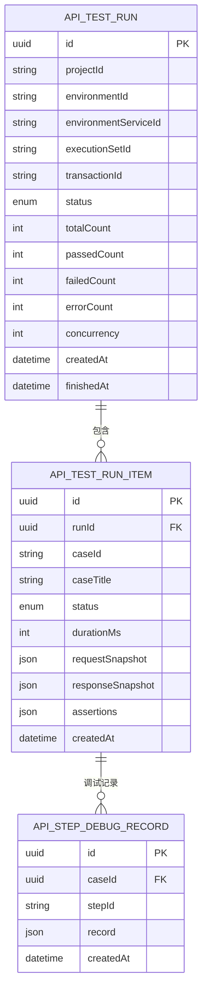
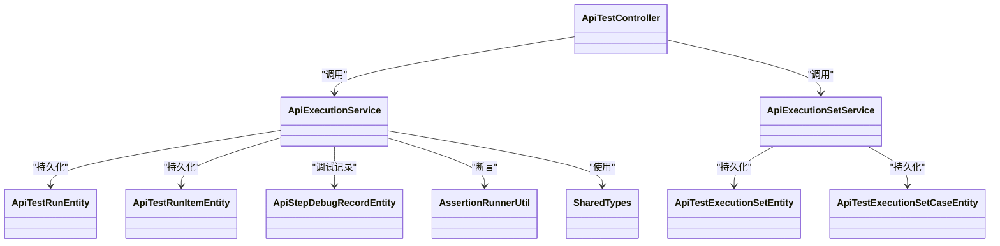

# 测试执行与运行

<cite>
**本文引用的文件**
- [apps/api/src/modules/api-test/controller/api-test.controller.ts](file://apps/api/src/modules/api-test/controller/api-test.controller.ts)
- [apps/api/src/modules/api-test/service/api-execution.service.ts](file://apps/api/src/modules/api-test/service/api-execution.service.ts)
- [apps/api/src/modules/api-test/service/api-execution-set.service.ts](file://apps/api/src/modules/api-test/service/api-execution-set.service.ts)
- [apps/api/src/modules/api-test/entity/api-test-run.entity.ts](file://apps/api/src/modules/api-test/entity/api-test-run.entity.ts)
- [apps/api/src/modules/api-test/entity/api-test-run-item.entity.ts](file://apps/api/src/modules/api-test/entity/api-test-run-item.entity.ts)
- [apps/api/src/modules/api-test/entity/api-test-execution-set.entity.ts](file://apps/api/src/modules/api-test/entity/api-test-execution-set.entity.ts)
- [apps/api/src/modules/api-test/entity/api-test-execution-set-case.entity.ts](file://apps/api/src/modules/api-test/entity/api-test-execution-set-case.entity.ts)
- [apps/api/src/modules/api-test/entity/api-step-debug-record.entity.ts](file://apps/api/src/modules/api-test/entity/api-step-debug-record.entity.ts)
- [apps/api/src/modules/api-test/dto/save-api-case.dto.ts](file://apps/api/src/modules/api-test/dto/save-api-case.dto.ts)
- [apps/api/src/modules/api-test/dto/execution-platform.dto.ts](file://apps/api/src/modules/api-test/dto/execution-platform.dto.ts)
- [packages/shared/src/api-test.ts](file://packages/shared/src/api-test.ts)
- [apps/api/src/modules/api-test/util/assertion-runner.util.ts](file://apps/api/src/modules/api-test/util/assertion-runner.util.ts)
</cite>

## 更新摘要
**变更内容**
- 新增多步骤用例执行支持，支持步骤级别的并行执行
- 增强执行上下文管理，支持步骤间变量共享和隔离
- 新增步骤级调试功能和调试记录管理
- 改进执行结果收集，支持步骤级别的详细执行信息
- 优化并发控制，支持并行执行组和顺序执行混合

## 目录
1. [简介](#简介)
2. [项目结构](#项目结构)
3. [核心组件](#核心组件)
4. [架构总览](#架构总览)
5. [详细组件分析](#详细组件分析)
6. [依赖关系分析](#依赖关系分析)
7. [性能考量](#性能考量)
8. [故障排查指南](#故障排查指南)
9. [结论](#结论)
10. [附录](#附录)

## 简介
本文件为"测试执行与运行"模块的详细 API 文档，覆盖以下能力：
- 单用例和多步骤用例执行与执行集批量执行
- 执行参数配置（并发度、编码、环境服务选择）
- 超时控制与错误处理
- 结果收集、状态追踪与报告导出
- 并发调度、性能优化与资源管理建议
- 故障恢复与重试策略建议
- **新增**：多步骤用例执行、并行执行组、步骤级调试功能

该模块基于 NestJS 构建，采用 TypeORM 持久化执行记录与结果，并通过控制器暴露 REST 接口。

## 项目结构
围绕"测试执行与运行"的关键文件组织如下：
- 控制器层：对外暴露执行、查询、报告导出等接口
- 服务层：封装执行逻辑、并发调度、断言与环境变量替换
- 实体层：持久化执行集、执行运行、执行项、步骤调试记录
- DTO 层：输入参数校验与 API 规范
- 共享类型：统一的运行状态、请求/期望模型、步骤定义
- 断言工具：统一的断言执行与通过判定

```mermaid
graph TB
Ctl["ApiTestController<br/>REST 控制器"] --> Svc["ApiExecutionService<br/>执行服务"]
Ctl --> ExecSetSvc["ApiExecutionSetService<br/>执行集服务"]
Svc --> RunRepo["ApiTestRunEntity<br/>执行运行"]
Svc --> ItemRepo["ApiTestRunItemEntity<br/>执行项"]
Svc --> DebugRepo["ApiStepDebugRecordEntity<br/>步骤调试记录"]
ExecSetSvc --> ExecSetRepo["ApiTestExecutionSetEntity<br/>执行集"]
ExecSetSvc --> ExecSetCaseRepo["ApiTestExecutionSetCaseEntity<br/>执行集-用例关联"]
Svc --> Shared["Shared Types<br/>ApiRunItemStatus 等"]
Svc --> Assert["Assertion Runner<br/>断言执行"]
```

**图表来源**
- [apps/api/src/modules/api-test/controller/api-test.controller.ts:76-96](file://apps/api/src/modules/api-test/controller/api-test.controller.ts#L76-L96)
- [apps/api/src/modules/api-test/service/api-execution.service.ts:66-77](file://apps/api/src/modules/api-test/service/api-execution.service.ts#L66-L77)
- [apps/api/src/modules/api-test/service/api-execution-set.service.ts:29-37](file://apps/api/src/modules/api-test/service/api-execution-set.service.ts#L29-L37)
- [apps/api/src/modules/api-test/entity/api-step-debug-record.entity.ts:10-33](file://apps/api/src/modules/api-test/entity/api-step-debug-record.entity.ts#L10-L33)

## 核心组件
- 执行控制器（ApiTestController）
  - 提供执行集批量执行、单用例执行、步骤调试、执行记录查询、报告导出等接口
- 执行服务（ApiExecutionService）
  - 单用例执行、HTTP/TCP 请求、断言、并发调度、运行与项持久化、步骤级执行
- 执行集服务（ApiExecutionSetService）
  - 执行集 CRUD、用例集合管理、最后运行记录回填
- 实体（TypeORM）
  - ApiTestRunEntity、ApiTestRunItemEntity、ApiTestExecutionSetEntity、ApiTestExecutionSetCaseEntity、ApiStepDebugRecordEntity
- 类型与断言
  - ApiRunItemStatus、ApiCaseRequest、ApiCaseExpected、AssertionResult、ApiCaseStep
  - 断言执行与通过判定

**章节来源**
- [apps/api/src/modules/api-test/controller/api-test.controller.ts:76-96](file://apps/api/src/modules/api-test/controller/api-test.controller.ts#L76-L96)
- [apps/api/src/modules/api-test/service/api-execution.service.ts:66-77](file://apps/api/src/modules/api-test/service/api-execution.service.ts#L66-L77)
- [apps/api/src/modules/api-test/service/api-execution-set.service.ts:29-37](file://apps/api/src/modules/api-test/service/api-execution-set.service.ts#L29-L37)
- [apps/api/src/modules/api-test/entity/api-step-debug-record.entity.ts:10-33](file://apps/api/src/modules/api-test/entity/api-step-debug-record.entity.ts#L10-L33)

## 架构总览
系统采用分层设计：控制器负责路由与参数校验，服务层承载业务流程，实体层负责数据持久化。执行流程从控制器进入，经由执行服务完成并发调度与断言，最终写入运行与项表；执行集服务用于管理执行集及其用例集合。

```mermaid
sequenceDiagram
participant Client as "客户端"
participant Ctrl as "ApiTestController"
participant ExecSvc as "ApiExecutionService"
participant EnvSvc as "ApiEnvironmentService"
participant DB as "数据库"
Client->>Ctrl : POST /api-test/{projectId}/transactions/{transactionId}/runs
Ctrl->>ExecSvc : runCases({caseIds, environmentId, ...})
ExecSvc->>EnvSvc : getRuntimeEnvironment(...)
EnvSvc-->>ExecSvc : RuntimeEnvironment
ExecSvc->>DB : 创建 ApiTestRun 记录
loop 并发执行
ExecSvc->>ExecSvc : executeSingleCase(...)
alt 多步骤用例
ExecSvc->>ExecSvc : groupParallelSteps()
ExecSvc->>ExecSvc : executeSingleStep() (并行组内)
else 单步骤用例
ExecSvc->>ExecSvc : executeHttpCase()/executeTcpCase()
end
ExecSvc->>DB : 写入 ApiTestRunItem
end
ExecSvc->>DB : 更新 ApiTestRun 状态/计数
ExecSvc-->>Ctrl : 返回执行详情
Ctrl-->>Client : 执行结果
```

**图表来源**
- [apps/api/src/modules/api-test/controller/api-test.controller.ts:933-950](file://apps/api/src/modules/api-test/controller/api-test.controller.ts#L933-L950)
- [apps/api/src/modules/api-test/service/api-execution.service.ts:79-243](file://apps/api/src/modules/api-test/service/api-execution.service.ts#L79-L243)

## 详细组件分析

### 接口定义与参数说明
- 批量执行（执行集）
  - 方法与路径：POST /api-test/{projectId}/transactions/{transactionId}/execution-sets/{setId}/runs
  - 请求体字段：environmentId（必填）、environmentServiceId（可选）、concurrency（可选，默认值见服务端）、encoding（可选）
  - 响应：返回本次执行详情（包含运行与项）
- 单用例执行
  - 方法与路径：POST /api-test/{projectId}/transactions/{transactionId}/runs
  - 请求体字段：caseIds（必填，数组）、environmentId（必填）、environmentServiceId（可选）、concurrency（可选）
  - 响应：返回本次执行详情
- 步骤调试执行
  - 方法与路径：POST /api-test/{projectId}/transactions/{transactionId}/cases/debug-run
  - 请求体字段：request（必填）、expected（可选）、target（可选）、environmentId（可选）、stepId（可选）
  - 响应：返回调试执行结果（不保存执行记录）
- 查询执行记录
  - 列表：GET /api-test/{projectId}/runs
  - 详情：GET /api-test/{projectId}/runs/{runId}

**章节来源**
- [apps/api/src/modules/api-test/controller/api-test.controller.ts:933-950](file://apps/api/src/modules/api-test/controller/api-test.controller.ts#L933-L950)
- [apps/api/src/modules/api-test/controller/api-test.controller.ts:782-831](file://apps/api/src/modules/api-test/controller/api-test.controller.ts#L782-L831)
- [apps/api/src/modules/api-test/dto/save-api-case.dto.ts:184-217](file://apps/api/src/modules/api-test/dto/save-api-case.dto.ts#L184-L217)

### 执行参数配置
- 并发度（concurrency）
  - 默认并发：5；最大并发：10；最小为 1
  - 影响：并发调度线程数量，决定同时执行的用例数
- 编码（encoding）
  - 可在请求体传入，影响 HTTP Content-Type charset 与 TCP/消息体编码
- 环境与服务选择
  - environmentId：目标环境
  - environmentServiceId：在环境中选择具体服务（按传输协议匹配）
- **新增**：步骤级配置
  - debugEnvironmentId：案例调试默认环境
  - debugEnvironmentServiceId：案例调试默认环境服务
  - debugEncoding：案例调试传输编码

**章节来源**
- [apps/api/src/modules/api-test/service/api-execution.service.ts:35-38](file://apps/api/src/modules/api-test/service/api-execution.service.ts#L35-L38)
- [apps/api/src/modules/api-test/service/api-execution.service.ts:93-96](file://apps/api/src/modules/api-test/service/api-execution.service.ts#L93-L96)
- [apps/api/src/modules/api-test/dto/save-api-case.dto.ts:106-124](file://apps/api/src/modules/api-test/dto/save-api-case.dto.ts#L106-L124)

### 多步骤用例执行与并行组
- **新增**：多步骤用例支持
  - 用例可包含多个步骤（steps），每个步骤有独立的请求、断言和导出配置
  - 步骤支持独立的目标地址和环境配置
  - 步骤间支持变量共享和提取
- **新增**：并行执行组
  - 通过 `parallelWithPrevious` 标记实现步骤级别的并行执行
  - 相邻标记的步骤归入同一并行组，同时发出请求
  - 并行组内步骤互不可见，组完成后合并变量提取结果
- **新增**：步骤级执行上下文
  - 每个步骤有独立的执行上下文，包含用例名称、编号等信息
  - 支持步骤级别的变量替换和数据函数解析

```mermaid
flowchart TD
Start(["开始"]) --> CheckSteps{"用例有步骤？"}
CheckSteps --> |否| SingleStep["执行单步骤"]
CheckSteps --> |是| GroupSteps["分组步骤"]
GroupSteps --> ParallelGroup{"并行组？"}
ParallelGroup --> |是| ParallelExec["并行执行组内步骤"]
ParallelGroup --> |否| SequentialExec["顺序执行"]
ParallelExec --> MergeVars["合并变量提取结果"]
SequentialExec --> NextStep["下一个步骤"]
NextStep --> ParallelGroup
MergeVars --> NextStep
SingleStep --> End(["结束"])
NextStep --> End
```

**图表来源**
- [apps/api/src/modules/api-test/service/api-execution.service.ts:335-437](file://apps/api/src/modules/api-test/service/api-execution.service.ts#L335-L437)
- [packages/shared/src/api-test.ts:144-153](file://packages/shared/src/api-test.ts#L144-L153)

**章节来源**
- [apps/api/src/modules/api-test/service/api-execution.service.ts:335-437](file://apps/api/src/modules/api-test/service/api-execution.service.ts#L335-L437)
- [packages/shared/src/api-test.ts:133-153](file://packages/shared/src/api-test.ts#L133-L153)

### 步骤级调试功能
- **新增**：步骤级调试执行
  - 支持对单个步骤进行调试执行，不保存执行记录
  - 支持指定目标地址或环境ID进行调试
  - 支持步骤级别的断言和执行结果查看
- **新增**：调试记录管理
  - 自动保存步骤调试记录到数据库
  - 支持查询和清理调试记录
  - 记录包含请求、响应、断言结果和执行时间
- **新增**：调试上下文
  - 支持传入用例ID获取调试上下文
  - 支持步骤库调试等无案例上下文的场景

**章节来源**
- [apps/api/src/modules/api-test/controller/api-test.controller.ts:782-831](file://apps/api/src/modules/api-test/controller/api-test.controller.ts#L782-L831)
- [apps/api/src/modules/api-test/service/api-execution.service.ts:687-740](file://apps/api/src/modules/api-test/service/api-execution.service.ts#L687-L740)
- [apps/api/src/modules/api-test/entity/api-step-debug-record.entity.ts:10-33](file://apps/api/src/modules/api-test/entity/api-step-debug-record.entity.ts#L10-L33)

### 并发控制与调度
- 并发调度算法
  - 使用固定大小的并发池，循环分配待执行用例，等待所有并发任务完成
- 并发度范围
  - 最小 1，最大 10；默认 5
- 并发安全
  - 每个用例独立执行，结果写入数据库后汇总运行统计
- **新增**：步骤级并发控制
  - 并行组内步骤同时执行，组间顺序执行
  - 支持混合执行模式：并行组与顺序步骤结合

```mermaid
flowchart TD
Start(["开始"]) --> Pick["取下一个用例"]
Pick --> HasMore{"还有用例？"}
HasMore --> |是| Worker["并发工作线程执行"]
Worker --> Persist["保存执行项"]
Persist --> Next["继续取用例"]
Next --> Pick
HasMore --> |否| Finish["结束"]
```

**图表来源**
- [apps/api/src/modules/api-test/service/api-execution.service.ts:965-979](file://apps/api/src/modules/api-test/service/api-execution.service.ts#L965-L979)

**章节来源**
- [apps/api/src/modules/api-test/service/api-execution.service.ts:965-979](file://apps/api/src/modules/api-test/service/api-execution.service.ts#L965-L979)

### 超时设置与重试机制
- HTTP 请求超时
  - 使用 AbortSignal.timeout 设置默认超时（毫秒级）
- TCP 请求超时
  - 自定义 Socket 定时器，超时触发销毁连接并抛错
- 重试机制
  - 当前实现未内置自动重试；可在上层调用侧进行重试编排
- **新增**：步骤级超时控制
  - 每个步骤独立计算执行时间和超时

**章节来源**
- [apps/api/src/modules/api-test/service/api-execution.service.ts:37-38](file://apps/api/src/modules/api-test/service/api-execution.service.ts#L37-L38)
- [apps/api/src/modules/api-test/service/api-execution.service.ts:516-517](file://apps/api/src/modules/api-test/service/api-execution.service.ts#L516-L517)
- [apps/api/src/modules/api-test/service/api-execution.service.ts:1151-1163](file://apps/api/src/modules/api-test/service/api-execution.service.ts#L1151-L1163)

### 执行结果收集与状态追踪
- 运行记录（ApiTestRunEntity）
  - 字段：状态、总数、通过/失败/错误计数、并发度、创建/完成时间
- 执行项（ApiTestRunItemEntity）
  - 字段：用例 ID/标题、状态、耗时、请求/响应快照、断言结果
- 步骤调试记录（ApiStepDebugRecordEntity）
  - 字段：步骤ID、调试记录、执行时间、目标信息等
- 状态枚举
  - ApiRunItemStatus：passed、failed、error、skipped（共享类型）
- **新增**：步骤级结果收集
  - 多步骤用例的结果包含每个步骤的详细执行信息
  - 支持步骤级别的请求/响应快照和断言结果

```mermaid
erDiagram
API_TEST_RUN {
uuid id PK
string projectId
string environmentId
string environmentServiceId
string executionSetId
string transactionId
enum status
int totalCount
int passedCount
int failedCount
int errorCount
int concurrency
datetime createdAt
datetime finishedAt
}
API_TEST_RUN_ITEM {
uuid id PK
uuid runId FK
string caseId
string caseTitle
enum status
int durationMs
json requestSnapshot
json responseSnapshot
json assertions
datetime createdAt
}
API_STEP_DEBUG_RECORD {
uuid id PK
uuid caseId FK
string stepId
json record
datetime createdAt
}
API_TEST_RUN ||--o{ API_TEST_RUN_ITEM : "包含"
API_TEST_RUN_ITEM ||--o{ API_STEP_DEBUG_RECORD : "调试记录"
```

**图表来源**
- [apps/api/src/modules/api-test/entity/api-test-run.entity.ts:11-62](file://apps/api/src/modules/api-test/entity/api-test-run.entity.ts#L11-L62)
- [apps/api/src/modules/api-test/entity/api-test-run-item.entity.ts:13-59](file://apps/api/src/modules/api-test/entity/api-test-run-item.entity.ts#L13-L59)
- [apps/api/src/modules/api-test/entity/api-step-debug-record.entity.ts:10-33](file://apps/api/src/modules/api-test/entity/api-step-debug-record.entity.ts#L10-L33)

**章节来源**
- [apps/api/src/modules/api-test/entity/api-test-run.entity.ts:11-62](file://apps/api/src/modules/api-test/entity/api-test-run.entity.ts#L11-L62)
- [apps/api/src/modules/api-test/entity/api-test-run-item.entity.ts:13-59](file://apps/api/src/modules/api-test/entity/api-test-run-item.entity.ts#L13-L59)
- [apps/api/src/modules/api-test/entity/api-step-debug-record.entity.ts:10-33](file://apps/api/src/modules/api-test/entity/api-step-debug-record.entity.ts#L10-L33)

### 断言与结果判定
- 断言类型
  - 状态码断言、响应时间断言、JSONPath/包含/相等/正则断言
- 通过判定
  - 所有断言均通过才视为"通过"，否则"失败"
- 断言结果结构
  - 包含名称、期望、实际、是否通过、可选消息
- **新增**：步骤级断言
  - 每个步骤独立执行断言，支持步骤级别的断言结果

**章节来源**
- [apps/api/src/modules/api-test/util/assertion-runner.util.ts:62-107](file://apps/api/src/modules/api-test/util/assertion-runner.util.ts#L62-L107)
- [packages/shared/src/api-test.ts:206-212](file://packages/shared/src/api-test.ts#L206-L212)

### 报告导出与查询
- 报告导出
  - POST /api-test/{projectId}/transactions/{transactionId}/reports/export
  - 支持格式：xlsx、pdf、html
- 执行记录查询
  - GET /api-test/{projectId}/runs（分页、按时间倒序）
  - GET /api-test/{projectId}/runs/{runId}（详情：运行+项）

**章节来源**
- [apps/api/src/modules/api-test/controller/api-test.controller.ts:979-1011](file://apps/api/src/modules/api-test/controller/api-test.controller.ts#L979-L1011)
- [apps/api/src/modules/api-test/controller/api-test.controller.ts:952-960](file://apps/api/src/modules/api-test/controller/api-test.controller.ts#L952-L960)

### 执行集管理
- 执行集 CRUD
  - 列表、创建、更新、删除
- 用例集合管理
  - 替换执行集中的用例集合（保持排序）
- 最后运行回填
  - 执行完成后更新执行集的 lastRunId、lastRunStatus、lastRunAt、lastPassedCount、lastTotalCount

**章节来源**
- [apps/api/src/modules/api-test/service/api-execution-set.service.ts:39-100](file://apps/api/src/modules/api-test/service/api-execution-set.service.ts#L39-L100)
- [apps/api/src/modules/api-test/service/api-execution-set.service.ts:102-138](file://apps/api/src/modules/api-test/service/api-execution-set.service.ts#L102-L138)
- [apps/api/src/modules/api-test/service/api-execution-set.service.ts:140-166](file://apps/api/src/modules/api-test/service/api-execution-set.service.ts#L140-L166)
- [apps/api/src/modules/api-test/service/api-execution-set.service.ts:176-192](file://apps/api/src/modules/api-test/service/api-execution-set.service.ts#L176-L192)

## 依赖关系分析
- 控制器依赖执行服务与执行集服务
- 执行服务依赖环境服务、断言工具与数据库仓储
- 执行集服务依赖执行集与执行集-用例关联仓储
- 共享类型被执行服务与断言工具使用

```mermaid
classDiagram
class ApiTestController
class ApiExecutionService
class ApiExecutionSetService
class ApiTestRunEntity
class ApiTestRunItemEntity
class ApiTestExecutionSetEntity
class ApiTestExecutionSetCaseEntity
class ApiStepDebugRecordEntity
class AssertionRunnerUtil
class SharedTypes
ApiTestController --> ApiExecutionService : "调用"
ApiTestController --> ApiExecutionSetService : "调用"
ApiExecutionService --> ApiTestRunEntity : "持久化"
ApiExecutionService --> ApiTestRunItemEntity : "持久化"
ApiExecutionService --> ApiStepDebugRecordEntity : "调试记录"
ApiExecutionSetService --> ApiTestExecutionSetEntity : "持久化"
ApiExecutionSetService --> ApiTestExecutionSetCaseEntity : "持久化"
ApiExecutionService --> AssertionRunnerUtil : "断言"
ApiExecutionService --> SharedTypes : "使用"
```

**图表来源**
- [apps/api/src/modules/api-test/controller/api-test.controller.ts:78-96](file://apps/api/src/modules/api-test/controller/api-test.controller.ts#L78-L96)
- [apps/api/src/modules/api-test/service/api-execution.service.ts:66-77](file://apps/api/src/modules/api-test/service/api-execution.service.ts#L66-L77)
- [apps/api/src/modules/api-test/service/api-execution-set.service.ts:29-37](file://apps/api/src/modules/api-test/service/api-execution-set.service.ts#L29-L37)
- [apps/api/src/modules/api-test/entity/api-step-debug-record.entity.ts:10-33](file://apps/api/src/modules/api-test/entity/api-step-debug-record.entity.ts#L10-L33)

## 性能考量
- 并发度调优
  - 根据目标服务吞吐与网络带宽调整 concurrency；避免超过服务端限流
- 超时设置
  - HTTP 使用默认超时，TCP 自定义超时；建议根据业务场景在上层调参
- 编码与消息帧
  - TCP 长度前缀帧可减少粘包问题；合理设置编码与帧宽
- 数据库写入
  - 批量写入执行项后一次性更新运行统计，降低事务开销
- 日志与快照
  - 响应体截断（默认阈值）避免过大数据写入；敏感头信息脱敏
- **新增**：步骤级性能优化
  - 并行执行组减少整体执行时间
  - 步骤级变量提取避免重复计算
  - 调试记录限制数量避免数据库膨胀

**章节来源**
- [apps/api/src/modules/api-test/service/api-execution.service.ts:35-38](file://apps/api/src/modules/api-test/service/api-execution.service.ts#L35-L38)
- [apps/api/src/modules/api-test/service/api-execution.service.ts:1263-1267](file://apps/api/src/modules/api-test/service/api-execution.service.ts#L1263-L1267)
- [apps/api/src/modules/api-test/controller/api-test.controller.ts:826-828](file://apps/api/src/modules/api-test/controller/api-test.controller.ts#L826-L828)

## 故障排查指南
- 常见错误与定位
  - 未找到可执行的启用案例：检查用例 ID 是否存在且启用
  - 执行集为空：确认执行集中是否已添加用例
  - HTTP Base URL 配置错误：需以 http(s):// 开头，否则抛出异常
  - TCP 服务缺少 host/port：需在服务或 Base URL 中提供
  - 请求失败：执行项 responseSnapshot 中包含错误信息
- **新增**：步骤级故障排查
  - 步骤地址配置错误：检查步骤 target.address 配置
  - 并行执行组冲突：检查 parallelWithPrevious 标记是否正确
  - 步骤调试失败：查看步骤调试记录中的错误信息
- 建议排查步骤
  - 校验环境与服务配置
  - 查看执行详情中的请求/响应快照与断言结果
  - 检查并发度与超时设置是否合理
  - 关注数据库中运行与项的状态变化

**章节来源**
- [apps/api/src/modules/api-test/service/api-execution.service.ts:90-91](file://apps/api/src/modules/api-test/service/api-execution.service.ts#L90-L91)
- [apps/api/src/modules/api-test/service/api-execution.service.ts:118-121](file://apps/api/src/modules/api-test/service/api-execution.service.ts#L118-L121)
- [apps/api/src/modules/api-test/service/api-execution.service.ts:935-944](file://apps/api/src/modules/api-test/service/api-execution.service.ts#L935-L944)
- [apps/api/src/modules/api-test/service/api-execution.service.ts:959-961](file://apps/api/src/modules/api-test/service/api-execution.service.ts#L959-L961)

## 结论
本模块提供了完整的测试执行与运行能力，覆盖单用例与执行集批量执行、参数配置、并发调度、断言与结果持久化。**新增的多步骤用例执行、并行执行组和步骤级调试功能**进一步增强了测试用例的灵活性和调试效率。通过清晰的分层设计与实体模型，能够稳定支撑测试自动化与回归执行。建议在生产环境中结合业务场景对并发度、超时与编码进行精细化调优，并在上层引入重试与熔断策略以提升鲁棒性。

## 附录
- API 列表与示例
  - 批量执行（执行集）：POST /api-test/{projectId}/transactions/{transactionId}/execution-sets/{setId}/runs
  - 单用例执行：POST /api-test/{projectId}/transactions/{transactionId}/runs
  - 步骤调试执行：POST /api-test/{projectId}/transactions/{transactionId}/cases/debug-run
  - 查询执行记录：GET /api-test/{projectId}/runs；GET /api-test/{projectId}/runs/{runId}
  - 报告导出：POST /api-test/{projectId}/transactions/{transactionId}/reports/export
- 关键类型参考
  - ApiRunItemStatus、ApiCaseRequest、ApiCaseExpected、AssertionResult、ApiCaseStep
  - **新增**：ApiStepTarget、CaseLastDebugRun、ApiStepDebugRecord

**章节来源**
- [apps/api/src/modules/api-test/controller/api-test.controller.ts:933-1011](file://apps/api/src/modules/api-test/controller/api-test.controller.ts#L933-L1011)
- [packages/shared/src/api-test.ts:5-330](file://packages/shared/src/api-test.ts#L5-L330)