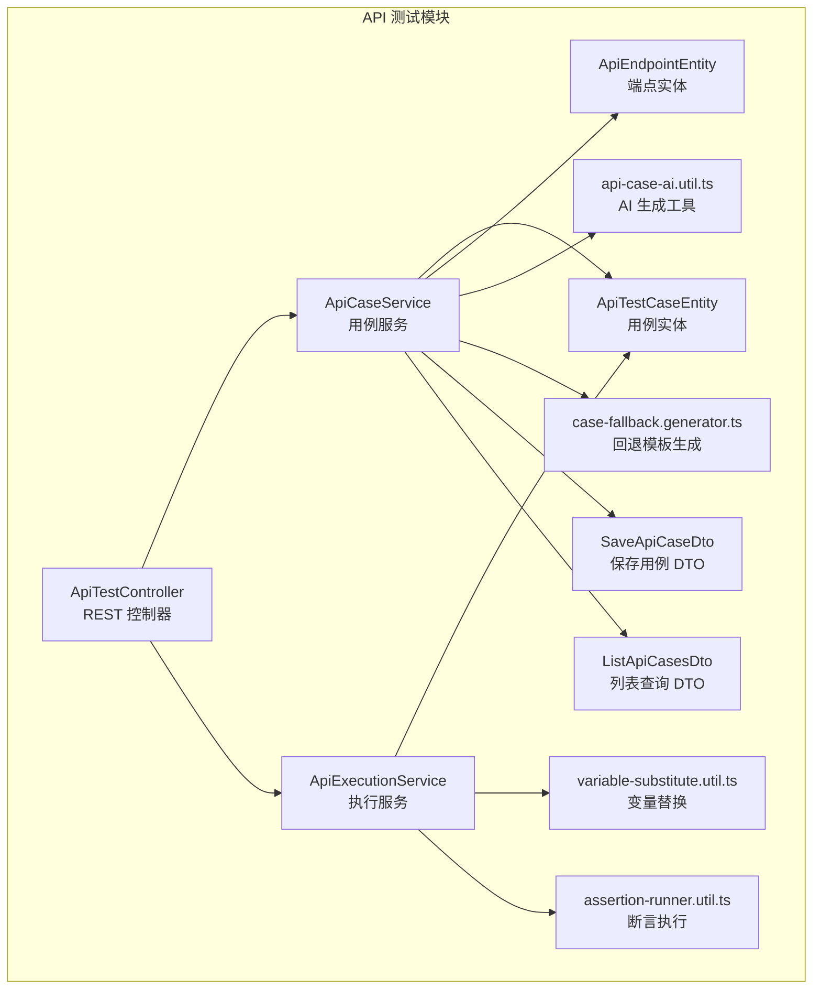
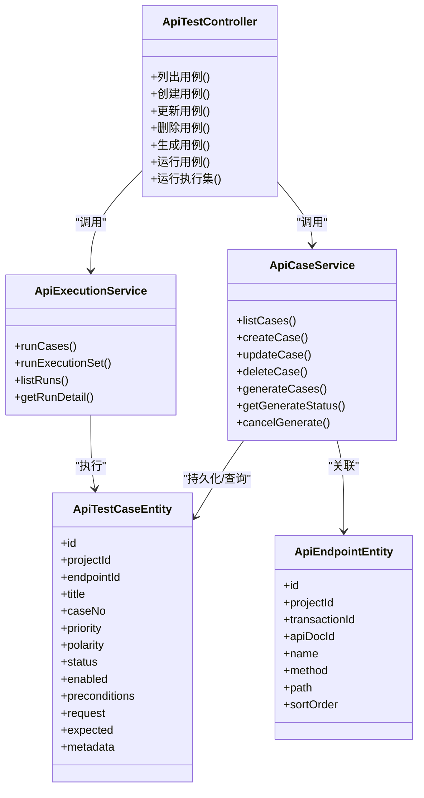
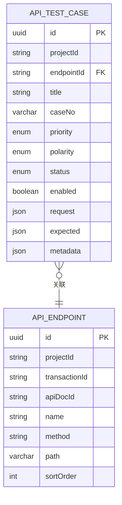
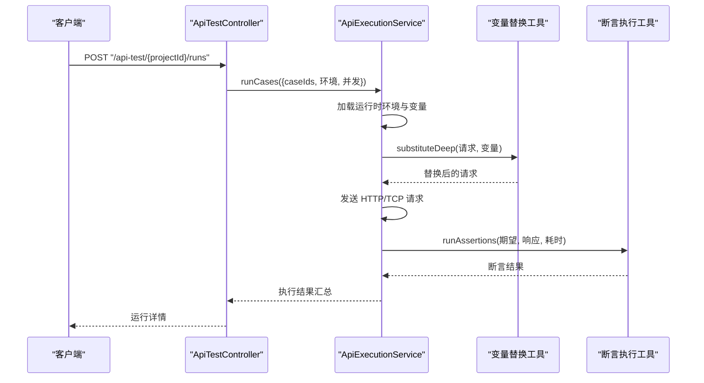
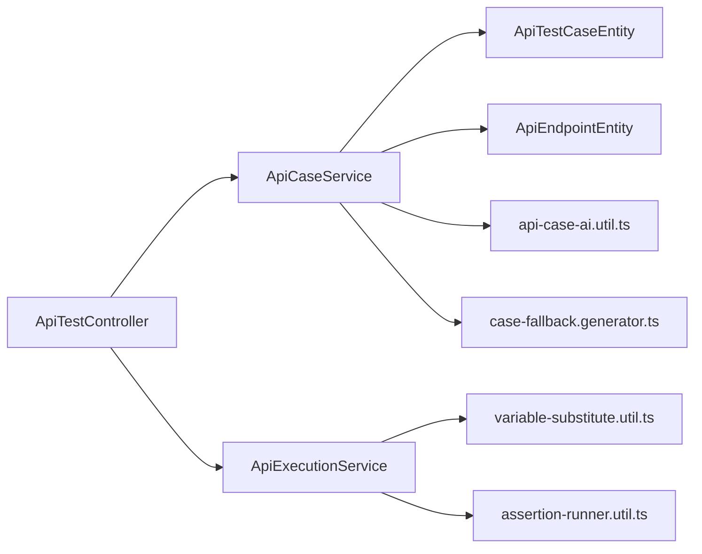

# 测试用例管理

<cite>
**本文引用的文件**
- [apps/api/src/modules/api-test/controller/api-test.controller.ts](file://apps/api/src/modules/api-test/controller/api-test.controller.ts)
- [apps/api/src/modules/api-test/service/api-case.service.ts](file://apps/api/src/modules/api-test/service/api-case.service.ts)
- [apps/api/src/modules/api-test/entity/api-test-case.entity.ts](file://apps/api/src/modules/api-test/entity/api-test-case.entity.ts)
- [apps/api/src/modules/api-test/entity/api-endpoint.entity.ts](file://apps/api/src/modules/api-test/entity/api-endpoint.entity.ts)
- [apps/api/src/modules/api-test/dto/save-api-case.dto.ts](file://apps/api/src/modules/api-test/dto/save-api-case.dto.ts)
- [apps/api/src/modules/api-test/dto/list-api-cases.dto.ts](file://apps/api/src/modules/api-test/dto/list-api-cases.dto.ts)
- [apps/api/src/modules/api-test/util/api-case-ai.util.ts](file://apps/api/src/modules/api-test/util/api-case-ai.util.ts)
- [apps/api/src/modules/api-test/util/case-fallback.generator.ts](file://apps/api/src/modules/api-test/util/case-fallback.generator.ts)
- [apps/api/src/modules/api-test/util/variable-substitute.util.ts](file://apps/api/src/modules/api-test/util/variable-substitute.util.ts)
- [apps/api/src/modules/api-test/util/assertion-runner.util.ts](file://apps/api/src/modules/api-test/util/assertion-runner.util.ts)
- [apps/api/src/modules/api-test/service/api-execution.service.ts](file://apps/api/src/modules/api-test/service/api-execution.service.ts)
- [packages/shared/src/api-test.ts](file://packages/shared/src/api-test.ts)
</cite>

## 目录
1. [简介](#简介)
2. [项目结构](#项目结构)
3. [核心组件](#核心组件)
4. [架构总览](#架构总览)
5. [详细组件分析](#详细组件分析)
6. [依赖分析](#依赖分析)
7. [性能考虑](#性能考虑)
8. [故障排查指南](#故障排查指南)
9. [结论](#结论)
10. [附录](#附录)

## 简介
本文件为“测试用例管理”模块的完整 API 文档，覆盖以下主题：
- 测试用例的 CRUD 接口：创建、更新、删除、列表查询
- 测试用例生成接口：基于文档与场景提示的 AI 自动生成，以及回退模板生成
- 用例与端点的关联关系：端点实体与用例实体的映射
- 用例模板管理与批量操作：通过生成队列与批量运行实现
- 数据结构定义、字段约束与业务规则
- 用例执行前的预处理逻辑、变量替换机制与断言配置的 API 使用指南

## 项目结构
该模块位于后端应用的 API 测试子域，采用控制器-服务-实体-DTO 的分层设计，并通过共享类型定义统一数据契约。

图表来源
- [apps/api/src/modules/api-test/controller/api-test.controller.ts:58-564](file://apps/api/src/modules/api-test/controller/api-test.controller.ts#L58-L564)
- [apps/api/src/modules/api-test/service/api-case.service.ts:38-444](file://apps/api/src/modules/api-test/service/api-case.service.ts#L38-L444)
- [apps/api/src/modules/api-test/service/api-execution.service.ts:53-200](file://apps/api/src/modules/api-test/service/api-execution.service.ts#L53-L200)
- [apps/api/src/modules/api-test/entity/api-test-case.entity.ts:21-99](file://apps/api/src/modules/api-test/entity/api-test-case.entity.ts#L21-L99)
- [apps/api/src/modules/api-test/entity/api-endpoint.entity.ts:13-67](file://apps/api/src/modules/api-test/entity/api-endpoint.entity.ts#L13-L67)
- [apps/api/src/modules/api-test/dto/save-api-case.dto.ts:19-136](file://apps/api/src/modules/api-test/dto/save-api-case.dto.ts#L19-L136)
- [apps/api/src/modules/api-test/dto/list-api-cases.dto.ts:6-21](file://apps/api/src/modules/api-test/dto/list-api-cases.dto.ts#L6-L21)
- [apps/api/src/modules/api-test/util/api-case-ai.util.ts:74-127](file://apps/api/src/modules/api-test/util/api-case-ai.util.ts#L74-L127)
- [apps/api/src/modules/api-test/util/case-fallback.generator.ts:10-80](file://apps/api/src/modules/api-test/util/case-fallback.generator.ts#L10-L80)
- [apps/api/src/modules/api-test/util/variable-substitute.util.ts:1-43](file://apps/api/src/modules/api-test/util/variable-substitute.util.ts#L1-L43)
- [apps/api/src/modules/api-test/util/assertion-runner.util.ts:62-107](file://apps/api/src/modules/api-test/util/assertion-runner.util.ts#L62-L107)

章节来源
- [apps/api/src/modules/api-test/controller/api-test.controller.ts:58-564](file://apps/api/src/modules/api-test/controller/api-test.controller.ts#L58-L564)
- [apps/api/src/modules/api-test/service/api-case.service.ts:38-444](file://apps/api/src/modules/api-test/service/api-case.service.ts#L38-L444)
- [apps/api/src/modules/api-test/service/api-execution.service.ts:53-200](file://apps/api/src/modules/api-test/service/api-execution.service.ts#L53-L200)

## 核心组件
- 控制器：集中暴露 CRUD、生成、运行、报告等接口，负责路由与参数校验
- 服务：
  - 用例服务：实现用例的增删改查、生成队列调度、AI/回退生成策略
  - 执行服务：负责运行集合或用例集合，执行 HTTP/TCP 请求，断言与统计
- 实体：用例与端点的持久化模型，定义字段与索引
- DTO：输入输出的数据传输对象，包含字段约束与枚举
- 工具：变量替换、断言执行、AI 生成与回退模板生成

章节来源
- [apps/api/src/modules/api-test/controller/api-test.controller.ts:58-564](file://apps/api/src/modules/api-test/controller/api-test.controller.ts#L58-L564)
- [apps/api/src/modules/api-test/service/api-case.service.ts:38-444](file://apps/api/src/modules/api-test/service/api-case.service.ts#L38-L444)
- [apps/api/src/modules/api-test/service/api-execution.service.ts:53-200](file://apps/api/src/modules/api-test/service/api-execution.service.ts#L53-L200)
- [apps/api/src/modules/api-test/entity/api-test-case.entity.ts:21-99](file://apps/api/src/modules/api-test/entity/api-test-case.entity.ts#L21-L99)
- [apps/api/src/modules/api-test/entity/api-endpoint.entity.ts:13-67](file://apps/api/src/modules/api-test/entity/api-endpoint.entity.ts#L13-L67)
- [apps/api/src/modules/api-test/dto/save-api-case.dto.ts:19-136](file://apps/api/src/modules/api-test/dto/save-api-case.dto.ts#L19-L136)
- [apps/api/src/modules/api-test/dto/list-api-cases.dto.ts:6-21](file://apps/api/src/modules/api-test/dto/list-api-cases.dto.ts#L6-L21)
- [apps/api/src/modules/api-test/util/api-case-ai.util.ts:74-127](file://apps/api/src/modules/api-test/util/api-case-ai.util.ts#L74-L127)
- [apps/api/src/modules/api-test/util/case-fallback.generator.ts:10-80](file://apps/api/src/modules/api-test/util/case-fallback.generator.ts#L10-L80)
- [apps/api/src/modules/api-test/util/variable-substitute.util.ts:1-43](file://apps/api/src/modules/api-test/util/variable-substitute.util.ts#L1-L43)
- [apps/api/src/modules/api-test/util/assertion-runner.util.ts:62-107](file://apps/api/src/modules/api-test/util/assertion-runner.util.ts#L62-L107)

## 架构总览
下图展示从控制器到服务与工具的调用链路，以及用例与端点的关系。

图表来源
- [apps/api/src/modules/api-test/controller/api-test.controller.ts:246-520](file://apps/api/src/modules/api-test/controller/api-test.controller.ts#L246-L520)
- [apps/api/src/modules/api-test/service/api-case.service.ts:60-194](file://apps/api/src/modules/api-test/service/api-case.service.ts#L60-L194)
- [apps/api/src/modules/api-test/service/api-execution.service.ts:66-182](file://apps/api/src/modules/api-test/service/api-execution.service.ts#L66-L182)
- [apps/api/src/modules/api-test/entity/api-test-case.entity.ts:24-99](file://apps/api/src/modules/api-test/entity/api-test-case.entity.ts#L24-L99)
- [apps/api/src/modules/api-test/entity/api-endpoint.entity.ts:17-67](file://apps/api/src/modules/api-test/entity/api-endpoint.entity.ts#L17-L67)

## 详细组件分析

### 1) 用例 CRUD 接口
- 列表查询
  - 路径：GET /api-test/{projectId}/transactions/{transactionId}/cases
  - 查询参数：page、pageSize（受分页选项约束）
  - 返回：分页结果，包含用例行与总数
- 创建用例
  - 路径：POST /api-test/{projectId}/transactions/{transactionId}/cases
  - 请求体：SaveApiCaseDto（包含标题、优先级、极性、状态、启用标志、前置条件、请求与期望断言等）
  - 关联：必须绑定有效端点，且端点属于当前交易码
- 更新用例
  - 路径：PATCH /api-test/{projectId}/transactions/{transactionId}/cases/{caseId}
  - 请求体：SaveApiCaseDto（可选字段更新）
  - 关联：若更新端点ID，需确保新端点归属当前交易码
- 删除用例
  - 路径：DELETE /api-test/{projectId}/transactions/{transactionId}/cases/{caseId}
  - 行为：同时清理执行集中的关联项

章节来源
- [apps/api/src/modules/api-test/controller/api-test.controller.ts:246-281](file://apps/api/src/modules/api-test/controller/api-test.controller.ts#L246-L281)
- [apps/api/src/modules/api-test/service/api-case.service.ts:60-194](file://apps/api/src/modules/api-test/service/api-case.service.ts#L60-L194)
- [apps/api/src/modules/api-test/dto/list-api-cases.dto.ts:6-21](file://apps/api/src/modules/api-test/dto/list-api-cases.dto.ts#L6-L21)
- [apps/api/src/modules/api-test/dto/save-api-case.dto.ts:19-92](file://apps/api/src/modules/api-test/dto/save-api-case.dto.ts#L19-L92)

### 2) 用例生成接口
- 入队生成
  - 路径：POST /api-test/{projectId}/transactions/{transactionId}/cases/generate
  - 请求体：GenerateApiCasesDto（可选 endpointIds、promptIds）
  - 行为：校验交易码与端点存在性、文档结构化状态；将任务加入生成队列并返回作业状态
- 查询生成状态
  - 路径：GET /api-test/{projectId}/transactions/{transactionId}/cases/generate/status
- 取消生成
  - 路径：POST /api-test/{projectId}/transactions/{transactionId}/cases/generate/cancel

生成策略：
- AI 生成：基于结构化文档与场景提示，构造提示词并调用 AI 工作流生成用例
- 回退模板：当 AI 不可用或失败时，按协议生成正/负向模板用例

章节来源
- [apps/api/src/modules/api-test/controller/api-test.controller.ts:283-316](file://apps/api/src/modules/api-test/controller/api-test.controller.ts#L283-L316)
- [apps/api/src/modules/api-test/service/api-case.service.ts:196-223](file://apps/api/src/modules/api-test/service/api-case.service.ts#L196-L223)
- [apps/api/src/modules/api-test/util/api-case-ai.util.ts:74-127](file://apps/api/src/modules/api-test/util/api-case-ai.util.ts#L74-L127)
- [apps/api/src/modules/api-test/util/case-fallback.generator.ts:10-80](file://apps/api/src/modules/api-test/util/case-fallback.generator.ts#L10-L80)

### 3) 用例与端点的关联关系
- 用例实体包含 endpointId 字段，与端点实体建立一对多关系
- 端点实体记录方法、路径、排序等信息，并归属到文档与交易码
- 用例创建/更新时，会校验端点归属与交易码一致性

图表来源
- [apps/api/src/modules/api-test/entity/api-test-case.entity.ts:24-99](file://apps/api/src/modules/api-test/entity/api-test-case.entity.ts#L24-L99)
- [apps/api/src/modules/api-test/entity/api-endpoint.entity.ts:17-67](file://apps/api/src/modules/api-test/entity/api-endpoint.entity.ts#L17-L67)

章节来源
- [apps/api/src/modules/api-test/entity/api-test-case.entity.ts:24-99](file://apps/api/src/modules/api-test/entity/api-test-case.entity.ts#L24-L99)
- [apps/api/src/modules/api-test/entity/api-endpoint.entity.ts:17-67](file://apps/api/src/modules/api-test/entity/api-endpoint.entity.ts#L17-L67)
- [apps/api/src/modules/api-test/service/api-case.service.ts:410-442](file://apps/api/src/modules/api-test/service/api-case.service.ts#L410-L442)

### 4) 用例模板管理与批量操作
- 模板管理：通过生成队列与场景提示实现模板化生成
- 批量操作：
  - 批量运行：传入 caseIds 即可批量执行
  - 批量取消：通过取消生成接口中断生成任务
  - 批量删除：在事务维度支持批量删除交易码

章节来源
- [apps/api/src/modules/api-test/controller/api-test.controller.ts:505-520](file://apps/api/src/modules/api-test/controller/api-test.controller.ts#L505-L520)
- [apps/api/src/modules/api-test/controller/api-test.controller.ts:115-125](file://apps/api/src/modules/api-test/controller/api-test.controller.ts#L115-L125)
- [apps/api/src/modules/api-test/service/api-case.service.ts:196-223](file://apps/api/src/modules/api-test/service/api-case.service.ts#L196-L223)

### 5) 数据结构定义、字段约束与业务规则
- 用例请求与期望断言
  - 请求：方法、路径、传输方式、头部、查询参数、请求体、内容类型、编码、帧格式等
  - 期望：状态码、断言数组（JSON Path/包含/相等/正则）、仅状态检查、最大耗时
- 枚举与类型
  - 极性：positive/negative
  - 优先级：P0/P1/P2
  - 来源：ai/manual/ai_edited
  - 状态：draft/ready/disabled
  - 传输：http/tcp/mq/tuxedo/other
  - 消息格式：json/xml/text/soap/other
- 字段约束
  - HTTP 案例必须包含 method/path，且需配置状态码（除非跳过状态检查）
  - TCP 案例必须配置请求报文体
  - 用例编号由交易码与序号组成，自动生成

章节来源
- [packages/shared/src/api-test.ts:10-91](file://packages/shared/src/api-test.ts#L10-L91)
- [apps/api/src/modules/api-test/dto/save-api-case.dto.ts:19-92](file://apps/api/src/modules/api-test/dto/save-api-case.dto.ts#L19-L92)
- [apps/api/src/modules/api-test/util/api-case-ai.util.ts:129-170](file://apps/api/src/modules/api-test/util/api-case-ai.util.ts#L129-L170)
- [apps/api/src/modules/api-test/util/api-case-ai.util.ts:240-322](file://apps/api/src/modules/api-test/util/api-case-ai.util.ts#L240-L322)
- [apps/api/src/modules/api-test/service/api-case.service.ts:382-408](file://apps/api/src/modules/api-test/service/api-case.service.ts#L382-L408)

### 6) 用例执行前的预处理逻辑、变量替换机制与断言配置
- 预处理与变量替换
  - 在执行前对请求进行深拷贝替换，支持键值对占位符 {{key}} 的替换
  - 合并环境变量与密钥，生成运行时变量
- 断言配置
  - 支持状态码断言、响应时间断言、JSON Path/包含/相等/正则断言
  - 可配置是否仅状态检查、是否跳过状态检查
- 执行流程
  - HTTP：拼接 URL、设置编码与头部、发送请求、解析响应、执行断言
  - TCP：解析目标与帧格式、发送负载、执行断言

图表来源
- [apps/api/src/modules/api-test/controller/api-test.controller.ts:505-520](file://apps/api/src/modules/api-test/controller/api-test.controller.ts#L505-L520)
- [apps/api/src/modules/api-test/service/api-execution.service.ts:66-143](file://apps/api/src/modules/api-test/service/api-execution.service.ts#L66-L143)
- [apps/api/src/modules/api-test/util/variable-substitute.util.ts:13-43](file://apps/api/src/modules/api-test/util/variable-substitute.util.ts#L13-L43)
- [apps/api/src/modules/api-test/util/assertion-runner.util.ts:62-107](file://apps/api/src/modules/api-test/util/assertion-runner.util.ts#L62-L107)

章节来源
- [apps/api/src/modules/api-test/service/api-execution.service.ts:66-143](file://apps/api/src/modules/api-test/service/api-execution.service.ts#L66-L143)
- [apps/api/src/modules/api-test/util/variable-substitute.util.ts:13-43](file://apps/api/src/modules/api-test/util/variable-substitute.util.ts#L13-L43)
- [apps/api/src/modules/api-test/util/assertion-runner.util.ts:62-107](file://apps/api/src/modules/api-test/util/assertion-runner.util.ts#L62-L107)

## 依赖分析
- 控制器依赖服务：ApiTestController 依赖 ApiCaseService 与 ApiExecutionService 提供业务能力
- 服务依赖实体与工具：用例服务依赖用例与端点实体、AI 与回退生成工具；执行服务依赖变量替换与断言工具
- DTO 作为契约：SaveApiCaseDto 与 ListApiCasesDto 统一了输入输出约束

图表来源
- [apps/api/src/modules/api-test/controller/api-test.controller.ts:61-72](file://apps/api/src/modules/api-test/controller/api-test.controller.ts#L61-L72)
- [apps/api/src/modules/api-test/service/api-case.service.ts:42-58](file://apps/api/src/modules/api-test/service/api-case.service.ts#L42-L58)
- [apps/api/src/modules/api-test/service/api-execution.service.ts:55-64](file://apps/api/src/modules/api-test/service/api-execution.service.ts#L55-L64)

章节来源
- [apps/api/src/modules/api-test/controller/api-test.controller.ts:61-72](file://apps/api/src/modules/api-test/controller/api-test.controller.ts#L61-L72)
- [apps/api/src/modules/api-test/service/api-case.service.ts:42-58](file://apps/api/src/modules/api-test/service/api-case.service.ts#L42-L58)
- [apps/api/src/modules/api-test/service/api-execution.service.ts:55-64](file://apps/api/src/modules/api-test/service/api-execution.service.ts#L55-L64)

## 性能考虑
- 并发控制：默认并发为 5，最大并发为 10；建议根据目标服务承载能力调整
- 超时控制：HTTP 请求默认超时 30 秒，避免长时间阻塞
- 分页查询：列表接口支持分页，建议前端按需加载
- 变量替换与断言：深拷贝与字符串替换在大体量请求时可能带来额外开销，建议合理拆分用例规模

## 故障排查指南
- 用例创建失败
  - 检查请求体是否满足 HTTP/TCP 的最小约束（如 HTTP 必须包含 method/path 与状态码）
  - 确认端点 ID 存在且归属当前交易码
- 生成失败
  - 确保已上传并结构化接口文档
  - 检查场景提示 ID 是否正确
  - 若 AI 不可用，系统会回退到模板生成
- 执行异常
  - 查看运行详情中的请求快照与响应快照
  - 检查环境变量与密钥配置是否正确
  - 核对断言配置是否合理

章节来源
- [apps/api/src/modules/api-test/service/api-case.service.ts:382-408](file://apps/api/src/modules/api-test/service/api-case.service.ts#L382-L408)
- [apps/api/src/modules/api-test/util/api-case-ai.util.ts:83-92](file://apps/api/src/modules/api-test/util/api-case-ai.util.ts#L83-L92)
- [apps/api/src/modules/api-test/service/api-execution.service.ts:210-400](file://apps/api/src/modules/api-test/service/api-execution.service.ts#L210-L400)

## 结论
本模块提供了完整的测试用例生命周期管理能力：从用例的创建、更新、删除与列表查询，到基于文档与场景提示的 AI 自动生成，再到执行前的变量替换与断言执行。通过清晰的实体关系、严格的 DTO 约束与可扩展的工具链，能够支撑从单用例到批量执行的多种场景。

## 附录

### A. API 定义概览
- 用例 CRUD
  - GET /api-test/{projectId}/transactions/{transactionId}/cases
  - POST /api-test/{projectId}/transactions/{transactionId}/cases
  - PATCH /api-test/{projectId}/transactions/{transactionId}/cases/{caseId}
  - DELETE /api-test/{projectId}/transactions/{transactionId}/cases/{caseId}
- 用例生成
  - POST /api-test/{projectId}/transactions/{transactionId}/cases/generate
  - GET /api-test/{projectId}/transactions/{transactionId}/cases/generate/status
  - POST /api-test/{projectId}/transactions/{transactionId}/cases/generate/cancel
- 用例运行
  - POST /api-test/{projectId}/transactions/{transactionId}/runs
  - POST /api-test/{projectId}/transactions/{transactionId}/execution-sets/{setId}/runs
  - GET /api-test/{projectId}/runs
  - GET /api-test/{projectId}/runs/{runId}

章节来源
- [apps/api/src/modules/api-test/controller/api-test.controller.ts:246-520](file://apps/api/src/modules/api-test/controller/api-test.controller.ts#L246-L520)