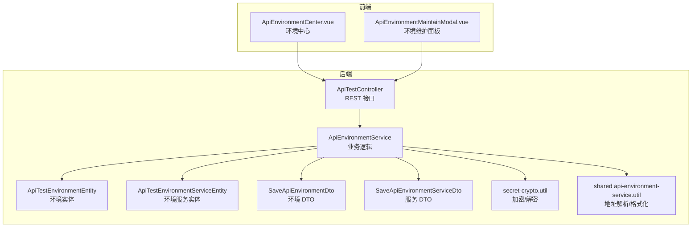
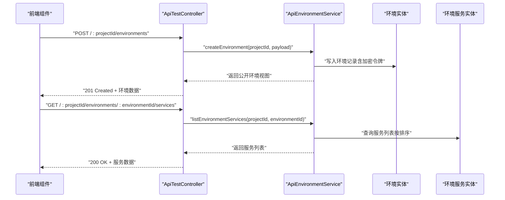
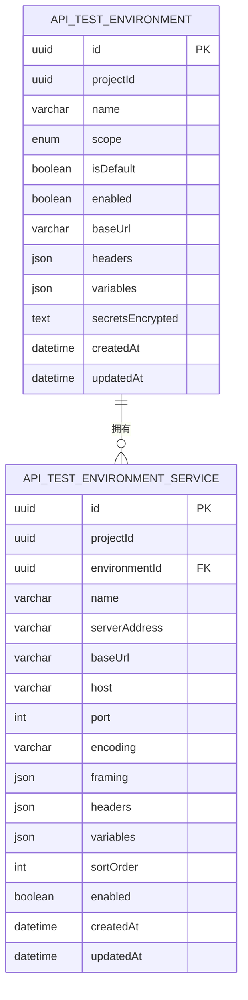
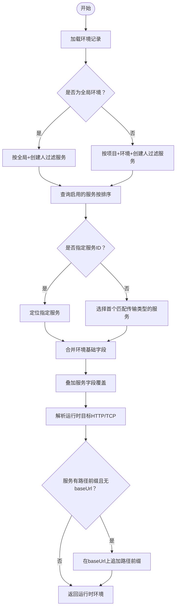
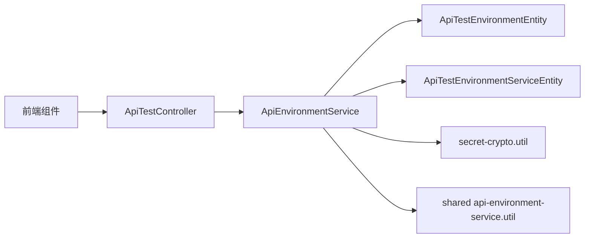

# 环境配置管理

<cite>
**本文引用的文件**
- [apps/api/src/modules/api-test/entity/api-test-environment.entity.ts](file://apps/api/src/modules/api-test/entity/api-test-environment.entity.ts)
- [apps/api/src/modules/api-test/entity/api-test-environment-service.entity.ts](file://apps/api/src/modules/api-test/entity/api-test-environment-service.entity.ts)
- [apps/api/src/modules/api-test/service/api-environment.service.ts](file://apps/api/src/modules/api-test/service/api-environment.service.ts)
- [apps/api/src/modules/api-test/controller/api-test.controller.ts](file://apps/api/src/modules/api-test/controller/api-test.controller.ts)
- [apps/api/src/modules/api-test/dto/save-environment.dto.ts](file://apps/api/src/modules/api-test/dto/save-environment.dto.ts)
- [apps/api/src/modules/api-test/dto/execution-platform.dto.ts](file://apps/api/src/modules/api-test/dto/execution-platform.dto.ts)
- [apps/api/src/modules/api-test/util/secret-crypto.util.ts](file://apps/api/src/modules/api-test/util/secret-crypto.util.ts)
- [packages/shared/src/api-environment-service.util.ts](file://packages/shared/src/api-environment-service.util.ts)
- [apps/web/src/components/api-test/ApiEnvironmentCenter.vue](file://apps/web/src/components/api-test/ApiEnvironmentCenter.vue)
- [apps/web/src/components/api-test/ApiEnvironmentMaintainModal.vue](file://apps/web/src/components/api-test/ApiEnvironmentMaintainModal.vue)
</cite>

## 目录
1. [简介](#简介)
2. [项目结构](#项目结构)
3. [核心组件](#核心组件)
4. [架构总览](#架构总览)
5. [详细组件分析](#详细组件分析)
6. [依赖分析](#依赖分析)
7. [性能考虑](#性能考虑)
8. [故障排查指南](#故障排查指南)
9. [结论](#结论)
10. [附录](#附录)

## 简介
本文件为“环境配置管理”模块的详细 API 文档，覆盖测试环境的创建、更新、删除、查询，以及环境服务的管理能力。重点说明环境变量配置、服务地址设置、认证信息管理、环境切换机制；解释环境与项目、用例的关联关系；阐述环境继承与覆盖规则，并提供多环境配置最佳实践与安全配置建议。

## 项目结构
围绕环境配置管理的关键文件组织如下：
- 实体层：定义环境与环境服务的数据模型
- DTO 层：定义前后端交互的数据结构
- 服务层：实现业务逻辑（加密、解密、运行时合并）
- 控制器层：暴露 REST API 接口
- 共享工具：地址解析与格式化
- 前端组件：环境中心与环境维护面板

图表来源
- [apps/api/src/modules/api-test/controller/api-test.controller.ts:318-420](file://apps/api/src/modules/api-test/controller/api-test.controller.ts#L318-L420)
- [apps/api/src/modules/api-test/service/api-environment.service.ts:25-364](file://apps/api/src/modules/api-test/service/api-environment.service.ts#L25-L364)
- [apps/api/src/modules/api-test/entity/api-test-environment.entity.ts:10-54](file://apps/api/src/modules/api-test/entity/api-test-environment.entity.ts#L10-L54)
- [apps/api/src/modules/api-test/entity/api-test-environment-service.entity.ts:10-88](file://apps/api/src/modules/api-test/entity/api-test-environment-service.entity.ts#L10-L88)
- [apps/api/src/modules/api-test/dto/save-environment.dto.ts:10-49](file://apps/api/src/modules/api-test/dto/save-environment.dto.ts#L10-L49)
- [apps/api/src/modules/api-test/dto/execution-platform.dto.ts:12-72](file://apps/api/src/modules/api-test/dto/execution-platform.dto.ts#L12-L72)
- [apps/api/src/modules/api-test/util/secret-crypto.util.ts:14-47](file://apps/api/src/modules/api-test/util/secret-crypto.util.ts#L14-L47)
- [packages/shared/src/api-environment-service.util.ts:10-89](file://packages/shared/src/api-environment-service.util.ts#L10-L89)
- [apps/web/src/components/api-test/ApiEnvironmentCenter.vue:1-101](file://apps/web/src/components/api-test/ApiEnvironmentCenter.vue#L1-L101)
- [apps/web/src/components/api-test/ApiEnvironmentMaintainModal.vue:1-737](file://apps/web/src/components/api-test/ApiEnvironmentMaintainModal.vue#L1-L737)

章节来源
- [apps/api/src/modules/api-test/controller/api-test.controller.ts:318-420](file://apps/api/src/modules/api-test/controller/api-test.controller.ts#L318-L420)
- [apps/api/src/modules/api-test/service/api-environment.service.ts:25-364](file://apps/api/src/modules/api-test/service/api-environment.service.ts#L25-L364)

## 核心组件
- 环境实体：存储项目级环境的基本信息、作用域、默认标记、启用状态、基础 URL、请求头、变量与加密的认证令牌等。
- 环境服务实体：描述具体的服务目标（HTTP/TCP），支持服务器地址、基础 URL、路径前缀、主机端口、编码、帧格式、请求头与变量等。
- 环境服务业务类：提供环境与服务的 CRUD、排序、运行时合并、默认环境清理与校验等。
- 控制器接口：对外暴露 REST API，统一调用服务层完成环境与服务的管理。
- 加密工具：对敏感字段进行对称加密存储，解密用于运行时使用。
- 地址解析工具：解析 serverAddress 字段，兼容 http(s) 与 socket2://host:port，输出统一结构供运行时使用。

章节来源
- [apps/api/src/modules/api-test/entity/api-test-environment.entity.ts:10-54](file://apps/api/src/modules/api-test/entity/api-test-environment.entity.ts#L10-L54)
- [apps/api/src/modules/api-test/entity/api-test-environment-service.entity.ts:10-88](file://apps/api/src/modules/api-test/entity/api-test-environment-service.entity.ts#L10-L88)
- [apps/api/src/modules/api-test/service/api-environment.service.ts:25-364](file://apps/api/src/modules/api-test/service/api-environment.service.ts#L25-L364)
- [apps/api/src/modules/api-test/util/secret-crypto.util.ts:14-47](file://apps/api/src/modules/api-test/util/secret-crypto.util.ts#L14-L47)
- [packages/shared/src/api-environment-service.util.ts:10-89](file://packages/shared/src/api-environment-service.util.ts#L10-L89)

## 架构总览
环境配置管理采用“控制器-服务-实体”的分层设计，前端通过组件触发 API 调用，服务层负责数据持久化与运行时合并，共享工具提供地址解析与格式化。

图表来源
- [apps/api/src/modules/api-test/controller/api-test.controller.ts:318-420](file://apps/api/src/modules/api-test/controller/api-test.controller.ts#L318-L420)
- [apps/api/src/modules/api-test/service/api-environment.service.ts:33-168](file://apps/api/src/modules/api-test/service/api-environment.service.ts#L33-L168)

## 详细组件分析

### 数据模型与关系
- 环境表包含项目标识、名称、作用域（全局/系统/个人）、默认标记、启用状态、基础 URL、请求头、变量与加密令牌。
- 环境服务表包含服务名、传输协议（HTTP/TCP）、服务器地址、基础 URL、路径前缀、主机端口、编码、帧格式、请求头与变量等。
- 关系：一个环境可包含多个服务，服务按排序字段有序排列；运行时可按需选择某个服务，或合并环境与服务的配置。

图表来源
- [apps/api/src/modules/api-test/entity/api-test-environment.entity.ts:10-54](file://apps/api/src/modules/api-test/entity/api-test-environment.entity.ts#L10-L54)
- [apps/api/src/modules/api-test/entity/api-test-environment-service.entity.ts:10-88](file://apps/api/src/modules/api-test/entity/api-test-environment-service.entity.ts#L10-L88)

章节来源
- [apps/api/src/modules/api-test/entity/api-test-environment.entity.ts:10-54](file://apps/api/src/modules/api-test/entity/api-test-environment.entity.ts#L10-L54)
- [apps/api/src/modules/api-test/entity/api-test-environment-service.entity.ts:10-88](file://apps/api/src/modules/api-test/entity/api-test-environment-service.entity.ts#L10-L88)

### 运行时环境合并与覆盖规则
- 合并顺序：环境基础配置（baseUrl、headers、variables、secrets）作为基线；若指定服务 ID，则叠加服务的对应字段；最终形成运行时环境对象。
- 覆盖优先级：服务级别字段覆盖环境同名字段；当服务提供 baseUrl 时，会覆盖环境的 baseUrl；当服务提供 host/port 且传输为 TCP 时，会覆盖 HTTP 的 baseUrl。
- 路径拼接：若服务提供 pathPrefix 且未提供 baseUrl，则在环境 baseUrl 上追加路径前缀并去除多余斜杠。
- 默认服务选择：若未指定服务 ID，运行时会根据传输类型（HTTP/TCP）从可用服务中选择第一个匹配项。

图表来源
- [apps/api/src/modules/api-test/service/api-environment.service.ts:104-155](file://apps/api/src/modules/api-test/service/api-environment.service.ts#L104-L155)
- [apps/api/src/modules/api-test/service/api-environment.service.ts:366-408](file://apps/api/src/modules/api-test/service/api-environment.service.ts#L366-L408)
- [packages/shared/src/api-environment-service.util.ts:10-89](file://packages/shared/src/api-environment-service.util.ts#L10-L89)

章节来源
- [apps/api/src/modules/api-test/service/api-environment.service.ts:104-155](file://apps/api/src/modules/api-test/service/api-environment.service.ts#L104-L155)
- [apps/api/src/modules/api-test/service/api-environment.service.ts:366-408](file://apps/api/src/modules/api-test/service/api-environment.service.ts#L366-L408)
- [packages/shared/src/api-environment-service.util.ts:10-89](file://packages/shared/src/api-environment-service.util.ts#L10-L89)

### 认证信息管理与安全
- 敏感字段：环境层的令牌以明文形式提交，服务层不直接存储明文令牌，但可通过运行时合并传入。
- 存储策略：令牌在入库前进行对称加密存储；读取时解密，仅在返回给前端时显示掩码后的摘要。
- 密钥派生：加密密钥来自环境变量或回退值，确保部署一致性与安全性。
- 前端展示：返回对象包含掩码后的令牌与是否存在令牌标记，避免泄露完整凭据。

章节来源
- [apps/api/src/modules/api-test/dto/save-environment.dto.ts:30-33](file://apps/api/src/modules/api-test/dto/save-environment.dto.ts#L30-L33)
- [apps/api/src/modules/api-test/service/api-environment.service.ts:323-339](file://apps/api/src/modules/api-test/service/api-environment.service.ts#L323-L339)
- [apps/api/src/modules/api-test/util/secret-crypto.util.ts:14-47](file://apps/api/src/modules/api-test/util/secret-crypto.util.ts#L14-L47)

### API 定义与行为

#### 环境管理接口
- 列出环境
  - 方法与路径：GET /:projectId/environments
  - 请求参数：projectId
  - 返回：环境数组（公开视图，不含明文令牌）
- 创建环境
  - 方法与路径：POST /:projectId/environments
  - 请求体：SaveApiEnvironmentDto
  - 行为：若 isDefault 为真则清空该项目其他默认标记；若无默认则自动设为默认
- 更新环境
  - 方法与路径：PATCH /:projectId/environments/:environmentId
  - 请求体：SaveApiEnvironmentDto（可选字段）
  - 行为：若 isDefault 为真则清空该项目其他默认标记
- 删除环境
  - 方法与路径：DELETE /:projectId/environments/:environmentId
  - 行为：删除环境及其服务
- 获取运行时环境
  - 方法与路径：GET /:projectId/environments/:environmentId
  - 查询参数：environmentServiceId（可选）
  - 返回：合并后的运行时环境（含服务列表）

章节来源
- [apps/api/src/modules/api-test/controller/api-test.controller.ts:318-353](file://apps/api/src/modules/api-test/controller/api-test.controller.ts#L318-L353)
- [apps/api/src/modules/api-test/service/api-environment.service.ts:33-97](file://apps/api/src/modules/api-test/service/api-environment.service.ts#L33-L97)
- [apps/api/src/modules/api-test/service/api-environment.service.ts:104-155](file://apps/api/src/modules/api-test/service/api-environment.service.ts#L104-L155)

#### 环境服务管理接口
- 列出服务
  - 方法与路径：GET /:projectId/environments/:environmentId/services
  - 返回：服务数组（公开视图）
- 创建服务
  - 方法与路径：POST /:projectId/environments/:environmentId/services
  - 请求体：SaveApiEnvironmentServiceDto
  - 行为：自动计算排序序号；若提供 serverAddress 则解析并填充 transport/baseUrl/host/port
- 更新服务
  - 方法与路径：PATCH /:projectId/environments/:environmentId/services/:serviceId
  - 请求体：SaveApiEnvironmentServiceDto（可选字段）
- 重排服务
  - 方法与路径：PATCH /:projectId/environments/:environmentId/services/:serviceId/reorder
  - 请求体：方向（top/up/down）
- 删除服务
  - 方法与路径：DELETE /:projectId/environments/:environmentId/services/:serviceId

章节来源
- [apps/api/src/modules/api-test/controller/api-test.controller.ts:355-420](file://apps/api/src/modules/api-test/controller/api-test.controller.ts#L355-L420)
- [apps/api/src/modules/api-test/service/api-environment.service.ts:157-277](file://apps/api/src/modules/api-test/service/api-environment.service.ts#L157-L277)

### 前端集成与使用
- 环境中心：展示项目内可用环境，支持新建/编辑环境，选择默认环境。
- 环境维护面板：集中管理环境与服务，支持服务的增删改查、排序与批量操作。
- 交互流程：前端通过 Store 触发 API 调用，刷新环境与服务列表，实时反映运行时合并结果。

章节来源
- [apps/web/src/components/api-test/ApiEnvironmentCenter.vue:1-101](file://apps/web/src/components/api-test/ApiEnvironmentCenter.vue#L1-L101)
- [apps/web/src/components/api-test/ApiEnvironmentMaintainModal.vue:1-737](file://apps/web/src/components/api-test/ApiEnvironmentMaintainModal.vue#L1-L737)

## 依赖分析
- 控制器依赖服务：ApiTestController 将路由参数与请求体转交 ApiEnvironmentService 处理。
- 服务依赖实体与工具：ApiEnvironmentService 使用 TypeORM 实体进行持久化，并依赖加密工具与共享地址解析工具。
- 前端依赖控制器：Vue 组件通过 Store 调用控制器封装的 API 方法。

图表来源
- [apps/api/src/modules/api-test/controller/api-test.controller.ts:61-72](file://apps/api/src/modules/api-test/controller/api-test.controller.ts#L61-L72)
- [apps/api/src/modules/api-test/service/api-environment.service.ts:26-31](file://apps/api/src/modules/api-test/service/api-environment.service.ts#L26-L31)
- [apps/api/src/modules/api-test/util/secret-crypto.util.ts:1-48](file://apps/api/src/modules/api-test/util/secret-crypto.util.ts#L1-L48)
- [packages/shared/src/api-environment-service.util.ts:10-89](file://packages/shared/src/api-environment-service.util.ts#L10-L89)

章节来源
- [apps/api/src/modules/api-test/controller/api-test.controller.ts:61-72](file://apps/api/src/modules/api-test/controller/api-test.controller.ts#L61-L72)
- [apps/api/src/modules/api-test/service/api-environment.service.ts:26-31](file://apps/api/src/modules/api-test/service/api-environment.service.ts#L26-L31)

## 性能考虑
- 查询排序：服务列表按排序字段与创建时间排序，避免随机访问带来的额外开销。
- 默认环境清理：批量更新默认标记时使用范围条件，减少不必要的写放大。
- 运行时合并：仅在执行用例或集合时进行合并，避免在非必要场景重复计算。
- 建议：对高频查询建立合适索引（如项目+默认标记、环境+启用状态），并控制服务数量以降低合并成本。

## 故障排查指南
- 环境不存在或被禁用：服务层在查询环境时会校验启用状态与作用域，若不存在将抛出异常。
- 服务不存在或被禁用：指定服务 ID 时若未找到或未启用，将抛出异常。
- HTTP 服务缺少有效 Base URL：运行时解析 HTTP 服务时若未提供 http(s) 协议的 baseUrl，将抛出错误并给出提示。
- 令牌解密失败：若加密 blob 异常，解密函数会返回空对象，需检查存储完整性与密钥一致性。

章节来源
- [apps/api/src/modules/api-test/service/api-environment.service.ts:298-310](file://apps/api/src/modules/api-test/service/api-environment.service.ts#L298-L310)
- [apps/api/src/modules/api-test/service/api-environment.service.ts:123-133](file://apps/api/src/modules/api-test/service/api-environment.service.ts#L123-L133)
- [apps/api/src/modules/api-test/service/api-environment.service.ts:436-459](file://apps/api/src/modules/api-test/service/api-environment.service.ts#L436-L459)
- [apps/api/src/modules/api-test/util/secret-crypto.util.ts:27-41](file://apps/api/src/modules/api-test/util/secret-crypto.util.ts#L27-L41)

## 结论
本模块提供了完善的测试环境与服务管理能力，支持多作用域、多服务、运行时合并与安全存储。通过清晰的 API 分层与前端组件配合，用户可以高效地维护与切换环境，满足复杂测试场景的需求。

## 附录

### 最佳实践
- 环境命名：使用语义化名称区分环境（如 dev/staging/prod），便于团队协作与自动化。
- 作用域策略：优先使用系统/个人环境承载通用配置，全局环境用于跨项目共享。
- 默认环境：每个项目保留一个默认环境，减少手动选择成本。
- 服务排序：合理安排服务顺序，确保默认服务符合常用场景。
- 变量与头：将可变配置放入变量，静态配置放入头，避免硬编码。
- 路径前缀：在服务层配置 pathPrefix，统一处理相对路径问题。

### 安全配置建议
- 令牌管理：仅在创建/更新时提交明文令牌，避免长期暴露；定期轮换。
- 加密密钥：确保生产环境密钥稳定且权限最小化，避免泄露。
- 访问控制：结合用户作用域限制可见与修改范围，防止越权。
- 日志脱敏：避免在日志中打印完整令牌，使用掩码或摘要展示。