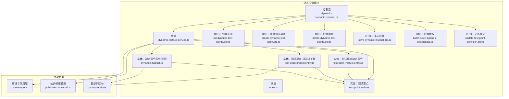
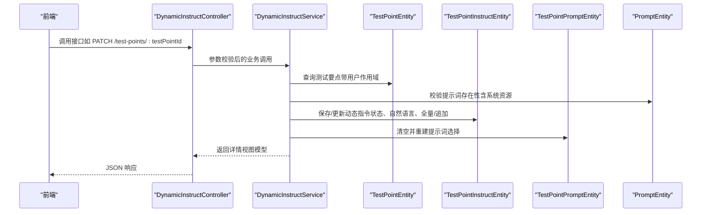
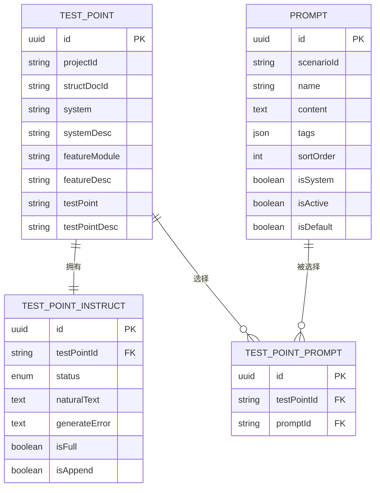
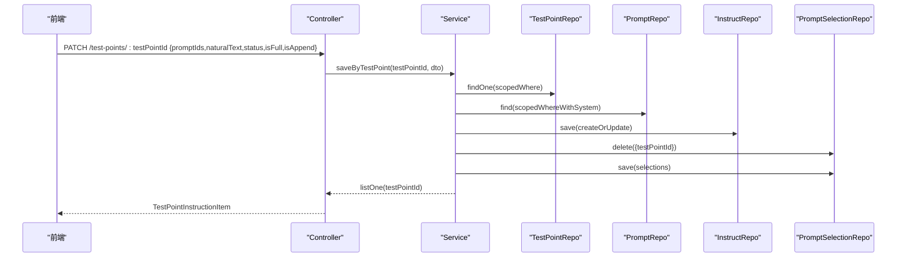
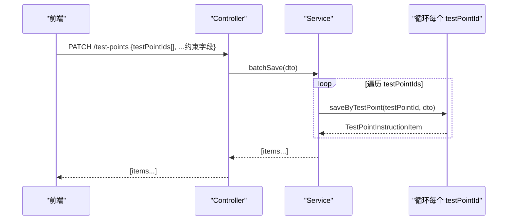
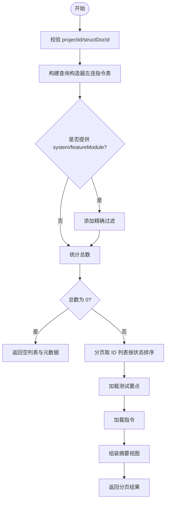
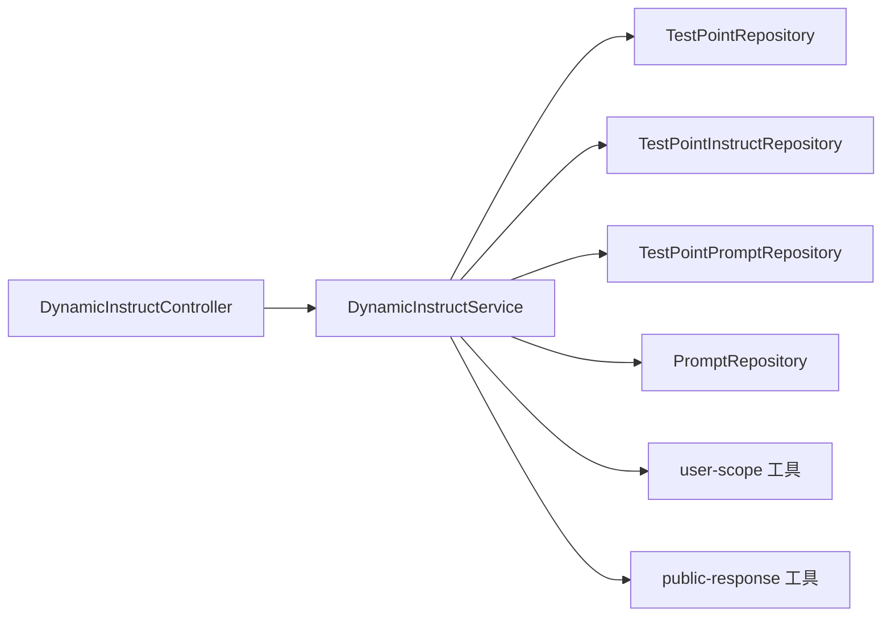

# 动态指令 API

<cite>
**本文引用的文件**
- [apps/api/src/modules/dynamic-instruct/controller/dynamic-instruct.controller.ts](file://apps/api/src/modules/dynamic-instruct/controller/dynamic-instruct.controller.ts)
- [apps/api/src/modules/dynamic-instruct/service/dynamic-instruct.service.ts](file://apps/api/src/modules/dynamic-instruct/service/dynamic-instruct.service.ts)
- [apps/api/src/modules/dynamic-instruct/entity/test-point-instruct.entity.ts](file://apps/api/src/modules/dynamic-instruct/entity/test-point-instruct.entity.ts)
- [apps/api/src/modules/dynamic-instruct/entity/test-point-prompt.entity.ts](file://apps/api/src/modules/dynamic-instruct/entity/test-point-prompt.entity.ts)
- [apps/api/src/modules/dynamic-instruct/entity/dynamic-instruct.ts](file://apps/api/src/modules/dynamic-instruct/entity/dynamic-instruct.ts)
- [apps/api/src/modules/dynamic-instruct/dto/list-dynamic-test-points.dto.ts](file://apps/api/src/modules/dynamic-instruct/dto/list-dynamic-test-points.dto.ts)
- [apps/api/src/modules/dynamic-instruct/dto/create-dynamic-test-point.dto.ts](file://apps/api/src/modules/dynamic-instruct/dto/create-dynamic-test-point.dto.ts)
- [apps/api/src/modules/dynamic-instruct/dto/delete-dynamic-test-points.dto.ts](file://apps/api/src/modules/dynamic-instruct/dto/delete-dynamic-test-points.dto.ts)
- [apps/api/src/modules/dynamic-instruct/dto/save-dynamic-instruct.dto.ts](file://apps/api/src/modules/dynamic-instruct/dto/save-dynamic-instruct.dto.ts)
- [apps/api/src/modules/dynamic-instruct/dto/batch-save-dynamic-instruct.dto.ts](file://apps/api/src/modules/dynamic-instruct/dto/batch-save-dynamic-instruct.dto.ts)
- [apps/api/src/modules/dynamic-instruct/dto/update-test-point-definition.dto.ts](file://apps/api/src/modules/dynamic-instruct/dto/update-test-point-definition.dto.ts)
- [apps/api/src/modules/struct-doc/entity/test-point.entity.ts](file://apps/api/src/modules/struct-doc/entity/test-point.entity.ts)
- [apps/api/src/modules/scenario/entity/prompt.entity.ts](file://apps/api/src/modules/scenario/entity/prompt.entity.ts)
- [apps/api/src/common/http/public-response.util.ts](file://apps/api/src/common/http/public-response.util.ts)
- [apps/api/src/common/audit/user-scope.ts](file://apps/api/src/common/audit/user-scope.ts)
- [apps/web/src/api/client.ts](file://apps/web/src/api/client.ts)
</cite>

## 目录
1. [简介](#简介)
2. [项目结构](#项目结构)
3. [核心组件](#核心组件)
4. [架构总览](#架构总览)
5. [详细组件分析](#详细组件分析)
6. [依赖分析](#依赖分析)
7. [性能考虑](#性能考虑)
8. [故障排查指南](#故障排查指南)
9. [结论](#结论)
10. [附录](#附录)

## 简介
本文件为“动态指令模块”的 API 文档，聚焦于“测试要点”的创建、查询、更新、删除以及“动态指令”的保存与批量保存，同时涵盖“提示词管理”（选择与关联）。文档提供接口定义、请求参数、响应格式、状态流转与错误处理机制，并给出典型使用场景与最佳实践。

## 项目结构
动态指令模块位于后端 NestJS 应用的 dynamic-instruct 子模块，包含控制器、服务、DTO、实体与模块注册；前端通过统一客户端封装调用。

图表来源
- [apps/api/src/modules/dynamic-instruct/controller/dynamic-instruct.controller.ts:24-107](file://apps/api/src/modules/dynamic-instruct/controller/dynamic-instruct.controller.ts#L24-L107)
- [apps/api/src/modules/dynamic-instruct/service/dynamic-instruct.service.ts:52-65](file://apps/api/src/modules/dynamic-instruct/service/dynamic-instruct.service.ts#L52-L65)
- [apps/api/src/modules/dynamic-instruct/entity/test-point.entity.ts:35-105](file://apps/api/src/modules/struct-doc/entity/test-point.entity.ts#L35-L105)
- [apps/api/src/modules/dynamic-instruct/entity/test-point-instruct.entity.ts:32-86](file://apps/api/src/modules/dynamic-instruct/entity/test-point-instruct.entity.ts#L32-L86)
- [apps/api/src/modules/dynamic-instruct/entity/test-point-prompt.entity.ts:20-62](file://apps/api/src/modules/dynamic-instruct/entity/test-point-prompt.entity.ts#L20-L62)
- [apps/api/src/modules/dynamic-instruct/entity/dynamic-instruct.ts:11-67](file://apps/api/src/modules/dynamic-instruct/entity/dynamic-instruct.ts#L11-L67)
- [apps/api/src/modules/dynamic-instruct/dto/list-dynamic-test-points.dto.ts:10-42](file://apps/api/src/modules/dynamic-instruct/dto/list-dynamic-test-points.dto.ts#L10-L42)
- [apps/api/src/modules/dynamic-instruct/dto/create-dynamic-test-point.dto.ts:7-45](file://apps/api/src/modules/dynamic-instruct/dto/create-dynamic-test-point.dto.ts#L7-L45)
- [apps/api/src/modules/dynamic-instruct/dto/delete-dynamic-test-points.dto.ts:7-13](file://apps/api/src/modules/dynamic-instruct/dto/delete-dynamic-test-points.dto.ts#L7-L13)
- [apps/api/src/modules/dynamic-instruct/dto/save-dynamic-instruct.dto.ts:23-49](file://apps/api/src/modules/dynamic-instruct/dto/save-dynamic-instruct.dto.ts#L23-L49)
- [apps/api/src/modules/dynamic-instruct/dto/batch-save-dynamic-instruct.dto.ts:10-16](file://apps/api/src/modules/dynamic-instruct/dto/batch-save-dynamic-instruct.dto.ts#L10-L16)
- [apps/api/src/modules/dynamic-instruct/dto/update-test-point-definition.dto.ts:7-37](file://apps/api/src/modules/dynamic-instruct/dto/update-test-point-definition.dto.ts#L7-L37)
- [apps/api/src/modules/scenario/entity/prompt.entity.ts:26-96](file://apps/api/src/modules/scenario/entity/prompt.entity.ts#L26-L96)
- [apps/api/src/common/audit/user-scope.ts:14-90](file://apps/api/src/common/audit/user-scope.ts#L14-L90)
- [apps/api/src/common/http/public-response.util.ts:46-75](file://apps/api/src/common/http/public-response.util.ts#L46-L75)

章节来源
- [apps/api/src/modules/dynamic-instruct/controller/dynamic-instruct.controller.ts:24-107](file://apps/api/src/modules/dynamic-instruct/controller/dynamic-instruct.controller.ts#L24-L107)
- [apps/api/src/modules/dynamic-instruct/index.ts:14-29](file://apps/api/src/modules/dynamic-instruct/index.ts#L14-L29)

## 核心组件
- 控制器：暴露 REST 接口，负责路由与参数绑定，调用服务层。
- 服务层：实现业务逻辑，包括测试要点与动态指令的 CRUD、状态管理、提示词选择、分页与筛选、项目作用域校验。
- 实体层：测试要点、动态指令主表、提示词选择中间表、动态指令历史/中间表。
- DTO 层：输入参数校验与 Swagger 注解。
- 公共工具：审计作用域（用户隔离）、公共响应转换（对外暴露字段标准化）。

章节来源
- [apps/api/src/modules/dynamic-instruct/service/dynamic-instruct.service.ts:52-65](file://apps/api/src/modules/dynamic-instruct/service/dynamic-instruct.service.ts#L52-L65)
- [apps/api/src/common/audit/user-scope.ts:14-90](file://apps/api/src/common/audit/user-scope.ts#L14-L90)
- [apps/api/src/common/http/public-response.util.ts:46-75](file://apps/api/src/common/http/public-response.util.ts#L46-L75)

## 架构总览
动态指令模块采用典型的三层架构：控制器接收请求，服务层编排业务，仓储层访问数据库。服务层通过审计工具确保用户只能访问自己的资源，通过公共响应工具统一输出字段。

图表来源
- [apps/api/src/modules/dynamic-instruct/controller/dynamic-instruct.controller.ts:74-86](file://apps/api/src/modules/dynamic-instruct/controller/dynamic-instruct.controller.ts#L74-L86)
- [apps/api/src/modules/dynamic-instruct/service/dynamic-instruct.service.ts:323-383](file://apps/api/src/modules/dynamic-instruct/service/dynamic-instruct.service.ts#L323-L383)
- [apps/api/src/common/audit/user-scope.ts:48-75](file://apps/api/src/common/audit/user-scope.ts#L48-L75)

## 详细组件分析

### 接口总览与路径
- GET /dynamic-instruct/test-points/meta
  - 功能：获取编辑区元数据（系统、功能模块、定义样例）
  - 认证：需要登录用户
  - 作用域：仅限当前用户或系统资源
- GET /dynamic-instruct/test-points/generating
  - 功能：列出仍在“生成中”的测试要点（用于恢复轮询）
  - 认证：需要登录用户
- GET /dynamic-instruct/test-points
  - 功能：分页查询测试要点摘要（支持按系统/模块筛选）
  - 认证：需要登录用户
- POST /dynamic-instruct/test-points
  - 功能：新增测试要点
  - 认证：需要登录用户
- DELETE /dynamic-instruct/test-points
  - 功能：批量删除测试要点
  - 认证：需要登录用户
- GET /dynamic-instruct/test-points/:testPointId
  - 功能：获取单个测试要点的动态指令详情
  - 认证：需要登录用户
- PATCH /dynamic-instruct/test-points/:testPointId
  - 功能：保存单个测试要点的动态指令（状态、自然语言、提示词、全量/追加）
  - 认证：需要登录用户
- PATCH /dynamic-instruct/test-points/:testPointId/definition
  - 功能：更新测试要点定义字段（不触发全量替换）
  - 认证：需要登录用户
- PATCH /dynamic-instruct/test-points
  - 功能：批量保存多个测试要点的动态指令（共用同一套约束）
  - 认证：需要登录用户

章节来源
- [apps/api/src/modules/dynamic-instruct/controller/dynamic-instruct.controller.ts:32-106](file://apps/api/src/modules/dynamic-instruct/controller/dynamic-instruct.controller.ts#L32-L106)

### 请求参数与响应格式

#### GET /dynamic-instruct/test-points/meta
- 查询参数
  - projectId: string（必填）
  - structDocId: string（必填）
- 响应
  - systems: string[]
  - featureModules: string[]
  - definitionSamples: TestPointSummaryItem[]（不含动态指令正文）

章节来源
- [apps/api/src/modules/dynamic-instruct/controller/dynamic-instruct.controller.ts:33-39](file://apps/api/src/modules/dynamic-instruct/controller/dynamic-instruct.controller.ts#L33-L39)
- [apps/api/src/modules/dynamic-instruct/service/dynamic-instruct.service.ts:179-207](file://apps/api/src/modules/dynamic-instruct/service/dynamic-instruct.service.ts#L179-L207)
- [apps/api/src/common/http/public-response.util.ts:77-80](file://apps/api/src/common/http/public-response.util.ts#L77-L80)

#### GET /dynamic-instruct/test-points/generating
- 查询参数
  - projectId: string（必填）
  - structDocId: string（必填）
- 响应
  - id: string
  - testPoint: string

章节来源
- [apps/api/src/modules/dynamic-instruct/controller/dynamic-instruct.controller.ts:42-51](file://apps/api/src/modules/dynamic-instruct/controller/dynamic-instruct.controller.ts#L42-L51)
- [apps/api/src/modules/dynamic-instruct/service/dynamic-instruct.service.ts:210-229](file://apps/api/src/modules/dynamic-instruct/service/dynamic-instruct.service.ts#L210-L229)

#### GET /dynamic-instruct/test-points
- 查询参数（ListDynamicTestPointsDto）
  - projectId: string（必填）
  - structDocId: string（必填）
  - system?: string（可选，精确筛选）
  - featureModule?: string（可选，精确筛选）
  - page?: number（可选，默认 1，最小 1）
  - pageSize?: number（可选，默认 10，枚举来自共享配置）
- 响应
  - items: TestPointSummaryItem[]
  - total: number
  - page: number
  - pageSize: number
  - systems: string[]
  - featureModules: string[]

章节来源
- [apps/api/src/modules/dynamic-instruct/controller/dynamic-instruct.controller.ts:56-59](file://apps/api/src/modules/dynamic-instruct/controller/dynamic-instruct.controller.ts#L56-L59)
- [apps/api/src/modules/dynamic-instruct/dto/list-dynamic-test-points.dto.ts:10-42](file://apps/api/src/modules/dynamic-instruct/dto/list-dynamic-test-points.dto.ts#L10-L42)
- [apps/api/src/modules/dynamic-instruct/service/dynamic-instruct.service.ts:70-140](file://apps/api/src/modules/dynamic-instruct/service/dynamic-instruct.service.ts#L70-L140)

#### POST /dynamic-instruct/test-points
- 请求体（CreateDynamicTestPointDto）
  - projectId: string（必填）
  - structDocId: string（必填）
  - system?: string（可选）
  - systemDesc?: string（可选）
  - featureModule?: string（可选）
  - featureDesc?: string（可选）
  - testPoint?: string（可选）
  - testPointDesc?: string（可选）
- 响应
  - TestPointSummaryItem

章节来源
- [apps/api/src/modules/dynamic-instruct/controller/dynamic-instruct.controller.ts:62-65](file://apps/api/src/modules/dynamic-instruct/controller/dynamic-instruct.controller.ts#L62-L65)
- [apps/api/src/modules/dynamic-instruct/dto/create-dynamic-test-point.dto.ts:7-45](file://apps/api/src/modules/dynamic-instruct/dto/create-dynamic-test-point.dto.ts#L7-L45)
- [apps/api/src/modules/dynamic-instruct/service/dynamic-instruct.service.ts:232-248](file://apps/api/src/modules/dynamic-instruct/service/dynamic-instruct.service.ts#L232-L248)

#### DELETE /dynamic-instruct/test-points
- 请求体（DeleteDynamicTestPointsDto）
  - testPointIds: string[]（必填，非空数组）
- 响应
  - deleted: number
  - testPointIds: string[]

章节来源
- [apps/api/src/modules/dynamic-instruct/controller/dynamic-instruct.controller.ts:68-71](file://apps/api/src/modules/dynamic-instruct/controller/dynamic-instruct.controller.ts#L68-L71)
- [apps/api/src/modules/dynamic-instruct/dto/delete-dynamic-test-points.dto.ts:7-13](file://apps/api/src/modules/dynamic-instruct/dto/delete-dynamic-test-points.dto.ts#L7-L13)
- [apps/api/src/modules/dynamic-instruct/service/dynamic-instruct.service.ts:300-316](file://apps/api/src/modules/dynamic-instruct/service/dynamic-instruct.service.ts#L300-L316)

#### GET /dynamic-instruct/test-points/:testPointId
- 路径参数
  - testPointId: string（必填）
- 响应
  - TestPointInstructionItem（包含 status、naturalText、generateError、isFull、isAppend、promptIds、prompts）

章节来源
- [apps/api/src/modules/dynamic-instruct/controller/dynamic-instruct.controller.ts:74-77](file://apps/api/src/modules/dynamic-instruct/controller/dynamic-instruct.controller.ts#L74-L77)
- [apps/api/src/modules/dynamic-instruct/service/dynamic-instruct.service.ts:401-417](file://apps/api/src/modules/dynamic-instruct/service/dynamic-instruct.service.ts#L401-L417)

#### PATCH /dynamic-instruct/test-points/:testPointId
- 路径参数
  - testPointId: string（必填）
- 请求体（SaveDynamicInstructDto）
  - promptIds?: string[]（可选）
  - naturalText?: string（可选）
  - status?: "待编辑"|"已编辑"|"再编辑"|"生成中"|"生成失败"|"生成完成"（可选）
  - isFull?: boolean（可选，默认 true）
  - isAppend?: boolean（可选，默认 false）
- 响应
  - TestPointInstructionItem

章节来源
- [apps/api/src/modules/dynamic-instruct/controller/dynamic-instruct.controller.ts:80-86](file://apps/api/src/modules/dynamic-instruct/controller/dynamic-instruct.controller.ts#L80-L86)
- [apps/api/src/modules/dynamic-instruct/dto/save-dynamic-instruct.dto.ts:23-49](file://apps/api/src/modules/dynamic-instruct/dto/save-dynamic-instruct.dto.ts#L23-L49)
- [apps/api/src/modules/dynamic-instruct/service/dynamic-instruct.service.ts:323-383](file://apps/api/src/modules/dynamic-instruct/service/dynamic-instruct.service.ts#L323-L383)

#### PATCH /dynamic-instruct/test-points/:testPointId/definition
- 路径参数
  - testPointId: string（必填）
- 请求体（UpdateTestPointDefinitionDto）
  - system?: string（可选）
  - systemDesc?: string（可选）
  - featureModule?: string（可选）
  - featureDesc?: string（可选）
  - testPoint?: string（可选）
  - testPointDesc?: string（可选）
- 响应
  - TestPointInstructionItem

章节来源
- [apps/api/src/modules/dynamic-instruct/controller/dynamic-instruct.controller.ts:89-98](file://apps/api/src/modules/dynamic-instruct/controller/dynamic-instruct.controller.ts#L89-L98)
- [apps/api/src/modules/dynamic-instruct/dto/update-test-point-definition.dto.ts:7-37](file://apps/api/src/modules/dynamic-instruct/dto/update-test-point-definition.dto.ts#L7-L37)
- [apps/api/src/modules/dynamic-instruct/service/dynamic-instruct.service.ts:251-297](file://apps/api/src/modules/dynamic-instruct/service/dynamic-instruct.service.ts#L251-L297)

#### PATCH /dynamic-instruct/test-points
- 请求体（BatchSaveDynamicInstructDto）
  - 继承 SaveDynamicInstructDto 的字段
  - testPointIds: string[]（必填，非空数组）
- 响应
  - TestPointInstructionItem[]（每个被保存的测试要点详情）

章节来源
- [apps/api/src/modules/dynamic-instruct/controller/dynamic-instruct.controller.ts:101-106](file://apps/api/src/modules/dynamic-instruct/controller/dynamic-instruct.controller.ts#L101-L106)
- [apps/api/src/modules/dynamic-instruct/dto/batch-save-dynamic-instruct.dto.ts:10-16](file://apps/api/src/modules/dynamic-instruct/dto/batch-save-dynamic-instruct.dto.ts#L10-L16)
- [apps/api/src/modules/dynamic-instruct/service/dynamic-instruct.service.ts:389-395](file://apps/api/src/modules/dynamic-instruct/service/dynamic-instruct.service.ts#L389-L395)

### 数据模型与状态管理

图表来源
- [apps/api/src/modules/struct-doc/entity/test-point.entity.ts:35-105](file://apps/api/src/modules/struct-doc/entity/test-point.entity.ts#L35-L105)
- [apps/api/src/modules/dynamic-instruct/entity/test-point-instruct.entity.ts:32-86](file://apps/api/src/modules/dynamic-instruct/entity/test-point-instruct.entity.ts#L32-L86)
- [apps/api/src/modules/dynamic-instruct/entity/test-point-prompt.entity.ts:20-62](file://apps/api/src/modules/dynamic-instruct/entity/test-point-prompt.entity.ts#L20-L62)
- [apps/api/src/modules/scenario/entity/prompt.entity.ts:26-96](file://apps/api/src/modules/scenario/entity/prompt.entity.ts#L26-L96)

#### 状态枚举与排序
- 状态枚举：待编辑、已编辑、再编辑、生成中、生成失败、生成完成
- 列表排序优先级：生成失败 < 待编辑 < 已编辑/再编辑 < 生成中 < 生成完成

章节来源
- [apps/api/src/modules/dynamic-instruct/entity/test-point-instruct.entity.ts:16-27](file://apps/api/src/modules/dynamic-instruct/entity/test-point-instruct.entity.ts#L16-L27)
- [apps/api/src/modules/dynamic-instruct/service/dynamic-instruct.service.ts:37-47](file://apps/api/src/modules/dynamic-instruct/service/dynamic-instruct.service.ts#L37-L47)

### 处理流程与时序

#### 保存单个测试要点的动态指令

图表来源
- [apps/api/src/modules/dynamic-instruct/controller/dynamic-instruct.controller.ts:80-86](file://apps/api/src/modules/dynamic-instruct/controller/dynamic-instruct.controller.ts#L80-L86)
- [apps/api/src/modules/dynamic-instruct/service/dynamic-instruct.service.ts:323-383](file://apps/api/src/modules/dynamic-instruct/service/dynamic-instruct.service.ts#L323-L383)

#### 批量保存多个测试要点的动态指令

图表来源
- [apps/api/src/modules/dynamic-instruct/controller/dynamic-instruct.controller.ts:101-106](file://apps/api/src/modules/dynamic-instruct/controller/dynamic-instruct.controller.ts#L101-L106)
- [apps/api/src/modules/dynamic-instruct/service/dynamic-instruct.service.ts:389-395](file://apps/api/src/modules/dynamic-instruct/service/dynamic-instruct.service.ts#L389-L395)

#### 列表查询与筛选

图表来源
- [apps/api/src/modules/dynamic-instruct/service/dynamic-instruct.service.ts:70-140](file://apps/api/src/modules/dynamic-instruct/service/dynamic-instruct.service.ts#L70-L140)

### 错误处理机制
- 404（未找到）
  - 资源不存在或不属于当前用户（通过审计工具统一抛出）
  - 提示词不存在（按 ID 校验）
- 400（参数错误）
  - 批量删除未提供 ID 列表
  - 更新测试要点定义时系统、模块、测试要点任一为空
- 状态与业务规则
  - 保存指令时若未提供状态且无提示词与自然语言，则默认为“待编辑”
  - 生成失败状态下保留上次错误信息字段

章节来源
- [apps/api/src/common/audit/user-scope.ts:48-75](file://apps/api/src/common/audit/user-scope.ts#L48-L75)
- [apps/api/src/modules/dynamic-instruct/service/dynamic-instruct.service.ts:337-341](file://apps/api/src/modules/dynamic-instruct/service/dynamic-instruct.service.ts#L337-L341)
- [apps/api/src/modules/dynamic-instruct/service/dynamic-instruct.service.ts:290-292](file://apps/api/src/modules/dynamic-instruct/service/dynamic-instruct.service.ts#L290-L292)
- [apps/api/src/modules/dynamic-instruct/service/dynamic-instruct.service.ts:343-363](file://apps/api/src/modules/dynamic-instruct/service/dynamic-instruct.service.ts#L343-L363)

### 实际使用场景与最佳实践
- 场景一：批量导入测试要点后，统一设置“生成中”状态并等待生成完成
  - 建议：先 POST 创建要点，再 PATCH 设置 status=“生成中”，最后轮询 GET generating 恢复状态
- 场景二：多人协作编辑同一结构化文档下的测试要点
  - 建议：利用审计作用域保证资源隔离，避免跨用户读写冲突
- 场景三：提示词选择与自然语言约束的组合使用
  - 建议：先选择一组提示词，再补充自然语言细节，最终统一保存；必要时使用 isFull=true 进行全量覆盖
- 场景四：批量保存多个测试要点的动态指令
  - 建议：将 testPointIds 与约束字段一起提交，减少多次往返

章节来源
- [apps/api/src/modules/dynamic-instruct/controller/dynamic-instruct.controller.ts:42-51](file://apps/api/src/modules/dynamic-instruct/controller/dynamic-instruct.controller.ts#L42-L51)
- [apps/api/src/modules/dynamic-instruct/service/dynamic-instruct.service.ts:389-395](file://apps/api/src/modules/dynamic-instruct/service/dynamic-instruct.service.ts#L389-L395)

## 依赖分析

图表来源
- [apps/api/src/modules/dynamic-instruct/controller/dynamic-instruct.controller.ts:27-30](file://apps/api/src/modules/dynamic-instruct/controller/dynamic-instruct.controller.ts#L27-L30)
- [apps/api/src/modules/dynamic-instruct/service/dynamic-instruct.service.ts:54-65](file://apps/api/src/modules/dynamic-instruct/service/dynamic-instruct.service.ts#L54-L65)
- [apps/api/src/common/audit/user-scope.ts:14-36](file://apps/api/src/common/audit/user-scope.ts#L14-L36)
- [apps/api/src/common/http/public-response.util.ts:46-75](file://apps/api/src/common/http/public-response.util.ts#L46-L75)

章节来源
- [apps/api/src/modules/dynamic-instruct/index.ts:14-29](file://apps/api/src/modules/dynamic-instruct/index.ts#L14-L29)

## 性能考虑
- 列表查询
  - 使用左连接指令表进行计数与分页，避免 N+1 查询
  - 按状态排序 SQL 将“生成失败”置于最前，便于问题定位
- 提示词选择
  - 批量保存时先清空旧选择，再批量插入，避免冗余数据
- 作用域与索引
  - 项目/文档维度的复合索引与用户隔离条件，提升查询效率
- 前端缓存
  - 列表接口带有 no-cache 头部，避免浏览器缓存导致的数据陈旧

章节来源
- [apps/api/src/modules/dynamic-instruct/service/dynamic-instruct.service.ts:420-441](file://apps/api/src/modules/dynamic-instruct/service/dynamic-instruct.service.ts#L420-L441)
- [apps/api/src/modules/dynamic-instruct/entity/test-point.entity.ts:24-34](file://apps/api/src/modules/struct-doc/entity/test-point.entity.ts#L24-L34)
- [apps/web/src/api/client.ts:562-575](file://apps/web/src/api/client.ts#L562-L575)

## 故障排查指南
- 404 资源不存在
  - 检查 projectId/structDocId 是否正确
  - 确认当前用户是否拥有该项目
- 400 参数错误
  - 批量删除时确认 testPointIds 非空
  - 更新定义时确保系统、功能模块、测试要点均非空
- 提示词不可用
  - 确认提示词 ID 存在且属于当前用户或系统资源
- 状态异常
  - 若 status=“生成失败”，检查 generateError 字段以定位问题
  - 若状态长时间停留在“生成中”，可通过 GET generating 恢复轮询

章节来源
- [apps/api/src/common/audit/user-scope.ts:48-75](file://apps/api/src/common/audit/user-scope.ts#L48-L75)
- [apps/api/src/modules/dynamic-instruct/service/dynamic-instruct.service.ts:337-341](file://apps/api/src/modules/dynamic-instruct/service/dynamic-instruct.service.ts#L337-L341)
- [apps/api/src/modules/dynamic-instruct/service/dynamic-instruct.service.ts:290-292](file://apps/api/src/modules/dynamic-instruct/service/dynamic-instruct.service.ts#L290-L292)

## 结论
动态指令模块提供了围绕“测试要点”与“动态指令”的完整生命周期管理能力，结合提示词选择与状态机，满足从结构化文档到测试用例生成的闭环需求。通过严格的用户作用域控制与标准化响应格式，既保障了安全性也提升了可维护性。

## 附录

### 前端调用示例（参考）
- 列表查询
  - GET /dynamic-instruct/test-points?projectId=...&structDocId=...
- 获取元数据
  - GET /dynamic-instruct/test-points/meta?projectId=...&structDocId=...
- 获取仍在生成中的要点
  - GET /dynamic-instruct/test-points/generating?projectId=...&structDocId=...
- 获取单个测试要点详情
  - GET /dynamic-instruct/test-points/{testPointId}
- 新增测试要点
  - POST /dynamic-instruct/test-points
- 批量删除
  - DELETE /dynamic-instruct/test-points
- 更新测试要点定义
  - PATCH /dynamic-instruct/test-points/{testPointId}/definition
- 保存单个测试要点的动态指令
  - PATCH /dynamic-instruct/test-points/{testPointId}
- 批量保存多个测试要点的动态指令
  - PATCH /dynamic-instruct/test-points

章节来源
- [apps/web/src/api/client.ts:562-642](file://apps/web/src/api/client.ts#L562-L642)