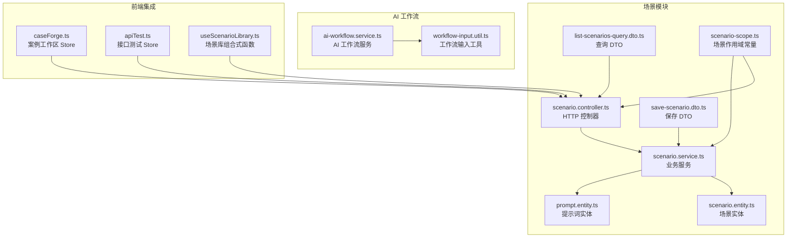
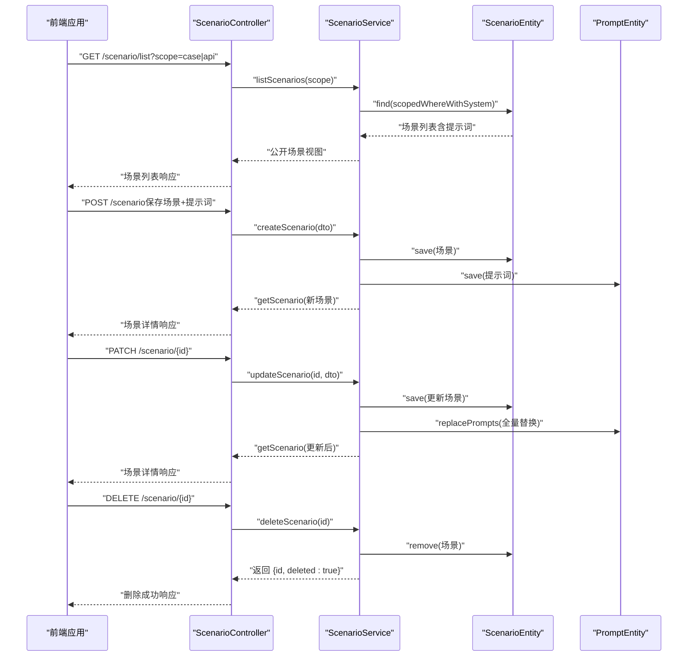
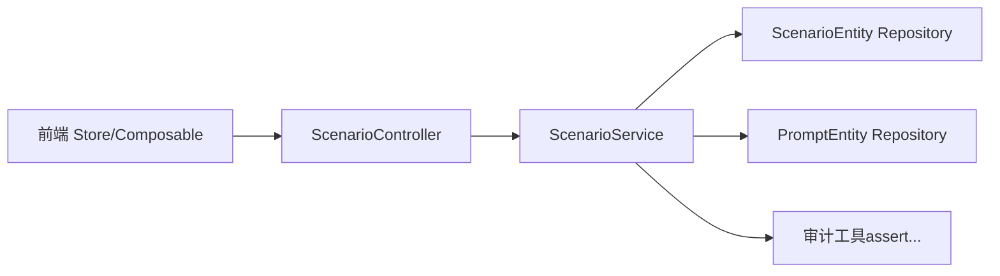

# 场景管理 API

<cite>
**本文引用的文件**
- [apps/api/src/modules/scenario/controller/scenario.controller.ts](file://apps/api/src/modules/scenario/controller/scenario.controller.ts)
- [apps/api/src/modules/scenario/service/scenario.service.ts](file://apps/api/src/modules/scenario/service/scenario.service.ts)
- [apps/api/src/modules/scenario/dto/save-scenario.dto.ts](file://apps/api/src/modules/scenario/dto/save-scenario.dto.ts)
- [apps/api/src/modules/scenario/dto/list-scenarios-query.dto.ts](file://apps/api/src/modules/scenario/dto/list-scenarios-query.dto.ts)
- [apps/api/src/modules/scenario/entity/scenario.entity.ts](file://apps/api/src/modules/scenario/entity/scenario.entity.ts)
- [apps/api/src/modules/scenario/entity/prompt.entity.ts](file://apps/api/src/modules/scenario/entity/prompt.entity.ts)
- [packages/shared/src/scenario-scope.ts](file://packages/shared/src/scenario-scope.ts)
- [apps/api/src/common/ai-workflow/service/ai-workflow.service.ts](file://apps/api/src/common/ai-workflow/service/ai-workflow.service.ts)
- [apps/api/src/common/ai-workflow/util/workflow-input.util.ts](file://apps/api/src/common/ai-workflow/util/workflow-input.util.ts)
- [apps/api/src/modules/scenario/data/ensure-default-api-scenarios.ts](file://apps/api/src/modules/scenario/data/ensure-default-api-scenarios.ts)
- [apps/web/src/stores/caseForge.ts](file://apps/web/src/stores/caseForge.ts)
- [apps/web/src/stores/apiTest.ts](file://apps/web/src/stores/apiTest.ts)
- [apps/web/src/composables/useScenarioLibrary.ts](file://apps/web/src/composables/useScenarioLibrary.ts)
</cite>

## 目录
1. [简介](#简介)
2. [项目结构](#项目结构)
3. [核心组件](#核心组件)
4. [架构总览](#架构总览)
5. [详细组件分析](#详细组件分析)
6. [依赖分析](#依赖分析)
7. [性能考虑](#性能考虑)
8. [故障排查指南](#故障排查指南)
9. [结论](#结论)
10. [附录](#附录)

## 简介
本文件面向“场景管理模块”的 API 文档，涵盖测试场景定义、提示词管理与场景执行相关接口。重点包括：
- 场景的创建、查询、更新、删除与复制（通过现有接口组合实现）
- 提示词模板的管理（新增、更新、删除、排序与启用状态控制）
- 场景与 AI 工作流的集成（需求结构化、案例生成摘要、接口测试案例生成）
- 完整的请求参数格式、响应数据结构与异常处理机制
- 场景编排与自动化测试的实际应用示例

## 项目结构
场景管理模块位于后端 NestJS 应用的 scenario 子系统，包含控制器、服务、DTO、实体与数据初始化脚本，并通过共享包提供场景作用域常量。

图表来源
- [apps/api/src/modules/scenario/controller/scenario.controller.ts:1-61](file://apps/api/src/modules/scenario/controller/scenario.controller.ts#L1-L61)
- [apps/api/src/modules/scenario/service/scenario.service.ts:1-210](file://apps/api/src/modules/scenario/service/scenario.service.ts#L1-L210)
- [apps/api/src/modules/scenario/dto/save-scenario.dto.ts:1-103](file://apps/api/src/modules/scenario/dto/save-scenario.dto.ts#L1-L103)
- [apps/api/src/modules/scenario/dto/list-scenarios-query.dto.ts:1-15](file://apps/api/src/modules/scenario/dto/list-scenarios-query.dto.ts#L1-L15)
- [apps/api/src/modules/scenario/entity/scenario.entity.ts:1-72](file://apps/api/src/modules/scenario/entity/scenario.entity.ts#L1-L72)
- [apps/api/src/modules/scenario/entity/prompt.entity.ts:1-97](file://apps/api/src/modules/scenario/entity/prompt.entity.ts#L1-L97)
- [packages/shared/src/scenario-scope.ts:1-12](file://packages/shared/src/scenario-scope.ts#L1-L12)
- [apps/api/src/common/ai-workflow/service/ai-workflow.service.ts:1-360](file://apps/api/src/common/ai-workflow/service/ai-workflow.service.ts#L1-L360)
- [apps/api/src/common/ai-workflow/util/workflow-input.util.ts:1-185](file://apps/api/src/common/ai-workflow/util/workflow-input.util.ts#L1-L185)
- [apps/web/src/stores/caseForge.ts:1-200](file://apps/web/src/stores/caseForge.ts#L1-L200)
- [apps/web/src/stores/apiTest.ts:1-200](file://apps/web/src/stores/apiTest.ts#L1-L200)
- [apps/web/src/composables/useScenarioLibrary.ts:1-54](file://apps/web/src/composables/useScenarioLibrary.ts#L1-L54)

章节来源
- [apps/api/src/modules/scenario/controller/scenario.controller.ts:1-61](file://apps/api/src/modules/scenario/controller/scenario.controller.ts#L1-L61)
- [apps/api/src/modules/scenario/service/scenario.service.ts:1-210](file://apps/api/src/modules/scenario/service/scenario.service.ts#L1-L210)
- [apps/api/src/modules/scenario/dto/save-scenario.dto.ts:1-103](file://apps/api/src/modules/scenario/dto/save-scenario.dto.ts#L1-L103)
- [apps/api/src/modules/scenario/dto/list-scenarios-query.dto.ts:1-15](file://apps/api/src/modules/scenario/dto/list-scenarios-query.dto.ts#L1-L15)
- [apps/api/src/modules/scenario/entity/scenario.entity.ts:1-72](file://apps/api/src/modules/scenario/entity/scenario.entity.ts#L1-L72)
- [apps/api/src/modules/scenario/entity/prompt.entity.ts:1-97](file://apps/api/src/modules/scenario/entity/prompt.entity.ts#L1-L97)
- [packages/shared/src/scenario-scope.ts:1-12](file://packages/shared/src/scenario-scope.ts#L1-L12)
- [apps/api/src/common/ai-workflow/service/ai-workflow.service.ts:1-360](file://apps/api/src/common/ai-workflow/service/ai-workflow.service.ts#L1-L360)
- [apps/api/src/common/ai-workflow/util/workflow-input.util.ts:1-185](file://apps/api/src/common/ai-workflow/util/workflow-input.util.ts#L1-L185)
- [apps/web/src/stores/caseForge.ts:1-200](file://apps/web/src/stores/caseForge.ts#L1-L200)
- [apps/web/src/stores/apiTest.ts:1-200](file://apps/web/src/stores/apiTest.ts#L1-L200)
- [apps/web/src/composables/useScenarioLibrary.ts:1-54](file://apps/web/src/composables/useScenarioLibrary.ts#L1-L54)

## 核心组件
- 场景控制器：暴露场景列表、详情、创建、更新、删除等 HTTP 接口。
- 场景服务：负责场景与提示词的持久化、校验、替换与查询。
- DTO：定义保存场景与提示词的请求结构与校验规则。
- 实体：映射数据库表结构，包含索引与关系定义。
- 场景作用域：统一管理“案例/接口”两类场景库。
- AI 工作流：提供需求结构化、案例生成摘要与接口测试案例生成能力。
- 前端 Store 与组合式函数：负责场景库的加载、保存与删除。

章节来源
- [apps/api/src/modules/scenario/controller/scenario.controller.ts:21-60](file://apps/api/src/modules/scenario/controller/scenario.controller.ts#L21-L60)
- [apps/api/src/modules/scenario/service/scenario.service.ts:33-209](file://apps/api/src/modules/scenario/service/scenario.service.ts#L33-L209)
- [apps/api/src/modules/scenario/dto/save-scenario.dto.ts:22-103](file://apps/api/src/modules/scenario/dto/save-scenario.dto.ts#L22-L103)
- [apps/api/src/modules/scenario/entity/scenario.entity.ts:19-72](file://apps/api/src/modules/scenario/entity/scenario.entity.ts#L19-L72)
- [apps/api/src/modules/scenario/entity/prompt.entity.ts:22-97](file://apps/api/src/modules/scenario/entity/prompt.entity.ts#L22-L97)
- [packages/shared/src/scenario-scope.ts:1-12](file://packages/shared/src/scenario-scope.ts#L1-L12)
- [apps/api/src/common/ai-workflow/service/ai-workflow.service.ts:39-360](file://apps/api/src/common/ai-workflow/service/ai-workflow.service.ts#L39-L360)
- [apps/web/src/stores/caseForge.ts:146-200](file://apps/web/src/stores/caseForge.ts#L146-L200)
- [apps/web/src/stores/apiTest.ts:146-200](file://apps/web/src/stores/apiTest.ts#L146-L200)
- [apps/web/src/composables/useScenarioLibrary.ts:8-54](file://apps/web/src/composables/useScenarioLibrary.ts#L8-L54)

## 架构总览
场景管理 API 的典型调用链如下：

图表来源
- [apps/api/src/modules/scenario/controller/scenario.controller.ts:29-60](file://apps/api/src/modules/scenario/controller/scenario.controller.ts#L29-L60)
- [apps/api/src/modules/scenario/service/scenario.service.ts:42-142](file://apps/api/src/modules/scenario/service/scenario.service.ts#L42-L142)
- [apps/api/src/modules/scenario/entity/scenario.entity.ts:24-72](file://apps/api/src/modules/scenario/entity/scenario.entity.ts#L24-L72)
- [apps/api/src/modules/scenario/entity/prompt.entity.ts:27-97](file://apps/api/src/modules/scenario/entity/prompt.entity.ts#L27-L97)

## 详细组件分析

### 场景控制器（HTTP 接口）
- 列出场景：GET /scenario/list（支持 scope 查询参数）
- 获取场景详情：GET /scenario/:id
- 创建场景：POST /scenario（请求体为 SaveScenarioDto）
- 更新场景：PATCH /scenario/:id（请求体为 SaveScenarioDto）
- 删除场景：DELETE /scenario/:id

章节来源
- [apps/api/src/modules/scenario/controller/scenario.controller.ts:29-60](file://apps/api/src/modules/scenario/controller/scenario.controller.ts#L29-L60)
- [apps/api/src/modules/scenario/dto/list-scenarios-query.dto.ts:9-15](file://apps/api/src/modules/scenario/dto/list-scenarios-query.dto.ts#L9-L15)
- [apps/api/src/modules/scenario/dto/save-scenario.dto.ts:68-103](file://apps/api/src/modules/scenario/dto/save-scenario.dto.ts#L68-L103)

### 场景服务（业务逻辑）
- 列表：按作用域与系统资源合并查询，返回带提示词的场景集合，并按更新时间与提示词排序。
- 详情：按 ID 查询场景并注入公共视图转换。
- 创建：校验名称唯一性，保存场景与初始提示词。
- 更新：校验名称唯一性，保存场景；若传入 prompts，则全量替换提示词。
- 删除：校验所有权并级联删除场景与提示词。
- 提示词替换：根据 ID 保留与删除，再批量保存新提示词。
- 名称唯一性：同一作用域内不允许重复名称（排除自身）。
- 提示词去重：同一场景内提示词名称不可重复。

章节来源
- [apps/api/src/modules/scenario/service/scenario.service.ts:42-142](file://apps/api/src/modules/scenario/service/scenario.service.ts#L42-L142)
- [apps/api/src/modules/scenario/service/scenario.service.ts:144-160](file://apps/api/src/modules/scenario/service/scenario.service.ts#L144-L160)
- [apps/api/src/modules/scenario/service/scenario.service.ts:162-187](file://apps/api/src/modules/scenario/service/scenario.service.ts#L162-L187)
- [apps/api/src/modules/scenario/service/scenario.service.ts:189-208](file://apps/api/src/modules/scenario/service/scenario.service.ts#L189-L208)

### 数据传输对象（DTO）
- SavePromptDto：单个提示词的保存结构，包含 id、name、content、tags、usageCount、sortOrder、isSystem、isActive、isDefault。
- SaveScenarioDto：场景保存结构，包含 name、description、category、isActive、scope、prompts（数组）。
- ListScenariosQueryDto：查询场景列表时的 scope 参数。

章节来源
- [apps/api/src/modules/scenario/dto/save-scenario.dto.ts:22-66](file://apps/api/src/modules/scenario/dto/save-scenario.dto.ts#L22-L66)
- [apps/api/src/modules/scenario/dto/save-scenario.dto.ts:68-103](file://apps/api/src/modules/scenario/dto/save-scenario.dto.ts#L68-L103)
- [apps/api/src/modules/scenario/dto/list-scenarios-query.dto.ts:9-15](file://apps/api/src/modules/scenario/dto/list-scenarios-query.dto.ts#L9-L15)

### 实体模型（数据库映射）
- ScenarioEntity：场景实体，包含名称、描述、类别、作用域 scope、启用状态、创建/修改人与时间戳，以及与 PromptEntity 的一对多关系。
- PromptEntity：提示词实体，包含所属场景、名称、内容、标签、使用次数、排序、系统/启用/默认标记与时间戳，以及与外部实体的关联。

章节来源
- [apps/api/src/modules/scenario/entity/scenario.entity.ts:19-72](file://apps/api/src/modules/scenario/entity/scenario.entity.ts#L19-L72)
- [apps/api/src/modules/scenario/entity/prompt.entity.ts:22-97](file://apps/api/src/modules/scenario/entity/prompt.entity.ts#L22-L97)

### 场景作用域与公共视图
- 场景作用域：case（案例动态指令）、api（接口测试），默认为 case。
- 公共视图转换：对外返回的场景对象经公共视图工具转换，隐藏内部敏感字段。

章节来源
- [packages/shared/src/scenario-scope.ts:1-12](file://packages/shared/src/scenario-scope.ts#L1-L12)
- [apps/api/src/modules/scenario/service/scenario.service.ts:28](file://apps/api/src/modules/scenario/service/scenario.service.ts#L28)

### 场景与 AI 工作流集成
- 需求结构化：从文件 URL 读取需求与技能文本，构建提示词并调用 AI Chat，支持分段结构化与合并。
- 案例生成摘要：将结构化 Markdown 压缩为案例生成用摘要。
- 接口测试案例生成：通过 at-case-skill 与 AI Chat 生成接口测试案例。
- 工作流输入工具：负责文件读取、提示词组装与分段策略。

章节来源
- [apps/api/src/common/ai-workflow/service/ai-workflow.service.ts:47-83](file://apps/api/src/common/ai-workflow/service/ai-workflow.service.ts#L47-L83)
- [apps/api/src/common/ai-workflow/service/ai-workflow.service.ts:85-192](file://apps/api/src/common/ai-workflow/service/ai-workflow.service.ts#L85-L192)
- [apps/api/src/common/ai-workflow/service/ai-workflow.service.ts:199-220](file://apps/api/src/common/ai-workflow/service/ai-workflow.service.ts#L199-L220)
- [apps/api/src/common/ai-workflow/service/ai-workflow.service.ts:222-291](file://apps/api/src/common/ai-workflow/service/ai-workflow.service.ts#L222-L291)
- [apps/api/src/common/ai-workflow/util/workflow-input.util.ts:27-63](file://apps/api/src/common/ai-workflow/util/workflow-input.util.ts#L27-L63)
- [apps/api/src/common/ai-workflow/util/workflow-input.util.ts:65-90](file://apps/api/src/common/ai-workflow/util/workflow-input.util.ts#L65-L90)
- [apps/api/src/common/ai-workflow/util/workflow-input.util.ts:92-146](file://apps/api/src/common/ai-workflow/util/workflow-input.util.ts#L92-L146)
- [apps/api/src/common/ai-workflow/util/workflow-input.util.ts:148-183](file://apps/api/src/common/ai-workflow/util/workflow-input.util.ts#L148-L183)

### 系统预置场景与提示词
- 默认接口场景：按名称+作用域+创建者匹配进行 upsert，确保系统预置提示词存在且状态正确。
- 初始化脚本：在系统启动时保证默认场景与提示词的一致性。

章节来源
- [apps/api/src/modules/scenario/data/ensure-default-api-scenarios.ts:14-21](file://apps/api/src/modules/scenario/data/ensure-default-api-scenarios.ts#L14-L21)
- [apps/api/src/modules/scenario/data/ensure-default-api-scenarios.ts:23-61](file://apps/api/src/modules/scenario/data/ensure-default-api-scenarios.ts#L23-L61)
- [apps/api/src/modules/scenario/data/ensure-default-api-scenarios.ts:69-86](file://apps/api/src/modules/scenario/data/ensure-default-api-scenarios.ts#L69-L86)

### 前端集成与使用示例
- 案例工作区 Store：提供加载场景库、保存场景、删除场景等方法。
- 接口测试 Store：提供加载场景库、保存场景、删除场景等方法。
- 组合式函数：根据作用域自动路由到对应 Store，简化前端调用。

章节来源
- [apps/web/src/stores/caseForge.ts:146-200](file://apps/web/src/stores/caseForge.ts#L146-L200)
- [apps/web/src/stores/apiTest.ts:146-200](file://apps/web/src/stores/apiTest.ts#L146-L200)
- [apps/web/src/composables/useScenarioLibrary.ts:8-54](file://apps/web/src/composables/useScenarioLibrary.ts#L8-L54)

## 依赖分析
- 控制器依赖服务：通过装饰器注入 ScenarioService。
- 服务依赖实体：通过 TypeORM Repository 访问数据库。
- 服务依赖审计工具：assertAccessible、assertOwned、scopedWhere 等保障数据安全与作用域隔离。
- 前端依赖控制器：通过 Store 方法间接调用后端接口。

图表来源
- [apps/api/src/modules/scenario/controller/scenario.controller.ts:24-27](file://apps/api/src/modules/scenario/controller/scenario.controller.ts#L24-L27)
- [apps/api/src/modules/scenario/service/scenario.service.ts:35-40](file://apps/api/src/modules/scenario/service/scenario.service.ts#L35-L40)
- [apps/web/src/stores/caseForge.ts:146-200](file://apps/web/src/stores/caseForge.ts#L146-L200)
- [apps/web/src/stores/apiTest.ts:146-200](file://apps/web/src/stores/apiTest.ts#L146-L200)

章节来源
- [apps/api/src/modules/scenario/controller/scenario.controller.ts:24-27](file://apps/api/src/modules/scenario/controller/scenario.controller.ts#L24-L27)
- [apps/api/src/modules/scenario/service/scenario.service.ts:23-28](file://apps/api/src/modules/scenario/service/scenario.service.ts#L23-L28)
- [apps/web/src/stores/caseForge.ts:146-200](file://apps/web/src/stores/caseForge.ts#L146-L200)
- [apps/web/src/stores/apiTest.ts:146-200](file://apps/web/src/stores/apiTest.ts#L146-L200)

## 性能考虑
- 查询优化：场景列表按 isActive 与 updatedAt 排序，提示词按创建时间与排序字段排序，减少前端二次排序成本。
- 索引设计：场景与提示词表均建立复合索引，提升按作用域、名称、排序等查询效率。
- 批量保存：提示词批量插入与替换，降低网络往返与事务开销。
- AI 工作流：分段结构化与重试机制，避免长文档一次性调用失败导致整体失败。

章节来源
- [apps/api/src/modules/scenario/entity/scenario.entity.ts:20-22](file://apps/api/src/modules/scenario/entity/scenario.entity.ts#L20-L22)
- [apps/api/src/modules/scenario/entity/prompt.entity.ts:23-25](file://apps/api/src/modules/scenario/entity/prompt.entity.ts#L23-L25)
- [apps/api/src/common/ai-workflow/service/ai-workflow.service.ts:258-291](file://apps/api/src/common/ai-workflow/service/ai-workflow.service.ts#L258-L291)

## 故障排查指南
- 场景名称冲突：当同作用域下存在相同名称时抛出错误，需调整名称或作用域。
- 提示词名称重复：同一场景内提示词名称不可重复，需去重后再保存。
- 权限不足：未通过 assertAccessible 或 assertOwned 校验时，无法读取或修改场景。
- AI 工作流未配置：当缺少 AI Chat 或 Skill URL 时，相关能力不可用，需检查环境变量与配置。
- 网络与超时：AI 调用具备重试机制，若仍失败，检查网络连通性与服务端日志。

章节来源
- [apps/api/src/modules/scenario/service/scenario.service.ts:170-173](file://apps/api/src/modules/scenario/service/scenario.service.ts#L170-L173)
- [apps/api/src/modules/scenario/service/scenario.service.ts:175-187](file://apps/api/src/modules/scenario/service/scenario.service.ts#L175-L187)
- [apps/api/src/modules/scenario/service/scenario.service.ts:77-78](file://apps/api/src/modules/scenario/service/scenario.service.ts#L77-L78)
- [apps/api/src/common/ai-workflow/service/ai-workflow.service.ts:93-100](file://apps/api/src/common/ai-workflow/service/ai-workflow.service.ts#L93-L100)
- [apps/api/src/common/ai-workflow/service/ai-workflow.service.ts:232-234](file://apps/api/src/common/ai-workflow/service/ai-workflow.service.ts#L232-L234)

## 结论
场景管理模块提供了完善的场景与提示词生命周期管理，并通过 AI 工作流实现了从需求结构化到案例生成的自动化闭环。结合前端 Store 与组合式函数，开发者可以快速构建基于场景的自动化测试体系。

## 附录

### API 规范与示例

- 获取场景列表
  - 方法与路径：GET /scenario/list
  - 查询参数：
    - scope：可选，枚举值为 "case" 或 "api"
  - 成功响应：场景数组（每个场景包含提示词列表）
  - 异常：无特定异常抛出，按作用域与系统资源合并查询

- 获取单个场景详情
  - 方法与路径：GET /scenario/:id
  - 路径参数：id（场景 ID）
  - 成功响应：场景详情（含提示词）

- 创建场景
  - 方法与路径：POST /scenario
  - 请求体：SaveScenarioDto
    - name：字符串，必填，最大长度 120
    - description：字符串，可选
    - category：字符串，必填，最大长度 64
    - isActive：布尔，可选，默认 true
    - scope：枚举 "case"|"api"，可选
    - prompts：数组，元素为 SavePromptDto
  - SavePromptDto 字段：
    - id：字符串，可选
    - name：字符串，必填，最大长度 120
    - content：字符串，必填，最大长度 4000
    - tags：字符串数组，可选
    - usageCount：整数，可选
    - sortOrder：整数，可选
    - isSystem：布尔，可选
    - isActive：布尔，可选，默认 true
    - isDefault：布尔，可选
  - 成功响应：场景详情（含新建提示词）

- 更新场景
  - 方法与路径：PATCH /scenario/:id
  - 路径参数：id（场景 ID）
  - 请求体：SaveScenarioDto（与创建相同）
  - 行为：若 prompts 未提供则保持不变；若提供则全量替换提示词

- 删除场景
  - 方法与路径：DELETE /scenario/:id
  - 路径参数：id（场景 ID）
  - 成功响应：{ id, deleted: true }

- 复制场景（建议方式）
  - 通过 GET /scenario/:id 获取详情，然后以 POST /scenario 发送相同数据创建新场景；或在服务层增加 copy 场景方法（当前未提供）

章节来源
- [apps/api/src/modules/scenario/controller/scenario.controller.ts:29-60](file://apps/api/src/modules/scenario/controller/scenario.controller.ts#L29-L60)
- [apps/api/src/modules/scenario/dto/save-scenario.dto.ts:22-103](file://apps/api/src/modules/scenario/dto/save-scenario.dto.ts#L22-L103)
- [apps/api/src/modules/scenario/dto/list-scenarios-query.dto.ts:9-15](file://apps/api/src/modules/scenario/dto/list-scenarios-query.dto.ts#L9-L15)
- [apps/api/src/modules/scenario/service/scenario.service.ts:91-132](file://apps/api/src/modules/scenario/service/scenario.service.ts#L91-L132)

### 场景状态控制与提示词模板管理
- 启用/禁用：通过场景与提示词的 isActive 字段控制是否参与后续流程。
- 默认勾选：isDefault 字段用于初始化时的默认选择。
- 排序：sortOrder 控制提示词显示顺序。
- 标签：tags 用于分类与筛选。

章节来源
- [apps/api/src/modules/scenario/entity/prompt.entity.ts:63-83](file://apps/api/src/modules/scenario/entity/prompt.entity.ts#L63-L83)
- [apps/api/src/modules/scenario/entity/scenario.entity.ts:43-51](file://apps/api/src/modules/scenario/entity/scenario.entity.ts#L43-L51)

### 场景与 AI 工作流集成
- 需求结构化：调用 AI 工作流服务，支持单次与分段结构化，返回 Markdown。
- 案例生成摘要：将结构化结果压缩为摘要，供后续生成使用。
- 接口测试案例生成：通过 at-case-skill 与 AI Chat 生成接口测试案例。

章节来源
- [apps/api/src/common/ai-workflow/service/ai-workflow.service.ts:85-192](file://apps/api/src/common/ai-workflow/service/ai-workflow.service.ts#L85-L192)
- [apps/api/src/common/ai-workflow/service/ai-workflow.service.ts:199-220](file://apps/api/src/common/ai-workflow/service/ai-workflow.service.ts#L199-L220)
- [apps/api/src/common/ai-workflow/util/workflow-input.util.ts:65-90](file://apps/api/src/common/ai-workflow/util/workflow-input.util.ts#L65-L90)
- [apps/api/src/common/ai-workflow/util/workflow-input.util.ts:92-146](file://apps/api/src/common/ai-workflow/util/workflow-input.util.ts#L92-L146)

### 场景编排与自动化测试示例
- 案例工作区：通过 Store 加载场景库，保存场景，删除场景，配合动态指令生成案例树。
- 接口测试：加载场景库，保存场景，删除场景，结合接口文档与环境生成测试用例。
- 组合式函数：根据作用域自动路由到对应 Store，简化前端调用。

章节来源
- [apps/web/src/stores/caseForge.ts:146-200](file://apps/web/src/stores/caseForge.ts#L146-L200)
- [apps/web/src/stores/apiTest.ts:146-200](file://apps/web/src/stores/apiTest.ts#L146-L200)
- [apps/web/src/composables/useScenarioLibrary.ts:8-54](file://apps/web/src/composables/useScenarioLibrary.ts#L8-L54)