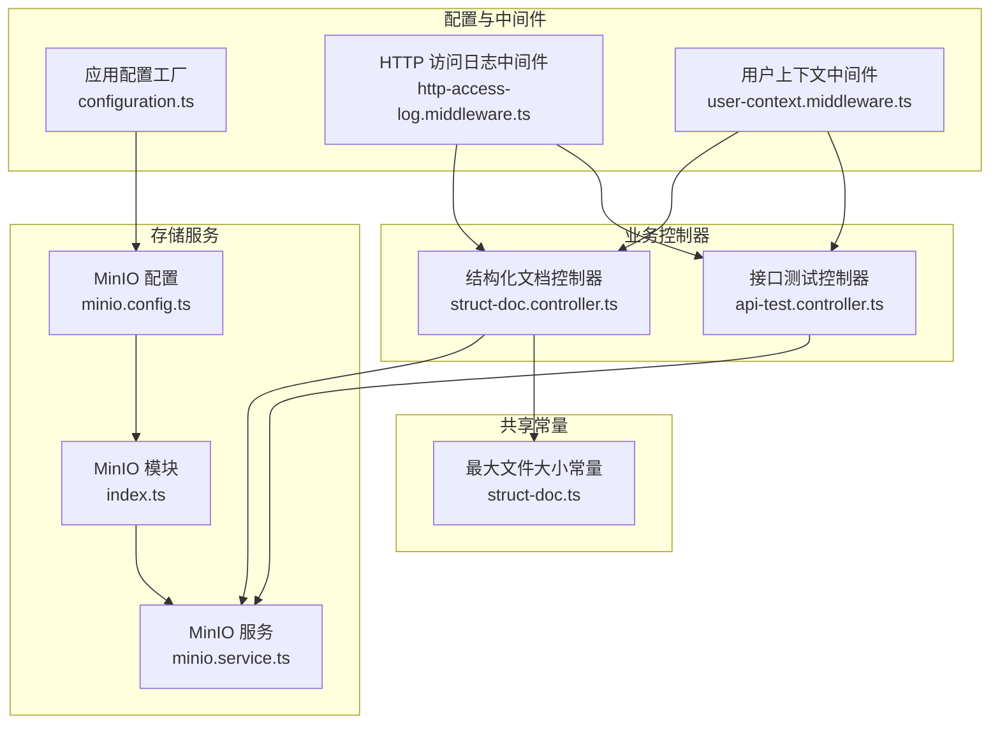
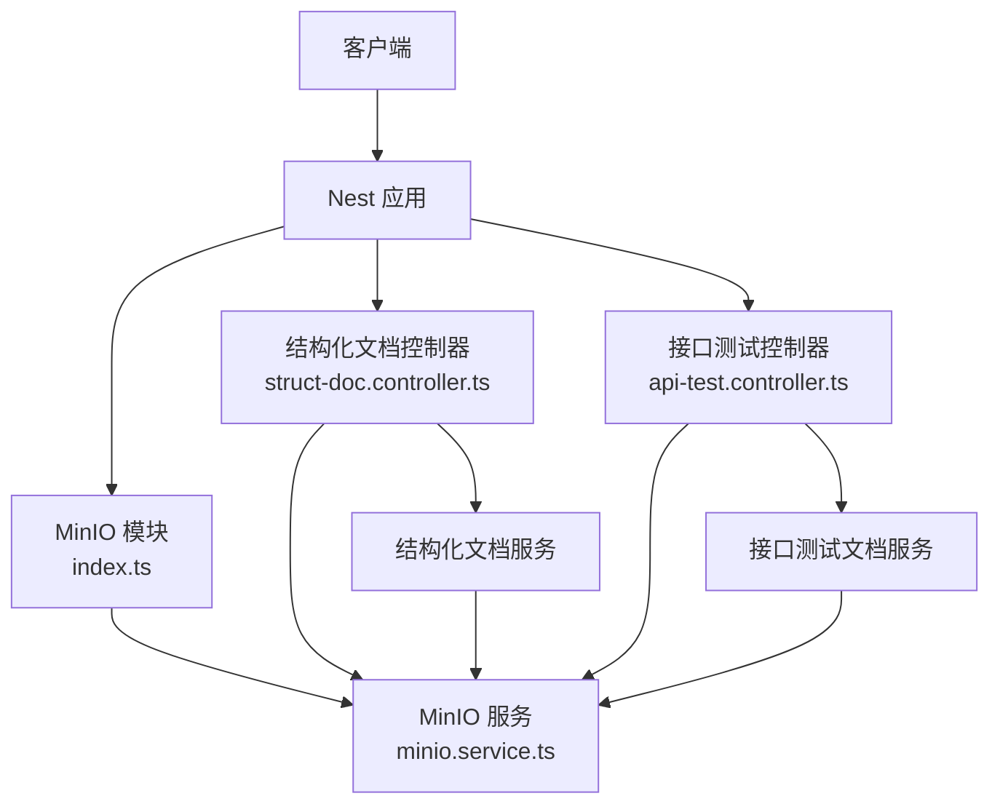
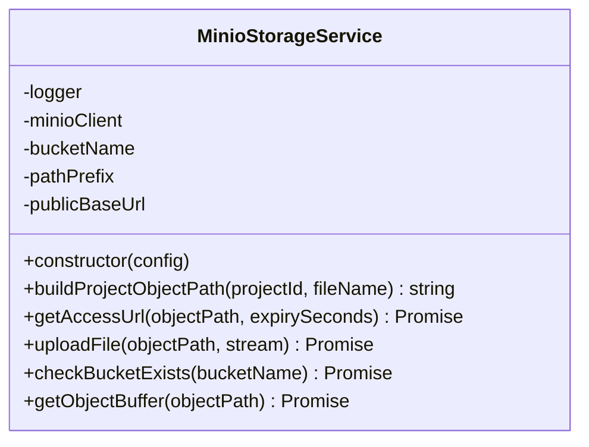
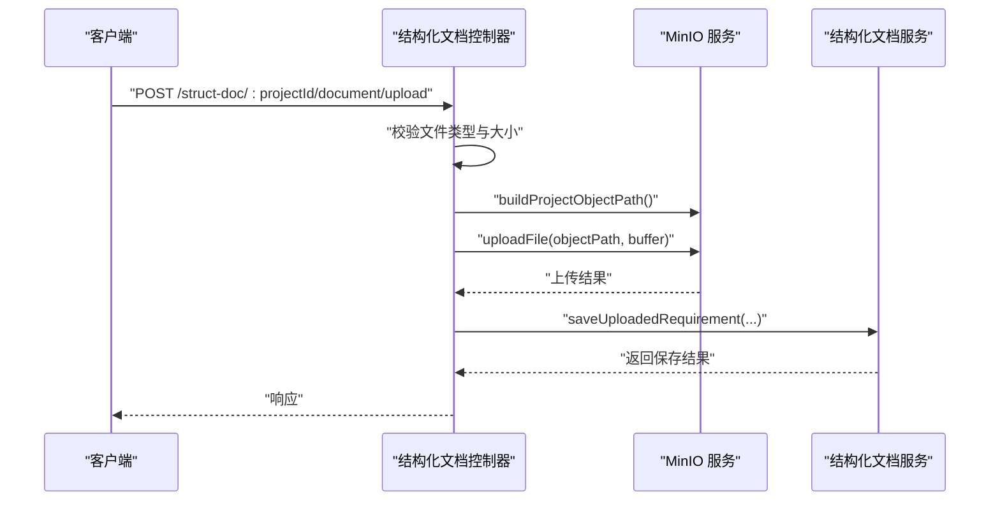
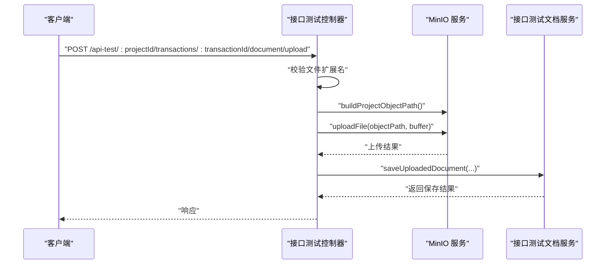
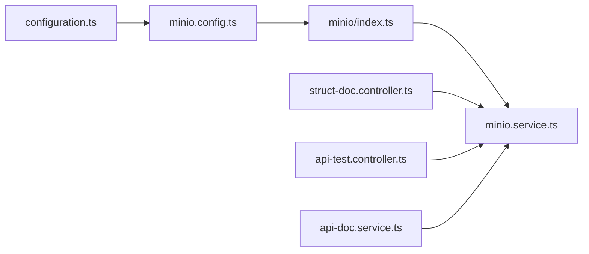

# 存储服务 API

<cite>
**本文引用的文件**
- [apps/api/src/common/minio/service/minio.service.ts](file://apps/api/src/common/minio/service/minio.service.ts)
- [apps/api/src/common/minio/minio.config.ts](file://apps/api/src/common/minio/minio.config.ts)
- [apps/api/src/common/minio/index.ts](file://apps/api/src/common/minio/index.ts)
- [apps/api/src/modules/struct-doc/controller/struct-doc.controller.ts](file://apps/api/src/modules/struct-doc/controller/struct-doc.controller.ts)
- [apps/api/src/modules/api-test/controller/api-test.controller.ts](file://apps/api/src/modules/api-test/controller/api-test.controller.ts)
- [apps/api/src/modules/api-test/service/api-doc.service.ts](file://apps/api/src/modules/api-test/service/api-doc.service.ts)
- [apps/api/src/config/configuration.ts](file://apps/api/src/config/configuration.ts)
- [apps/api/src/common/http/http-access-log.middleware.ts](file://apps/api/src/common/http/http-access-log.middleware.ts)
- [apps/api/src/common/audit/user-context.middleware.ts](file://apps/api/src/common/audit/user-context.middleware.ts)
- [packages/shared/src/struct-doc.ts](file://packages/shared/src/struct-doc.ts)
- [apps/api/src/bootstrap.ts](file://apps/api/src/bootstrap.ts)
</cite>

## 目录
1. [简介](#简介)
2. [项目结构](#项目结构)
3. [核心组件](#核心组件)
4. [架构总览](#架构总览)
5. [详细组件分析](#详细组件分析)
6. [依赖关系分析](#依赖关系分析)
7. [性能考虑](#性能考虑)
8. [故障排查指南](#故障排查指南)
9. [结论](#结论)
10. [附录](#附录)

## 简介
本文件面向存储服务 API 的使用者与维护者，系统性梳理基于 MinIO 对象存储的文件上传、下载、删除与管理能力，并结合现有控制器实现，给出可直接对接的端点清单与行为说明。同时覆盖以下主题：
- MinIO 集成方式与桶管理、访问控制配置
- 预签名 URL 生成与访问权限控制
- 分片上传、断点续传与批量操作的现状与扩展建议
- 存储配额管理与错误处理机制
- 性能优化与最佳实践

## 项目结构
围绕“存储服务”相关的关键文件组织如下：
- MinIO 集成：配置、模块与服务
- 控制器：结构化需求文档与接口测试文档的上传、状态查询等
- 配置：从环境变量加载 MinIO 参数
- 中间件：审计与访问日志
- 共享常量：最大文件大小限制

图表来源
- [apps/api/src/common/minio/minio.config.ts:1-37](file://apps/api/src/common/minio/minio.config.ts#L1-L37)
- [apps/api/src/common/minio/index.ts:1-17](file://apps/api/src/common/minio/index.ts#L1-L17)
- [apps/api/src/common/minio/service/minio.service.ts:1-128](file://apps/api/src/common/minio/service/minio.service.ts#L1-L128)
- [apps/api/src/modules/struct-doc/controller/struct-doc.controller.ts:1-177](file://apps/api/src/modules/struct-doc/controller/struct-doc.controller.ts#L1-L177)
- [apps/api/src/modules/api-test/controller/api-test.controller.ts:1-564](file://apps/api/src/modules/api-test/controller/api-test.controller.ts#L1-L564)
- [apps/api/src/config/configuration.ts:1-49](file://apps/api/src/config/configuration.ts#L1-L49)
- [apps/api/src/common/http/http-access-log.middleware.ts:1-46](file://apps/api/src/common/http/http-access-log.middleware.ts#L1-L46)
- [apps/api/src/common/audit/user-context.middleware.ts:1-20](file://apps/api/src/common/audit/user-context.middleware.ts#L1-L20)
- [packages/shared/src/struct-doc.ts:1-4](file://packages/shared/src/struct-doc.ts#L1-L4)

章节来源
- [apps/api/src/common/minio/service/minio.service.ts:1-128](file://apps/api/src/common/minio/service/minio.service.ts#L1-L128)
- [apps/api/src/common/minio/minio.config.ts:1-37](file://apps/api/src/common/minio/minio.config.ts#L1-L37)
- [apps/api/src/common/minio/index.ts:1-17](file://apps/api/src/common/minio/index.ts#L1-L17)
- [apps/api/src/modules/struct-doc/controller/struct-doc.controller.ts:1-177](file://apps/api/src/modules/struct-doc/controller/struct-doc.controller.ts#L1-L177)
- [apps/api/src/modules/api-test/controller/api-test.controller.ts:1-564](file://apps/api/src/modules/api-test/controller/api-test.controller.ts#L1-L564)
- [apps/api/src/config/configuration.ts:1-49](file://apps/api/src/config/configuration.ts#L1-L49)
- [apps/api/src/common/http/http-access-log.middleware.ts:1-46](file://apps/api/src/common/http/http-access-log.middleware.ts#L1-L46)
- [apps/api/src/common/audit/user-context.middleware.ts:1-20](file://apps/api/src/common/audit/user-context.middleware.ts#L1-L20)
- [packages/shared/src/struct-doc.ts:1-4](file://packages/shared/src/struct-doc.ts#L1-L4)

## 核心组件
- MinIO 配置与模块
  - 注入令牌与运行时配置项，来源于应用配置工厂，支持 host、port、accessKey、secretKey、bucketName、pathPrefix、publicBaseUrl。
  - 模块通过配置提供者注册，导出配置与服务实例。
- MinIO 存储服务
  - 负责桶存在性检查、对象路径生成、上传、读取对象为 Buffer、生成预签名 URL。
  - 对象路径采用“日期/项目ID/随机后缀文件名”的规则，确保唯一性与可读性。
- 控制器与服务
  - 结构化文档控制器：提供上传 doc/docx、查询上传状态、结构化触发、保存等端点。
  - 接口测试控制器：提供上传 Excel 文档、查询上传状态、结构化解析、保存等端点。
  - 业务服务：负责持久化与流程编排，存储服务作为底层对象存储。

章节来源
- [apps/api/src/common/minio/minio.config.ts:1-37](file://apps/api/src/common/minio/minio.config.ts#L1-L37)
- [apps/api/src/common/minio/index.ts:1-17](file://apps/api/src/common/minio/index.ts#L1-L17)
- [apps/api/src/common/minio/service/minio.service.ts:1-128](file://apps/api/src/common/minio/service/minio.service.ts#L1-L128)
- [apps/api/src/modules/struct-doc/controller/struct-doc.controller.ts:1-177](file://apps/api/src/modules/struct-doc/controller/struct-doc.controller.ts#L1-L177)
- [apps/api/src/modules/api-test/controller/api-test.controller.ts:1-564](file://apps/api/src/modules/api-test/controller/api-test.controller.ts#L1-L564)
- [apps/api/src/modules/api-test/service/api-doc.service.ts:29-64](file://apps/api/src/modules/api-test/service/api-doc.service.ts#L29-L64)

## 架构总览
存储服务以“配置 → 模块 → 服务 → 控制器/服务”的层次化方式组织，控制器通过服务完成对象存储操作，并结合业务服务完成元数据持久化与流程控制。

图表来源
- [apps/api/src/common/minio/index.ts:1-17](file://apps/api/src/common/minio/index.ts#L1-L17)
- [apps/api/src/common/minio/service/minio.service.ts:1-128](file://apps/api/src/common/minio/service/minio.service.ts#L1-L128)
- [apps/api/src/modules/struct-doc/controller/struct-doc.controller.ts:1-177](file://apps/api/src/modules/struct-doc/controller/struct-doc.controller.ts#L1-L177)
- [apps/api/src/modules/api-test/controller/api-test.controller.ts:1-564](file://apps/api/src/modules/api-test/controller/api-test.controller.ts#L1-L564)

## 详细组件分析

### MinIO 存储服务类图

图表来源
- [apps/api/src/common/minio/service/minio.service.ts:1-128](file://apps/api/src/common/minio/service/minio.service.ts#L1-L128)

章节来源
- [apps/api/src/common/minio/service/minio.service.ts:1-128](file://apps/api/src/common/minio/service/minio.service.ts#L1-L128)

### MinIO 配置与模块
- 配置项：host、port、accessKey、secretKey、bucketName、pathPrefix、publicBaseUrl。
- 模块导出配置与服务，便于控制器与服务注入使用。

章节来源
- [apps/api/src/common/minio/minio.config.ts:1-37](file://apps/api/src/common/minio/minio.config.ts#L1-L37)
- [apps/api/src/common/minio/index.ts:1-17](file://apps/api/src/common/minio/index.ts#L1-L17)
- [apps/api/src/config/configuration.ts:1-49](file://apps/api/src/config/configuration.ts#L1-L49)

### 结构化文档上传流程（POST /struct-doc/:projectId/document/upload）

图表来源
- [apps/api/src/modules/struct-doc/controller/struct-doc.controller.ts:68-107](file://apps/api/src/modules/struct-doc/controller/struct-doc.controller.ts#L68-L107)
- [apps/api/src/common/minio/service/minio.service.ts:40-107](file://apps/api/src/common/minio/service/minio.service.ts#L40-L107)

章节来源
- [apps/api/src/modules/struct-doc/controller/struct-doc.controller.ts:68-107](file://apps/api/src/modules/struct-doc/controller/struct-doc.controller.ts#L68-L107)
- [apps/api/src/common/minio/service/minio.service.ts:40-107](file://apps/api/src/common/minio/service/minio.service.ts#L40-L107)

### 接口测试文档上传流程（POST /api-test/:projectId/transactions/:transactionId/document/upload）

图表来源
- [apps/api/src/modules/api-test/controller/api-test.controller.ts:139-166](file://apps/api/src/modules/api-test/controller/api-test.controller.ts#L139-L166)
- [apps/api/src/common/minio/service/minio.service.ts:40-107](file://apps/api/src/common/minio/service/minio.service.ts#L40-L107)
- [apps/api/src/modules/api-test/service/api-doc.service.ts:59-64](file://apps/api/src/modules/api-test/service/api-doc.service.ts#L59-L64)

章节来源
- [apps/api/src/modules/api-test/controller/api-test.controller.ts:139-166](file://apps/api/src/modules/api-test/controller/api-test.controller.ts#L139-L166)
- [apps/api/src/modules/api-test/service/api-doc.service.ts:59-64](file://apps/api/src/modules/api-test/service/api-doc.service.ts#L59-L64)

### 下载与访问控制（预签名 URL）
- 通过服务生成预签名 GET URL，默认有效期为 7 天；当对象路径为空或生成失败时返回未定义。
- 实际访问由 MinIO 服务器鉴权与策略控制，客户端需在有效期内访问。

章节来源
- [apps/api/src/common/minio/service/minio.service.ts:64-80](file://apps/api/src/common/minio/service/minio.service.ts#L64-L80)

### 删除与管理
- 当前控制器未暴露显式的删除端点；对象删除通常通过业务侧清理元数据后，结合 MinIO 管理工具或 SDK 进行对象级删除。
- 桶管理：服务提供桶存在性检查；若桶不存在，上传会抛出错误。

章节来源
- [apps/api/src/common/minio/service/minio.service.ts:92-115](file://apps/api/src/common/minio/service/minio.service.ts#L92-L115)

### 分片上传、断点续传与批量操作
- 现状：未发现内置的分片上传、断点续传与批量删除端点。
- 建议：可在控制器层引入分片上传端点（如按分片序号与会话标识），并在服务层协调 MinIO 客户端的分片上传能力；批量操作可通过 DTO 校验与循环调用实现。

章节来源
- [apps/api/src/modules/api-test/controller/api-test.controller.ts:115-125](file://apps/api/src/modules/api-test/controller/api-test.controller.ts#L115-L125)

### 存储配额管理
- 当前未见服务端配额限制逻辑。
- 建议：在控制器或服务层增加配额校验（如项目维度累计大小阈值），结合 MinIO 生命周期策略与桶配额实现端到端管控。

章节来源
- [packages/shared/src/struct-doc.ts:1-4](file://packages/shared/src/struct-doc.ts#L1-L4)

## 依赖关系分析
- 控制器依赖 MinIO 服务与业务服务；业务服务依赖实体仓储与 MinIO 服务。
- 配置通过模块注入，形成自上而下的依赖链。

图表来源
- [apps/api/src/config/configuration.ts:1-49](file://apps/api/src/config/configuration.ts#L1-L49)
- [apps/api/src/common/minio/minio.config.ts:1-37](file://apps/api/src/common/minio/minio.config.ts#L1-L37)
- [apps/api/src/common/minio/index.ts:1-17](file://apps/api/src/common/minio/index.ts#L1-L17)
- [apps/api/src/common/minio/service/minio.service.ts:1-128](file://apps/api/src/common/minio/service/minio.service.ts#L1-L128)
- [apps/api/src/modules/struct-doc/controller/struct-doc.controller.ts:1-177](file://apps/api/src/modules/struct-doc/controller/struct-doc.controller.ts#L1-L177)
- [apps/api/src/modules/api-test/controller/api-test.controller.ts:1-564](file://apps/api/src/modules/api-test/controller/api-test.controller.ts#L1-L564)
- [apps/api/src/modules/api-test/service/api-doc.service.ts:29-64](file://apps/api/src/modules/api-test/service/api-doc.service.ts#L29-L64)

章节来源
- [apps/api/src/config/configuration.ts:1-49](file://apps/api/src/config/configuration.ts#L1-L49)
- [apps/api/src/common/minio/minio.config.ts:1-37](file://apps/api/src/common/minio/minio.config.ts#L1-L37)
- [apps/api/src/common/minio/index.ts:1-17](file://apps/api/src/common/minio/index.ts#L1-L17)
- [apps/api/src/common/minio/service/minio.service.ts:1-128](file://apps/api/src/common/minio/service/minio.service.ts#L1-L128)
- [apps/api/src/modules/struct-doc/controller/struct-doc.controller.ts:1-177](file://apps/api/src/modules/struct-doc/controller/struct-doc.controller.ts#L1-L177)
- [apps/api/src/modules/api-test/controller/api-test.controller.ts:1-564](file://apps/api/src/modules/api-test/controller/api-test.controller.ts#L1-L564)
- [apps/api/src/modules/api-test/service/api-doc.service.ts:29-64](file://apps/api/src/modules/api-test/service/api-doc.service.ts#L29-L64)

## 性能考虑
- 上传限流与内存占用：当前控制器使用内存缓冲区接收文件，建议对大文件启用流式上传或分片上传，避免 OOM。
- 预签名 URL：合理设置过期时间，避免长期有效的链接带来安全风险与带宽浪费。
- 日志与监控：接入访问日志中间件，结合用户上下文中间件定位问题；对上传/下载速率与错误率建立指标。
- 缓存与 CDN：对于静态资源可配合 CDN 加速，减少对象存储压力。

## 故障排查指南
- 桶不存在
  - 现象：上传时报错提示桶不存在。
  - 处理：先在 MinIO 创建目标桶，再执行上传。
- 预签名 URL 生成失败
  - 现象：生成预签名 URL 返回未定义。
  - 处理：检查对象路径是否为空、MinIO 服务连通性与凭证配置。
- 文件类型与大小限制
  - 结构化文档：仅支持 doc/docx，大小不超过 30MB。
  - 接口测试文档：仅支持 xls/xlsx。
- 错误处理
  - 控制器层抛出语义化异常（如参数错误、未找到等）。
  - 服务层捕获底层异常并记录日志，必要时向上抛出。

章节来源
- [apps/api/src/common/minio/service/minio.service.ts:92-106](file://apps/api/src/common/minio/service/minio.service.ts#L92-L106)
- [apps/api/src/common/minio/service/minio.service.ts:74-79](file://apps/api/src/common/minio/service/minio.service.ts#L74-L79)
- [apps/api/src/modules/struct-doc/controller/struct-doc.controller.ts:74-87](file://apps/api/src/modules/struct-doc/controller/struct-doc.controller.ts#L74-L87)
- [apps/api/src/modules/api-test/controller/api-test.controller.ts:146-153](file://apps/api/src/modules/api-test/controller/api-test.controller.ts#L146-L153)
- [apps/api/src/common/http/http-access-log.middleware.ts:1-46](file://apps/api/src/common/http/http-access-log.middleware.ts#L1-L46)
- [apps/api/src/common/audit/user-context.middleware.ts:1-20](file://apps/api/src/common/audit/user-context.middleware.ts#L1-L20)

## 结论
- 现有实现提供了稳定的 MinIO 集成与基础的上传、预签名 URL 能力，满足结构化文档与接口测试文档的存储需求。
- 在安全性与可运维性方面，建议补充分片上传、断点续传、批量操作、配额管理与更细粒度的访问控制策略。
- 通过中间件与日志体系完善可观测性，有助于提升生产环境的稳定性与问题定位效率。

## 附录

### API 端点一览（按模块）

- 结构化文档（struct-doc）
  - GET /struct-doc/:projectId/upload-status
    - 功能：查询项目是否已上传需求文档
    - 权限：受用户作用域与项目归属约束
  - POST /struct-doc/:projectId/document/upload
    - 功能：上传 doc/docx 需求文档
    - 参数：multipart/form-data，file 字段；可选 query.force=true 强制重新上传
    - 限制：大小不超过 30MB，扩展名仅 doc/docx
  - POST /struct-doc/:projectId/document/structure
    - 功能：异步触发 AI Chat 结构化需求文档
  - POST /struct-doc/:projectId/document/structure/cancel
    - 功能：取消结构化任务
  - GET /struct-doc/:projectId
    - 功能：查询项目结构化文档详情及测试要点列表
    - 参数：includeTestPoints=false 仅返回元数据与状态
  - PATCH /struct-doc/:projectId/auto-save
    - 功能：自动保存在线编辑中的临时结构化 Markdown
  - PATCH /struct-doc/:projectId
    - 功能：保存结构化文档到 MinIO 并同步测试要点

- 接口测试（api-test）
  - GET /api-test/:projectId/transactions
    - 功能：列出需求下的交易码
  - POST /api-test/:projectId/transactions
    - 功能：新建交易码
  - PATCH /api-test/:projectId/transactions/:transactionId
    - 功能：更新交易码
  - DELETE /api-test/:projectId/transactions/:transactionId
    - 功能：删除交易码
  - POST /api-test/:projectId/transactions/batch-delete
    - 功能：批量删除交易码
  - GET /api-test/:projectId/transactions/:transactionId/upload-status
    - 功能：查询接口测试文档上传状态
  - POST /api-test/:projectId/transactions/:transactionId/document/upload
    - 功能：上传 Excel 接口测试文档
    - 参数：multipart/form-data，file 字段；可选 query.force=true 强制重新上传
    - 限制：扩展名仅 xls/xlsx
  - POST /api-test/:projectId/transactions/:transactionId/document/structure
    - 功能：解析并结构化接口文档
  - GET /api-test/:projectId/transactions/:transactionId/document
    - 功能：获取已结构化的文档信息
  - PATCH /api-test/:projectId/transactions/:transactionId/document/auto-save
    - 功能：自动保存临时结构化 Markdown
  - PATCH /api-test/:projectId/transactions/:transactionId/document
    - 功能：保存结构化文档
  - PATCH /api-test/:projectId/transactions/:transactionId/document/generation
    - 功能：保存生成提示词
  - GET /api-test/:projectId/transactions/:transactionId/endpoints
    - 功能：列出接口端点
  - GET /api-test/:projectId/transactions/:transactionId/cases
    - 功能：列出用例
  - POST /api-test/:projectId/transactions/:transactionId/cases
    - 功能：创建用例
  - PATCH /api-test/:projectId/transactions/:transactionId/cases/:caseId
    - 功能：更新用例
  - DELETE /api-test/:projectId/transactions/:transactionId/cases/:caseId
    - 功能：删除用例
  - POST /api-test/:projectId/transactions/:transactionId/cases/generate
    - 功能：入队生成接口案例
  - GET /api-test/:projectId/transactions/:transactionId/cases/generate/status
    - 功能：查询案例生成队列状态
  - POST /api-test/:projectId/transactions/:transactionId/cases/generate/cancel
    - 功能：取消案例生成任务
  - GET /api-test/:projectId/environments
    - 功能：列出环境
  - POST /api-test/:projectId/environments
    - 功能：新建环境
  - PATCH /api-test/:projectId/environments/:environmentId
    - 功能：更新环境
  - DELETE /api-test/:projectId/environments/:environmentId
    - 功能：删除环境
  - GET /api-test/:projectId/environments/:environmentId/services
    - 功能：列出环境服务
  - POST /api-test/:projectId/environments/:environmentId/services
    - 功能：新建环境服务
  - PATCH /api-test/:projectId/environments/:environmentId/services/:serviceId
    - 功能：更新环境服务
  - PATCH /api-test/:projectId/environments/:environmentId/services/:serviceId/reorder
    - 功能：重排环境服务顺序
  - DELETE /api-test/:projectId/environments/:environmentId/services/:serviceId
    - 功能：删除环境服务
  - GET /api-test/:projectId/transactions/:transactionId/execution-sets
    - 功能：列出执行集
  - POST /api-test/:projectId/transactions/:transactionId/execution-sets
    - 功能：新建执行集
  - PATCH /api-test/:projectId/transactions/:transactionId/execution-sets/:setId
    - 功能：更新执行集
  - DELETE /api-test/:projectId/transactions/:transactionId/execution-sets/:setId
    - 功能：删除执行集
  - PUT /api-test/:projectId/transactions/:transactionId/execution-sets/:setId/cases
    - 功能：替换执行集用例
  - POST /api-test/:projectId/transactions/:transactionId/execution-sets/:setId/runs
    - 功能：运行执行集
  - POST /api-test/:projectId/transactions/:transactionId/runs
    - 功能：运行用例
  - GET /api-test/:projectId/runs
    - 功能：列出运行记录
  - GET /api-test/:projectId/runs/:runId
    - 功能：获取运行详情
  - GET /api-test/:projectId/transactions/:transactionId/reports/summary
    - 功能：报告摘要
  - POST /api-test/:projectId/transactions/:transactionId/reports/export
    - 功能：导出报告（响应二进制流）

章节来源
- [apps/api/src/modules/struct-doc/controller/struct-doc.controller.ts:1-177](file://apps/api/src/modules/struct-doc/controller/struct-doc.controller.ts#L1-L177)
- [apps/api/src/modules/api-test/controller/api-test.controller.ts:1-564](file://apps/api/src/modules/api-test/controller/api-test.controller.ts#L1-L564)

### 访问控制与安全建议
- 用户作用域：通过用户上下文中间件解析与注入用户名，控制器内使用作用域校验确保资源归属。
- MinIO 策略：建议为不同租户/项目配置独立桶或命名空间，结合 IAM 策略限制访问范围。
- 预签名 URL：严格设置有效期，避免泄露敏感资源；必要时结合 IP 白名单与来源校验。

章节来源
- [apps/api/src/common/audit/user-context.middleware.ts:1-20](file://apps/api/src/common/audit/user-context.middleware.ts#L1-L20)
- [apps/api/src/common/minio/service/minio.service.ts:64-80](file://apps/api/src/common/minio/service/minio.service.ts#L64-L80)

### 配置项说明
- MinIO 配置（来自环境变量）
  - MINIO_HOST、MINIO_PORT、MINIO_ACCESS_KEY、MINIO_SECRET_KEY、MINIO_BUCKET_NAME、MINIO_PATH_PREFIX、MINIO_PUBLIC_BASE_URL
- 应用配置工厂
  - 从环境变量组装 AppConfig，供模块与服务使用

章节来源
- [apps/api/src/config/configuration.ts:26-34](file://apps/api/src/config/configuration.ts#L26-L34)
- [apps/api/src/common/minio/minio.config.ts:25-36](file://apps/api/src/common/minio/minio.config.ts#L25-L36)