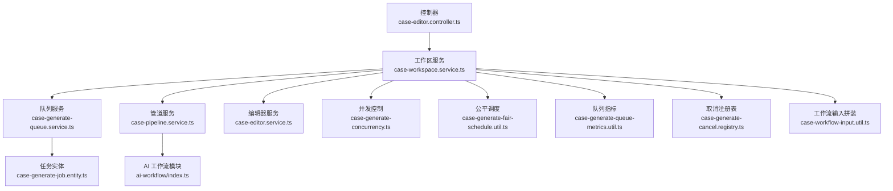
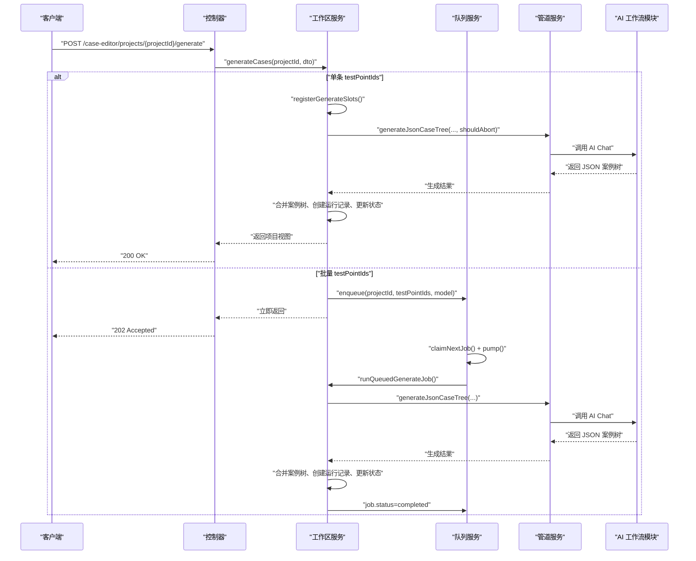
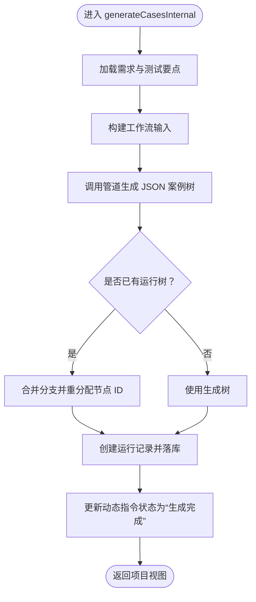
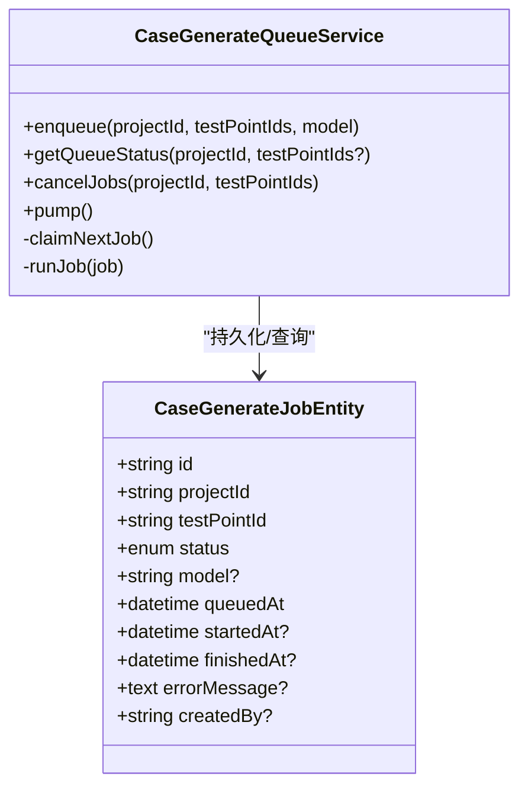
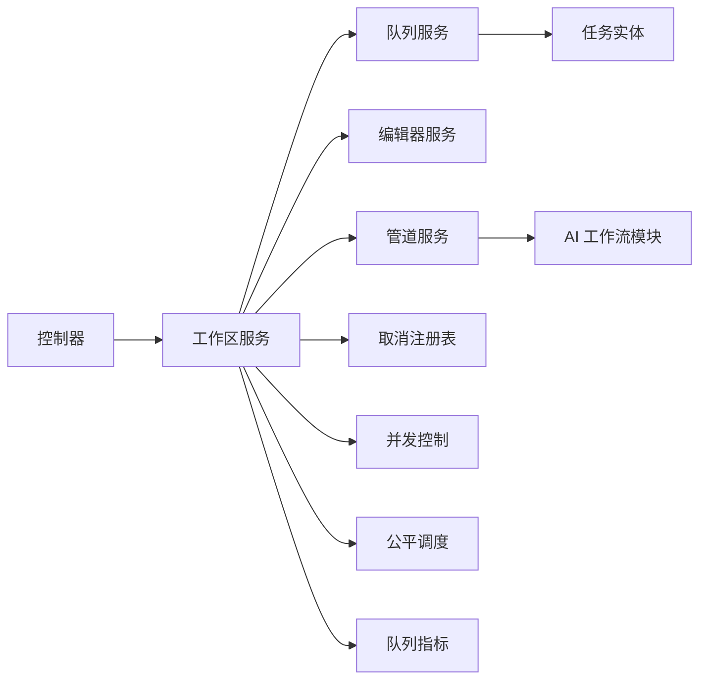

# AI 案例生成 API

<cite>
**本文引用的文件**
- [apps/api/src/modules/case-editor/controller/case-editor.controller.ts](file://apps/api/src/modules/case-editor/controller/case-editor.controller.ts)
- [apps/api/src/modules/case-editor/service/case-workspace.service.ts](file://apps/api/src/modules/case-editor/service/case-workspace.service.ts)
- [apps/api/src/modules/case-editor/service/case-generate-queue.service.ts](file://apps/api/src/modules/case-editor/service/case-generate-queue.service.ts)
- [apps/api/src/modules/case-editor/entity/case-generate-job.entity.ts](file://apps/api/src/modules/case-editor/entity/case-generate-job.entity.ts)
- [apps/api/src/modules/case-editor/dto/generate-cases.dto.ts](file://apps/api/src/modules/case-editor/dto/generate-cases.dto.ts)
- [apps/api/src/modules/case-editor/dto/cancel-generate.dto.ts](file://apps/api/src/modules/case-editor/dto/cancel-generate.dto.ts)
- [apps/api/src/modules/case-editor/dto/regenerate-node.dto.ts](file://apps/api/src/modules/case-editor/dto/regenerate-node.dto.ts)
- [apps/api/src/modules/case-editor/util/case-generate-concurrency.ts](file://apps/api/src/modules/case-editor/util/case-generate-concurrency.ts)
- [apps/api/src/modules/case-editor/util/case-generate-fair-schedule.util.ts](file://apps/api/src/modules/case-editor/util/case-generate-fair-schedule.util.ts)
- [apps/api/src/modules/case-editor/util/case-generate-queue-metrics.util.ts](file://apps/api/src/modules/case-editor/util/case-generate-queue-metrics.util.ts)
- [apps/api/src/modules/case-editor/util/case-generate-interrupted.util.ts](file://apps/api/src/modules/case-editor/util/case-generate-interrupted.util.ts)
- [apps/api/src/modules/case-editor/util/case-generate-cancel.registry.ts](file://apps/api/src/modules/case-editor/util/case-generate-cancel.registry.ts)
- [apps/api/src/modules/case-editor/util/case-workflow-input.util.ts](file://apps/api/src/modules/case-editor/util/case-workflow-input.util.ts)
- [apps/api/src/common/ai-workflow/index.ts](file://apps/api/src/common/ai-workflow/index.ts)
</cite>

## 目录
1. [简介](#简介)
2. [项目结构](#项目结构)
3. [核心组件](#核心组件)
4. [架构总览](#架构总览)
5. [详细组件分析](#详细组件分析)
6. [依赖关系分析](#依赖关系分析)
7. [性能与并发特性](#性能与并发特性)
8. [故障排查指南](#故障排查指南)
9. [结论](#结论)
10. [附录：端点定义与示例](#附录端点定义与示例)

## 简介
本文件为“AI 案例生成”功能的完整 API 文档，覆盖以下能力：
- 创建案例生成作业（单条/批量）
- 查询生成队列进度与 ETA
- 取消生成（用户主动停止）
- 重新生成（局部节点扩展/替换/补全）
- AI 工作流集成与提示词拼装
- 生成队列管理与并发控制
- 生成进度跟踪、中断处理与错误恢复
- 实时状态推送机制的使用建议

## 项目结构
围绕“案例编辑器”的控制器、服务与工具模块，形成清晰的分层：
- 控制器层：暴露 REST 端点，接收请求并委派给服务层
- 服务层：编排工作流、调用 AI 工作流、管理队列与并发、合并案例树
- 工具与实体：队列状态、并发槽、公平调度、指标计算、取消注册表、任务实体

图表来源
- [apps/api/src/modules/case-editor/controller/case-editor.controller.ts:1-215](file://apps/api/src/modules/case-editor/controller/case-editor.controller.ts#L1-L215)
- [apps/api/src/modules/case-editor/service/case-workspace.service.ts:1-830](file://apps/api/src/modules/case-editor/service/case-workspace.service.ts#L1-L830)
- [apps/api/src/modules/case-editor/service/case-generate-queue.service.ts:1-524](file://apps/api/src/modules/case-editor/service/case-generate-queue.service.ts#L1-L524)
- [apps/api/src/modules/case-editor/entity/case-generate-job.entity.ts:1-74](file://apps/api/src/modules/case-editor/entity/case-generate-job.entity.ts#L1-L74)
- [apps/api/src/modules/case-editor/util/case-generate-concurrency.ts:1-91](file://apps/api/src/modules/case-editor/util/case-generate-concurrency.ts#L1-L91)
- [apps/api/src/modules/case-editor/util/case-generate-fair-schedule.util.ts:1-122](file://apps/api/src/modules/case-editor/util/case-generate-fair-schedule.util.ts#L1-L122)
- [apps/api/src/modules/case-editor/util/case-generate-queue-metrics.util.ts:1-54](file://apps/api/src/modules/case-editor/util/case-generate-queue-metrics.util.ts#L1-L54)
- [apps/api/src/modules/case-editor/util/case-generate-cancel.registry.ts:1-64](file://apps/api/src/modules/case-editor/util/case-generate-cancel.registry.ts#L1-L64)
- [apps/api/src/modules/case-editor/util/case-workflow-input.util.ts:1-152](file://apps/api/src/modules/case-editor/util/case-workflow-input.util.ts#L1-L152)
- [apps/api/src/common/ai-workflow/index.ts:1-21](file://apps/api/src/common/ai-workflow/index.ts#L1-L21)

章节来源
- [apps/api/src/modules/case-editor/controller/case-editor.controller.ts:1-215](file://apps/api/src/modules/case-editor/controller/case-editor.controller.ts#L1-L215)
- [apps/api/src/modules/case-editor/service/case-workspace.service.ts:1-830](file://apps/api/src/modules/case-editor/service/case-workspace.service.ts#L1-L830)

## 核心组件
- 控制器：暴露生成、取消、队列查询、局部重生成等端点
- 工作区服务：统一编排“需求格式化 → 动态指令 → 案例生成 → 编辑台运行记录”
- 队列服务：DB 持久化任务、公平调度、ETA 估算、失败恢复
- 实体：任务状态枚举与字段
- 工具集：并发槽、公平调度、队列指标、取消注册表、工作流输入拼装
- AI 工作流模块：提供 AI Chat 与技能集成能力

章节来源
- [apps/api/src/modules/case-editor/controller/case-editor.controller.ts:45-96](file://apps/api/src/modules/case-editor/controller/case-editor.controller.ts#L45-L96)
- [apps/api/src/modules/case-editor/service/case-workspace.service.ts:188-277](file://apps/api/src/modules/case-editor/service/case-workspace.service.ts#L188-L277)
- [apps/api/src/modules/case-editor/service/case-generate-queue.service.ts:162-313](file://apps/api/src/modules/case-editor/service/case-generate-queue.service.ts#L162-L313)
- [apps/api/src/modules/case-editor/entity/case-generate-job.entity.ts:13-73](file://apps/api/src/modules/case-editor/entity/case-generate-job.entity.ts#L13-L73)
- [apps/api/src/common/ai-workflow/index.ts:12-20](file://apps/api/src/common/ai-workflow/index.ts#L12-L20)

## 架构总览
AI 案例生成采用“控制器 → 工作区服务 → 队列服务/管道服务 → AI 工作流”的链路。单条生成同步阻塞，批量生成异步入队，队列服务公平调度与并发控制，最终落库并更新动态指令状态。

图表来源
- [apps/api/src/modules/case-editor/controller/case-editor.controller.ts:52-59](file://apps/api/src/modules/case-editor/controller/case-editor.controller.ts#L52-L59)
- [apps/api/src/modules/case-editor/service/case-workspace.service.ts:197-207](file://apps/api/src/modules/case-editor/service/case-workspace.service.ts#L197-L207)
- [apps/api/src/modules/case-editor/service/case-generate-queue.service.ts:340-357](file://apps/api/src/modules/case-editor/service/case-generate-queue.service.ts#L340-L357)
- [apps/api/src/modules/case-editor/util/case-workflow-input.util.ts:118-151](file://apps/api/src/modules/case-editor/util/case-workflow-input.util.ts#L118-L151)
- [apps/api/src/common/ai-workflow/index.ts:12-20](file://apps/api/src/common/ai-workflow/index.ts#L12-L20)

## 详细组件分析

### 控制器端点与职责
- 生成案例树
  - 方法与路径：POST /case-editor/projects/{projectId}/generate
  - 请求体：包含 testPointIds 数组与可选 model 字段
  - 行为：单条同步、批量异步；立即返回项目视图或后台入队
- 取消生成
  - 方法与路径：POST /case-editor/projects/{projectId}/generate/cancel
  - 请求体：testPointIds 数组
  - 行为：标记取消槽并回写动态指令状态，队列作业状态更新
- 查询队列进度
  - 方法与路径：GET /case-editor/projects/{projectId}/generate/queue
  - 查询参数：testPointIds（逗号分隔）
  - 行为：返回全局与用户维度的排队信息、ETA、平均耗时等
- 局部重生成节点
  - 方法与路径：POST /case-editor/projects/{projectId}/regenerate-node
  - 请求体：runId、nodeId、instruction、mode（append/replace/complete）
  - 行为：对指定节点进行扩展/替换/补全，更新运行树

章节来源
- [apps/api/src/modules/case-editor/controller/case-editor.controller.ts:52-96](file://apps/api/src/modules/case-editor/controller/case-editor.controller.ts#L52-L96)

### 工作区服务：生成编排与状态管理
- generateCases
  - 校验测试要点、写入“生成中”、入队；单条同步、批量异步
- runQueuedGenerateJob
  - 从队列取出单条任务，注册槽位并调用内部生成逻辑
- cancelGenerateCases
  - 注册取消槽、回写动态指令状态（生成完成→再编辑，否则→已编辑）
- generateCasesInternal
  - 加载需求与测试要点，构建工作流输入，调用管道生成 JSON 案例树，合并到现有运行树，创建新运行记录，更新状态
- regenerateNode
  - 对指定节点进行扩展/替换/补全，更新运行树

图表来源
- [apps/api/src/modules/case-editor/service/case-workspace.service.ts:290-454](file://apps/api/src/modules/case-editor/service/case-workspace.service.ts#L290-L454)

章节来源
- [apps/api/src/modules/case-editor/service/case-workspace.service.ts:188-277](file://apps/api/src/modules/case-editor/service/case-workspace.service.ts#L188-L277)
- [apps/api/src/modules/case-editor/service/case-workspace.service.ts:280-454](file://apps/api/src/modules/case-editor/service/case-workspace.service.ts#L280-L454)

### 队列服务：DB 任务队列与公平调度
- enqueue
  - 去重后创建 queued 任务，持久化并触发泵（pump）
- getQueueStatus
  - 统计全局排队/运行数、并发上限、per-user 最大运行数、平均耗时，按公平调度排序计算 ETA
- pump/claimNextJob/runJob
  - 通过 withCaseGenerateSlot 限制全局并发槽；公平挑选 queued 任务；执行后更新状态（completed/failed/cancelled）

图表来源
- [apps/api/src/modules/case-editor/entity/case-generate-job.entity.ts:23-73](file://apps/api/src/modules/case-editor/entity/case-generate-job.entity.ts#L23-L73)
- [apps/api/src/modules/case-editor/service/case-generate-queue.service.ts:162-313](file://apps/api/src/modules/case-editor/service/case-generate-queue.service.ts#L162-L313)

章节来源
- [apps/api/src/modules/case-editor/service/case-generate-queue.service.ts:162-313](file://apps/api/src/modules/case-editor/service/case-generate-queue.service.ts#L162-L313)

### 并发与公平调度
- 全局并发槽
  - withCaseGenerateSlot 限制同时进行的 AI 调用数（受环境变量约束）
- per-user 最大运行数
  - getCaseGeneratePerUserMaxRunning 控制单用户最多同时运行的任务数
- 公平挑选
  - pickFairQueuedJob 优先选择“未达 perUserMax 且 running 更少”的用户队首任务

章节来源
- [apps/api/src/modules/case-editor/util/case-generate-concurrency.ts:44-91](file://apps/api/src/modules/case-editor/util/case-generate-concurrency.ts#L44-L91)
- [apps/api/src/modules/case-editor/util/case-generate-fair-schedule.util.ts:11-18](file://apps/api/src/modules/case-editor/util/case-generate-fair-schedule.util.ts#L11-L18)
- [apps/api/src/modules/case-editor/util/case-generate-fair-schedule.util.ts:49-85](file://apps/api/src/modules/case-editor/util/case-generate-fair-schedule.util.ts#L49-L85)

### 队列指标与 ETA 估算
- 平均耗时
  - resolveAverageRunSeconds 基于最近完成任务估算
- 等待/剩余时间
  - estimateWaitSeconds、estimateRemainingSeconds 用于 ETA 展示

章节来源
- [apps/api/src/modules/case-editor/util/case-generate-queue-metrics.util.ts:7-54](file://apps/api/src/modules/case-editor/util/case-generate-queue-metrics.util.ts#L7-L54)

### 取消与中断处理
- 取消注册表
  - registerCaseGenerate：生成开始时登记“取消后应回退的状态”
  - cancelCaseGenerate：标记取消（不直接改 DB）
  - isCaseGenerateCancelled：生成过程中检测是否取消
  - clearCaseGenerateSlot：清理内存槽
- 中断恢复
  - 服务启动时将“running”任务重置为“queued”，并写入中断消息

章节来源
- [apps/api/src/modules/case-editor/util/case-generate-cancel.registry.ts:28-64](file://apps/api/src/modules/case-editor/util/case-generate-cancel.registry.ts#L28-L64)
- [apps/api/src/modules/case-editor/service/case-generate-queue.service.ts:97-115](file://apps/api/src/modules/case-editor/service/case-generate-queue.service.ts#L97-L115)
- [apps/api/src/modules/case-editor/util/case-generate-interrupted.util.ts:1-5](file://apps/api/src/modules/case-editor/util/case-generate-interrupted.util.ts#L1-L5)

### AI 工作流集成与提示词拼装
- 工作流输入
  - buildCaseWorkflowInput：拼装需求前景与测试要点（含场景提示词与自然语言约束）
- 提示词拼装
  - buildPromotePromptsText：将场景提示词与自然语言约束格式化为提示文本
- AI 工作流模块
  - 提供 AI Chat 与技能集成能力

章节来源
- [apps/api/src/modules/case-editor/util/case-workflow-input.util.ts:118-151](file://apps/api/src/modules/case-editor/util/case-workflow-input.util.ts#L118-L151)
- [apps/api/src/modules/case-editor/util/case-workflow-input.util.ts:40-81](file://apps/api/src/modules/case-editor/util/case-workflow-input.util.ts#L40-L81)
- [apps/api/src/common/ai-workflow/index.ts:12-20](file://apps/api/src/common/ai-workflow/index.ts#L12-L20)

## 依赖关系分析
- 控制器依赖工作区服务；工作区服务依赖队列服务、编辑器服务、管道服务与 AI 工作流模块
- 队列服务依赖任务实体与并发/调度/指标工具
- 取消注册表为进程内内存状态，不依赖持久化

图表来源
- [apps/api/src/modules/case-editor/controller/case-editor.controller.ts:34-43](file://apps/api/src/modules/case-editor/controller/case-editor.controller.ts#L34-L43)
- [apps/api/src/modules/case-editor/service/case-workspace.service.ts:84-100](file://apps/api/src/modules/case-editor/service/case-workspace.service.ts#L84-L100)
- [apps/api/src/modules/case-editor/service/case-generate-queue.service.ts:77-86](file://apps/api/src/modules/case-editor/service/case-generate-queue.service.ts#L77-L86)

章节来源
- [apps/api/src/modules/case-editor/controller/case-editor.controller.ts:34-43](file://apps/api/src/modules/case-editor/controller/case-editor.controller.ts#L34-L43)
- [apps/api/src/modules/case-editor/service/case-workspace.service.ts:84-100](file://apps/api/src/modules/case-editor/service/case-workspace.service.ts#L84-L100)

## 性能与并发特性
- 全局并发上限
  - 受环境变量约束，超过上限的任务进入等待队列
- 公平调度
  - 按用户维度限制并发，避免单用户独占资源
- ETA 估算
  - 基于平均耗时与排队位置计算等待与剩余时间
- 队列持久化
  - 任务状态持久化，服务重启后自动恢复

章节来源
- [apps/api/src/modules/case-editor/util/case-generate-concurrency.ts:44-51](file://apps/api/src/modules/case-editor/util/case-generate-concurrency.ts#L44-L51)
- [apps/api/src/modules/case-editor/util/case-generate-fair-schedule.util.ts:103-122](file://apps/api/src/modules/case-editor/util/case-generate-fair-schedule.util.ts#L103-L122)
- [apps/api/src/modules/case-editor/service/case-generate-queue.service.ts:231-313](file://apps/api/src/modules/case-editor/service/case-generate-queue.service.ts#L231-L313)

## 故障排查指南
- 生成失败
  - 队列作业状态为 failed，附带错误消息；可在 UI 展示“生成失败”状态
- 服务重启中断
  - 运行中任务被重置为 queued，并写入中断提示消息
- 取消生成
  - 用户点击“停止”后，内存槽标记 cancelled，最终回写动态指令状态
- 参数校验
  - 未指定测试要点、测试要点缺失或字段为空时抛出错误

章节来源
- [apps/api/src/modules/case-editor/service/case-generate-queue.service.ts:504-520](file://apps/api/src/modules/case-editor/service/case-generate-queue.service.ts#L504-L520)
- [apps/api/src/modules/case-editor/service/case-generate-queue.service.ts:97-115](file://apps/api/src/modules/case-editor/service/case-generate-queue.service.ts#L97-L115)
- [apps/api/src/modules/case-editor/util/case-generate-cancel.registry.ts:40-47](file://apps/api/src/modules/case-editor/util/case-generate-cancel.registry.ts#L40-L47)
- [apps/api/src/modules/case-editor/service/case-workspace.service.ts:672-700](file://apps/api/src/modules/case-editor/service/case-workspace.service.ts#L672-L700)

## 结论
本 API 以“控制器-工作区服务-队列服务-管道/AI 工作流”为核心链路，结合 DB 持久化队列、全局并发槽与公平调度，实现了稳定、可观测的 AI 案例生成能力。通过取消注册表与中断恢复机制，保障了用户可控与系统健壮性。

## 附录：端点定义与示例

### 1) 创建案例生成作业
- 方法与路径
  - POST /case-editor/projects/{projectId}/generate
- 请求体
  - model：可选，覆盖默认模型
  - testPointIds：数组，要生成的测试要点 ID 列表
- 行为
  - 单条：同步执行并返回项目视图
  - 多条：立即返回，后台逐条入队生成
- 响应
  - 项目视图（包含标题、编号、时间戳等）

章节来源
- [apps/api/src/modules/case-editor/controller/case-editor.controller.ts:52-59](file://apps/api/src/modules/case-editor/controller/case-editor.controller.ts#L52-L59)
- [apps/api/src/modules/case-editor/dto/generate-cases.dto.ts:10-23](file://apps/api/src/modules/case-editor/dto/generate-cases.dto.ts#L10-L23)
- [apps/api/src/modules/case-editor/service/case-workspace.service.ts:197-207](file://apps/api/src/modules/case-editor/service/case-workspace.service.ts#L197-L207)

### 2) 取消生成
- 方法与路径
  - POST /case-editor/projects/{projectId}/generate/cancel
- 请求体
  - testPointIds：数组，要取消的测试要点 ID 列表
- 行为
  - 标记取消槽并回写动态指令状态；队列作业状态更新为 cancelled
- 响应
  - 项目视图

章节来源
- [apps/api/src/modules/case-editor/controller/case-editor.controller.ts:62-69](file://apps/api/src/modules/case-editor/controller/case-editor.controller.ts#L62-L69)
- [apps/api/src/modules/case-editor/dto/cancel-generate.dto.ts:5-11](file://apps/api/src/modules/case-editor/dto/cancel-generate.dto.ts#L5-L11)
- [apps/api/src/modules/case-editor/service/case-workspace.service.ts:235-277](file://apps/api/src/modules/case-editor/service/case-workspace.service.ts#L235-L277)

### 3) 查询生成队列进度
- 方法与路径
  - GET /case-editor/projects/{projectId}/generate/queue
- 查询参数
  - testPointIds：可选，逗号分隔的测试要点 ID
- 响应
  - averageRunSeconds：平均耗时
  - concurrency：并发上限
  - perUserMaxRunning：单用户最大运行数
  - globalQueuedCount/globalRunningCount：全局排队/运行数
  - slotWaitingCount：等待槽位数
  - items：每项包含 testPointId、jobId、phase、queuePosition、queuedAhead、runningAhead、estimatedWaitSeconds、estimatedRemainingSeconds、elapsedSeconds、averageRunSeconds、concurrency、globalQueuedCount、globalRunningCount、perUserMaxRunning、userQueuedAhead、errorMessage

章节来源
- [apps/api/src/modules/case-editor/controller/case-editor.controller.ts:72-86](file://apps/api/src/modules/case-editor/controller/case-editor.controller.ts#L72-L86)
- [apps/api/src/modules/case-editor/service/case-generate-queue.service.ts:231-313](file://apps/api/src/modules/case-editor/service/case-generate-queue.service.ts#L231-L313)

### 4) 局部重生成案例节点
- 方法与路径
  - POST /case-editor/projects/{projectId}/regenerate-node
- 请求体
  - runId：运行记录 ID
  - nodeId：节点 ID
  - instruction：扩展指令（最小长度 2）
  - mode：append/replace/complete（默认 append）
- 响应
  - 更新后的运行树

章节来源
- [apps/api/src/modules/case-editor/controller/case-editor.controller.ts:89-96](file://apps/api/src/modules/case-editor/controller/case-editor.controller.ts#L89-L96)
- [apps/api/src/modules/case-editor/dto/regenerate-node.dto.ts:8-30](file://apps/api/src/modules/case-editor/dto/regenerate-node.dto.ts#L8-L30)
- [apps/api/src/modules/case-editor/service/case-workspace.service.ts:457-478](file://apps/api/src/modules/case-editor/service/case-workspace.service.ts#L457-L478)

### 5) 实时状态推送机制
- 建议方案
  - 客户端轮询 /generate/queue 获取最新 ETA 与排队信息
  - 服务端可通过 SSE 或 WebSocket 推送队列状态变更（需在控制器/网关层扩展）
- 关键字段
  - estimatedWaitSeconds、estimatedRemainingSeconds、phase、errorMessage

章节来源
- [apps/api/src/modules/case-editor/service/case-generate-queue.service.ts:231-313](file://apps/api/src/modules/case-editor/service/case-generate-queue.service.ts#L231-L313)