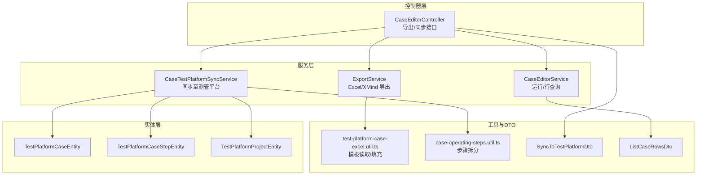
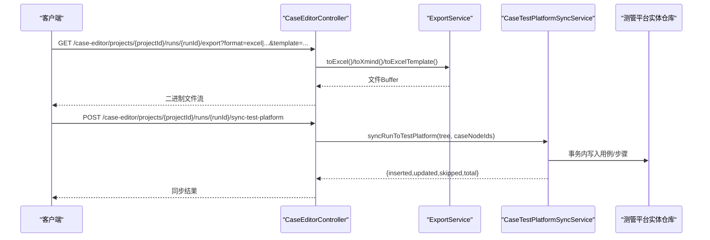
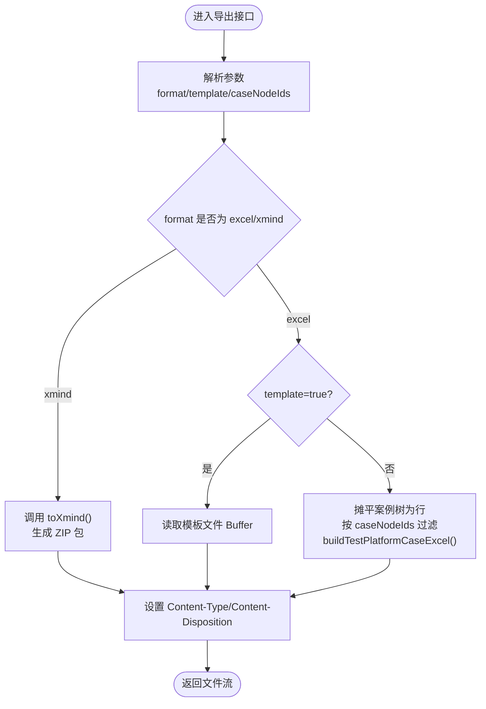
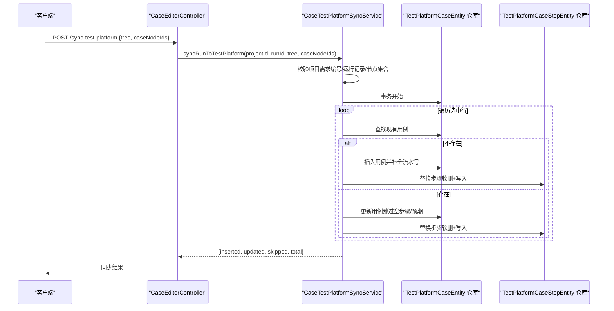
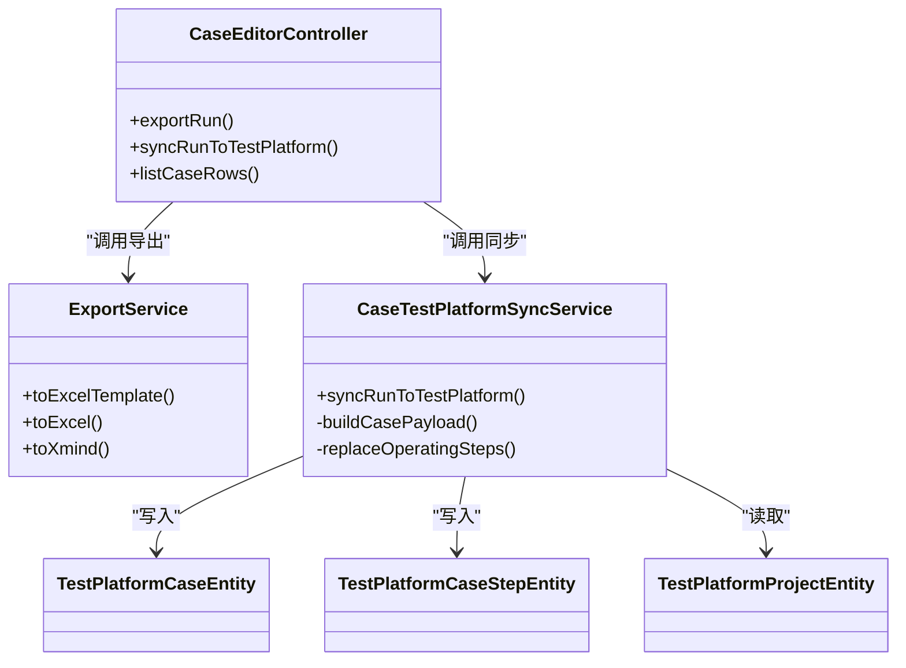

# 导出与同步 API

<cite>
**本文引用的文件**
- [apps/api/src/modules/case-editor/controller/case-editor.controller.ts](file://apps/api/src/modules/case-editor/controller/case-editor.controller.ts)
- [apps/api/src/modules/case-editor/service/export.service.ts](file://apps/api/src/modules/case-editor/service/export.service.ts)
- [apps/api/src/modules/case-editor/service/case-test-platform-sync.service.ts](file://apps/api/src/modules/case-editor/service/case-test-platform-sync.service.ts)
- [apps/api/src/modules/case-editor/dto/sync-to-test-platform.dto.ts](file://apps/api/src/modules/case-editor/dto/sync-to-test-platform.dto.ts)
- [apps/api/src/modules/case-editor/util/test-platform-case-excel.util.ts](file://apps/api/src/modules/case-editor/util/test-platform-case-excel.util.ts)
- [apps/api/src/modules/case-editor/util/case-operating-steps.util.ts](file://apps/api/src/modules/case-editor/util/case-operating-steps.util.ts)
- [apps/api/src/modules/case-editor/dto/list-case-rows.dto.ts](file://apps/api/src/modules/case-editor/dto/list-case-rows.dto.ts)
- [apps/api/src/modules/case-editor/service/case-editor.service.ts](file://apps/api/src/modules/case-editor/service/case-editor.service.ts)
- [apps/api/src/common/test-platform/entity/test-platform-case.entity.ts](file://apps/api/src/common/test-platform/entity/test-platform-case.entity.ts)
- [apps/api/src/common/test-platform/entity/test-platform-case-step.entity.ts](file://apps/api/src/common/test-platform/entity/test-platform-case-step.entity.ts)
- [apps/api/src/common/test-platform/entity/test-platform-project.entity.ts](file://apps/api/src/common/test-platform/entity/test-platform-project.entity.ts)
</cite>

## 目录
1. [简介](#简介)
2. [项目结构](#项目结构)
3. [核心组件](#核心组件)
4. [架构总览](#架构总览)
5. [详细组件分析](#详细组件分析)
6. [依赖关系分析](#依赖关系分析)
7. [性能考量](#性能考量)
8. [故障排查指南](#故障排查指南)
9. [结论](#结论)
10. [附录](#附录)

## 简介
本文件面向“案例导出与测试平台同步”能力，提供完整的 API 文档与实现解析，涵盖：
- 案例数据导出：Excel、XMind 模板与数据导出、按节点筛选导出
- 同步至外部测试平台：批量同步、事务一致性、步骤替换策略
- 模板配置：Excel 模板路径解析、字段映射与填充
- 增量同步：按选中案例节点进行增量写入
- 状态跟踪与错误处理：返回统计结果、校验缺失节点、拒绝空集
- 冲突与回滚：基于事务的插入/更新/跳过策略

## 项目结构
围绕“案例编辑器”模块，导出与同步相关的关键文件组织如下：
- 控制器层：统一暴露 HTTP 接口，负责路由与参数解析
- 服务层：导出服务、同步服务、运行查询服务
- 工具与 DTO：Excel 模板工具、操作步骤拆分、请求参数校验
- 实体层：测试平台目标表映射（项目、用例、步骤）

图表来源
- [apps/api/src/modules/case-editor/controller/case-editor.controller.ts:134-197](file://apps/api/src/modules/case-editor/controller/case-editor.controller.ts#L134-L197)
- [apps/api/src/modules/case-editor/service/export.service.ts:39-52](file://apps/api/src/modules/case-editor/service/export.service.ts#L39-L52)
- [apps/api/src/modules/case-editor/service/case-test-platform-sync.service.ts:59-177](file://apps/api/src/modules/case-editor/service/case-test-platform-sync.service.ts#L59-L177)
- [apps/api/src/modules/case-editor/util/test-platform-case-excel.util.ts:75-106](file://apps/api/src/modules/case-editor/util/test-platform-case-excel.util.ts#L75-L106)
- [apps/api/src/modules/case-editor/util/case-operating-steps.util.ts:20-48](file://apps/api/src/modules/case-editor/util/case-operating-steps.util.ts#L20-L48)
- [apps/api/src/modules/case-editor/dto/sync-to-test-platform.dto.ts:5-16](file://apps/api/src/modules/case-editor/dto/sync-to-test-platform.dto.ts#L5-L16)
- [apps/api/src/modules/case-editor/dto/list-case-rows.dto.ts:9-55](file://apps/api/src/modules/case-editor/dto/list-case-rows.dto.ts#L9-L55)
- [apps/api/src/common/test-platform/entity/test-platform-case.entity.ts:6-91](file://apps/api/src/common/test-platform/entity/test-platform-case.entity.ts#L6-L91)
- [apps/api/src/common/test-platform/entity/test-platform-case-step.entity.ts:6-31](file://apps/api/src/common/test-platform/entity/test-platform-case-step.entity.ts#L6-L31)
- [apps/api/src/common/test-platform/entity/test-platform-project.entity.ts:6-19](file://apps/api/src/common/test-platform/entity/test-platform-project.entity.ts#L6-L19)

章节来源
- [apps/api/src/modules/case-editor/controller/case-editor.controller.ts:134-197](file://apps/api/src/modules/case-editor/controller/case-editor.controller.ts#L134-L197)
- [apps/api/src/modules/case-editor/service/export.service.ts:39-52](file://apps/api/src/modules/case-editor/service/export.service.ts#L39-L52)
- [apps/api/src/modules/case-editor/service/case-test-platform-sync.service.ts:59-177](file://apps/api/src/modules/case-editor/service/case-test-platform-sync.service.ts#L59-L177)

## 核心组件
- 导出服务：提供 Excel 模板下载、Excel 数据导出（可按节点过滤）、XMind 导出
- 同步服务：将案例树转换为测管平台用例与步骤，支持事务内插入/更新/跳过
- 控制器接口：统一暴露导出与同步端点，处理参数与响应头
- 模板工具：解析模板路径、映射字段、填充数据
- 步骤拆分：将案例步骤与预期拆分为多行步骤
- 运行查询：分页列出 Excel 行，支持筛选与高亮定位

章节来源
- [apps/api/src/modules/case-editor/service/export.service.ts:39-52](file://apps/api/src/modules/case-editor/service/export.service.ts#L39-L52)
- [apps/api/src/modules/case-editor/service/case-test-platform-sync.service.ts:59-177](file://apps/api/src/modules/case-editor/service/case-test-platform-sync.service.ts#L59-L177)
- [apps/api/src/modules/case-editor/util/test-platform-case-excel.util.ts:75-106](file://apps/api/src/modules/case-editor/util/test-platform-case-excel.util.ts#L75-L106)
- [apps/api/src/modules/case-editor/util/case-operating-steps.util.ts:20-48](file://apps/api/src/modules/case-editor/util/case-operating-steps.util.ts#L20-L48)
- [apps/api/src/modules/case-editor/dto/list-case-rows.dto.ts:9-55](file://apps/api/src/modules/case-editor/dto/list-case-rows.dto.ts#L9-L55)

## 架构总览
导出与同步的端到端流程如下：

图表来源
- [apps/api/src/modules/case-editor/controller/case-editor.controller.ts:134-197](file://apps/api/src/modules/case-editor/controller/case-editor.controller.ts#L134-L197)
- [apps/api/src/modules/case-editor/service/export.service.ts:39-52](file://apps/api/src/modules/case-editor/service/export.service.ts#L39-L52)
- [apps/api/src/modules/case-editor/service/case-test-platform-sync.service.ts:59-177](file://apps/api/src/modules/case-editor/service/case-test-platform-sync.service.ts#L59-L177)

## 详细组件分析

### 导出接口
- 端点：GET /case-editor/projects/{projectId}/runs/{runId}/export
- 支持格式：excel、xmind
- 参数：
  - format：excel 或 xmind
  - template：是否下载 Excel 模板（1/true 时返回模板）
  - caseNodeIds：可选，逗号分隔的案例节点 ID，用于按节点筛选导出
- 响应：
  - Excel：返回 .xlsx 文件，文件名依据运行树标题或“测试案例模板”
  - XMind：返回 .xmind 文件，包含 content.json、content.xml、manifest 等必要文件
- 逻辑要点：
  - 当 template=true 时，直接读取模板文件返回
  - Excel 导出前会将案例树摊平为行，再按 caseNodeIds 过滤
  - XMind 导出构建 sheet、metadata、manifest，并打包为 ZIP

章节来源
- [apps/api/src/modules/case-editor/controller/case-editor.controller.ts:134-181](file://apps/api/src/modules/case-editor/controller/case-editor.controller.ts#L134-L181)
- [apps/api/src/modules/case-editor/service/export.service.ts:39-52](file://apps/api/src/modules/case-editor/service/export.service.ts#L39-L52)
- [apps/api/src/modules/case-editor/util/test-platform-case-excel.util.ts:75-106](file://apps/api/src/modules/case-editor/util/test-platform-case-excel.util.ts#L75-L106)

#### 导出流程图

图表来源
- [apps/api/src/modules/case-editor/controller/case-editor.controller.ts:134-181](file://apps/api/src/modules/case-editor/controller/case-editor.controller.ts#L134-L181)
- [apps/api/src/modules/case-editor/service/export.service.ts:39-52](file://apps/api/src/modules/case-editor/service/export.service.ts#L39-L52)
- [apps/api/src/modules/case-editor/util/test-platform-case-excel.util.ts:75-106](file://apps/api/src/modules/case-editor/util/test-platform-case-excel.util.ts#L75-L106)

### 同步至测试平台接口
- 端点：POST /case-editor/projects/{projectId}/runs/{runId}/sync-test-platform
- 请求体：SyncToTestPlatformDto
  - tree：当前编辑中的案例树（即使未保存也按此内容同步）
  - caseNodeIds：必填数组，至少一个，表示要同步的案例节点 ID
- 同步流程：
  - 校验项目需求编号格式与存在性
  - 校验运行记录存在性
  - 将案例树摊平为行，校验所选节点均存在
  - 事务内对每个节点：
    - 若目标用例不存在则插入；若存在则更新
    - 对步骤进行替换：先软删除旧步骤，再按拆分规则写入新步骤
  - 统计插入/更新/跳过数量与总数
- 返回值：包含项目编码、测管项目 ID、插入数、更新数、跳过数、总数

章节来源
- [apps/api/src/modules/case-editor/controller/case-editor.controller.ts:183-197](file://apps/api/src/modules/case-editor/controller/case-editor.controller.ts#L183-L197)
- [apps/api/src/modules/case-editor/dto/sync-to-test-platform.dto.ts:5-16](file://apps/api/src/modules/case-editor/dto/sync-to-test-platform.dto.ts#L5-L16)
- [apps/api/src/modules/case-editor/service/case-test-platform-sync.service.ts:59-177](file://apps/api/src/modules/case-editor/service/case-test-platform-sync.service.ts#L59-L177)

#### 同步序列图

图表来源
- [apps/api/src/modules/case-editor/controller/case-editor.controller.ts:183-197](file://apps/api/src/modules/case-editor/controller/case-editor.controller.ts#L183-L197)
- [apps/api/src/modules/case-editor/service/case-test-platform-sync.service.ts:59-177](file://apps/api/src/modules/case-editor/service/case-test-platform-sync.service.ts#L59-L177)

### 模板配置与 Excel 字段映射
- 模板文件：test-case-export-template.xlsx
  - 位置查找顺序：模块 assets → 源码 dist → doc 示例文件
  - 读取失败会抛出明确错误提示
- 字段映射（从案例行到模板列）：
  - 序号、需求、系统、用例名称、案例性质（正/反）、测试环境、优先级、步骤、预期结果等
- 填充策略：
  - 从第 7 行开始复制行以容纳多条数据
  - 按序写入各列值

章节来源
- [apps/api/src/modules/case-editor/util/test-platform-case-excel.util.ts:17-34](file://apps/api/src/modules/case-editor/util/test-platform-case-excel.util.ts#L17-L34)
- [apps/api/src/modules/case-editor/util/test-platform-case-excel.util.ts:40-62](file://apps/api/src/modules/case-editor/util/test-platform-case-excel.util.ts#L40-L62)
- [apps/api/src/modules/case-editor/util/test-platform-case-excel.util.ts:80-106](file://apps/api/src/modules/case-editor/util/test-platform-case-excel.util.ts#L80-L106)

### 案例步骤拆分与替换
- 输入：案例步骤文本、预期结果文本
- 输出：按行拆分后的步骤与预期配对数组
- 规则：
  - 去除每行编号前缀
  - 若只有预期无步骤，默认补充“执行测试”步骤
  - 若两者长度不一致，按最长者补齐

章节来源
- [apps/api/src/modules/case-editor/util/case-operating-steps.util.ts:20-48](file://apps/api/src/modules/case-editor/util/case-operating-steps.util.ts#L20-L48)

### 案例 Excel 行分页与筛选
- 端点：GET /case-editor/projects/{projectId}/runs/{runId}/case-rows
- 查询参数：page、pageSize、requirement、priority、caseNature、keyword、focusCaseNodeId、idsOnly
- 功能：
  - 将案例树摊平为行
  - 支持按需求、优先级、性质、关键词筛选
  - 支持返回符合条件的 caseNodeId 列表（idsOnly）

章节来源
- [apps/api/src/modules/case-editor/controller/case-editor.controller.ts:123-132](file://apps/api/src/modules/case-editor/controller/case-editor.controller.ts#L123-L132)
- [apps/api/src/modules/case-editor/dto/list-case-rows.dto.ts:9-55](file://apps/api/src/modules/case-editor/dto/list-case-rows.dto.ts#L9-L55)
- [apps/api/src/modules/case-editor/service/case-editor.service.ts:175-200](file://apps/api/src/modules/case-editor/service/case-editor.service.ts#L175-L200)

## 依赖关系分析

图表来源
- [apps/api/src/modules/case-editor/controller/case-editor.controller.ts:134-197](file://apps/api/src/modules/case-editor/controller/case-editor.controller.ts#L134-L197)
- [apps/api/src/modules/case-editor/service/export.service.ts:39-52](file://apps/api/src/modules/case-editor/service/export.service.ts#L39-L52)
- [apps/api/src/modules/case-editor/service/case-test-platform-sync.service.ts:59-177](file://apps/api/src/modules/case-editor/service/case-test-platform-sync.service.ts#L59-L177)
- [apps/api/src/common/test-platform/entity/test-platform-case.entity.ts:6-91](file://apps/api/src/common/test-platform/entity/test-platform-case.entity.ts#L6-L91)
- [apps/api/src/common/test-platform/entity/test-platform-case-step.entity.ts:6-31](file://apps/api/src/common/test-platform/entity/test-platform-case-step.entity.ts#L6-L31)
- [apps/api/src/common/test-platform/entity/test-platform-project.entity.ts:6-19](file://apps/api/src/common/test-platform/entity/test-platform-project.entity.ts#L6-L19)

## 性能考量
- Excel 导出：
  - 案例树摊平为行后一次性写入，避免多次 IO
  - 模板复制行时按需复制，减少重复构造
- XMind 导出：
  - 使用 JSZip 异步生成压缩包，适合流式传输
- 同步写入：
  - 使用数据库事务包裹，保证插入/更新/步骤替换的一致性
  - 每个节点独立处理，便于并发与限流控制（建议前端分批提交）
- 分页查询：
  - 在内存中摊平与筛选，建议限制 pageSize 并配合 idsOnly 优化全选场景

## 故障排查指南
- 导出失败
  - Excel 模板未找到：检查模板路径是否存在，确认模块 assets、dist、doc 中任一位置存在
  - 格式参数非法：确保 format 为 excel 或 xmind
- 同步失败
  - 项目需求编号缺失或格式不正确：请在项目标题或需求编号中填写规范格式
  - 未找到运行记录：确认 runId 与 projectId 关联且存在
  - 未选择任何案例：至少选择一个 caseNodeIds
  - 选中案例不存在或已删除：核对 caseNodeIds 是否存在于当前案例树
  - 案例为空（仅标题/性质/优先级）：将被跳过，不会更新或插入
- 响应字段含义
  - inserted：本次同步新增的用例数
  - updated：本次同步更新的用例数
  - skipped：因为空步骤/预期而跳过的用例数
  - total：实际处理的案例节点数

章节来源
- [apps/api/src/modules/case-editor/util/test-platform-case-excel.util.ts:17-34](file://apps/api/src/modules/case-editor/util/test-platform-case-excel.util.ts#L17-L34)
- [apps/api/src/modules/case-editor/service/case-test-platform-sync.service.ts:67-111](file://apps/api/src/modules/case-editor/service/case-test-platform-sync.service.ts#L67-L111)

## 结论
本方案通过清晰的接口边界与强一致的事务写入，实现了案例数据的多格式导出与高效增量同步。导出支持模板与数据两种模式，同步支持插入/更新/跳过策略，并提供详细的统计结果，便于后续审计与回滚评估。

## 附录

### API 定义与使用示例

- 导出案例树
  - 方法与路径：GET /case-editor/projects/{projectId}/runs/{runId}/export
  - 查询参数：
    - format：excel | xmind
    - template：1 | true（可选，下载模板）
    - caseNodeIds：逗号分隔的节点 ID（可选，按节点筛选）
  - 响应：二进制文件流（.xlsx 或 .xmind）
  - 示例请求：
    - GET /case-editor/projects/1/runs/abc/export?format=excel
    - GET /case-editor/projects/1/runs/abc/export?format=excel&template=1
    - GET /case-editor/projects/1/runs/abc/export?format=excel&caseNodeIds=1,2,3

- 同步至测试平台
  - 方法与路径：POST /case-editor/projects/{projectId}/runs/{runId}/sync-test-platform
  - 请求体：
    - tree：案例树对象
    - caseNodeIds：字符串数组，至少一项
  - 响应：同步统计结果（inserted、updated、skipped、total）
  - 示例请求体：
    - {
        "tree": { /* 案例树 */ },
        "caseNodeIds": ["node1","node2"]
      }

- 分页查询案例 Excel 行
  - 方法与路径：GET /case-editor/projects/{projectId}/runs/{runId}/case-rows
  - 查询参数：
    - page、pageSize、requirement、priority、caseNature、keyword、focusCaseNodeId、idsOnly
  - 响应：分页结果，可选 idsOnly=true 返回 caseNodeId 列表

章节来源
- [apps/api/src/modules/case-editor/controller/case-editor.controller.ts:123-197](file://apps/api/src/modules/case-editor/controller/case-editor.controller.ts#L123-L197)
- [apps/api/src/modules/case-editor/dto/list-case-rows.dto.ts:9-55](file://apps/api/src/modules/case-editor/dto/list-case-rows.dto.ts#L9-L55)
- [apps/api/src/modules/case-editor/dto/sync-to-test-platform.dto.ts:5-16](file://apps/api/src/modules/case-editor/dto/sync-to-test-platform.dto.ts#L5-L16)