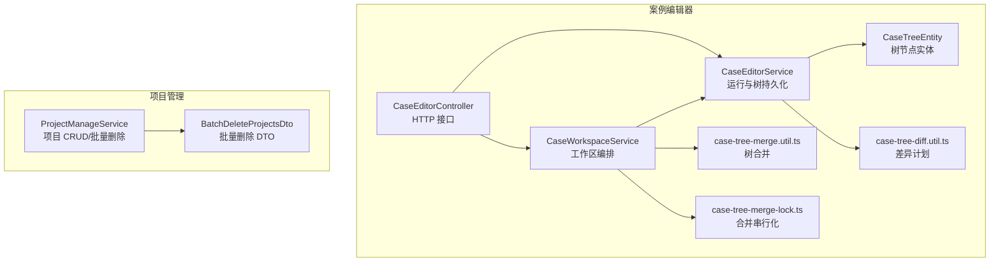
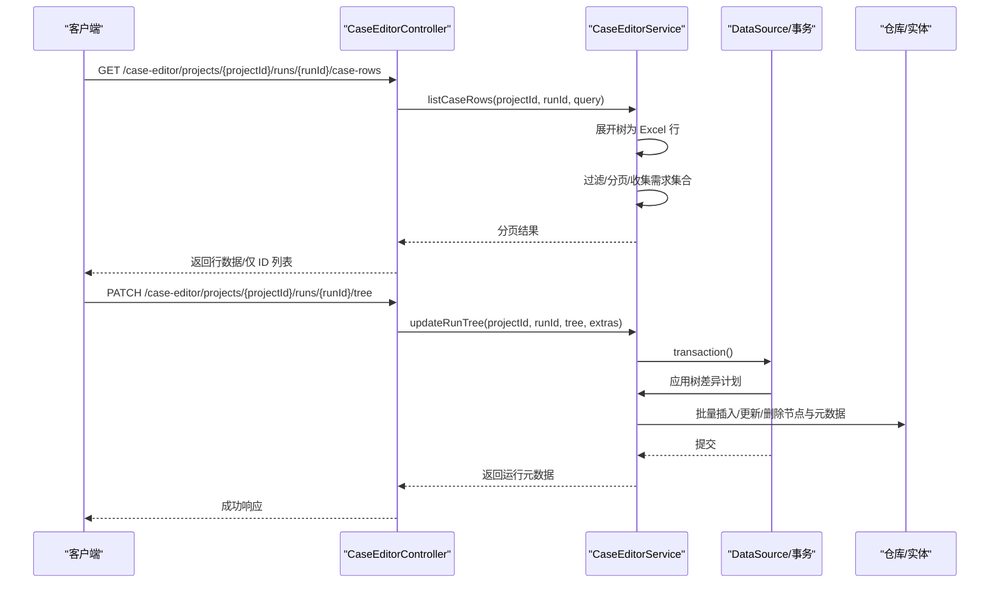
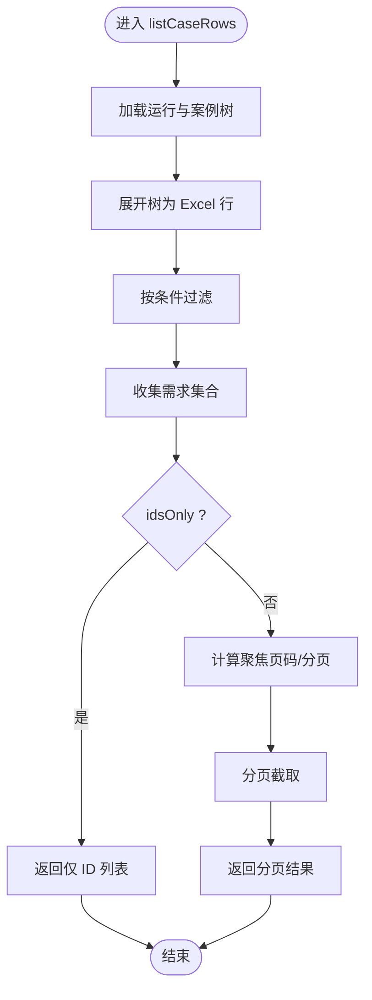
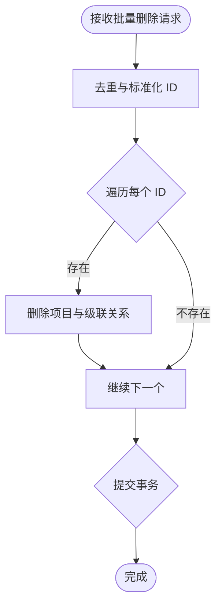
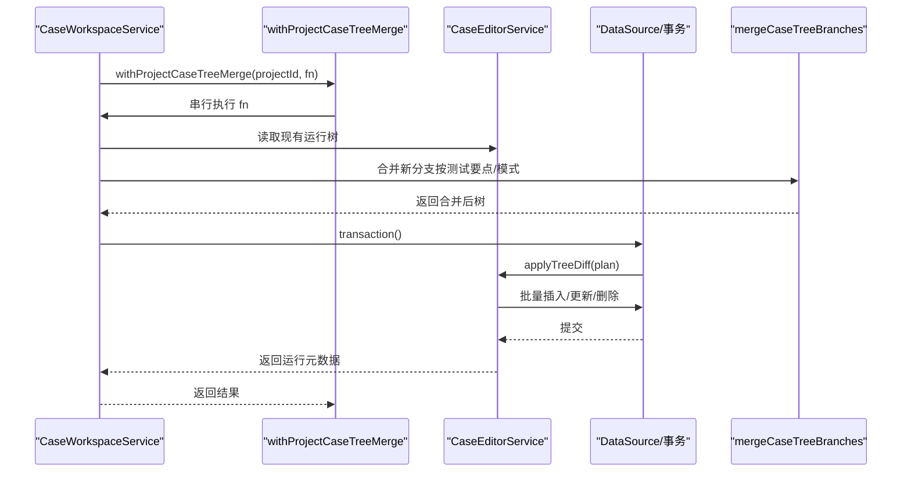
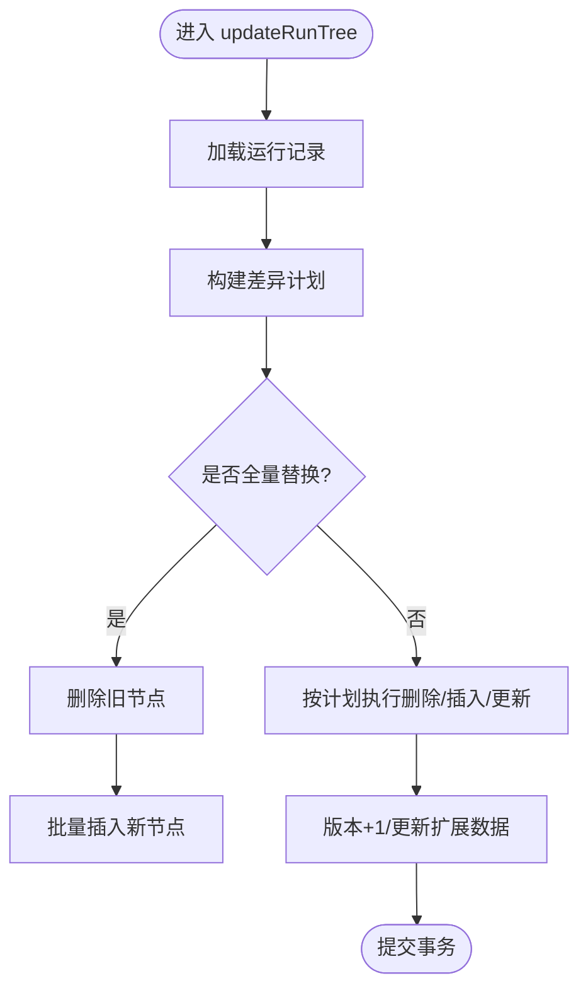
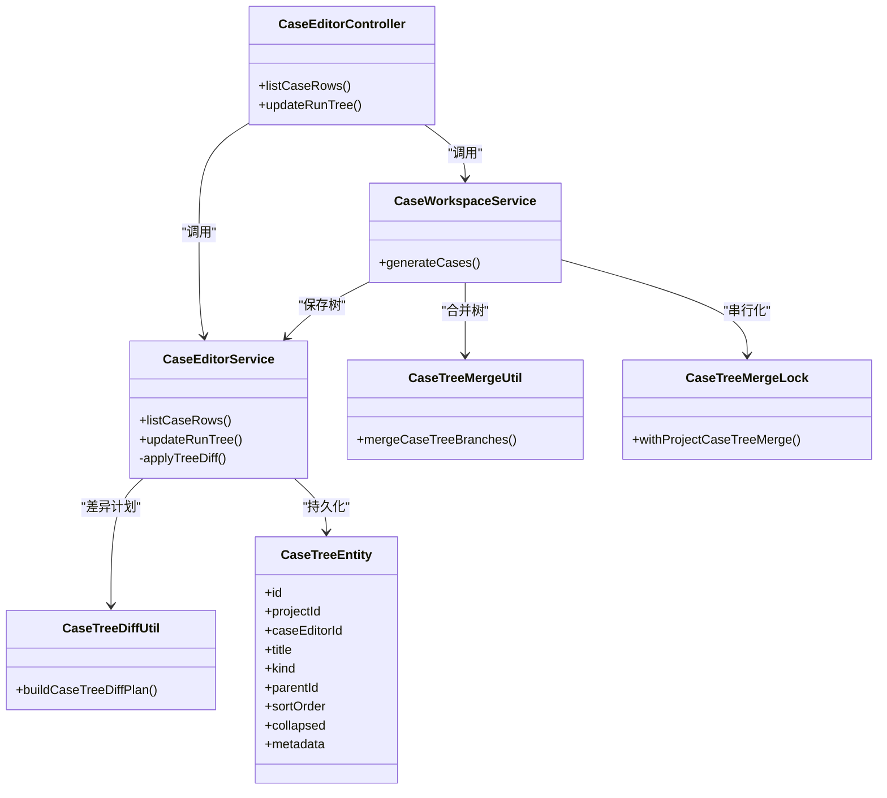

# 批量操作 API

<cite>
**本文引用的文件**
- [apps/api/src/modules/case-editor/controller/case-editor.controller.ts](file://apps/api/src/modules/case-editor/controller/case-editor.controller.ts)
- [apps/api/src/modules/case-editor/service/case-editor.service.ts](file://apps/api/src/modules/case-editor/service/case-editor.service.ts)
- [apps/api/src/modules/case-editor/dto/list-case-rows.dto.ts](file://apps/api/src/modules/case-editor/dto/list-case-rows.dto.ts)
- [apps/api/src/modules/case-editor/dto/update-run-tree.dto.ts](file://apps/api/src/modules/case-editor/dto/update-run-tree.dto.ts)
- [apps/api/src/modules/case-editor/util/case-tree-merge.util.ts](file://apps/api/src/modules/case-editor/util/case-tree-merge.util.ts)
- [apps/api/src/modules/case-editor/util/case-tree-merge-lock.ts](file://apps/api/src/modules/case-editor/util/case-tree-merge-lock.ts)
- [apps/api/src/modules/case-editor/util/case-tree-diff.util.ts](file://apps/api/src/modules/case-editor/util/case-tree-diff.util.ts)
- [apps/api/src/modules/case-editor/entity/case-tree.entity.ts](file://apps/api/src/modules/case-editor/entity/case-tree.entity.ts)
- [apps/api/src/modules/case-editor/service/case-workspace.service.ts](file://apps/api/src/modules/case-editor/service/case-workspace.service.ts)
- [apps/api/src/modules/project-manage/dto/batch-delete-projects.dto.ts](file://apps/api/src/modules/project-manage/dto/batch-delete-projects.dto.ts)
- [apps/api/src/modules/project-manage/service/project-manage.service.ts](file://apps/api/src/modules/project-manage/service/project-manage.service.ts)
- [packages/shared/src/case-tree.ts](file://packages/shared/src/case-tree.ts)
</cite>

## 目录
1. [简介](#简介)
2. [项目结构](#项目结构)
3. [核心组件](#核心组件)
4. [架构总览](#架构总览)
5. [详细组件分析](#详细组件分析)
6. [依赖关系分析](#依赖关系分析)
7. [性能考量](#性能考量)
8. [故障排查指南](#故障排查指南)
9. [结论](#结论)
10. [附录](#附录)

## 简介
本文件面向“案例编辑器”的批量操作能力，聚焦以下三类 API 场景：
- 批量案例行查询：对案例树展开为 Excel 行后进行筛选与分页，支持仅返回 ID 列表以配合前端全选。
- 项目批量删除：通过项目 ID 数组进行批量删除，内部使用数据库事务保证一致性。
- 案例树合并：在多批次生成或并发写入时，将新分支安全合并到现有案例树，避免后写覆盖先写。

同时，文档阐述了批量数据处理、事务管理与性能优化策略，并给出大数据量处理的最佳实践与错误处理示例路径。

## 项目结构
围绕“案例编辑器”模块，批量操作相关的控制器、服务、DTO、工具与实体分布如下：
- 控制器：暴露 HTTP 接口，如批量案例行查询、保存案例树、同步至测试平台等。
- 服务：实现业务逻辑，包括运行记录持久化、案例树差异计算与批量写入、工作区编排与生成队列等。
- DTO：约束输入参数，如分页、筛选、批量删除等。
- 工具：案例树合并、合并串行化锁、树差异计划构建等。
- 实体：案例树节点与元数据的持久化映射。

图表来源
- [apps/api/src/modules/case-editor/controller/case-editor.controller.ts:123-132](file://apps/api/src/modules/case-editor/controller/case-editor.controller.ts#L123-L132)
- [apps/api/src/modules/case-editor/service/case-editor.service.ts:175-219](file://apps/api/src/modules/case-editor/service/case-editor.service.ts#L175-L219)
- [apps/api/src/modules/case-editor/service/case-workspace.service.ts:197-200](file://apps/api/src/modules/case-editor/service/case-workspace.service.ts#L197-L200)
- [apps/api/src/modules/case-editor/util/case-tree-merge.util.ts:18-45](file://apps/api/src/modules/case-editor/util/case-tree-merge.util.ts#L18-L45)
- [apps/api/src/modules/case-editor/util/case-tree-merge-lock.ts:4-16](file://apps/api/src/modules/case-editor/util/case-tree-merge-lock.ts#L4-L16)
- [apps/api/src/modules/case-editor/util/case-tree-diff.util.ts:100-163](file://apps/api/src/modules/case-editor/util/case-tree-diff.util.ts#L100-L163)
- [apps/api/src/modules/case-editor/entity/case-tree.entity.ts:26-36](file://apps/api/src/modules/case-editor/entity/case-tree.entity.ts#L26-L36)
- [apps/api/src/modules/project-manage/service/project-manage.service.ts:261-281](file://apps/api/src/modules/project-manage/service/project-manage.service.ts#L261-L281)
- [apps/api/src/modules/project-manage/dto/batch-delete-projects.dto.ts:8-14](file://apps/api/src/modules/project-manage/dto/batch-delete-projects.dto.ts#L8-L14)

章节来源
- [apps/api/src/modules/case-editor/controller/case-editor.controller.ts:123-132](file://apps/api/src/modules/case-editor/controller/case-editor.controller.ts#L123-L132)
- [apps/api/src/modules/case-editor/service/case-editor.service.ts:175-219](file://apps/api/src/modules/case-editor/service/case-editor.service.ts#L175-L219)
- [apps/api/src/modules/case-editor/service/case-workspace.service.ts:197-200](file://apps/api/src/modules/case-editor/service/case-workspace.service.ts#L197-L200)
- [apps/api/src/modules/project-manage/service/project-manage.service.ts:261-281](file://apps/api/src/modules/project-manage/service/project-manage.service.ts#L261-L281)

## 核心组件
- 案例行查询接口：提供分页与筛选，支持仅返回匹配 ID 列表，便于前端全选与高亮定位。
- 案例树保存接口：在事务内应用树差异计划，批量插入/更新/删除节点与元数据，确保一致性。
- 案例树合并：在工作区编排中串行化合并，避免并发写入导致的覆盖问题。
- 项目批量删除：对每个项目逐一执行删除与级联清理，使用事务包裹保证原子性。

章节来源
- [apps/api/src/modules/case-editor/controller/case-editor.controller.ts:123-132](file://apps/api/src/modules/case-editor/controller/case-editor.controller.ts#L123-L132)
- [apps/api/src/modules/case-editor/service/case-editor.service.ts:254-288](file://apps/api/src/modules/case-editor/service/case-editor.service.ts#L254-L288)
- [apps/api/src/modules/case-editor/util/case-tree-merge-lock.ts:4-16](file://apps/api/src/modules/case-editor/util/case-tree-merge-lock.ts#L4-L16)
- [apps/api/src/modules/project-manage/service/project-manage.service.ts:261-281](file://apps/api/src/modules/project-manage/service/project-manage.service.ts#L261-L281)

## 架构总览
批量操作涉及的端到端流程如下：

图表来源
- [apps/api/src/modules/case-editor/controller/case-editor.controller.ts:123-132](file://apps/api/src/modules/case-editor/controller/case-editor.controller.ts#L123-L132)
- [apps/api/src/modules/case-editor/controller/case-editor.controller.ts:200-213](file://apps/api/src/modules/case-editor/controller/case-editor.controller.ts#L200-L213)
- [apps/api/src/modules/case-editor/service/case-editor.service.ts:175-219](file://apps/api/src/modules/case-editor/service/case-editor.service.ts#L175-L219)
- [apps/api/src/modules/case-editor/service/case-editor.service.ts:221-252](file://apps/api/src/modules/case-editor/service/case-editor.service.ts#L221-L252)
- [apps/api/src/modules/case-editor/service/case-editor.service.ts:254-288](file://apps/api/src/modules/case-editor/service/case-editor.service.ts#L254-L288)

## 详细组件分析

### 组件一：批量案例行查询（分页与筛选）
- 接口路径：GET /case-editor/projects/{projectId}/runs/{runId}/case-rows
- 功能要点：
  - 将案例树展开为 Excel 行，进行内存过滤与分页。
  - 支持按测试要点、优先级、性质、关键字筛选。
  - 支持仅返回匹配的 caseNodeId 列表，便于前端全选与定位。
  - 若提供 focusCaseNodeId，可计算聚焦页码，提升交互体验。
- 数据处理复杂度：
  - 展开树为行：O(N)，N 为节点数。
  - 过滤与分页：O(M)，M 为匹配行数。
  - 总体 O(N + M)。
- 错误处理：
  - 未找到运行或节点时抛出相应异常。
- 最佳实践：
  - 大数据量时建议启用 idsOnly 仅返回 ID，减少传输。
  - 使用 focusCaseNodeId 定位页码，避免多次请求。

图表来源
- [apps/api/src/modules/case-editor/service/case-editor.service.ts:175-219](file://apps/api/src/modules/case-editor/service/case-editor.service.ts#L175-L219)
- [apps/api/src/modules/case-editor/dto/list-case-rows.dto.ts:10-55](file://apps/api/src/modules/case-editor/dto/list-case-rows.dto.ts#L10-L55)

章节来源
- [apps/api/src/modules/case-editor/controller/case-editor.controller.ts:123-132](file://apps/api/src/modules/case-editor/controller/case-editor.controller.ts#L123-L132)
- [apps/api/src/modules/case-editor/service/case-editor.service.ts:175-219](file://apps/api/src/modules/case-editor/service/case-editor.service.ts#L175-L219)
- [apps/api/src/modules/case-editor/dto/list-case-rows.dto.ts:10-55](file://apps/api/src/modules/case-editor/dto/list-case-rows.dto.ts#L10-L55)

### 组件二：项目批量删除
- 接口路径：DELETE /project-manage/projects/batch-delete
- 请求体：BatchDeleteProjectsDto（字符串数组）
- 功能要点：
  - 对每个项目执行删除与级联清理，使用事务包裹保证原子性。
  - 去重与校验，确保输入合法。
- 事务管理：
  - 使用 DataSource.transaction 包裹整个批量删除过程。
- 最佳实践：
  - 前端应提示确认批量删除风险，避免误操作。
  - 对于大型项目，建议分批提交，降低单次事务压力。

图表来源
- [apps/api/src/modules/project-manage/service/project-manage.service.ts:261-281](file://apps/api/src/modules/project-manage/service/project-manage.service.ts#L261-L281)
- [apps/api/src/modules/project-manage/dto/batch-delete-projects.dto.ts:8-14](file://apps/api/src/modules/project-manage/dto/batch-delete-projects.dto.ts#L8-L14)

章节来源
- [apps/api/src/modules/project-manage/service/project-manage.service.ts:261-281](file://apps/api/src/modules/project-manage/service/project-manage.service.ts#L261-L281)
- [apps/api/src/modules/project-manage/dto/batch-delete-projects.dto.ts:8-14](file://apps/api/src/modules/project-manage/dto/batch-delete-projects.dto.ts#L8-L14)

### 组件三：案例树合并（避免并发覆盖）
- 接口路径：PATCH /case-editor/projects/{projectId}/runs/{runId}/tree（保存树）
- 关键流程：
  - 工作区编排服务在合并前通过 withProjectCaseTreeMerge 串行化同一项目的合并。
  - 使用 mergeCaseTreeBranches 将新分支合并到现有树，支持“追加/全量替换”两种模式。
  - 对匹配到的测试要点，可选择先修剪再写入，确保顺序与一致性。
- 并发控制：
  - withProjectCaseTreeMerge 为每个项目维护串行链路，避免并发写入覆盖。
- 数据一致性：
  - 在事务内应用树差异计划，批量写入节点与元数据。

图表来源
- [apps/api/src/modules/case-editor/service/case-workspace.service.ts:394-412](file://apps/api/src/modules/case-editor/service/case-workspace.service.ts#L394-L412)
- [apps/api/src/modules/case-editor/util/case-tree-merge-lock.ts:4-16](file://apps/api/src/modules/case-editor/util/case-tree-merge-lock.ts#L4-L16)
- [apps/api/src/modules/case-editor/util/case-tree-merge.util.ts:18-45](file://apps/api/src/modules/case-editor/util/case-tree-merge.util.ts#L18-L45)
- [apps/api/src/modules/case-editor/service/case-editor.service.ts:254-288](file://apps/api/src/modules/case-editor/service/case-editor.service.ts#L254-L288)

章节来源
- [apps/api/src/modules/case-editor/service/case-workspace.service.ts:394-412](file://apps/api/src/modules/case-editor/service/case-workspace.service.ts#L394-L412)
- [apps/api/src/modules/case-editor/util/case-tree-merge-lock.ts:4-16](file://apps/api/src/modules/case-editor/util/case-tree-merge-lock.ts#L4-L16)
- [apps/api/src/modules/case-editor/util/case-tree-merge.util.ts:18-45](file://apps/api/src/modules/case-editor/util/case-tree-merge.util.ts#L18-L45)
- [apps/api/src/modules/case-editor/service/case-editor.service.ts:254-288](file://apps/api/src/modules/case-editor/service/case-editor.service.ts#L254-L288)

### 组件四：保存案例树（事务与批量写入）
- 接口路径：PATCH /case-editor/projects/{projectId}/runs/{runId}/tree
- 功能要点：
  - 计算树差异计划，决定删除、插入、更新的最小集合。
  - 使用批量写入（分块）减少数据库往返与锁竞争。
  - 提升版本号并更新思维导图扩展数据。
- 批量写入策略：
  - TREE_BATCH_CHUNK_SIZE 控制每批大小，平衡吞吐与内存。
  - deleteByIds/deleteByCaseTreeIds/saveInChunks/insertTreeBatch 分别处理不同操作。

图表来源
- [apps/api/src/modules/case-editor/service/case-editor.service.ts:221-252](file://apps/api/src/modules/case-editor/service/case-editor.service.ts#L221-L252)
- [apps/api/src/modules/case-editor/service/case-editor.service.ts:254-288](file://apps/api/src/modules/case-editor/service/case-editor.service.ts#L254-L288)
- [apps/api/src/modules/case-editor/util/case-tree-diff.util.ts:100-163](file://apps/api/src/modules/case-editor/util/case-tree-diff.util.ts#L100-L163)

章节来源
- [apps/api/src/modules/case-editor/controller/case-editor.controller.ts:200-213](file://apps/api/src/modules/case-editor/controller/case-editor.controller.ts#L200-L213)
- [apps/api/src/modules/case-editor/service/case-editor.service.ts:221-252](file://apps/api/src/modules/case-editor/service/case-editor.service.ts#L221-L252)
- [apps/api/src/modules/case-editor/service/case-editor.service.ts:254-288](file://apps/api/src/modules/case-editor/service/case-editor.service.ts#L254-L288)
- [apps/api/src/modules/case-editor/util/case-tree-diff.util.ts:100-163](file://apps/api/src/modules/case-editor/util/case-tree-diff.util.ts#L100-L163)

## 依赖关系分析
- 控制器依赖服务：控制器仅负责路由与参数校验，业务逻辑集中在服务层。
- 服务依赖工具与实体：服务通过工具计算差异与合并，通过仓库访问数据库实体。
- 并发与一致性：工作区服务通过串行化锁与事务保障合并与保存的一致性。
- 数据模型：案例树节点与元数据通过实体映射，复合索引优化查询。

图表来源
- [apps/api/src/modules/case-editor/controller/case-editor.controller.ts:123-132](file://apps/api/src/modules/case-editor/controller/case-editor.controller.ts#L123-L132)
- [apps/api/src/modules/case-editor/controller/case-editor.controller.ts:200-213](file://apps/api/src/modules/case-editor/controller/case-editor.controller.ts#L200-L213)
- [apps/api/src/modules/case-editor/service/case-editor.service.ts:175-219](file://apps/api/src/modules/case-editor/service/case-editor.service.ts#L175-L219)
- [apps/api/src/modules/case-editor/service/case-editor.service.ts:221-252](file://apps/api/src/modules/case-editor/service/case-editor.service.ts#L221-L252)
- [apps/api/src/modules/case-editor/service/case-workspace.service.ts:394-412](file://apps/api/src/modules/case-editor/service/case-workspace.service.ts#L394-L412)
- [apps/api/src/modules/case-editor/util/case-tree-merge.util.ts:18-45](file://apps/api/src/modules/case-editor/util/case-tree-merge.util.ts#L18-L45)
- [apps/api/src/modules/case-editor/util/case-tree-merge-lock.ts:4-16](file://apps/api/src/modules/case-editor/util/case-tree-merge-lock.ts#L4-L16)
- [apps/api/src/modules/case-editor/util/case-tree-diff.util.ts:100-163](file://apps/api/src/modules/case-editor/util/case-tree-diff.util.ts#L100-L163)
- [apps/api/src/modules/case-editor/entity/case-tree.entity.ts:26-36](file://apps/api/src/modules/case-editor/entity/case-tree.entity.ts#L26-L36)

章节来源
- [apps/api/src/modules/case-editor/controller/case-editor.controller.ts:123-132](file://apps/api/src/modules/case-editor/controller/case-editor.controller.ts#L123-L132)
- [apps/api/src/modules/case-editor/service/case-editor.service.ts:175-219](file://apps/api/src/modules/case-editor/service/case-editor.service.ts#L175-L219)
- [apps/api/src/modules/case-editor/service/case-workspace.service.ts:394-412](file://apps/api/src/modules/case-editor/service/case-workspace.service.ts#L394-L412)
- [apps/api/src/modules/case-editor/util/case-tree-merge.util.ts:18-45](file://apps/api/src/modules/case-editor/util/case-tree-merge.util.ts#L18-L45)
- [apps/api/src/modules/case-editor/util/case-tree-merge-lock.ts:4-16](file://apps/api/src/modules/case-editor/util/case-tree-merge-lock.ts#L4-L16)
- [apps/api/src/modules/case-editor/util/case-tree-diff.util.ts:100-163](file://apps/api/src/modules/case-editor/util/case-tree-diff.util.ts#L100-L163)
- [apps/api/src/modules/case-editor/entity/case-tree.entity.ts:26-36](file://apps/api/src/modules/case-editor/entity/case-tree.entity.ts#L26-L36)

## 性能考量
- 批量写入分块：
  - TREE_BATCH_CHUNK_SIZE 控制每批节点数量，减少单次 INSERT/UPDATE 的锁持有时间与内存峰值。
- 事务边界：
  - 将差异应用与版本更新放入同一事务，确保一致性与原子性。
- 索引与查询：
  - 案例树实体具备复合索引，加速按 editor、parent、sortOrder 的查询。
- 内存处理：
  - 案例行查询在内存中展开与过滤，适合中等规模树；大规模树建议前端分页或后端分页。
- 并发控制：
  - 通过 withProjectCaseTreeMerge 串行化同一项目的合并，避免写放大与覆盖。

章节来源
- [apps/api/src/modules/case-editor/service/case-editor.service.ts:50-51](file://apps/api/src/modules/case-editor/service/case-editor.service.ts#L50-L51)
- [apps/api/src/modules/case-editor/service/case-editor.service.ts:290-328](file://apps/api/src/modules/case-editor/service/case-editor.service.ts#L290-L328)
- [apps/api/src/modules/case-editor/entity/case-tree.entity.ts:27-35](file://apps/api/src/modules/case-editor/entity/case-tree.entity.ts#L27-L35)
- [apps/api/src/modules/case-editor/util/case-tree-merge-lock.ts:4-16](file://apps/api/src/modules/case-editor/util/case-tree-merge-lock.ts#L4-L16)

## 故障排查指南
- 常见错误与定位：
  - 运行或节点不存在：在查询运行与节点子树时抛出相应异常，检查 projectId 与 runId。
  - 输入参数非法：分页与筛选 DTO 对参数进行校验，检查 page、pageSize、筛选条件。
  - 项目批量删除失败：检查项目是否存在与权限范围，确认事务是否成功提交。
- 排查步骤：
  - 案例行查询：先确认树是否正确加载，再检查过滤条件与分页参数。
  - 案例树保存：查看差异计划是否过大（可能触发全量替换），评估批量写入耗时。
  - 并发冲突：若出现覆盖问题，确认是否使用了串行化合并与事务。
- 相关实现参考路径：
  - 案例行查询异常：[apps/api/src/modules/case-editor/service/case-editor.service.ts:142-151](file://apps/api/src/modules/case-editor/service/case-editor.service.ts#L142-L151)
  - 节点子树查询异常：[apps/api/src/modules/case-editor/service/case-editor.service.ts:154-173](file://apps/api/src/modules/case-editor/service/case-editor.service.ts#L154-L173)
  - 保存树事务与差异应用：[apps/api/src/modules/case-editor/service/case-editor.service.ts:221-252](file://apps/api/src/modules/case-editor/service/case-editor.service.ts#L221-L252)
  - 项目批量删除事务：[apps/api/src/modules/project-manage/service/project-manage.service.ts:267-278](file://apps/api/src/modules/project-manage/service/project-manage.service.ts#L267-L278)

章节来源
- [apps/api/src/modules/case-editor/service/case-editor.service.ts:142-151](file://apps/api/src/modules/case-editor/service/case-editor.service.ts#L142-L151)
- [apps/api/src/modules/case-editor/service/case-editor.service.ts:154-173](file://apps/api/src/modules/case-editor/service/case-editor.service.ts#L154-L173)
- [apps/api/src/modules/case-editor/service/case-editor.service.ts:221-252](file://apps/api/src/modules/case-editor/service/case-editor.service.ts#L221-L252)
- [apps/api/src/modules/project-manage/service/project-manage.service.ts:267-278](file://apps/api/src/modules/project-manage/service/project-manage.service.ts#L267-L278)

## 结论
本文梳理了案例编辑器的三大批量能力：案例行查询、项目批量删除与案例树合并。通过 DTO 参数校验、服务层事务与批量写入、工具函数的差异计算与合并策略，以及串行化锁保障并发安全，实现了在大数据量场景下的稳定与高效。建议在生产环境中结合分块大小、索引设计与前端分页策略，持续优化性能与用户体验。

## 附录
- API 端点速览
  - GET /case-editor/projects/{projectId}/runs/{runId}/case-rows
    - 查询参数：page、pageSize、requirement、priority、caseNature、keyword、focusCaseNodeId、idsOnly
    - 返回：分页行数据或仅匹配 ID 列表
  - PATCH /case-editor/projects/{projectId}/runs/{runId}/tree
    - 请求体：tree（案例树）、mindMapExtras（可选）
    - 返回：运行元数据（不含完整树）
  - DELETE /project-manage/projects/batch-delete
    - 请求体：ids（项目 ID 数组）
    - 返回：删除成功的 ID 列表

章节来源
- [apps/api/src/modules/case-editor/controller/case-editor.controller.ts:123-132](file://apps/api/src/modules/case-editor/controller/case-editor.controller.ts#L123-L132)
- [apps/api/src/modules/case-editor/controller/case-editor.controller.ts:200-213](file://apps/api/src/modules/case-editor/controller/case-editor.controller.ts#L200-L213)
- [apps/api/src/modules/project-manage/dto/batch-delete-projects.dto.ts:8-14](file://apps/api/src/modules/project-manage/dto/batch-delete-projects.dto.ts#L8-L14)
- [apps/api/src/modules/case-editor/dto/list-case-rows.dto.ts:10-55](file://apps/api/src/modules/case-editor/dto/list-case-rows.dto.ts#L10-L55)
- [apps/api/src/modules/case-editor/dto/update-run-tree.dto.ts:9-18](file://apps/api/src/modules/case-editor/dto/update-run-tree.dto.ts#L9-L18)