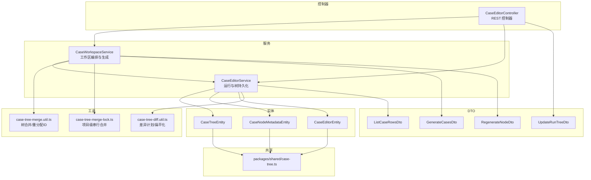
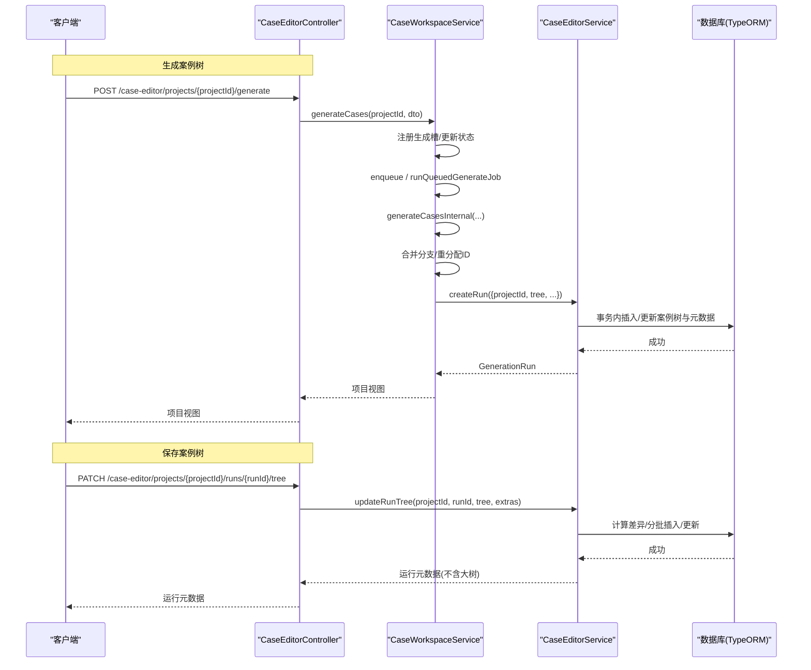
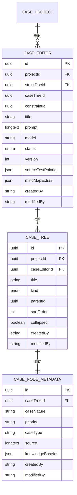
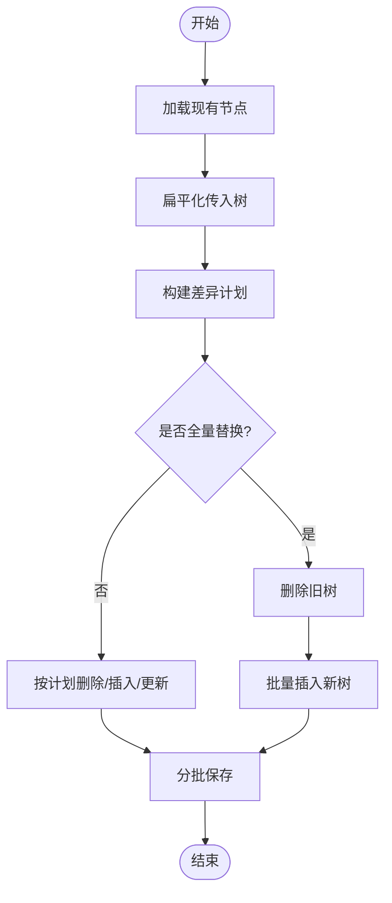
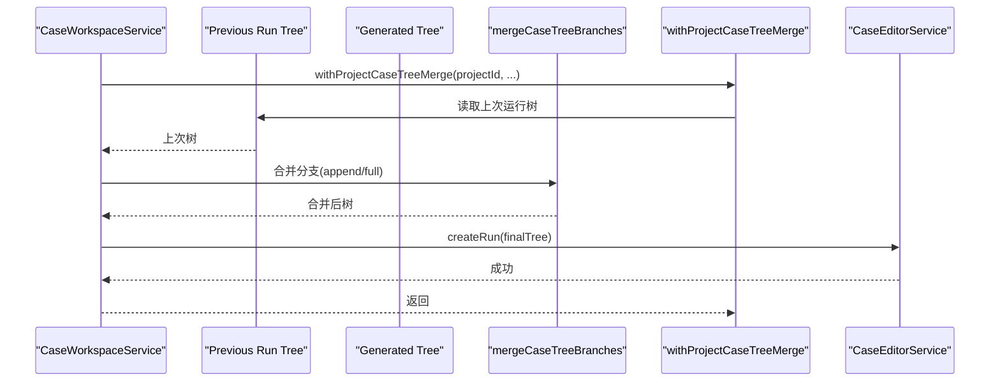
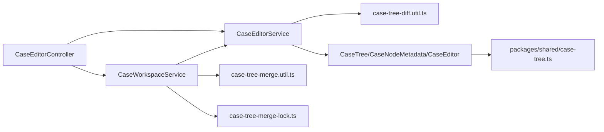

# 案例树管理 API

<cite>
**本文引用的文件**
- [apps/api/src/modules/case-editor/controller/case-editor.controller.ts](file://apps/api/src/modules/case-editor/controller/case-editor.controller.ts)
- [apps/api/src/modules/case-editor/service/case-editor.service.ts](file://apps/api/src/modules/case-editor/service/case-editor.service.ts)
- [apps/api/src/modules/case-editor/service/case-workspace.service.ts](file://apps/api/src/modules/case-editor/service/case-workspace.service.ts)
- [apps/api/src/modules/case-editor/util/case-tree-diff.util.ts](file://apps/api/src/modules/case-editor/util/case-tree-diff.util.ts)
- [apps/api/src/modules/case-editor/util/case-tree-merge.util.ts](file://apps/api/src/modules/case-editor/util/case-tree-merge.util.ts)
- [apps/api/src/modules/case-editor/util/case-tree-merge-lock.ts](file://apps/api/src/modules/case-editor/util/case-tree-merge-lock.ts)
- [apps/api/src/modules/case-editor/dto/update-run-tree.dto.ts](file://apps/api/src/modules/case-editor/dto/update-run-tree.dto.ts)
- [apps/api/src/modules/case-editor/dto/generate-cases.dto.ts](file://apps/api/src/modules/case-editor/dto/generate-cases.dto.ts)
- [apps/api/src/modules/case-editor/dto/regenerate-node.dto.ts](file://apps/api/src/modules/case-editor/dto/regenerate-node.dto.ts)
- [apps/api/src/modules/case-editor/dto/list-case-rows.dto.ts](file://apps/api/src/modules/case-editor/dto/list-case-rows.dto.ts)
- [apps/api/src/modules/case-editor/entity/case-tree.entity.ts](file://apps/api/src/modules/case-editor/entity/case-tree.entity.ts)
- [apps/api/src/modules/case-editor/entity/case-node-metadata.entity.ts](file://apps/api/src/modules/case-editor/entity/case-node-metadata.entity.ts)
- [apps/api/src/modules/case-editor/entity/case-editor.entity.ts](file://apps/api/src/modules/case-editor/entity/case-editor.entity.ts)
- [packages/shared/src/case-tree.ts](file://packages/shared/src/case-tree.ts)
</cite>

## 目录
1. [简介](#简介)
2. [项目结构](#项目结构)
3. [核心组件](#核心组件)
4. [架构总览](#架构总览)
5. [详细组件分析](#详细组件分析)
6. [依赖关系分析](#依赖关系分析)
7. [性能考量](#性能考量)
8. [故障排查指南](#故障排查指南)
9. [结论](#结论)
10. [附录](#附录)

## 简介
本文件面向“案例树管理”相关 API 的使用者与维护者，系统化梳理以下能力：
- 案例树的创建、读取、更新、删除与批量操作
- 案例树节点的层级结构管理、节点移动、复制与合并
- 案例树状态同步、版本控制与冲突解决机制
- 请求示例、响应格式与错误处理策略

文档严格依据代码库现有实现进行说明，确保接口定义与行为一致。

## 项目结构
围绕案例树管理的核心模块位于 apps/api/src/modules/case-editor，主要由控制器、服务、工具函数与实体构成；共享类型与工具位于 packages/shared。

图表来源
- [apps/api/src/modules/case-editor/controller/case-editor.controller.ts:30-215](file://apps/api/src/modules/case-editor/controller/case-editor.controller.ts#L30-L215)
- [apps/api/src/modules/case-editor/service/case-editor.service.ts:54-503](file://apps/api/src/modules/case-editor/service/case-editor.service.ts#L54-L503)
- [apps/api/src/modules/case-editor/service/case-workspace.service.ts:80-830](file://apps/api/src/modules/case-editor/service/case-workspace.service.ts#L80-L830)
- [apps/api/src/modules/case-editor/util/case-tree-diff.util.ts:1-98](file://apps/api/src/modules/case-editor/util/case-tree-diff.util.ts#L1-L98)
- [apps/api/src/modules/case-editor/util/case-tree-merge.util.ts:1-256](file://apps/api/src/modules/case-editor/util/case-tree-merge.util.ts#L1-L256)
- [apps/api/src/modules/case-editor/util/case-tree-merge-lock.ts:1-17](file://apps/api/src/modules/case-editor/util/case-tree-merge-lock.ts#L1-L17)
- [apps/api/src/modules/case-editor/dto/update-run-tree.dto.ts:1-19](file://apps/api/src/modules/case-editor/dto/update-run-tree.dto.ts#L1-L19)
- [apps/api/src/modules/case-editor/dto/generate-cases.dto.ts:1-24](file://apps/api/src/modules/case-editor/dto/generate-cases.dto.ts#L1-L24)
- [apps/api/src/modules/case-editor/dto/regenerate-node.dto.ts:1-31](file://apps/api/src/modules/case-editor/dto/regenerate-node.dto.ts#L1-L31)
- [apps/api/src/modules/case-editor/dto/list-case-rows.dto.ts:1-56](file://apps/api/src/modules/case-editor/dto/list-case-rows.dto.ts#L1-L56)
- [apps/api/src/modules/case-editor/entity/case-tree.entity.ts:1-92](file://apps/api/src/modules/case-editor/entity/case-tree.entity.ts#L1-L92)
- [apps/api/src/modules/case-editor/entity/case-node-metadata.entity.ts:1-62](file://apps/api/src/modules/case-editor/entity/case-node-metadata.entity.ts#L1-L62)
- [apps/api/src/modules/case-editor/entity/case-editor.entity.ts:1-103](file://apps/api/src/modules/case-editor/entity/case-editor.entity.ts#L1-L103)
- [packages/shared/src/case-tree.ts:1-934](file://packages/shared/src/case-tree.ts#L1-L934)

章节来源
- [apps/api/src/modules/case-editor/controller/case-editor.controller.ts:30-215](file://apps/api/src/modules/case-editor/controller/case-editor.controller.ts#L30-L215)
- [apps/api/src/modules/case-editor/service/case-editor.service.ts:54-503](file://apps/api/src/modules/case-editor/service/case-editor.service.ts#L54-L503)
- [apps/api/src/modules/case-editor/service/case-workspace.service.ts:80-830](file://apps/api/src/modules/case-editor/service/case-workspace.service.ts#L80-L830)

## 核心组件
- 案例编辑器控制器：暴露 REST 接口，包括案例树保存、运行记录查询、按需加载子树、导出、同步至测试平台等。
- 案例编辑运行服务：负责运行记录的创建/读取/更新，以及案例树的持久化与差异应用。
- 工作区服务：编排生成流程，合并新生成的树分支，处理取消/失败回退，维护生成队列。
- 工具函数：差异计算与批处理插入、树合并与重分配 ID、项目级串行合并锁。
- 实体：案例树节点、节点元数据、编辑运行记录。
- 共享类型：案例树节点结构、Excel 行模型、规范化工具等。

章节来源
- [apps/api/src/modules/case-editor/controller/case-editor.controller.ts:30-215](file://apps/api/src/modules/case-editor/controller/case-editor.controller.ts#L30-L215)
- [apps/api/src/modules/case-editor/service/case-editor.service.ts:54-503](file://apps/api/src/modules/case-editor/service/case-editor.service.ts#L54-L503)
- [apps/api/src/modules/case-editor/service/case-workspace.service.ts:80-830](file://apps/api/src/modules/case-editor/service/case-workspace.service.ts#L80-L830)
- [apps/api/src/modules/case-editor/util/case-tree-diff.util.ts:1-98](file://apps/api/src/modules/case-editor/util/case-tree-diff.util.ts#L1-L98)
- [apps/api/src/modules/case-editor/util/case-tree-merge.util.ts:1-256](file://apps/api/src/modules/case-editor/util/case-tree-merge.util.ts#L1-L256)
- [apps/api/src/modules/case-editor/util/case-tree-merge-lock.ts:1-17](file://apps/api/src/modules/case-editor/util/case-tree-merge-lock.ts#L1-L17)
- [apps/api/src/modules/case-editor/entity/case-tree.entity.ts:1-92](file://apps/api/src/modules/case-editor/entity/case-tree.entity.ts#L1-L92)
- [apps/api/src/modules/case-editor/entity/case-node-metadata.entity.ts:1-62](file://apps/api/src/modules/case-editor/entity/case-node-metadata.entity.ts#L1-L62)
- [apps/api/src/modules/case-editor/entity/case-editor.entity.ts:1-103](file://apps/api/src/modules/case-editor/entity/case-editor.entity.ts#L1-L103)
- [packages/shared/src/case-tree.ts:1-934](file://packages/shared/src/case-tree.ts#L1-L934)

## 架构总览
案例树管理涉及“工作区生成—运行记录—树持久化—差异应用—批量写入”的完整链路。生成阶段通过工作区服务协调，最终落库到 case_editor、case_tree、case_node_metadata 三张表；保存案例树时通过差异计划最小化变更并分批写入。

图表来源
- [apps/api/src/modules/case-editor/controller/case-editor.controller.ts:52-213](file://apps/api/src/modules/case-editor/controller/case-editor.controller.ts#L52-L213)
- [apps/api/src/modules/case-editor/service/case-workspace.service.ts:197-454](file://apps/api/src/modules/case-editor/service/case-workspace.service.ts#L197-L454)
- [apps/api/src/modules/case-editor/service/case-editor.service.ts:68-252](file://apps/api/src/modules/case-editor/service/case-editor.service.ts#L68-L252)

## 详细组件分析

### 案例树保存 API（PATCH /case-editor/projects/{projectId}/runs/{runId}/tree）
- 描述：保存编辑后的案例树，递增版本号并更新思维导图扩展数据。
- 请求体：UpdateRunTreeDto
  - tree: 案例树节点对象
  - mindMapExtras: 思维导图扩展数据（可选）
- 响应：GenerationRun 元数据（不含大树，避免大数据传输）
- 错误：
  - 404：运行记录不存在
  - 400：请求体校验失败
- 版本控制：CaseEditorEntity.version 自增
- 差异应用：通过差异计划最小化删除/插入/更新

章节来源
- [apps/api/src/modules/case-editor/controller/case-editor.controller.ts:199-213](file://apps/api/src/modules/case-editor/controller/case-editor.controller.ts#L199-L213)
- [apps/api/src/modules/case-editor/dto/update-run-tree.dto.ts:1-19](file://apps/api/src/modules/case-editor/dto/update-run-tree.dto.ts#L1-L19)
- [apps/api/src/modules/case-editor/service/case-editor.service.ts:221-252](file://apps/api/src/modules/case-editor/service/case-editor.service.ts#L221-L252)
- [apps/api/src/modules/case-editor/entity/case-editor.entity.ts:77-78](file://apps/api/src/modules/case-editor/entity/case-editor.entity.ts#L77-L78)

### 案例树读取 API（GET /case-editor/projects/{projectId}/runs/{runId}）
- 描述：获取单次运行的完整案例树。
- 响应：GenerationRun（含 tree）
- 错误：404：运行记录不存在

章节来源
- [apps/api/src/modules/case-editor/controller/case-editor.controller.ts:105-111](file://apps/api/src/modules/case-editor/controller/case-editor.controller.ts#L105-L111)
- [apps/api/src/modules/case-editor/service/case-editor.service.ts:141-151](file://apps/api/src/modules/case-editor/service/case-editor.service.ts#L141-L151)

### 按需加载子树 API（GET /case-editor/projects/{projectId}/runs/{runId}/nodes/{nodeId}/children）
- 描述：仅支持测试要点节点，懒加载其子节点。
- 响应：包含 nodeId、children、total
- 错误：404：节点不存在；400：仅支持 requirement 节点

章节来源
- [apps/api/src/modules/case-editor/controller/case-editor.controller.ts:112-121](file://apps/api/src/modules/case-editor/controller/case-editor.controller.ts#L112-L121)
- [apps/api/src/modules/case-editor/service/case-editor.service.ts:153-173](file://apps/api/src/modules/case-editor/service/case-editor.service.ts#L153-L173)

### 案例 Excel 行分页查询 API（GET /case-editor/projects/{projectId}/runs/{runId}/case-rows）
- 描述：对案例树展开为 Excel 行后进行筛选、分页与高亮定位。
- 查询参数：ListCaseRowsDto
  - page/pageSize、requirement、priority、caseNature、keyword、focusCaseNodeId、idsOnly
- 响应：CaseExcelRowListPage（items、total、requirements 等）

章节来源
- [apps/api/src/modules/case-editor/controller/case-editor.controller.ts:123-132](file://apps/api/src/modules/case-editor/controller/case-editor.controller.ts#L123-L132)
- [apps/api/src/modules/case-editor/dto/list-case-rows.dto.ts:1-56](file://apps/api/src/modules/case-editor/dto/list-case-rows.dto.ts#L1-L56)
- [apps/api/src/modules/case-editor/service/case-editor.service.ts:175-219](file://apps/api/src/modules/case-editor/service/case-editor.service.ts#L175-L219)
- [packages/shared/src/case-tree.ts:516-565](file://packages/shared/src/case-tree.ts#L516-L565)

### 案例树导出 API（GET /case-editor/projects/{projectId}/runs/{runId}/export）
- 描述：支持导出为 xmind 或 excel；excel 可按 caseNodeIds 筛选；可下载模板。
- 查询参数：format（excel/xmind）、template（true/false）、caseNodeIds
- 响应：二进制流（Content-Type 与文件名按格式设置）

章节来源
- [apps/api/src/modules/case-editor/controller/case-editor.controller.ts:134-181](file://apps/api/src/modules/case-editor/controller/case-editor.controller.ts#L134-L181)
- [apps/api/src/modules/case-editor/service/case-editor.service.ts:1-503](file://apps/api/src/modules/case-editor/service/case-editor.service.ts#L1-L503)

### 同步至测试平台 API（POST /case-editor/projects/{projectId}/runs/{runId}/sync-test-platform）
- 描述：将案例树同步至测管平台。
- 请求体：SyncToTestPlatformDto（包含 tree 与 caseNodeIds）
- 响应：同步结果（具体字段由同步服务定义）

章节来源
- [apps/api/src/modules/case-editor/controller/case-editor.controller.ts:183-197](file://apps/api/src/modules/case-editor/controller/case-editor.controller.ts#L183-L197)

### 案例生成与工作区编排
- 生成入口（POST /case-editor/projects/{projectId}/generate）
  - 单条：同步执行，阻塞至完成
  - 多条：立即返回，后台逐条生成
- 取消生成（POST /case-editor/projects/{projectId}/generate/cancel）
  - 仅由前端“停止”按钮触发，刷新不会取消
- 局部重生成（POST /case-editor/projects/{projectId}/regenerate-node）
  - 支持 append/replace/complete 三种模式

章节来源
- [apps/api/src/modules/case-editor/controller/case-editor.controller.ts:45-96](file://apps/api/src/modules/case-editor/controller/case-editor.controller.ts#L45-L96)
- [apps/api/src/modules/case-editor/dto/generate-cases.dto.ts:1-24](file://apps/api/src/modules/case-editor/dto/generate-cases.dto.ts#L1-L24)
- [apps/api/src/modules/case-editor/dto/regenerate-node.dto.ts:1-31](file://apps/api/src/modules/case-editor/dto/regenerate-node.dto.ts#L1-L31)
- [apps/api/src/modules/case-editor/service/case-workspace.service.ts:197-454](file://apps/api/src/modules/case-editor/service/case-workspace.service.ts#L197-L454)

### 数据模型与层级结构
- 案例树节点实体（case_tree）
  - 主键 id，父节点 parentId，排序 sortOrder，折叠 collapsed
  - kind 表示节点类型（root/system/module/requirement/case 等）
  - metadata 一对一关联节点元数据
- 节点元数据实体（case_node_metadata）
  - 包含案例性质、优先级、类型、来源、知识库 ID 列表等
- 运行记录实体（case_editor）
  - 关联项目、结构化文档、案例树根节点 ID、版本号、生成状态、思维导图扩展等

图表来源
- [apps/api/src/modules/case-editor/entity/case-tree.entity.ts:26-92](file://apps/api/src/modules/case-editor/entity/case-tree.entity.ts#L26-L92)
- [apps/api/src/modules/case-editor/entity/case-node-metadata.entity.ts:18-62](file://apps/api/src/modules/case-editor/entity/case-node-metadata.entity.ts#L18-L62)
- [apps/api/src/modules/case-editor/entity/case-editor.entity.ts:32-103](file://apps/api/src/modules/case-editor/entity/case-editor.entity.ts#L32-L103)

### 差异计算与批量写入
- 差异计划（CaseTreeDiffPlan）
  - treeInserts/treeUpdates/treeDeleteIds
  - metadataInserts/metadataUpdates/metadataDeleteCaseTreeIds
- 批处理写入
  - 分批删除、插入、保存，批次大小常量控制
- 全量替换优化
  - 当 incoming 节点数超过阈值时，直接全量替换

图表来源
- [apps/api/src/modules/case-editor/util/case-tree-diff.util.ts:36-98](file://apps/api/src/modules/case-editor/util/case-tree-diff.util.ts#L36-L98)
- [apps/api/src/modules/case-editor/service/case-editor.service.ts:254-354](file://apps/api/src/modules/case-editor/service/case-editor.service.ts#L254-L354)

章节来源
- [apps/api/src/modules/case-editor/util/case-tree-diff.util.ts:1-98](file://apps/api/src/modules/case-editor/util/case-tree-diff.util.ts#L1-L98)
- [apps/api/src/modules/case-editor/service/case-editor.service.ts:254-354](file://apps/api/src/modules/case-editor/service/case-editor.service.ts#L254-L354)

### 树合并与冲突解决
- 合并模式
  - append：追加新测试要点下的子节点
  - full：先移除匹配测试要点的旧案例，再写入新树
- 合并策略
  - 通过测试要点快照匹配 requirement 标题
  - 对系统/模块/测试要点逐级比对
- 并发控制
  - 项目级串行化合并，避免并发写入导致后写覆盖先写
- ID 重分配
  - 合并后对子树重新分配唯一 ID，避免冲突

图表来源
- [apps/api/src/modules/case-editor/service/case-workspace.service.ts:394-423](file://apps/api/src/modules/case-editor/service/case-workspace.service.ts#L394-L423)
- [apps/api/src/modules/case-editor/util/case-tree-merge.util.ts:17-45](file://apps/api/src/modules/case-editor/util/case-tree-merge.util.ts#L17-L45)
- [apps/api/src/modules/case-editor/util/case-tree-merge-lock.ts:1-17](file://apps/api/src/modules/case-editor/util/case-tree-merge-lock.ts#L1-L17)

章节来源
- [apps/api/src/modules/case-editor/util/case-tree-merge.util.ts:1-256](file://apps/api/src/modules/case-editor/util/case-tree-merge.util.ts#L1-L256)
- [apps/api/src/modules/case-editor/util/case-tree-merge-lock.ts:1-17](file://apps/api/src/modules/case-editor/util/case-tree-merge-lock.ts#L1-L17)
- [apps/api/src/modules/case-editor/service/case-workspace.service.ts:394-423](file://apps/api/src/modules/case-editor/service/case-workspace.service.ts#L394-L423)

### 局部重生成节点 API（POST /case-editor/projects/{projectId}/regenerate-node）
- 描述：根据指令局部扩展或替换案例树节点内容。
- 请求体：RegenerateNodeDto
  - runId、nodeId、instruction、mode（append/replace/complete）
- 行为：在内存中修改树，然后调用 updateRunTree 持久化

章节来源
- [apps/api/src/modules/case-editor/controller/case-editor.controller.ts:88-96](file://apps/api/src/modules/case-editor/controller/case-editor.controller.ts#L88-L96)
- [apps/api/src/modules/case-editor/dto/regenerate-node.dto.ts:1-31](file://apps/api/src/modules/case-editor/dto/regenerate-node.dto.ts#L1-L31)
- [apps/api/src/modules/case-editor/service/case-workspace.service.ts:456-478](file://apps/api/src/modules/case-editor/service/case-workspace.service.ts#L456-L478)

## 依赖关系分析
- 控制器依赖服务：控制器仅作为薄层，委托给工作区服务与编辑服务。
- 工作区服务依赖编辑服务与管道服务，负责生成流程编排与状态管理。
- 编辑服务依赖实体与工具函数，负责树的持久化与差异应用。
- 工具函数之间相互配合：差异计划与批处理插入、树合并与重分配 ID、项目级串行锁。

图表来源
- [apps/api/src/modules/case-editor/controller/case-editor.controller.ts:30-215](file://apps/api/src/modules/case-editor/controller/case-editor.controller.ts#L30-L215)
- [apps/api/src/modules/case-editor/service/case-editor.service.ts:54-503](file://apps/api/src/modules/case-editor/service/case-editor.service.ts#L54-L503)
- [apps/api/src/modules/case-editor/service/case-workspace.service.ts:80-830](file://apps/api/src/modules/case-editor/service/case-workspace.service.ts#L80-L830)
- [apps/api/src/modules/case-editor/util/case-tree-diff.util.ts:1-98](file://apps/api/src/modules/case-editor/util/case-tree-diff.util.ts#L1-L98)
- [apps/api/src/modules/case-editor/util/case-tree-merge.util.ts:1-256](file://apps/api/src/modules/case-editor/util/case-tree-merge.util.ts#L1-L256)
- [apps/api/src/modules/case-editor/util/case-tree-merge-lock.ts:1-17](file://apps/api/src/modules/case-editor/util/case-tree-merge-lock.ts#L1-L17)
- [apps/api/src/modules/case-editor/entity/case-tree.entity.ts:1-92](file://apps/api/src/modules/case-editor/entity/case-tree.entity.ts#L1-L92)
- [apps/api/src/modules/case-editor/entity/case-node-metadata.entity.ts:1-62](file://apps/api/src/modules/case-editor/entity/case-node-metadata.entity.ts#L1-L62)
- [apps/api/src/modules/case-editor/entity/case-editor.entity.ts:1-103](file://apps/api/src/modules/case-editor/entity/case-editor.entity.ts#L1-L103)
- [packages/shared/src/case-tree.ts:1-934](file://packages/shared/src/case-tree.ts#L1-L934)

## 性能考量
- 批处理写入：差异应用与插入采用固定批次大小分批执行，降低单次事务压力。
- 懒加载子树：按需加载测试要点子树，减少前端渲染与网络传输开销。
- 全量替换优化：当传入树规模较大时，直接全量替换以减少复杂差异计算。
- 项目级串行合并：避免并发写入导致的重复写入与回滚成本。

章节来源
- [apps/api/src/modules/case-editor/service/case-editor.service.ts:50-503](file://apps/api/src/modules/case-editor/service/case-editor.service.ts#L50-L503)
- [apps/api/src/modules/case-editor/util/case-tree-diff.util.ts:1-98](file://apps/api/src/modules/case-editor/util/case-tree-diff.util.ts#L1-L98)
- [apps/api/src/modules/case-editor/util/case-tree-merge-lock.ts:1-17](file://apps/api/src/modules/case-editor/util/case-tree-merge-lock.ts#L1-L17)

## 故障排查指南
- 404 运行记录不存在
  - 检查 runId 是否正确，确认项目作用域
- 400 请求体校验失败
  - 确认 UpdateRunTreeDto、GenerateCasesDto、RegenerateNodeDto 字段类型与必填项
- 400 仅支持 requirement 节点的子树懒加载
  - 确保 nodeId 对应 requirement 类型
- 生成失败
  - 查看动态指令状态与错误信息字段，必要时重试或检查 LLM 配置
- 并发写入覆盖
  - 确认使用项目级串行合并锁，避免多实例同时写入

章节来源
- [apps/api/src/modules/case-editor/service/case-editor.service.ts:141-173](file://apps/api/src/modules/case-editor/service/case-editor.service.ts#L141-L173)
- [apps/api/src/modules/case-editor/controller/case-editor.controller.ts:105-121](file://apps/api/src/modules/case-editor/controller/case-editor.controller.ts#L105-L121)
- [apps/api/src/modules/case-editor/dto/update-run-tree.dto.ts:1-19](file://apps/api/src/modules/case-editor/dto/update-run-tree.dto.ts#L1-L19)
- [apps/api/src/modules/case-editor/dto/generate-cases.dto.ts:1-24](file://apps/api/src/modules/case-editor/dto/generate-cases.dto.ts#L1-L24)
- [apps/api/src/modules/case-editor/dto/regenerate-node.dto.ts:1-31](file://apps/api/src/modules/case-editor/dto/regenerate-node.dto.ts#L1-L31)
- [apps/api/src/modules/case-editor/service/case-workspace.service.ts:428-454](file://apps/api/src/modules/case-editor/service/case-workspace.service.ts#L428-L454)

## 结论
案例树管理 API 通过清晰的分层设计与完善的工具链，实现了从生成、合并、保存到导出的全链路能力。版本控制与差异应用保障了数据一致性，项目级串行合并锁有效避免了并发冲突。建议在生产环境中结合批量写入与懒加载策略，进一步提升性能与稳定性。

## 附录
- 请求示例与响应格式
  - 案例树保存（PATCH /case-editor/projects/{projectId}/runs/{runId}/tree）
    - 请求体：包含 tree 与可选 mindMapExtras
    - 响应：GenerationRun 元数据（不含大树）
  - 案例树读取（GET /case-editor/projects/{projectId}/runs/{runId}）
    - 响应：GenerationRun（含 tree）
  - 按需加载子树（GET /case-editor/projects/{projectId}/runs/{runId}/nodes/{nodeId}/children）
    - 响应：{ nodeId, children, total }
  - 案例 Excel 行分页查询（GET /case-editor/projects/{projectId}/runs/{runId}/case-rows）
    - 查询参数：page、pageSize、requirement、priority、caseNature、keyword、focusCaseNodeId、idsOnly
    - 响应：CaseExcelRowListPage
  - 案例树导出（GET /case-editor/projects/{projectId}/runs/{runId}/export）
    - 查询参数：format（excel/xmind）、template、caseNodeIds
    - 响应：二进制流
  - 同步至测试平台（POST /case-editor/projects/{projectId}/runs/{runId}/sync-test-platform）
    - 请求体：包含 tree 与 caseNodeIds
  - 案例生成（POST /case-editor/projects/{projectId}/generate）
    - 请求体：GenerateCasesDto（model、testPointIds）
  - 局部重生成（POST /case-editor/projects/{projectId}/regenerate-node）
    - 请求体：RegenerateNodeDto（runId、nodeId、instruction、mode）

章节来源
- [apps/api/src/modules/case-editor/controller/case-editor.controller.ts:45-181](file://apps/api/src/modules/case-editor/controller/case-editor.controller.ts#L45-L181)
- [apps/api/src/modules/case-editor/dto/update-run-tree.dto.ts:1-19](file://apps/api/src/modules/case-editor/dto/update-run-tree.dto.ts#L1-L19)
- [apps/api/src/modules/case-editor/dto/generate-cases.dto.ts:1-24](file://apps/api/src/modules/case-editor/dto/generate-cases.dto.ts#L1-L24)
- [apps/api/src/modules/case-editor/dto/regenerate-node.dto.ts:1-31](file://apps/api/src/modules/case-editor/dto/regenerate-node.dto.ts#L1-L31)
- [apps/api/src/modules/case-editor/dto/list-case-rows.dto.ts:1-56](file://apps/api/src/modules/case-editor/dto/list-case-rows.dto.ts#L1-L56)
- [apps/api/src/modules/case-editor/service/case-editor.service.ts:141-219](file://apps/api/src/modules/case-editor/service/case-editor.service.ts#L141-L219)