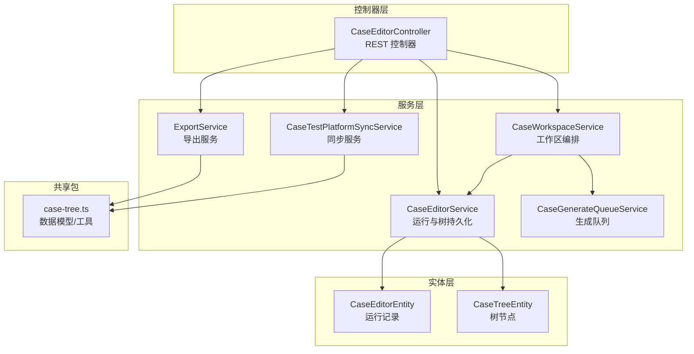
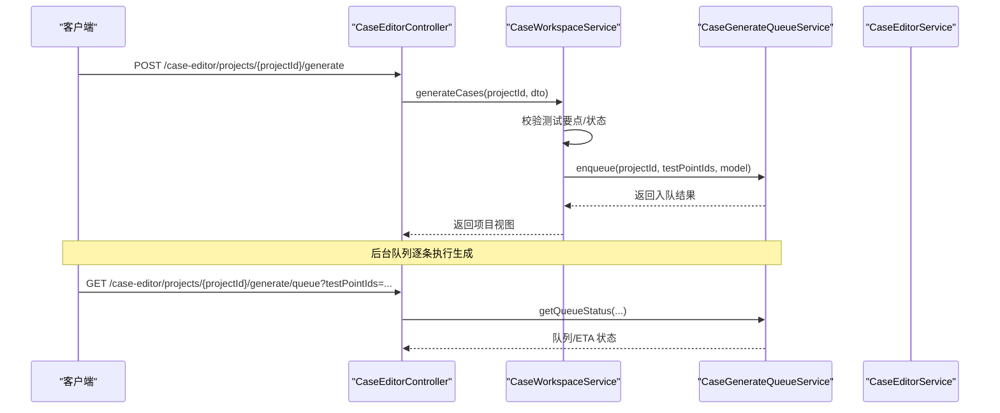
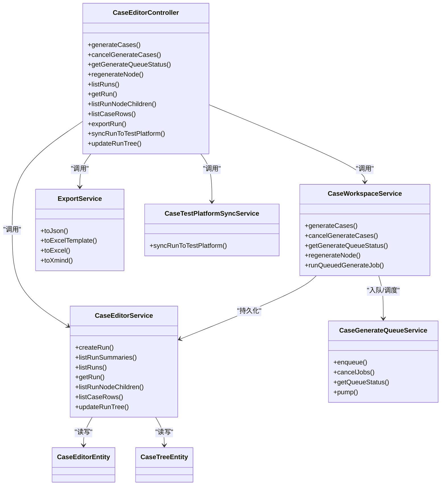

# 案例编辑器 API

<cite>
**本文引用的文件**
- [apps/api/src/modules/case-editor/controller/case-editor.controller.ts](file://apps/api/src/modules/case-editor/controller/case-editor.controller.ts)
- [apps/api/src/modules/case-editor/service/case-editor.service.ts](file://apps/api/src/modules/case-editor/service/case-editor.service.ts)
- [apps/api/src/modules/case-editor/service/case-workspace.service.ts](file://apps/api/src/modules/case-editor/service/case-workspace.service.ts)
- [apps/api/src/modules/case-editor/service/case-generate-queue.service.ts](file://apps/api/src/modules/case-editor/service/case-generate-queue.service.ts)
- [apps/api/src/modules/case-editor/service/export.service.ts](file://apps/api/src/modules/case-editor/service/export.service.ts)
- [apps/api/src/modules/case-editor/service/case-test-platform-sync.service.ts](file://apps/api/src/modules/case-editor/service/case-test-platform-sync.service.ts)
- [apps/api/src/modules/case-editor/dto/generate-cases.dto.ts](file://apps/api/src/modules/case-editor/dto/generate-cases.dto.ts)
- [apps/api/src/modules/case-editor/dto/regenerate-node.dto.ts](file://apps/api/src/modules/case-editor/dto/regenerate-node.dto.ts)
- [apps/api/src/modules/case-editor/dto/update-run-tree.dto.ts](file://apps/api/src/modules/case-editor/dto/update-run-tree.dto.ts)
- [apps/api/src/modules/case-editor/dto/sync-to-test-platform.dto.ts](file://apps/api/src/modules/case-editor/dto/sync-to-test-platform.dto.ts)
- [apps/api/src/modules/case-editor/dto/list-case-rows.dto.ts](file://apps/api/src/modules/case-editor/dto/list-case-rows.dto.ts)
- [apps/api/src/modules/case-editor/dto/cancel-generate.dto.ts](file://apps/api/src/modules/case-editor/dto/cancel-generate.dto.ts)
- [apps/api/src/modules/case-editor/entity/case-editor.entity.ts](file://apps/api/src/modules/case-editor/entity/case-editor.entity.ts)
- [apps/api/src/modules/case-editor/entity/case-tree.entity.ts](file://apps/api/src/modules/case-editor/entity/case-tree.entity.ts)
- [packages/shared/src/case-tree.ts](file://packages/shared/src/case-tree.ts)
</cite>

## 目录
1. [简介](#简介)
2. [项目结构](#项目结构)
3. [核心组件](#核心组件)
4. [架构总览](#架构总览)
5. [详细组件分析](#详细组件分析)
6. [依赖关系分析](#依赖关系分析)
7. [性能考量](#性能考量)
8. [故障排查指南](#故障排查指南)
9. [结论](#结论)
10. [附录](#附录)

## 简介
本文件为“案例编辑器”模块的完整 API 文档，覆盖案例树管理、节点操作、约束设置以及生成作业相关的所有 RESTful 接口。内容包括：
- 案例树的创建、查询、更新与懒加载子节点
- 案例生成工作流（单条/批量、队列、取消、进度查询）
- 局部重生成节点
- 案例 Excel 行分页查询
- 多格式导出（Excel、XMind）
- 同步至测管平台
- 请求参数、响应结构与错误码说明
- 实时同步与并发控制机制

## 项目结构
案例编辑器模块位于 apps/api/src/modules/case-editor，采用控制器-服务-实体分层设计，配合共享包 packages/shared 提供通用的数据模型与工具函数。

图表来源
- [apps/api/src/modules/case-editor/controller/case-editor.controller.ts:30-215](file://apps/api/src/modules/case-editor/controller/case-editor.controller.ts#L30-L215)
- [apps/api/src/modules/case-editor/service/case-workspace.service.ts:80-100](file://apps/api/src/modules/case-editor/service/case-workspace.service.ts#L80-L100)
- [apps/api/src/modules/case-editor/service/case-editor.service.ts:48-62](file://apps/api/src/modules/case-editor/service/case-editor.service.ts#L48-L62)
- [apps/api/src/modules/case-editor/service/case-generate-queue.service.ts:72-86](file://apps/api/src/modules/case-editor/service/case-generate-queue.service.ts#L72-L86)
- [apps/api/src/modules/case-editor/service/export.service.ts:24-25](file://apps/api/src/modules/case-editor/service/export.service.ts#L24-L25)
- [apps/api/src/modules/case-editor/service/case-test-platform-sync.service.ts:42-57](file://apps/api/src/modules/case-editor/service/case-test-platform-sync.service.ts#L42-L57)
- [apps/api/src/modules/case-editor/entity/case-editor.entity.ts:31-103](file://apps/api/src/modules/case-editor/entity/case-editor.entity.ts#L31-L103)
- [apps/api/src/modules/case-editor/entity/case-tree.entity.ts:26-92](file://apps/api/src/modules/case-editor/entity/case-tree.entity.ts#L26-L92)
- [packages/shared/src/case-tree.ts:345-463](file://packages/shared/src/case-tree.ts#L345-L463)

章节来源
- [apps/api/src/modules/case-editor/controller/case-editor.controller.ts:30-215](file://apps/api/src/modules/case-editor/controller/case-editor.controller.ts#L30-L215)
- [apps/api/src/modules/case-editor/service/case-workspace.service.ts:80-100](file://apps/api/src/modules/case-editor/service/case-workspace.service.ts#L80-L100)
- [apps/api/src/modules/case-editor/service/case-editor.service.ts:48-62](file://apps/api/src/modules/case-editor/service/case-editor.service.ts#L48-L62)
- [apps/api/src/modules/case-editor/service/case-generate-queue.service.ts:72-86](file://apps/api/src/modules/case-editor/service/case-generate-queue.service.ts#L72-L86)
- [apps/api/src/modules/case-editor/service/export.service.ts:24-25](file://apps/api/src/modules/case-editor/service/export.service.ts#L24-L25)
- [apps/api/src/modules/case-editor/service/case-test-platform-sync.service.ts:42-57](file://apps/api/src/modules/case-editor/service/case-test-platform-sync.service.ts#L42-L57)
- [apps/api/src/modules/case-editor/entity/case-editor.entity.ts:31-103](file://apps/api/src/modules/case-editor/entity/case-editor.entity.ts#L31-L103)
- [apps/api/src/modules/case-editor/entity/case-tree.entity.ts:26-92](file://apps/api/src/modules/case-editor/entity/case-tree.entity.ts#L26-L92)
- [packages/shared/src/case-tree.ts:345-463](file://packages/shared/src/case-tree.ts#L345-L463)

## 核心组件
- 案例编辑器控制器：暴露 REST 接口，路由前缀为 /case-editor
- 工作区服务：编排需求格式化、动态指令、案例生成与运行记录
- 运行与树持久化服务：负责运行记录创建/查询/更新，树的差异计算与落库
- 生成队列服务：维护生成任务队列、公平调度、并发控制与 ETA 计算
- 导出服务：支持 JSON、Excel、XMind 多格式导出
- 同步服务：将案例树同步至测管平台，构建用例与步骤数据
- 实体：运行记录与树节点的数据库映射

章节来源
- [apps/api/src/modules/case-editor/controller/case-editor.controller.ts:30-215](file://apps/api/src/modules/case-editor/controller/case-editor.controller.ts#L30-L215)
- [apps/api/src/modules/case-editor/service/case-workspace.service.ts:80-100](file://apps/api/src/modules/case-editor/service/case-workspace.service.ts#L80-L100)
- [apps/api/src/modules/case-editor/service/case-editor.service.ts:48-62](file://apps/api/src/modules/case-editor/service/case-editor.service.ts#L48-L62)
- [apps/api/src/modules/case-editor/service/case-generate-queue.service.ts:72-86](file://apps/api/src/modules/case-editor/service/case-generate-queue.service.ts#L72-L86)
- [apps/api/src/modules/case-editor/service/export.service.ts:24-25](file://apps/api/src/modules/case-editor/service/export.service.ts#L24-L25)
- [apps/api/src/modules/case-editor/service/case-test-platform-sync.service.ts:42-57](file://apps/api/src/modules/case-editor/service/case-test-platform-sync.service.ts#L42-L57)
- [apps/api/src/modules/case-editor/entity/case-editor.entity.ts:31-103](file://apps/api/src/modules/case-editor/entity/case-editor.entity.ts#L31-L103)
- [apps/api/src/modules/case-editor/entity/case-tree.entity.ts:26-92](file://apps/api/src/modules/case-editor/entity/case-tree.entity.ts#L26-L92)

## 架构总览
案例编辑器的典型工作流如下：

图表来源
- [apps/api/src/modules/case-editor/controller/case-editor.controller.ts:52-86](file://apps/api/src/modules/case-editor/controller/case-editor.controller.ts#L52-L86)
- [apps/api/src/modules/case-editor/service/case-workspace.service.ts:197-207](file://apps/api/src/modules/case-editor/service/case-workspace.service.ts#L197-L207)
- [apps/api/src/modules/case-editor/service/case-generate-queue.service.ts:231-313](file://apps/api/src/modules/case-editor/service/case-generate-queue.service.ts#L231-L313)

## 详细组件分析

### 案例树管理与运行记录
- 查询项目运行摘要（不含树）
  - 方法与路径：GET /case-editor/projects/{projectId}/runs
  - 响应：GenerationRunSummary[]
  - 用途：轻量接口，用于工作区快速展示
- 查询单次运行详情
  - 方法与路径：GET /case-editor/projects/{projectId}/runs/{runId}
  - 响应：GenerationRun（含完整案例树）
- 按需加载测试要点下的子树（XMind 懒加载）
  - 方法与路径：GET /case-editor/projects/{projectId}/runs/{runId}/nodes/{nodeId}/children
  - 响应：RunNodeChildrenResponse（仅 requirement 节点支持）
- 分页查询案例 Excel 行
  - 方法与路径：GET /case-editor/projects/{projectId}/runs/{runId}/case-rows
  - 查询参数：page、pageSize、requirement、priority、caseNature、keyword、focusCaseNodeId、idsOnly
  - 响应：CaseExcelRowListPage
- 保存编辑后的案例树
  - 方法与路径：PATCH /case-editor/projects/{projectId}/runs/{runId}/tree
  - 请求体：UpdateRunTreeDto（tree、mindMapExtras）
  - 响应：GenerationRun（仅元数据）

章节来源
- [apps/api/src/modules/case-editor/controller/case-editor.controller.ts:98-132](file://apps/api/src/modules/case-editor/controller/case-editor.controller.ts#L98-L132)
- [apps/api/src/modules/case-editor/controller/case-editor.controller.ts:199-213](file://apps/api/src/modules/case-editor/controller/case-editor.controller.ts#L199-L213)
- [apps/api/src/modules/case-editor/service/case-editor.service.ts:106-135](file://apps/api/src/modules/case-editor/service/case-editor.service.ts#L106-L135)
- [apps/api/src/modules/case-editor/service/case-editor.service.ts:137-147](file://apps/api/src/modules/case-editor/service/case-editor.service.ts#L137-L147)
- [apps/api/src/modules/case-editor/service/case-editor.service.ts:149-169](file://apps/api/src/modules/case-editor/service/case-editor.service.ts#L149-L169)
- [apps/api/src/modules/case-editor/service/case-editor.service.ts:171-215](file://apps/api/src/modules/case-editor/service/case-editor.service.ts#L171-L215)
- [apps/api/src/modules/case-editor/service/case-editor.service.ts:217-248](file://apps/api/src/modules/case-editor/service/case-editor.service.ts#L217-L248)
- [apps/api/src/modules/case-editor/dto/update-run-tree.dto.ts:8-18](file://apps/api/src/modules/case-editor/dto/update-run-tree.dto.ts#L8-L18)
- [apps/api/src/modules/case-editor/dto/list-case-rows.dto.ts:9-55](file://apps/api/src/modules/case-editor/dto/list-case-rows.dto.ts#L9-L55)

### 案例生成工作流
- 触发案例生成
  - 方法与路径：POST /case-editor/projects/{projectId}/generate
  - 请求体：GenerateCasesDto（model、testPointIds）
  - 行为：
    - testPointIds 长度为 1：同步生成，阻塞至完成，返回含新案例树的工作区视图
    - testPointIds 长度 > 1：立即返回，后台逐条生成
- 取消生成
  - 方法与路径：POST /case-editor/projects/{projectId}/generate/cancel
  - 请求体：CancelGenerateDto（testPointIds）
  - 行为：仅前端“停止”按钮触发，刷新不会取消；回退状态并清理并发槽
- 查询生成队列进度与 ETA
  - 方法与路径：GET /case-editor/projects/{projectId}/generate/queue?testPointIds=...
  - 响应：CaseGenerateQueueStatusResponse（含平均耗时、并发、等待人数、每个任务的 ETA 等）
- 局部重生成节点
  - 方法与路径：POST /case-editor/projects/{projectId}/regenerate-node
  - 请求体：RegenerateNodeDto（runId、nodeId、instruction、mode）
  - mode：append（追加）、replace（替换）、complete（仅补全空子节点）

章节来源
- [apps/api/src/modules/case-editor/controller/case-editor.controller.ts:52-69](file://apps/api/src/modules/case-editor/controller/case-editor.controller.ts#L52-L69)
- [apps/api/src/modules/case-editor/controller/case-editor.controller.ts:71-86](file://apps/api/src/modules/case-editor/controller/case-editor.controller.ts#L71-L86)
- [apps/api/src/modules/case-editor/controller/case-editor.controller.ts:88-96](file://apps/api/src/modules/case-editor/controller/case-editor.controller.ts#L88-L96)
- [apps/api/src/modules/case-editor/dto/generate-cases.dto.ts:10-23](file://apps/api/src/modules/case-editor/dto/generate-cases.dto.ts#L10-L23)
- [apps/api/src/modules/case-editor/dto/cancel-generate.dto.ts:5-11](file://apps/api/src/modules/case-editor/dto/cancel-generate.dto.ts#L5-L11)
- [apps/api/src/modules/case-editor/dto/regenerate-node.dto.ts:8-30](file://apps/api/src/modules/case-editor/dto/regenerate-node.dto.ts#L8-L30)
- [apps/api/src/modules/case-editor/service/case-workspace.service.ts:197-207](file://apps/api/src/modules/case-editor/service/case-workspace.service.ts#L197-L207)
- [apps/api/src/modules/case-editor/service/case-workspace.service.ts:235-277](file://apps/api/src/modules/case-editor/service/case-workspace.service.ts#L235-L277)
- [apps/api/src/modules/case-editor/service/case-generate-queue.service.ts:231-313](file://apps/api/src/modules/case-editor/service/case-generate-queue.service.ts#L231-L313)

### 案例导出
- 导出案例树
  - 方法与路径：GET /case-editor/projects/{projectId}/runs/{runId}/export?format={excel|xmind}&template={0|1}&caseNodeIds=...
  - 响应：二进制文件（.xlsx 或 .xmind）
  - 行为：
    - format=xmind：输出 XMind 工作簿
    - format=excel：下载 Excel；template=true/false 控制是否下载空白模板
    - caseNodeIds 可选过滤导出范围

章节来源
- [apps/api/src/modules/case-editor/controller/case-editor.controller.ts:134-181](file://apps/api/src/modules/case-editor/controller/case-editor.controller.ts#L134-L181)
- [apps/api/src/modules/case-editor/service/export.service.ts:26-44](file://apps/api/src/modules/case-editor/service/export.service.ts#L26-L44)
- [apps/api/src/modules/case-editor/service/export.service.ts:46-120](file://apps/api/src/modules/case-editor/service/export.service.ts#L46-L120)

### 同步至测管平台
- 同步案例树
  - 方法与路径：POST /case-editor/projects/{projectId}/runs/{runId}/sync-test-platform
  - 请求体：SyncToTestPlatformDto（tree、caseNodeIds）
  - 响应：SyncToTestPlatformResult（包含插入/更新/跳过/总数与目标项目编码）
  - 约束：
    - 项目必须有有效的测管需求编号（XQXXXX-XXXX-XX）
    - 至少选择一个案例节点
    - 所选节点必须存在于当前案例树

章节来源
- [apps/api/src/modules/case-editor/controller/case-editor.controller.ts:183-197](file://apps/api/src/modules/case-editor/controller/case-editor.controller.ts#L183-L197)
- [apps/api/src/modules/case-editor/dto/sync-to-test-platform.dto.ts:6-15](file://apps/api/src/modules/case-editor/dto/sync-to-test-platform.dto.ts#L6-L15)
- [apps/api/src/modules/case-editor/service/case-test-platform-sync.service.ts:59-177](file://apps/api/src/modules/case-editor/service/case-test-platform-sync.service.ts#L59-L177)

### 数据模型与工具
- 案例树节点与 Excel 行模型
  - CaseTreeNode、CaseExcelRow、CaseExcelRowListPage 等
  - 提供扁平化、筛选、分页、合并单元格等工具函数
- 案例树持久化与差异计算
  - 运行记录与树节点实体映射
  - 差异计划构建、批量插入/更新/删除

章节来源
- [packages/shared/src/case-tree.ts:345-463](file://packages/shared/src/case-tree.ts#L345-L463)
- [packages/shared/src/case-tree.ts:475-582](file://packages/shared/src/case-tree.ts#L475-L582)
- [apps/api/src/modules/case-editor/entity/case-editor.entity.ts:31-103](file://apps/api/src/modules/case-editor/entity/case-editor.entity.ts#L31-L103)
- [apps/api/src/modules/case-editor/entity/case-tree.entity.ts:26-92](file://apps/api/src/modules/case-editor/entity/case-tree.entity.ts#L26-L92)
- [apps/api/src/modules/case-editor/service/case-editor.service.ts:250-281](file://apps/api/src/modules/case-editor/service/case-editor.service.ts#L250-L281)

## 依赖关系分析

图表来源
- [apps/api/src/modules/case-editor/controller/case-editor.controller.ts:30-215](file://apps/api/src/modules/case-editor/controller/case-editor.controller.ts#L30-L215)
- [apps/api/src/modules/case-editor/service/case-workspace.service.ts:80-100](file://apps/api/src/modules/case-editor/service/case-workspace.service.ts#L80-L100)
- [apps/api/src/modules/case-editor/service/case-editor.service.ts:48-62](file://apps/api/src/modules/case-editor/service/case-editor.service.ts#L48-L62)
- [apps/api/src/modules/case-editor/service/case-generate-queue.service.ts:72-86](file://apps/api/src/modules/case-editor/service/case-generate-queue.service.ts#L72-L86)
- [apps/api/src/modules/case-editor/service/export.service.ts:24-25](file://apps/api/src/modules/case-editor/service/export.service.ts#L24-L25)
- [apps/api/src/modules/case-editor/service/case-test-platform-sync.service.ts:42-57](file://apps/api/src/modules/case-editor/service/case-test-platform-sync.service.ts#L42-L57)

## 性能考量
- 树持久化批处理：批量插入/更新/删除采用分块策略，降低事务压力
- 懒加载子树：XMind 按需加载 requirement 子节点，减少网络与渲染开销
- 分页查询：Excel 行分页与筛选在内存摊平后进行，注意大数据量时的内存占用
- 并发与公平调度：生成队列限制全局并发与每用户最大运行数，提供公平等待时间估算
- 导出优化：XMind 输出采用 ZIP 压缩与最小必要文件集

章节来源
- [apps/api/src/modules/case-editor/service/case-editor.service.ts:283-335](file://apps/api/src/modules/case-editor/service/case-editor.service.ts#L283-L335)
- [apps/api/src/modules/case-editor/service/case-editor.service.ts:149-169](file://apps/api/src/modules/case-editor/service/case-editor.service.ts#L149-L169)
- [apps/api/src/modules/case-editor/service/case-editor.service.ts:171-215](file://apps/api/src/modules/case-editor/service/case-editor.service.ts#L171-L215)
- [apps/api/src/modules/case-editor/service/case-generate-queue.service.ts:340-357](file://apps/api/src/modules/case-editor/service/case-generate-queue.service.ts#L340-L357)
- [apps/api/src/modules/case-editor/service/export.service.ts:46-120](file://apps/api/src/modules/case-editor/service/export.service.ts#L46-L120)

## 故障排查指南
- 常见错误码与场景
  - 400 Bad Request
    - 请求参数缺失或非法：如未指定测试要点、格式参数不合法、项目缺少测管需求编号
    - Excel 导出时未选择案例节点或节点不存在
  - 404 Not Found
    - 运行记录或节点不存在
  - 500 Internal Server Error
    - 生成过程中异常、队列中断恢复失败
- 定位建议
  - 查看队列状态接口返回的 estimatedWaitSeconds、estimatedRemainingSeconds 与 globalQueuedCount
  - 检查取消生成后状态回退是否正确（“生成完成”→“再编辑”，其余→“已编辑”）
  - 核对同步目标项目是否存在且状态有效

章节来源
- [apps/api/src/modules/case-editor/controller/case-editor.controller.ts:180-181](file://apps/api/src/modules/case-editor/controller/case-editor.controller.ts#L180-L181)
- [apps/api/src/modules/case-editor/service/case-test-platform-sync.service.ts:67-71](file://apps/api/src/modules/case-editor/service/case-test-platform-sync.service.ts#L67-L71)
- [apps/api/src/modules/case-editor/service/case-test-platform-sync.service.ts:94-111](file://apps/api/src/modules/case-editor/service/case-test-platform-sync.service.ts#L94-L111)
- [apps/api/src/modules/case-editor/service/case-workspace.service.ts:702-710](file://apps/api/src/modules/case-editor/service/case-workspace.service.ts#L702-L710)
- [apps/api/src/modules/case-editor/service/case-generate-queue.service.ts:117-160](file://apps/api/src/modules/case-editor/service/case-generate-queue.service.ts#L117-L160)

## 结论
案例编辑器 API 提供了从需求格式化、动态指令、AI 生成、树编辑、导出到同步测管平台的完整闭环。通过队列与并发控制保障生成稳定性，通过懒加载与分页提升交互性能，通过多格式导出与同步能力对接下游平台。

## 附录

### API 定义总览
- 生成与队列
  - POST /case-editor/projects/{projectId}/generate
  - POST /case-editor/projects/{projectId}/generate/cancel
  - GET /case-editor/projects/{projectId}/generate/queue
- 案例树与运行
  - GET /case-editor/projects/{projectId}/runs
  - GET /case-editor/projects/{projectId}/runs/{runId}
  - GET /case-editor/projects/{projectId}/runs/{runId}/nodes/{nodeId}/children
  - PATCH /case-editor/projects/{projectId}/runs/{runId}/tree
- 案例行与导出
  - GET /case-editor/projects/{projectId}/runs/{runId}/case-rows
  - GET /case-editor/projects/{projectId}/runs/{runId}/export
- 同步至测管平台
  - POST /case-editor/projects/{projectId}/runs/{runId}/sync-test-platform

章节来源
- [apps/api/src/modules/case-editor/controller/case-editor.controller.ts:52-213](file://apps/api/src/modules/case-editor/controller/case-editor.controller.ts#L52-L213)

### 请求参数与响应结构速览
- GenerateCasesDto
  - model?: string
  - testPointIds?: string[]
- CancelGenerateDto
  - testPointIds: string[]
- RegenerateNodeDto
  - runId: string
  - nodeId: string
  - instruction: string
  - mode: "append" | "replace" | "complete"
- UpdateRunTreeDto
  - tree: CaseTreeNode
  - mindMapExtras?: MindMapExtras
- ListCaseRowsDto
  - page?: number
  - pageSize?: number
  - requirement?: string
  - priority?: "高"|"中"|"低"
  - caseNature?: "正"|"反"
  - keyword?: string
  - focusCaseNodeId?: string
  - idsOnly?: boolean
- SyncToTestPlatformDto
  - tree: CaseTreeNode
  - caseNodeIds: string[]

章节来源
- [apps/api/src/modules/case-editor/dto/generate-cases.dto.ts:10-23](file://apps/api/src/modules/case-editor/dto/generate-cases.dto.ts#L10-L23)
- [apps/api/src/modules/case-editor/dto/cancel-generate.dto.ts:5-11](file://apps/api/src/modules/case-editor/dto/cancel-generate.dto.ts#L5-L11)
- [apps/api/src/modules/case-editor/dto/regenerate-node.dto.ts:8-30](file://apps/api/src/modules/case-editor/dto/regenerate-node.dto.ts#L8-L30)
- [apps/api/src/modules/case-editor/dto/update-run-tree.dto.ts:8-18](file://apps/api/src/modules/case-editor/dto/update-run-tree.dto.ts#L8-L18)
- [apps/api/src/modules/case-editor/dto/list-case-rows.dto.ts:9-55](file://apps/api/src/modules/case-editor/dto/list-case-rows.dto.ts#L9-L55)
- [apps/api/src/modules/case-editor/dto/sync-to-test-platform.dto.ts:6-15](file://apps/api/src/modules/case-editor/dto/sync-to-test-platform.dto.ts#L6-L15)