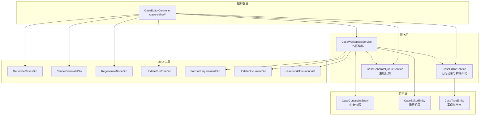
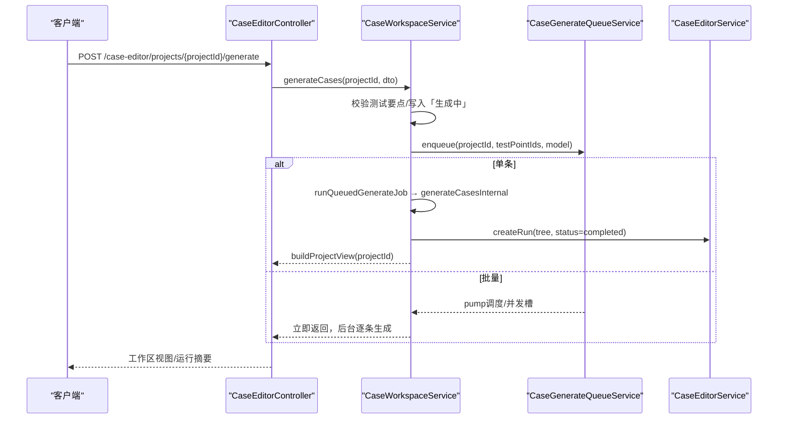
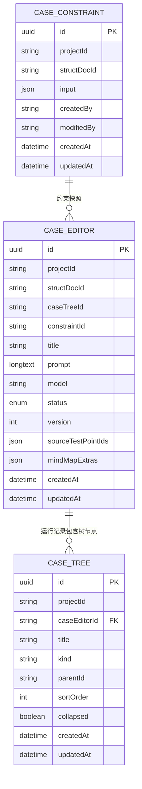
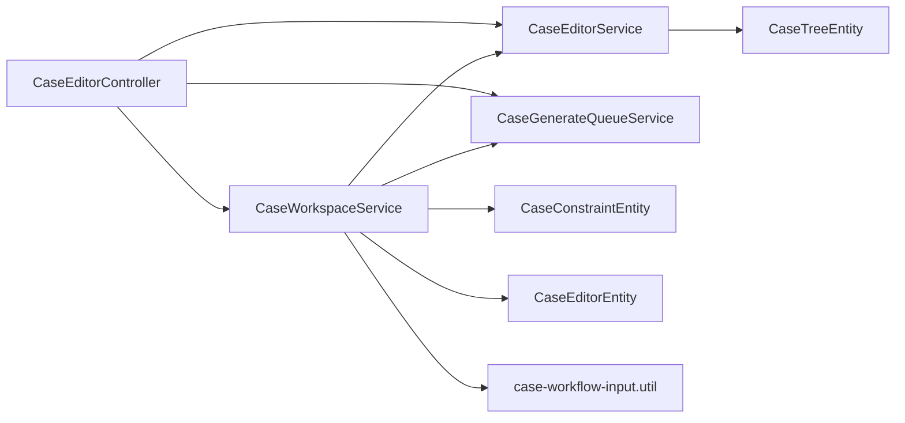

# 约束与工作区 API

<cite>
**本文引用的文件**
- [apps/api/src/modules/case-editor/controller/case-editor.controller.ts](file://apps/api/src/modules/case-editor/controller/case-editor.controller.ts)
- [apps/api/src/modules/case-editor/service/case-workspace.service.ts](file://apps/api/src/modules/case-editor/service/case-workspace.service.ts)
- [apps/api/src/modules/case-editor/service/case-editor.service.ts](file://apps/api/src/modules/case-editor/service/case-editor.service.ts)
- [apps/api/src/modules/case-editor/service/case-generate-queue.service.ts](file://apps/api/src/modules/case-editor/service/case-generate-queue.service.ts)
- [apps/api/src/modules/case-editor/entity/case-constraint.entity.ts](file://apps/api/src/modules/case-editor/entity/case-constraint.entity.ts)
- [apps/api/src/modules/case-editor/entity/case-editor.entity.ts](file://apps/api/src/modules/case-editor/entity/case-editor.entity.ts)
- [apps/api/src/modules/case-editor/entity/case-tree.entity.ts](file://apps/api/src/modules/case-editor/entity/case-tree.entity.ts)
- [apps/api/src/modules/case-editor/dto/generate-cases.dto.ts](file://apps/api/src/modules/case-editor/dto/generate-cases.dto.ts)
- [apps/api/src/modules/case-editor/dto/cancel-generate.dto.ts](file://apps/api/src/modules/case-editor/dto/cancel-generate.dto.ts)
- [apps/api/src/modules/case-editor/dto/regenerate-node.dto.ts](file://apps/api/src/modules/case-editor/dto/regenerate-node.dto.ts)
- [apps/api/src/modules/case-editor/dto/update-run-tree.dto.ts](file://apps/api/src/modules/case-editor/dto/update-run-tree.dto.ts)
- [apps/api/src/modules/case-editor/dto/format-requirement.dto.ts](file://apps/api/src/modules/case-editor/dto/format-requirement.dto.ts)
- [apps/api/src/modules/case-editor/dto/update-document.dto.ts](file://apps/api/src/modules/case-editor/dto/update-document.dto.ts)
- [apps/api/src/modules/case-editor/util/case-workflow-input.util.ts](file://apps/api/src/modules/case-editor/util/case-workflow-input.util.ts)
</cite>

## 目录
1. [简介](#简介)
2. [项目结构](#项目结构)
3. [核心组件](#核心组件)
4. [架构总览](#架构总览)
5. [详细组件分析](#详细组件分析)
6. [依赖关系分析](#依赖关系分析)
7. [性能考量](#性能考量)
8. [故障排查指南](#故障排查指南)
9. [结论](#结论)
10. [附录](#附录)

## 简介
本文件面向“约束设置与工作区管理”的 API 文档，聚焦以下能力：
- 案例约束条件的创建、更新与删除（通过约束快照实体与相关工作流）
- 工作区配置与文档格式化（需求解析、结构化文档维护）
- 案例生成流水线（同步/异步）、队列与取消机制
- 案例树的保存、按需加载与导出（Excel/XMind）

目标是帮助开发者与测试工程师快速理解端点、数据模型、控制流与最佳实践。

## 项目结构
围绕“案例编辑器”模块，关键目录与职责如下：
- 控制器层：集中暴露 REST 接口，路由前缀为 /case-editor
- 服务层：
  - 工作区编排：负责需求格式化、约束与动态指令整合、生成队列与执行
  - 运行记录持久化：负责案例树的创建、更新、懒加载与导出
  - 生成队列：负责排队、调度、公平分配与 ETA 统计
- 实体层：约束快照、运行记录、案例树节点等
- DTO 层：输入校验与 Swagger 描述
- 工具层：工作流输入拼装、测试要点映射等

图表来源
- [apps/api/src/modules/case-editor/controller/case-editor.controller.ts:30-215](file://apps/api/src/modules/case-editor/controller/case-editor.controller.ts#L30-L215)
- [apps/api/src/modules/case-editor/service/case-workspace.service.ts:80-100](file://apps/api/src/modules/case-editor/service/case-workspace.service.ts#L80-L100)
- [apps/api/src/modules/case-editor/service/case-editor.service.ts:53-67](file://apps/api/src/modules/case-editor/service/case-editor.service.ts#L53-L67)
- [apps/api/src/modules/case-editor/service/case-generate-queue.service.ts:72-87](file://apps/api/src/modules/case-editor/service/case-generate-queue.service.ts#L72-L87)
- [apps/api/src/modules/case-editor/entity/case-constraint.entity.ts:14-48](file://apps/api/src/modules/case-editor/entity/case-constraint.entity.ts#L14-L48)
- [apps/api/src/modules/case-editor/entity/case-editor.entity.ts:31-103](file://apps/api/src/modules/case-editor/entity/case-editor.entity.ts#L31-L103)
- [apps/api/src/modules/case-editor/entity/case-tree.entity.ts:26-92](file://apps/api/src/modules/case-editor/entity/case-tree.entity.ts#L26-L92)
- [apps/api/src/modules/case-editor/util/case-workflow-input.util.ts:104-152](file://apps/api/src/modules/case-editor/util/case-workflow-input.util.ts#L104-L152)

章节来源
- [apps/api/src/modules/case-editor/controller/case-editor.controller.ts:30-215](file://apps/api/src/modules/case-editor/controller/case-editor.controller.ts#L30-L215)
- [apps/api/src/modules/case-editor/service/case-workspace.service.ts:80-100](file://apps/api/src/modules/case-editor/service/case-workspace.service.ts#L80-L100)

## 核心组件
- 案例工作区编排服务（CaseWorkspaceService）
  - 职责：需求格式化、约束与动态指令整合、生成队列、批量/单条生成、取消生成、局部重生成节点
  - 关键方法：generateCases、cancelGenerateCases、regenerateNode、getGenerateQueueStatus
- 案例编辑运行持久化服务（CaseEditorService）
  - 职责：运行记录创建/查询/更新、案例树懒加载、Excel 行分页查询、树差异应用与批量落库
  - 关键方法：createRun、listRuns、getRun、listRunNodeChildren、listCaseRows、updateRunTree
- 生成队列服务（CaseGenerateQueueService）
  - 职责：任务入队、公平调度、ETA 估算、中断恢复、取消作业
  - 关键方法：enqueue、getQueueStatus、pump、runJob
- 实体与 DTO
  - 约束快照：CaseConstraintEntity
  - 运行记录：CaseEditorEntity
  - 案例树节点：CaseTreeEntity
  - 输入 DTO：GenerateCasesDto、CancelGenerateDto、RegenerateNodeDto、UpdateRunTreeDto、FormatRequirementDto、UpdateDocumentDto
  - 工具：case-workflow-input.util（工作流输入拼装）

章节来源
- [apps/api/src/modules/case-editor/service/case-workspace.service.ts:197-277](file://apps/api/src/modules/case-editor/service/case-workspace.service.ts#L197-L277)
- [apps/api/src/modules/case-editor/service/case-editor.service.ts:68-151](file://apps/api/src/modules/case-editor/service/case-editor.service.ts#L68-L151)
- [apps/api/src/modules/case-editor/service/case-generate-queue.service.ts:162-313](file://apps/api/src/modules/case-editor/service/case-generate-queue.service.ts#L162-L313)
- [apps/api/src/modules/case-editor/entity/case-constraint.entity.ts:14-48](file://apps/api/src/modules/case-editor/entity/case-constraint.entity.ts#L14-L48)
- [apps/api/src/modules/case-editor/entity/case-editor.entity.ts:31-103](file://apps/api/src/modules/case-editor/entity/case-editor.entity.ts#L31-L103)
- [apps/api/src/modules/case-editor/entity/case-tree.entity.ts:26-92](file://apps/api/src/modules/case-editor/entity/case-tree.entity.ts#L26-L92)
- [apps/api/src/modules/case-editor/dto/generate-cases.dto.ts:10-24](file://apps/api/src/modules/case-editor/dto/generate-cases.dto.ts#L10-L24)
- [apps/api/src/modules/case-editor/dto/cancel-generate.dto.ts:5-11](file://apps/api/src/modules/case-editor/dto/cancel-generate.dto.ts#L5-L11)
- [apps/api/src/modules/case-editor/dto/regenerate-node.dto.ts:8-31](file://apps/api/src/modules/case-editor/dto/regenerate-node.dto.ts#L8-L31)
- [apps/api/src/modules/case-editor/dto/update-run-tree.dto.ts:9-19](file://apps/api/src/modules/case-editor/dto/update-run-tree.dto.ts#L9-L19)
- [apps/api/src/modules/case-editor/dto/format-requirement.dto.ts:8-19](file://apps/api/src/modules/case-editor/dto/format-requirement.dto.ts#L8-L19)
- [apps/api/src/modules/case-editor/dto/update-document.dto.ts:8-19](file://apps/api/src/modules/case-editor/dto/update-document.dto.ts#L8-L19)
- [apps/api/src/modules/case-editor/util/case-workflow-input.util.ts:104-152](file://apps/api/src/modules/case-editor/util/case-workflow-input.util.ts#L104-L152)

## 架构总览
整体流程：控制器接收请求 → 工作区服务编排 → 队列调度/生成 → 运行记录持久化 → 返回工作区视图或运行详情。

图表来源
- [apps/api/src/modules/case-editor/controller/case-editor.controller.ts:52-59](file://apps/api/src/modules/case-editor/controller/case-editor.controller.ts#L52-L59)
- [apps/api/src/modules/case-editor/service/case-workspace.service.ts:197-207](file://apps/api/src/modules/case-editor/service/case-workspace.service.ts#L197-L207)
- [apps/api/src/modules/case-editor/service/case-generate-queue.service.ts:340-357](file://apps/api/src/modules/case-editor/service/case-generate-queue.service.ts#L340-L357)

## 详细组件分析

### 约束快照与工作区配置
- 约束快照实体（CaseConstraintEntity）
  - 字段：projectId、structDocId、input（JSON）、createdBy/modifiedBy、createdAt/updatedAt
  - 用途：持久化约束输入参数（场景标签、分组策略、功能点指令等），作为生成上下文的一部分
- 工作区配置与文档格式化
  - 格式化原始需求：POST /case-editor/projects/{projectId}/format-requirement
    - 请求体：rawText、fileName（可选）
    - 行为：调用管道格式化为结构化需求，保存结构化文档，同步测试要点，更新项目标题/编号
  - 更新结构化文档：PATCH /case-editor/projects/{projectId}/structured-doc
    - 请求体：structuredMarkdown、rawText（可选）
    - 行为：重建分析、保存文档、同步测试要点、更新项目信息

章节来源
- [apps/api/src/modules/case-editor/entity/case-constraint.entity.ts:14-48](file://apps/api/src/modules/case-editor/entity/case-constraint.entity.ts#L14-L48)
- [apps/api/src/modules/case-editor/service/case-workspace.service.ts:102-129](file://apps/api/src/modules/case-editor/service/case-workspace.service.ts#L102-L129)
- [apps/api/src/modules/case-editor/service/case-workspace.service.ts:153-186](file://apps/api/src/modules/case-editor/service/case-workspace.service.ts#L153-L186)
- [apps/api/src/modules/case-editor/dto/format-requirement.dto.ts:8-19](file://apps/api/src/modules/case-editor/dto/format-requirement.dto.ts#L8-L19)
- [apps/api/src/modules/case-editor/dto/update-document.dto.ts:8-19](file://apps/api/src/modules/case-editor/dto/update-document.dto.ts#L8-L19)

### 案例生成与工作区管理
- 生成案例树
  - POST /case-editor/projects/{projectId}/generate
  - 请求体：model（可选）、testPointIds（数组）
  - 行为：
    - 单条：同步执行，写入「生成中」，完成后创建运行记录并返回工作区视图
    - 多条：立即返回，后台逐条排队生成
- 取消生成
  - POST /case-editor/projects/{projectId}/generate/cancel
  - 请求体：testPointIds[]
  - 行为：标记取消、回退状态、清理并发槽、取消队列任务
- 查询生成队列进度
  - GET /case-editor/projects/{projectId}/generate/queue?testPointIds=a,b,c
  - 行为：返回平均耗时、并发、排队/运行人数、ETA 等统计
- 局部重生成节点
  - POST /case-editor/projects/{projectId}/regenerate-node
  - 请求体：runId、nodeId、instruction、mode（append/replace/complete）
  - 行为：按指令扩展节点子树，保存并返回更新后的运行记录

章节来源
- [apps/api/src/modules/case-editor/controller/case-editor.controller.ts:52-86](file://apps/api/src/modules/case-editor/controller/case-editor.controller.ts#L52-L86)
- [apps/api/src/modules/case-editor/controller/case-editor.controller.ts:88-96](file://apps/api/src/modules/case-editor/controller/case-editor.controller.ts#L88-L96)
- [apps/api/src/modules/case-editor/controller/case-editor.controller.ts:71-86](file://apps/api/src/modules/case-editor/controller/case-editor.controller.ts#L71-L86)
- [apps/api/src/modules/case-editor/controller/case-editor.controller.ts:88-96](file://apps/api/src/modules/case-editor/controller/case-editor.controller.ts#L88-L96)
- [apps/api/src/modules/case-editor/dto/generate-cases.dto.ts:10-24](file://apps/api/src/modules/case-editor/dto/generate-cases.dto.ts#L10-L24)
- [apps/api/src/modules/case-editor/dto/cancel-generate.dto.ts:5-11](file://apps/api/src/modules/case-editor/dto/cancel-generate.dto.ts#L5-L11)
- [apps/api/src/modules/case-editor/dto/regenerate-node.dto.ts:8-31](file://apps/api/src/modules/case-editor/dto/regenerate-node.dto.ts#L8-L31)
- [apps/api/src/modules/case-editor/service/case-workspace.service.ts:197-207](file://apps/api/src/modules/case-editor/service/case-workspace.service.ts#L197-L207)
- [apps/api/src/modules/case-editor/service/case-workspace.service.ts:235-277](file://apps/api/src/modules/case-editor/service/case-workspace.service.ts#L235-L277)
- [apps/api/src/modules/case-editor/service/case-workspace.service.ts:456-478](file://apps/api/src/modules/case-editor/service/case-workspace.service.ts#L456-L478)
- [apps/api/src/modules/case-editor/service/case-generate-queue.service.ts:231-313](file://apps/api/src/modules/case-editor/service/case-generate-queue.service.ts#L231-L313)

### 运行记录与案例树管理
- 查询运行摘要
  - GET /case-editor/projects/{projectId}/runs
  - 返回：运行 ID、标题、创建时间（不含案例树）
- 查询单个运行
  - GET /case-editor/projects/{projectId}/runs/{runId}
  - 返回：完整运行与案例树
- 按需加载测试要点子树（XMind 懒加载）
  - GET /case-editor/projects/{projectId}/runs/{runId}/nodes/{nodeId}/children
  - 限制：仅 requirement 节点支持
- 分页查询案例 Excel 行
  - GET /case-editor/projects/{projectId}/runs/{runId}/case-rows
  - 查询参数：requirement、priority、caseNature、keyword、page、pageSize、idsOnly、focusCaseNodeId
- 保存案例树
  - PATCH /case-editor/projects/{projectId}/runs/{runId}/tree
  - 请求体：tree、mindMapExtras（可选）
  - 行为：计算差异、批量插入/更新/删除、递增版本号
- 导出案例树
  - GET /case-editor/projects/{projectId}/runs/{runId}/export?format=excel|xmind&template=1|true&caseNodeIds=a,b,c
  - 行为：Excel 模板或数据；XMind 文件下载

章节来源
- [apps/api/src/modules/case-editor/controller/case-editor.controller.ts:98-132](file://apps/api/src/modules/case-editor/controller/case-editor.controller.ts#L98-L132)
- [apps/api/src/modules/case-editor/controller/case-editor.controller.ts:134-181](file://apps/api/src/modules/case-editor/controller/case-editor.controller.ts#L134-L181)
- [apps/api/src/modules/case-editor/controller/case-editor.controller.ts:199-213](file://apps/api/src/modules/case-editor/controller/case-editor.controller.ts#L199-L213)
- [apps/api/src/modules/case-editor/service/case-editor.service.ts:110-139](file://apps/api/src/modules/case-editor/service/case-editor.service.ts#L110-L139)
- [apps/api/src/modules/case-editor/service/case-editor.service.ts:141-151](file://apps/api/src/modules/case-editor/service/case-editor.service.ts#L141-L151)
- [apps/api/src/modules/case-editor/service/case-editor.service.ts:153-173](file://apps/api/src/modules/case-editor/service/case-editor.service.ts#L153-L173)
- [apps/api/src/modules/case-editor/service/case-editor.service.ts:175-219](file://apps/api/src/modules/case-editor/service/case-editor.service.ts#L175-L219)
- [apps/api/src/modules/case-editor/service/case-editor.service.ts:221-252](file://apps/api/src/modules/case-editor/service/case-editor.service.ts#L221-L252)
- [apps/api/src/modules/case-editor/dto/update-run-tree.dto.ts:9-19](file://apps/api/src/modules/case-editor/dto/update-run-tree.dto.ts#L9-L19)

### 数据模型与关系

图表来源
- [apps/api/src/modules/case-editor/entity/case-constraint.entity.ts:14-48](file://apps/api/src/modules/case-editor/entity/case-constraint.entity.ts#L14-L48)
- [apps/api/src/modules/case-editor/entity/case-editor.entity.ts:31-103](file://apps/api/src/modules/case-editor/entity/case-editor.entity.ts#L31-L103)
- [apps/api/src/modules/case-editor/entity/case-tree.entity.ts:26-92](file://apps/api/src/modules/case-editor/entity/case-tree.entity.ts#L26-L92)

## 依赖关系分析
- 控制器依赖工作区服务与运行记录服务，生成导出等功能通过队列与管道衔接
- 工作区服务依赖：结构化文档服务、动态指令/提示词实体、生成队列服务、运行记录服务
- 运行记录服务依赖：案例树实体、节点元数据实体、TypeORM 批量差异算法
- 生成队列服务依赖：公平调度工具、并发槽注册、中断消息构建

图表来源
- [apps/api/src/modules/case-editor/controller/case-editor.controller.ts:30-44](file://apps/api/src/modules/case-editor/controller/case-editor.controller.ts#L30-L44)
- [apps/api/src/modules/case-editor/service/case-workspace.service.ts:80-100](file://apps/api/src/modules/case-editor/service/case-workspace.service.ts#L80-L100)
- [apps/api/src/modules/case-editor/service/case-editor.service.ts:53-67](file://apps/api/src/modules/case-editor/service/case-editor.service.ts#L53-L67)
- [apps/api/src/modules/case-editor/service/case-generate-queue.service.ts:72-87](file://apps/api/src/modules/case-editor/service/case-generate-queue.service.ts#L72-L87)
- [apps/api/src/modules/case-editor/util/case-workflow-input.util.ts:104-152](file://apps/api/src/modules/case-editor/util/case-workflow-input.util.ts#L104-L152)

## 性能考量
- 案例树持久化采用差异计算与分批插入/更新，避免全量替换
- 生成队列支持公平调度与并发上限，结合 ETA 估算提升用户体验
- Excel 导出基于内存摊平后的行集，配合分页与筛选，降低前端压力
- XMind 导出直接输出二进制流，减少中间对象序列化开销

## 故障排查指南
- 生成失败
  - 现象：状态变为“生成失败”，错误信息写入 instruct 表
  - 排查：查看队列状态与任务日志，确认模型配置、并发槽是否释放
- 取消生成无效
  - 现象：点击“停止”后状态未回退
  - 排查：确认取消接口被调用、内存槽是否注册、任务是否仍在运行
- 队列卡住
  - 现象：排队/运行数异常
  - 排查：检查中断恢复逻辑、服务重启后补建队列的任务、用户配额

章节来源
- [apps/api/src/modules/case-editor/service/case-workspace.service.ts:428-449](file://apps/api/src/modules/case-editor/service/case-workspace.service.ts#L428-L449)
- [apps/api/src/modules/case-editor/service/case-generate-queue.service.ts:97-160](file://apps/api/src/modules/case-editor/service/case-generate-queue.service.ts#L97-L160)
- [apps/api/src/modules/case-editor/service/case-generate-queue.service.ts:477-522](file://apps/api/src/modules/case-editor/service/case-generate-queue.service.ts#L477-L522)

## 结论
本 API 体系以“工作区”为核心，串联“需求格式化—约束与动态指令—案例生成—运行记录—导出”的完整链路。通过队列与并发控制保障大规模生成的稳定性，通过差异持久化与懒加载优化性能。建议在生产环境中：
- 明确约束与动态指令的配置规范，确保生成质量
- 合理设置并发与用户配额，平衡吞吐与公平性
- 对大案例树导出优先选择 Excel 模板或分批导出
- 使用取消接口及时止损，避免资源浪费

## 附录

### API 定义与示例路径
- 格式化需求
  - POST /case-editor/projects/{projectId}/format-requirement
  - 请求体字段：rawText（必填）、fileName（可选）
  - 示例路径：[apps/api/src/modules/case-editor/dto/format-requirement.dto.ts:8-19](file://apps/api/src/modules/case-editor/dto/format-requirement.dto.ts#L8-L19)
- 更新结构化文档
  - PATCH /case-editor/projects/{projectId}/structured-doc
  - 请求体字段：structuredMarkdown（必填）、rawText（可选）
  - 示例路径：[apps/api/src/modules/case-editor/dto/update-document.dto.ts:8-19](file://apps/api/src/modules/case-editor/dto/update-document.dto.ts#L8-L19)
- 生成案例树
  - POST /case-editor/projects/{projectId}/generate
  - 请求体字段：model（可选）、testPointIds（数组）
  - 示例路径：[apps/api/src/modules/case-editor/dto/generate-cases.dto.ts:10-24](file://apps/api/src/modules/case-editor/dto/generate-cases.dto.ts#L10-L24)
- 取消生成
  - POST /case-editor/projects/{projectId}/generate/cancel
  - 请求体字段：testPointIds[]
  - 示例路径：[apps/api/src/modules/case-editor/dto/cancel-generate.dto.ts:5-11](file://apps/api/src/modules/case-editor/dto/cancel-generate.dto.ts#L5-L11)
- 查询队列进度
  - GET /case-editor/projects/{projectId}/generate/queue?testPointIds=a,b,c
  - 返回：平均耗时、排队/运行人数、ETA 等
  - 示例路径：[apps/api/src/modules/case-editor/service/case-generate-queue.service.ts:231-313](file://apps/api/src/modules/case-editor/service/case-generate-queue.service.ts#L231-L313)
- 局部重生成节点
  - POST /case-editor/projects/{projectId}/regenerate-node
  - 请求体字段：runId、nodeId、instruction（必填）、mode（append/replace/complete）
  - 示例路径：[apps/api/src/modules/case-editor/dto/regenerate-node.dto.ts:8-31](file://apps/api/src/modules/case-editor/dto/regenerate-node.dto.ts#L8-L31)
- 查询运行摘要
  - GET /case-editor/projects/{projectId}/runs
  - 示例路径：[apps/api/src/modules/case-editor/service/case-editor.service.ts:110-122](file://apps/api/src/modules/case-editor/service/case-editor.service.ts#L110-L122)
- 查询单个运行
  - GET /case-editor/projects/{projectId}/runs/{runId}
  - 示例路径：[apps/api/src/modules/case-editor/service/case-editor.service.ts:141-151](file://apps/api/src/modules/case-editor/service/case-editor.service.ts#L141-L151)
- 按需加载子树
  - GET /case-editor/projects/{projectId}/runs/{runId}/nodes/{nodeId}/children
  - 示例路径：[apps/api/src/modules/case-editor/service/case-editor.service.ts:153-173](file://apps/api/src/modules/case-editor/service/case-editor.service.ts#L153-L173)
- 分页查询 Excel 行
  - GET /case-editor/projects/{projectId}/runs/{runId}/case-rows?requirement=&priority=&caseNature=&keyword=&page=&pageSize=&idsOnly=&focusCaseNodeId=
  - 示例路径：[apps/api/src/modules/case-editor/service/case-editor.service.ts:175-219](file://apps/api/src/modules/case-editor/service/case-editor.service.ts#L175-L219)
- 保存案例树
  - PATCH /case-editor/projects/{projectId}/runs/{runId}/tree
  - 请求体字段：tree（必填）、mindMapExtras（可选）
  - 示例路径：[apps/api/src/modules/case-editor/dto/update-run-tree.dto.ts:9-19](file://apps/api/src/modules/case-editor/dto/update-run-tree.dto.ts#L9-L19)
- 导出案例树
  - GET /case-editor/projects/{projectId}/runs/{runId}/export?format=excel|xmind&template=1|true&caseNodeIds=a,b,c
  - 示例路径：[apps/api/src/modules/case-editor/controller/case-editor.controller.ts:134-181](file://apps/api/src/modules/case-editor/controller/case-editor.controller.ts#L134-L181)

### 最佳实践
- 在生成前确保结构化需求已格式化，避免“必须先格式化”的前置校验失败
- 使用批量生成时配合队列进度查询，合理安排任务批次与等待时间
- 对大案例树导出优先选择 Excel 模板或按节点筛选导出
- 使用“局部重生成节点”对特定测试要点进行增量扩展，减少全量重跑成本
- 保持动态指令与场景提示词的完整性，提高生成质量与一致性