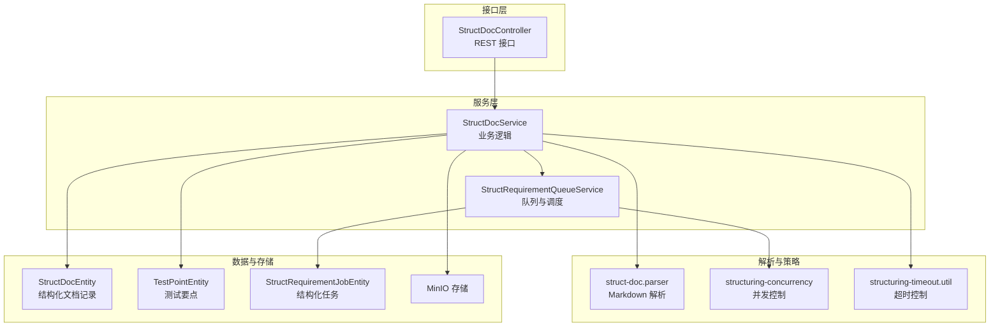
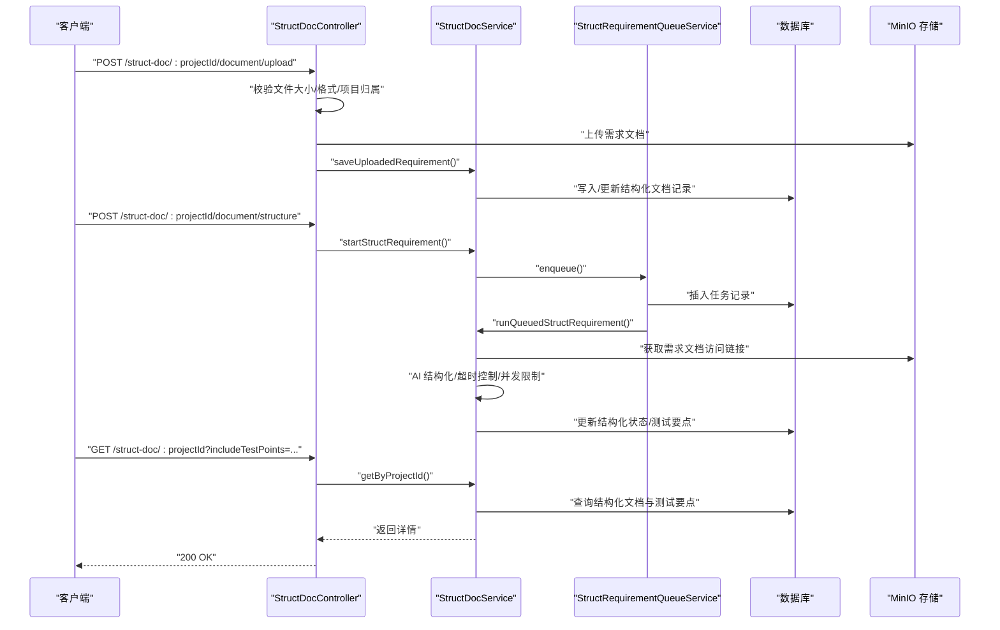
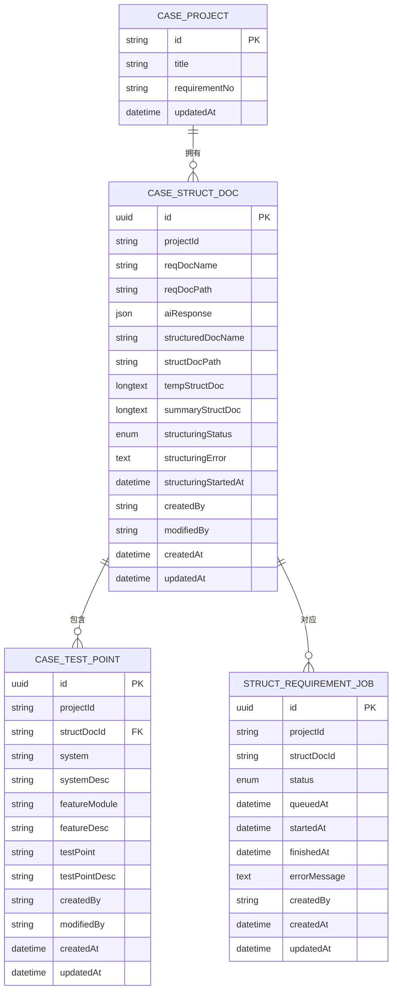
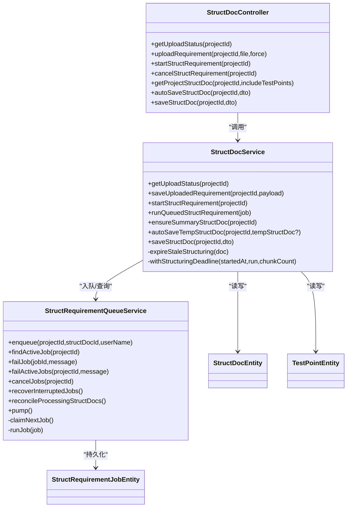
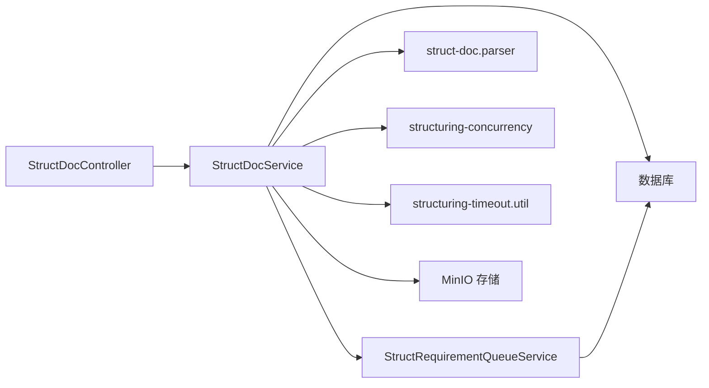

# 结构化文档 API

<cite>
**本文引用的文件**
- [apps/api/src/modules/struct-doc/controller/struct-doc.controller.ts](file://apps/api/src/modules/struct-doc/controller/struct-doc.controller.ts)
- [apps/api/src/modules/struct-doc/service/struct-doc.service.ts](file://apps/api/src/modules/struct-doc/service/struct-doc.service.ts)
- [apps/api/src/modules/struct-doc/service/struct-requirement-queue.service.ts](file://apps/api/src/modules/struct-doc/service/struct-requirement-queue.service.ts)
- [apps/api/src/modules/struct-doc/dto/save-struct-doc.dto.ts](file://apps/api/src/modules/struct-doc/dto/save-struct-doc.dto.ts)
- [apps/api/src/modules/struct-doc/dto/auto-save-struct-doc.dto.ts](file://apps/api/src/modules/struct-doc/dto/auto-save-struct-doc.dto.ts)
- [apps/api/src/modules/struct-doc/entity/struct-doc.entity.ts](file://apps/api/src/modules/struct-doc/entity/struct-doc.entity.ts)
- [apps/api/src/modules/struct-doc/entity/struct-requirement-job.entity.ts](file://apps/api/src/modules/struct-doc/entity/struct-requirement-job.entity.ts)
- [apps/api/src/modules/struct-doc/entity/test-point.entity.ts](file://apps/api/src/modules/struct-doc/entity/test-point.entity.ts)
- [apps/api/src/modules/struct-doc/util/struct-doc.parser.ts](file://apps/api/src/modules/struct-doc/util/struct-doc.parser.ts)
- [apps/api/src/modules/struct-doc/util/struct-requirement-interrupted.util.ts](file://apps/api/src/modules/struct-doc/util/struct-requirement-interrupted.util.ts)
- [apps/api/src/modules/struct-doc/util/structuring-timeout.util.ts](file://apps/api/src/modules/struct-doc/util/structuring-timeout.util.ts)
- [apps/api/src/modules/struct-doc/util/structuring-concurrency.ts](file://apps/api/src/modules/struct-doc/util/structuring-concurrency.ts)
</cite>

## 目录
1. [简介](#简介)
2. [项目结构](#项目结构)
3. [核心组件](#核心组件)
4. [架构总览](#架构总览)
5. [详细组件分析](#详细组件分析)
6. [依赖分析](#依赖分析)
7. [性能考虑](#性能考虑)
8. [故障排查指南](#故障排查指南)
9. [结论](#结论)
10. [附录](#附录)

## 简介
本文件面向“结构化文档”模块的 API 使用者，系统性梳理文档上传、解析任务创建、进度查询、批量处理、中断恢复与超时控制、格式支持、解析结果管理与数据导出等能力。文档以 RESTful 接口形式提供，配合数据库持久化与队列机制，确保结构化任务在并发与超时约束下稳定运行。

## 项目结构
结构化文档模块位于应用后端的 struct-doc 子域，包含控制器、服务、实体、DTO、工具与队列服务，形成清晰的分层职责：
- 控制器：暴露 HTTP 接口，负责参数校验与响应封装
- 服务：实现业务逻辑，协调 MinIO、AI 工作流与数据库
- 实体：映射数据库表结构，维护文档与测试要点
- DTO：输入输出的数据契约
- 工具：解析 Markdown、并发与超时控制、任务中断提示
- 队列服务：持久化任务、调度与重启恢复

图表来源
- [apps/api/src/modules/struct-doc/controller/struct-doc.controller.ts:36-177](file://apps/api/src/modules/struct-doc/controller/struct-doc.controller.ts#L36-L177)
- [apps/api/src/modules/struct-doc/service/struct-doc.service.ts:54-800](file://apps/api/src/modules/struct-doc/service/struct-doc.service.ts#L54-L800)
- [apps/api/src/modules/struct-doc/service/struct-requirement-queue.service.ts:24-288](file://apps/api/src/modules/struct-doc/service/struct-requirement-queue.service.ts#L24-L288)
- [apps/api/src/modules/struct-doc/entity/struct-doc.entity.ts:30-105](file://apps/api/src/modules/struct-doc/entity/struct-doc.entity.ts#L30-L105)
- [apps/api/src/modules/struct-doc/entity/test-point.entity.ts:22-119](file://apps/api/src/modules/struct-doc/entity/test-point.entity.ts#L22-L119)
- [apps/api/src/modules/struct-doc/entity/struct-requirement-job.entity.ts:24-69](file://apps/api/src/modules/struct-doc/entity/struct-requirement-job.entity.ts#L24-L69)
- [apps/api/src/modules/struct-doc/util/struct-doc.parser.ts:33-55](file://apps/api/src/modules/struct-doc/util/struct-doc.parser.ts#L33-L55)
- [apps/api/src/modules/struct-doc/util/structuring-concurrency.ts:14-67](file://apps/api/src/modules/struct-doc/util/structuring-concurrency.ts#L14-L67)
- [apps/api/src/modules/struct-doc/util/structuring-timeout.util.ts:5-74](file://apps/api/src/modules/struct-doc/util/structuring-timeout.util.ts#L5-L74)

章节来源
- [apps/api/src/modules/struct-doc/controller/struct-doc.controller.ts:36-177](file://apps/api/src/modules/struct-doc/controller/struct-doc.controller.ts#L36-L177)
- [apps/api/src/modules/struct-doc/service/struct-doc.service.ts:54-800](file://apps/api/src/modules/struct-doc/service/struct-doc.service.ts#L54-L800)
- [apps/api/src/modules/struct-doc/service/struct-requirement-queue.service.ts:24-288](file://apps/api/src/modules/struct-doc/service/struct-requirement-queue.service.ts#L24-L288)

## 核心组件
- 控制器：提供上传、结构化、取消、查询、自动保存、正式保存等接口
- 服务：封装上传记录、AI 结构化、超时与中断处理、测试要点同步、总结生成、保存到 MinIO
- 队列服务：持久化任务、并发调度、重启恢复、失败标记与清理
- 实体：结构化文档记录、测试要点、结构化任务
- 工具：Markdown 解析、并发与超时控制、中断消息构建

章节来源
- [apps/api/src/modules/struct-doc/controller/struct-doc.controller.ts:36-177](file://apps/api/src/modules/struct-doc/controller/struct-doc.controller.ts#L36-L177)
- [apps/api/src/modules/struct-doc/service/struct-doc.service.ts:54-800](file://apps/api/src/modules/struct-doc/service/struct-doc.service.ts#L54-L800)
- [apps/api/src/modules/struct-doc/service/struct-requirement-queue.service.ts:24-288](file://apps/api/src/modules/struct-doc/service/struct-requirement-queue.service.ts#L24-L288)
- [apps/api/src/modules/struct-doc/entity/struct-doc.entity.ts:30-105](file://apps/api/src/modules/struct-doc/entity/struct-doc.entity.ts#L30-L105)
- [apps/api/src/modules/struct-doc/entity/test-point.entity.ts:22-119](file://apps/api/src/modules/struct-doc/entity/test-point.entity.ts#L22-L119)
- [apps/api/src/modules/struct-doc/entity/struct-requirement-job.entity.ts:24-69](file://apps/api/src/modules/struct-doc/entity/struct-requirement-job.entity.ts#L24-L69)
- [apps/api/src/modules/struct-doc/util/struct-doc.parser.ts:33-55](file://apps/api/src/modules/struct-doc/util/struct-doc.parser.ts#L33-L55)
- [apps/api/src/modules/struct-doc/util/structuring-concurrency.ts:14-67](file://apps/api/src/modules/struct-doc/util/structuring-concurrency.ts#L14-L67)
- [apps/api/src/modules/struct-doc/util/structuring-timeout.util.ts:5-74](file://apps/api/src/modules/struct-doc/util/structuring-timeout.util.ts#L5-L74)

## 架构总览
整体采用“控制器-服务-队列-存储”的分层设计，结合 AI 工作流与 MinIO 对象存储，实现结构化任务的异步化与持久化。

图表来源
- [apps/api/src/modules/struct-doc/controller/struct-doc.controller.ts:48-122](file://apps/api/src/modules/struct-doc/controller/struct-doc.controller.ts#L48-L122)
- [apps/api/src/modules/struct-doc/service/struct-doc.service.ts:238-406](file://apps/api/src/modules/struct-doc/service/struct-doc.service.ts#L238-L406)
- [apps/api/src/modules/struct-doc/service/struct-requirement-queue.service.ts:90-286](file://apps/api/src/modules/struct-doc/service/struct-requirement-queue.service.ts#L90-L286)

## 详细组件分析

### 接口定义与行为
- 上传需求文档
  - 方法与路径：POST /struct-doc/{projectId}/document/upload
  - 请求方式：multipart/form-data
  - 参数：文件字段 file，查询参数 force（可选，强制覆盖）
  - 校验：大小限制、扩展名限制（doc/docx）、项目归属
  - 行为：上传至 MinIO，记录元数据，必要时清理旧测试要点
  - 响应：返回当前项目结构化文档状态与详情
- 查询上传状态
  - 方法与路径：GET /struct-doc/{projectId}/upload-status
  - 返回：是否存在已上传文档、文件名
- 触发结构化
  - 方法与路径：POST /struct-doc/{projectId}/document/structure
  - 行为：若无进行中任务则入队；若超时则标记失败并允许重新触发
  - 响应：立即返回当前详情（可能仍在队列/处理中）
- 取消结构化
  - 方法与路径：POST /struct-doc/{projectId}/document/structure/cancel
  - 行为：取消进行中的任务，标记失败并清理队列
  - 响应：返回最新详情
- 查询结构化详情与测试要点
  - 方法与路径：GET /struct-doc/{projectId}
  - 查询参数：includeTestPoints（默认 true，设为 false 仅返回元数据）
  - 返回：结构化文档详情、测试要点列表（可选）
- 自动保存临时结构化 Markdown
  - 方法与路径：PATCH /struct-doc/{projectId}/auto-save
  - 请求体：AutoSaveStructDocDto（可选字段 tempStructDoc）
  - 行为：更新临时 Markdown，必要时清空总结
  - 响应：返回最新详情
- 正式保存结构化文档
  - 方法与路径：PATCH /struct-doc/{projectId}
  - 请求体：SaveStructDocDto（可选 structuredDocName、tempStructDoc、testPoints）
  - 行为：上传至 MinIO，同步测试要点，更新项目需求编号
  - 响应：返回最新详情

章节来源
- [apps/api/src/modules/struct-doc/controller/struct-doc.controller.ts:48-162](file://apps/api/src/modules/struct-doc/controller/struct-doc.controller.ts#L48-L162)
- [apps/api/src/modules/struct-doc/dto/auto-save-struct-doc.dto.ts:9-15](file://apps/api/src/modules/struct-doc/dto/auto-save-struct-doc.dto.ts#L9-L15)
- [apps/api/src/modules/struct-doc/dto/save-struct-doc.dto.ts:54-75](file://apps/api/src/modules/struct-doc/dto/save-struct-doc.dto.ts#L54-L75)

### 数据模型与关系

图表来源
- [apps/api/src/modules/struct-doc/entity/struct-doc.entity.ts:30-105](file://apps/api/src/modules/struct-doc/entity/struct-doc.entity.ts#L30-L105)
- [apps/api/src/modules/struct-doc/entity/test-point.entity.ts:22-119](file://apps/api/src/modules/struct-doc/entity/test-point.entity.ts#L22-L119)
- [apps/api/src/modules/struct-doc/entity/struct-requirement-job.entity.ts:24-69](file://apps/api/src/modules/struct-doc/entity/struct-requirement-job.entity.ts#L24-L69)

章节来源
- [apps/api/src/modules/struct-doc/entity/struct-doc.entity.ts:30-105](file://apps/api/src/modules/struct-doc/entity/struct-doc.entity.ts#L30-L105)
- [apps/api/src/modules/struct-doc/entity/test-point.entity.ts:22-119](file://apps/api/src/modules/struct-doc/entity/test-point.entity.ts#L22-L119)
- [apps/api/src/modules/struct-doc/entity/struct-requirement-job.entity.ts:24-69](file://apps/api/src/modules/struct-doc/entity/struct-requirement-job.entity.ts#L24-L69)

### 解析与数据处理
- Markdown 解析策略
  - 支持多种结构：功能模块分块、宽松功能模块、旧版标题块、纯文本、全局测试要点段落
  - 统一清洗：去除 AI 思维标签、标准化测试要点条目格式
  - 去重：基于“系统+模块+测试要点标题+描述”去重
- 测试要点同步
  - 增量同步：按“项目+系统+模块+测试要点标题”判断重复，仅新增缺失项
  - 全量替换：当显式传入 testPoints 时，支持删除/更新
- 案例生成摘要
  - 优先使用已缓存摘要；缺失时按需生成；失败时回退全文

章节来源
- [apps/api/src/modules/struct-doc/util/struct-doc.parser.ts:33-55](file://apps/api/src/modules/struct-doc/util/struct-doc.parser.ts#L33-L55)
- [apps/api/src/modules/struct-doc/util/struct-doc.parser.ts:57-84](file://apps/api/src/modules/struct-doc/util/struct-doc.parser.ts#L57-L84)
- [apps/api/src/modules/struct-doc/util/struct-doc.parser.ts:591-653](file://apps/api/src/modules/struct-doc/util/struct-doc.parser.ts#L591-L653)
- [apps/api/src/modules/struct-doc/service/struct-doc.service.ts:650-798](file://apps/api/src/modules/struct-doc/service/struct-doc.service.ts#L650-L798)

### 队列与并发控制
- 任务生命周期
  - 入队：设置状态 processing、开始时间
  - 出队：原子性更新为 running，记录开始时间
  - 运行：执行结构化，更新状态与错误信息
  - 完成/失败：标记完成或失败并记录时间
- 并发与槽位
  - 全局并发上限受环境变量控制，跨项目共享
  - 项目级执行槽位防止同一项目频繁触发
- 超时控制
  - 基于预估分段数动态延长超时时间
  - 处理中且超时的任务会被标记失败并清理队列
- 中断恢复
  - 服务启动时将“运行中”任务重置为“队列”，并补充“结构化中”但无任务的记录

章节来源
- [apps/api/src/modules/struct-doc/service/struct-requirement-queue.service.ts:90-286](file://apps/api/src/modules/struct-doc/service/struct-requirement-queue.service.ts#L90-L286)
- [apps/api/src/modules/struct-doc/util/structuring-concurrency.ts:14-67](file://apps/api/src/modules/struct-doc/util/structuring-concurrency.ts#L14-L67)
- [apps/api/src/modules/struct-doc/util/structuring-timeout.util.ts:5-74](file://apps/api/src/modules/struct-doc/util/structuring-timeout.util.ts#L5-L74)
- [apps/api/src/modules/struct-doc/util/struct-requirement-interrupted.util.ts:1-5](file://apps/api/src/modules/struct-doc/util/struct-requirement-interrupted.util.ts#L1-L5)

### 类图（代码级）

图表来源
- [apps/api/src/modules/struct-doc/controller/struct-doc.controller.ts:36-177](file://apps/api/src/modules/struct-doc/controller/struct-doc.controller.ts#L36-L177)
- [apps/api/src/modules/struct-doc/service/struct-doc.service.ts:54-800](file://apps/api/src/modules/struct-doc/service/struct-doc.service.ts#L54-L800)
- [apps/api/src/modules/struct-doc/service/struct-requirement-queue.service.ts:24-288](file://apps/api/src/modules/struct-doc/service/struct-requirement-queue.service.ts#L24-L288)
- [apps/api/src/modules/struct-doc/entity/struct-doc.entity.ts:30-105](file://apps/api/src/modules/struct-doc/entity/struct-doc.entity.ts#L30-L105)
- [apps/api/src/modules/struct-doc/entity/test-point.entity.ts:22-119](file://apps/api/src/modules/struct-doc/entity/test-point.entity.ts#L22-L119)
- [apps/api/src/modules/struct-doc/entity/struct-requirement-job.entity.ts:24-69](file://apps/api/src/modules/struct-doc/entity/struct-requirement-job.entity.ts#L24-L69)

## 依赖分析
- 控制器依赖服务与 MinIO 存储
- 服务依赖队列、AI 工作流、MinIO、实体与工具
- 队列服务依赖实体与并发/超时工具
- 解析工具独立于服务层，便于复用

图表来源
- [apps/api/src/modules/struct-doc/controller/struct-doc.controller.ts:36-177](file://apps/api/src/modules/struct-doc/controller/struct-doc.controller.ts#L36-L177)
- [apps/api/src/modules/struct-doc/service/struct-doc.service.ts:54-800](file://apps/api/src/modules/struct-doc/service/struct-doc.service.ts#L54-L800)
- [apps/api/src/modules/struct-doc/service/struct-requirement-queue.service.ts:24-288](file://apps/api/src/modules/struct-doc/service/struct-requirement-queue.service.ts#L24-L288)
- [apps/api/src/modules/struct-doc/util/struct-doc.parser.ts:33-55](file://apps/api/src/modules/struct-doc/util/struct-doc.parser.ts#L33-L55)
- [apps/api/src/modules/struct-doc/util/structuring-concurrency.ts:14-67](file://apps/api/src/modules/struct-doc/util/structuring-concurrency.ts#L14-L67)
- [apps/api/src/modules/struct-doc/util/structuring-timeout.util.ts:5-74](file://apps/api/src/modules/struct-doc/util/structuring-timeout.util.ts#L5-L74)

章节来源
- [apps/api/src/modules/struct-doc/controller/struct-doc.controller.ts:36-177](file://apps/api/src/modules/struct-doc/controller/struct-doc.controller.ts#L36-L177)
- [apps/api/src/modules/struct-doc/service/struct-doc.service.ts:54-800](file://apps/api/src/modules/struct-doc/service/struct-doc.service.ts#L54-L800)
- [apps/api/src/modules/struct-doc/service/struct-requirement-queue.service.ts:24-288](file://apps/api/src/modules/struct-doc/service/struct-requirement-queue.service.ts#L24-L288)

## 性能考虑
- 并发限制：通过全局并发与项目执行槽位控制 AI 调用压力，避免资源争用
- 超时控制：按预估分段数动态延长超时时间，减少长文本任务的误判
- 队列泵：按可用槽位批量拉取任务，降低数据库竞争
- 缓存摘要：生成案例用需求总结，缩短后续处理耗时

章节来源
- [apps/api/src/modules/struct-doc/util/structuring-concurrency.ts:14-67](file://apps/api/src/modules/struct-doc/util/structuring-concurrency.ts#L14-L67)
- [apps/api/src/modules/struct-doc/util/structuring-timeout.util.ts:5-74](file://apps/api/src/modules/struct-doc/util/structuring-timeout.util.ts#L5-L74)
- [apps/api/src/modules/struct-doc/service/struct-doc.service.ts:502-549](file://apps/api/src/modules/struct-doc/service/struct-doc.service.ts#L502-L549)

## 故障排查指南
- 常见错误与处理
  - 文件大小/格式不符：上传前严格校验大小与扩展名
  - 已存在文档且未强制覆盖：冲突异常，建议使用强制参数或新建项目
  - 结构化进行中：禁止重复上传，等待任务完成
  - 需求文档不存在/地址无效：重新上传并确认 MinIO 访问链接
  - 结构化超时：查看超时分钟数与分段数配置，适当调整
  - 任务中断/重启：队列会自动恢复，必要时手动取消后重试
- 恢复步骤
  - 取消任务：POST /struct-doc/{projectId}/document/structure/cancel
  - 重新触发：POST /struct-doc/{projectId}/document/structure
  - 查询详情：GET /struct-doc/{projectId}?includeTestPoints=false

章节来源
- [apps/api/src/modules/struct-doc/controller/struct-doc.controller.ts:74-107](file://apps/api/src/modules/struct-doc/controller/struct-doc.controller.ts#L74-L107)
- [apps/api/src/modules/struct-doc/service/struct-doc.service.ts:76-94](file://apps/api/src/modules/struct-doc/service/struct-doc.service.ts#L76-L94)
- [apps/api/src/modules/struct-doc/util/structuring-timeout.util.ts:35-47](file://apps/api/src/modules/struct-doc/util/structuring-timeout.util.ts#L35-L47)
- [apps/api/src/modules/struct-doc/util/struct-requirement-interrupted.util.ts:1-5](file://apps/api/src/modules/struct-doc/util/struct-requirement-interrupted.util.ts#L1-L5)

## 结论
结构化文档 API 通过清晰的分层设计与完善的队列机制，实现了文档上传、异步结构化、测试要点同步与数据导出的全链路能力。借助并发与超时控制、中断恢复与自动重试，系统在高负载与异常情况下仍保持稳健。建议在生产环境中合理配置并发与超时参数，并结合日志与监控持续优化。

## 附录

### 接口一览（REST）
- 上传需求文档
  - 方法：POST
  - 路径：/struct-doc/{projectId}/document/upload
  - 认证：需具备项目访问权限
  - 请求体：multipart/form-data，字段 file；查询参数 force=true/false
  - 成功响应：200，返回结构化文档详情
  - 错误响应：400（文件不合法/大小超限/格式不支持），409（结构化进行中/已存在文档且未强制）
- 查询上传状态
  - 方法：GET
  - 路径：/struct-doc/{projectId}/upload-status
  - 成功响应：200，返回 hasExisting、reqDocName
- 触发结构化
  - 方法：POST
  - 路径：/struct-doc/{projectId}/document/structure
  - 成功响应：202，返回当前详情（可能仍在处理中）
  - 错误响应：400（未上传文档）
- 取消结构化
  - 方法：POST
  - 路径：/struct-doc/{projectId}/document/structure/cancel
  - 成功响应：200，返回最新详情
- 查询详情与测试要点
  - 方法：GET
  - 路径：/struct-doc/{projectId}
  - 查询参数：includeTestPoints=false（仅返回元数据）
  - 成功响应：200，返回详情与测试要点（可选）
- 自动保存临时 Markdown
  - 方法：PATCH
  - 路径：/struct-doc/{projectId}/auto-save
  - 请求体：AutoSaveStructDocDto（可选 tempStructDoc）
  - 成功响应：200，返回最新详情
- 正式保存结构化文档
  - 方法：PATCH
  - 路径：/struct-doc/{projectId}
  - 请求体：SaveStructDocDto（可选 structuredDocName、tempStructDoc、testPoints）
  - 成功响应：200，返回最新详情
  - 错误响应：400（未上传/未结构化），404（项目不存在）

章节来源
- [apps/api/src/modules/struct-doc/controller/struct-doc.controller.ts:48-162](file://apps/api/src/modules/struct-doc/controller/struct-doc.controller.ts#L48-L162)
- [apps/api/src/modules/struct-doc/dto/auto-save-struct-doc.dto.ts:9-15](file://apps/api/src/modules/struct-doc/dto/auto-save-struct-doc.dto.ts#L9-L15)
- [apps/api/src/modules/struct-doc/dto/save-struct-doc.dto.ts:54-75](file://apps/api/src/modules/struct-doc/dto/save-struct-doc.dto.ts#L54-L75)

### 配置与环境变量
- 并发控制
  - STRUCTURING_CONCURRENCY：全局并发上限，默认 2，最大 5
- 超时控制
  - STRUCTURING_TIMEOUT_MINUTES：基础超时分钟数，默认 10
  - STRUCTURING_TIMEOUT_EXTRA_MINUTES_PER_CHUNK：每额外分段追加分钟数
  - STRUCTURING_MAX_PLANNED_CHUNKS：最大预估分段数，默认 12
- 文件大小
  - 通过上传接口限制，超出将拒绝

章节来源
- [apps/api/src/modules/struct-doc/util/structuring-concurrency.ts:14-22](file://apps/api/src/modules/struct-doc/util/structuring-concurrency.ts#L14-L22)
- [apps/api/src/modules/struct-doc/util/structuring-timeout.util.ts:5-29](file://apps/api/src/modules/struct-doc/util/structuring-timeout.util.ts#L5-L29)
- [apps/api/src/modules/struct-doc/controller/struct-doc.controller.ts:64-82](file://apps/api/src/modules/struct-doc/controller/struct-doc.controller.ts#L64-L82)

### 错误码说明
- 400
  - 请选择 doc 或 docx 需求文档
  - 需求文档大小不能超过 {N}MB
  - 仅支持上传 doc 或 docx 格式的需求文档
  - 请先上传需求文档后再进行结构化
  - 需求文档不存在
  - 需求文档地址无效，请重新上传
  - 测试要点「...」的系统、功能模块、测试要点均不能为空
  - 请先上传需求文档
  - 请先结构化需求文档后再保存
- 404
  - Project {projectId} has no struct doc record
- 409
  - 结构化进行中，请稍后再上传需求文档
  - 当前项目已存在需求文档，重新上传需要重新结构化并重新保存，建议新建项目操作
- 500
  - 结构化失败，请稍后重试
  - 结构化超时（已超过 X 分钟），请重新点击「结构化」

章节来源
- [apps/api/src/modules/struct-doc/controller/struct-doc.controller.ts:74-87](file://apps/api/src/modules/struct-doc/controller/struct-doc.controller.ts#L74-L87)
- [apps/api/src/modules/struct-doc/service/struct-doc.service.ts:243-245](file://apps/api/src/modules/struct-doc/service/struct-doc.service.ts#L243-L245)
- [apps/api/src/modules/struct-doc/service/struct-doc.service.ts:292-302](file://apps/api/src/modules/struct-doc/service/struct-doc.service.ts#L292-L302)
- [apps/api/src/modules/struct-doc/service/struct-doc.service.ts:733-754](file://apps/api/src/modules/struct-doc/service/struct-doc.service.ts#L733-L754)
- [apps/api/src/modules/struct-doc/service/struct-doc.service.ts:595-600](file://apps/api/src/modules/struct-doc/service/struct-doc.service.ts#L595-L600)
- [apps/api/src/modules/struct-doc/util/structuring-timeout.util.ts:35-47](file://apps/api/src/modules/struct-doc/util/structuring-timeout.util.ts#L35-L47)