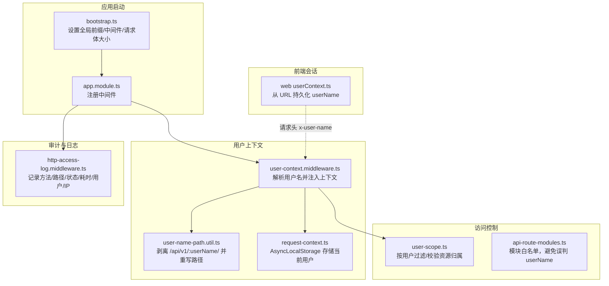
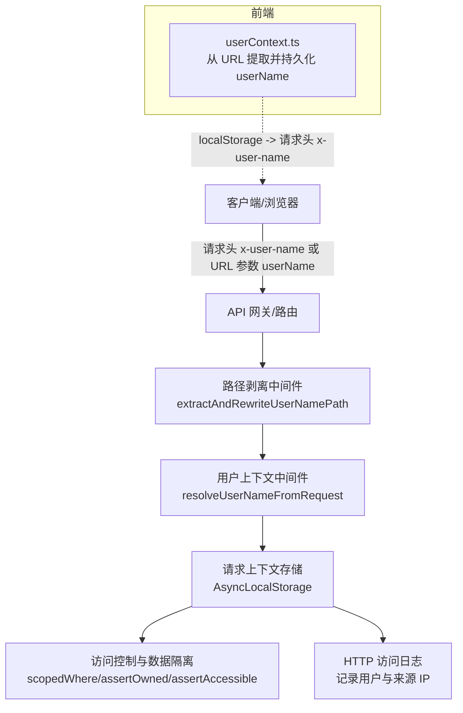
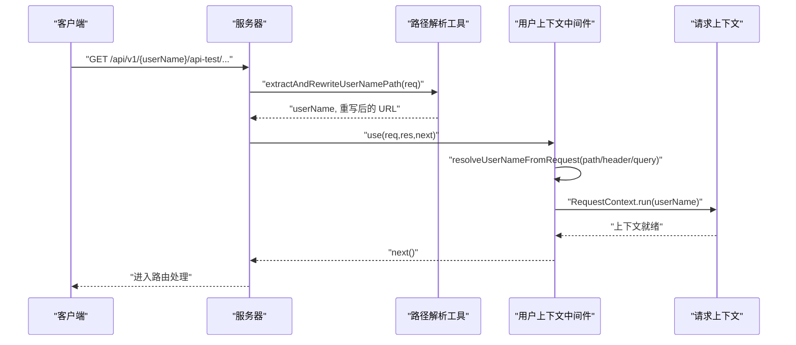
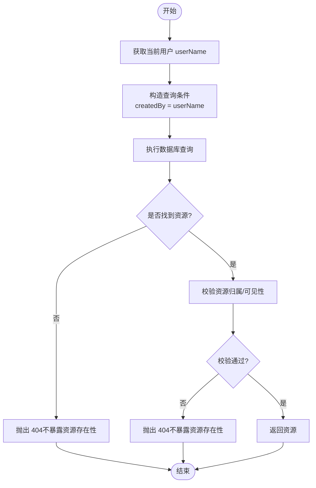
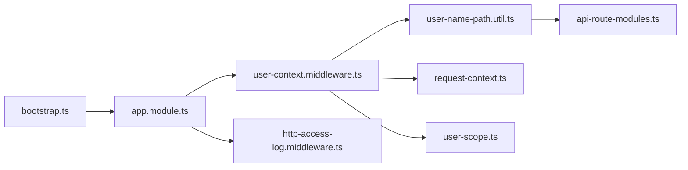

# 认证与授权 API

<cite>
**本文引用的文件**
- [apps/api/src/bootstrap.ts](file://apps/api/src/bootstrap.ts)
- [apps/api/src/app.module.ts](file://apps/api/src/app.module.ts)
- [apps/api/src/common/audit/user-context.middleware.ts](file://apps/api/src/common/audit/user-context.middleware.ts)
- [apps/api/src/common/audit/user-name-path.util.ts](file://apps/api/src/common/audit/user-name-path.util.ts)
- [apps/api/src/common/audit/request-context.ts](file://apps/api/src/common/audit/request-context.ts)
- [apps/api/src/common/audit/user-scope.ts](file://apps/api/src/common/audit/user-scope.ts)
- [apps/api/src/common/audit/api-route-modules.ts](file://apps/api/src/common/audit/api-route-modules.ts)
- [apps/api/src/common/http/http-access-log.middleware.ts](file://apps/api/src/common/http/http-access-log.middleware.ts)
- [apps/api/src/modules/api-test/controller/api-test.controller.ts](file://apps/api/src/modules/api-test/controller/api-test.controller.ts)
- [apps/web/src/utils/userContext.ts](file://apps/web/src/utils/userContext.ts)
- [apps/api/src/config/configuration.ts](file://apps/api/src/config/configuration.ts)
- [apps/api/src/config/app-config.types.ts](file://apps/api/src/config/app-config.types.ts)
</cite>

## 目录
1. [简介](#简介)
2. [项目结构](#项目结构)
3. [核心组件](#核心组件)
4. [架构总览](#架构总览)
5. [详细组件分析](#详细组件分析)
6. [依赖关系分析](#依赖关系分析)
7. [性能考量](#性能考量)
8. [故障排查指南](#故障排查指南)
9. [结论](#结论)
10. [附录](#附录)

## 简介
本文件面向认证与授权 API 的设计与使用，重点覆盖以下方面：
- 用户身份解析与上下文注入：通过路径、请求头与查询参数解析用户名，并在请求生命周期内贯穿。
- 访问控制与数据隔离：基于“创建者字段”进行用户级数据隔离与可见性校验。
- 审计与日志：统一记录 HTTP 访问日志并携带当前用户信息。
- 会话与安全头：通过前端持久化用户名并在后续请求中以请求头传递，实现无 Cookie 会话模型。
- JWT 与令牌：本仓库未实现基于 JWT 的认证与令牌刷新流程，若需引入可参考“结论”部分的建议。

上述能力共同构成“用户名即会话”的轻量认证模型，适用于多租户场景下的资源隔离与审计追踪。

## 项目结构
围绕认证与授权的关键文件组织如下：
- 启动与中间件装配：应用启动时剥离路径前缀、设置全局前缀与中间件。
- 用户上下文与路径解析：解析 /api/v1/:userName/ 前缀，注入请求上下文。
- 数据隔离与访问控制：基于“创建者”字段的查询过滤与资源校验。
- 日志与审计：HTTP 访问日志记录用户与来源 IP。
- 前端会话同步：从 URL 提取并持久化用户名，供后续请求携带。

图表来源
- [apps/api/src/bootstrap.ts:18-37](file://apps/api/src/bootstrap.ts#L18-L37)
- [apps/api/src/app.module.ts:41-46](file://apps/api/src/app.module.ts#L41-L46)
- [apps/api/src/common/audit/user-context.middleware.ts:8-19](file://apps/api/src/common/audit/user-context.middleware.ts#L8-L19)
- [apps/api/src/common/audit/user-name-path.util.ts:7-29](file://apps/api/src/common/audit/user-name-path.util.ts#L7-L29)
- [apps/api/src/common/audit/request-context.ts:8-16](file://apps/api/src/common/audit/request-context.ts#L8-L16)
- [apps/api/src/common/audit/user-scope.ts:14-16](file://apps/api/src/common/audit/user-scope.ts#L14-L16)
- [apps/api/src/common/audit/api-route-modules.ts:2-9](file://apps/api/src/common/audit/api-route-modules.ts#L2-L9)
- [apps/api/src/common/http/http-access-log.middleware.ts:7-45](file://apps/api/src/common/http/http-access-log.middleware.ts#L7-L45)
- [apps/web/src/utils/userContext.ts:5-33](file://apps/web/src/utils/userContext.ts#L5-L33)

章节来源
- [apps/api/src/bootstrap.ts:18-37](file://apps/api/src/bootstrap.ts#L18-L37)
- [apps/api/src/app.module.ts:41-46](file://apps/api/src/app.module.ts#L41-L46)

## 核心组件
- 用户上下文中间件：负责解析用户名并注入请求上下文，确保后续服务层可获取当前操作用户。
- 路径用户名解析工具：识别 /api/v1/:userName/:module/... 形式的路径前缀，剥离 userName 并重写请求 URL。
- 请求上下文存储：使用 AsyncLocalStorage 在异步调用链中保存当前用户。
- 访问控制与数据隔离：提供查询过滤、资源归属校验与可见性校验，保障用户间数据隔离。
- HTTP 访问日志中间件：记录请求关键指标并附带当前用户与来源 IP。
- 前端会话同步：从 URL 提取 userName 并持久化，后续请求通过请求头携带。

章节来源
- [apps/api/src/common/audit/user-context.middleware.ts:8-19](file://apps/api/src/common/audit/user-context.middleware.ts#L8-L19)
- [apps/api/src/common/audit/user-name-path.util.ts:7-29](file://apps/api/src/common/audit/user-name-path.util.ts#L7-L29)
- [apps/api/src/common/audit/request-context.ts:8-16](file://apps/api/src/common/audit/request-context.ts#L8-L16)
- [apps/api/src/common/audit/user-scope.ts:14-16](file://apps/api/src/common/audit/user-scope.ts#L14-L16)
- [apps/api/src/common/http/http-access-log.middleware.ts:7-45](file://apps/api/src/common/http/http-access-log.middleware.ts#L7-L45)
- [apps/web/src/utils/userContext.ts:5-33](file://apps/web/src/utils/userContext.ts#L5-L33)

## 架构总览
下图展示认证与授权相关组件之间的交互关系与数据流：

图表来源
- [apps/api/src/common/audit/user-context.middleware.ts:8-19](file://apps/api/src/common/audit/user-context.middleware.ts#L8-L19)
- [apps/api/src/common/audit/user-name-path.util.ts:7-29](file://apps/api/src/common/audit/user-name-path.util.ts#L7-L29)
- [apps/api/src/common/audit/request-context.ts:8-16](file://apps/api/src/common/audit/request-context.ts#L8-L16)
- [apps/api/src/common/audit/user-scope.ts:14-16](file://apps/api/src/common/audit/user-scope.ts#L14-L16)
- [apps/api/src/common/http/http-access-log.middleware.ts:7-45](file://apps/api/src/common/http/http-access-log.middleware.ts#L7-L45)
- [apps/web/src/utils/userContext.ts:5-33](file://apps/web/src/utils/userContext.ts#L5-L33)

## 详细组件分析

### 组件一：用户上下文中间件与路径解析
- 功能要点
  - 在进入 Nest 路由匹配之前，先尝试从 URL 中提取 userName 并重写路径，避免将 userName 视为模块名。
  - 若无法从路径解析，则回退到请求头 x-user-name 与查询参数 userName。
  - 将解析到的用户名注入请求上下文，供后续服务层使用。
- 关键行为
  - 路径剥离：仅当第三段为模块白名单且第四段存在有效模块时，才认为第三段是 userName。
  - 用户名解析优先级：路径 > 请求头 > 查询参数 > 默认 system。
  - 上下文注入：使用 AsyncLocalStorage 保证异步链路可用。

图表来源
- [apps/api/src/common/audit/user-context.middleware.ts:8-19](file://apps/api/src/common/audit/user-context.middleware.ts#L8-L19)
- [apps/api/src/common/audit/user-name-path.util.ts:7-29](file://apps/api/src/common/audit/user-name-path.util.ts#L7-L29)
- [apps/api/src/common/audit/request-context.ts:8-16](file://apps/api/src/common/audit/request-context.ts#L8-L16)

章节来源
- [apps/api/src/common/audit/user-context.middleware.ts:8-19](file://apps/api/src/common/audit/user-context.middleware.ts#L8-L19)
- [apps/api/src/common/audit/user-name-path.util.ts:7-29](file://apps/api/src/common/audit/user-name-path.util.ts#L7-L29)
- [apps/api/src/common/audit/request-context.ts:8-16](file://apps/api/src/common/audit/request-context.ts#L8-L16)
- [apps/api/src/common/audit/api-route-modules.ts:2-9](file://apps/api/src/common/audit/api-route-modules.ts#L2-L9)

### 组件二：访问控制与数据隔离
- 功能要点
  - 提供 scopedWhere 与 scopedWhereWithSystem，用于在查询中自动附加“创建者=当前用户”或“创建者=当前用户 OR 系统预置”。
  - 提供 applyUserScope，在 QueryBuilder 层追加用户隔离条件。
  - 提供 assertOwned 与 assertAccessible，用于资源归属与可见性校验，避免信息泄露。
- 使用建议
  - 对所有涉及用户数据的查询，优先使用 scopedWhere 或 applyUserScope。
  - 对资源修改/删除等敏感操作，务必使用 assertOwned 校验归属。

图表来源
- [apps/api/src/common/audit/user-scope.ts:14-16](file://apps/api/src/common/audit/user-scope.ts#L14-L16)
- [apps/api/src/common/audit/user-scope.ts:48-75](file://apps/api/src/common/audit/user-scope.ts#L48-L75)

章节来源
- [apps/api/src/common/audit/user-scope.ts:14-16](file://apps/api/src/common/audit/user-scope.ts#L14-L16)
- [apps/api/src/common/audit/user-scope.ts:48-75](file://apps/api/src/common/audit/user-scope.ts#L48-L75)

### 组件三：HTTP 访问日志与审计
- 功能要点
  - 记录请求方法、路径、状态码、耗时、内容长度、用户与来源 IP。
  - 从请求上下文中读取当前用户，确保审计信息完整。
- 注意事项
  - 日志中包含用户标识，需遵循隐私与合规要求。

章节来源
- [apps/api/src/common/http/http-access-log.middleware.ts:7-45](file://apps/api/src/common/http/http-access-log.middleware.ts#L7-L45)
- [apps/api/src/common/audit/request-context.ts:13-15](file://apps/api/src/common/audit/request-context.ts#L13-L15)

### 组件四：前端会话同步
- 功能要点
  - 从 URL 查询参数提取 userName，解码后持久化到本地存储。
  - 后续请求可通过请求头 x-user-name 携带该值，实现“无 Cookie 会话”。

章节来源
- [apps/web/src/utils/userContext.ts:5-33](file://apps/web/src/utils/userContext.ts#L5-L33)

## 依赖关系分析
- 中间件装配
  - 应用启动时设置全局前缀与中间件顺序，确保路径剥离与用户上下文在路由匹配前完成。
- 模块白名单
  - 通过 API_ROUTE_MODULES 白名单避免将模块名误判为 userName。
- 服务层依赖
  - 控制器与服务层通过请求上下文与访问控制工具实现用户级数据隔离。

图表来源
- [apps/api/src/bootstrap.ts:18-37](file://apps/api/src/bootstrap.ts#L18-L37)
- [apps/api/src/app.module.ts:41-46](file://apps/api/src/app.module.ts#L41-L46)
- [apps/api/src/common/audit/user-context.middleware.ts:8-19](file://apps/api/src/common/audit/user-context.middleware.ts#L8-L19)
- [apps/api/src/common/audit/user-name-path.util.ts:7-29](file://apps/api/src/common/audit/user-name-path.util.ts#L7-L29)
- [apps/api/src/common/audit/request-context.ts:8-16](file://apps/api/src/common/audit/request-context.ts#L8-L16)
- [apps/api/src/common/audit/user-scope.ts:14-16](file://apps/api/src/common/audit/user-scope.ts#L14-L16)
- [apps/api/src/common/audit/api-route-modules.ts:2-9](file://apps/api/src/common/audit/api-route-modules.ts#L2-L9)

章节来源
- [apps/api/src/app.module.ts:41-46](file://apps/api/src/app.module.ts#L41-L46)
- [apps/api/src/common/audit/api-route-modules.ts:2-9](file://apps/api/src/common/audit/api-route-modules.ts#L2-L9)

## 性能考量
- 中间件顺序与路径剥离：尽早剥离 userName 并注入上下文，减少后续路由匹配与鉴权成本。
- 日志开销：HTTP 访问日志包含用户与来源 IP，建议在生产环境合理配置日志级别与采样策略。
- 请求体大小：启动时已设置较大的请求体限制，注意上传与下载的内存占用与超时配置。

## 故障排查指南
- 无法解析用户名
  - 检查 URL 是否符合 /api/v1/:userName/:module/... 格式，确认模块名在白名单中。
  - 检查请求头 x-user-name 与查询参数 userName 是否正确传递。
- 资源访问失败（404）
  - 可能因资源归属不符或不存在，检查 createdBy 字段与当前用户上下文。
- 日志中用户为空
  - 确认前端已将 userName 写入本地存储并通过请求头携带。

章节来源
- [apps/api/src/common/audit/user-name-path.util.ts:7-29](file://apps/api/src/common/audit/user-name-path.util.ts#L7-L29)
- [apps/api/src/common/audit/user-scope.ts:48-75](file://apps/api/src/common/audit/user-scope.ts#L48-L75)
- [apps/web/src/utils/userContext.ts:5-33](file://apps/web/src/utils/userContext.ts#L5-L33)

## 结论
- 本仓库采用“用户名即会话”的轻量认证模型：通过路径前缀与请求头携带用户名，结合请求上下文与访问控制实现用户级数据隔离与审计。
- 未实现基于 JWT 的认证与令牌刷新流程。若需引入 JWT，请在应用层新增认证模块，定义登录/登出/刷新接口，并在网关或中间件中集成令牌解析与用户上下文注入。
- 建议的安全实践
  - 强制 HTTPS 传输，防止用户名被窃听。
  - 对敏感操作增加二次确认与审计日志。
  - 对外暴露的 API 明确鉴权策略与速率限制。

## 附录

### API 设计与使用建议（概念性说明）
- 登录/登出/令牌刷新
  - 由于本仓库未实现 JWT，建议在独立认证服务中提供登录接口，返回短期访问令牌与刷新令牌；登出时使令牌失效；刷新时验证旧令牌并签发新令牌。
- 权限控制
  - 基于角色与权限范围的访问控制可通过扩展“创建者”字段或引入角色表实现；结合访问控制工具进行查询过滤与资源校验。
- 安全头与会话管理
  - 前端通过请求头 x-user-name 携带用户名；后端通过中间件解析并注入上下文；避免使用 Cookie 会话，降低 CSRF 风险。
- 自定义认证策略
  - 可在现有中间件基础上扩展：如引入令牌解析中间件，解析 Authorization 头并替换用户名上下文；或引入多因子认证中间件。