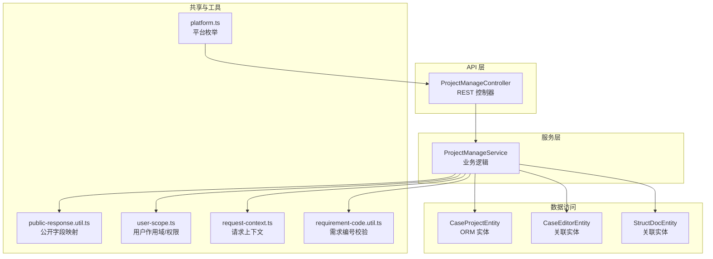
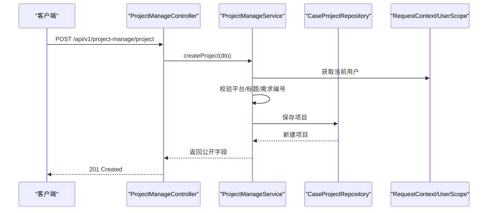
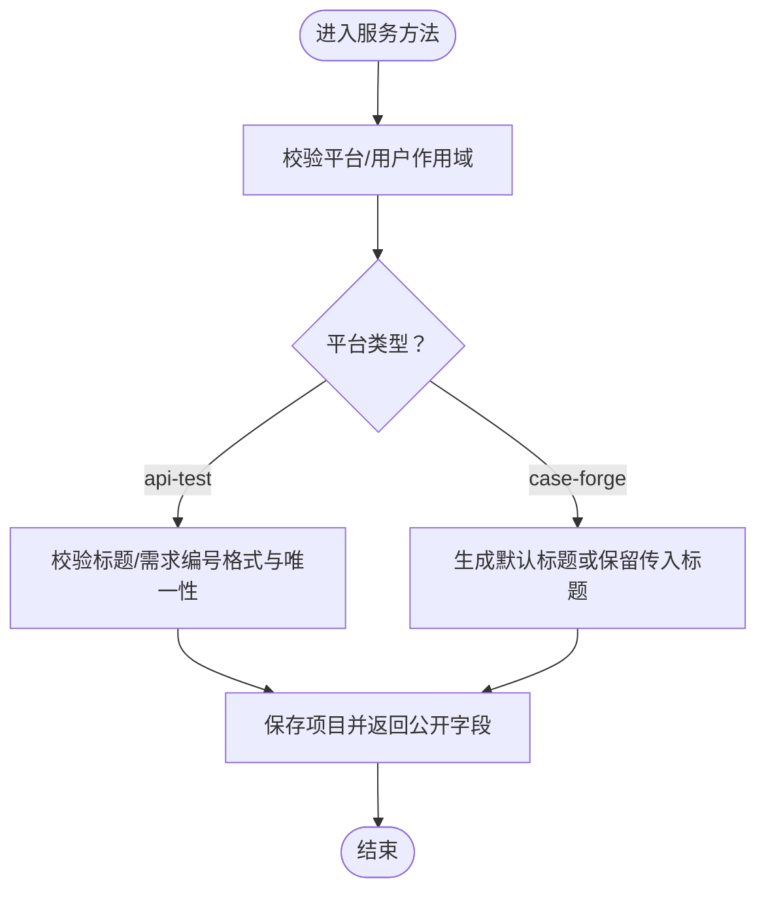
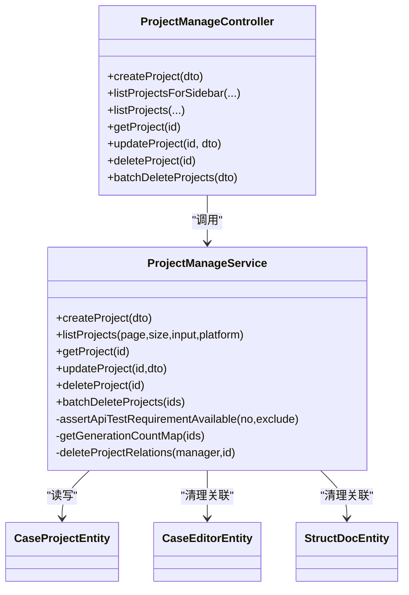

# 项目管理 API

<cite>
**本文引用的文件**
- [apps/api/src/modules/project-manage/controller/project-manage.controller.ts](file://apps/api/src/modules/project-manage/controller/project-manage.controller.ts)
- [apps/api/src/modules/project-manage/service/project-manage.service.ts](file://apps/api/src/modules/project-manage/service/project-manage.service.ts)
- [apps/api/src/modules/project-manage/dto/create-project.dto.ts](file://apps/api/src/modules/project-manage/dto/create-project.dto.ts)
- [apps/api/src/modules/project-manage/dto/update-project.dto.ts](file://apps/api/src/modules/project-manage/dto/update-project.dto.ts)
- [apps/api/src/modules/project-manage/dto/batch-delete-projects.dto.ts](file://apps/api/src/modules/project-manage/dto/batch-delete-projects.dto.ts)
- [apps/api/src/modules/project-manage/entity/project.entity.ts](file://apps/api/src/modules/project-manage/entity/project.entity.ts)
- [apps/api/src/common/audit/user-scope.ts](file://apps/api/src/common/audit/user-scope.ts)
- [apps/api/src/common/audit/request-context.ts](file://apps/api/src/common/audit/request-context.ts)
- [packages/shared/src/platform.ts](file://packages/shared/src/platform.ts)
- [apps/api/src/common/http/public-response.util.ts](file://apps/api/src/common/http/public-response.util.ts)
- [apps/api/src/common/typeorm/database-indexes.util.ts](file://apps/api/src/common/typeorm/database-indexes.util.ts)
- [apps/api/src/app.module.ts](file://apps/api/src/app.module.ts)
- [apps/api/src/bootstrap.ts](file://apps/api/src/bootstrap.ts)
- [apps/api/src/common/audit/user-context.middleware.ts](file://apps/api/src/common/audit/user-context.middleware.ts)
- [apps/api/src/modules/case-editor/util/requirement-code.util.ts](file://apps/api/src/modules/case-editor/util/requirement-code.util.ts)
</cite>

## 目录
1. [简介](#简介)
2. [项目结构](#项目结构)
3. [核心组件](#核心组件)
4. [架构总览](#架构总览)
5. [详细组件分析](#详细组件分析)
6. [依赖关系分析](#依赖关系分析)
7. [性能考量](#性能考量)
8. [故障排查指南](#故障排查指南)
9. [结论](#结论)
10. [附录](#附录)

## 简介
本文件为“项目管理”模块的 API 文档，覆盖以下能力：
- 项目创建、更新、删除、查询（含分页、搜索）
- 项目成员管理与权限分配（基于用户作用域隔离）
- 项目状态控制（通过平台维度与生成计数统计）
- 批量操作（批量删除）
- 项目模板与归档（概念性说明，当前实现不包含专用模板/归档端点）

本 API 采用 RESTful 设计，统一前缀为 /api/v1，控制器位于 project-manage 命名空间下。

## 项目结构
项目管理模块由控制器、服务层、DTO、实体与审计/公共响应工具组成，并通过中间件与全局配置接入用户上下文与权限隔离。

图表来源
- [apps/api/src/modules/project-manage/controller/project-manage.controller.ts:24-137](file://apps/api/src/modules/project-manage/controller/project-manage.controller.ts#L24-L137)
- [apps/api/src/modules/project-manage/service/project-manage.service.ts:44-312](file://apps/api/src/modules/project-manage/service/project-manage.service.ts#L44-L312)
- [apps/api/src/modules/project-manage/entity/project.entity.ts:19-58](file://apps/api/src/modules/project-manage/entity/project.entity.ts#L19-L58)
- [apps/api/src/common/http/public-response.util.ts:16-32](file://apps/api/src/common/http/public-response.util.ts#L16-L32)
- [apps/api/src/common/audit/user-scope.ts:18-89](file://apps/api/src/common/audit/user-scope.ts#L18-L89)
- [apps/api/src/common/audit/request-context.ts:8-56](file://apps/api/src/common/audit/request-context.ts#L8-L56)
- [packages/shared/src/platform.ts:1-3](file://packages/shared/src/platform.ts#L1-L3)
- [apps/api/src/modules/case-editor/util/requirement-code.util.ts:1-31](file://apps/api/src/modules/case-editor/util/requirement-code.util.ts#L1-L31)

章节来源
- [apps/api/src/modules/project-manage/controller/project-manage.controller.ts:24-137](file://apps/api/src/modules/project-manage/controller/project-manage.controller.ts#L24-L137)
- [apps/api/src/modules/project-manage/service/project-manage.service.ts:44-312](file://apps/api/src/modules/project-manage/service/project-manage.service.ts#L44-L312)
- [apps/api/src/modules/project-manage/entity/project.entity.ts:19-58](file://apps/api/src/modules/project-manage/entity/project.entity.ts#L19-L58)
- [apps/api/src/common/http/public-response.util.ts:16-32](file://apps/api/src/common/http/public-response.util.ts#L16-L32)
- [apps/api/src/common/audit/user-scope.ts:18-89](file://apps/api/src/common/audit/user-scope.ts#L18-L89)
- [apps/api/src/common/audit/request-context.ts:8-56](file://apps/api/src/common/audit/request-context.ts#L8-L56)
- [packages/shared/src/platform.ts:1-3](file://packages/shared/src/platform.ts#L1-L3)
- [apps/api/src/modules/case-editor/util/requirement-code.util.ts:1-31](file://apps/api/src/modules/case-editor/util/requirement-code.util.ts#L1-L31)

## 核心组件
- 控制器：提供 REST 端点，负责参数解析、分页查询与调用服务层。
- 服务层：实现业务规则（如平台校验、需求编号格式校验、唯一性约束）、事务处理、关联数据清理、生成次数统计。
- DTO：输入校验与 OpenAPI 描述。
- 实体：持久化模型，包含平台枚举与审计字段。
- 审计与权限：通过请求上下文与用户作用域实现资源隔离与可见性控制。
- 公共响应工具：统一输出字段，屏蔽内部模型细节。

章节来源
- [apps/api/src/modules/project-manage/controller/project-manage.controller.ts:24-137](file://apps/api/src/modules/project-manage/controller/project-manage.controller.ts#L24-L137)
- [apps/api/src/modules/project-manage/service/project-manage.service.ts:44-312](file://apps/api/src/modules/project-manage/service/project-manage.service.ts#L44-L312)
- [apps/api/src/modules/project-manage/dto/create-project.dto.ts:8-32](file://apps/api/src/modules/project-manage/dto/create-project.dto.ts#L8-L32)
- [apps/api/src/modules/project-manage/dto/update-project.dto.ts:7-26](file://apps/api/src/modules/project-manage/dto/update-project.dto.ts#L7-L26)
- [apps/api/src/modules/project-manage/dto/batch-delete-projects.dto.ts:7-14](file://apps/api/src/modules/project-manage/dto/batch-delete-projects.dto.ts#L7-L14)
- [apps/api/src/modules/project-manage/entity/project.entity.ts:19-58](file://apps/api/src/modules/project-manage/entity/project.entity.ts#L19-L58)
- [apps/api/src/common/http/public-response.util.ts:16-32](file://apps/api/src/common/http/public-response.util.ts#L16-L32)
- [apps/api/src/common/audit/user-scope.ts:18-89](file://apps/api/src/common/audit/user-scope.ts#L18-L89)
- [apps/api/src/common/audit/request-context.ts:8-56](file://apps/api/src/common/audit/request-context.ts#L8-L56)

## 架构总览
API 生命周期（以创建为例）：

图表来源
- [apps/api/src/modules/project-manage/controller/project-manage.controller.ts:31-36](file://apps/api/src/modules/project-manage/controller/project-manage.controller.ts#L31-L36)
- [apps/api/src/modules/project-manage/service/project-manage.service.ts:59-93](file://apps/api/src/modules/project-manage/service/project-manage.service.ts#L59-L93)
- [apps/api/src/common/audit/request-context.ts:8-56](file://apps/api/src/common/audit/request-context.ts#L8-L56)
- [apps/api/src/common/audit/user-scope.ts:18-89](file://apps/api/src/common/audit/user-scope.ts#L18-L89)

## 详细组件分析

### 控制器：REST 端点与参数
- 基础路径：/api/v1/project-manage
- 支持平台：case-forge（案例生成）、api-test（接口测试）
- 关键端点
  - POST /project：创建项目
  - GET /projects/sidebar：侧边栏项目列表（含运行次数摘要）
  - GET /projects：分页查询项目（支持关键词模糊搜索）
  - GET /projects/{projectId}：获取项目详情
  - PATCH /projects/{projectId}：更新项目
  - DELETE /projects/{projectId}：删除项目
  - POST /projects/batch-delete：批量删除项目

章节来源
- [apps/api/src/modules/project-manage/controller/project-manage.controller.ts:31-136](file://apps/api/src/modules/project-manage/controller/project-manage.controller.ts#L31-L136)

### 服务层：业务规则与流程
- 创建项目
  - case-forge：标题可选，自动生成默认名称；描述与需求编号可选。
  - api-test：标题必填；需求编号必填且符合 XQxxxx-xxxx-xx 格式，且在当前用户范围内唯一。
  - 审计字段：自动填充 createdBy/modifiedBy。
- 更新项目
  - api-test：标题与需求编号更新时进行相同校验。
  - 其他平台：仅允许更新可选字段。
- 删除与批量删除
  - 单个删除：事务内删除项目及其关联的结构化文档与案例编辑器数据。
  - 批量删除：去重、忽略不存在 ID，逐个执行删除。
- 查询与权限
  - 用户作用域：所有查询均强制加上 createdBy = 当前用户的条件。
  - 可见性：仅能访问自身或系统预置资源。
  - 生成次数：通过关联实体统计每个项目的生成次数。
- 平台校验
  - 通过断言确保项目属于期望平台。

图表来源
- [apps/api/src/modules/project-manage/service/project-manage.service.ts:59-93](file://apps/api/src/modules/project-manage/service/project-manage.service.ts#L59-L93)
- [apps/api/src/modules/project-manage/service/project-manage.service.ts:173-212](file://apps/api/src/modules/project-manage/service/project-manage.service.ts#L173-L212)
- [apps/api/src/common/audit/user-scope.ts:18-89](file://apps/api/src/common/audit/user-scope.ts#L18-L89)

章节来源
- [apps/api/src/modules/project-manage/service/project-manage.service.ts:59-212](file://apps/api/src/modules/project-manage/service/project-manage.service.ts#L59-L212)
- [apps/api/src/modules/project-manage/service/project-manage.service.ts:238-281](file://apps/api/src/modules/project-manage/service/project-manage.service.ts#L238-L281)
- [apps/api/src/modules/project-manage/service/project-manage.service.ts:283-311](file://apps/api/src/modules/project-manage/service/project-manage.service.ts#L283-L311)

### 数据模型与索引
- 实体字段
  - id、title、description、platform、requirementNo、createdBy、modifiedBy、createdAt、updatedAt
  - 平台枚举：case-forge、api-test
- 索引
  - 多列索引：platform+updated_at、createdBy+platform+updated_at、platform+requirementNo
  - 用于提升查询与唯一性校验效率

章节来源
- [apps/api/src/modules/project-manage/entity/project.entity.ts:19-58](file://apps/api/src/modules/project-manage/entity/project.entity.ts#L19-L58)
- [apps/api/src/common/typeorm/database-indexes.util.ts:78-88](file://apps/api/src/common/typeorm/database-indexes.util.ts#L78-L88)

### DTO 与输入校验
- 创建项目
  - title、description、requirementNo 可选；platform 可选，默认 case-forge
  - 标题最大长度 120；描述最大 800；需求编号最大 64；platform 必须在枚举内
- 更新项目
  - 同创建，但均为可选字段
- 批量删除
  - ids 数组非空，元素为字符串 ID

章节来源
- [apps/api/src/modules/project-manage/dto/create-project.dto.ts:8-32](file://apps/api/src/modules/project-manage/dto/create-project.dto.ts#L8-L32)
- [apps/api/src/modules/project-manage/dto/update-project.dto.ts:7-26](file://apps/api/src/modules/project-manage/dto/update-project.dto.ts#L7-L26)
- [apps/api/src/modules/project-manage/dto/batch-delete-projects.dto.ts:7-14](file://apps/api/src/modules/project-manage/dto/batch-delete-projects.dto.ts#L7-L14)

### 权限与审计
- 用户上下文
  - 从路径、请求头 x-user-name 或 query 中解析用户名，注入到异步存储
  - 默认 system
- 用户作用域
  - 查询自动追加 createdBy = 当前用户
  - 断言资源归属或可见性，避免越权与信息泄露
- 审计字段
  - 创建/更新时自动填充 createdBy/modifiedBy

章节来源
- [apps/api/src/bootstrap.ts:24-31](file://apps/api/src/bootstrap.ts#L24-L31)
- [apps/api/src/common/audit/user-context.middleware.ts:6-19](file://apps/api/src/common/audit/user-context.middleware.ts#L6-L19)
- [apps/api/src/common/audit/request-context.ts:8-56](file://apps/api/src/common/audit/request-context.ts#L8-L56)
- [apps/api/src/common/audit/user-scope.ts:18-89](file://apps/api/src/common/audit/user-scope.ts#L18-L89)

### 公共响应与字段映射
- toPublicProject：将实体映射为对外公开字段，包含生成次数可选字段
- 统一输出：隐藏内部实现细节，保证前后端契约稳定

章节来源
- [apps/api/src/common/http/public-response.util.ts:16-32](file://apps/api/src/common/http/public-response.util.ts#L16-L32)

### 需求编号与格式校验
- 格式：XQxxxx-xxxx-xx（大小写不敏感）
- 提取：从文本中提取首个匹配的编号
- 校验：在 api-test 平台更新/创建时强制校验唯一性

章节来源
- [apps/api/src/modules/case-editor/util/requirement-code.util.ts:1-31](file://apps/api/src/modules/case-editor/util/requirement-code.util.ts#L1-L31)
- [apps/api/src/modules/project-manage/service/project-manage.service.ts:25-34](file://apps/api/src/modules/project-manage/service/project-manage.service.ts#L25-L34)
- [apps/api/src/modules/project-manage/service/project-manage.service.ts:214-232](file://apps/api/src/modules/project-manage/service/project-manage.service.ts#L214-L232)

## 依赖关系分析

图表来源
- [apps/api/src/modules/project-manage/controller/project-manage.controller.ts:24-137](file://apps/api/src/modules/project-manage/controller/project-manage.controller.ts#L24-L137)
- [apps/api/src/modules/project-manage/service/project-manage.service.ts:44-312](file://apps/api/src/modules/project-manage/service/project-manage.service.ts#L44-L312)
- [apps/api/src/modules/project-manage/entity/project.entity.ts:19-58](file://apps/api/src/modules/project-manage/entity/project.entity.ts#L19-L58)

章节来源
- [apps/api/src/modules/project-manage/controller/project-manage.controller.ts:24-137](file://apps/api/src/modules/project-manage/controller/project-manage.controller.ts#L24-L137)
- [apps/api/src/modules/project-manage/service/project-manage.service.ts:44-312](file://apps/api/src/modules/project-manage/service/project-manage.service.ts#L44-L312)

## 性能考量
- 索引策略
  - 为 case_project 的平台、更新时间、创建者组合建立索引，优化分页与过滤
  - 为平台+需求编号建立唯一性约束，加速 api-test 平台的唯一性校验
- 查询优化
  - applyUserScope 强制用户隔离，避免全表扫描
  - 分页参数校验，防止异常值导致数据库压力
- 事务与批量
  - 删除操作使用事务，保证一致性
  - 批量删除去重并逐条处理，避免重复 IO

章节来源
- [apps/api/src/common/typeorm/database-indexes.util.ts:78-88](file://apps/api/src/common/typeorm/database-indexes.util.ts#L78-L88)
- [apps/api/src/modules/project-manage/service/project-manage.service.ts:110-150](file://apps/api/src/modules/project-manage/service/project-manage.service.ts#L110-L150)
- [apps/api/src/modules/project-manage/service/project-manage.service.ts:238-281](file://apps/api/src/modules/project-manage/service/project-manage.service.ts#L238-L281)

## 故障排查指南
- 400 错误
  - 需求编号格式不正确：需满足 XQxxxx-xxxx-xx，大小写不敏感
  - api-test 平台缺少标题或需求编号
  - 需求编号重复：同一用户范围内不可重复
- 404 错误
  - 资源不存在或不属于当前用户（通过用户作用域断言）
- 409/冲突
  - 批量删除时忽略不存在 ID，不会产生冲突；若出现其他并发冲突，建议重试
- 参数校验
  - 分页参数 page/size 必须为正数；输入关键词为空时不会附加搜索条件
- 日志与上下文
  - 通过访问日志中间件与请求上下文定位问题

章节来源
- [apps/api/src/modules/project-manage/service/project-manage.service.ts:25-34](file://apps/api/src/modules/project-manage/service/project-manage.service.ts#L25-L34)
- [apps/api/src/modules/project-manage/service/project-manage.service.ts:61-71](file://apps/api/src/modules/project-manage/service/project-manage.service.ts#L61-L71)
- [apps/api/src/modules/project-manage/service/project-manage.service.ts:179-212](file://apps/api/src/modules/project-manage/service/project-manage.service.ts#L179-L212)
- [apps/api/src/modules/project-manage/service/project-manage.service.ts:214-232](file://apps/api/src/modules/project-manage/service/project-manage.service.ts#L214-L232)
- [apps/api/src/common/audit/user-scope.ts:48-75](file://apps/api/src/common/audit/user-scope.ts#L48-L75)
- [apps/api/src/common/audit/user-context.middleware.ts:6-19](file://apps/api/src/common/audit/user-context.middleware.ts#L6-L19)

## 结论
项目管理模块提供了完善的项目 CRUD、权限隔离与批量操作能力。通过平台维度与用户作用域，确保资源安全与可见性；通过索引与事务优化，保障查询与删除性能。当前未提供专用的“项目模板”与“项目归档”端点，如需扩展可在现有服务层基础上增加相应 DTO、实体与控制器端点。

## 附录

### API 端点一览（按功能）
- 项目创建
  - 方法：POST
  - 路径：/api/v1/project-manage/project
  - 认证：依据请求上下文注入的用户名
  - 平台差异：api-test 平台要求标题与需求编号
  - 输入校验：参考创建 DTO
- 项目列表（侧边栏摘要）
  - 方法：GET
  - 路径：/api/v1/project-manage/projects/sidebar
  - 查询参数：platform、page、size、input
  - 输出：包含生成次数摘要
- 项目列表（完整分页）
  - 方法：GET
  - 路径：/api/v1/project-manage/projects
  - 查询参数：input、page、size、platform
- 项目详情
  - 方法：GET
  - 路径：/api/v1/project-manage/projects/{projectId}
- 项目更新
  - 方法：PATCH
  - 路径：/api/v1/project-manage/projects/{projectId}
  - 平台差异：api-test 平台更新标题/需求编号时进行格式与唯一性校验
- 项目删除
  - 方法：DELETE
  - 路径：/api/v1/project-manage/projects/{projectId}
  - 行为：事务内删除项目及其关联数据
- 批量删除
  - 方法：POST
  - 路径：/api/v1/project-manage/projects/batch-delete
  - 输入：ids 数组（去重、忽略空值）

章节来源
- [apps/api/src/modules/project-manage/controller/project-manage.controller.ts:31-136](file://apps/api/src/modules/project-manage/controller/project-manage.controller.ts#L31-L136)
- [apps/api/src/modules/project-manage/dto/create-project.dto.ts:8-32](file://apps/api/src/modules/project-manage/dto/create-project.dto.ts#L8-L32)
- [apps/api/src/modules/project-manage/dto/update-project.dto.ts:7-26](file://apps/api/src/modules/project-manage/dto/update-project.dto.ts#L7-L26)
- [apps/api/src/modules/project-manage/dto/batch-delete-projects.dto.ts:7-14](file://apps/api/src/modules/project-manage/dto/batch-delete-projects.dto.ts#L7-L14)

### 数据验证规则与权限检查清单
- 输入校验
  - 字符串字段最大长度限制
  - platform 枚举校验
  - ids 数组非空校验
- 平台与业务规则
  - api-test：标题必填；需求编号必填且唯一
  - 需求编号格式：XQxxxx-xxxx-xx
- 权限与可见性
  - 用户作用域：所有查询/操作均绑定 createdBy
  - 断言：资源归属或可见性，避免信息泄露

章节来源
- [apps/api/src/modules/project-manage/dto/create-project.dto.ts:8-32](file://apps/api/src/modules/project-manage/dto/create-project.dto.ts#L8-L32)
- [apps/api/src/modules/project-manage/dto/update-project.dto.ts:7-26](file://apps/api/src/modules/project-manage/dto/update-project.dto.ts#L7-L26)
- [apps/api/src/modules/project-manage/dto/batch-delete-projects.dto.ts:7-14](file://apps/api/src/modules/project-manage/dto/batch-delete-projects.dto.ts#L7-L14)
- [apps/api/src/modules/project-manage/service/project-manage.service.ts:25-34](file://apps/api/src/modules/project-manage/service/project-manage.service.ts#L25-L34)
- [apps/api/src/modules/project-manage/service/project-manage.service.ts:61-71](file://apps/api/src/modules/project-manage/service/project-manage.service.ts#L61-L71)
- [apps/api/src/common/audit/user-scope.ts:18-89](file://apps/api/src/common/audit/user-scope.ts#L18-L89)

### 实际使用示例与集成指南
- 集成步骤
  - 在请求路径中携带用户名（或通过请求头 x-user-name 或 query），以便注入用户上下文
  - 使用 /api/v1/project-manage/projects/sidebar 获取侧边栏项目列表（含生成次数）
  - 使用 /api/v1/project-manage/projects 查询项目列表并支持关键词搜索
  - 使用 /api/v1/project-manage/project 创建项目（api-test 平台需提供标题与需求编号）
  - 使用 /api/v1/project-manage/projects/{projectId} 更新或删除项目
  - 使用 /api/v1/project-manage/projects/batch-delete 执行批量删除
- 注意事项
  - api-test 平台的需求编号需满足格式并保持唯一
  - 分页参数 page/size 必须为正数
  - 删除操作会级联清理关联数据，谨慎使用

章节来源
- [apps/api/src/bootstrap.ts:24-31](file://apps/api/src/bootstrap.ts#L24-L31)
- [apps/api/src/common/audit/user-context.middleware.ts:6-19](file://apps/api/src/common/audit/user-context.middleware.ts#L6-L19)
- [apps/api/src/modules/project-manage/controller/project-manage.controller.ts:39-105](file://apps/api/src/modules/project-manage/controller/project-manage.controller.ts#L39-L105)
- [apps/api/src/modules/project-manage/service/project-manage.service.ts:59-93](file://apps/api/src/modules/project-manage/service/project-manage.service.ts#L59-L93)
- [apps/api/src/modules/project-manage/service/project-manage.service.ts:173-212](file://apps/api/src/modules/project-manage/service/project-manage.service.ts#L173-L212)
- [apps/api/src/modules/project-manage/service/project-manage.service.ts:238-281](file://apps/api/src/modules/project-manage/service/project-manage.service.ts#L238-L281)