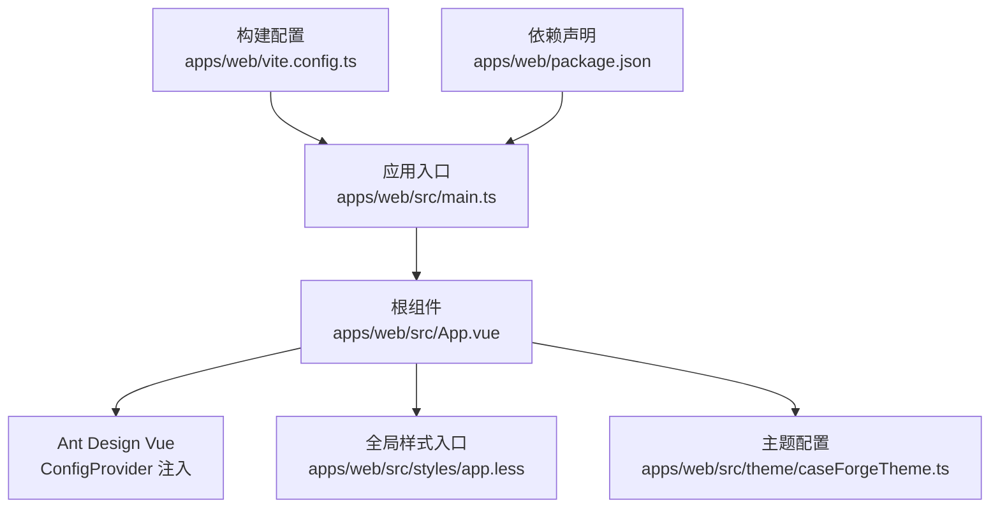
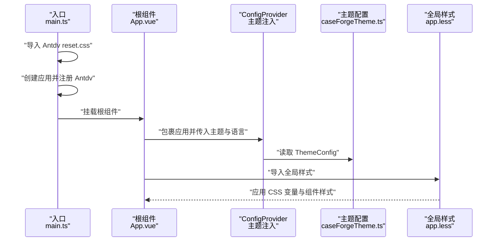
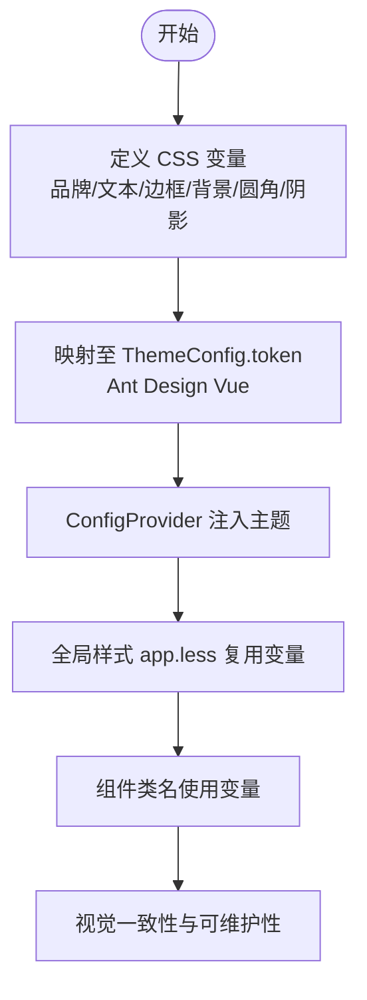
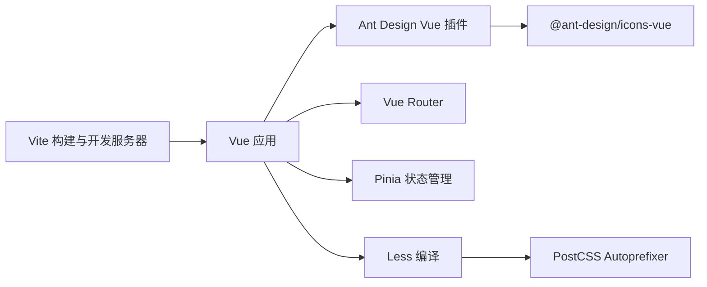

# UI 主题与样式

<cite>
**本文引用的文件**
- [apps/web/src/styles/app.less](file://apps/web/src/styles/app.less)
- [apps/web/src/theme/caseForgeTheme.ts](file://apps/web/src/theme/caseForgeTheme.ts)
- [apps/web/src/main.ts](file://apps/web/src/main.ts)
- [apps/web/src/App.vue](file://apps/web/src/App.vue)
- [apps/web/package.json](file://apps/web/package.json)
- [apps/web/vite.config.ts](file://apps/web/vite.config.ts)
</cite>

## 目录
1. [引言](#引言)
2. [项目结构](#项目结构)
3. [核心组件](#核心组件)
4. [架构总览](#架构总览)
5. [详细组件分析](#详细组件分析)
6. [依赖关系分析](#依赖关系分析)
7. [性能考量](#性能考量)
8. [故障排查指南](#故障排查指南)
9. [结论](#结论)
10. [附录](#附录)

## 引言
本文件面向 CaseForge 前端工程的 UI 主题与样式体系，系统性阐述 Ant Design Vue 的集成与定制策略，包括主题变量配置、颜色系统与字体规范、Less 预处理与样式模块化实践、以及响应式设计与暗色模式的实现路径建议。同时给出样式命名规范、组件样式隔离与性能优化指南，并总结设计系统建立与视觉一致性保障方法。

## 项目结构
前端位于 apps/web，采用 Vite + Vue 3 + TypeScript 技术栈，Ant Design Vue 作为基础组件库，Less 用于样式开发，全局主题通过 ConfigProvider 注入。关键位置如下：
- 样式入口与全局变量：apps/web/src/styles/app.less
- 主题配置：apps/web/src/theme/caseForgeTheme.ts
- 应用入口与插件注册：apps/web/src/main.ts
- 根组件注入主题：apps/web/src/App.vue
- 构建与依赖：apps/web/package.json、apps/web/vite.config.ts

图表来源
- [apps/web/src/main.ts:1-20](file://apps/web/src/main.ts#L1-L20)
- [apps/web/src/App.vue:1-39](file://apps/web/src/App.vue#L1-L39)
- [apps/web/src/styles/app.less:1-800](file://apps/web/src/styles/app.less#L1-L800)
- [apps/web/src/theme/caseForgeTheme.ts:1-39](file://apps/web/src/theme/caseForgeTheme.ts#L1-L39)
- [apps/web/vite.config.ts:1-71](file://apps/web/vite.config.ts#L1-L71)
- [apps/web/package.json:1-46](file://apps/web/package.json#L1-L46)

章节来源
- [apps/web/src/main.ts:1-20](file://apps/web/src/main.ts#L1-L20)
- [apps/web/src/App.vue:1-39](file://apps/web/src/App.vue#L1-L39)
- [apps/web/src/styles/app.less:1-800](file://apps/web/src/styles/app.less#L1-L800)
- [apps/web/src/theme/caseForgeTheme.ts:1-39](file://apps/web/src/theme/caseForgeTheme.ts#L1-L39)
- [apps/web/package.json:1-46](file://apps/web/package.json#L1-L46)
- [apps/web/vite.config.ts:1-71](file://apps/web/vite.config.ts#L1-L71)

## 核心组件
- 全局样式与变量
  - 使用 CSS 自定义属性集中管理品牌色、文本色、边框色、背景色、圆角半径与阴影等设计令牌，确保与主题配置一致。
  - 在 body、Antd 容器与业务组件类名上广泛使用这些变量，形成统一的视觉基线。
- 主题配置
  - 通过 Ant Design Vue 的 ThemeConfig 提供 token 层级的主题变量，覆盖主色、链接色、错误/成功/警告色、文本层级、边框与背景、圆角、高度、字号与字体族、阴影与 z-index 等。
  - 该配置与 app.less 中的 CSS 变量保持一一对应，确保运行时与静态样式的一致性。
- 应用入口与注入
  - 在 main.ts 中引入 ant-design-vue/reset.css 并挂载 Antd 插件。
  - 在 App.vue 中通过 a-config-provider 将主题与语言包注入根组件，使所有子组件继承主题上下文。

章节来源
- [apps/web/src/styles/app.less:1-800](file://apps/web/src/styles/app.less#L1-L800)
- [apps/web/src/theme/caseForgeTheme.ts:1-39](file://apps/web/src/theme/caseForgeTheme.ts#L1-L39)
- [apps/web/src/main.ts:1-20](file://apps/web/src/main.ts#L1-L20)
- [apps/web/src/App.vue:1-39](file://apps/web/src/App.vue#L1-L39)

## 架构总览
下图展示从入口到主题生效的关键调用链与样式加载顺序：

图表来源
- [apps/web/src/main.ts:1-20](file://apps/web/src/main.ts#L1-L20)
- [apps/web/src/App.vue:1-39](file://apps/web/src/App.vue#L1-L39)
- [apps/web/src/theme/caseForgeTheme.ts:1-39](file://apps/web/src/theme/caseForgeTheme.ts#L1-L39)
- [apps/web/src/styles/app.less:1-800](file://apps/web/src/styles/app.less#L1-L800)

## 详细组件分析

### 主题变量与颜色系统
- 设计令牌
  - 品牌主色与悬停态、柔和背景、边框色、危险色、文本层级、边框与输入边框、画布与表面色、圆角与阴影等均以 CSS 变量形式集中定义。
  - 这些变量在 body、Antd 容器、导航栏、侧边栏、表单控件与卡片等处被广泛复用，确保视觉一致性。
- 主题 Token
  - 主题配置覆盖 Ant Design Vue 的 token 层级，包括主色、链接色、错误/成功/警告、文本层级、边框与背景、圆角、高度、字号、字体族、阴影与 z-index。
  - 该配置与 CSS 变量一一对应，既满足运行时动态主题能力，也保证静态样式层的稳定表现。

图表来源
- [apps/web/src/styles/app.less:1-800](file://apps/web/src/styles/app.less#L1-L800)
- [apps/web/src/theme/caseForgeTheme.ts:1-39](file://apps/web/src/theme/caseForgeTheme.ts#L1-L39)
- [apps/web/src/App.vue:1-39](file://apps/web/src/App.vue#L1-L39)

章节来源
- [apps/web/src/styles/app.less:1-800](file://apps/web/src/styles/app.less#L1-L800)
- [apps/web/src/theme/caseForgeTheme.ts:1-39](file://apps/web/src/theme/caseForgeTheme.ts#L1-L39)

### 字体规范与排版
- 字体族
  - 在主题 token 与全局样式中均声明了跨平台字体栈，优先使用 Inter，回退到系统无衬线字体与中文字体，确保在不同平台与语言环境下的一致阅读体验。
- 字号与行高
  - 主题 token 中定义了基础字号与控制高度，配合组件库的默认排版规则，形成清晰的信息层级与节奏感。

章节来源
- [apps/web/src/theme/caseForgeTheme.ts:32-34](file://apps/web/src/theme/caseForgeTheme.ts#L32-L34)
- [apps/web/src/styles/app.less:43-53](file://apps/web/src/styles/app.less#L43-L53)

### Less 预处理与样式模块化
- 预处理工具
  - 项目使用 Less 作为预处理器，结合 Vite 的构建流程进行编译与打包。
- 样式组织
  - 全局样式集中在 app.less，按功能域拆分选择器（如平台顶栏、侧边栏、工作区、通知等），并通过语义化类名提升可读性与可维护性。
- 变量与混合
  - 通过 CSS 变量与 Less 变量协同，减少重复定义，提高主题切换与扩展的灵活性。

章节来源
- [apps/web/package.json:28-36](file://apps/web/package.json#L28-L36)
- [apps/web/src/styles/app.less:1-800](file://apps/web/src/styles/app.less#L1-L800)

### 响应式设计与布局
- 布局网格
  - 使用 CSS Grid 与 Flex 混合布局，针对不同区域（侧栏、主工作区、面板）定义网格模板与间距，确保在桌面端与大屏设备上的良好呈现。
- 沉浸式模式
  - 通过特定 body 类名与条件渲染，实现沉浸式场景下的顶栏与侧栏隐藏逻辑，避免遮挡全屏编辑区按钮与操作面板。

章节来源
- [apps/web/src/styles/app.less:284-305](file://apps/web/src/styles/app.less#L284-L305)
- [apps/web/src/styles/app.less:292-296](file://apps/web/src/styles/app.less#L292-L296)

### 暗色模式与多主题支持（策略建议）
- 当前状态
  - 项目当前以浅色主题为主，未见内置暗色模式或多主题切换逻辑。
- 实施建议
  - 使用 CSS 变量作为主题开关的唯一真相源，通过切换根元素或全局类名，驱动变量值的批量替换，从而实现明/暗或多套品牌主题的无缝切换。
  - 在主题配置层增加“暗色”变体，同步更新 ThemeConfig.token 中的颜色与背景映射，确保组件在不同模式下保持对比度与可读性。
  - 对于第三方组件库的特殊状态（如聚焦环、禁用态），在全局样式中补充针对性覆盖，避免模式切换后出现视觉割裂。

（本节为策略建议，不直接分析具体文件）

### 样式命名规范与组件样式隔离
- 命名规范
  - 采用 BEM 或近似 BEM 的命名方式（如 .platform-layout、.project-sidebar、.stage-item），结合语义化前缀区分功能域，降低冲突概率。
- 样式隔离
  - 通过 Antd 的 ConfigProvider 作用域限定主题影响范围；在业务组件中尽量使用局部样式与类名组合，避免全局污染。
  - 对需要穿透样式的场景，明确作用域边界并在组件文档中注明，便于后续维护。

章节来源
- [apps/web/src/styles/app.less:108-131](file://apps/web/src/styles/app.less#L108-L131)
- [apps/web/src/styles/app.less:306-316](file://apps/web/src/styles/app.less#L306-L316)
- [apps/web/src/styles/app.less:665-735](file://apps/web/src/styles/app.less#L665-L735)

### CSS-in-JS 方案（策略建议）
- 当前状态
  - 项目主要采用 Less + 全局样式，未发现 CSS-in-JS 的直接实现。
- 实施建议
  - 对于动态主题、条件样式与细粒度状态样式，可在局部组件中引入轻量 CSS-in-JS（如内联样式或基于 CSS 变量的动态计算），但需注意与全局样式的协调与性能权衡。
  - 对于全局主题切换，仍建议以 CSS 变量与 ConfigProvider 为核心方案，CSS-in-JS 更适合局部增强。

（本节为策略建议，不直接分析具体文件）

## 依赖关系分析
- 构建与运行
  - Vite 负责开发服务器、热更新与打包；Vue 与 Antd 插件在入口注册；Less 与 PostCSS 生态用于样式处理。
- 依赖清单
  - ant-design-vue、@ant-design/icons-vue、vue、vue-router、pinia 等构成前端核心生态；Less 与 autoprefixer 用于样式处理。

图表来源
- [apps/web/package.json:15-36](file://apps/web/package.json#L15-L36)
- [apps/web/vite.config.ts:1-71](file://apps/web/vite.config.ts#L1-L71)

章节来源
- [apps/web/package.json:1-46](file://apps/web/package.json#L1-L46)
- [apps/web/vite.config.ts:1-71](file://apps/web/vite.config.ts#L1-L71)

## 性能考量
- 样式体积控制
  - 合理拆分全局样式与组件局部样式，避免重复定义与冗余规则；对高频使用的变量集中管理，减少编译与传输成本。
- 动态主题切换
  - 使用 CSS 变量作为主题切换的唯一真相源，避免重绘与回流；对复杂过渡效果使用 transform 与 opacity，减少布局抖动。
- 构建优化
  - 利用 Vite 的依赖预构建与按需加载；在开发阶段启用合适的缓存与热更新策略，缩短等待时间。

（本节提供通用指导，不直接分析具体文件）

## 故障排查指南
- 主题不生效
  - 确认已在入口正确引入 ant-design-vue/reset.css，并在根组件通过 a-config-provider 注入主题与语言包。
  - 检查主题配置中的 token 是否与全局 CSS 变量保持一致，避免运行时与静态样式冲突。
- 样式覆盖异常
  - 检查组件类名是否具备足够优先级；避免使用过多 !important；必要时通过 ConfigProvider 的组件 token 或局部样式进行精准覆盖。
- 沉浸式模式遮挡问题
  - 确认 body 上的沉浸式类名与样式条件判断逻辑正确；检查 z-index 设置与定位层级，避免被其他元素覆盖。

章节来源
- [apps/web/src/main.ts:1-20](file://apps/web/src/main.ts#L1-L20)
- [apps/web/src/App.vue:1-39](file://apps/web/src/App.vue#L1-L39)
- [apps/web/src/styles/app.less:292-296](file://apps/web/src/styles/app.less#L292-L296)

## 结论
本项目通过 CSS 变量与 Ant Design Vue 的 ThemeConfig 形成统一的主题基座，配合 Less 的模块化组织与全局样式入口，实现了清晰、可维护且可扩展的 UI 样式体系。建议在未来版本中引入暗色模式或多主题切换机制，并持续完善命名规范与样式隔离策略，以进一步提升设计系统的稳定性与可演进性。

## 附录
- 关键实现路径参考
  - 全局样式入口与变量：[apps/web/src/styles/app.less](file://apps/web/src/styles/app.less)
  - 主题配置：[apps/web/src/theme/caseForgeTheme.ts](file://apps/web/src/theme/caseForgeTheme.ts)
  - 应用入口与插件注册：[apps/web/src/main.ts](file://apps/web/src/main.ts)
  - 根组件注入主题：[apps/web/src/App.vue](file://apps/web/src/App.vue)
  - 构建与依赖：[apps/web/package.json](file://apps/web/package.json)、[apps/web/vite.config.ts](file://apps/web/vite.config.ts)