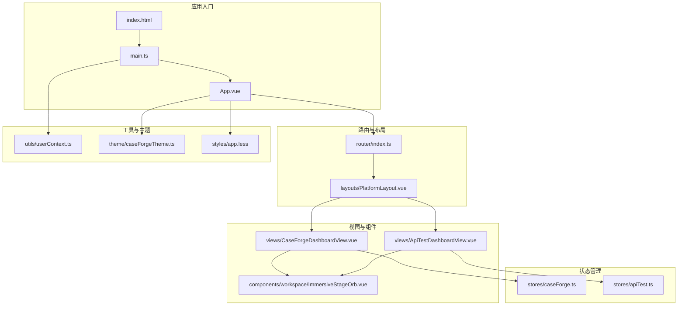
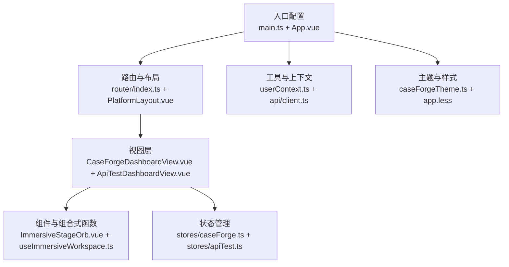
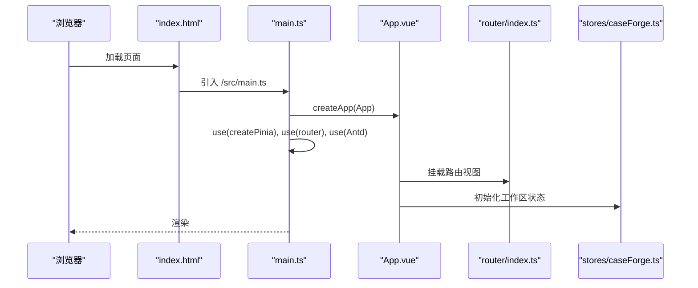
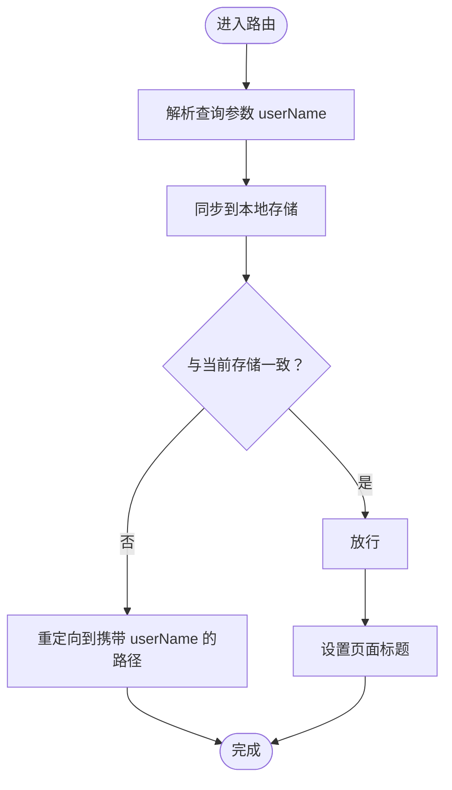
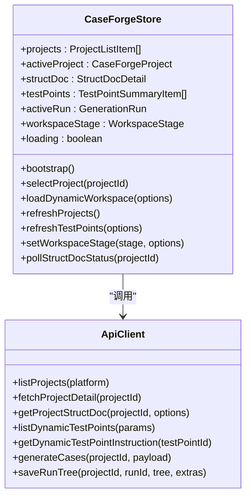
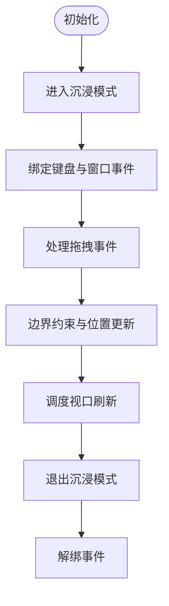
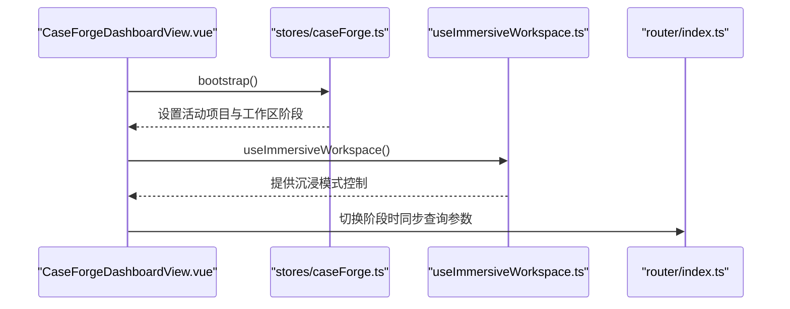
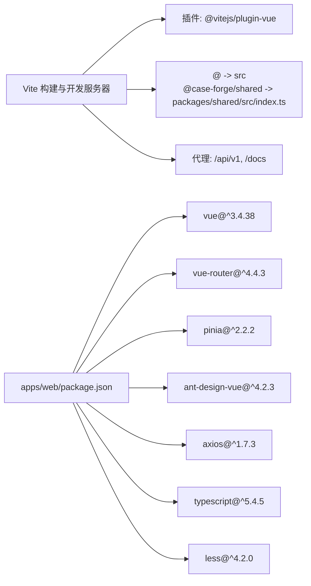

# Vue 3 架构设计

<cite>
**本文档引用的文件**
- [apps/web/package.json](file://apps/web/package.json)
- [apps/web/vite.config.ts](file://apps/web/vite.config.ts)
- [apps/web/src/main.ts](file://apps/web/src/main.ts)
- [apps/web/src/App.vue](file://apps/web/src/App.vue)
- [apps/web/src/router/index.ts](file://apps/web/src/router/index.ts)
- [apps/web/src/layouts/PlatformLayout.vue](file://apps/web/src/layouts/PlatformLayout.vue)
- [apps/web/src/theme/caseForgeTheme.ts](file://apps/web/src/theme/caseForgeTheme.ts)
- [apps/web/src/stores/caseForge.ts](file://apps/web/src/stores/caseForge.ts)
- [apps/web/src/composables/useImmersiveWorkspace.ts](file://apps/web/src/composables/useImmersiveWorkspace.ts)
- [apps/web/src/utils/userContext.ts](file://apps/web/src/utils/userContext.ts)
- [apps/web/src/constants/platform.ts](file://apps/web/src/constants/platform.ts)
- [apps/web/src/styles/app.less](file://apps/web/src/styles/app.less)
- [apps/web/src/api/client.ts](file://apps/web/src/api/client.ts)
- [apps/web/src/views/CaseForgeDashboardView.vue](file://apps/web/src/views/CaseForgeDashboardView.vue)
- [apps/web/src/views/ApiTestDashboardView.vue](file://apps/web/src/views/ApiTestDashboardView.vue)
- [apps/web/index.html](file://apps/web/index.html)
- [apps/web/tsconfig.json](file://apps/web/tsconfig.json)
</cite>

## 目录
1. [简介](#简介)
2. [项目结构](#项目结构)
3. [核心组件](#核心组件)
4. [架构总览](#架构总览)
5. [详细组件分析](#详细组件分析)
6. [依赖关系分析](#依赖关系分析)
7. [性能考虑](#性能考虑)
8. [故障排除指南](#故障排除指南)
9. [结论](#结论)
10. [附录](#附录)

## 简介
本项目采用 Vue 3 Composition API 构建双平台前端应用，围绕“智能生成案例平台”和“智能接口测试平台”两大业务域，通过模块化架构、清晰的路由与布局系统、完善的状态管理与工具函数，实现高内聚、低耦合的前端工程化体系。Vite 作为构建工具与开发服务器，结合 TypeScript 提供强类型保障，Ant Design Vue 提供企业级 UI 组件库，配合 Pinia 实现集中式状态管理。

## 项目结构
前端应用位于 apps/web 目录，采用按功能域分层的组织方式：
- 应用入口与全局配置：main.ts、App.vue、index.html
- 路由与布局：router/index.ts、layouts/PlatformLayout.vue
- 视图与组件：views/、components/（示例：CaseForgeDashboardView.vue、ApiTestDashboardView.vue）
- 状态管理：stores/（示例：caseForge.ts、apiTest.ts）
- 工具与组合式函数：utils/、composables/（示例：useImmersiveWorkspace.ts、userContext.ts）
- 样式与主题：styles/app.less、theme/caseForgeTheme.ts
- 类型与配置：types/、tsconfig.json
- 构建配置：vite.config.ts、package.json

**图表来源**
- [apps/web/index.html:1-15](file://apps/web/index.html#L1-L15)
- [apps/web/src/main.ts:1-20](file://apps/web/src/main.ts#L1-L20)
- [apps/web/src/App.vue:1-13](file://apps/web/src/App.vue#L1-L13)
- [apps/web/src/router/index.ts:1-65](file://apps/web/src/router/index.ts#L1-L65)
- [apps/web/src/layouts/PlatformLayout.vue:1-38](file://apps/web/src/layouts/PlatformLayout.vue#L1-L38)
- [apps/web/src/views/CaseForgeDashboardView.vue:1-139](file://apps/web/src/views/CaseForgeDashboardView.vue#L1-L139)
- [apps/web/src/views/ApiTestDashboardView.vue:1-190](file://apps/web/src/views/ApiTestDashboardView.vue#L1-L190)
- [apps/web/src/stores/caseForge.ts:1-1602](file://apps/web/src/stores/caseForge.ts#L1-L1602)
- [apps/web/src/utils/userContext.ts:1-42](file://apps/web/src/utils/userContext.ts#L1-L42)
- [apps/web/src/theme/caseForgeTheme.ts:1-39](file://apps/web/src/theme/caseForgeTheme.ts#L1-L39)
- [apps/web/src/styles/app.less:1-800](file://apps/web/src/styles/app.less#L1-L800)

**章节来源**
- [apps/web/package.json:1-36](file://apps/web/package.json#L1-L36)
- [apps/web/vite.config.ts:1-71](file://apps/web/vite.config.ts#L1-L71)
- [apps/web/tsconfig.json:1-23](file://apps/web/tsconfig.json#L1-L23)

## 核心组件
- 应用入口与初始化：在 main.ts 中创建应用实例，挂载 Pinia、Vue Router、Ant Design Vue，并初始化用户上下文与全局消息配置。
- 主组件与主题：App.vue 包裹 ConfigProvider，注入自定义主题配置，确保全局样式与语言环境一致。
- 路由与导航：router/index.ts 定义历史模式路由，配置两个平台的嵌套路由与标题同步逻辑，前置守卫统一同步用户标识。
- 平台布局：PlatformLayout.vue 提供顶部导航与平台切换，根据当前路由计算激活平台并携带用户参数。
- 用户上下文：userContext.ts 负责从 URL 解析用户标识、持久化到本地存储，并在路由跳转时同步。
- 主题与样式：caseForgeTheme.ts 定义 Ant Design 主题令牌，app.less 提供全局样式与布局基线。
- 状态管理：caseForge.ts 使用 Pinia 定义大型工作区的状态、Getters 与 Actions，涵盖项目、结构化文档、测试要点、案例树等。
- 组合式函数：useImmersiveWorkspace.ts 提供沉浸式工作区的 Orb 控件与视口刷新逻辑，支持键盘事件与拖拽交互。
- API 客户端：client.ts 封装 axios，统一添加用户标识与基础路径，暴露各类业务接口方法。

**章节来源**
- [apps/web/src/main.ts:1-20](file://apps/web/src/main.ts#L1-L20)
- [apps/web/src/App.vue:1-13](file://apps/web/src/App.vue#L1-L13)
- [apps/web/src/router/index.ts:1-65](file://apps/web/src/router/index.ts#L1-L65)
- [apps/web/src/layouts/PlatformLayout.vue:1-38](file://apps/web/src/layouts/PlatformLayout.vue#L1-L38)
- [apps/web/src/utils/userContext.ts:1-42](file://apps/web/src/utils/userContext.ts#L1-L42)
- [apps/web/src/theme/caseForgeTheme.ts:1-39](file://apps/web/src/theme/caseForgeTheme.ts#L1-L39)
- [apps/web/src/styles/app.less:1-800](file://apps/web/src/styles/app.less#L1-L800)
- [apps/web/src/stores/caseForge.ts:1-1602](file://apps/web/src/stores/caseForge.ts#L1-L1602)
- [apps/web/src/composables/useImmersiveWorkspace.ts:1-175](file://apps/web/src/composables/useImmersiveWorkspace.ts#L1-L175)
- [apps/web/src/api/client.ts:1-608](file://apps/web/src/api/client.ts#L1-L608)

## 架构总览
应用采用“入口配置 → 主组件 → 路由与布局 → 视图与组件 → 状态管理”的分层架构。平台间共享布局与主题，各平台视图独立承载业务工作流，通过组合式函数与状态管理解耦复杂交互与数据流。

**图表来源**
- [apps/web/src/main.ts:1-20](file://apps/web/src/main.ts#L1-L20)
- [apps/web/src/App.vue:1-13](file://apps/web/src/App.vue#L1-L13)
- [apps/web/src/router/index.ts:1-65](file://apps/web/src/router/index.ts#L1-L65)
- [apps/web/src/layouts/PlatformLayout.vue:1-38](file://apps/web/src/layouts/PlatformLayout.vue#L1-L38)
- [apps/web/src/views/CaseForgeDashboardView.vue:1-139](file://apps/web/src/views/CaseForgeDashboardView.vue#L1-L139)
- [apps/web/src/views/ApiTestDashboardView.vue:1-190](file://apps/web/src/views/ApiTestDashboardView.vue#L1-L190)
- [apps/web/src/stores/caseForge.ts:1-1602](file://apps/web/src/stores/caseForge.ts#L1-L1602)
- [apps/web/src/composables/useImmersiveWorkspace.ts:1-175](file://apps/web/src/composables/useImmersiveWorkspace.ts#L1-L175)
- [apps/web/src/utils/userContext.ts:1-42](file://apps/web/src/utils/userContext.ts#L1-L42)
- [apps/web/src/theme/caseForgeTheme.ts:1-39](file://apps/web/src/theme/caseForgeTheme.ts#L1-L39)
- [apps/web/src/styles/app.less:1-800](file://apps/web/src/styles/app.less#L1-L800)
- [apps/web/src/api/client.ts:1-608](file://apps/web/src/api/client.ts#L1-L608)

## 详细组件分析

### 应用入口与初始化
- 创建应用实例，注册 Pinia、Vue Router、Ant Design Vue。
- 初始化 ConfigProvider 语言与主题，配置全局反馈与用户上下文。
- 在 index.html 中挂载 #app 与全局反馈根节点。

**图表来源**
- [apps/web/index.html:1-15](file://apps/web/index.html#L1-L15)
- [apps/web/src/main.ts:1-20](file://apps/web/src/main.ts#L1-L20)
- [apps/web/src/App.vue:1-13](file://apps/web/src/App.vue#L1-L13)
- [apps/web/src/router/index.ts:1-65](file://apps/web/src/router/index.ts#L1-L65)
- [apps/web/src/stores/caseForge.ts:1-1602](file://apps/web/src/stores/caseForge.ts#L1-L1602)

**章节来源**
- [apps/web/index.html:1-15](file://apps/web/index.html#L1-L15)
- [apps/web/src/main.ts:1-20](file://apps/web/src/main.ts#L1-L20)

### 路由与布局系统
- 历史模式路由，配置两个平台的嵌套路由与标题同步。
- 前置守卫统一从查询参数解析用户标识，确保路由参数一致性。
- PlatformLayout.vue 提供顶部导航与平台切换，计算当前平台并携带用户参数。

**图表来源**
- [apps/web/src/router/index.ts:44-62](file://apps/web/src/router/index.ts#L44-L62)
- [apps/web/src/utils/userContext.ts:16-29](file://apps/web/src/utils/userContext.ts#L16-L29)
- [apps/web/src/layouts/PlatformLayout.vue:27-37](file://apps/web/src/layouts/PlatformLayout.vue#L27-L37)

**章节来源**
- [apps/web/src/router/index.ts:1-65](file://apps/web/src/router/index.ts#L1-L65)
- [apps/web/src/utils/userContext.ts:1-42](file://apps/web/src/utils/userContext.ts#L1-L42)
- [apps/web/src/layouts/PlatformLayout.vue:1-38](file://apps/web/src/layouts/PlatformLayout.vue#L1-L38)

### 状态管理（Pinia Store）
- caseForge.ts 定义大型工作区状态，包含项目、结构化文档、测试要点、案例树、生成队列等。
- 提供 Getters 计算属性与 Actions 异步操作，封装轮询、分页、过滤、保存等复杂逻辑。
- 通过 API 客户端与工具函数解耦网络请求与 UI 交互。

**图表来源**
- [apps/web/src/stores/caseForge.ts:1-1602](file://apps/web/src/stores/caseForge.ts#L1-L1602)
- [apps/web/src/api/client.ts:1-608](file://apps/web/src/api/client.ts#L1-L608)

**章节来源**
- [apps/web/src/stores/caseForge.ts:1-1602](file://apps/web/src/stores/caseForge.ts#L1-L1602)
- [apps/web/src/api/client.ts:1-608](file://apps/web/src/api/client.ts#L1-L608)

### 沉浸式工作区组合式函数
- useImmersiveWorkspace.ts 提供 Orb 控件位置、拖拽、展开/收起、键盘事件绑定与视口刷新。
- 支持在全屏模式下快速切换工作区阶段，提升编辑效率。

**图表来源**
- [apps/web/src/composables/useImmersiveWorkspace.ts:1-175](file://apps/web/src/composables/useImmersiveWorkspace.ts#L1-L175)

**章节来源**
- [apps/web/src/composables/useImmersiveWorkspace.ts:1-175](file://apps/web/src/composables/useImmersiveWorkspace.ts#L1-L175)

### 视图与工作区
- CaseForgeDashboardView.vue 与 ApiTestDashboardView.vue 分别承载两大平台的工作区，包含阶段导航、侧边栏、主工作区与沉浸式 Orb 控件。
- 通过 keep-alive 缓存不同阶段的组件，减少重复渲染与请求。

**图表来源**
- [apps/web/src/views/CaseForgeDashboardView.vue:1-139](file://apps/web/src/views/CaseForgeDashboardView.vue#L1-L139)
- [apps/web/src/stores/caseForge.ts:198-211](file://apps/web/src/stores/caseForge.ts#L198-L211)
- [apps/web/src/composables/useImmersiveWorkspace.ts:1-175](file://apps/web/src/composables/useImmersiveWorkspace.ts#L1-L175)
- [apps/web/src/router/index.ts:44-62](file://apps/web/src/router/index.ts#L44-L62)

**章节来源**
- [apps/web/src/views/CaseForgeDashboardView.vue:1-139](file://apps/web/src/views/CaseForgeDashboardView.vue#L1-L139)
- [apps/web/src/views/ApiTestDashboardView.vue:1-190](file://apps/web/src/views/ApiTestDashboardView.vue#L1-L190)

## 依赖关系分析
- 构建与开发：Vite 作为构建工具与开发服务器，插件化扩展与代理配置，优化依赖预构建。
- 运行时依赖：Vue 3、Vue Router、Pinia、Ant Design Vue、Axios、Day.js、Markdown-It、Mind Elixir 等。
- 类型与编译：TypeScript 5.x，Bundler 模块解析，严格类型检查，noEmit 与隔离模块。
- 工作区包：通过别名指向 packages/shared 源码，避免热重启时依赖缓存问题。

**图表来源**
- [apps/web/vite.config.ts:1-71](file://apps/web/vite.config.ts#L1-L71)
- [apps/web/package.json:1-36](file://apps/web/package.json#L1-L36)

**章节来源**
- [apps/web/vite.config.ts:1-71](file://apps/web/vite.config.ts#L1-L71)
- [apps/web/package.json:1-36](file://apps/web/package.json#L1-L36)
- [apps/web/tsconfig.json:1-23](file://apps/web/tsconfig.json#L1-L23)

## 性能考虑
- 依赖预构建优化：通过 optimizeDeps.exclude 排除工作区包，避免源码别名导致的导出缓存问题；holdUntilCrawlEnd 防止热重启时临时目录被提前清理。
- 代理与网络：仅代理真实 API 路径，避免前端路由被错误转发，降低不必要的网络开销。
- 组件缓存：使用 keep-alive 缓存不同阶段的视图组件，减少重复渲染与请求。
- 全局样式与主题：通过 Ant Design Vue 主题令牌与全局样式，减少重复样式计算与重绘。
- 类型检查：在构建脚本中集成 vue-tsc --noEmit，提前发现类型问题，避免运行时错误。

**章节来源**
- [apps/web/vite.config.ts:48-53](file://apps/web/vite.config.ts#L48-L53)
- [apps/web/vite.config.ts:58-68](file://apps/web/vite.config.ts#L58-L68)
- [apps/web/src/views/CaseForgeDashboardView.vue:47-55](file://apps/web/src/views/CaseForgeDashboardView.vue#L47-L55)
- [apps/web/src/views/ApiTestDashboardView.vue:66-72](file://apps/web/src/views/ApiTestDashboardView.vue#L66-L72)
- [apps/web/package.json:10-12](file://apps/web/package.json#L10-L12)

## 故障排除指南
- 用户标识异常：确认 URL 查询参数 userName 是否正确传递与解析，检查本地存储是否持久化成功。
- 路由跳转不生效：检查前置守卫是否重定向到携带 userName 的路径，确保与当前存储一致。
- API 请求失败：检查 axios 拦截器是否正确设置用户标识与基础路径，确认代理配置是否指向正确的后端地址。
- 依赖预构建问题：若出现白屏或模块解析异常，确认 optimizeDeps.exclude 与 holdUntilCrawlEnd 配置是否生效。
- 类型检查报错：在本地执行 npm run lint 或 npm run typecheck，定位类型问题并修复。

**章节来源**
- [apps/web/src/utils/userContext.ts:1-42](file://apps/web/src/utils/userContext.ts#L1-L42)
- [apps/web/src/router/index.ts:44-62](file://apps/web/src/router/index.ts#L44-L62)
- [apps/web/src/api/client.ts:22-27](file://apps/web/src/api/client.ts#L22-L27)
- [apps/web/vite.config.ts:48-53](file://apps/web/vite.config.ts#L48-L53)
- [apps/web/package.json:10-12](file://apps/web/package.json#L10-L12)

## 结论
本项目以 Vue 3 Composition API 为核心，结合 Vite、TypeScript、Ant Design Vue 与 Pinia，构建了高可用、可扩展的双平台前端架构。通过清晰的路由与布局、完善的用户上下文与主题系统、以及强大的状态管理与组合式函数，实现了复杂业务场景下的高效开发与稳定运行。建议持续关注依赖预构建与类型检查，优化网络代理与组件缓存策略，以进一步提升开发体验与运行性能。

## 附录
- TypeScript 编译选项：目标 ES2021，模块解析 Bundler，严格模式，路径映射 @/*，noEmit 与隔离模块。
- 构建脚本：dev、build、lint、typecheck、preview，分别对应开发、构建、类型检查与预览。
- 开发服务器：主机 0.0.0.0，端口 33550，默认打开 /case-forge 并附带 userName 参数，代理 /api/v1 与 /docs。

**章节来源**
- [apps/web/tsconfig.json:1-23](file://apps/web/tsconfig.json#L1-L23)
- [apps/web/package.json:6-13](file://apps/web/package.json#L6-L13)
- [apps/web/vite.config.ts:54-69](file://apps/web/vite.config.ts#L54-L69)