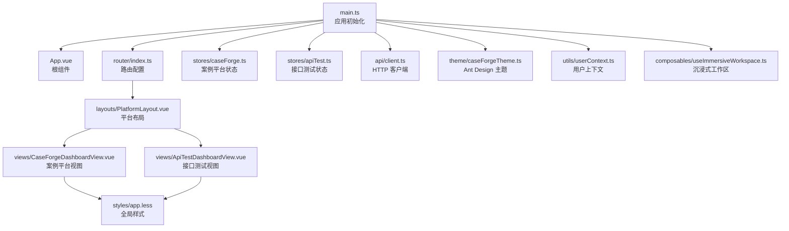
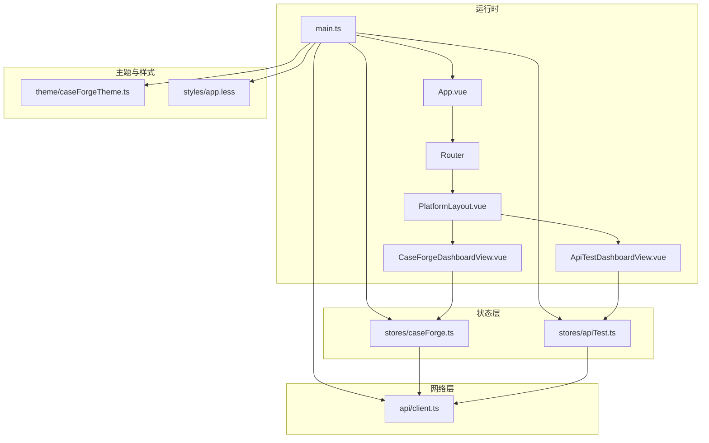
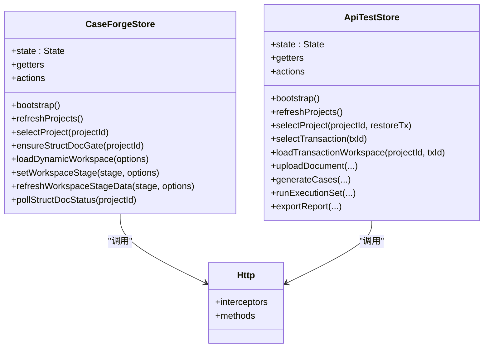
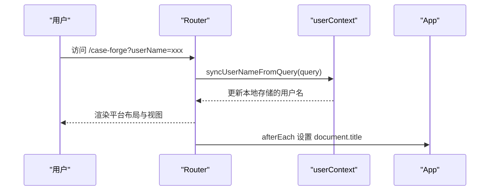
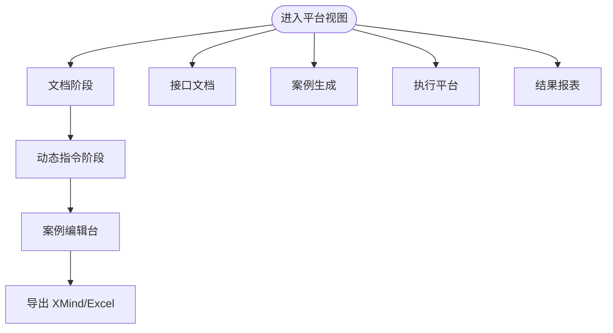
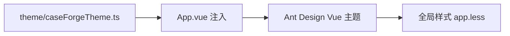
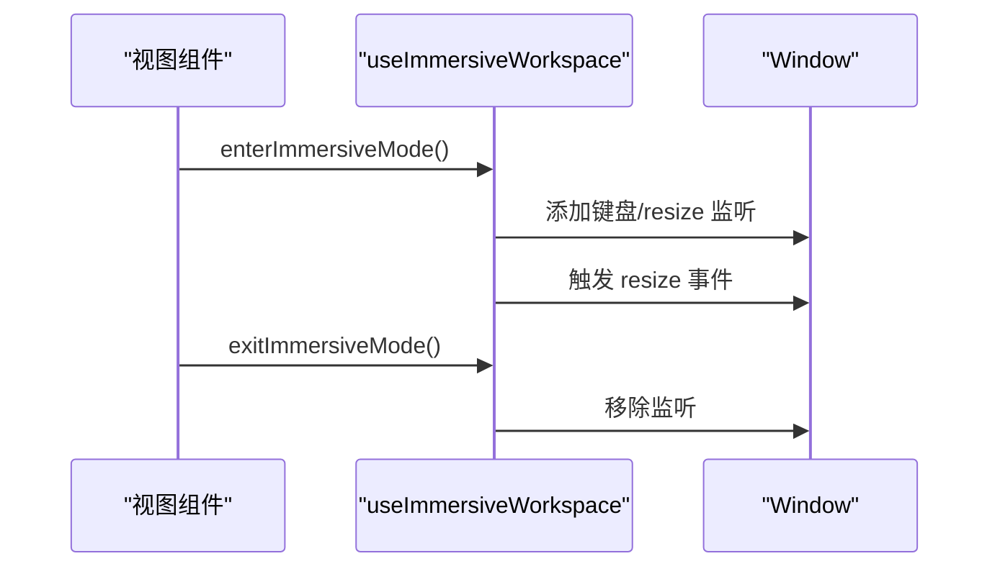
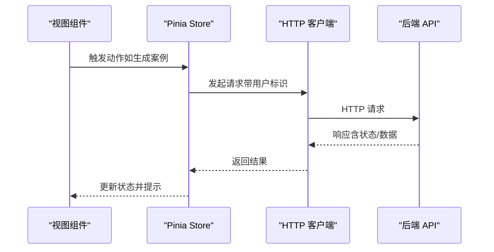
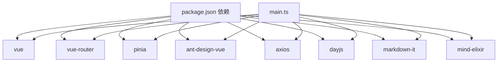

# 前端开发

<cite>
**本文引用的文件**
- [apps/web/package.json](file://apps/web/package.json)
- [apps/web/vite.config.ts](file://apps/web/vite.config.ts)
- [apps/web/src/main.ts](file://apps/web/src/main.ts)
- [apps/web/src/App.vue](file://apps/web/src/App.vue)
- [apps/web/src/router/index.ts](file://apps/web/src/router/index.ts)
- [apps/web/src/stores/caseForge.ts](file://apps/web/src/stores/caseForge.ts)
- [apps/web/src/stores/apiTest.ts](file://apps/web/src/stores/apiTest.ts)
- [apps/web/src/theme/caseForgeTheme.ts](file://apps/web/src/theme/caseForgeTheme.ts)
- [apps/web/src/layouts/PlatformLayout.vue](file://apps/web/src/layouts/PlatformLayout.vue)
- [apps/web/src/views/CaseForgeDashboardView.vue](file://apps/web/src/views/CaseForgeDashboardView.vue)
- [apps/web/src/views/ApiTestDashboardView.vue](file://apps/web/src/views/ApiTestDashboardView.vue)
- [apps/web/src/api/client.ts](file://apps/web/src/api/client.ts)
- [apps/web/src/utils/userContext.ts](file://apps/web/src/utils/userContext.ts)
- [apps/web/src/composables/useImmersiveWorkspace.ts](file://apps/web/src/composables/useImmersiveWorkspace.ts)
- [apps/web/src/constants/platform.ts](file://apps/web/src/constants/platform.ts)
- [apps/web/src/styles/app.less](file://apps/web/src/styles/app.less)
</cite>

## 目录
1. [简介](#简介)
2. [项目结构](#项目结构)
3. [核心组件](#核心组件)
4. [架构总览](#架构总览)
5. [详细组件分析](#详细组件分析)
6. [依赖关系分析](#依赖关系分析)
7. [性能考量](#性能考量)
8. [故障排查指南](#故障排查指南)
9. [结论](#结论)
10. [附录](#附录)

## 简介
本指南面向 CaseForge 前端团队，系统性介绍基于 Vue 3 + TypeScript 的前端架构与工程实践，涵盖 Composition API 使用模式、组件设计原则、状态管理（Pinia）、路由与布局、UI 组件库与主题定制、样式管理、开发工具配置、构建优化、性能调优以及与后端 API 的集成与错误处理策略。目标是帮助开发者快速理解并高效迭代前端功能。

## 项目结构
前端位于工作区 apps/web，采用 Vite + Vue 3 + TypeScript 技术栈，配合 Pinia 进行状态管理，Ant Design Vue 提供 UI 组件库，并通过 Less 管理全局样式与主题。

- 核心入口与初始化
  - 应用入口：创建应用实例、挂载 Pinia、Vue Router、Ant Design Vue，并注入全局主题与用户上下文。
  - 根组件：包裹 App，统一注入 Ant Design 主题与本地化。
- 路由与布局
  - 平台级布局：顶部平台切换栏，支持“智能生成案例平台”与“智能接口测试平台”双入口。
  - 视图层：分别承载两大平台的工作区视图。
- 状态管理
  - 案例平台 Store：集中管理项目、结构化文档、动态指令、案例树、生成队列等。
  - 接口测试 Store：集中管理项目、交易码、用例、环境、执行集、运行结果等。
- API 层
  - Axios 封装：统一请求拦截器、超时控制、用户标识注入与基础路径解析。
- 主题与样式
  - Ant Design 主题配置与 Less 变量解耦，确保视觉一致性与可维护性。
- 工具与组合式能力
  - 用户上下文：从 URL 同步用户标识，贯穿请求头。
  - 全屏沉浸式工作区：组合式能力封装 Orb 控件与视口刷新逻辑。

**图表来源**
- [apps/web/src/main.ts:1-20](file://apps/web/src/main.ts#L1-L20)
- [apps/web/src/App.vue:1-13](file://apps/web/src/App.vue#L1-L13)
- [apps/web/src/router/index.ts:1-65](file://apps/web/src/router/index.ts#L1-L65)
- [apps/web/src/stores/caseForge.ts:1-1602](file://apps/web/src/stores/caseForge.ts#L1-L1602)
- [apps/web/src/stores/apiTest.ts:1-633](file://apps/web/src/stores/apiTest.ts#L1-L633)
- [apps/web/src/api/client.ts:1-608](file://apps/web/src/api/client.ts#L1-L608)
- [apps/web/src/theme/caseForgeTheme.ts:1-39](file://apps/web/src/theme/caseForgeTheme.ts#L1-L39)
- [apps/web/src/utils/userContext.ts:1-42](file://apps/web/src/utils/userContext.ts#L1-L42)
- [apps/web/src/composables/useImmersiveWorkspace.ts:1-175](file://apps/web/src/composables/useImmersiveWorkspace.ts#L1-L175)
- [apps/web/src/layouts/PlatformLayout.vue:1-38](file://apps/web/src/layouts/PlatformLayout.vue#L1-L38)
- [apps/web/src/views/CaseForgeDashboardView.vue:1-139](file://apps/web/src/views/CaseForgeDashboardView.vue#L1-L139)
- [apps/web/src/views/ApiTestDashboardView.vue:1-190](file://apps/web/src/views/ApiTestDashboardView.vue#L1-L190)
- [apps/web/src/styles/app.less:1-800](file://apps/web/src/styles/app.less#L1-L800)

**章节来源**
- [apps/web/package.json:1-36](file://apps/web/package.json#L1-L36)
- [apps/web/vite.config.ts:1-71](file://apps/web/vite.config.ts#L1-L71)
- [apps/web/src/main.ts:1-20](file://apps/web/src/main.ts#L1-L20)
- [apps/web/src/App.vue:1-13](file://apps/web/src/App.vue#L1-L13)
- [apps/web/src/router/index.ts:1-65](file://apps/web/src/router/index.ts#L1-L65)
- [apps/web/src/layouts/PlatformLayout.vue:1-38](file://apps/web/src/layouts/PlatformLayout.vue#L1-L38)
- [apps/web/src/views/CaseForgeDashboardView.vue:1-139](file://apps/web/src/views/CaseForgeDashboardView.vue#L1-L139)
- [apps/web/src/views/ApiTestDashboardView.vue:1-190](file://apps/web/src/views/ApiTestDashboardView.vue#L1-L190)
- [apps/web/src/theme/caseForgeTheme.ts:1-39](file://apps/web/src/theme/caseForgeTheme.ts#L1-L39)
- [apps/web/src/styles/app.less:1-800](file://apps/web/src/styles/app.less#L1-L800)

## 核心组件
- 应用初始化与全局配置
  - 在入口处注册 Pinia、Router、Ant Design Vue，并设置本地化与主题。
  - 初始化用户上下文与全局消息配置，保证跨页面一致的交互体验。
- 路由与导航
  - 基于 History 模式的路由，支持平台级跳转与面包屑标题同步。
  - 导航守卫负责将 URL 中的用户标识同步至本地存储，确保请求头携带正确用户信息。
- 平台布局
  - 顶部品牌区与平台切换区，支持在不同平台间无缝切换。
  - 通过常量定义平台元信息，便于扩展新平台。
- 视图层
  - 案例平台视图：文档、动态指令、案例编辑台三阶段工作流。
  - 接口测试视图：文档、用例、执行、报表四阶段工作流。
- 状态管理
  - 案例平台 Store：项目、结构化文档、测试要点、生成队列、运行树等。
  - 接口测试 Store：项目、交易码、用例、环境、执行集、运行结果等。
- API 客户端
  - Axios 实例封装，统一注入用户标识与基础路径，提供丰富的业务方法。
- 主题与样式
  - Ant Design 主题配置与 Less 变量解耦，确保品牌色与交互层级一致。
- 组合式能力
  - 沉浸式工作区 Orb 控件：拖拽、停靠、自动收拢与视口刷新。
  - 用户上下文：从 URL 解析用户标识并持久化。

**章节来源**
- [apps/web/src/main.ts:1-20](file://apps/web/src/main.ts#L1-L20)
- [apps/web/src/App.vue:1-13](file://apps/web/src/App.vue#L1-L13)
- [apps/web/src/router/index.ts:1-65](file://apps/web/src/router/index.ts#L1-L65)
- [apps/web/src/constants/platform.ts:1-35](file://apps/web/src/constants/platform.ts#L1-L35)
- [apps/web/src/layouts/PlatformLayout.vue:1-38](file://apps/web/src/layouts/PlatformLayout.vue#L1-L38)
- [apps/web/src/views/CaseForgeDashboardView.vue:1-139](file://apps/web/src/views/CaseForgeDashboardView.vue#L1-L139)
- [apps/web/src/views/ApiTestDashboardView.vue:1-190](file://apps/web/src/views/ApiTestDashboardView.vue#L1-L190)
- [apps/web/src/stores/caseForge.ts:1-1602](file://apps/web/src/stores/caseForge.ts#L1-L1602)
- [apps/web/src/stores/apiTest.ts:1-633](file://apps/web/src/stores/apiTest.ts#L1-L633)
- [apps/web/src/api/client.ts:1-608](file://apps/web/src/api/client.ts#L1-L608)
- [apps/web/src/theme/caseForgeTheme.ts:1-39](file://apps/web/src/theme/caseForgeTheme.ts#L1-L39)
- [apps/web/src/composables/useImmersiveWorkspace.ts:1-175](file://apps/web/src/composables/useImmersiveWorkspace.ts#L1-L175)
- [apps/web/src/utils/userContext.ts:1-42](file://apps/web/src/utils/userContext.ts#L1-L42)
- [apps/web/src/styles/app.less:1-800](file://apps/web/src/styles/app.less#L1-L800)

## 架构总览
前端采用“入口初始化 → 路由与布局 → 视图层 → 状态管理 → API 客户端”的分层架构。Pinia Store 负责跨组件共享状态，Axios 封装统一处理请求与响应，Ant Design Vue 提供一致的 UI 体验，Less 与主题配置保障视觉一致性。

**图表来源**
- [apps/web/src/main.ts:1-20](file://apps/web/src/main.ts#L1-L20)
- [apps/web/src/App.vue:1-13](file://apps/web/src/App.vue#L1-L13)
- [apps/web/src/router/index.ts:1-65](file://apps/web/src/router/index.ts#L1-L65)
- [apps/web/src/layouts/PlatformLayout.vue:1-38](file://apps/web/src/layouts/PlatformLayout.vue#L1-L38)
- [apps/web/src/views/CaseForgeDashboardView.vue:1-139](file://apps/web/src/views/CaseForgeDashboardView.vue#L1-L139)
- [apps/web/src/views/ApiTestDashboardView.vue:1-190](file://apps/web/src/views/ApiTestDashboardView.vue#L1-L190)
- [apps/web/src/stores/caseForge.ts:1-1602](file://apps/web/src/stores/caseForge.ts#L1-L1602)
- [apps/web/src/stores/apiTest.ts:1-633](file://apps/web/src/stores/apiTest.ts#L1-L633)
- [apps/web/src/api/client.ts:1-608](file://apps/web/src/api/client.ts#L1-L608)
- [apps/web/src/theme/caseForgeTheme.ts:1-39](file://apps/web/src/theme/caseForgeTheme.ts#L1-L39)
- [apps/web/src/styles/app.less:1-800](file://apps/web/src/styles/app.less#L1-L800)

## 详细组件分析

### 状态管理（Pinia）
- 案例平台 Store（useCaseForgeStore）
  - 关注项目生命周期、结构化文档、测试要点、生成队列与案例树加载。
  - 提供工作区阶段切换、轮询结构化状态、合并测试要点指令、批量生成进度等能力。
  - 内置长任务轮询策略与防抖并发控制，提升复杂场景下的稳定性。
- 接口测试 Store（useApiTestStore）
  - 关注项目、交易码、用例、环境、执行集与运行结果。
  - 支持文档上传/结构化、用例生成、批量执行、报告导出等完整闭环。
  - 通过本地存储恢复工作区阶段与选中项，增强用户体验。

**图表来源**
- [apps/web/src/stores/caseForge.ts:1-1602](file://apps/web/src/stores/caseForge.ts#L1-L1602)
- [apps/web/src/stores/apiTest.ts:1-633](file://apps/web/src/stores/apiTest.ts#L1-L633)
- [apps/web/src/api/client.ts:1-608](file://apps/web/src/api/client.ts#L1-L608)

**章节来源**
- [apps/web/src/stores/caseForge.ts:1-1602](file://apps/web/src/stores/caseForge.ts#L1-L1602)
- [apps/web/src/stores/apiTest.ts:1-633](file://apps/web/src/stores/apiTest.ts#L1-L633)

### 路由与页面布局
- 路由配置
  - 历史模式，支持“/case-forge”与“/api-test”两个平台入口。
  - 导航守卫同步用户标识，确保每次请求携带正确的 X-User-Name。
  - 页面标题根据 meta.title 自动更新。
- 平台布局
  - 顶部品牌区与平台切换区，支持在不同平台间无缝切换。
  - 通过常量定义平台元信息，便于扩展新平台。

**图表来源**
- [apps/web/src/router/index.ts:1-65](file://apps/web/src/router/index.ts#L1-L65)
- [apps/web/src/utils/userContext.ts:1-42](file://apps/web/src/utils/userContext.ts#L1-L42)
- [apps/web/src/App.vue:1-13](file://apps/web/src/App.vue#L1-L13)

**章节来源**
- [apps/web/src/router/index.ts:1-65](file://apps/web/src/router/index.ts#L1-L65)
- [apps/web/src/constants/platform.ts:1-35](file://apps/web/src/constants/platform.ts#L1-L35)
- [apps/web/src/layouts/PlatformLayout.vue:1-38](file://apps/web/src/layouts/PlatformLayout.vue#L1-L38)

### 视图层与工作区
- 案例平台视图
  - 文档阶段：结构化需求文档上传与编辑。
  - 动态指令阶段：测试要点列表与逐条动态指令。
  - 案例编辑台：案例树生成、编辑与导出。
- 接口测试视图
  - 文档阶段：Excel 上传与结构化。
  - 用例阶段：AI 生成与手工维护。
  - 执行阶段：环境中心、批量执行与比对。
  - 报表阶段：统计图表、Excel/PDF 导出。

**图表来源**
- [apps/web/src/views/CaseForgeDashboardView.vue:1-139](file://apps/web/src/views/CaseForgeDashboardView.vue#L1-L139)
- [apps/web/src/views/ApiTestDashboardView.vue:1-190](file://apps/web/src/views/ApiTestDashboardView.vue#L1-L190)

**章节来源**
- [apps/web/src/views/CaseForgeDashboardView.vue:1-139](file://apps/web/src/views/CaseForgeDashboardView.vue#L1-L139)
- [apps/web/src/views/ApiTestDashboardView.vue:1-190](file://apps/web/src/views/ApiTestDashboardView.vue#L1-L190)

### UI 组件库与主题定制
- Ant Design Vue
  - 全局配置本地化与主题，确保品牌色与交互一致。
- 主题配置
  - 通过 Ant Design ThemeConfig 定义主色、圆角、阴影、字体等 Token。
- 样式管理
  - Less 变量与 CSS 变量解耦，全局样式覆盖与组件样式隔离。
  - 平台级样式区分（如 api-test 与 case-forge）。

**图表来源**
- [apps/web/src/theme/caseForgeTheme.ts:1-39](file://apps/web/src/theme/caseForgeTheme.ts#L1-L39)
- [apps/web/src/App.vue:1-13](file://apps/web/src/App.vue#L1-L13)
- [apps/web/src/styles/app.less:1-800](file://apps/web/src/styles/app.less#L1-L800)

**章节来源**
- [apps/web/src/theme/caseForgeTheme.ts:1-39](file://apps/web/src/theme/caseForgeTheme.ts#L1-L39)
- [apps/web/src/styles/app.less:1-800](file://apps/web/src/styles/app.less#L1-L800)

### 组合式能力与沉浸式工作区
- 沉浸式 Orb 控件
  - 支持拖拽、停靠、自动收拢与视口刷新。
  - 键盘事件监听与窗口尺寸变化处理。
- 用户上下文
  - 从 URL 解析用户标识并持久化，贯穿请求头。

**图表来源**
- [apps/web/src/composables/useImmersiveWorkspace.ts:1-175](file://apps/web/src/composables/useImmersiveWorkspace.ts#L1-L175)
- [apps/web/src/views/CaseForgeDashboardView.vue:1-139](file://apps/web/src/views/CaseForgeDashboardView.vue#L1-L139)
- [apps/web/src/views/ApiTestDashboardView.vue:1-190](file://apps/web/src/views/ApiTestDashboardView.vue#L1-L190)

**章节来源**
- [apps/web/src/composables/useImmersiveWorkspace.ts:1-175](file://apps/web/src/composables/useImmersiveWorkspace.ts#L1-L175)
- [apps/web/src/utils/userContext.ts:1-42](file://apps/web/src/utils/userContext.ts#L1-L42)

### API 集成与错误处理
- Axios 封装
  - 请求拦截器注入用户标识与基础路径。
  - 超时控制与特定接口放宽超时（如案例生成）。
- 错误处理策略
  - Store 内部统一提示与回退逻辑，避免界面卡死。
  - 结构化轮询与长任务追加轮询，兼容服务端异步状态。

**图表来源**
- [apps/web/src/api/client.ts:1-608](file://apps/web/src/api/client.ts#L1-L608)
- [apps/web/src/stores/caseForge.ts:1-1602](file://apps/web/src/stores/caseForge.ts#L1-L1602)
- [apps/web/src/stores/apiTest.ts:1-633](file://apps/web/src/stores/apiTest.ts#L1-L633)

**章节来源**
- [apps/web/src/api/client.ts:1-608](file://apps/web/src/api/client.ts#L1-L608)
- [apps/web/src/stores/caseForge.ts:1-1602](file://apps/web/src/stores/caseForge.ts#L1-L1602)
- [apps/web/src/stores/apiTest.ts:1-633](file://apps/web/src/stores/apiTest.ts#L1-L633)

## 依赖关系分析
- 外部依赖
  - Vue 3、Vue Router、Pinia、Ant Design Vue、Axios、dayjs、markdown-it、mind-elixir 等。
- 内部依赖
  - Store 依赖 API 客户端；视图依赖 Store 与布局；组合式能力被视图与 Store 复用。
- 代理与别名
  - Vite 配置代理真实 API，避免前端路由误转发；工作区包别名指向源码，避免预构建缓存问题。

**图表来源**
- [apps/web/package.json:1-36](file://apps/web/package.json#L1-L36)
- [apps/web/src/main.ts:1-20](file://apps/web/src/main.ts#L1-L20)

**章节来源**
- [apps/web/package.json:1-36](file://apps/web/package.json#L1-L36)
- [apps/web/vite.config.ts:1-71](file://apps/web/vite.config.ts#L1-L71)

## 性能考量
- 构建与打包
  - 使用 Vite 快速冷启动与热更新；生产构建开启类型检查与打包优化。
- 依赖优化
  - 工作区包通过别名指向源码，避免预构建缓存导致白屏；排除工作区包参与优化依赖预构建。
- 网络层
  - Axios 超时合理设置；针对长任务接口放宽超时；请求头注入用户标识减少后端鉴权开销。
- 视图与状态
  - keep-alive 缓存视图组件；Store 内部并发控制与轮询节流，避免重复请求。
- 样式与主题
  - Less 变量集中管理，减少重复计算；Ant Design 主题统一 Token，降低样式冲突成本。

**章节来源**
- [apps/web/vite.config.ts:1-71](file://apps/web/vite.config.ts#L1-L71)
- [apps/web/src/api/client.ts:1-608](file://apps/web/src/api/client.ts#L1-L608)
- [apps/web/src/stores/caseForge.ts:1-1602](file://apps/web/src/stores/caseForge.ts#L1-L1602)
- [apps/web/src/stores/apiTest.ts:1-633](file://apps/web/src/stores/apiTest.ts#L1-L633)
- [apps/web/src/styles/app.less:1-800](file://apps/web/src/styles/app.less#L1-L800)

## 故障排查指南
- 用户标识问题
  - 症状：请求头未携带用户标识或显示异常。
  - 排查：确认 URL 是否包含 userName 参数，检查用户上下文初始化与同步逻辑。
- 路由跳转异常
  - 症状：页面标题未更新或参数丢失。
  - 排查：检查导航守卫是否同步用户标识，确认 meta.title 是否存在。
- 长任务状态不同步
  - 症状：前端提示已完成但后端仍在处理。
  - 排查：检查轮询间隔与追加轮询策略，确认 visibilityState 与轮询停止条件。
- 接口返回异常
  - 症状：接口报错或超时。
  - 排查：查看 Axios 拦截器与超时配置，确认基础路径与用户标识是否正确。

**章节来源**
- [apps/web/src/utils/userContext.ts:1-42](file://apps/web/src/utils/userContext.ts#L1-L42)
- [apps/web/src/router/index.ts:1-65](file://apps/web/src/router/index.ts#L1-L65)
- [apps/web/src/stores/caseForge.ts:1-1602](file://apps/web/src/stores/caseForge.ts#L1-L1602)
- [apps/web/src/api/client.ts:1-608](file://apps/web/src/api/client.ts#L1-L608)

## 结论
本指南总结了 CaseForge 前端的架构设计与工程实践，围绕 Composition API、Pinia 状态管理、路由与布局、UI 主题与样式、API 集成与错误处理等方面提供了系统性的说明与可视化示例。建议在后续开发中遵循本文档的组件设计原则与最佳实践，持续优化性能与可维护性。

## 附录
- 开发脚本
  - dev：本地开发服务器，支持自动注入用户标识。
  - build：类型检查与打包构建。
  - preview：本地预览构建产物。
- Vite 配置要点
  - 插件：Vue 插件与自定义插件（开发时自动附加用户标识）。
  - 别名：@ 指向 src，@case-forge/shared 指向工作区共享包源码。
  - 代理：仅代理真实 API（/api/v1/...），避免前端路由被误转发。
  - 优化：排除工作区包参与依赖预构建，避免缓存问题。

**章节来源**
- [apps/web/package.json:1-36](file://apps/web/package.json#L1-L36)
- [apps/web/vite.config.ts:1-71](file://apps/web/vite.config.ts#L1-L71)