# 工具函数与辅助模块

<cite>
**本文引用的文件**
- [apps/api/src/common/document/document-text.util.ts](file://apps/api/src/common/document/document-text.util.ts)
- [apps/api/src/common/test-platform/test-platform.constants.ts](file://apps/api/src/common/test-platform/test-platform.constants.ts)
- [apps/api/src/modules/api-test/util/api-doc-format.const.ts](file://apps/api/src/modules/api-test/util/api-doc-format.const.ts)
- [apps/web/src/utils/concurrency.ts](file://apps/web/src/utils/concurrency.ts)
- [apps/web/src/utils/debounce.ts](file://apps/web/src/utils/debounce.ts)
- [apps/api/src/common/typeorm/database-indexes.util.ts](file://apps/api/src/common/typeorm/database-indexes.util.ts)
- [apps/api/src/common/typeorm/api-schema-migrations.util.ts](file://apps/api/src/common/typeorm/api-schema-migrations.util.ts)
- [apps/api/src/common/http/public-response.util.ts](file://apps/api/src/common/http/public-response.util.ts)
- [apps/web/src/utils/formatDuration.ts](file://apps/web/src/utils/formatDuration.ts)
- [apps/web/src/utils/globalFeedback.ts](file://apps/web/src/utils/globalFeedback.ts)
- [apps/api/src/modules/api-test/util/assertion-runner.util.ts](file://apps/api/src/modules/api-test/util/assertion-runner.util.ts)
- [apps/api/src/modules/api-test/util/variable-substitute.util.ts](file://apps/api/src/modules/api-test/util/variable-substitute.util.ts)
- [apps/web/src/utils/testPointDefinition.ts](file://apps/web/src/utils/testPointDefinition.ts)
- [apps/web/src/utils/testPointMerge.ts](file://apps/web/src/utils/testPointMerge.ts)
- [apps/web/src/utils/testPointStatusSort.ts](file://apps/web/src/utils/testPointStatusSort.ts)
</cite>

## 目录
1. [简介](#简介)
2. [项目结构](#项目结构)
3. [核心组件](#核心组件)
4. [架构总览](#架构总览)
5. [详细组件分析](#详细组件分析)
6. [依赖关系分析](#依赖关系分析)
7. [性能考量](#性能考量)
8. [故障排查指南](#故障排查指南)
9. [结论](#结论)
10. [附录](#附录)

## 简介
本文件系统性梳理并深入解析本仓库中的工具函数与辅助模块，覆盖以下主题：
- API 文档处理：多格式文档解析、文本校验与断言
- 测试点定义与合并：测试要点完整性判断、标签生成、指令合并与排序
- 并发控制与防抖节流：并发限速、任务调度、用户输入防抖
- 数据库与模式迁移：幂等索引补齐、外键对齐与表结构演进
- 前端反馈与展示：全局消息配置、时长格式化
- 类型声明与接口规范：常量定义、类型约束与契约
- 性能优化、错误处理与测试策略：并发安全、异常隔离、边界条件
- 开发规范、版本管理与维护建议：可维护性与可扩展性

## 项目结构
工具函数主要分布在两个前端应用与一个后端应用中：
- apps/web/src/utils：前端侧通用工具（并发、防抖、测试点、反馈、格式化）
- apps/api/src/common：后端通用工具（文档解析、HTTP 输出、数据库与模式迁移）
- apps/api/src/modules/api-test/util：API 测试相关工具（变量替换、断言运行）

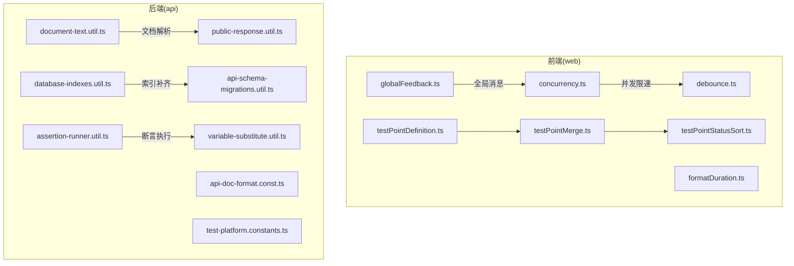

图表来源
- [apps/web/src/utils/concurrency.ts:1-49](file://apps/web/src/utils/concurrency.ts#L1-L49)
- [apps/web/src/utils/debounce.ts:1-14](file://apps/web/src/utils/debounce.ts#L1-L14)
- [apps/web/src/utils/testPointDefinition.ts:1-18](file://apps/web/src/utils/testPointDefinition.ts#L1-L18)
- [apps/web/src/utils/testPointMerge.ts:1-43](file://apps/web/src/utils/testPointMerge.ts#L1-L43)
- [apps/web/src/utils/testPointStatusSort.ts:1-33](file://apps/web/src/utils/testPointStatusSort.ts#L1-L33)
- [apps/web/src/utils/globalFeedback.ts:1-45](file://apps/web/src/utils/globalFeedback.ts#L1-L45)
- [apps/web/src/utils/formatDuration.ts:1-13](file://apps/web/src/utils/formatDuration.ts#L1-L13)
- [apps/api/src/common/document/document-text.util.ts:1-124](file://apps/api/src/common/document/document-text.util.ts#L1-L124)
- [apps/api/src/common/http/public-response.util.ts:1-284](file://apps/api/src/common/http/public-response.util.ts#L1-L284)
- [apps/api/src/common/typeorm/database-indexes.util.ts:1-239](file://apps/api/src/common/typeorm/database-indexes.util.ts#L1-L239)
- [apps/api/src/common/typeorm/api-schema-migrations.util.ts:1-291](file://apps/api/src/common/typeorm/api-schema-migrations.util.ts#L1-L291)
- [apps/api/src/modules/api-test/util/assertion-runner.util.ts:1-107](file://apps/api/src/modules/api-test/util/assertion-runner.util.ts#L1-L107)
- [apps/api/src/modules/api-test/util/variable-substitute.util.ts:1-43](file://apps/api/src/modules/api-test/util/variable-substitute.util.ts#L1-L43)
- [apps/api/src/modules/api-test/util/api-doc-format.const.ts:1-10](file://apps/api/src/modules/api-test/util/api-doc-format.const.ts#L1-L10)
- [apps/api/src/common/test-platform/test-platform.constants.ts:1-3](file://apps/api/src/common/test-platform/test-platform.constants.ts#L1-L3)

章节来源
- [apps/web/src/utils/concurrency.ts:1-49](file://apps/web/src/utils/concurrency.ts#L1-L49)
- [apps/web/src/utils/debounce.ts:1-14](file://apps/web/src/utils/debounce.ts#L1-L14)
- [apps/web/src/utils/testPointDefinition.ts:1-18](file://apps/web/src/utils/testPointDefinition.ts#L1-L18)
- [apps/web/src/utils/testPointMerge.ts:1-43](file://apps/web/src/utils/testPointMerge.ts#L1-L43)
- [apps/web/src/utils/testPointStatusSort.ts:1-33](file://apps/web/src/utils/testPointStatusSort.ts#L1-L33)
- [apps/web/src/utils/globalFeedback.ts:1-45](file://apps/web/src/utils/globalFeedback.ts#L1-L45)
- [apps/web/src/utils/formatDuration.ts:1-13](file://apps/web/src/utils/formatDuration.ts#L1-L13)
- [apps/api/src/common/document/document-text.util.ts:1-124](file://apps/api/src/common/document/document-text.util.ts#L1-L124)
- [apps/api/src/common/http/public-response.util.ts:1-284](file://apps/api/src/common/http/public-response.util.ts#L1-L284)
- [apps/api/src/common/typeorm/database-indexes.util.ts:1-239](file://apps/api/src/common/typeorm/database-indexes.util.ts#L1-L239)
- [apps/api/src/common/typeorm/api-schema-migrations.util.ts:1-291](file://apps/api/src/common/typeorm/api-schema-migrations.util.ts#L1-L291)
- [apps/api/src/modules/api-test/util/assertion-runner.util.ts:1-107](file://apps/api/src/modules/api-test/util/assertion-runner.util.ts#L1-L107)
- [apps/api/src/modules/api-test/util/variable-substitute.util.ts:1-43](file://apps/api/src/modules/api-test/util/variable-substitute.util.ts#L1-L43)
- [apps/api/src/modules/api-test/util/api-doc-format.const.ts:1-10](file://apps/api/src/modules/api-test/util/api-doc-format.const.ts#L1-L10)
- [apps/api/src/common/test-platform/test-platform.constants.ts:1-3](file://apps/api/src/common/test-platform/test-platform.constants.ts#L1-L3)

## 核心组件
- 文档解析与校验：支持 doc/docx/pdf/文本，自动识别格式并提取纯文本，提供可读性校验
- 断言与变量替换：基于 JSONPath 的断言执行器，变量替换与深度递归替换
- 并发控制与防抖：并发限速与任务集结算果回调；输入事件防抖
- 数据库索引与模式迁移：幂等补齐热点索引、对齐 UUID 字段、创建/演进 API 测试相关表
- 前端反馈与展示：全局消息根节点管理、沉浸式模式适配、时长格式化
- 测试点工具链：定义完整性检查、指令合并、按状态排序

章节来源
- [apps/api/src/common/document/document-text.util.ts:1-124](file://apps/api/src/common/document/document-text.util.ts#L1-L124)
- [apps/api/src/modules/api-test/util/assertion-runner.util.ts:1-107](file://apps/api/src/modules/api-test/util/assertion-runner.util.ts#L1-L107)
- [apps/api/src/modules/api-test/util/variable-substitute.util.ts:1-43](file://apps/api/src/modules/api-test/util/variable-substitute.util.ts#L1-L43)
- [apps/web/src/utils/concurrency.ts:1-49](file://apps/web/src/utils/concurrency.ts#L1-L49)
- [apps/web/src/utils/debounce.ts:1-14](file://apps/web/src/utils/debounce.ts#L1-L14)
- [apps/api/src/common/typeorm/database-indexes.util.ts:1-239](file://apps/api/src/common/typeorm/database-indexes.util.ts#L1-L239)
- [apps/api/src/common/typeorm/api-schema-migrations.util.ts:1-291](file://apps/api/src/common/typeorm/api-schema-migrations.util.ts#L1-L291)
- [apps/web/src/utils/globalFeedback.ts:1-45](file://apps/web/src/utils/globalFeedback.ts#L1-L45)
- [apps/web/src/utils/formatDuration.ts:1-13](file://apps/web/src/utils/formatDuration.ts#L1-L13)
- [apps/web/src/utils/testPointDefinition.ts:1-18](file://apps/web/src/utils/testPointDefinition.ts#L1-L18)
- [apps/web/src/utils/testPointMerge.ts:1-43](file://apps/web/src/utils/testPointMerge.ts#L1-L43)
- [apps/web/src/utils/testPointStatusSort.ts:1-33](file://apps/web/src/utils/testPointStatusSort.ts#L1-L33)

## 架构总览
工具函数分层与交互如下：
- 前端层：UI 展示与用户交互，使用并发控制、防抖、测试点工具链与反馈配置
- 后端层：数据访问与业务逻辑，使用文档解析、HTTP 输出封装、数据库迁移与断言执行
- 共享层：常量与类型定义，确保前后端一致性

```mermaid
graph TB
UI["前端组件"] --> FE_Conc["并发控制(concurrency.ts)"]
UI --> FE_Deb["防抖(debounce.ts)"]
UI --> FE_TPDef["测试点定义(testPointDefinition.ts)"]
UI --> FE_TPMerge["测试点合并(testPointMerge.ts)"]
UI --> FE_TPStatus["状态排序(testPointStatusSort.ts)"]
UI --> FE_Feed["全局反馈(globalFeedback.ts)"]
UI --> FE_FMT["时长格式化(formatDuration.ts)"]
BE_API["API 模块"] --> DOC["文档解析(document-text.util.ts)"]
BE_API --> RESP["公共响应(public-response.util.ts)"]
BE_API --> IDX["索引补齐(database-indexes.util.ts)"]
BE_API --> MIG["模式迁移(api-schema-migrations.util.ts)"]
BE_API --> ASSERT["断言(assertion-runner.util.ts)"]
BE_API --> VAR["变量替换(variable-substitute.util.ts)"]
BE_API --> CONST1["API 文档常量(api-doc-format.const.ts)"]
BE_API --> CONST2["测管连接常量(test-platform.constants.ts)"]
```

图表来源
- [apps/web/src/utils/concurrency.ts:1-49](file://apps/web/src/utils/concurrency.ts#L1-L49)
- [apps/web/src/utils/debounce.ts:1-14](file://apps/web/src/utils/debounce.ts#L1-L14)
- [apps/web/src/utils/testPointDefinition.ts:1-18](file://apps/web/src/utils/testPointDefinition.ts#L1-L18)
- [apps/web/src/utils/testPointMerge.ts:1-43](file://apps/web/src/utils/testPointMerge.ts#L1-L43)
- [apps/web/src/utils/testPointStatusSort.ts:1-33](file://apps/web/src/utils/testPointStatusSort.ts#L1-L33)
- [apps/web/src/utils/globalFeedback.ts:1-45](file://apps/web/src/utils/globalFeedback.ts#L1-L45)
- [apps/web/src/utils/formatDuration.ts:1-13](file://apps/web/src/utils/formatDuration.ts#L1-L13)
- [apps/api/src/common/document/document-text.util.ts:1-124](file://apps/api/src/common/document/document-text.util.ts#L1-L124)
- [apps/api/src/common/http/public-response.util.ts:1-284](file://apps/api/src/common/http/public-response.util.ts#L1-L284)
- [apps/api/src/common/typeorm/database-indexes.util.ts:1-239](file://apps/api/src/common/typeorm/database-indexes.util.ts#L1-L239)
- [apps/api/src/common/typeorm/api-schema-migrations.util.ts:1-291](file://apps/api/src/common/typeorm/api-schema-migrations.util.ts#L1-L291)
- [apps/api/src/modules/api-test/util/assertion-runner.util.ts:1-107](file://apps/api/src/modules/api-test/util/assertion-runner.util.ts#L1-L107)
- [apps/api/src/modules/api-test/util/variable-substitute.util.ts:1-43](file://apps/api/src/modules/api-test/util/variable-substitute.util.ts#L1-L43)
- [apps/api/src/modules/api-test/util/api-doc-format.const.ts:1-10](file://apps/api/src/modules/api-test/util/api-doc-format.const.ts#L1-L10)
- [apps/api/src/common/test-platform/test-platform.constants.ts:1-3](file://apps/api/src/common/test-platform/test-platform.constants.ts#L1-L3)

## 详细组件分析

### 文档解析与文本校验
- 功能要点
  - 自动识别 doc/docx/pdf/文本格式，基于文件头与 MIME 类型判断
  - 使用专用库解析 docx/doc/pdf/text，返回纯文本
  - 提供可读性校验：空内容检测、控制字符比例阈值
- 处理流程

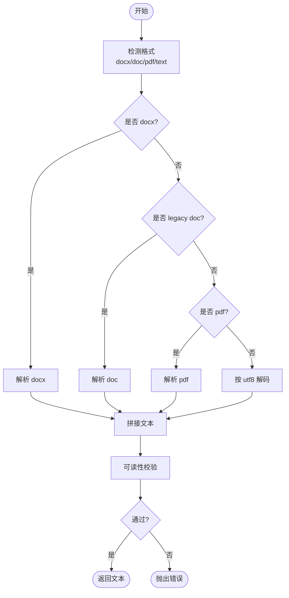

图表来源
- [apps/api/src/common/document/document-text.util.ts:29-124](file://apps/api/src/common/document/document-text.util.ts#L29-L124)

章节来源
- [apps/api/src/common/document/document-text.util.ts:1-124](file://apps/api/src/common/document/document-text.util.ts#L1-L124)

### 断言执行器
- 功能要点
  - 支持状态码断言、响应时间断言、JSONPath 断言
  - 通过 JSONPath 读取响应体子字段，进行 equals/contains/matches 等比较
  - 返回断言结果数组，并提供整体通过判定
- 执行序列

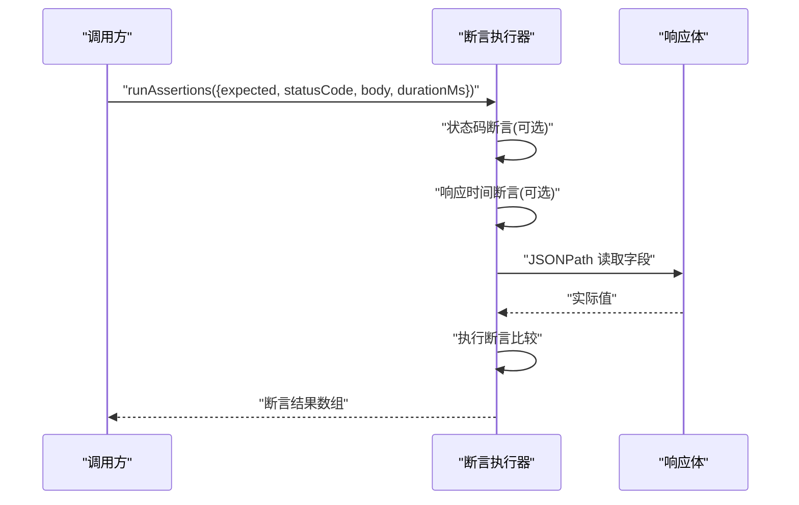

图表来源
- [apps/api/src/modules/api-test/util/assertion-runner.util.ts:62-102](file://apps/api/src/modules/api-test/util/assertion-runner.util.ts#L62-L102)

章节来源
- [apps/api/src/modules/api-test/util/assertion-runner.util.ts:1-107](file://apps/api/src/modules/api-test/util/assertion-runner.util.ts#L1-L107)

### 变量替换工具
- 功能要点
  - 字符串变量替换：支持 {{key}} 与 {key} 两种占位符
  - 深度递归替换：字符串、数组、对象均支持
  - 运行时变量构建：合并环境变量与密钥，统一 token 注入
- 替换流程

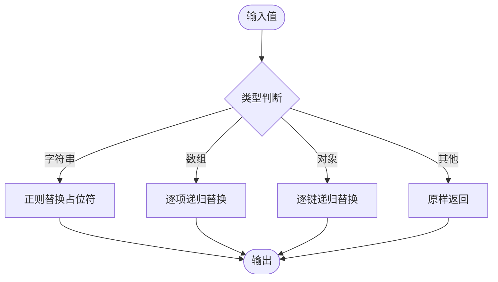

图表来源
- [apps/api/src/modules/api-test/util/variable-substitute.util.ts:1-43](file://apps/api/src/modules/api-test/util/variable-substitute.util.ts#L1-L43)

章节来源
- [apps/api/src/modules/api-test/util/variable-substitute.util.ts:1-43](file://apps/api/src/modules/api-test/util/variable-substitute.util.ts#L1-L43)

### 并发控制与任务调度
- 功能要点
  - 限制并发数，批量任务以固定并发度执行
  - 统一收集 PromiseSettledResult，支持每任务完成回调
  - 安全读取并发上限，提供默认与最大值保护
- 调度流程

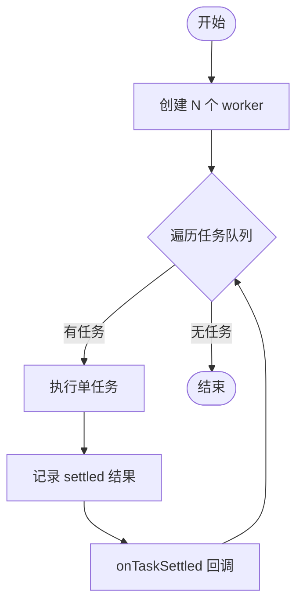

图表来源
- [apps/web/src/utils/concurrency.ts:2-36](file://apps/web/src/utils/concurrency.ts#L2-L36)

章节来源
- [apps/web/src/utils/concurrency.ts:1-49](file://apps/web/src/utils/concurrency.ts#L1-L49)

### 防抖（Debounce）
- 功能要点
  - 在指定等待时间内仅执行最后一次调用
  - 清理上一次定时器，避免内存泄漏
- 防抖序列

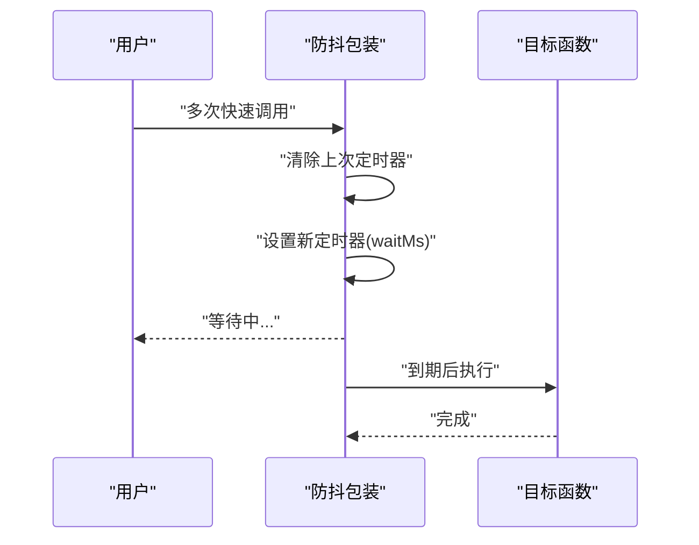

图表来源
- [apps/web/src/utils/debounce.ts:1-14](file://apps/web/src/utils/debounce.ts#L1-L14)

章节来源
- [apps/web/src/utils/debounce.ts:1-14](file://apps/web/src/utils/debounce.ts#L1-L14)

### 数据库索引补齐与模式迁移
- 功能要点
  - 幂等补齐热点查询索引，删除冗余索引
  - 对齐 UUID 字段长度与字符集，保证外键一致性
  - 创建/演进 API 测试相关表结构，处理唯一索引与外键依赖顺序
- 索引补齐流程

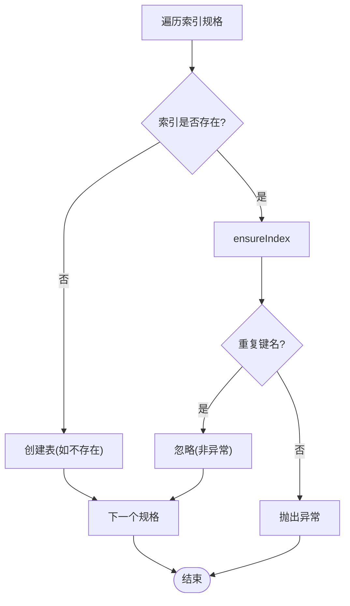

图表来源
- [apps/api/src/common/typeorm/database-indexes.util.ts:202-212](file://apps/api/src/common/typeorm/database-indexes.util.ts#L202-L212)

- 模式迁移流程

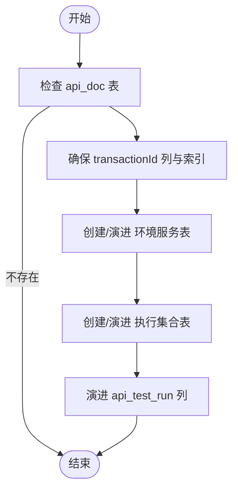

图表来源
- [apps/api/src/common/typeorm/api-schema-migrations.util.ts:57-67](file://apps/api/src/common/typeorm/api-schema-migrations.util.ts#L57-L67)

章节来源
- [apps/api/src/common/typeorm/database-indexes.util.ts:1-239](file://apps/api/src/common/typeorm/database-indexes.util.ts#L1-L239)
- [apps/api/src/common/typeorm/api-schema-migrations.util.ts:1-291](file://apps/api/src/common/typeorm/api-schema-migrations.util.ts#L1-L291)

### 前端反馈与全局消息
- 功能要点
  - 确保全局消息根节点存在，避免多实例导致的遮罩残留
  - 沉浸式模式下调整消息位置与显示时长
  - 切换容器或进入/退出全屏时清理残留 DOM
- 配置序列

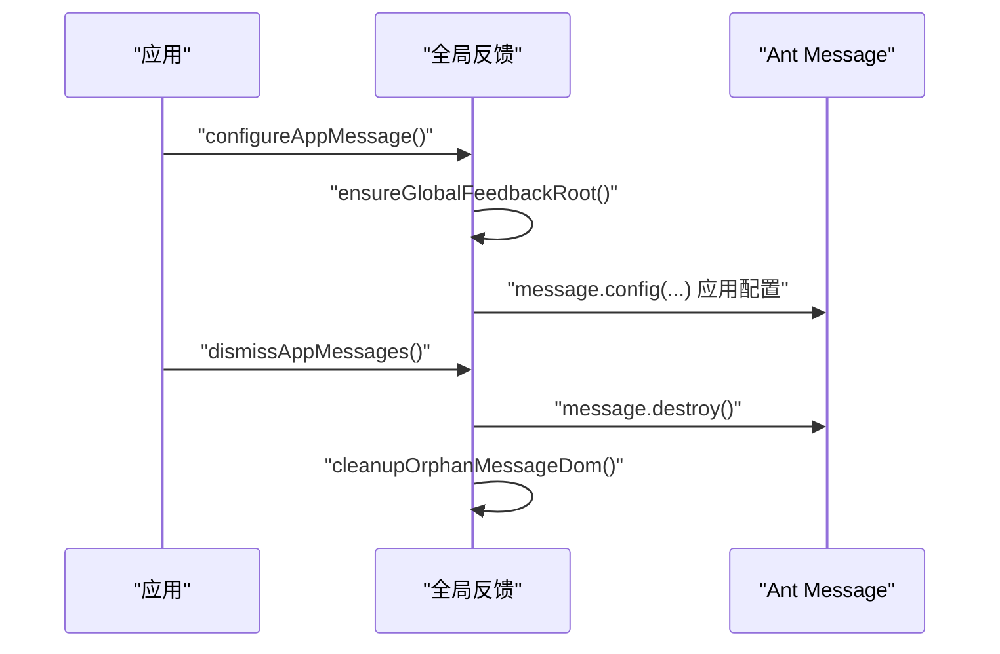

图表来源
- [apps/web/src/utils/globalFeedback.ts:31-40](file://apps/web/src/utils/globalFeedback.ts#L31-L40)

章节来源
- [apps/web/src/utils/globalFeedback.ts:1-45](file://apps/web/src/utils/globalFeedback.ts#L1-L45)

### 测试点工具链
- 测试点定义完整性检查：要求 system/featureModule/testPoint 三要素均非空
- 测试点标签生成：优先级降序，若均为空则返回默认标签
- 指令合并：以空指令字段作为默认值，优先采用明细项，回退到概要项
- 状态排序：按“失败→待编辑→已编辑/再编辑→生成中→完成”排序，同状态按创建时间或 ID 排序

章节来源
- [apps/web/src/utils/testPointDefinition.ts:1-18](file://apps/web/src/utils/testPointDefinition.ts#L1-L18)
- [apps/web/src/utils/testPointMerge.ts:1-43](file://apps/web/src/utils/testPointMerge.ts#L1-L43)
- [apps/web/src/utils/testPointStatusSort.ts:1-33](file://apps/web/src/utils/testPointStatusSort.ts#L1-L33)

### HTTP 输出封装
- 功能要点
  - 将实体映射为对外公开的数据结构，裁剪敏感字段
  - 支持场景、测试点、结构化文档、API 交易、端点、用例、环境服务、执行集、运行与运行项等
  - 统一字段命名与可选字段处理，便于前端消费

章节来源
- [apps/api/src/common/http/public-response.util.ts:1-284](file://apps/api/src/common/http/public-response.util.ts#L1-L284)

### 常量与类型声明
- API 文档格式常量：表格页签名称、分隔符
- 测管平台连接常量：TypeORM 连接名
- 类型与接口：断言结果、期望结构、变量占位符等在共享包中定义，工具函数严格遵循契约

章节来源
- [apps/api/src/modules/api-test/util/api-doc-format.const.ts:1-10](file://apps/api/src/modules/api-test/util/api-doc-format.const.ts#L1-L10)
- [apps/api/src/common/test-platform/test-platform.constants.ts:1-3](file://apps/api/src/common/test-platform/test-platform.constants.ts#L1-L3)

## 依赖关系分析
- 前端工具之间耦合度低，职责清晰：并发控制用于批处理，防抖用于输入优化，测试点工具链用于数据结构化
- 后端工具与实体强耦合：HTTP 输出封装依赖各实体；文档解析与断言执行器依赖共享类型
- 数据库工具与 MySQL 引擎特性耦合：索引创建、外键约束、字符集与长度对齐

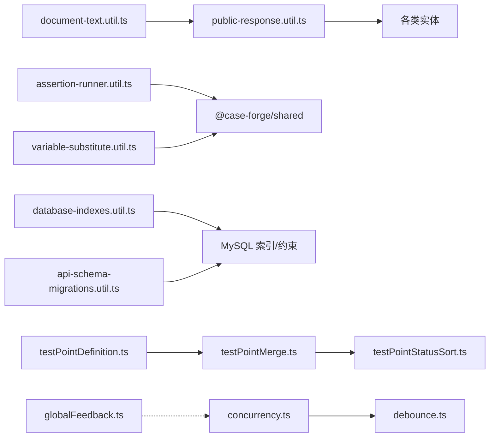

图表来源
- [apps/api/src/common/document/document-text.util.ts:1-124](file://apps/api/src/common/document/document-text.util.ts#L1-L124)
- [apps/api/src/common/http/public-response.util.ts:1-284](file://apps/api/src/common/http/public-response.util.ts#L1-L284)
- [apps/api/src/modules/api-test/util/assertion-runner.util.ts:1-107](file://apps/api/src/modules/api-test/util/assertion-runner.util.ts#L1-L107)
- [apps/api/src/modules/api-test/util/variable-substitute.util.ts:1-43](file://apps/api/src/modules/api-test/util/variable-substitute.util.ts#L1-L43)
- [apps/api/src/common/typeorm/database-indexes.util.ts:1-239](file://apps/api/src/common/typeorm/database-indexes.util.ts#L1-L239)
- [apps/api/src/common/typeorm/api-schema-migrations.util.ts:1-291](file://apps/api/src/common/typeorm/api-schema-migrations.util.ts#L1-L291)
- [apps/web/src/utils/testPointDefinition.ts:1-18](file://apps/web/src/utils/testPointDefinition.ts#L1-L18)
- [apps/web/src/utils/testPointMerge.ts:1-43](file://apps/web/src/utils/testPointMerge.ts#L1-L43)
- [apps/web/src/utils/testPointStatusSort.ts:1-33](file://apps/web/src/utils/testPointStatusSort.ts#L1-L33)
- [apps/web/src/utils/concurrency.ts:1-49](file://apps/web/src/utils/concurrency.ts#L1-L49)
- [apps/web/src/utils/debounce.ts:1-14](file://apps/web/src/utils/debounce.ts#L1-L14)
- [apps/web/src/utils/globalFeedback.ts:1-45](file://apps/web/src/utils/globalFeedback.ts#L1-L45)

## 性能考量
- 并发控制
  - 通过并发上限避免打满外部服务（如 AI 工作流），结合任务完成回调实现进度统计
  - 并发数应依据下游能力与资源配额动态调整
- 文档解析
  - 大文件解析成本高，建议在上传阶段做大小与格式校验，必要时异步处理
- 断言执行
  - JSONPath 访问需注意深层嵌套，建议缓存常用路径或限制层级
- 数据库迁移
  - 幂等操作减少重复开销；索引补齐与外键对齐需考虑锁与阻塞风险，建议在维护窗口执行
- 前端反馈
  - 消息数量限制与销毁可降低 DOM 堆积，提升渲染性能

## 故障排查指南
- 文档解析失败
  - 检查文件头与 MIME 类型识别是否正确
  - 确认第三方库版本与依赖安装完整
  - 使用可读性校验定位空内容或控制字符过多问题
- 断言不通过
  - 核对 JSONPath 是否正确，关注字段类型与空值处理
  - 检查期望值与实际值差异，必要时打印中间结果
- 并发任务异常
  - 关注 PromiseSettledResult 中 rejected 项，定位具体任务错误
  - 调整并发上限，观察下游稳定性
- 数据库迁移失败
  - 关注重复键名与外键约束冲突，按顺序先建索引再删唯一索引
  - 对齐 UUID 字段长度与字符集，避免外键失败
- 前端消息遮挡
  - 切换容器或全屏后调用消息销毁与残留清理函数

章节来源
- [apps/api/src/common/document/document-text.util.ts:108-124](file://apps/api/src/common/document/document-text.util.ts#L108-L124)
- [apps/api/src/modules/api-test/util/assertion-runner.util.ts:22-60](file://apps/api/src/modules/api-test/util/assertion-runner.util.ts#L22-L60)
- [apps/web/src/utils/concurrency.ts:21-31](file://apps/web/src/utils/concurrency.ts#L21-L31)
- [apps/api/src/common/typeorm/api-schema-migrations.util.ts:110-139](file://apps/api/src/common/typeorm/api-schema-migrations.util.ts#L110-L139)
- [apps/web/src/utils/globalFeedback.ts:20-29](file://apps/web/src/utils/globalFeedback.ts#L20-L29)

## 结论
本项目的工具函数与辅助模块围绕“可维护、可扩展、高性能”的目标设计，覆盖从前端交互优化到后端数据治理的关键环节。通过明确的职责划分、幂等与异常隔离机制以及清晰的契约约束，提升了系统的稳定性与可演进性。

## 附录
- 开发规范
  - 函数单一职责，参数与返回值类型明确
  - 幂等操作优先，异常分支显式处理
  - 前后端常量与类型保持一致，避免隐式转换
- 版本管理与维护
  - 变更数据库结构需配套迁移脚本与幂等逻辑
  - 新增工具函数需补充单元测试与边界用例
  - 文档解析与断言执行器需持续验证第三方库兼容性