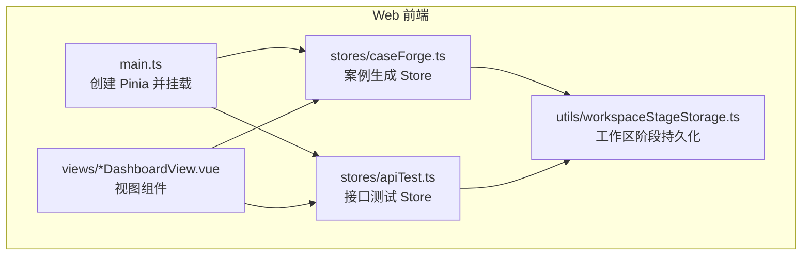
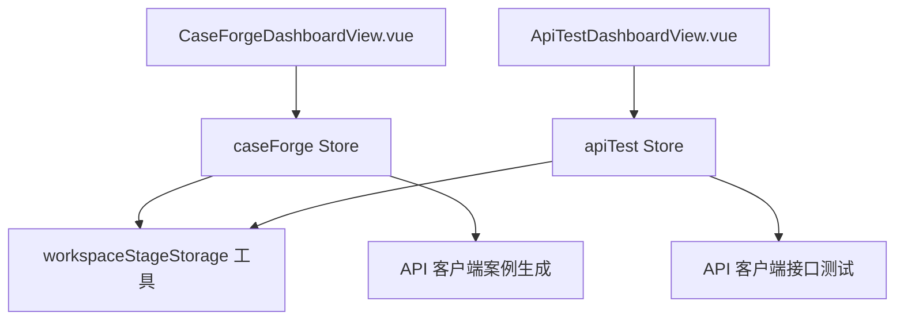
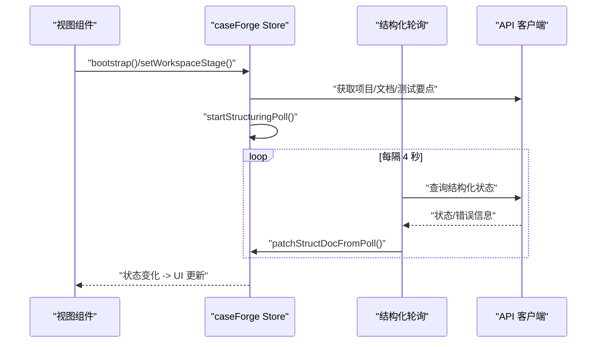
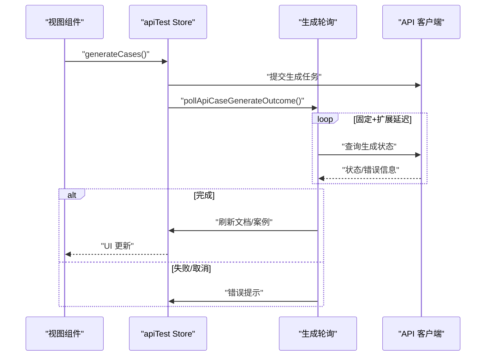
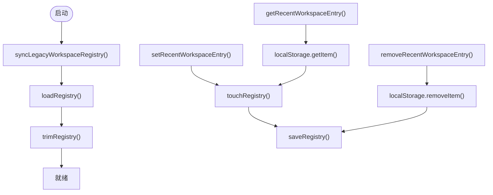
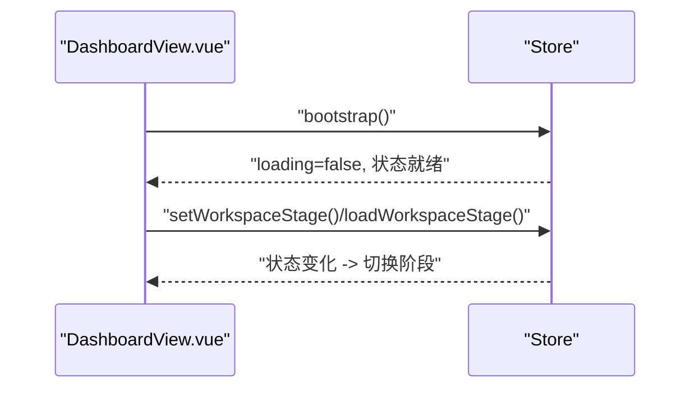
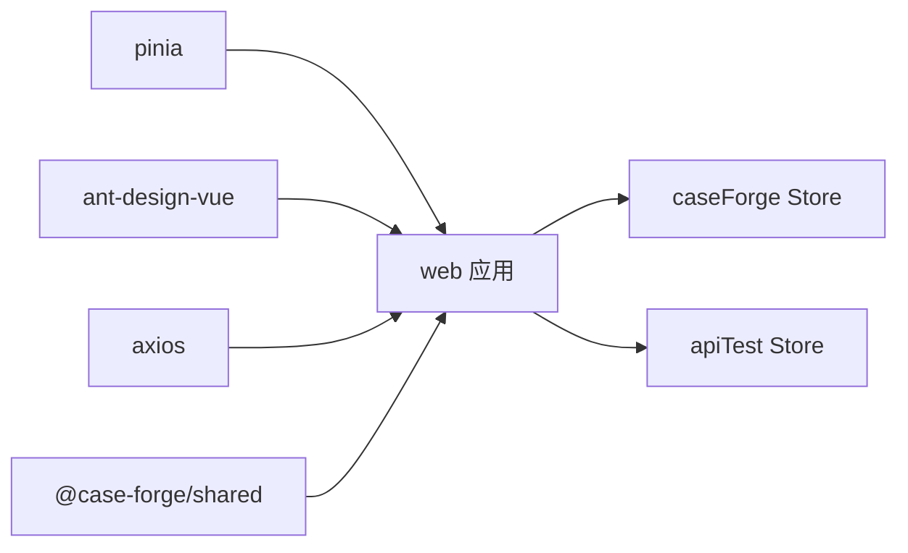

# 状态管理

<cite>
**本文引用的文件**
- [apps/web/src/stores/apiTest.ts](file://apps/web/src/stores/apiTest.ts)
- [apps/web/src/stores/caseForge.ts](file://apps/web/src/stores/caseForge.ts)
- [apps/web/src/main.ts](file://apps/web/src/main.ts)
- [apps/web/src/views/CaseForgeDashboardView.vue](file://apps/web/src/views/CaseForgeDashboardView.vue)
- [apps/web/src/views/ApiTestDashboardView.vue](file://apps/web/src/views/ApiTestDashboardView.vue)
- [apps/web/src/utils/workspaceStageStorage.ts](file://apps/web/src/utils/workspaceStageStorage.ts)
- [packages/shared/src/index.ts](file://packages/shared/src/index.ts)
- [apps/web/package.json](file://apps/web/package.json)
</cite>

## 目录
1. [简介](#简介)
2. [项目结构](#项目结构)
3. [核心组件](#核心组件)
4. [架构总览](#架构总览)
5. [详细组件分析](#详细组件分析)
6. [依赖分析](#依赖分析)
7. [性能考量](#性能考量)
8. [故障排查指南](#故障排查指南)
9. [结论](#结论)
10. [附录](#附录)

## 简介
本文件系统性梳理本仓库中基于 Pinia 的状态管理实践，重点围绕以下目标展开：
- 深入解释 Pinia 使用模式与 Store 设计原则
- 详解案例编辑状态、API 测试状态与全局应用状态的管理策略
- 阐述状态持久化、异步操作处理与状态同步机制
- 提供状态调试工具使用、性能优化与内存管理建议
- 给出状态架构设计指南、模块化组织与团队协作规范

本项目在 Web 前端采用 Pinia 管理跨页面与跨组件的状态，结合本地存储与轮询机制，实现工作区阶段记忆、长任务状态追踪与分页数据管理。

## 项目结构
- 状态管理位于 Web 应用层，通过 Pinia 定义多个 Store，分别服务于“案例生成”和“接口测试”两大业务域
- Store 与视图组件通过组合式 API 在组件内直接消费，实现细粒度的状态订阅与响应式更新
- 全局初始化在应用入口完成，确保 Store 在路由与组件挂载前可用

**图表来源**
- [apps/web/src/main.ts:1-20](file://apps/web/src/main.ts#L1-L20)
- [apps/web/src/stores/caseForge.ts:146-182](file://apps/web/src/stores/caseForge.ts#L146-L182)
- [apps/web/src/stores/apiTest.ts:146-183](file://apps/web/src/stores/apiTest.ts#L146-L183)
- [apps/web/src/views/CaseForgeDashboardView.vue:61-130](file://apps/web/src/views/CaseForgeDashboardView.vue#L61-L130)
- [apps/web/src/views/ApiTestDashboardView.vue:78-180](file://apps/web/src/views/ApiTestDashboardView.vue#L78-L180)
- [apps/web/src/utils/workspaceStageStorage.ts:1-113](file://apps/web/src/utils/workspaceStageStorage.ts#L1-L113)

**章节来源**
- [apps/web/src/main.ts:1-20](file://apps/web/src/main.ts#L1-L20)
- [apps/web/src/stores/caseForge.ts:146-182](file://apps/web/src/stores/caseForge.ts#L146-L182)
- [apps/web/src/stores/apiTest.ts:146-183](file://apps/web/src/stores/apiTest.ts#L146-L183)
- [apps/web/src/views/CaseForgeDashboardView.vue:61-130](file://apps/web/src/views/CaseForgeDashboardView.vue#L61-L130)
- [apps/web/src/views/ApiTestDashboardView.vue:78-180](file://apps/web/src/views/ApiTestDashboardView.vue#L78-L180)
- [apps/web/src/utils/workspaceStageStorage.ts:1-113](file://apps/web/src/utils/workspaceStageStorage.ts#L1-L113)

## 核心组件
- 案例生成 Store（caseForge）
  - 负责项目、结构化文档、测试要点、生成队列、运行记录与案例树编辑等状态
  - 提供结构化轮询、生成队列轮询、工作区阶段持久化、分页与过滤等能力
- 接口测试 Store（apiTest）
  - 负责项目、交易码、接口文档、案例、环境、执行集、运行记录等状态
  - 提供文档上传/结构化、案例生成（含轮询）、执行集管理、批量执行等能力
- 工作区阶段持久化工具
  - 基于本地存储与 LRU 注册表，实现工作区阶段与最近活动的持久化与清理

**章节来源**
- [apps/web/src/stores/caseForge.ts:100-182](file://apps/web/src/stores/caseForge.ts#L100-L182)
- [apps/web/src/stores/apiTest.ts:108-183](file://apps/web/src/stores/apiTest.ts#L108-L183)
- [apps/web/src/utils/workspaceStageStorage.ts:1-113](file://apps/web/src/utils/workspaceStageStorage.ts#L1-L113)

## 架构总览
下图展示了前端状态管理的整体交互：视图组件通过组合式 API 访问 Store，Store 内部封装状态、计算属性与动作，动作中调用 API 客户端与持久化工具，最终驱动 UI 更新。

**图表来源**
- [apps/web/src/views/CaseForgeDashboardView.vue:61-130](file://apps/web/src/views/CaseForgeDashboardView.vue#L61-L130)
- [apps/web/src/views/ApiTestDashboardView.vue:78-180](file://apps/web/src/views/ApiTestDashboardView.vue#L78-L180)
- [apps/web/src/stores/caseForge.ts:146-182](file://apps/web/src/stores/caseForge.ts#L146-L182)
- [apps/web/src/stores/apiTest.ts:146-183](file://apps/web/src/stores/apiTest.ts#L146-L183)
- [apps/web/src/utils/workspaceStageStorage.ts:1-113](file://apps/web/src/utils/workspaceStageStorage.ts#L1-L113)

## 详细组件分析

### 案例生成 Store（caseForge）分析
- 设计原则
  - 单一职责：围绕“项目-结构化文档-测试要点-生成队列-运行记录-案例树”的完整生命周期
  - 分层动作：将复杂流程拆分为“引导加载、阶段切换、数据刷新、长任务轮询、持久化”
  - 状态收敛：通过 getters 将派生状态（如合并后的测试要点）暴露给视图
- 关键状态与行为
  - 项目与运行记录：项目列表、活动项目、运行汇总、活动运行树
  - 文档与动态指令：结构化文档、场景库、测试要点元数据与详情
  - 生成队列与轮询：生成中标识、轮询定时器、队列状态映射
  - 工作区阶段：文档/约束/编辑台三阶段，配合本地存储持久化
- 异步与轮询
  - 结构化轮询：可见性感知、间隔轮询、状态变更检测与完成回调
  - 生成队列轮询：集中定时器、按测试要点增量刷新、失败容错
  - 遗留状态恢复：启动时扫描“孤儿”生成任务并恢复轮询
- 数据持久化
  - 工作区阶段与最近活动：LRU 注册表限制数量，自动裁剪过期键
  - 项目删除联动清理：批量移除相关工作区键值

**图表来源**
- [apps/web/src/stores/caseForge.ts:220-236](file://apps/web/src/stores/caseForge.ts#L220-L236)
- [apps/web/src/stores/caseForge.ts:831-841](file://apps/web/src/stores/caseForge.ts#L831-L841)
- [apps/web/src/stores/caseForge.ts:842-870](file://apps/web/src/stores/caseForge.ts#L842-L870)
- [apps/web/src/stores/caseForge.ts:903-921](file://apps/web/src/stores/caseForge.ts#L903-L921)

**章节来源**
- [apps/web/src/stores/caseForge.ts:100-182](file://apps/web/src/stores/caseForge.ts#L100-L182)
- [apps/web/src/stores/caseForge.ts:220-236](file://apps/web/src/stores/caseForge.ts#L220-L236)
- [apps/web/src/stores/caseForge.ts:669-718](file://apps/web/src/stores/caseForge.ts#L669-L718)
- [apps/web/src/stores/caseForge.ts:831-870](file://apps/web/src/stores/caseForge.ts#L831-L870)
- [apps/web/src/stores/caseForge.ts:1050-1097](file://apps/web/src/stores/caseForge.ts#L1050-L1097)
- [apps/web/src/stores/caseForge.ts:1194-1220](file://apps/web/src/stores/caseForge.ts#L1194-L1220)

### 接口测试 Store（apiTest）分析
- 设计原则
  - 事务工作区：以“项目-交易码-阶段”为主线，阶段间状态隔离与恢复
  - 并行加载：阶段切换时并行拉取文档、案例、执行集与环境等数据
  - 生成与执行：统一的生成轮询与执行状态管理，支持批量与单条操作
- 关键状态与行为
  - 项目与交易码：列表、活动项目、活动交易码、工作区阶段
  - 文档与案例：文档详情、案例列表、运行记录、执行集
  - 环境与服务：环境列表、环境服务列表、默认/启用环境选择
  - 生成与执行：生成中标识、轮询状态、执行中状态、报告导出
- 异步与轮询
  - 案例生成轮询：固定与扩展延迟序列，兼容长时间任务
  - 执行中状态：运行标志位，避免并发执行
- 数据持久化
  - 工作区阶段与最近交易码：LRU 注册表，项目删除联动清理

**图表来源**
- [apps/web/src/stores/apiTest.ts:684-755](file://apps/web/src/stores/apiTest.ts#L684-L755)
- [apps/web/src/stores/apiTest.ts:756-776](file://apps/web/src/stores/apiTest.ts#L756-L776)
- [apps/web/src/stores/apiTest.ts:816-850](file://apps/web/src/stores/apiTest.ts#L816-L850)

**章节来源**
- [apps/web/src/stores/apiTest.ts:108-183](file://apps/web/src/stores/apiTest.ts#L108-L183)
- [apps/web/src/stores/apiTest.ts:508-532](file://apps/web/src/stores/apiTest.ts#L508-L532)
- [apps/web/src/stores/apiTest.ts:684-755](file://apps/web/src/stores/apiTest.ts#L684-L755)
- [apps/web/src/stores/apiTest.ts:816-850](file://apps/web/src/stores/apiTest.ts#L816-L850)

### 工作区阶段持久化工具分析
- 功能概述
  - 注册表：以 LRU 方式维护最近访问的键集合，超出上限自动裁剪
  - 读写：设置/读取/删除单条键值，批量匹配删除（项目/交易码删除时）
  - 历史迁移：启动时将历史 localStorage 键纳入注册表并裁剪
- 使用方式
  - Store 在阶段切换与项目/交易码变更时写入注册表
  - Store 在启动时同步历史键，保证用户体验连续性

**图表来源**
- [apps/web/src/utils/workspaceStageStorage.ts:87-101](file://apps/web/src/utils/workspaceStageStorage.ts#L87-L101)
- [apps/web/src/utils/workspaceStageStorage.ts:35-48](file://apps/web/src/utils/workspaceStageStorage.ts#L35-L48)
- [apps/web/src/utils/workspaceStageStorage.ts:64-70](file://apps/web/src/utils/workspaceStageStorage.ts#L64-L70)

**章节来源**
- [apps/web/src/utils/workspaceStageStorage.ts:1-113](file://apps/web/src/utils/workspaceStageStorage.ts#L1-L113)

### 视图与 Store 的交互
- 案例生成视图
  - 通过组合式 API 获取 Store 实例，调用 bootstrap 初始化，根据结构化状态控制阶段可用性
- 接口测试视图
  - 通过组合式 API 获取 Store 实例，调用 bootstrap 初始化，按阶段可用性切换工作区

**图表来源**
- [apps/web/src/views/CaseForgeDashboardView.vue:119-122](file://apps/web/src/views/CaseForgeDashboardView.vue#L119-L122)
- [apps/web/src/views/ApiTestDashboardView.vue:169-172](file://apps/web/src/views/ApiTestDashboardView.vue#L169-L172)

**章节来源**
- [apps/web/src/views/CaseForgeDashboardView.vue:61-130](file://apps/web/src/views/CaseForgeDashboardView.vue#L61-L130)
- [apps/web/src/views/ApiTestDashboardView.vue:78-180](file://apps/web/src/views/ApiTestDashboardView.vue#L78-L180)

## 依赖分析
- 状态管理依赖
  - Pinia：提供 Store 定义与响应式状态
  - Ant Design Vue：消息反馈与 UI 组件
  - axios：HTTP 客户端（通过 API 客户端封装）
- 类型与模型
  - 共享包提供案例树、运行记录、项目等核心类型，确保前后端一致

**图表来源**
- [apps/web/package.json:15-27](file://apps/web/package.json#L15-L27)
- [packages/shared/src/index.ts:140-161](file://packages/shared/src/index.ts#L140-L161)

**章节来源**
- [apps/web/package.json:15-27](file://apps/web/package.json#L15-L27)
- [packages/shared/src/index.ts:140-161](file://packages/shared/src/index.ts#L140-L161)

## 性能考量
- 轮询与定时器
  - 结构化轮询与生成队列轮询采用固定间隔，避免频繁请求；在页面不可见时可跳过轮询，降低资源消耗
- 并行加载
  - 阶段切换时对多个数据源进行并行拉取，缩短首屏时间
- 分页与过滤
  - Store 对分页参数进行标准化与边界修正，避免无效请求
- 内存管理
  - 轮询定时器在不需要时及时清理，避免内存泄漏
  - LRU 注册表限制持久化键数量，防止本地存储膨胀

[本节为通用指导，无需特定文件引用]

## 故障排查指南
- 生成任务状态异常
  - 症状：生成中状态长时间不变
  - 排查：检查生成队列轮询是否启动、定时器是否被清理、服务端状态是否变更
  - 处置：调用“恢复孤儿生成状态”逻辑，重新发起轮询
- 结构化文档轮询失败
  - 症状：页面显示“处理中”，但无后续更新
  - 排查：确认可见性状态、轮询间隔、服务端状态变化
  - 处置：手动触发轮询或刷新页面
- 工作区阶段丢失
  - 症状：切换项目/交易码后回到默认阶段
  - 排查：检查本地存储键是否存在、注册表是否裁剪
  - 处置：确认注册表同步与 LRU 裁剪逻辑

**章节来源**
- [apps/web/src/stores/caseForge.ts:1050-1097](file://apps/web/src/stores/caseForge.ts#L1050-L1097)
- [apps/web/src/stores/caseForge.ts:1194-1220](file://apps/web/src/stores/caseForge.ts#L1194-L1220)
- [apps/web/src/stores/caseForge.ts:831-870](file://apps/web/src/stores/caseForge.ts#L831-L870)
- [apps/web/src/utils/workspaceStageStorage.ts:87-101](file://apps/web/src/utils/workspaceStageStorage.ts#L87-L101)

## 结论
本项目通过 Pinia 将复杂的业务状态（案例生成、接口测试、工作区阶段）模块化、可追踪地管理起来。借助本地存储与轮询机制，实现了良好的用户体验与状态一致性。建议在后续迭代中持续关注轮询策略、分页与过滤的健壮性，以及团队在 Store 设计与命名上的规范统一。

[本节为总结，无需特定文件引用]

## 附录

### 状态调试工具使用
- 开发者工具
  - 使用浏览器开发者工具的 Vuex/Pinia 面板观察 Store 状态变化
  - 在动作执行前后对比状态快照，定位异步流程问题
- 日志与消息
  - Store 内部使用消息反馈（如成功/失败提示），便于快速定位问题

[本节为通用指导，无需特定文件引用]

### 状态架构设计指南
- Store 组织
  - 按业务域划分 Store（如案例生成、接口测试），避免状态耦合
  - 将共享类型与常量抽取至共享包，统一版本管理
- 动作设计
  - 将复杂流程拆分为多个小动作，便于测试与复用
  - 明确 loading/running 等状态位，避免竞态
- 持久化策略
  - 仅对用户偏好与工作区状态进行持久化，控制存储体积
  - 使用 LRU 注册表限制持久化键数量

**章节来源**
- [packages/shared/src/index.ts:140-161](file://packages/shared/src/index.ts#L140-L161)
- [apps/web/src/utils/workspaceStageStorage.ts:1-113](file://apps/web/src/utils/workspaceStageStorage.ts#L1-L113)

### 模块化组织与团队协作规范
- 文件命名与目录
  - Store 文件按功能域命名（如 caseForge.ts、apiTest.ts）
  - 工具类（如 workspaceStageStorage.ts）独立存放，职责单一
- 版本与依赖
  - Pinia、Ant Design Vue、axios 等依赖在应用层统一管理
  - 共享类型在共享包中集中维护，避免重复定义

**章节来源**
- [apps/web/package.json:15-27](file://apps/web/package.json#L15-L27)
- [packages/shared/src/index.ts:140-161](file://packages/shared/src/index.ts#L140-L161)