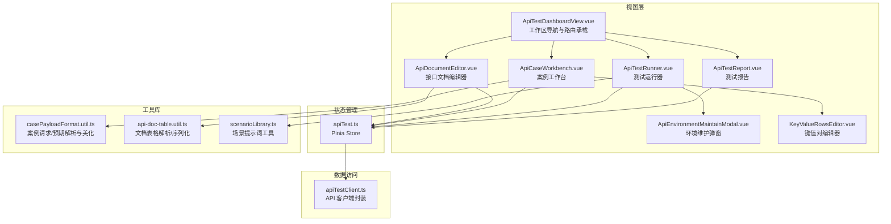
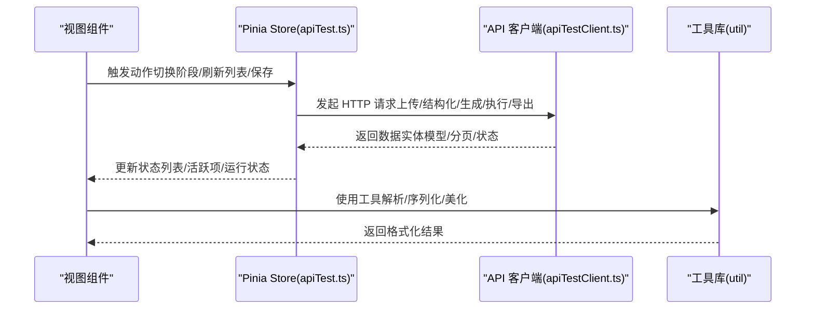
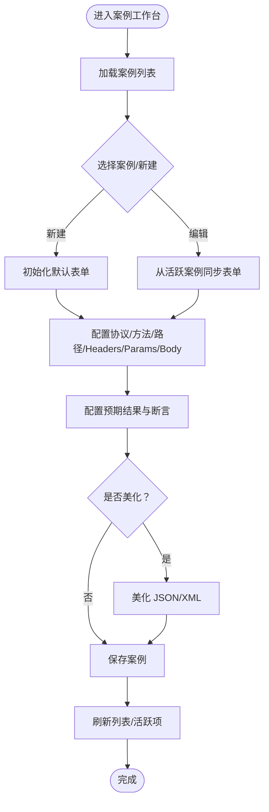
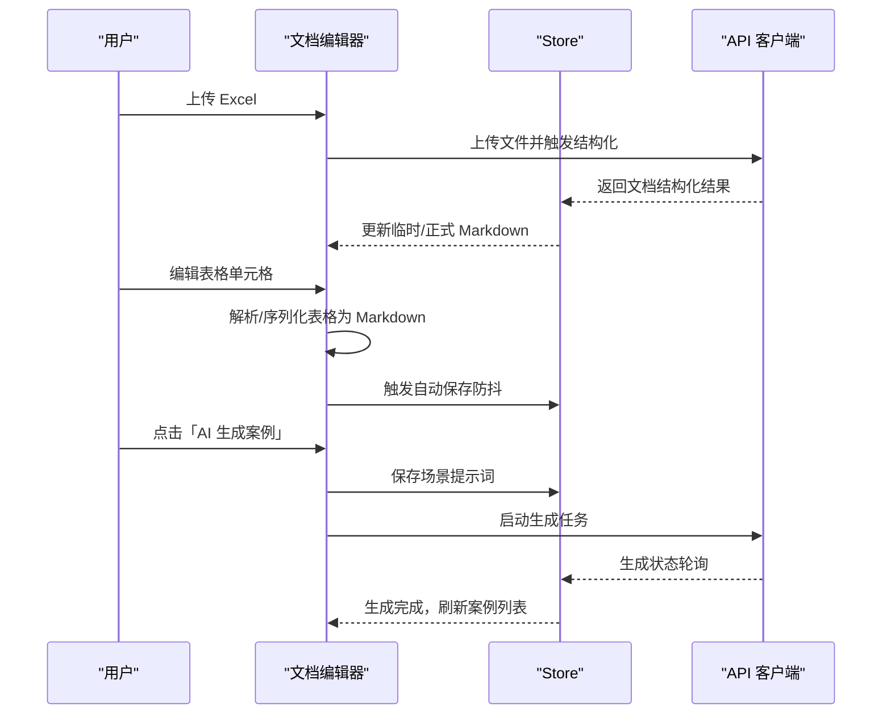
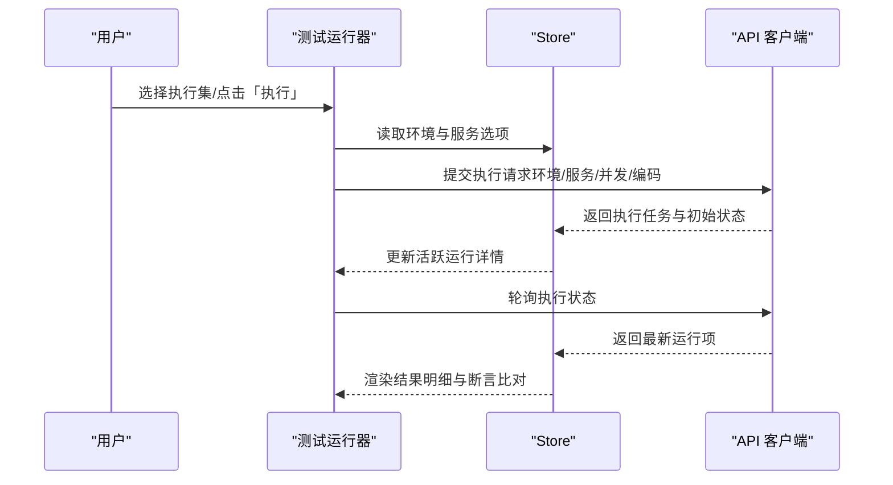
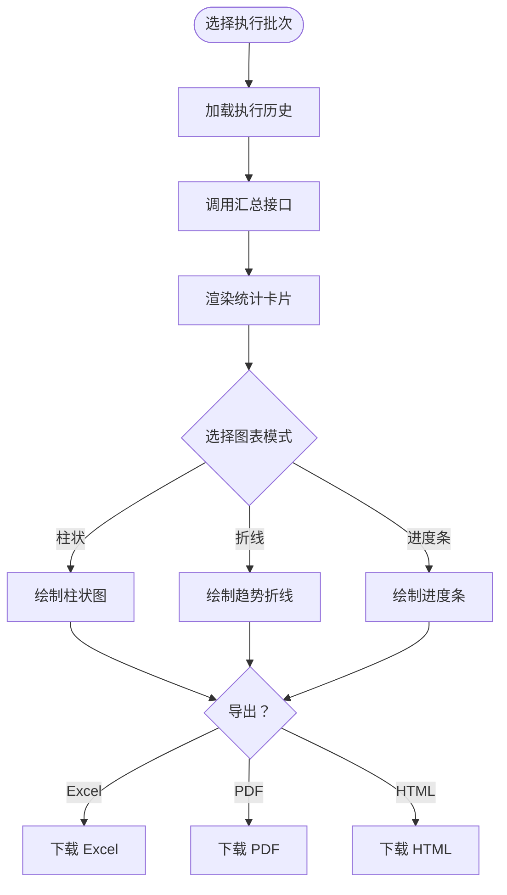
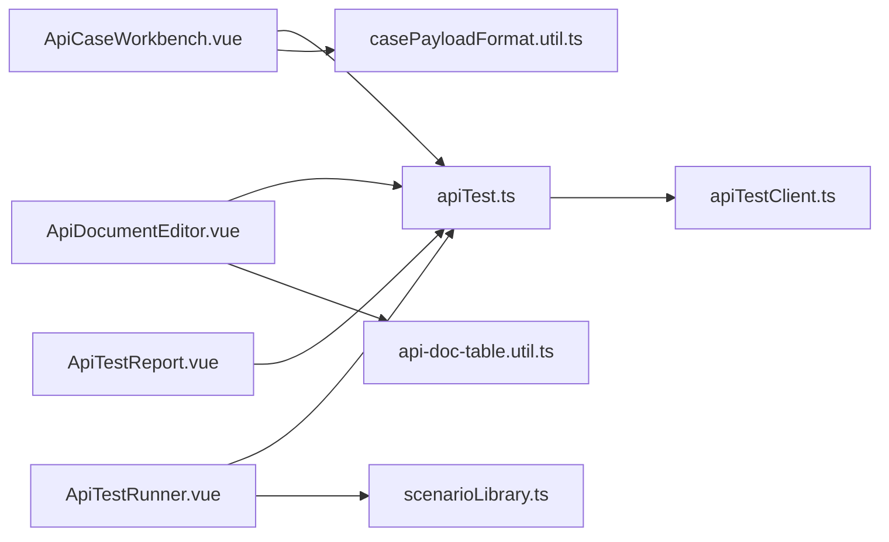

# API 测试组件

<cite>
**本文档引用的文件**
- [ApiCaseWorkbench.vue](file://apps/web/src/components/api-test/ApiCaseWorkbench.vue)
- [ApiDocumentEditor.vue](file://apps/web/src/components/api-test/ApiDocumentEditor.vue)
- [ApiTestRunner.vue](file://apps/web/src/components/api-test/ApiTestRunner.vue)
- [ApiTestReport.vue](file://apps/web/src/components/api-test/ApiTestReport.vue)
- [ApiEnvironmentMaintainModal.vue](file://apps/web/src/components/api-test/ApiEnvironmentMaintainModal.vue)
- [KeyValueRowsEditor.vue](file://apps/web/src/components/api-test/KeyValueRowsEditor.vue)
- [apiTest.ts](file://apps/web/src/stores/apiTest.ts)
- [apiTestClient.ts](file://apps/web/src/api/apiTestClient.ts)
- [casePayloadFormat.util.ts](file://apps/web/src/utils/casePayloadFormat.util.ts)
- [api-doc-table.util.ts](file://apps/web/src/utils/api-doc-table.util.ts)
- [scenarioLibrary.ts](file://apps/web/src/utils/scenarioLibrary.ts)
- [ApiTestDashboardView.vue](file://apps/web/src/views/ApiTestDashboardView.vue)
</cite>

## 目录
1. [简介](#简介)
2. [项目结构](#项目结构)
3. [核心组件](#核心组件)
4. [架构总览](#架构总览)
5. [详细组件分析](#详细组件分析)
6. [依赖关系分析](#依赖关系分析)
7. [性能考量](#性能考量)
8. [故障排查指南](#故障排查指南)
9. [结论](#结论)
10. [附录](#附录)

## 简介
本文件面向 API 测试组件的使用者与维护者，系统性阐述“案例工作台（ApiCaseWorkbench）”、“文档编辑器（ApiDocumentEditor）”、“测试运行器（ApiTestRunner）”、“测试报告（ApiTestReport）”四大核心组件的功能定位、界面布局、交互流程与数据流转机制。文档重点覆盖：
- 案例工作台的测试用例编辑、参数配置与执行控制
- 文档编辑器的富文本编辑与表格化结构化能力
- 测试运行器的执行流程、环境与服务配置、结果展示
- 测试报告的数据可视化与统计分析
- 组件间通信机制、状态同步与数据流转的实现方案

## 项目结构
API 测试组件位于前端应用的 Web 子项目中，采用 Vue 3 + Pinia 的架构模式，配合共享工具库与 API 客户端，形成“视图层组件 + 状态管理 + 数据访问”的清晰分层。

**图表来源**
- [ApiTestDashboardView.vue:66-71](file://apps/web/src/views/ApiTestDashboardView.vue#L66-L71)
- [apiTest.ts:146-183](file://apps/web/src/stores/apiTest.ts#L146-L183)
- [apiTestClient.ts:1-746](file://apps/web/src/api/apiTestClient.ts#L1-L746)
- [casePayloadFormat.util.ts:1-527](file://apps/web/src/utils/casePayloadFormat.util.ts#L1-L527)
- [api-doc-table.util.ts:1-111](file://apps/web/src/utils/api-doc-table.util.ts#L1-L111)
- [scenarioLibrary.ts:1-125](file://apps/web/src/utils/scenarioLibrary.ts#L1-L125)

**章节来源**
- [ApiTestDashboardView.vue:66-71](file://apps/web/src/views/ApiTestDashboardView.vue#L66-L71)
- [apiTest.ts:146-183](file://apps/web/src/stores/apiTest.ts#L146-L183)

## 核心组件
- 案例工作台（ApiCaseWorkbench）：提供案例列表、批量操作、编辑表单、请求/预期配置与保存控制。
- 文档编辑器（ApiDocumentEditor）：支持 Excel 上传、结构化表格、单元格编辑、自动保存与 AI 生成案例。
- 测试运行器（ApiTestRunner）：维护执行集、环境与服务、执行控制、执行历史与结果明细。
- 测试报告（ApiTestReport）：汇总统计、结果分布、趋势分析与多种格式导出。

**章节来源**
- [ApiCaseWorkbench.vue:1-443](file://apps/web/src/components/api-test/ApiCaseWorkbench.vue#L1-L443)
- [ApiDocumentEditor.vue:1-141](file://apps/web/src/components/api-test/ApiDocumentEditor.vue#L1-L141)
- [ApiTestRunner.vue:1-444](file://apps/web/src/components/api-test/ApiTestRunner.vue#L1-L444)
- [ApiTestReport.vue:1-149](file://apps/web/src/components/api-test/ApiTestReport.vue#L1-L149)

## 架构总览
组件通过 Pinia Store 进行状态集中管理，API 客户端负责与后端交互。工具库提供跨组件复用的解析、序列化与格式化能力。

**图表来源**
- [apiTest.ts:227-800](file://apps/web/src/stores/apiTest.ts#L227-L800)
- [apiTestClient.ts:171-746](file://apps/web/src/api/apiTestClient.ts#L171-L746)
- [casePayloadFormat.util.ts:292-458](file://apps/web/src/utils/casePayloadFormat.util.ts#L292-L458)
- [api-doc-table.util.ts:18-59](file://apps/web/src/utils/api-doc-table.util.ts#L18-L59)

## 详细组件分析

### 案例工作台（ApiCaseWorkbench）
- 界面布局
  - 左侧案例列表：支持分页、批量选择、协议标签、极性标识与状态徽章。
  - 右侧编辑面板：协议选择（HTTP/SOCKET/MQ）、请求方法、路径、Headers/Params/Body 切换、预期结果区域与断言说明。
  - 底部工具栏：保存、删除、批量删除入口。
- 功能要点
  - 协议与请求体联动：HTTP 方法影响 Body 可见性；协议切换自动填充默认 Headers 与预期模板。
  - 请求/预期美化：支持 JSON/XML 美化与自动缩进。
  - 断言模板：内置常见断言类型与推荐步骤，降低编写门槛。
- 数据流
  - 表单状态由响应式对象维护，编辑器模式与协议/格式联动计算。
  - 保存时将编辑器状态合并为 ApiCaseRequest/ApiCaseExpected 并提交到后端。

**图表来源**
- [ApiCaseWorkbench.vue:572-598](file://apps/web/src/components/api-test/ApiCaseWorkbench.vue#L572-L598)
- [ApiCaseWorkbench.vue:600-647](file://apps/web/src/components/api-test/ApiCaseWorkbench.vue#L600-L647)
- [casePayloadFormat.util.ts:292-458](file://apps/web/src/utils/casePayloadFormat.util.ts#L292-L458)

**章节来源**
- [ApiCaseWorkbench.vue:1-443](file://apps/web/src/components/api-test/ApiCaseWorkbench.vue#L1-L443)
- [casePayloadFormat.util.ts:1-527](file://apps/web/src/utils/casePayloadFormat.util.ts#L1-L527)

### 文档编辑器（ApiDocumentEditor）
- 界面布局
  - 顶部工具栏：上传、场景设置、AI 生成、保存。
  - 中部表格区域：按节标题拆分的表格，单元格支持自适应高度与自动保存。
  - 弹窗：场景提示词选择与生成确认。
- 功能要点
  - Excel 上传与结构化：支持覆盖上传与重新结构化。
  - 自动保存：防抖延迟保存临时 Markdown，避免频繁网络请求。
  - AI 生成：结合场景提示词批量生成案例，完成后自动跳转编辑。
- 数据流
  - 表格数据解析为结构化 Sections，序列化为 Markdown 文本，提交到后端持久化。

**图表来源**
- [ApiDocumentEditor.vue:363-448](file://apps/web/src/components/api-test/ApiDocumentEditor.vue#L363-L448)
- [apiTest.ts:684-755](file://apps/web/src/stores/apiTest.ts#L684-L755)
- [api-doc-table.util.ts:18-59](file://apps/web/src/utils/api-doc-table.util.ts#L18-L59)

**章节来源**
- [ApiDocumentEditor.vue:1-141](file://apps/web/src/components/api-test/ApiDocumentEditor.vue#L1-L141)
- [api-doc-table.util.ts:1-111](file://apps/web/src/utils/api-doc-table.util.ts#L1-L111)
- [scenarioLibrary.ts:22-34](file://apps/web/src/utils/scenarioLibrary.ts#L22-L34)

### 测试运行器（ApiTestRunner）
- 界面布局
  - 左侧执行集卡片：分页、批量删除、状态徽章与最后执行统计。
  - 右侧详情面板：执行集基本信息、关联案例列表、执行结果明细与历史记录。
  - 弹窗：环境维护、新建执行集、管理案例、执行确认。
- 功能要点
  - 环境与服务：按环境加载可用服务，支持优先服务选择与编码配置。
  - 执行控制：选择环境与服务后发起执行，实时展示执行状态与明细。
  - 结果展示：统计总数/通过/失败/异常，展开查看请求/响应与断言比对。
- 数据流
  - 通过 Store 加载执行集、环境、服务与运行历史；执行时调用运行 API 并轮询状态。

**图表来源**
- [ApiTestRunner.vue:406-442](file://apps/web/src/components/api-test/ApiTestRunner.vue#L406-L442)
- [ApiTestRunner.vue:575-584](file://apps/web/src/components/api-test/ApiTestRunner.vue#L575-L584)
- [apiTestClient.ts:613-646](file://apps/web/src/api/apiTestClient.ts#L613-L646)

**章节来源**
- [ApiTestRunner.vue:1-444](file://apps/web/src/components/api-test/ApiTestRunner.vue#L1-L444)
- [ApiEnvironmentMaintainModal.vue:1-737](file://apps/web/src/components/api-test/ApiEnvironmentMaintainModal.vue#L1-L737)

### 测试报告（ApiTestReport）
- 界面布局
  - 顶部选择执行批次与导出按钮。
  - 统计卡片：总数、通过、失败、通过率。
  - 图表区域：结果分布（柱状/折线/进度条）与图例。
- 功能要点
  - 按执行批次聚合统计，支持近 N 次趋势折线。
  - 多格式导出：Excel、PDF、HTML。
- 数据流
  - 通过 Store 获取执行历史，按选中批次加载汇总数据并渲染图表。

**图表来源**
- [ApiTestReport.vue:151-323](file://apps/web/src/components/api-test/ApiTestReport.vue#L151-L323)
- [apiTestClient.ts:662-672](file://apps/web/src/api/apiTestClient.ts#L662-L672)

**章节来源**
- [ApiTestReport.vue:1-149](file://apps/web/src/components/api-test/ApiTestReport.vue#L1-L149)
- [apiTestClient.ts:648-672](file://apps/web/src/api/apiTestClient.ts#L648-L672)

## 依赖关系分析
- 组件耦合
  - 案例工作台与文档编辑器通过 Store 的“活动交易”与“文档结构”进行弱耦合。
  - 运行器与报告依赖 Store 的“执行历史”与“活跃运行”，形成数据链路闭环。
- 外部依赖
  - API 客户端封装统一的 HTTP 访问与错误处理。
  - 工具库提供跨组件复用的解析/序列化/美化逻辑，降低重复实现。

**图表来源**
- [apiTest.ts:146-183](file://apps/web/src/stores/apiTest.ts#L146-L183)
- [apiTestClient.ts:1-746](file://apps/web/src/api/apiTestClient.ts#L1-L746)
- [casePayloadFormat.util.ts:1-527](file://apps/web/src/utils/casePayloadFormat.util.ts#L1-L527)
- [api-doc-table.util.ts:1-111](file://apps/web/src/utils/api-doc-table.util.ts#L1-L111)
- [scenarioLibrary.ts:1-125](file://apps/web/src/utils/scenarioLibrary.ts#L1-L125)

**章节来源**
- [apiTest.ts:146-183](file://apps/web/src/stores/apiTest.ts#L146-L183)

## 性能考量
- 分页与懒加载
  - 案例与执行集列表均采用分页加载，避免一次性拉取大量数据。
  - 运行器在详情切换时按需加载关联案例与运行历史。
- 防抖与批处理
  - 文档编辑器对自动保存进行防抖，减少网络请求频率。
  - 案例工作台的批量删除与执行集批量删除提升操作效率。
- 图表渲染
  - 报告图表按需渲染，折线图仅展示最近 N 次，避免大数据量渲染开销。

[本节为通用指导，不涉及具体文件分析]

## 故障排查指南
- 文档上传失败
  - 检查文件格式与大小限制；若存在结构化错误，查看错误提示并修正。
  - 参考：[ApiDocumentEditor.vue:363-393](file://apps/web/src/components/api-test/ApiDocumentEditor.vue#L363-L393)
- 案例保存异常
  - 确认必填字段与协议/方法一致性；检查请求体格式是否合法。
  - 参考：[ApiCaseWorkbench.vue:418-423](file://apps/web/src/components/api-test/ApiCaseWorkbench.vue#L418-L423)
- 执行失败或卡住
  - 检查环境与服务配置是否正确；确认编码与消息帧格式；查看断言明细定位问题。
  - 参考：[ApiTestRunner.vue:406-442](file://apps/web/src/components/api-test/ApiTestRunner.vue#L406-L442)
- 报表为空或导出失败
  - 确认已选择执行批次；检查导出格式与服务端返回内容类型。
  - 参考：[ApiTestReport.vue:291-322](file://apps/web/src/components/api-test/ApiTestReport.vue#L291-L322)

**章节来源**
- [ApiDocumentEditor.vue:363-393](file://apps/web/src/components/api-test/ApiDocumentEditor.vue#L363-L393)
- [ApiCaseWorkbench.vue:418-423](file://apps/web/src/components/api-test/ApiCaseWorkbench.vue#L418-L423)
- [ApiTestRunner.vue:406-442](file://apps/web/src/components/api-test/ApiTestRunner.vue#L406-L442)
- [ApiTestReport.vue:291-322](file://apps/web/src/components/api-test/ApiTestReport.vue#L291-L322)

## 结论
API 测试组件围绕“文档 → 案例 → 执行 → 报表”的完整测试生命周期构建，通过 Pinia Store 实现状态集中管理，借助工具库与 API 客户端保证数据一致性与可扩展性。各组件职责清晰、边界明确，既满足日常高效测试，又具备良好的可维护性与可演进空间。

[本节为总结性内容，不涉及具体文件分析]

## 附录
- 关键数据模型与接口参考
  - 文档详情、端点、案例、环境、执行集、运行详情等模型定义参见：[apiTestClient.ts:32-169](file://apps/web/src/api/apiTestClient.ts#L32-L169)
- 工具函数参考
  - 案例请求/预期解析与美化：[casePayloadFormat.util.ts:292-458](file://apps/web/src/utils/casePayloadFormat.util.ts#L292-L458)
  - 文档表格解析/序列化：[api-doc-table.util.ts:18-59](file://apps/web/src/utils/api-doc-table.util.ts#L18-L59)
  - 场景提示词工具：[scenarioLibrary.ts:22-34](file://apps/web/src/utils/scenarioLibrary.ts#L22-L34)

**章节来源**
- [apiTestClient.ts:32-169](file://apps/web/src/api/apiTestClient.ts#L32-L169)
- [casePayloadFormat.util.ts:292-458](file://apps/web/src/utils/casePayloadFormat.util.ts#L292-L458)
- [api-doc-table.util.ts:18-59](file://apps/web/src/utils/api-doc-table.util.ts#L18-L59)
- [scenarioLibrary.ts:22-34](file://apps/web/src/utils/scenarioLibrary.ts#L22-L34)