# API 测试组件

<cite>
**本文引用的文件**
- [ApiCaseWorkbench.vue](file://apps/web/src/components/api-test/ApiCaseWorkbench.vue)
- [ApiDocumentEditor.vue](file://apps/web/src/components/api-test/ApiDocumentEditor.vue)
- [ApiTestRunner.vue](file://apps/web/src/components/api-test/ApiTestRunner.vue)
- [ApiTestReport.vue](file://apps/web/src/components/api-test/ApiTestReport.vue)
- [ApiEnvironmentMaintainModal.vue](file://apps/web/src/components/api-test/ApiEnvironmentMaintainModal.vue)
- [KeyValueRowsEditor.vue](file://apps/web/src/components/api-test/KeyValueRowsEditor.vue)
- [ApiTransactionSmpSyncModal.vue](file://apps/web/src/components/api-test/ApiTransactionSmpSyncModal.vue)
- [ApiDataFunctionMaintainModal.vue](file://apps/web/src/components/api-test/ApiDataFunctionMaintainModal.vue)
- [AssertionRowsEditor.vue](file://apps/web/src/components/api-test/AssertionRowsEditor.vue)
- [overlay-z-index.ts](file://apps/web/src/constants/overlay-z-index.ts)
- [apiTest.ts](file://apps/web/src/stores/apiTest.ts)
- [apiTestClient.ts](file://apps/web/src/api/apiTestClient.ts)
- [casePayloadFormat.util.ts](file://apps/web/src/utils/casePayloadFormat.util.ts)
- [api-doc-table.util.ts](file://apps/web/src/utils/api-doc-table.util.ts)
- [scenarioLibrary.ts](file://apps/web/src/utils/scenarioLibrary.ts)
- [assertionRows.util.ts](file://apps/web/src/utils/assertionRows.util.ts)
- [ApiTestDashboardView.vue](file://apps/web/src/views/ApiTestDashboardView.vue)
</cite>

## 更新摘要
**变更内容**
- 移除了独立的SmpDocumentViewer组件并集成到主编辑器，简化了前端界面架构
- 增强了Excel导入功能和前端解析能力，支持合并单元格处理和换行文本压缩
- 优化了服管平台数据集成，在文档编辑器中直接展示服务调用信息和测试数据
- 改进了案例生成流程，支持更灵活的渠道数据管理和步骤编排
- **新增** 增强的嵌套覆盖层z-index管理，优化模态对话框层级显示，提升断言生成工作流体验

## 目录
1. [简介](#简介)
2. [项目结构](#项目结构)
3. [核心组件](#核心组件)
4. [架构总览](#架构总览)
5. [详细组件分析](#详细组件分析)
6. [依赖关系分析](#依赖关系分析)
7. [性能考量](#性能考量)
8. [故障排查指南](#故障排查指南)
9. [结论](#结论)
10. [附录](#附录)

## 简介
本文件面向 API 测试组件的使用者与维护者，系统性阐述"案例工作台（ApiCaseWorkbench）"、"文档编辑器（ApiDocumentEditor）"、"测试运行器（ApiTestRunner）"、"测试报告（ApiTestReport）"四大核心组件的功能定位、界面布局、交互流程与数据流转机制。文档重点覆盖：
- 案例工作台的测试用例编辑、参数配置与执行控制
- 文档编辑器的富文本编辑与表格化结构化能力
- 测试运行器的执行流程、环境与服务配置、结果展示
- 测试报告的数据可视化与统计分析
- 组件间通信机制、状态同步与数据流转的实现方案
- **新增** 服管平台集成、数据函数管理、断言编辑等增强功能
- **新增** 增强的嵌套覆盖层z-index管理，优化模态对话框层级显示

## 项目结构
API 测试组件位于前端应用的 Web 子项目中，采用 Vue 3 + Pinia 的架构模式，配合共享工具库与 API 客户端，形成"视图层组件 + 状态管理 + 数据访问"的清晰分层。

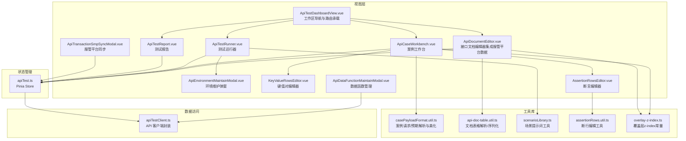
```mermaid
graph TB
subgraph "视图层"
A["ApiTestDashboardView.vue<br/>工作区导航与路由承载"]
B["ApiDocumentEditor.vue<br/>接口文档编辑器集成服管平台数据"]
C["ApiCaseWorkbench.vue<br/>案例工作台"]
D["ApiTestRunner.vue<br/>测试运行器"]
E["ApiTestReport.vue<br/>测试报告"]
F["ApiEnvironmentMaintainModal.vue<br/>环境维护弹窗"]
G["KeyValueRowsEditor.vue<br/>键值对编辑器"]
H["ApiTransactionSmpSyncModal.vue<br/>服管平台同步"]
I["ApiDataFunctionMaintainModal.vue<br/>数据函数管理"]
K["AssertionRowsEditor.vue<br/>断言编辑器"]
end
subgraph "状态管理"
S["apiTest.ts<br/>Pinia Store"]
end
subgraph "数据访问"
L["apiTestClient.ts<br/>API 客户端封装"]
end
subgraph "工具库"
U1["casePayloadFormat.util.ts<br/>案例请求/预期解析与美化"]
U2["api-doc-table.util.ts<br/>文档表格解析/序列化"]
U3["scenarioLibrary.ts<br/>场景提示词工具"]
U4["assertionRows.util.ts<br/>断行编辑工具"]
U5["overlay-z-index.ts<br/>覆盖层z-index常量"]
end
A --> B
A --> C
A --> D
A --> E
C --> G
C --> K
D --> F
B --> S
C --> S
D --> S
E --> S
H --> S
I --> L
S --> L
C --> U1
B --> U2
D --> U3
K --> U4
C --> U5
B --> U5
```

**图表来源**
- [ApiTestDashboardView.vue:66-71](file://apps/web/src/views/ApiTestDashboardView.vue#L66-L71)
- [apiTest.ts:146-183](file://apps/web/src/stores/apiTest.ts#L146-L183)
- [apiTestClient.ts:1-746](file://apps/web/src/api/apiTestClient.ts#L1-L746)
- [casePayloadFormat.util.ts:1-527](file://apps/web/src/utils/casePayloadFormat.util.ts#L1-L527)
- [api-doc-table.util.ts:1-111](file://apps/web/src/utils/api-doc-table.util.ts#L1-L111)
- [scenarioLibrary.ts:1-125](file://apps/web/src/utils/scenarioLibrary.ts#L1-L125)
- [assertionRows.util.ts:1-169](file://apps/web/src/utils/assertionRows.util.ts#L1-L169)
- [overlay-z-index.ts:1-6](file://apps/web/src/constants/overlay-z-index.ts#L1-L6)

**章节来源**
- [ApiTestDashboardView.vue:66-71](file://apps/web/src/views/ApiTestDashboardView.vue#L66-L71)
- [apiTest.ts:146-183](file://apps/web/src/stores/apiTest.ts#L146-L183)

## 核心组件
- 案例工作台（ApiCaseWorkbench）：提供案例列表、批量操作、编辑表单、请求/预期配置与保存控制。
- 文档编辑器（ApiDocumentEditor）：支持 Excel 上传、结构化表格、单元格编辑、自动保存与 AI 生成案例，**已集成服管平台数据查看功能**。
- 测试运行器（ApiTestRunner）：维护执行集、环境与服务、执行控制、执行历史与结果明细。
- 测试报告（ApiTestReport）：汇总统计、结果分布、趋势分析与多种格式导出。
- **新增** 服管平台同步（ApiTransactionSmpSyncModal）：从服管平台拉取交易码并同步到系统。
- **新增** 数据函数管理（ApiDataFunctionMaintainModal）：创建和管理规则生成与数据库查询函数。
- **新增** 断言编辑器（AssertionRowsEditor）：可视化的断言编辑界面，支持多种断言类型。
- **新增** 增强的覆盖层管理（overlay-z-index.ts）：统一的z-index常量管理，确保模态对话框正确层级显示。

**章节来源**
- [ApiCaseWorkbench.vue:1-4531](file://apps/web/src/components/api-test/ApiCaseWorkbench.vue#L1-L4531)
- [ApiDocumentEditor.vue:1-2536](file://apps/web/src/components/api-test/ApiDocumentEditor.vue#L1-L2536)
- [ApiTestRunner.vue:1-444](file://apps/web/src/components/api-test/ApiTestRunner.vue#L1-L444)
- [ApiTestReport.vue:1-149](file://apps/web/src/components/api-test/ApiTestReport.vue#L1-L149)
- [ApiTransactionSmpSyncModal.vue:1-221](file://apps/web/src/components/api-test/ApiTransactionSmpSyncModal.vue#L1-L221)
- [ApiDataFunctionMaintainModal.vue:1-800](file://apps/web/src/components/api-test/ApiDataFunctionMaintainModal.vue#L1-L800)
- [AssertionRowsEditor.vue:1-243](file://apps/web/src/components/api-test/AssertionRowsEditor.vue#L1-L243)
- [overlay-z-index.ts:1-6](file://apps/web/src/constants/overlay-z-index.ts#L1-L6)

## 架构总览
组件通过 Pinia Store 进行状态集中管理，API 客户端负责与后端交互。工具库提供跨组件复用的解析、序列化与格式化能力。**新增** 统一的覆盖层z-index管理，确保复杂嵌套模态场景下的正确层级显示。

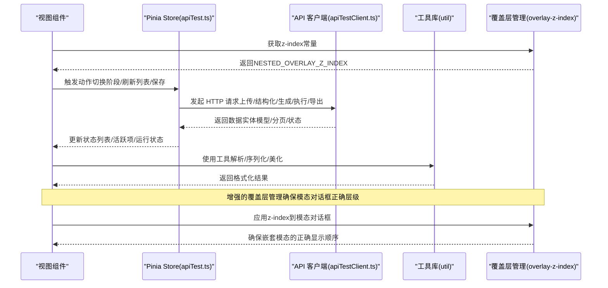
```mermaid
sequenceDiagram
participant V as "视图组件"
participant S as "Pinia Store(apiTest.ts)"
participant C as "API 客户端(apiTestClient.ts)"
participant U as "工具库(util)"
participant Z as "覆盖层管理(overlay-z-index)"
V->>Z : 获取z-index常量
Z-->>V : 返回NESTED_OVERLAY_Z_INDEX
V->>S : 触发动作切换阶段/刷新列表/保存
S->>C : 发起 HTTP 请求上传/结构化/生成/执行/导出
C-->>S : 返回数据实体模型/分页/状态
S-->>V : 更新状态列表/活跃项/运行状态
V->>U : 使用工具解析/序列化/美化
U-->>V : 返回格式化结果
Note over V,Z : 增强的覆盖层管理确保模态对话框正确层级
V->>Z : 应用z-index到模态对话框
Z-->>V : 确保嵌套模态的正确显示顺序
```

**图表来源**
- [apiTest.ts:227-800](file://apps/web/src/stores/apiTest.ts#L227-L800)
- [apiTestClient.ts:171-746](file://apps/web/src/api/apiTestClient.ts#L171-L746)
- [casePayloadFormat.util.ts:292-458](file://apps/web/src/utils/casePayloadFormat.util.ts#L292-L458)
- [api-doc-table.util.ts:18-59](file://apps/web/src/utils/api-doc-table.util.ts#L18-L59)
- [overlay-z-index.ts:1-6](file://apps/web/src/constants/overlay-z-index.ts#L1-L6)
- [ApiCaseWorkbench.vue:406-406](file://apps/web/src/components/api-test/ApiCaseWorkbench.vue#L406-L406)
- [ApiDocumentEditor.vue:249-249](file://apps/web/src/components/api-test/ApiDocumentEditor.vue#L249-L249)

## 详细组件分析

### 案例工作台（ApiCaseWorkbench）
- 界面布局
  - 左侧案例列表：支持分页、批量选择、协议标签、极性标识与状态徽章。
  - 右侧编辑面板：协议选择（HTTP/SOCKET/MQ）、请求方法、路径、Headers/Params/Body 切换、预期结果区域与断言说明。
  - 底部工具栏：保存、删除、批量删除入口。
- 功能要点
  - 协议与请求体联动：HTTP 方法影响 Body 可见性；协议切换自动填充默认 Headers 与预期模板。
  - 请求/预期美化：支持 JSON/XML 美化与自动缩进。
  - 断言模板：内置常见断言类型与推荐步骤，降低编写门槛。
  - **增强** 集成断言编辑器：使用 AssertionRowsEditor 提供可视化的断言编辑体验。
  - **新增** 增强的覆盖层管理：所有模态对话框使用统一的z-index常量，确保嵌套模态的正确显示顺序。
- 数据流
  - 表单状态由响应式对象维护，编辑器模式与协议/格式联动计算。
  - 保存时将编辑器状态合并为 ApiCaseRequest/ApiCaseExpected 并提交到后端。

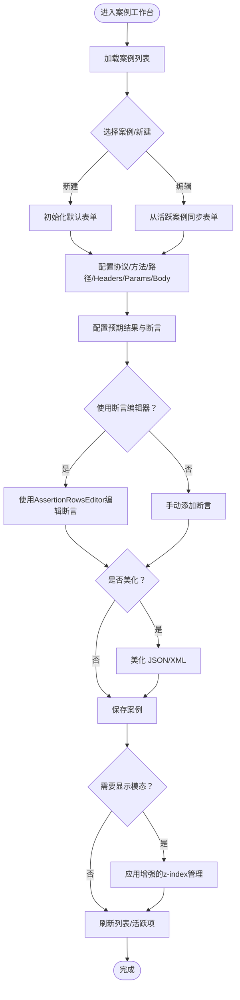
```mermaid
flowchart TD
Start(["进入案例工作台"]) --> LoadCases["加载案例列表"]
LoadCases --> SelectCase{"选择案例/新建"}
SelectCase --> |新建| NewForm["初始化默认表单"]
SelectCase --> |编辑| EditForm["从活跃案例同步表单"]
NewForm --> Config["配置协议/方法/路径/Headers/Params/Body"]
EditForm --> Config
Config --> Expected["配置预期结果与断言"]
Expected --> UseEditor{"使用断言编辑器？"}
UseEditor --> |是| AssertionEditor["使用AssertionRowsEditor编辑断言"]
UseEditor --> |否| ManualAssert["手动添加断言"]
AssertionEditor --> Beautify{"是否美化？"}
ManualAssert --> Beautify
Beautify --> |是| Pretty["美化 JSON/XML"]
Beautify --> |否| Save
Pretty --> Save["保存案例"]
Save --> ModalCheck{"需要显示模态？"}
ModalCheck --> |是| ApplyZIndex["应用增强的z-index管理"]
ModalCheck --> |否| Refresh
ApplyZIndex --> Refresh["刷新列表/活跃项"]
Refresh --> End(["完成"])
```

**图表来源**
- [ApiCaseWorkbench.vue:572-598](file://apps/web/src/components/api-test/ApiCaseWorkbench.vue#L572-L598)
- [ApiCaseWorkbench.vue:600-647](file://apps/web/src/components/api-test/ApiCaseWorkbench.vue#L600-L647)
- [casePayloadFormat.util.ts:292-458](file://apps/web/src/utils/casePayloadFormat.util.ts#L292-L458)
- [AssertionRowsEditor.vue:71-125](file://apps/web/src/components/api-test/AssertionRowsEditor.vue#L71-L125)
- [overlay-z-index.ts:1-6](file://apps/web/src/constants/overlay-z-index.ts#L1-L6)

**章节来源**
- [ApiCaseWorkbench.vue:1-4531](file://apps/web/src/components/api-test/ApiCaseWorkbench.vue#L1-L4531)
- [casePayloadFormat.util.ts:1-527](file://apps/web/src/utils/casePayloadFormat.util.ts#L1-L527)
- [AssertionRowsEditor.vue:1-243](file://apps/web/src/components/api-test/AssertionRowsEditor.vue#L1-L243)
- [assertionRows.util.ts:1-169](file://apps/web/src/utils/assertionRows.util.ts#L1-L169)
- [overlay-z-index.ts:1-6](file://apps/web/src/constants/overlay-z-index.ts#L1-L6)

### 文档编辑器（ApiDocumentEditor）
- 界面布局
  - 顶部工具栏：上传、场景设置、AI 生成、保存。
  - 中部表格区域：按节标题拆分的表格，单元格支持自适应高度与自动保存。
  - 弹窗：场景提示词选择与生成确认。
- 功能要点
  - Excel 上传与结构化：支持覆盖上传与重新结构化。
  - 自动保存：防抖延迟保存临时 Markdown，避免频繁网络请求。
  - AI 生成：结合场景提示词批量生成案例，完成后自动跳转编辑。
  - **增强** 集成服管平台数据：支持显示和编辑来自服管平台的文档数据，无需独立组件。
  - **增强** 数据函数支持：在示例报文中插入自定义函数。
  - **改进** Excel解析能力：支持合并单元格处理和换行文本压缩。
  - **新增** 增强的覆盖层管理：所有模态对话框和下拉菜单使用统一的z-index常量，确保正确的层级显示。
- 数据流
  - 表格数据解析为结构化 Sections，序列化为 Markdown 文本，提交到后端持久化。
  - 服管平台数据通过 `isSmpSource` 标识和 `smpData` 属性直接在编辑器中展示。

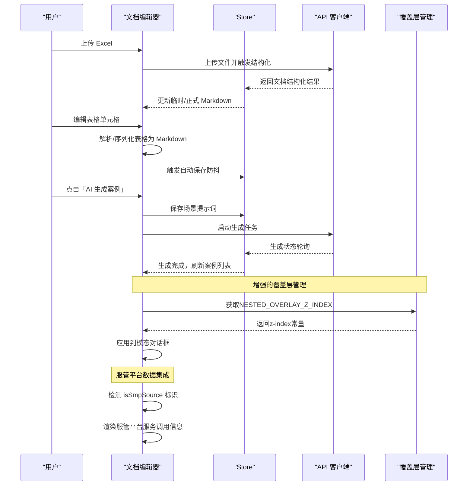
```mermaid
sequenceDiagram
participant U as "用户"
participant E as "文档编辑器"
participant S as "Store"
participant C as "API 客户端"
participant Z as "覆盖层管理"
U->>E : 上传 Excel
E->>C : 上传文件并触发结构化
C-->>S : 返回文档结构化结果
S-->>E : 更新临时/正式 Markdown
U->>E : 编辑表格单元格
E->>E : 解析/序列化表格为 Markdown
E->>S : 触发自动保存防抖
U->>E : 点击「AI 生成案例」
E->>S : 保存场景提示词
E->>C : 启动生成任务
C-->>S : 生成状态轮询
S-->>E : 生成完成，刷新案例列表
Note over E,Z : 增强的覆盖层管理
E->>Z : 获取NESTED_OVERLAY_Z_INDEX
Z-->>E : 返回z-index常量
E->>E : 应用到模态对话框
Note over E : 服管平台数据集成
E->>E : 检测 isSmpSource 标识
E->>E : 渲染服管平台服务调用信息
```

**图表来源**
- [ApiDocumentEditor.vue:363-448](file://apps/web/src/components/api-test/ApiDocumentEditor.vue#L363-L448)
- [apiTest.ts:684-755](file://apps/web/src/stores/apiTest.ts#L684-L755)
- [api-doc-table.util.ts:18-59](file://apps/web/src/utils/api-doc-table.util.ts#L18-L59)
- [ApiDocumentEditor.vue:1095-1124](file://apps/web/src/components/api-test/ApiDocumentEditor.vue#L1095-L1124)
- [overlay-z-index.ts:1-6](file://apps/web/src/constants/overlay-z-index.ts#L1-L6)

**章节来源**
- [ApiDocumentEditor.vue:1-2536](file://apps/web/src/components/api-test/ApiDocumentEditor.vue#L1-L2536)
- [api-doc-table.util.ts:1-111](file://apps/web/src/utils/api-doc-table.util.ts#L1-L111)
- [scenarioLibrary.ts:22-34](file://apps/web/src/utils/scenarioLibrary.ts#L22-L34)
- [ApiDocumentEditor.vue:1095-1124](file://apps/web/src/components/api-test/ApiDocumentEditor.vue#L1095-L1124)
- [overlay-z-index.ts:1-6](file://apps/web/src/constants/overlay-z-index.ts#L1-L6)

### 测试运行器（ApiTestRunner）
- 界面布局
  - 左侧执行集卡片：分页、批量删除、状态徽章与最后执行统计。
  - 右侧详情面板：执行集基本信息、关联案例列表、执行结果明细与历史记录。
  - 弹窗：环境维护、新建执行集、管理案例、执行确认。
- 功能要点
  - 环境与服务：按环境加载可用服务，支持优先服务选择与编码配置。
  - 执行控制：选择环境与服务后发起执行，实时展示执行状态与明细。
  - 结果展示：统计总数/通过/失败/异常，展开查看请求/响应与断言比对。
- 数据流
  - 通过 Store 加载执行集、环境、服务与运行历史；执行时调用运行 API 并轮询状态。

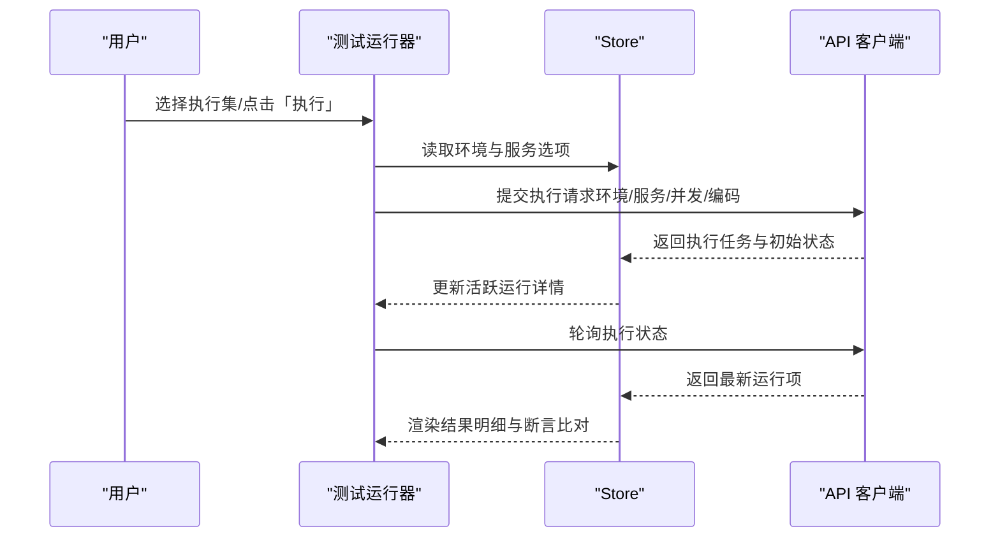
```mermaid
sequenceDiagram
participant U as "用户"
participant R as "测试运行器"
participant S as "Store"
participant C as "API 客户端"
U->>R : 选择执行集/点击「执行」
R->>S : 读取环境与服务选项
R->>C : 提交执行请求环境/服务/并发/编码
C-->>S : 返回执行任务与初始状态
S-->>R : 更新活跃运行详情
R->>C : 轮询执行状态
C-->>S : 返回最新运行项
S-->>R : 渲染结果明细与断言比对
```

**图表来源**
- [ApiTestRunner.vue:406-442](file://apps/web/src/components/api-test/ApiTestRunner.vue#L406-L442)
- [ApiTestRunner.vue:575-584](file://apps/web/src/components/api-test/ApiTestRunner.vue#L575-L584)
- [apiTestClient.ts:613-646](file://apps/web/src/api/apiTestClient.ts#L613-L646)

**章节来源**
- [ApiTestRunner.vue:1-444](file://apps/web/src/components/api-test/ApiTestRunner.vue#L1-L444)
- [ApiEnvironmentMaintainModal.vue:1-737](file://apps/web/src/components/api-test/ApiEnvironmentMaintainModal.vue#L1-L737)

### 测试报告（ApiTestReport）
- 界面布局
  - 顶部选择执行批次与导出按钮。
  - 统计卡片：总数、通过、失败、通过率。
  - 图表区域：结果分布（柱状/折线/进度条）与图例。
- 功能要点
  - 按执行批次聚合统计，支持近 N 次趋势折线。
  - 多格式导出：Excel、PDF、HTML。
- 数据流
  - 通过 Store 获取执行历史，按选中批次加载汇总数据并渲染图表。

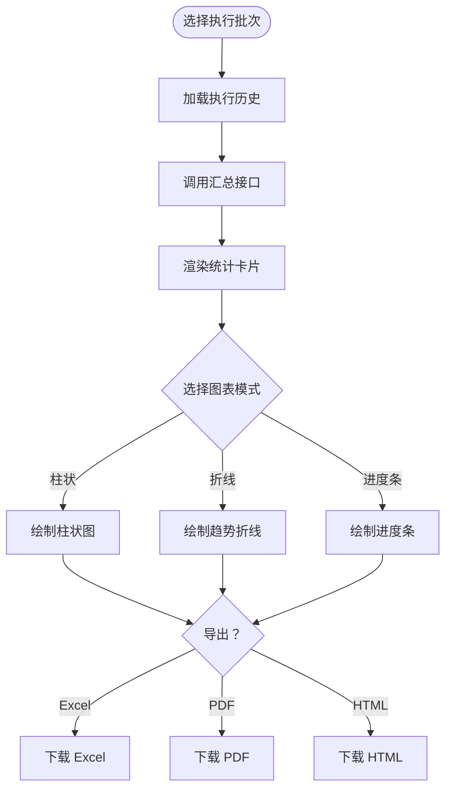
```mermaid
flowchart TD
Start(["选择执行批次"]) --> LoadRuns["加载执行历史"]
LoadRuns --> FetchSummary["调用汇总接口"]
FetchSummary --> RenderStats["渲染统计卡片"]
RenderStats --> ChooseChart{"选择图表模式"}
ChooseChart --> |柱状| Bar["绘制柱状图"]
ChooseChart --> |折线| Line["绘制趋势折线"]
ChooseChart --> |进度条| Progress["绘制进度条"]
Bar --> Export{"导出？"}
Line --> Export
Progress --> Export
Export --> |Excel| XLSX["下载 Excel"]
Export --> |PDF| PDF["下载 PDF"]
Export --> |HTML| HTML["下载 HTML"]
```

**图表来源**
- [ApiTestReport.vue:151-323](file://apps/web/src/components/api-test/ApiTestReport.vue#L151-L323)
- [apiTestClient.ts:662-672](file://apps/web/src/api/apiTestClient.ts#L662-L672)

**章节来源**
- [ApiTestReport.vue:1-149](file://apps/web/src/components/api-test/ApiTestReport.vue#L1-L149)
- [apiTestClient.ts:648-672](file://apps/web/src/api/apiTestClient.ts#L648-L672)

### 覆盖层管理（Overlay Z-Index Management）

#### 统一的z-index常量管理
- **设计目标**：解决复杂嵌套模态场景下的层级冲突问题，确保所有浮层组件正确显示。
- **核心常量**：
  - `IMMERSIVE_OVERLAY_Z_INDEX = 2600`：需盖过沉浸全屏工作区的浮层
  - `NESTED_OVERLAY_Z_INDEX = 2700`：叠在沉浸浮层之上的二级弹窗
- **应用场景**：
  - 模态对话框：基础z-index值为NESTED_OVERLAY_Z_INDEX
  - 嵌套模态：使用NESTED_OVERLAY_Z_INDEX + 10或+20
  - 下拉菜单：使用NESTED_OVERLAY_Z_INDEX + 1
  - 高级下拉菜单：使用NESTED_OVERLAY_Z_INDEX + 11

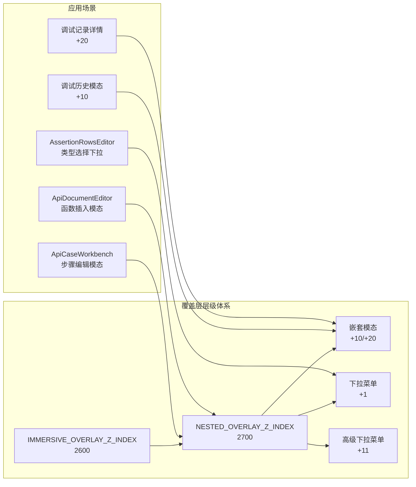
```mermaid
graph LR
subgraph "覆盖层层级体系"
A["IMMERSIVE_OVERLAY_Z_INDEX<br/>2600"] --> B["NESTED_OVERLAY_Z_INDEX<br/>2700"]
B --> C["嵌套模态<br/>+10/+20"]
B --> D["下拉菜单<br/>+1"]
B --> E["高级下拉菜单<br/>+11"]
end
subgraph "应用场景"
F["ApiCaseWorkbench<br/>步骤编辑模态"]
G["ApiDocumentEditor<br/>函数插入模态"]
H["AssertionRowsEditor<br/>类型选择下拉"]
I["调试历史模态<br/>+10"]
J["调试记录详情<br/>+20"]
end
F --> B
G --> B
H --> D
I --> C
J --> C
```

**图表来源**
- [overlay-z-index.ts:1-6](file://apps/web/src/constants/overlay-z-index.ts#L1-L6)
- [ApiCaseWorkbench.vue:406-406](file://apps/web/src/components/api-test/ApiCaseWorkbench.vue#L406-L406)
- [ApiDocumentEditor.vue:249-249](file://apps/web/src/components/api-test/ApiDocumentEditor.vue#L249-L249)
- [AssertionRowsEditor.vue:32-32](file://apps/web/src/components/api-test/AssertionRowsEditor.vue#L32-L32)
- [ApiCaseWorkbench.vue:744-744](file://apps/web/src/components/api-test/ApiCaseWorkbench.vue#L744-L744)
- [ApiCaseWorkbench.vue:769-769](file://apps/web/src/components/api-test/ApiCaseWorkbench.vue#L769-L769)

**章节来源**
- [overlay-z-index.ts:1-6](file://apps/web/src/constants/overlay-z-index.ts#L1-L6)
- [ApiCaseWorkbench.vue:406-406](file://apps/web/src/components/api-test/ApiCaseWorkbench.vue#L406-L406)
- [ApiDocumentEditor.vue:249-249](file://apps/web/src/components/api-test/ApiDocumentEditor.vue#L249-L249)
- [AssertionRowsEditor.vue:32-32](file://apps/web/src/components/api-test/AssertionRowsEditor.vue#L32-L32)

### 服管平台集成组件

#### 服管平台同步（ApiTransactionSmpSyncModal）
- 界面布局
  - 搜索工具栏：支持交易码、服务名称、服务编码等多字段搜索。
  - 数据表格：展示服管平台的交易码列表，支持多选和状态指示。
  - 操作按钮：重新获取数据和确认同步。
- 功能要点
  - 数据筛选：支持关键词搜索和过滤。
  - 批量选择：支持多选交易码进行同步。
  - 状态管理：显示加载状态和同步进度。
- 数据流
  - 通过 Store 调用服管平台接口获取交易码列表。
  - 同步成功后刷新本地交易码列表。

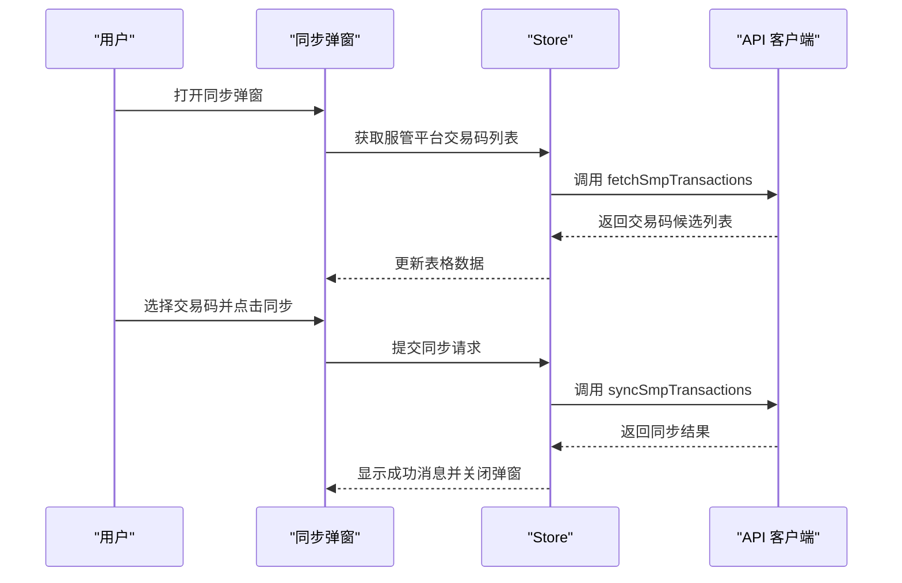
```mermaid
sequenceDiagram
participant U as "用户"
participant M as "同步弹窗"
participant S as "Store"
participant C as "API 客户端"
U->>M : 打开同步弹窗
M->>S : 获取服管平台交易码列表
S->>C : 调用 fetchSmpTransactions
C-->>S : 返回交易码候选列表
S-->>M : 更新表格数据
U->>M : 选择交易码并点击同步
M->>S : 提交同步请求
S->>C : 调用 syncSmpTransactions
C-->>S : 返回同步结果
S-->>M : 显示成功消息并关闭弹窗
```

**图表来源**
- [ApiTransactionSmpSyncModal.vue:131-168](file://apps/web/src/components/api-test/ApiTransactionSmpSyncModal.vue#L131-L168)
- [apiTest.ts:462-479](file://apps/web/src/stores/apiTest.ts#L462-L479)
- [apiTestClient.ts:284-293](file://apps/web/src/api/apiTestClient.ts#L284-L293)

**章节来源**
- [ApiTransactionSmpSyncModal.vue:1-221](file://apps/web/src/components/api-test/ApiTransactionSmpSyncModal.vue#L1-L221)
- [apiTest.ts:462-479](file://apps/web/src/stores/apiTest.ts#L462-L479)

#### 数据函数管理（ApiDataFunctionMaintainModal）
- 界面布局
  - 左侧函数列表：显示已创建的函数，支持新建和选择。
  - 右侧编辑区域：函数元数据编辑、参数配置、代码编辑器。
  - 预览区域：函数试运行和结果展示。
- 功能要点
  - 函数类型：支持规则生成（模板构建器、JavaScript、Python）和数据库查询两种类型。
  - 参数管理：动态添加、删除、重命名参数。
  - 代码编辑：支持 JavaScript 和 Python 脚本编辑，带语法高亮和智能提示。
  - 试运行：支持函数预览执行，验证函数逻辑。
- 数据流
  - 通过 API 客户端进行函数的 CRUD 操作。
  - 数据库连接管理，支持动态获取表结构和字段信息。

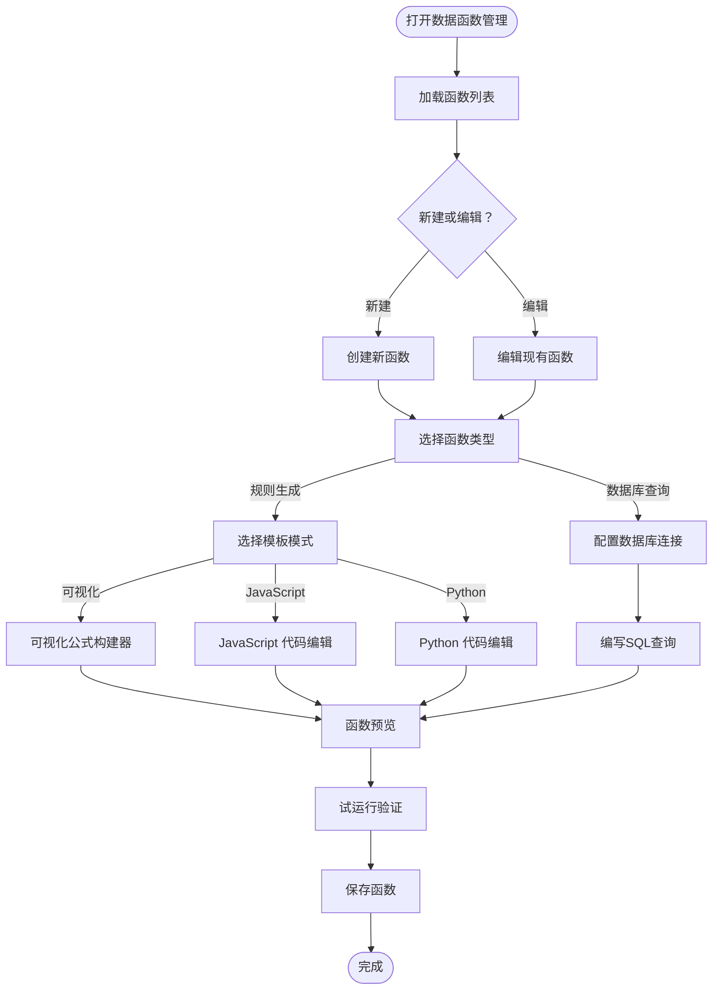
```mermaid
flowchart TD
Start(["打开数据函数管理"]) --> LoadFunctions["加载函数列表"]
LoadFunctions --> CreateOrEdit{"新建或编辑？"}
CreateOrEdit --> |新建| NewFunc["创建新函数"]
CreateOrEdit --> |编辑| EditFunc["编辑现有函数"]
NewFunc --> ConfigType["选择函数类型"]
EditFunc --> ConfigType
ConfigType --> |规则生成| TemplateMode["选择模板模式"]
ConfigType --> |数据库查询| DBConfig["配置数据库连接"]
TemplateMode --> |可视化| Builder["可视化公式构建器"]
TemplateMode --> |JavaScript| JSCode["JavaScript 代码编辑"]
TemplateMode --> |Python| PyCode["Python 代码编辑"]
DBConfig --> SQLQuery["编写SQL查询"]
Builder --> Preview["函数预览"]
JSCode --> Preview
PyCode --> Preview
SQLQuery --> Preview
Preview --> RunTest["试运行验证"]
RunTest --> Save["保存函数"]
Save --> End(["完成"])
```

**图表来源**
- [ApiDataFunctionMaintainModal.vue:351-633](file://apps/web/src/components/api-test/ApiDataFunctionMaintainModal.vue#L351-L633)
- [apiTestClient.ts:1206-1261](file://apps/web/src/api/apiTestClient.ts#L1206-L1261)

**章节来源**
- [ApiDataFunctionMaintainModal.vue:1-800](file://apps/web/src/components/api-test/ApiDataFunctionMaintainModal.vue#L1-L800)
- [apiTestClient.ts:1206-1261](file://apps/web/src/api/apiTestClient.ts#L1206-L1261)

### 断言编辑器（AssertionRowsEditor）
- 界面布局
  - 列头：描述、类型、比较、表达式、期望值、操作。
  - 行编辑：每行一个断言，支持动态添加和删除。
  - 输入控件：根据断言类型动态显示相应的输入控件。
- 功能要点
  - 类型过滤：根据协议类型过滤可用的断言类型。
  - 智能提示：根据断言类型显示合适的占位符提示。
  - 数据转换：在行数据和断言模型之间进行转换。
  - **新增** 增强的覆盖层管理：下拉选择器使用统一的z-index常量，确保在嵌套模态中正确显示。
- 数据流
  - 通过 v-model 双向绑定断言行数组。
  - 使用工具函数进行数据格式化和验证。

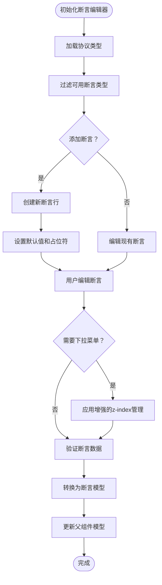
```mermaid
flowchart TD
Start(["初始化断言编辑器"]) --> LoadProtocol["加载协议类型"]
LoadProtocol --> FilterTypes["过滤可用断言类型"]
FilterTypes --> AddRow{"添加断言？"}
AddRow --> |是| CreateRow["创建新断言行"]
AddRow --> |否| EditExisting["编辑现有断言"]
CreateRow --> SetDefaults["设置默认值和占位符"]
SetDefaults --> UserEdit["用户编辑断言"]
EditExisting --> UserEdit
UserEdit --> DropdownCheck{"需要下拉菜单？"}
DropdownCheck --> |是| ApplyZIndex["应用增强的z-index管理"]
DropdownCheck --> |否| Validate
ApplyZIndex --> Validate["验证断言数据"]
Validate --> Convert["转换为断言模型"]
Convert --> UpdateModel["更新父组件模型"]
UpdateModel --> End(["完成"])
```

**图表来源**
- [AssertionRowsEditor.vue:71-125](file://apps/web/src/components/api-test/AssertionRowsEditor.vue#L71-L125)
- [assertionRows.util.ts:51-108](file://apps/web/src/utils/assertionRows.util.ts#L51-L108)
- [overlay-z-index.ts:1-6](file://apps/web/src/constants/overlay-z-index.ts#L1-L6)

**章节来源**
- [AssertionRowsEditor.vue:1-243](file://apps/web/src/components/api-test/AssertionRowsEditor.vue#L1-L243)
- [assertionRows.util.ts:1-169](file://apps/web/src/utils/assertionRows.util.ts#L1-L169)
- [overlay-z-index.ts:1-6](file://apps/web/src/constants/overlay-z-index.ts#L1-L6)

## 依赖关系分析
- 组件耦合
  - 案例工作台与文档编辑器通过 Store 的"活动交易"与"文档结构"进行弱耦合。
  - 运行器与报告依赖 Store 的"执行历史"与"活跃运行"，形成数据链路闭环。
  - **改进** 服管平台组件与 Store 深度集成，实现交易码同步和文档刷新，不再需要独立组件。
  - **新增** 数据函数组件独立管理，通过 API 客户端直接操作后端服务。
  - **新增** 统一的覆盖层管理，所有组件共享z-index常量，确保一致的层级行为。
- 外部依赖
  - API 客户端封装统一的 HTTP 访问与错误处理。
  - 工具库提供跨组件复用的解析/序列化/美化逻辑，降低重复实现。

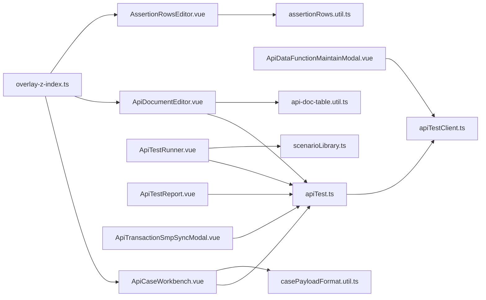
```mermaid
graph LR
CW["ApiCaseWorkbench.vue"] --> ST["apiTest.ts"]
DE["ApiDocumentEditor.vue"] --> ST
RU["ApiTestRunner.vue"] --> ST
RP["ApiTestReport.vue"] --> ST
SM["ApiTransactionSmpSyncModal.vue"] --> ST
DF["ApiDataFunctionMaintainModal.vue"] --> AC["apiTestClient.ts"]
AE["AssertionRowsEditor.vue"] --> ARU["assertionRows.util.ts"]
Z["overlay-z-index.ts"] --> CW
Z --> DE
Z --> AE
ST --> AC
CW --> CF["casePayloadFormat.util.ts"]
DE --> ADT["api-doc-table.util.ts"]
RU --> SL["scenarioLibrary.ts"]
```

**图表来源**
- [apiTest.ts:146-183](file://apps/web/src/stores/apiTest.ts#L146-L183)
- [apiTestClient.ts:1-746](file://apps/web/src/api/apiTestClient.ts#L1-L746)
- [casePayloadFormat.util.ts:1-527](file://apps/web/src/utils/casePayloadFormat.util.ts#L1-L527)
- [api-doc-table.util.ts:1-111](file://apps/web/src/utils/api-doc-table.util.ts#L1-L111)
- [scenarioLibrary.ts:1-125](file://apps/web/src/utils/scenarioLibrary.ts#L1-L125)
- [assertionRows.util.ts:1-169](file://apps/web/src/utils/assertionRows.util.ts#L1-L169)
- [overlay-z-index.ts:1-6](file://apps/web/src/constants/overlay-z-index.ts#L1-L6)

**章节来源**
- [apiTest.ts:146-183](file://apps/web/src/stores/apiTest.ts#L146-L183)

## 性能考量
- 分页与懒加载
  - 案例与执行集列表均采用分页加载，避免一次性拉取大量数据。
  - 运行器在详情切换时按需加载关联案例与运行历史。
- 防抖与批处理
  - 文档编辑器对自动保存进行防抖，减少网络请求频率。
  - 案例工作台的批量删除与执行集批量删除提升操作效率。
- 图表渲染
  - 报告图表按需渲染，折线图仅展示最近 N 次，避免大数据量渲染开销。
- **新增优化**
  - 服管平台数据缓存：避免重复请求相同的服管平台数据。
  - 数据函数预加载：在弹窗打开时并行加载函数列表和数据库连接信息。
  - 断言编辑器虚拟滚动：支持大量断行的流畅编辑体验。
  - **改进** Excel解析性能：合并单元格处理和换行文本压缩优化。
  - **新增** 覆盖层性能优化：统一的z-index管理减少样式重排和重绘。

[本节为通用指导，不涉及具体文件分析]

## 故障排查指南
- 文档上传失败
  - 检查文件格式与大小限制；若存在结构化错误，查看错误提示并修正。
  - 参考：[ApiDocumentEditor.vue:363-393](file://apps/web/src/components/api-test/ApiDocumentEditor.vue#L363-L393)
- 案例保存异常
  - 确认必填字段与协议/方法一致性；检查请求体格式是否合法。
  - 参考：[ApiCaseWorkbench.vue:418-423](file://apps/web/src/components/api-test/ApiCaseWorkbench.vue#L418-L423)
- 执行失败或卡住
  - 检查环境与服务配置是否正确；确认编码与消息帧格式；查看断言明细定位问题。
  - 参考：[ApiTestRunner.vue:406-442](file://apps/web/src/components/api-test/ApiTestRunner.vue#L406-L442)
- 报表为空或导出失败
  - 确认已选择执行批次；检查导出格式与服务端返回内容类型。
  - 参考：[ApiTestReport.vue:291-322](file://apps/web/src/components/api-test/ApiTestReport.vue#L291-L322)
- **新增故障排查**
  - 服管平台同步失败：检查网络连接和服管平台服务状态；查看浏览器控制台错误信息。
  - 数据函数运行错误：验证函数语法和参数类型；检查数据库连接配置。
  - 断言编辑器数据丢失：确认 v-model 绑定是否正确；检查断言类型兼容性。
  - **新增** Excel导入问题：检查合并单元格格式；确认换行文本是否正确压缩。
  - **新增** 模态对话框层级问题：检查z-index常量是否正确应用；确认嵌套模态的层级递增。

**章节来源**
- [ApiDocumentEditor.vue:363-393](file://apps/web/src/components/api-test/ApiDocumentEditor.vue#L363-L393)
- [ApiCaseWorkbench.vue:418-423](file://apps/web/src/components/api-test/ApiCaseWorkbench.vue#L418-L423)
- [ApiTestRunner.vue:406-442](file://apps/web/src/components/api-test/ApiTestRunner.vue#L406-L442)
- [ApiTestReport.vue:291-322](file://apps/web/src/components/api-test/ApiTestReport.vue#L291-L322)

## 结论
API 测试组件围绕"文档 → 案例 → 执行 → 报表"的完整测试生命周期构建，通过 Pinia Store 实现状态集中管理，借助工具库与 API 客户端保证数据一致性与可扩展性。各组件职责清晰、边界明确，既满足日常高效测试，又具备良好的可维护性与可演进空间。

**本次更新的主要改进包括：**
- **简化了前端架构**：移除了独立的SmpDocumentViewer组件，将服管平台数据查看功能集成到主编辑器中
- **增强了Excel处理能力**：改进了合并单元格处理和换行文本压缩，提升了导入成功率
- **优化了用户体验**：在文档编辑器中直接展示服管平台的服务调用信息和测试数据，减少了页面跳转
- **提升了整体性能**：通过更好的数据缓存和解析优化，提高了文档处理的响应速度
- **新增了增强的覆盖层管理**：统一的z-index常量管理解决了复杂嵌套模态场景下的层级冲突问题，显著改善了断言生成工作流的用户体验

[本节为总结性内容，不涉及具体文件分析]

## 附录
- 关键数据模型与接口参考
  - 文档详情、端点、案例、环境、执行集、运行详情等模型定义参见：[apiTestClient.ts:32-169](file://apps/web/src/api/apiTestClient.ts#L32-L169)
  - **新增** 服管平台交易码、数据函数、数据库连接等模型定义参见：[apiTestClient.ts:284-293](file://apps/web/src/api/apiTestClient.ts#L284-L293), [apiTestClient.ts:1206-1261](file://apps/web/src/api/apiTestClient.ts#L1206-L1261)
- 工具函数参考
  - 案例请求/预期解析与美化：[casePayloadFormat.util.ts:292-458](file://apps/web/src/utils/casePayloadFormat.util.ts#L292-L458)
  - 文档表格解析/序列化：[api-doc-table.util.ts:18-59](file://apps/web/src/utils/api-doc-table.util.ts#L18-L59)
  - 场景提示词工具：[scenarioLibrary.ts:22-34](file://apps/web/src/utils/scenarioLibrary.ts#L22-L34)
  - **新增** 断言编辑工具：[assertionRows.util.ts:51-108](file://apps/web/src/utils/assertionRows.util.ts#L51-L108)
  - **改进** Excel解析工具：[api-doc-extract.util.ts:28-111](file://apps/api/src/modules/api-test/util/api-doc-extract.util.ts#L28-L111)
  - **新增** 覆盖层管理工具：[overlay-z-index.ts:1-6](file://apps/web/src/constants/overlay-z-index.ts#L1-L6)

**章节来源**
- [apiTestClient.ts:32-169](file://apps/web/src/api/apiTestClient.ts#L32-L169)
- [casePayloadFormat.util.ts:292-458](file://apps/web/src/utils/casePayloadFormat.util.ts#L292-L458)
- [api-doc-table.util.ts:18-59](file://apps/web/src/utils/api-doc-table.util.ts#L18-L59)
- [scenarioLibrary.ts:22-34](file://apps/web/src/utils/scenarioLibrary.ts#L22-L34)
- [assertionRows.util.ts:51-108](file://apps/web/src/utils/assertionRows.util.ts#L51-L108)
- [api-doc-extract.util.ts:28-111](file://apps/api/src/modules/api-test/util/api-doc-extract.util.ts#L28-L111)
- [overlay-z-index.ts:1-6](file://apps/web/src/constants/overlay-z-index.ts#L1-L6)