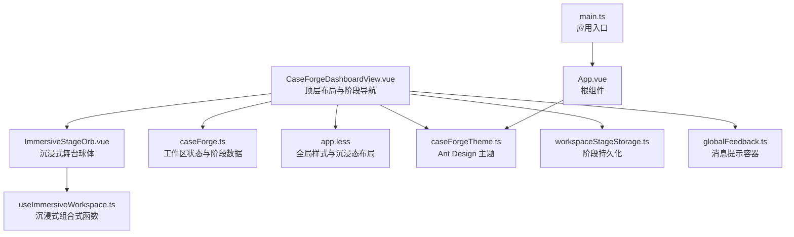
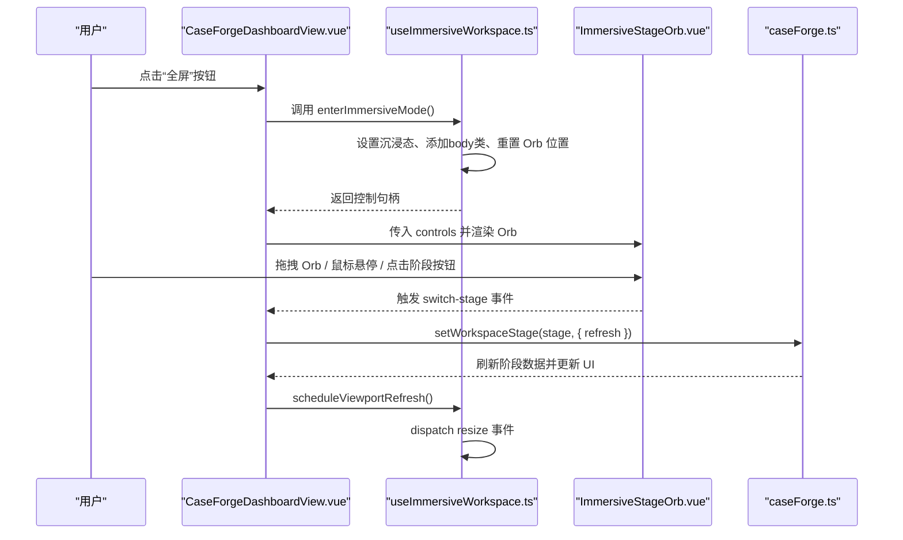
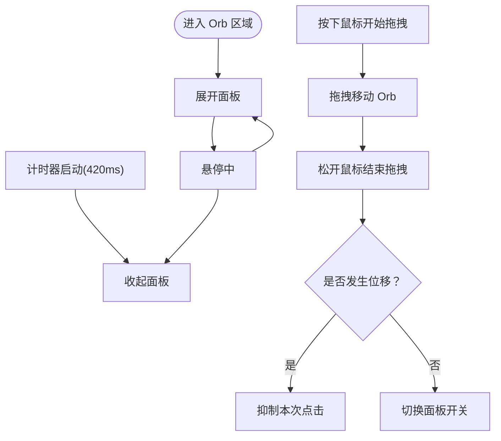
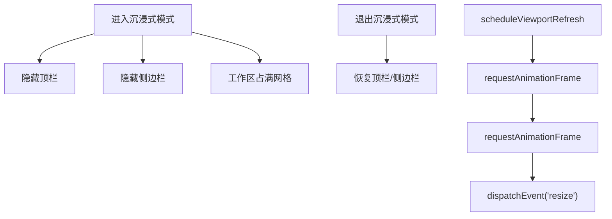
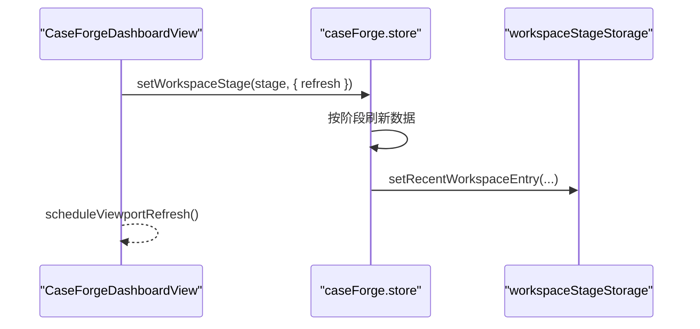
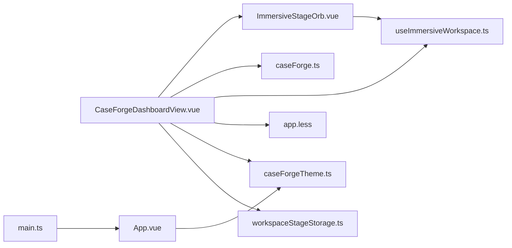

# 工作空间组件

<cite>
**本文档引用的文件**
- [useImmersiveWorkspace.ts](file://apps/web/src/composables/useImmersiveWorkspace.ts)
- [ImmersiveStageOrb.vue](file://apps/web/src/components/workspace/ImmersiveStageOrb.vue)
- [CaseForgeDashboardView.vue](file://apps/web/src/views/CaseForgeDashboardView.vue)
- [caseForge.ts](file://apps/web/src/stores/caseForge.ts)
- [caseForgeTheme.ts](file://apps/web/src/theme/caseForgeTheme.ts)
- [workspaceStageStorage.ts](file://apps/web/src/utils/workspaceStageStorage.ts)
- [app.less](file://apps/web/src/styles/app.less)
- [globalFeedback.ts](file://apps/web/src/utils/globalFeedback.ts)
- [App.vue](file://apps/web/src/App.vue)
- [main.ts](file://apps/web/src/main.ts)
</cite>

## 目录
1. [简介](#简介)
2. [项目结构](#项目结构)
3. [核心组件](#核心组件)
4. [架构总览](#架构总览)
5. [详细组件分析](#详细组件分析)
6. [依赖关系分析](#依赖关系分析)
7. [性能考量](#性能考量)
8. [故障排查指南](#故障排查指南)
9. [结论](#结论)
10. [附录](#附录)

## 简介
本文件系统性梳理“工作空间组件”的设计与实现，重点围绕沉浸式舞台球体（ImmersiveStageOrb）的视觉与交互、useImmersiveWorkspace 组合式函数的状态管理与逻辑封装、工作空间布局与响应式适配、性能优化策略、与其它组件的数据共享与集成方式，以及定制化配置与主题切换方案。目标是帮助开发者快速理解并扩展该工作空间体系。

## 项目结构
工作空间相关代码主要分布在以下模块：
- 视图层：CaseForgeDashboardView.vue 负责顶层布局、阶段导航与沉浸式 Orb 的挂载
- 组合式函数：useImmersiveWorkspace.ts 提供沉浸式模式状态、拖拽、面板开关与视口刷新调度
- 视觉组件：ImmersiveStageOrb.vue 展示 Orb 与阶段面板，处理鼠标/指针事件
- 状态管理：caseForge.ts 提供工作区阶段、项目与运行树等状态
- 样式与主题：app.less 定义全局样式与沉浸式模式下的布局切换；caseForgeTheme.ts 提供 Ant Design 主题配置
- 工具与持久化：workspaceStageStorage.ts 提供工作区阶段的本地存储与 LRU 管理；globalFeedback.ts 管理消息提示容器与沉浸态适配



图表来源
- [CaseForgeDashboardView.vue:1-142](file://apps/web/src/views/CaseForgeDashboardView.vue#L1-L142)
- [ImmersiveStageOrb.vue:1-61](file://apps/web/src/components/workspace/ImmersiveStageOrb.vue#L1-L61)
- [useImmersiveWorkspace.ts:1-195](file://apps/web/src/composables/useImmersiveWorkspace.ts#L1-L195)
- [caseForge.ts:100-182](file://apps/web/src/stores/caseForge.ts#L100-L182)
- [app.less:292-305](file://apps/web/src/styles/app.less#L292-L305)
- [caseForgeTheme.ts:1-39](file://apps/web/src/theme/caseForgeTheme.ts#L1-L39)
- [workspaceStageStorage.ts:1-113](file://apps/web/src/utils/workspaceStageStorage.ts#L1-L113)
- [globalFeedback.ts:1-45](file://apps/web/src/utils/globalFeedback.ts#L1-L45)
- [App.vue:1-39](file://apps/web/src/App.vue#L1-L39)
- [main.ts:1-20](file://apps/web/src/main.ts#L1-L20)

章节来源
- [CaseForgeDashboardView.vue:1-142](file://apps/web/src/views/CaseForgeDashboardView.vue#L1-L142)
- [useImmersiveWorkspace.ts:1-195](file://apps/web/src/composables/useImmersiveWorkspace.ts#L1-L195)
- [ImmersiveStageOrb.vue:1-61](file://apps/web/src/components/workspace/ImmersiveStageOrb.vue#L1-L61)
- [caseForge.ts:100-182](file://apps/web/src/stores/caseForge.ts#L100-L182)
- [app.less:292-305](file://apps/web/src/styles/app.less#L292-L305)

## 核心组件
- 沉浸式组合式函数（useImmersiveWorkspace）
  - 状态：沉浸式模式开关、轨道面板开关、拖拽状态、位置与边界约束、定时器句柄
  - 行为：进入/退出沉浸式模式、拖拽 Orb、面板自动展开/收起、视口刷新调度、键盘与窗口事件绑定/解绑
- 沉浸式舞台球体（ImmersiveStageOrb）
  - 视觉：固定定位的 Orb，悬停显示阶段面板，支持“右/下”方向自适应
  - 交互：鼠标进入/离开触发展开/收起；拖拽 Orb 移动；点击触发面板开关；点击退出按钮退出沉浸式模式
- 工作区视图（CaseForgeDashboardView）
  - 布局：普通模式下包含顶栏与阶段导航；沉浸式模式下隐藏顶栏与侧边栏，最大化工作区
  - 集成：通过组合式函数提供控制能力，绑定键盘事件，驱动阶段切换与视口刷新
- 状态管理（caseForge）
  - 工作区阶段（document/constraints/workbench）、项目与运行树、测试要点列表与过滤、生成队列等
- 主题与样式（caseForgeTheme/app.less）
  - Ant Design 主题令牌与品牌色；沉浸态下布局与可见性切换

章节来源
- [useImmersiveWorkspace.ts:9-195](file://apps/web/src/composables/useImmersiveWorkspace.ts#L9-L195)
- [ImmersiveStageOrb.vue:1-61](file://apps/web/src/components/workspace/ImmersiveStageOrb.vue#L1-L61)
- [CaseForgeDashboardView.vue:1-142](file://apps/web/src/views/CaseForgeDashboardView.vue#L1-L142)
- [caseForge.ts:100-182](file://apps/web/src/stores/caseForge.ts#L100-L182)
- [caseForgeTheme.ts:1-39](file://apps/web/src/theme/caseForgeTheme.ts#L1-L39)
- [app.less:292-305](file://apps/web/src/styles/app.less#L292-L305)

## 架构总览
从视图到组合式函数再到状态管理的整体调用链如下：



图表来源
- [CaseForgeDashboardView.vue:74-105](file://apps/web/src/views/CaseForgeDashboardView.vue#L74-L105)
- [useImmersiveWorkspace.ts:52-76](file://apps/web/src/composables/useImmersiveWorkspace.ts#L52-L76)
- [ImmersiveStageOrb.vue:13-44](file://apps/web/src/components/workspace/ImmersiveStageOrb.vue#L13-L44)
- [caseForge.ts:649-667](file://apps/web/src/stores/caseForge.ts#L649-L667)

## 详细组件分析

### 沉浸式舞台球体（ImmersiveStageOrb）分析
- 视觉与布局
  - 固定定位的 Orb，尺寸与边距由常量定义，支持根据位置自动选择面板“右/下”方向
  - 面板采用毛玻璃背景与阴影，右/左方向自适应
- 交互行为
  - 鼠标进入触发展开，离开延时收起；拖拽移动 Orb 并抑制后续点击
  - 点击 Orb 触发面板开关；点击退出按钮退出沉浸式模式
- 事件绑定
  - 通过父组件传入的 controls 处理所有交互，避免直接操作 DOM



图表来源
- [ImmersiveStageOrb.vue:11-44](file://apps/web/src/components/workspace/ImmersiveStageOrb.vue#L11-L44)
- [useImmersiveWorkspace.ts:124-136](file://apps/web/src/composables/useImmersiveWorkspace.ts#L124-L136)
- [useImmersiveWorkspace.ts:78-114](file://apps/web/src/composables/useImmersiveWorkspace.ts#L78-L114)

章节来源
- [ImmersiveStageOrb.vue:1-61](file://apps/web/src/components/workspace/ImmersiveStageOrb.vue#L1-L61)
- [useImmersiveWorkspace.ts:25-36](file://apps/web/src/composables/useImmersiveWorkspace.ts#L25-L36)
- [useImmersiveWorkspace.ts:78-114](file://apps/web/src/composables/useImmersiveWorkspace.ts#L78-L114)
- [useImmersiveWorkspace.ts:124-136](file://apps/web/src/composables/useImmersiveWorkspace.ts#L124-L136)

### useImmersiveWorkspace 组合式函数分析
- 状态与计算属性
  - immersiveMode/immersiveDockOpen/orbDragging/orbSuppressClick：控制沉浸态与面板状态
  - immersiveOrbStyle/orbPanelRight/orbPanelBelow：计算 Orb 样式与面板方向
- 生命周期与事件
  - enterImmersiveMode/exitImmersiveMode：切换沉浸态，管理 body 类名与消息提示
  - bindImmersiveListeners/unbindImmersiveListeners：注册/移除键盘与窗口事件
  - scheduleViewportRefresh：触发视口刷新，确保布局重新计算
- 拖拽与边界约束
  - startOrbDrag/moveOrbDrag/stopOrbDrag：基于 PointerEvent 实现拖拽，设置指针捕获
  - clampOrbPosition：限制 Orb 在可视区域内的位置

```mermaid
classDiagram
class UseImmersiveWorkspace {
+immersiveMode : Ref<boolean>
+immersiveDockOpen : Ref<boolean>
+orbDragging : Ref<boolean>
+orbSuppressClick : Ref<boolean>
+orbPosition : Ref<{x,y}>
+orbDragState : Ref<dragState>
+immersiveOrbStyle() : ComputedRef
+orbPanelRight() : ComputedRef
+orbPanelBelow() : ComputedRef
+enterImmersiveMode() : Promise<void>
+exitImmersiveMode() : Promise<void>
+startOrbDrag(event) : void
+moveOrbDrag(event) : void
+stopOrbDrag(event) : void
+toggleImmersiveDock() : void
+openImmersiveDock() : void
+closeImmersiveDock() : void
+scheduleViewportRefresh() : void
+bindImmersiveListeners(onKeydown) : void
+unbindImmersiveListeners(onKeydown) : void
}
```

图表来源
- [useImmersiveWorkspace.ts:9-195](file://apps/web/src/composables/useImmersiveWorkspace.ts#L9-L195)

章节来源
- [useImmersiveWorkspace.ts:9-195](file://apps/web/src/composables/useImmersiveWorkspace.ts#L9-L195)

### 工作区布局与响应式适配
- 布局切换
  - 沉浸式模式下，顶层框架移除侧边栏与顶栏，网格布局变为仅工作区
- 视口刷新
  - 通过 requestAnimationFrame 分层触发 resize，避免布局计算未完成导致的错乱
- 消息提示容器
  - 全屏状态下调整消息提示容器位置，避免遮挡 Orb 或工作区按钮



图表来源
- [app.less:292-305](file://apps/web/src/styles/app.less#L292-L305)
- [useImmersiveWorkspace.ts:38-43](file://apps/web/src/composables/useImmersiveWorkspace.ts#L38-L43)
- [useImmersiveWorkspace.ts:62-76](file://apps/web/src/composables/useImmersiveWorkspace.ts#L62-L76)
- [globalFeedback.ts:31-40](file://apps/web/src/utils/globalFeedback.ts#L31-L40)

章节来源
- [app.less:292-305](file://apps/web/src/styles/app.less#L292-L305)
- [useImmersiveWorkspace.ts:38-76](file://apps/web/src/composables/useImmersiveWorkspace.ts#L38-L76)
- [globalFeedback.ts:31-40](file://apps/web/src/utils/globalFeedback.ts#L31-L40)

### 数据共享与集成方式
- 阶段状态与数据
  - caseForge.store 管理当前工作区阶段、项目与运行树、测试要点列表与过滤、生成队列等
  - setWorkspaceStage(stage, { refresh }) 会按阶段拉取对应数据，保证视图一致性
- 阶段持久化
  - workspaceStageStorage 提供每个项目的最近阶段缓存，支持 LRU 与迁移同步
- 视图集成
  - CaseForgeDashboardView 将 controls 注入 Orb，监听 switch-stage 事件并调用 store 切换阶段



图表来源
- [caseForge.ts:649-718](file://apps/web/src/stores/caseForge.ts#L649-L718)
- [workspaceStageStorage.ts:41-48](file://apps/web/src/utils/workspaceStageStorage.ts#L41-L48)
- [CaseForgeDashboardView.vue:95-99](file://apps/web/src/views/CaseForgeDashboardView.vue#L95-L99)

章节来源
- [caseForge.ts:649-718](file://apps/web/src/stores/caseForge.ts#L649-L718)
- [workspaceStageStorage.ts:1-113](file://apps/web/src/utils/workspaceStageStorage.ts#L1-L113)
- [CaseForgeDashboardView.vue:95-99](file://apps/web/src/views/CaseForgeDashboardView.vue#L95-L99)

### 主题与定制化配置
- Ant Design 主题
  - caseForgeTheme 提供品牌色、文本、边框、圆角、阴影等令牌，统一全局风格
- 应用入口与根组件
  - main.ts 初始化 Pinia、路由与 Antd；App.vue 使用 ConfigProvider 注入主题与语言环境
- 自定义样式
  - app.less 定义品牌变量与沉浸态下的布局切换规则，确保 Orb 与面板在不同模式下正确呈现

章节来源
- [caseForgeTheme.ts:1-39](file://apps/web/src/theme/caseForgeTheme.ts#L1-L39)
- [main.ts:1-20](file://apps/web/src/main.ts#L1-L20)
- [App.vue:1-39](file://apps/web/src/App.vue#L1-L39)
- [app.less:1-19](file://apps/web/src/styles/app.less#L1-L19)

## 依赖关系分析
- 组件耦合
  - Orb 与组合式函数强耦合（通过 controls 传递），与视图层弱耦合（仅通过事件回调）
  - 视图层依赖 store 与组合式函数，负责阶段切换与布局刷新
- 外部依赖
  - Vue 响应式系统（ref/computed/onMounted/onBeforeUnmount）
  - Ant Design Vue（ConfigProvider、message、icons）
  - 浏览器原生事件（PointerEvent、KeyboardEvent、resize）



图表来源
- [ImmersiveStageOrb.vue:47-60](file://apps/web/src/components/workspace/ImmersiveStageOrb.vue#L47-L60)
- [useImmersiveWorkspace.ts:1-10](file://apps/web/src/composables/useImmersiveWorkspace.ts#L1-L10)
- [CaseForgeDashboardView.vue:61-70](file://apps/web/src/views/CaseForgeDashboardView.vue#L61-L70)
- [caseForge.ts:146-182](file://apps/web/src/stores/caseForge.ts#L146-L182)
- [app.less:292-305](file://apps/web/src/styles/app.less#L292-L305)
- [caseForgeTheme.ts:1-39](file://apps/web/src/theme/caseForgeTheme.ts#L1-L39)
- [workspaceStageStorage.ts:1-113](file://apps/web/src/utils/workspaceStageStorage.ts#L1-L113)
- [App.vue:1-39](file://apps/web/src/App.vue#L1-L39)
- [main.ts:1-20](file://apps/web/src/main.ts#L1-L20)

章节来源
- [ImmersiveStageOrb.vue:47-60](file://apps/web/src/components/workspace/ImmersiveStageOrb.vue#L47-L60)
- [useImmersiveWorkspace.ts:1-10](file://apps/web/src/composables/useImmersiveWorkspace.ts#L1-L10)
- [CaseForgeDashboardView.vue:61-70](file://apps/web/src/views/CaseForgeDashboardView.vue#L61-L70)
- [caseForge.ts:146-182](file://apps/web/src/stores/caseForge.ts#L146-L182)
- [app.less:292-305](file://apps/web/src/styles/app.less#L292-L305)
- [caseForgeTheme.ts:1-39](file://apps/web/src/theme/caseForgeTheme.ts#L1-L39)
- [workspaceStageStorage.ts:1-113](file://apps/web/src/utils/workspaceStageStorage.ts#L1-L113)
- [App.vue:1-39](file://apps/web/src/App.vue#L1-L39)
- [main.ts:1-20](file://apps/web/src/main.ts#L1-L20)

## 性能考量
- 事件节流与防抖
  - 拖拽阈值（累计位移绝对值超过阈值才标记为移动），避免微小抖动触发过多重绘
- 请求帧调度
  - 视口刷新使用双层 requestAnimationFrame，确保布局稳定后再触发 resize
- DOM 操作最小化
  - Orb 位置通过内联样式更新，面板方向通过类名切换，减少复杂 DOM 变更
- 状态粒度控制
  - 将 Orb 的位置、拖拽状态、面板开关拆分为细粒度响应式状态，降低无关重渲染

章节来源
- [useImmersiveWorkspace.ts:99-101](file://apps/web/src/composables/useImmersiveWorkspace.ts#L99-L101)
- [useImmersiveWorkspace.ts:38-43](file://apps/web/src/composables/useImmersiveWorkspace.ts#L38-L43)
- [useImmersiveWorkspace.ts:144-155](file://apps/web/src/composables/useImmersiveWorkspace.ts#L144-L155)

## 故障排查指南
- 沉浸式模式下点击穿透
  - 确认消息提示容器已正确创建与销毁，避免残留遮罩影响点击
  - 参考：[globalFeedback.ts:26-40](file://apps/web/src/utils/globalFeedback.ts#L26-L40)
- Orb 无法拖拽或位置异常
  - 检查指针捕获与事件绑定是否正确，确认 clampOrbPosition 在 resize 时被调用
  - 参考：[useImmersiveWorkspace.ts:78-114](file://apps/web/src/composables/useImmersiveWorkspace.ts#L78-L114)，[useImmersiveWorkspace.ts:159-162](file://apps/web/src/composables/useImmersiveWorkspace.ts#L159-L162)
- 阶段切换后布局错乱
  - 确保在切换阶段后调用 scheduleViewportRefresh，触发两层 requestAnimationFrame
  - 参考：[CaseForgeDashboardView.vue:98](file://apps/web/src/views/CaseForgeDashboardView.vue#L98)，[useImmersiveWorkspace.ts:38-43](file://apps/web/src/composables/useImmersiveWorkspace.ts#L38-L43)
- 阶段持久化失效
  - 检查本地存储键名与 LRU 同步逻辑，必要时执行历史迁移
  - 参考：[workspaceStageStorage.ts:87-101](file://apps/web/src/utils/workspaceStageStorage.ts#L87-L101)

章节来源
- [globalFeedback.ts:26-40](file://apps/web/src/utils/globalFeedback.ts#L26-L40)
- [useImmersiveWorkspace.ts:78-114](file://apps/web/src/composables/useImmersiveWorkspace.ts#L78-L114)
- [useImmersiveWorkspace.ts:159-162](file://apps/web/src/composables/useImmersiveWorkspace.ts#L159-L162)
- [CaseForgeDashboardView.vue:98](file://apps/web/src/views/CaseForgeDashboardView.vue#L98)
- [workspaceStageStorage.ts:87-101](file://apps/web/src/utils/workspaceStageStorage.ts#L87-L101)

## 结论
工作空间组件通过“视图层 + 组合式函数 + 状态管理 + 主题与样式”的分层设计，实现了高可用的沉浸式体验。useImmersiveWorkspace 将复杂的交互与布局逻辑封装为可复用的能力，ImmersiveStageOrb 以简洁的 UI 提供直观的阶段切换入口。配合完善的事件调度与持久化机制，整体具备良好的可维护性与扩展性。

## 附录
- 关键实现路径参考
  - Orb 视觉与交互：[ImmersiveStageOrb.vue:1-61](file://apps/web/src/components/workspace/ImmersiveStageOrb.vue#L1-L61)
  - 组合式函数状态与事件：[useImmersiveWorkspace.ts:9-195](file://apps/web/src/composables/useImmersiveWorkspace.ts#L9-L195)
  - 视图层集成与阶段切换：[CaseForgeDashboardView.vue:61-105](file://apps/web/src/views/CaseForgeDashboardView.vue#L61-L105)
  - 工作区状态与阶段数据：[caseForge.ts:100-182](file://apps/web/src/stores/caseForge.ts#L100-L182)
  - 主题与样式：[caseForgeTheme.ts:1-39](file://apps/web/src/theme/caseForgeTheme.ts#L1-L39)，[app.less:292-305](file://apps/web/src/styles/app.less#L292-L305)
  - 阶段持久化：[workspaceStageStorage.ts:1-113](file://apps/web/src/utils/workspaceStageStorage.ts#L1-L113)
  - 消息提示容器：[globalFeedback.ts:1-45](file://apps/web/src/utils/globalFeedback.ts#L1-L45)
  - 应用入口与根组件：[main.ts:1-20](file://apps/web/src/main.ts#L1-L20)，[App.vue:1-39](file://apps/web/src/App.vue#L1-L39)