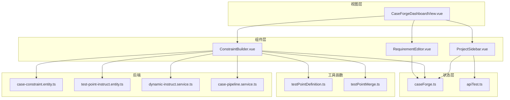
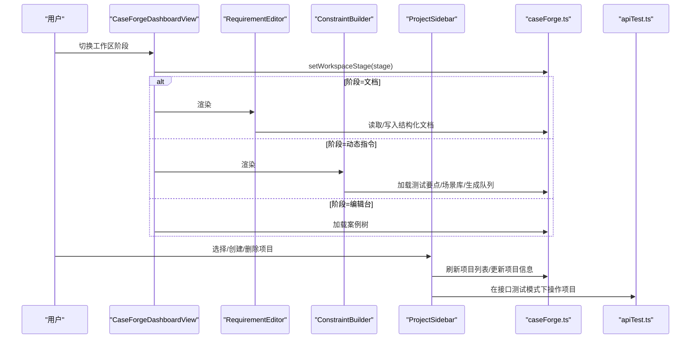
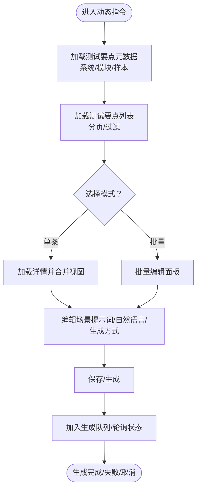
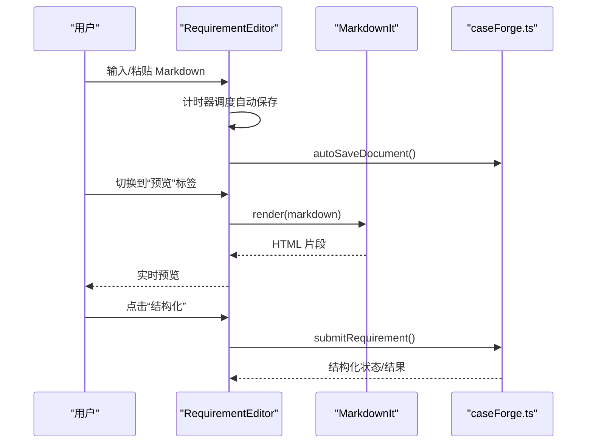
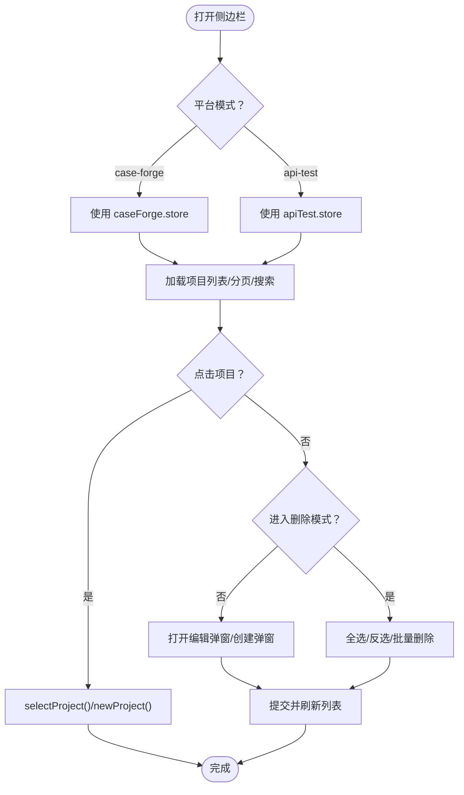
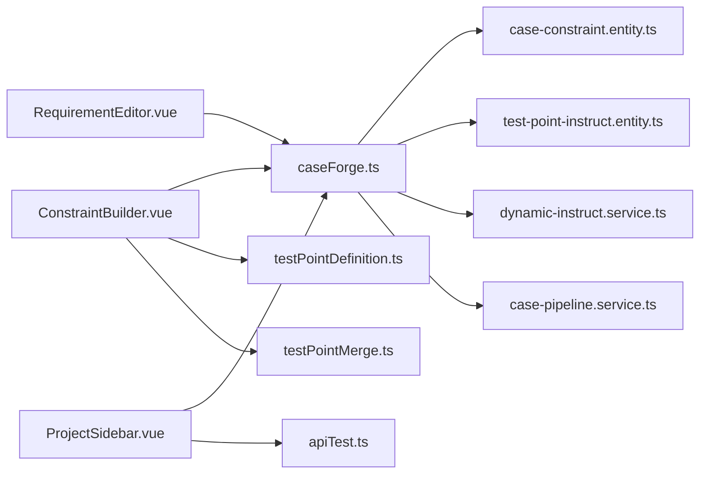

# 工具组件

<cite>
**本文引用的文件**
- [ConstraintBuilder.vue](file://apps/web/src/components/ConstraintBuilder.vue)
- [RequirementEditor.vue](file://apps/web/src/components/RequirementEditor.vue)
- [ProjectSidebar.vue](file://apps/web/src/components/ProjectSidebar.vue)
- [caseForge.ts](file://apps/web/src/stores/caseForge.ts)
- [apiTest.ts](file://apps/web/src/stores/apiTest.ts)
- [CaseForgeDashboardView.vue](file://apps/web/src/views/CaseForgeDashboardView.vue)
- [App.vue](file://apps/web/src/App.vue)
- [testPointDefinition.ts](file://apps/web/src/utils/testPointDefinition.ts)
- [testPointMerge.ts](file://apps/web/src/utils/testPointMerge.ts)
- [case-constraint.entity.ts](file://apps/api/src/modules/case-editor/entity/case-constraint.entity.ts)
- [test-point-instruct.entity.ts](file://apps/api/src/modules/dynamic-instruct/entity/test-point-instruct.entity.ts)
- [dynamic-instruct.service.ts](file://apps/api/src/modules/dynamic-instruct/service/dynamic-instruct.service.ts)
- [case-pipeline.service.ts](file://apps/api/src/modules/case-editor/service/case-pipeline.service.ts)
</cite>

## 目录
1. [简介](#简介)
2. [项目结构](#项目结构)
3. [核心组件](#核心组件)
4. [架构总览](#架构总览)
5. [详细组件分析](#详细组件分析)
6. [依赖关系分析](#依赖关系分析)
7. [性能考量](#性能考量)
8. [故障排查指南](#故障排查指南)
9. [结论](#结论)
10. [附录](#附录)

## 简介
本文件聚焦于三个关键工具组件：约束构建器（ConstraintBuilder）、需求编辑器（RequirementEditor）与项目侧边栏（ProjectSidebar）。文档从设计原则、可复用性与扩展性出发，系统阐述其规则定义与表达式生成机制、Markdown 编辑与实时预览、导航与状态管理，并给出配置选项、事件回调与插槽的最佳实践，以及实际应用场景与集成示例。

## 项目结构
- 组件层：apps/web/src/components 下包含三个核心工具组件与通用节点组件。
- 视图层：CaseForgeDashboardView 将组件组合到工作区，实现“文档—动态指令—编辑台”的阶段切换。
- 状态层：Pinia Store 提供全局状态与异步数据流，分别服务于案例生成平台与接口测试平台。
- 工具函数：测试要点定义与合并工具，支撑前端对测试要点的展示与编辑。
- 后端实体与服务：约束快照与动态指令实体，以及案例流水线与动态指令服务，支撑生成与渲染。

图表来源
- [CaseForgeDashboardView.vue:46-55](file://apps/web/src/views/CaseForgeDashboardView.vue#L46-L55)
- [ConstraintBuilder.vue:1-553](file://apps/web/src/components/ConstraintBuilder.vue#L1-L553)
- [RequirementEditor.vue:1-259](file://apps/web/src/components/RequirementEditor.vue#L1-L259)
- [ProjectSidebar.vue:1-652](file://apps/web/src/components/ProjectSidebar.vue#L1-L652)
- [caseForge.ts:146-718](file://apps/web/src/stores/caseForge.ts#L146-L718)
- [apiTest.ts:146-532](file://apps/web/src/stores/apiTest.ts#L146-L532)
- [testPointDefinition.ts:1-18](file://apps/web/src/utils/testPointDefinition.ts#L1-L18)
- [testPointMerge.ts:1-43](file://apps/web/src/utils/testPointMerge.ts#L1-L43)
- [case-constraint.entity.ts:1-47](file://apps/api/src/modules/case-editor/entity/case-constraint.entity.ts#L1-L47)
- [test-point-instruct.entity.ts:1-53](file://apps/api/src/modules/dynamic-instruct/entity/test-point-instruct.entity.ts#L1-L53)
- [dynamic-instruct.service.ts:29-67](file://apps/api/src/modules/dynamic-instruct/service/dynamic-instruct.service.ts#L29-L67)
- [case-pipeline.service.ts:318-367](file://apps/api/src/modules/case-editor/service/case-pipeline.service.ts#L318-L367)

章节来源
- [CaseForgeDashboardView.vue:1-142](file://apps/web/src/views/CaseForgeDashboardView.vue#L1-L142)
- [App.vue:1-39](file://apps/web/src/App.vue#L1-L39)

## 核心组件
- 约束构建器（ConstraintBuilder）：围绕测试要点维护场景提示词、自然语言约束，并支持批量生成案例；负责规则定义与表达式生成的前端呈现与交互。
- 需求编辑器（RequirementEditor）：提供 Markdown 编辑与实时预览，支持上传 Word 文档、自动保存与结构化触发。
- 项目侧边栏（ProjectSidebar）：统一管理项目列表、搜索、分页与批量删除，支持两种平台模式（案例生成与接口测试）。

章节来源
- [ConstraintBuilder.vue:1-553](file://apps/web/src/components/ConstraintBuilder.vue#L1-L553)
- [RequirementEditor.vue:1-259](file://apps/web/src/components/RequirementEditor.vue#L1-L259)
- [ProjectSidebar.vue:1-652](file://apps/web/src/components/ProjectSidebar.vue#L1-L652)

## 架构总览
组件通过 Pinia Store 进行状态管理与数据同步：
- 案例生成平台（caseForge.ts）：管理项目、结构化文档、测试要点、动态指令、生成队列与工作区阶段。
- 接口测试平台（apiTest.ts）：管理项目、交易码、用例、环境与运行状态。
- 三者共同驱动视图层（CaseForgeDashboardView）的阶段切换与组件渲染。

图表来源
- [CaseForgeDashboardView.vue:84-99](file://apps/web/src/views/CaseForgeDashboardView.vue#L84-L99)
- [caseForge.ts:669-718](file://apps/web/src/stores/caseForge.ts#L669-L718)
- [apiTest.ts:227-251](file://apps/web/src/stores/apiTest.ts#L227-L251)

## 详细组件分析

### 约束构建器（ConstraintBuilder）
- 设计原则
  - 分离“列表/过滤/分页”与“详情/编辑/生成”的职责，采用双面板布局提升可用性。
  - 支持批量模式与单条模式，批量模式下可一次性设置场景提示词、自然语言约束与生成方式。
  - 通过 Store 的“合并视图”（summary + detail）保证列表与详情的一致性与最小渲染成本。
- 规则定义与表达式生成机制
  - 场景提示词包：基于场景库（ScenarioLibrary）启用状态与提示词启用状态，形成可选集合。
  - 自然语言约束：文本域支持长度限制与自动计数，作为生成输入的一部分。
  - 生成方式：追加/全量覆盖两种模式，影响生成策略与输出结果。
  - 生成队列与进度：通过 Store 的生成队列状态与轮询机制反馈 ETA 与状态变化。
- 关键流程
  - 列表加载：按系统/模块过滤、分页与元数据加载，支持清空筛选与页码修正。
  - 详情加载：按需加载测试要点详情，合并 summary 与 detail，避免重复请求。
  - 批量操作：全选/反选、批量保存与批量生成，生成时支持取消。
  - 场景维护：弹窗内维护场景与提示词，支持自动保存与启用/停用切换。

图表来源
- [ConstraintBuilder.vue:646-782](file://apps/web/src/components/ConstraintBuilder.vue#L646-L782)
- [caseForge.ts:406-481](file://apps/web/src/stores/caseForge.ts#L406-L481)
- [testPointMerge.ts:23-40](file://apps/web/src/utils/testPointMerge.ts#L23-L40)

章节来源
- [ConstraintBuilder.vue:1-553](file://apps/web/src/components/ConstraintBuilder.vue#L1-L553)
- [caseForge.ts:183-218](file://apps/web/src/stores/caseForge.ts#L183-L218)
- [testPointDefinition.ts:1-18](file://apps/web/src/utils/testPointDefinition.ts#L1-L18)
- [testPointMerge.ts:1-43](file://apps/web/src/utils/testPointMerge.ts#L1-L43)

### 需求编辑器（RequirementEditor）
- 设计原则
  - 单一职责：专注 Markdown 编辑与预览，不承担结构化逻辑（结构化由 Store 调度）。
  - 实时预览：编辑态延迟渲染，降低频繁重排压力；预览态即时渲染。
  - 自动保存：失焦或定时触发，避免频繁网络请求。
- Markdown 编辑与实时预览
  - 使用 MarkdownIt 渲染，开启链接识别与硬换行，确保预览一致性。
  - 编辑器文本与 Store 的临时结构化文档双向绑定，避免丢失中间态。
- 上传与结构化
  - 限制文件类型与大小，支持重新上传确认与结构化任务取消。
  - 结构化进行中显示提示与取消按钮，避免误操作。

图表来源
- [RequirementEditor.vue:81-241](file://apps/web/src/components/RequirementEditor.vue#L81-L241)
- [caseForge.ts:794-841](file://apps/web/src/stores/caseForge.ts#L794-L841)

章节来源
- [RequirementEditor.vue:1-259](file://apps/web/src/components/RequirementEditor.vue#L1-L259)
- [caseForge.ts:794-841](file://apps/web/src/stores/caseForge.ts#L794-L841)

### 项目侧边栏（ProjectSidebar）
- 设计原则
  - 平台适配：根据平台参数（case-forge / api-test）切换数据源与表单字段。
  - 搜索与分页：关键词防抖搜索、分页与页大小选择，保持列表稳定。
  - 批量操作：支持全选/反选、批量删除与删除确认。
- 导航逻辑与状态管理
  - 选择项目：在不同平台下调用对应 Store 的选择/创建/删除方法。
  - 编辑/创建：表单校验（如需求编号格式），提交后刷新列表并更新活动项目。
  - 删除：单个/批量删除，删除后自动退出删除模式并修正页码。

图表来源
- [ProjectSidebar.vue:198-556](file://apps/web/src/components/ProjectSidebar.vue#L198-L556)
- [caseForge.ts:237-296](file://apps/web/src/stores/caseForge.ts#L237-L296)
- [apiTest.ts:252-306](file://apps/web/src/stores/apiTest.ts#L252-L306)

章节来源
- [ProjectSidebar.vue:1-652](file://apps/web/src/components/ProjectSidebar.vue#L1-L652)
- [caseForge.ts:237-296](file://apps/web/src/stores/caseForge.ts#L237-L296)
- [apiTest.ts:252-306](file://apps/web/src/stores/apiTest.ts#L252-L306)

## 依赖关系分析
- 组件耦合
  - ConstraintBuilder 依赖 Store 的测试要点与场景库状态，依赖工具函数进行定义完整性判断与合并视图。
  - RequirementEditor 依赖 Store 的结构化文档状态与自动保存能力。
  - ProjectSidebar 依赖两个 Store 的项目列表与 CRUD 操作。
- 外部依赖
  - MarkdownIt 用于实时预览渲染。
  - Ant Design Vue 组件库提供 UI 基础能力。
- 后端集成
  - 约束构建器最终将“场景提示词 + 自然语言约束 + 生成方式”转化为生成输入，后端通过动态指令服务与案例流水线服务执行生成与渲染。

图表来源
- [ConstraintBuilder.vue:555-577](file://apps/web/src/components/ConstraintBuilder.vue#L555-L577)
- [RequirementEditor.vue:81-90](file://apps/web/src/components/RequirementEditor.vue#L81-L90)
- [ProjectSidebar.vue:198-205](file://apps/web/src/components/ProjectSidebar.vue#L198-L205)
- [caseForge.ts:1-81](file://apps/web/src/stores/caseForge.ts#L1-L81)
- [apiTest.ts:1-82](file://apps/web/src/stores/apiTest.ts#L1-L82)
- [case-constraint.entity.ts:1-47](file://apps/api/src/modules/case-editor/entity/case-constraint.entity.ts#L1-L47)
- [test-point-instruct.entity.ts:1-53](file://apps/api/src/modules/dynamic-instruct/entity/test-point-instruct.entity.ts#L1-L53)
- [dynamic-instruct.service.ts:29-67](file://apps/api/src/modules/dynamic-instruct/service/dynamic-instruct.service.ts#L29-L67)
- [case-pipeline.service.ts:318-367](file://apps/api/src/modules/case-editor/service/case-pipeline.service.ts#L318-L367)

章节来源
- [ConstraintBuilder.vue:555-577](file://apps/web/src/components/ConstraintBuilder.vue#L555-L577)
- [RequirementEditor.vue:81-90](file://apps/web/src/components/RequirementEditor.vue#L81-L90)
- [ProjectSidebar.vue:198-205](file://apps/web/src/components/ProjectSidebar.vue#L198-L205)

## 性能考量
- 预览渲染节流：RequirementEditor 对预览渲染设置 280ms 延迟，减少频繁重绘。
- 自动保存去抖：编辑器对自动保存设置 1200ms 延迟，避免高频保存。
- 列表加载优化：ConstraintBuilder 对测试要点列表与详情加载采用按需与合并视图，避免重复请求。
- 搜索防抖：ProjectSidebar 对关键词变更设置 300ms 防抖，降低请求频率。
- 生成轮询：Store 中为生成状态轮询设置了多级延时数组，避免过早判定失败。

章节来源
- [RequirementEditor.vue:178-189](file://apps/web/src/components/RequirementEditor.vue#L178-L189)
- [RequirementEditor.vue:124-140](file://apps/web/src/components/RequirementEditor.vue#L124-L140)
- [ConstraintBuilder.vue:646-782](file://apps/web/src/components/ConstraintBuilder.vue#L646-L782)
- [ProjectSidebar.vue:315-325](file://apps/web/src/components/ProjectSidebar.vue#L315-L325)
- [caseForge.ts:75-81](file://apps/web/src/stores/caseForge.ts#L75-L81)

## 故障排查指南
- 结构化进行中无法保存/结构化
  - 现象：点击“结构化”提示任务进行中或无法保存。
  - 处理：等待结构化完成或使用取消按钮终止任务；确认项目状态与权限。
- 生成失败/长时间卡住
  - 现象：生成状态长时间为“生成中”，或出现“生成失败”。
  - 处理：查看生成队列状态与轮询日志；必要时取消生成并重试。
- 项目删除后列表异常
  - 现象：删除项目后列表为空或页码异常。
  - 处理：触发刷新列表；检查删除模式是否正确退出。
- 需求文档上传失败
  - 现象：上传后提示大小超限或格式不符。
  - 处理：确认文件类型与大小限制；重新上传并确认覆盖风险。

章节来源
- [RequirementEditor.vue:193-209](file://apps/web/src/components/RequirementEditor.vue#L193-L209)
- [caseForge.ts:794-841](file://apps/web/src/stores/caseForge.ts#L794-L841)
- [ProjectSidebar.vue:436-474](file://apps/web/src/components/ProjectSidebar.vue#L436-L474)

## 结论
ConstraintBuilder、RequirementEditor 与 ProjectSidebar 三者协同，构成了从“需求文档—动态指令—案例编辑”的完整工作流。ConstraintBuilder 通过场景提示词与自然语言约束驱动生成；RequirementEditor 提供稳定的 Markdown 编辑与预览体验；ProjectSidebar 则保障项目生命周期的顺畅管理。组件均遵循单一职责、状态集中、UI 与业务解耦的设计原则，具备良好的可复用性与扩展性。

## 附录

### 配置选项与事件回调（最佳实践）
- ConstraintBuilder
  - 配置项：批量模式开关、分页大小、系统/模块过滤器、生成方式（追加/全量）。
  - 事件：卡片点击、批量选择、保存/生成、取消生成、场景维护弹窗。
  - 最佳实践：在批量模式下谨慎使用“全量覆盖”，优先使用“追加”以保留历史生成；为生成过程提供明确的 ETA 与取消入口。
- RequirementEditor
  - 配置项：最大文档大小、MarkdownIt 渲染选项（链接识别、硬换行）。
  - 事件：编辑器文本变更、标签切换、结构化触发、上传文件。
  - 最佳实践：在切换预览标签时才触发渲染，避免不必要的计算；上传前进行格式与大小校验。
- ProjectSidebar
  - 配置项：平台模式（case-forge / api-test）、分页大小选项、删除模式。
  - 事件：项目选择、创建/编辑、删除、全选/反选。
  - 最佳实践：关键词搜索使用防抖；删除操作使用二次确认；创建/编辑表单进行必填与格式校验。

章节来源
- [ConstraintBuilder.vue:1-553](file://apps/web/src/components/ConstraintBuilder.vue#L1-L553)
- [RequirementEditor.vue:1-259](file://apps/web/src/components/RequirementEditor.vue#L1-L259)
- [ProjectSidebar.vue:1-652](file://apps/web/src/components/ProjectSidebar.vue#L1-L652)

### 插槽使用
- 当前组件未显式声明插槽（slot）。若需扩展，建议在父组件通过具名插槽注入自定义头部/底部区域，或通过属性传入自定义内容（如徽标、说明文字）。

### 实际应用场景与集成示例
- 需求文档到案例生成
  - 步骤：上传 Word → 结构化 → 编辑 Markdown → 进入动态指令 → 设置场景提示词与自然语言约束 → 生成案例 → 导出。
  - 集成点：RequirementEditor 与 ConstraintBuilder 的联动，通过 Store 的工作区阶段控制。
- 项目管理与多平台适配
  - 步骤：在侧边栏创建/选择项目 → 根据平台切换数据源 → 执行 CRUD 操作。
  - 集成点：ProjectSidebar 与两个 Store 的协作，确保跨平台一致的交互体验。

章节来源
- [CaseForgeDashboardView.vue:46-55](file://apps/web/src/views/CaseForgeDashboardView.vue#L46-L55)
- [App.vue:1-39](file://apps/web/src/App.vue#L1-L39)