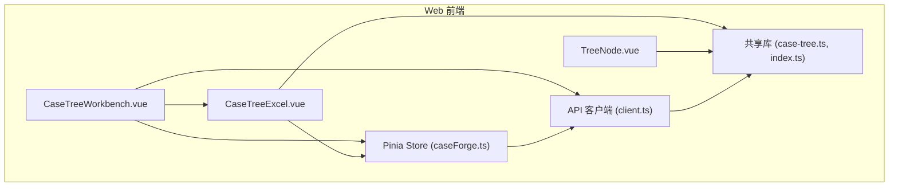
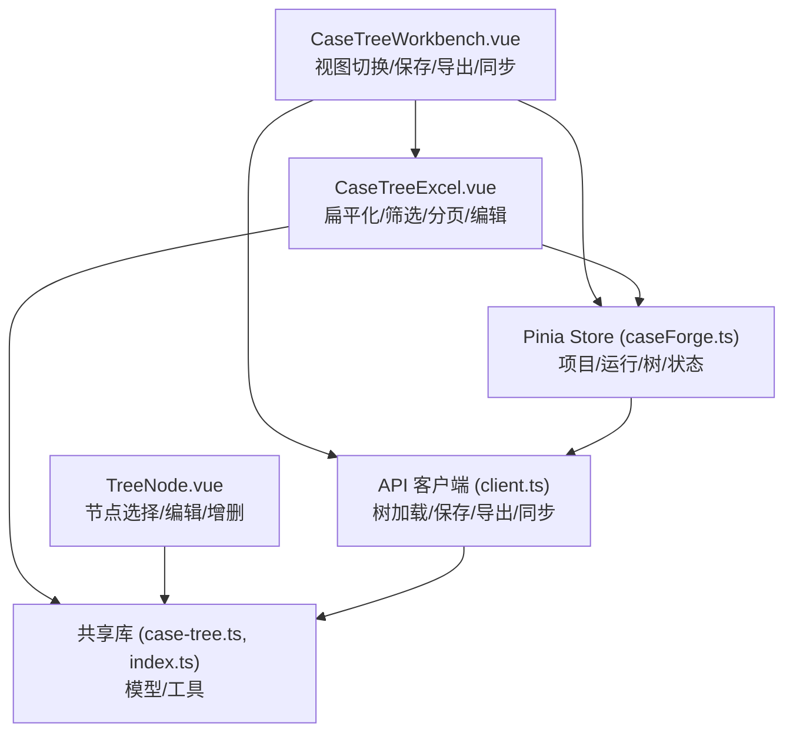
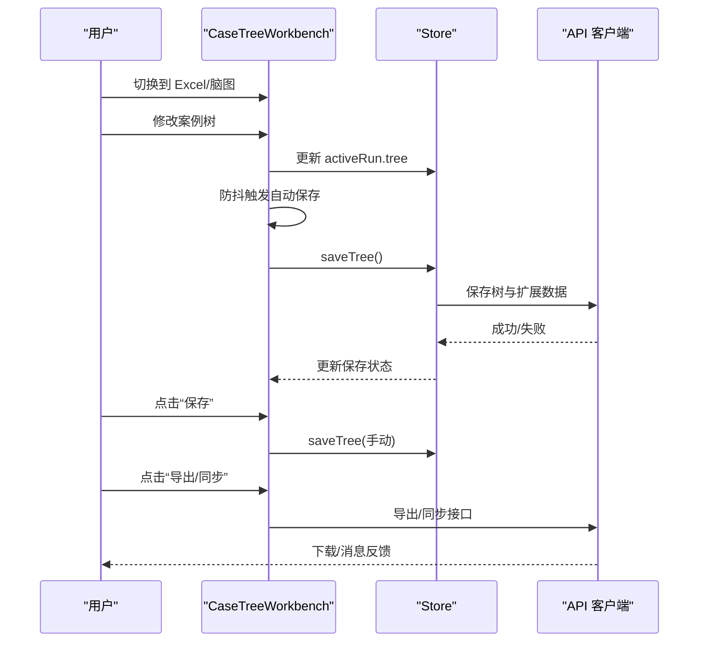
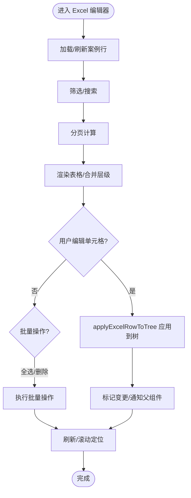
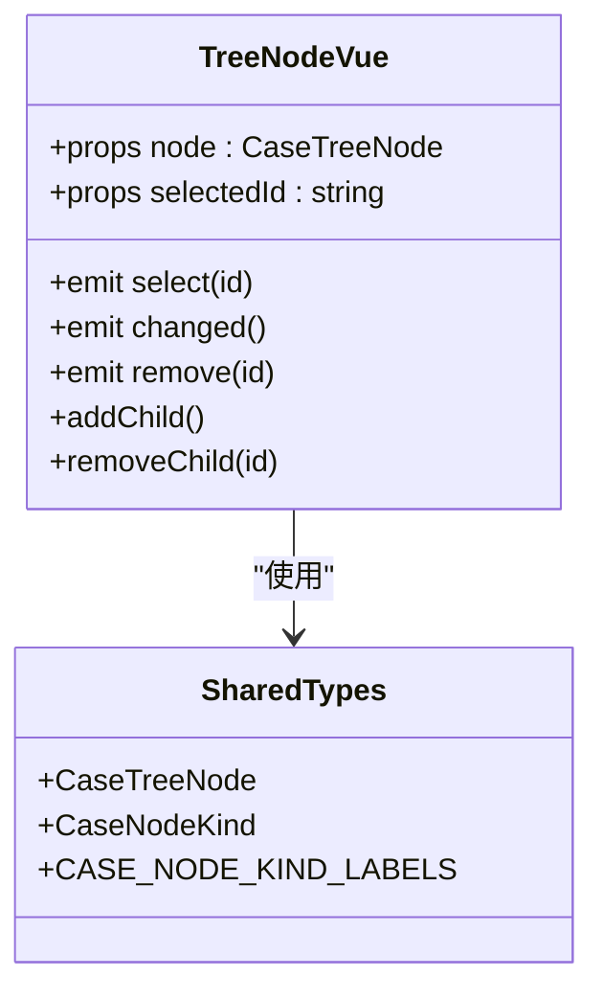
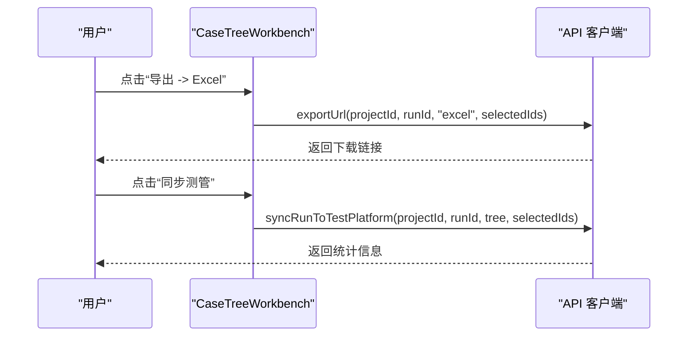
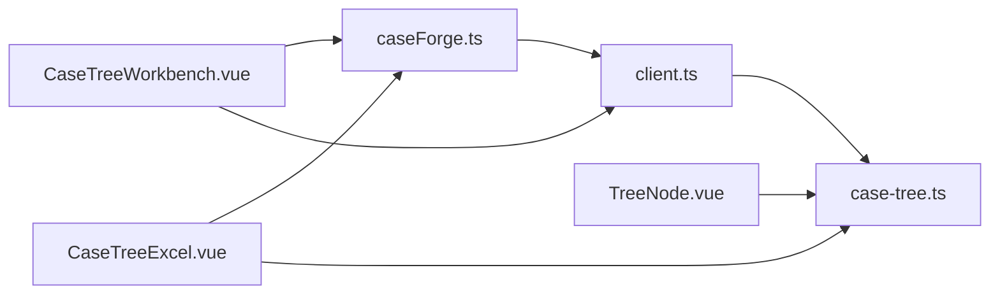

# 核心组件

<cite>
**本文引用的文件**
- [CaseTreeWorkbench.vue](file://apps/web/src/components/CaseTreeWorkbench.vue)
- [CaseTreeExcel.vue](file://apps/web/src/components/CaseTreeExcel.vue)
- [TreeNode.vue](file://apps/web/src/components/TreeNode.vue)
- [case-tree.ts](file://packages/shared/src/case-tree.ts)
- [index.ts](file://packages/shared/src/index.ts)
- [client.ts](file://apps/web/src/api/client.ts)
- [caseForge.ts](file://apps/web/src/stores/caseForge.ts)
</cite>

## 目录
1. [简介](#简介)
2. [项目结构](#项目结构)
3. [核心组件](#核心组件)
4. [架构总览](#架构总览)
5. [详细组件分析](#详细组件分析)
6. [依赖关系分析](#依赖关系分析)
7. [性能考量](#性能考量)
8. [故障排查指南](#故障排查指南)
9. [结论](#结论)
10. [附录](#附录)

## 简介
本文件聚焦于“案例树工作台”的核心组件与实现，涵盖以下主题：
- 案例树工作台（CaseTreeWorkbench）的控制流、视图切换与保存策略
- 案例树 Excel 编辑器（CaseTreeExcel）的渲染机制、分页与筛选、单元格编辑与变更传播
- 节点组件（TreeNode）的设计模式、节点类型识别与交互行为
- 案例树 Excel 的导入导出流程与模板下载
- 组件属性配置、事件处理与数据绑定最佳实践
- 实际使用示例与常见问题解决方案

## 项目结构
核心组件位于 Web 前端应用中，围绕“案例树工作台”组织：
- 案例树工作台容器负责视图切换、保存、同步与导出入口
- Excel 编辑器负责将案例树扁平化为表格，支持筛选、分页、合并显示与批量操作
- TreeNode 提供树形节点的增删改交互
- 共享库提供案例树模型、Excel 行模型与工具函数
- Pinia Store 提供项目、运行、树与工作区状态管理
- API 客户端封装后端接口，提供树加载、保存、导出、同步等功能

图表来源
- [CaseTreeWorkbench.vue:1-358](file://apps/web/src/components/CaseTreeWorkbench.vue#L1-L358)
- [CaseTreeExcel.vue:1-1580](file://apps/web/src/components/CaseTreeExcel.vue#L1-L1580)
- [TreeNode.vue:1-68](file://apps/web/src/components/TreeNode.vue#L1-L68)
- [case-tree.ts:1-934](file://packages/shared/src/case-tree.ts#L1-L934)
- [index.ts:1-161](file://packages/shared/src/index.ts#L1-L161)
- [client.ts:1-678](file://apps/web/src/api/client.ts#L1-L678)
- [caseForge.ts:1-1683](file://apps/web/src/stores/caseForge.ts#L1-L1683)

章节来源
- [CaseTreeWorkbench.vue:1-358](file://apps/web/src/components/CaseTreeWorkbench.vue#L1-L358)
- [CaseTreeExcel.vue:1-1580](file://apps/web/src/components/CaseTreeExcel.vue#L1-L1580)
- [TreeNode.vue:1-68](file://apps/web/src/components/TreeNode.vue#L1-L68)
- [case-tree.ts:1-934](file://packages/shared/src/case-tree.ts#L1-L934)
- [index.ts:1-161](file://packages/shared/src/index.ts#L1-L161)
- [client.ts:1-678](file://apps/web/src/api/client.ts#L1-L678)
- [caseForge.ts:1-1683](file://apps/web/src/stores/caseForge.ts#L1-L1683)

## 核心组件
- 案例树工作台（CaseTreeWorkbench）
  - 视图切换：Excel/脑图双视图
  - 保存：自动保存与手动保存
  - 同步：同步至测试平台
  - 导出：XMind/Excel 下载
  - 空态与错误态处理
- 案例树 Excel 编辑器（CaseTreeExcel）
  - 扁平化渲染：将树转为 Excel 行视图，自动合并层级列
  - 筛选与搜索：按测试要点、优先级、性质与关键词过滤
  - 分页：内置分页控件与页大小选择
  - 行内编辑：文本、多行文本、枚举三类输入
  - 批量操作：全选、删除选中行
  - 新增案例：基于路径上下文打开新增弹窗
- 节点组件（TreeNode）
  - 节点类型识别与标签展示
  - 选择、标题编辑、增删子节点
  - 递归渲染子节点
- 共享模型与工具
  - 案例树节点类型、元数据、性质与优先级
  - Excel 行模型、合并计算、筛选与分页
  - 树规范化、克隆、路径查找与新增案例

章节来源
- [CaseTreeWorkbench.vue:1-358](file://apps/web/src/components/CaseTreeWorkbench.vue#L1-L358)
- [CaseTreeExcel.vue:1-1580](file://apps/web/src/components/CaseTreeExcel.vue#L1-L1580)
- [TreeNode.vue:1-68](file://apps/web/src/components/TreeNode.vue#L1-L68)
- [case-tree.ts:1-934](file://packages/shared/src/case-tree.ts#L1-L934)
- [index.ts:1-161](file://packages/shared/src/index.ts#L1-L161)

## 架构总览
案例树工作台采用“容器-组件-共享库-存储-客户端”的分层架构：
- 容器组件（CaseTreeWorkbench）协调视图与状态，发起保存、同步与导出
- 展示组件（CaseTreeExcel、TreeNode）负责具体交互与渲染
- 共享库（case-tree.ts、index.ts）提供统一的数据模型与算法
- 存储（Pinia Store）集中管理项目、运行、树与工作区状态
- 客户端（client.ts）封装 HTTP 请求与后端接口

图表来源
- [CaseTreeWorkbench.vue:1-358](file://apps/web/src/components/CaseTreeWorkbench.vue#L1-L358)
- [CaseTreeExcel.vue:1-1580](file://apps/web/src/components/CaseTreeExcel.vue#L1-L1580)
- [TreeNode.vue:1-68](file://apps/web/src/components/TreeNode.vue#L1-L68)
- [caseForge.ts:1-1683](file://apps/web/src/stores/caseForge.ts#L1-L1683)
- [client.ts:1-678](file://apps/web/src/api/client.ts#L1-L678)
- [case-tree.ts:1-934](file://packages/shared/src/case-tree.ts#L1-L934)
- [index.ts:1-161](file://packages/shared/src/index.ts#L1-L161)

## 详细组件分析

### 案例树工作台（CaseTreeWorkbench）
- 视图切换
  - 通过受控的切换项在 Excel 与脑图之间切换
  - 根据激活运行（activeRun）决定是否显示编辑区域
- 保存策略
  - 自动保存：监听树变更，使用防抖在 500ms 内累计变更后保存
  - 手动保存：点击保存按钮触发保存
  - 保存状态通过 store.treeSaving 控制按钮加载态
- 同步与导出
  - 同步至测试平台：打开选择弹窗，确认后调用同步接口
  - 导出：支持 XMind 与 Excel；Excel 支持模板下载与节点范围导出
- 空态与错误态
  - 无运行：引导前往动态指令生成案例
  - 加载中：显示加载状态
  - 加载失败：提供重试按钮
- 数据来源
  - 通过 store.loadActiveRun 获取并缓存 activeRun
  - 通过 store.saveTree 保存树与脑图扩展数据

图表来源
- [CaseTreeWorkbench.vue:121-358](file://apps/web/src/components/CaseTreeWorkbench.vue#L121-L358)
- [caseForge.ts:1-1683](file://apps/web/src/stores/caseForge.ts#L1-L1683)
- [client.ts:1-678](file://apps/web/src/api/client.ts#L1-L678)

章节来源
- [CaseTreeWorkbench.vue:1-358](file://apps/web/src/components/CaseTreeWorkbench.vue#L1-L358)
- [caseForge.ts:1-1683](file://apps/web/src/stores/caseForge.ts#L1-L1683)
- [client.ts:1-678](file://apps/web/src/api/client.ts#L1-L678)

### 案例树 Excel 编辑器（CaseTreeExcel）
- 渲染机制
  - 将树扁平化为 Excel 行视图，自动合并层级列（根/系统/模块/测试要点）
  - 可折叠层级以减少列宽，仅在展开时显示可编辑列
- 筛选与搜索
  - 测试要点下拉筛选（支持长文本预览）
  - 优先级与案例性质枚举筛选
  - 关键词搜索在所有可编辑列上生效
- 分页与排序
  - 内置分页控件，支持页大小切换
  - 根据筛选结果动态计算总页数与当前页
- 行内编辑
  - 文本输入、多行文本（自动高度适配）、枚举选择
  - 失焦或输入时触发变更，通过 applyExcelRowToTree 应用到树并回传
- 批量操作
  - 全选/反选当前页
  - 删除选中行（二次确认）
- 新增案例
  - 基于当前选中行或筛选上下文定位新增位置
  - 打开新增弹窗，提交后刷新视图并滚动聚焦

图表来源
- [CaseTreeExcel.vue:1-1580](file://apps/web/src/components/CaseTreeExcel.vue#L1-L1580)
- [case-tree.ts:1-934](file://packages/shared/src/case-tree.ts#L1-L934)

章节来源
- [CaseTreeExcel.vue:1-1580](file://apps/web/src/components/CaseTreeExcel.vue#L1-L1580)
- [case-tree.ts:1-934](file://packages/shared/src/case-tree.ts#L1-L934)

### 节点组件（TreeNode）
- 设计模式
  - 递归组件：子节点通过自身再次渲染
  - 受控属性：node、selectedId
  - 事件驱动：select、changed、remove
- 节点类型识别
  - 通过 CASE_NODE_KIND_LABELS 显示节点标签
- 交互行为
  - 点击选择节点
  - 输入框双向绑定标题
  - 添加子节点：根据父节点类型切换子节点类型
  - 删除子节点：过滤掉目标子节点并触发 changed

图表来源
- [TreeNode.vue:1-68](file://apps/web/src/components/TreeNode.vue#L1-L68)
- [case-tree.ts:1-934](file://packages/shared/src/case-tree.ts#L1-L934)
- [index.ts:1-161](file://packages/shared/src/index.ts#L1-L161)

章节来源
- [TreeNode.vue:1-68](file://apps/web/src/components/TreeNode.vue#L1-L68)
- [case-tree.ts:1-934](file://packages/shared/src/case-tree.ts#L1-L934)
- [index.ts:1-161](file://packages/shared/src/index.ts#L1-L161)

### 案例树 Excel 导入导出
- 导出
  - Excel：打开选择弹窗，选择节点范围后生成下载链接
  - XMind：直接下载
- 导入
  - 通过“下载模板”获取 Excel 模板，填写后交由后端解析与合并
- 同步至测试平台
  - 选择节点范围后提交树与节点 ID，后端返回统计信息

图表来源
- [CaseTreeWorkbench.vue:290-358](file://apps/web/src/components/CaseTreeWorkbench.vue#L290-L358)
- [client.ts:1-678](file://apps/web/src/api/client.ts#L1-L678)

章节来源
- [CaseTreeWorkbench.vue:290-358](file://apps/web/src/components/CaseTreeWorkbench.vue#L290-L358)
- [client.ts:1-678](file://apps/web/src/api/client.ts#L1-L678)

## 依赖关系分析
- 组件耦合
  - CaseTreeWorkbench 依赖 Store 与 API 客户端，作为顶层协调者
  - CaseTreeExcel 依赖 Store 与共享库，负责数据转换与渲染
  - TreeNode 依赖共享库类型，保持与后端一致的节点模型
- 外部依赖
  - Axios 作为 HTTP 客户端
  - Ant Design Vue 提供图标与 UI 组件
  - Pinia 管理全局状态
- 循环依赖
  - 无直接循环依赖，组件间通过事件与属性单向传递

图表来源
- [CaseTreeWorkbench.vue:1-358](file://apps/web/src/components/CaseTreeWorkbench.vue#L1-L358)
- [CaseTreeExcel.vue:1-1580](file://apps/web/src/components/CaseTreeExcel.vue#L1-L1580)
- [TreeNode.vue:1-68](file://apps/web/src/components/TreeNode.vue#L1-L68)
- [caseForge.ts:1-1683](file://apps/web/src/stores/caseForge.ts#L1-L1683)
- [client.ts:1-678](file://apps/web/src/api/client.ts#L1-L678)
- [case-tree.ts:1-934](file://packages/shared/src/case-tree.ts#L1-L934)

章节来源
- [CaseTreeWorkbench.vue:1-358](file://apps/web/src/components/CaseTreeWorkbench.vue#L1-L358)
- [CaseTreeExcel.vue:1-1580](file://apps/web/src/components/CaseTreeExcel.vue#L1-L1580)
- [TreeNode.vue:1-68](file://apps/web/src/components/TreeNode.vue#L1-L68)
- [caseForge.ts:1-1683](file://apps/web/src/stores/caseForge.ts#L1-L1683)
- [client.ts:1-678](file://apps/web/src/api/client.ts#L1-L678)
- [case-tree.ts:1-934](file://packages/shared/src/case-tree.ts#L1-L934)

## 性能考量
- 渲染优化
  - Excel 编辑器使用虚拟滚动与固定列，减少 DOM 数量
  - 合并层级列避免重复渲染
- 网络优化
  - 分页与筛选减少一次性传输数据量
  - 防抖保存降低频繁写入
- 计算优化
  - 扁平化与合并计算在内存中完成，避免重复遍历
  - 本地草稿行指纹对比，仅在变更时触发保存

## 故障排查指南
- 案例树加载失败
  - 现象：显示“案例树加载失败”，提供“重新加载”
  - 处理：点击重试；若仍失败，检查后端服务与网络
- 自动保存未生效
  - 现象：修改后未保存
  - 处理：确认 store.treeSaving 状态；手动点击保存
- Excel 导出为空
  - 现象：导出后无数据
  - 处理：检查筛选条件与节点选择范围；确认后端返回
- 同步测管失败
  - 现象：同步后提示失败
  - 处理：检查网络与账号权限；查看返回的统计信息定位问题

章节来源
- [CaseTreeWorkbench.vue:64-106](file://apps/web/src/components/CaseTreeWorkbench.vue#L64-L106)
- [CaseTreeExcel.vue:471-523](file://apps/web/src/components/CaseTreeExcel.vue#L471-L523)

## 结论
案例树工作台通过清晰的分层设计与事件驱动的组件协作，实现了从树到 Excel 的高效编辑与导出能力。共享库确保前后端模型一致性，Store 与客户端提供稳定的状态与数据通道。建议在复杂场景下进一步引入增量保存与差异检测，以提升大体量案例树的编辑体验。

## 附录

### 组件属性配置与事件处理最佳实践
- 属性配置
  - CaseTreeWorkbench
    - activeView：受控切换 Excel/脑图
    - tree/listRefreshKey：驱动 Excel 列表刷新
  - CaseTreeExcel
    - tree：案例树
    - listRefreshKey：强制刷新列表
    - change：树变更回调
  - TreeNode
    - node：节点数据
    - selectedId：选中节点 ID
- 事件处理
  - 使用 emit 传递变更，避免直接修改父组件数据
  - 对高频事件（如输入）使用防抖或节流
- 数据绑定
  - 使用 v-model 与 v-model.lazy 组合，平衡实时性与性能
  - 对枚举与多行文本使用合适的输入控件

### 实际使用示例
- 在工作台中切换到 Excel 视图，编辑某一行的“测试步骤”，失焦后自动保存
- 在 Excel 中按“测试要点”筛选，勾选若干案例后批量删除
- 在脑图视图中选择节点并同步至测试平台，确认统计结果