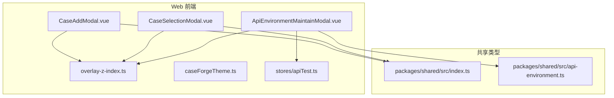
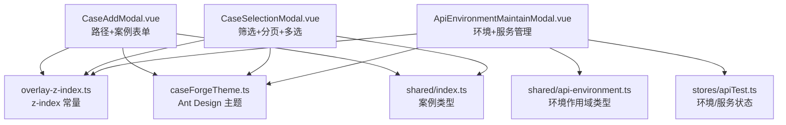
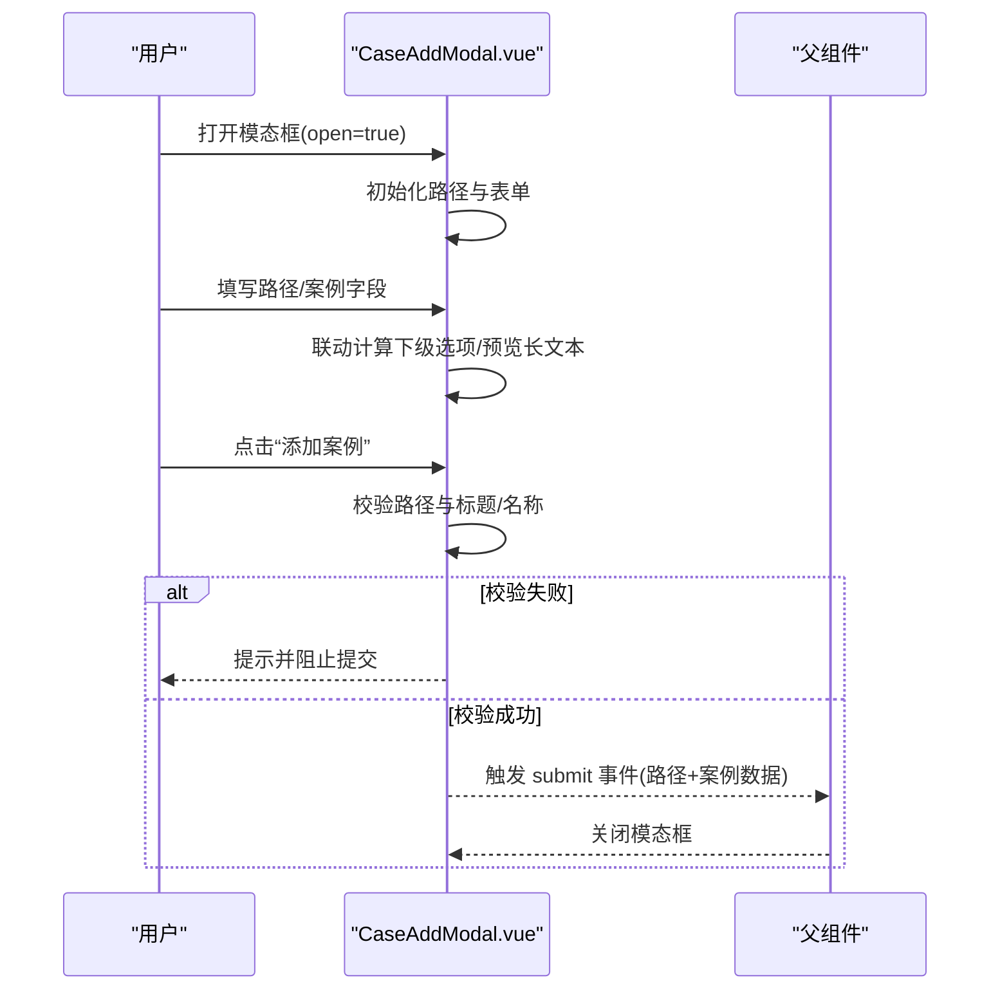
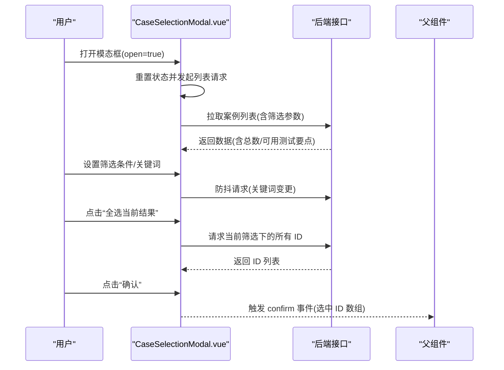
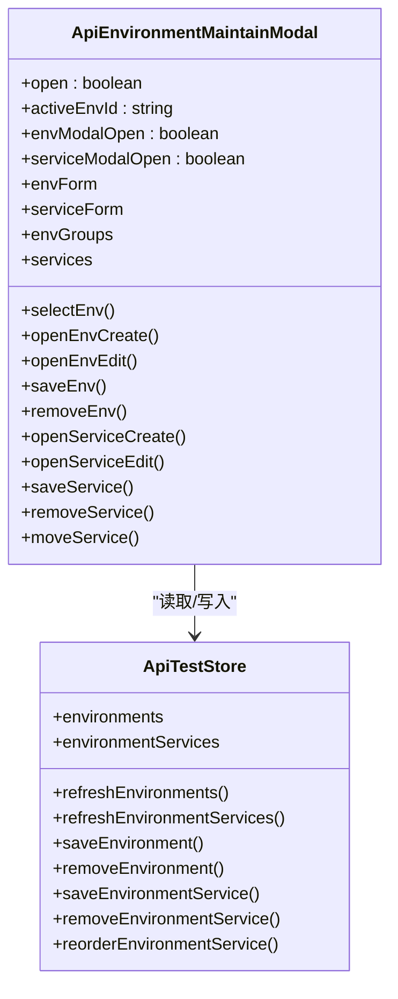
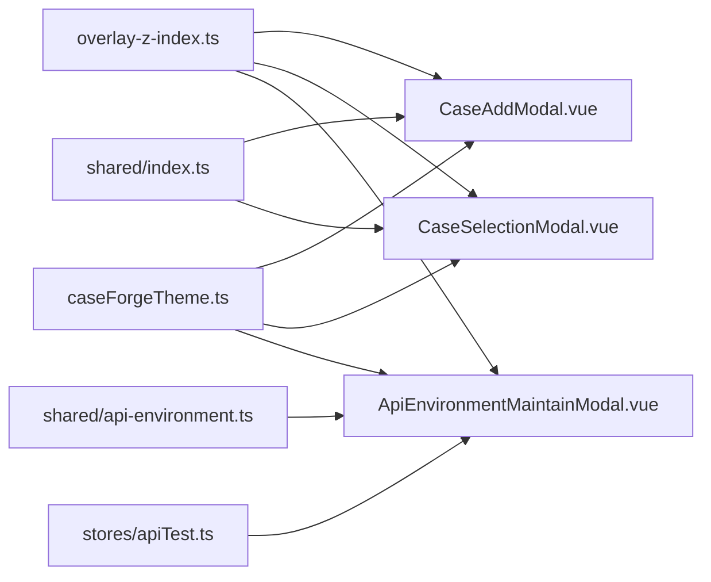

# 模态框组件

<cite>
**本文引用的文件**
- [CaseAddModal.vue](file://apps/web/src/components/CaseAddModal.vue)
- [CaseSelectionModal.vue](file://apps/web/src/components/CaseSelectionModal.vue)
- [ApiEnvironmentMaintainModal.vue](file://apps/web/src/components/api-test/ApiEnvironmentMaintainModal.vue)
- [overlay-z-index.ts](file://apps/web/src/constants/overlay-z-index.ts)
- [caseForgeTheme.ts](file://apps/web/src/theme/caseForgeTheme.ts)
- [apiTest.ts](file://apps/web/src/stores/apiTest.ts)
- [index.ts](file://packages/shared/src/index.ts)
- [api-environment.ts](file://packages/shared/src/api-environment.ts)
</cite>

## 目录
1. [简介](#简介)
2. [项目结构](#项目结构)
3. [核心组件](#核心组件)
4. [架构总览](#架构总览)
5. [详细组件分析](#详细组件分析)
6. [依赖关系分析](#依赖关系分析)
7. [性能考量](#性能考量)
8. [故障排查指南](#故障排查指南)
9. [结论](#结论)
10. [附录](#附录)

## 简介
本文件为模态框组件的综合技术文档，聚焦以下三个关键模态框：
- 案例添加模态框（CaseAddModal）：负责从路径层级到案例内容的表单收集、联动校验与提交。
- 案例选择模态框（CaseSelectionModal）：支持筛选、分页、多选、全选与清空，并输出所选案例节点 ID 列表。
- API 环境维护模态框（ApiEnvironmentMaintainModal）：提供环境与服务的增删改查、排序与默认标记等管理能力。

文档将从实现机制、数据流、生命周期、交互与样式定制等方面进行深入解析，并给出可操作的优化建议与无障碍实践指导。

## 项目结构
模态框组件位于 Web 应用前端目录，分别承担不同业务域的弹窗交互职责：
- 案例相关：CaseAddModal.vue、CaseSelectionModal.vue
- API 测试环境：ApiEnvironmentMaintainModal.vue
- 公共常量与主题：overlay-z-index.ts、caseForgeTheme.ts
- 状态管理：stores/apiTest.ts（API 测试相关状态）
- 类型定义：packages/shared/src/index.ts、packages/shared/src/api-environment.ts

图表来源
- [CaseAddModal.vue:1-466](file://apps/web/src/components/CaseAddModal.vue#L1-L466)
- [CaseSelectionModal.vue:1-768](file://apps/web/src/components/CaseSelectionModal.vue#L1-L768)
- [ApiEnvironmentMaintainModal.vue:1-737](file://apps/web/src/components/api-test/ApiEnvironmentMaintainModal.vue#L1-L737)
- [overlay-z-index.ts:1-3](file://apps/web/src/constants/overlay-z-index.ts#L1-L3)
- [caseForgeTheme.ts:1-39](file://apps/web/src/theme/caseForgeTheme.ts#L1-L39)
- [apiTest.ts:1-200](file://apps/web/src/stores/apiTest.ts#L1-L200)
- [index.ts:1-161](file://packages/shared/src/index.ts#L1-L161)
- [api-environment.ts:1-21](file://packages/shared/src/api-environment.ts#L1-L21)

章节来源
- [CaseAddModal.vue:1-466](file://apps/web/src/components/CaseAddModal.vue#L1-L466)
- [CaseSelectionModal.vue:1-768](file://apps/web/src/components/CaseSelectionModal.vue#L1-L768)
- [ApiEnvironmentMaintainModal.vue:1-737](file://apps/web/src/components/api-test/ApiEnvironmentMaintainModal.vue#L1-L737)
- [overlay-z-index.ts:1-3](file://apps/web/src/constants/overlay-z-index.ts#L1-L3)
- [caseForgeTheme.ts:1-39](file://apps/web/src/theme/caseForgeTheme.ts#L1-L39)
- [apiTest.ts:1-200](file://apps/web/src/stores/apiTest.ts#L1-L200)
- [index.ts:1-161](file://packages/shared/src/index.ts#L1-L161)
- [api-environment.ts:1-21](file://packages/shared/src/api-environment.ts#L1-L21)

## 核心组件
- 案例添加模态框（CaseAddModal）
  - 职责：收集路径层级（根/系统/模块/测试要点）与案例内容（名称、标题、性质、优先级、前置条件、步骤、期望），提供联动选项与基础校验。
  - 关键点：路径字段联动、自动补全过滤、长度限制、提交时的必填校验与数据整形。
- 案例选择模态框（CaseSelectionModal）
  - 职责：基于运行实例列出案例，支持按测试要点、关键词、优先级、性质筛选，分页与多选，提供“全选当前结果”“清空已选”等批量操作。
  - 关键点：防抖加载、并发请求序列号控制、表格行点击切换选择、统计信息与空态文案。
- API 环境维护模态框（ApiEnvironmentMaintainModal）
  - 职责：环境与服务的增删改查、排序、默认标记、分组展示与空状态提示。
  - 关键点：环境分组（全局/系统/个人）、服务列宽与固定列、确认删除流程、与 Pinia 状态的双向绑定。

章节来源
- [CaseAddModal.vue:148-381](file://apps/web/src/components/CaseAddModal.vue#L148-L381)
- [CaseSelectionModal.vue:172-490](file://apps/web/src/components/CaseSelectionModal.vue#L172-L490)
- [ApiEnvironmentMaintainModal.vue:261-464](file://apps/web/src/components/api-test/ApiEnvironmentMaintainModal.vue#L261-L464)

## 架构总览
三个模态框均基于 Ant Design Vue 的 Modal 组件封装，结合项目主题与公共常量，形成统一的视觉与交互风格。其中 API 环境维护模态框通过 Pinia Store 管理环境与服务数据，实现跨组件状态共享。

图表来源
- [CaseAddModal.vue:146-147](file://apps/web/src/components/CaseAddModal.vue#L146-L147)
- [CaseSelectionModal.vue:158-158](file://apps/web/src/components/CaseSelectionModal.vue#L158-L158)
- [ApiEnvironmentMaintainModal.vue:259-259](file://apps/web/src/components/api-test/ApiEnvironmentMaintainModal.vue#L259-L259)
- [overlay-z-index.ts:1-3](file://apps/web/src/constants/overlay-z-index.ts#L1-L3)
- [caseForgeTheme.ts:4-38](file://apps/web/src/theme/caseForgeTheme.ts#L4-L38)
- [apiTest.ts:146-183](file://apps/web/src/stores/apiTest.ts#L146-L183)
- [index.ts:33-39](file://packages/shared/src/index.ts#L33-L39)
- [api-environment.ts:1-21](file://packages/shared/src/api-environment.ts#L1-L21)

## 详细组件分析

### 案例添加模态框（CaseAddModal）
- 数据模型与联动
  - 路径表单（pathForm）包含根、系统、模块、测试要点字段，采用自动补全与过滤，值变更触发后续层级重算。
  - 案例表单（caseForm）包含名称、标题、性质、优先级、前置条件、步骤、期望等字段。
  - 计算属性根据已选路径动态生成下一级选项集，确保用户只能选择有效组合。
- 表单验证与提交
  - 打开时重置案例表单并应用初始路径。
  - 提交前对路径与案例标题/名称进行必填校验，必要时给出消息提示并拒绝提交。
  - 将清洗后的路径与案例数据以事件形式向外抛出，供父组件处理。
- 生命周期与事件
  - 监听 open 状态变化，在打开时初始化路径与表单。
  - 对话框关闭与取消事件均向上传递，便于父组件统一管理。
- 样式与布局
  - 使用网格布局组织表单项，路径区域与案例区域分卡展示，预览长文本时提供简要展示。
  - 自定义 Modal 内容区、头部与底部内边距，保证在沉浸式工作区之上具有合适的层级。

图表来源
- [CaseAddModal.vue:326-380](file://apps/web/src/components/CaseAddModal.vue#L326-L380)
- [CaseAddModal.vue:334-369](file://apps/web/src/components/CaseAddModal.vue#L334-L369)

章节来源
- [CaseAddModal.vue:159-381](file://apps/web/src/components/CaseAddModal.vue#L159-L381)

### 案例选择模态框（CaseSelectionModal）
- 数据加载与筛选
  - 打开时重置选择状态与筛选器，拉取运行实例下的案例列表。
  - 支持测试要点、关键词、优先级、性质四类筛选，关键词变更采用防抖策略降低请求频率。
  - 并发请求通过序列号控制，避免响应错乱。
- 多选与批量操作
  - 基于表格行选择模型实现多选，支持点击行切换、全选当前结果与清空已选。
  - 统计显示“已选数量/当前结果数/总数”，并在空态时提供明确提示。
- 分页与列配置
  - 当满足分页阈值时显示分页控件，支持页码与每页大小变更。
  - 根据是否已设置测试要点动态隐藏重复列，提升可读性。
- 交互细节
  - 行点击非选择列区域时切换选择，避免误触。
  - 空态渲染自定义描述，引导用户进行下一步操作。

图表来源
- [CaseSelectionModal.vue:227-286](file://apps/web/src/components/CaseSelectionModal.vue#L227-L286)
- [CaseSelectionModal.vue:457-474](file://apps/web/src/components/CaseSelectionModal.vue#L457-L474)
- [CaseSelectionModal.vue:480-489](file://apps/web/src/components/CaseSelectionModal.vue#L480-L489)

章节来源
- [CaseSelectionModal.vue:172-490](file://apps/web/src/components/CaseSelectionModal.vue#L172-L490)

### API 环境维护模态框（ApiEnvironmentMaintainModal）
- 环境与服务管理
  - 左侧按作用域分组展示环境卡片，支持新增/编辑/删除环境。
  - 右侧展示所选环境的服务配置，支持新增/编辑/删除服务、上下移动与置顶排序。
  - 默认环境以标签标识，便于快速识别。
- 状态与数据流
  - 通过 Pinia Store 获取与刷新环境与服务数据，选择环境后自动加载对应服务列表。
  - 保存与删除操作均调用 Store 方法，完成后刷新视图。
- 交互与可访问性
  - 使用按钮与链接语义化元素，配合图标与文字说明，增强可理解性。
  - 表格列宽固定，支持横向滚动，避免内容截断影响阅读。

图表来源
- [ApiEnvironmentMaintainModal.vue:261-464](file://apps/web/src/components/api-test/ApiEnvironmentMaintainModal.vue#L261-L464)
- [apiTest.ts:146-183](file://apps/web/src/stores/apiTest.ts#L146-L183)

章节来源
- [ApiEnvironmentMaintainModal.vue:1-737](file://apps/web/src/components/api-test/ApiEnvironmentMaintainModal.vue#L1-L737)
- [apiTest.ts:1-200](file://apps/web/src/stores/apiTest.ts#L1-L200)

## 依赖关系分析
- 公共层级与主题
  - 所有模态框使用统一的 z-index 常量，确保在沉浸式工作区之上正确显示。
  - Ant Design 主题配置集中管理，保证颜色、字号、圆角等视觉一致性。
- 类型与约束
  - 案例性质与优先级来自共享类型定义，确保前后端一致。
  - 环境作用域类型来自共享包，避免硬编码带来的不一致。
- 状态与数据
  - API 环境维护模态框直接依赖 Pinia Store，实现环境与服务的持久化与刷新。

图表来源
- [overlay-z-index.ts:1-3](file://apps/web/src/constants/overlay-z-index.ts#L1-L3)
- [caseForgeTheme.ts:4-38](file://apps/web/src/theme/caseForgeTheme.ts#L4-L38)
- [index.ts:33-39](file://packages/shared/src/index.ts#L33-L39)
- [api-environment.ts:1-21](file://packages/shared/src/api-environment.ts#L1-L21)
- [apiTest.ts:146-183](file://apps/web/src/stores/apiTest.ts#L146-L183)

章节来源
- [overlay-z-index.ts:1-3](file://apps/web/src/constants/overlay-z-index.ts#L1-L3)
- [caseForgeTheme.ts:1-39](file://apps/web/src/theme/caseForgeTheme.ts#L1-L39)
- [index.ts:1-161](file://packages/shared/src/index.ts#L1-L161)
- [api-environment.ts:1-21](file://packages/shared/src/api-environment.ts#L1-L21)
- [apiTest.ts:1-200](file://apps/web/src/stores/apiTest.ts#L1-L200)

## 性能考量
- 案例选择模态框
  - 防抖策略减少高频关键词查询造成的请求压力。
  - 并发请求序列号控制，避免旧请求覆盖新结果。
  - 分页阈值判断，仅在必要时启用分页控件，降低 DOM 渲染成本。
- 案例添加模态框
  - 下拉选项基于当前已选路径计算，减少无效选项渲染。
  - 文本预览在超长时直接隐藏，避免大段文本造成布局抖动。
- API 环境维护模态框
  - 服务列表按需加载，避免一次性渲染大量行。
  - 固定列宽与横向滚动，减少表格重排与布局计算。

## 故障排查指南
- 案例添加模态框
  - 若出现“请选择根/请填写系统/请填写功能模块/请填写测试要点/请填写案例或案例标题”的提示，请检查路径字段是否为空或未匹配有效选项。
  - 若提交后未关闭，请确认父组件是否正确监听并处理了提交事件。
- 案例选择模态框
  - 若筛选无结果但总数不为零，请检查关键词拼写与筛选条件是否过于严格。
  - 若“全选当前结果”无效，请确认当前筛选条件下存在可选案例且网络请求成功。
  - 若分页异常，请检查每页大小与当前页是否被重置为第一页。
- API 环境维护模态框
  - 若环境列表为空，请确认项目 ID 是否有效以及是否已刷新环境数据。
  - 若服务列表未更新，请尝试重新选择环境或手动刷新。
  - 删除操作前会弹出确认对话框，若未触发，请检查确认回调是否正确绑定。

章节来源
- [CaseAddModal.vue:334-369](file://apps/web/src/components/CaseAddModal.vue#L334-L369)
- [CaseSelectionModal.vue:457-474](file://apps/web/src/components/CaseSelectionModal.vue#L457-L474)
- [ApiEnvironmentMaintainModal.vue:389-403](file://apps/web/src/components/api-test/ApiEnvironmentMaintainModal.vue#L389-L403)

## 结论
上述三个模态框在统一的主题与层级规范下，分别覆盖了“新增案例”“选择案例”“环境维护”的核心场景。它们通过清晰的数据流、稳健的校验与交互细节，提供了良好的用户体验。建议在后续迭代中持续关注请求节流、状态一致性与可访问性改进，以进一步提升稳定性与可用性。

## 附录
- 样式定制与响应式
  - 使用 scoped 与全局样式的组合，确保模态框内部结构与外部主题解耦。
  - 通过 Ant Design 的主题变量与项目主题配置，统一主色、边框、圆角与字体尺寸。
- 无障碍访问
  - 为关键交互元素提供语义化标签与提示文案，确保键盘可达与屏幕阅读器友好。
  - 在空态与加载态提供明确的描述与替代方案，避免用户困惑。