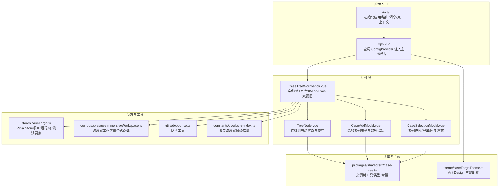
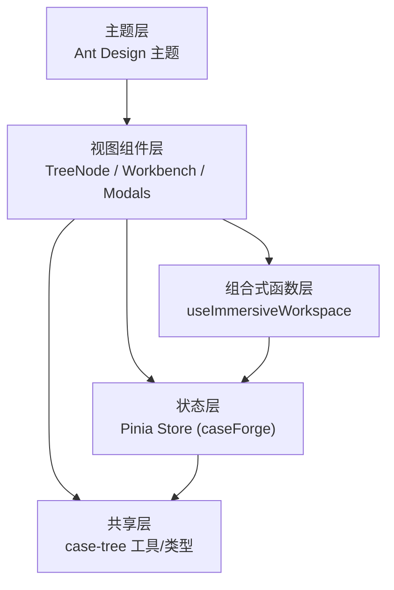
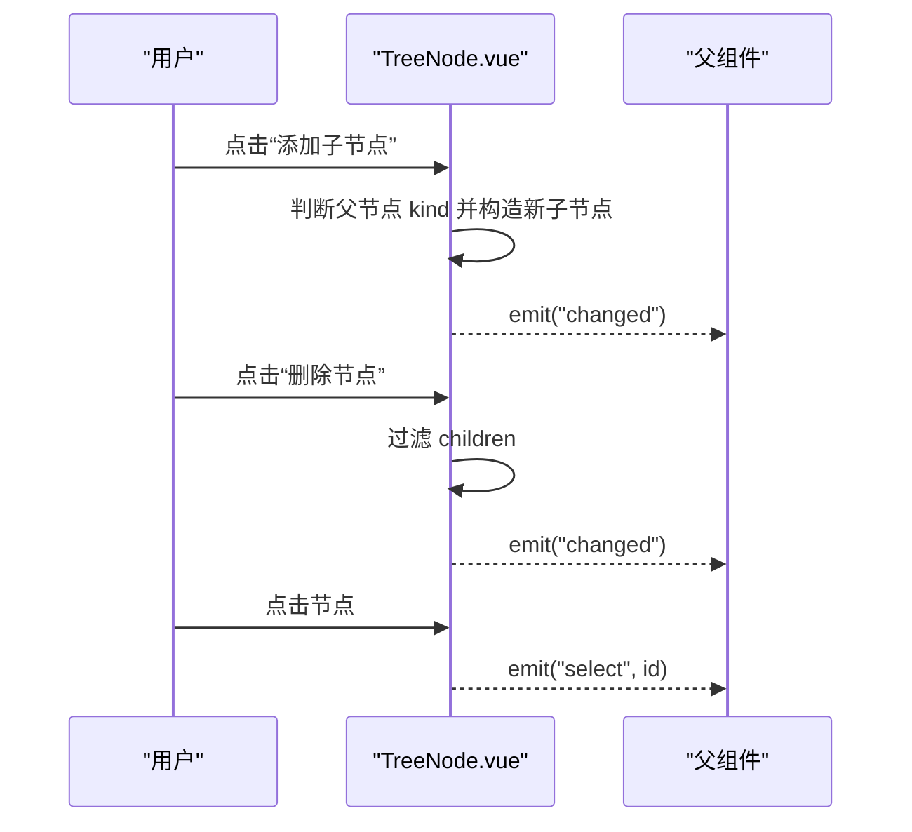
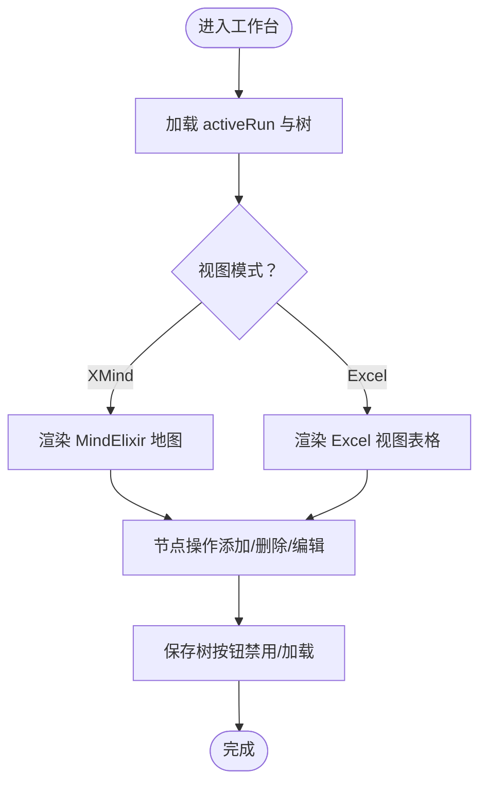
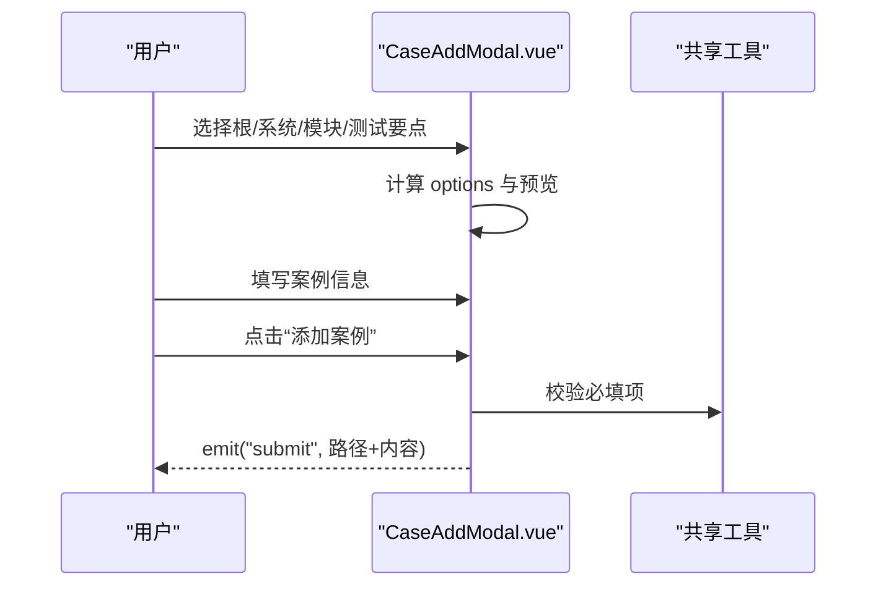
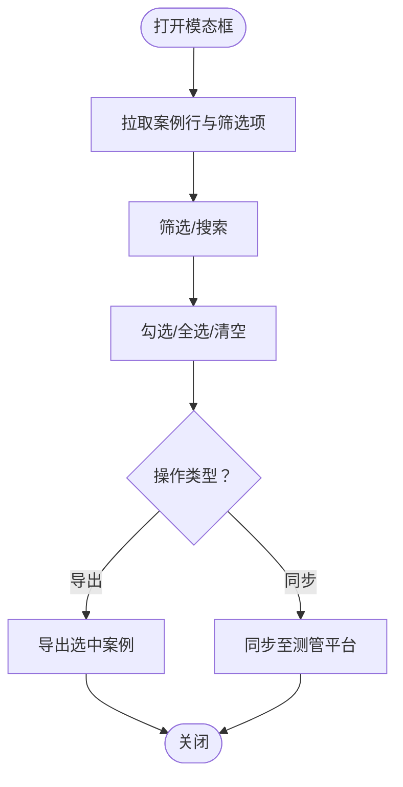
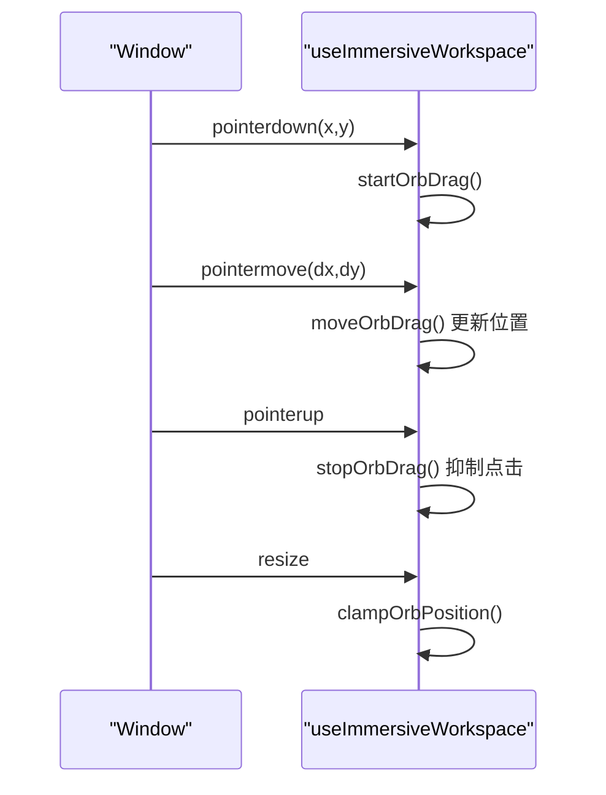
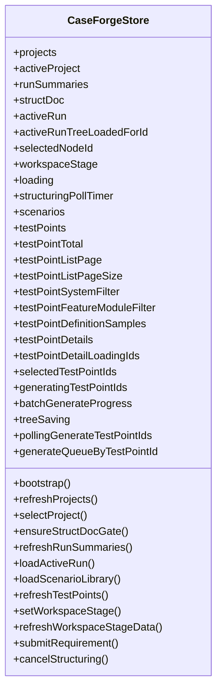
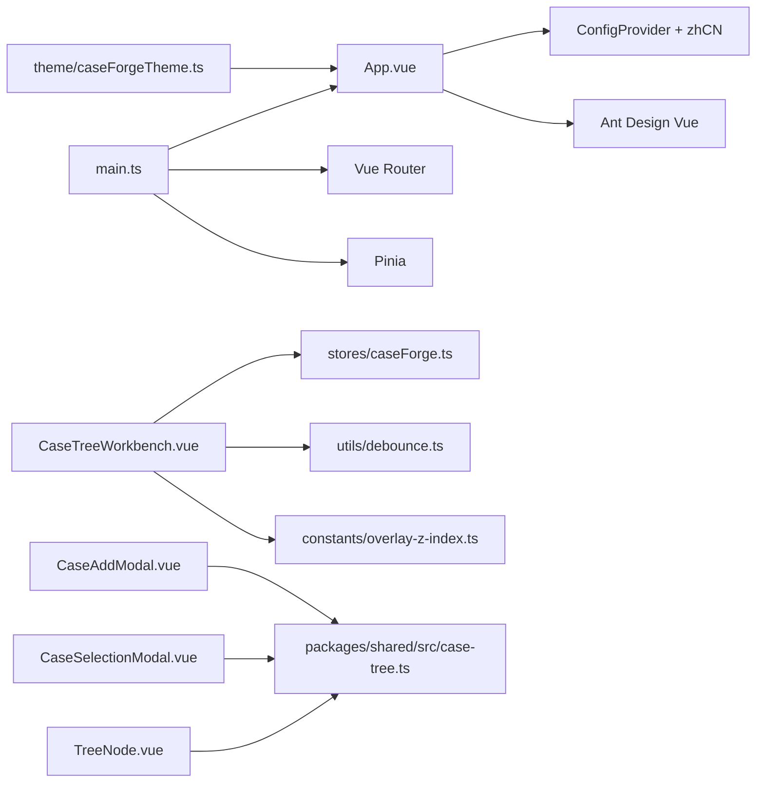

# 组件系统

<cite>
**本文引用的文件**
- [apps/web/src/components/TreeNode.vue](file://apps/web/src/components/TreeNode.vue)
- [apps/web/src/components/CaseTreeWorkbench.vue](file://apps/web/src/components/CaseTreeWorkbench.vue)
- [apps/web/src/components/CaseAddModal.vue](file://apps/web/src/components/CaseAddModal.vue)
- [apps/web/src/components/CaseSelectionModal.vue](file://apps/web/src/components/CaseSelectionModal.vue)
- [apps/web/src/composables/useImmersiveWorkspace.ts](file://apps/web/src/composables/useImmersiveWorkspace.ts)
- [apps/web/src/stores/caseForge.ts](file://apps/web/src/stores/caseForge.ts)
- [packages/shared/src/case-tree.ts](file://packages/shared/src/case-tree.ts)
- [apps/web/src/theme/caseForgeTheme.ts](file://apps/web/src/theme/caseForgeTheme.ts)
- [apps/web/src/App.vue](file://apps/web/src/App.vue)
- [apps/web/src/main.ts](file://apps/web/src/main.ts)
- [apps/web/src/utils/debounce.ts](file://apps/web/src/utils/debounce.ts)
- [apps/web/src/constants/overlay-z-index.ts](file://apps/web/src/constants/overlay-z-index.ts)
- [apps/web/package.json](file://apps/web/package.json)
- [packages/shared/package.json](file://packages/shared/package.json)
</cite>

## 目录
1. [简介](#简介)
2. [项目结构](#项目结构)
3. [核心组件](#核心组件)
4. [架构总览](#架构总览)
5. [详细组件分析](#详细组件分析)
6. [依赖关系分析](#依赖关系分析)
7. [性能考量](#性能考量)
8. [故障排查指南](#故障排查指南)
9. [结论](#结论)
10. [附录](#附录)

## 简介
本文件面向 Vue 3 组件系统的综合文档，聚焦于可复用组件的设计与实现规范，涵盖案例树组件、节点组件与模态框组件的实现细节，阐述组合式函数（composables）的状态封装策略，以及组件间通信、事件处理与属性传递机制。同时提供测试策略、性能优化与可访问性指南，并说明组件库集成与主题定制方法。

## 项目结构
前端应用位于 apps/web，采用单页应用（SPA）结构，基于 Vue 3 + Pinia + Ant Design Vue。共享逻辑与类型定义位于 packages/shared。主题配置集中于 theme/caseForgeTheme.ts 并在入口处注入全局。

图表来源
- [apps/web/src/main.ts:1-20](file://apps/web/src/main.ts#L1-L20)
- [apps/web/src/App.vue:1-13](file://apps/web/src/App.vue#L1-L13)
- [apps/web/src/components/TreeNode.vue:1-68](file://apps/web/src/components/TreeNode.vue#L1-L68)
- [apps/web/src/components/CaseTreeWorkbench.vue:1-200](file://apps/web/src/components/CaseTreeWorkbench.vue#L1-L200)
- [apps/web/src/components/CaseAddModal.vue:1-150](file://apps/web/src/components/CaseAddModal.vue#L1-L150)
- [apps/web/src/components/CaseSelectionModal.vue:1-150](file://apps/web/src/components/CaseSelectionModal.vue#L1-L150)
- [apps/web/src/composables/useImmersiveWorkspace.ts:1-175](file://apps/web/src/composables/useImmersiveWorkspace.ts#L1-L175)
- [apps/web/src/stores/caseForge.ts:1-200](file://apps/web/src/stores/caseForge.ts#L1-L200)
- [packages/shared/src/case-tree.ts:1-120](file://packages/shared/src/case-tree.ts#L1-L120)
- [apps/web/src/theme/caseForgeTheme.ts:1-39](file://apps/web/src/theme/caseForgeTheme.ts#L1-L39)

章节来源
- [apps/web/src/main.ts:1-20](file://apps/web/src/main.ts#L1-L20)
- [apps/web/src/App.vue:1-13](file://apps/web/src/App.vue#L1-L13)
- [apps/web/package.json:1-36](file://apps/web/package.json#L1-L36)
- [packages/shared/package.json:1-25](file://packages/shared/package.json#L1-L25)

## 核心组件
- 案例树节点组件（TreeNode）：负责单个节点的渲染、标题编辑、增删子节点、父子级联动与事件冒泡。
- 案例树工作台（CaseTreeWorkbench）：双视图（XMind/Excel）编辑器，支持节点操作、属性面板、导出/同步、分页与长列表优化。
- 添加案例模态框（CaseAddModal）：路径级联选择（根/系统/模块/测试要点）与案例内容表单，提交时校验并回传数据。
- 案例选择模态框（CaseSelectionModal）：筛选（测试要点/关键词/优先级/性质）、分页、批量选择，支持导出/同步两种模式。
- 组合式函数（useImmersiveWorkspace）：沉浸式工作区 Orb 的拖拽、定位、展开/收起与窗口刷新调度。
- Pinia Store（caseForge）：项目/运行/树/测试要点/生成队列等状态管理与异步轮询。

章节来源
- [apps/web/src/components/TreeNode.vue:1-68](file://apps/web/src/components/TreeNode.vue#L1-L68)
- [apps/web/src/components/CaseTreeWorkbench.vue:1-200](file://apps/web/src/components/CaseTreeWorkbench.vue#L1-L200)
- [apps/web/src/components/CaseAddModal.vue:1-150](file://apps/web/src/components/CaseAddModal.vue#L1-L150)
- [apps/web/src/components/CaseSelectionModal.vue:1-150](file://apps/web/src/components/CaseSelectionModal.vue#L1-L150)
- [apps/web/src/composables/useImmersiveWorkspace.ts:1-175](file://apps/web/src/composables/useImmersiveWorkspace.ts#L1-L175)
- [apps/web/src/stores/caseForge.ts:1-200](file://apps/web/src/stores/caseForge.ts#L1-L200)

## 架构总览
组件系统围绕“视图组件 + 组合式函数 + Pinia Store + 共享工具”的分层设计组织。视图组件通过 props 与 emits 进行声明式通信，组合式函数封装跨组件状态与副作用，Pinia Store 提供全局状态与持久化能力，共享包提供类型与算法。

图表来源
- [apps/web/src/components/CaseTreeWorkbench.vue:365-420](file://apps/web/src/components/CaseTreeWorkbench.vue#L365-L420)
- [apps/web/src/composables/useImmersiveWorkspace.ts:1-175](file://apps/web/src/composables/useImmersiveWorkspace.ts#L1-L175)
- [apps/web/src/stores/caseForge.ts:129-200](file://apps/web/src/stores/caseForge.ts#L129-L200)
- [packages/shared/src/case-tree.ts:1-120](file://packages/shared/src/case-tree.ts#L1-L120)
- [apps/web/src/theme/caseForgeTheme.ts:1-39](file://apps/web/src/theme/caseForgeTheme.ts#L1-L39)

## 详细组件分析

### 案例树节点组件（TreeNode）
- 设计要点
  - 单向数据流：接收 node 与 selectedId，通过事件向上冒泡（select/changed/remove）。
  - 递归渲染：children 存在时递归渲染子节点，保持层级一致性。
  - 事件驱动：点击按钮触发增删，输入变更触发 changed，便于父组件统一保存。
- 关键行为
  - 新增子节点：根据父节点 kind 切换子节点 kind，保证层级约束。
  - 删除子节点：过滤 children，保持响应式更新。
  - 标签显示：通过 CASE_NODE_KIND_LABELS 映射显示友好标签。
- 性能与可维护性
  - 使用 v-model 双向绑定标题，减少额外状态。
  - 事件命名语义化，便于上层统一处理。

图表来源
- [apps/web/src/components/TreeNode.vue:39-66](file://apps/web/src/components/TreeNode.vue#L39-L66)
- [packages/shared/src/case-tree.ts:13-29](file://packages/shared/src/case-tree.ts#L13-L29)

章节来源
- [apps/web/src/components/TreeNode.vue:1-68](file://apps/web/src/components/TreeNode.vue#L1-L68)
- [packages/shared/src/case-tree.ts:1-120](file://packages/shared/src/case-tree.ts#L1-L120)

### 案例树工作台（CaseTreeWorkbench）
- 视图与交互
  - 双视图：XMind 与 Excel，通过 segmented 控制切换。
  - 属性面板：选中节点后展示/编辑标题、类型、案例性质与优先级。
  - 节点操作：添加/删除/编辑/撤销/重做，MindElixir 事件钩子控制新增逻辑。
- 数据与状态
  - 通过 useCaseForgeStore 获取 activeRun/tree，计算当前案例数量、大数警告。
  - Inspector 子节点懒加载与缓存，避免一次性渲染大量节点。
- 性能优化
  - 大树提示：超过阈值时提示切换 Excel 视图。
  - 分页与防抖：筛选与分页参数变化时使用防抖与分页控制。
  - 惰性展开：requirement 节点首次展开才拉取案例。

图表来源
- [apps/web/src/components/CaseTreeWorkbench.vue:1-150](file://apps/web/src/components/CaseTreeWorkbench.vue#L1-L150)
- [apps/web/src/stores/caseForge.ts:300-360](file://apps/web/src/stores/caseForge.ts#L300-L360)
- [apps/web/src/utils/debounce.ts:1-14](file://apps/web/src/utils/debounce.ts#L1-L14)

章节来源
- [apps/web/src/components/CaseTreeWorkbench.vue:1-200](file://apps/web/src/components/CaseTreeWorkbench.vue#L1-L200)
- [apps/web/src/stores/caseForge.ts:1-200](file://apps/web/src/stores/caseForge.ts#L1-L200)
- [apps/web/src/utils/debounce.ts:1-14](file://apps/web/src/utils/debounce.ts#L1-L14)

### 添加案例模态框（CaseAddModal）
- 路径级联
  - 根据已选路径动态生成系统/模块/测试要点选项，支持搜索过滤。
  - 输入初始路径时自动回填可用值，提升易用性。
- 表单与校验
  - 必填项校验：根/系统/模块/测试要点/案例名称至少一项。
  - 提交时将路径与案例内容合并为 NewCaseRowInput 并回传。
- 无障碍与交互
  - 输入限制与预览展示，避免超长文本影响阅读。
  - 模态框层级高于沉浸式 Orb，确保覆盖性。

图表来源
- [apps/web/src/components/CaseAddModal.vue:135-380](file://apps/web/src/components/CaseAddModal.vue#L135-L380)
- [packages/shared/src/case-tree.ts:606-620](file://packages/shared/src/case-tree.ts#L606-L620)

章节来源
- [apps/web/src/components/CaseAddModal.vue:1-150](file://apps/web/src/components/CaseAddModal.vue#L1-L150)
- [apps/web/src/constants/overlay-z-index.ts:1-3](file://apps/web/src/constants/overlay-z-index.ts#L1-L3)
- [packages/shared/src/case-tree.ts:606-620](file://packages/shared/src/case-tree.ts#L606-L620)

### 案例选择模态框（CaseSelectionModal）
- 筛选与分页
  - 支持测试要点、关键词、优先级、性质筛选；分页与总数统计。
  - 全选/清空/批量选择，点击行切换选择状态。
- 导出/同步模式
  - 模式切换时标题与提示文案不同，导出不自动保存树，同步按当前编辑内容写入平台。
- 性能与体验
  - 列宽固定，长文本使用 Tooltip；空状态友好提示。
  - 防抖搜索，避免频繁请求。

图表来源
- [apps/web/src/components/CaseSelectionModal.vue:145-490](file://apps/web/src/components/CaseSelectionModal.vue#L145-L490)
- [apps/web/src/utils/debounce.ts:1-14](file://apps/web/src/utils/debounce.ts#L1-L14)

章节来源
- [apps/web/src/components/CaseSelectionModal.vue:1-150](file://apps/web/src/components/CaseSelectionModal.vue#L1-L150)
- [apps/web/src/utils/debounce.ts:1-14](file://apps/web/src/utils/debounce.ts#L1-L14)

### 组合式函数（useImmersiveWorkspace）
- 职责
  - 管理沉浸式 Orb 的位置、拖拽、展开/收起与窗口刷新。
  - 提供样式计算与边界钳制，确保 Orb 不越界。
- 交互细节
  - 拖拽开始捕获指针，移动时计算偏移并钳制位置。
  - 点击 Orb 时抑制拖拽后的点击，避免误触。
  - 窗口尺寸变化时自动重定位 Orb。

图表来源
- [apps/web/src/composables/useImmersiveWorkspace.ts:66-151](file://apps/web/src/composables/useImmersiveWorkspace.ts#L66-L151)

章节来源
- [apps/web/src/composables/useImmersiveWorkspace.ts:1-175](file://apps/web/src/composables/useImmersiveWorkspace.ts#L1-L175)

### 状态封装与 Store（caseForge）
- 状态模型
  - 项目/运行/树/测试要点/生成队列/工作区阶段等。
  - Getter 提供便捷查询（如 selectedNode、workbenchTitle）。
- 异步与轮询
  - 结构化需求轮询、生成队列轮询、分页加载与筛选。
  - 长任务追加轮询策略，避免误判失败。
- 与组件协作
  - 工作台通过 store.activeRun/tree 获取数据，提交时使用 treeSaving 控制按钮状态。
  - 模态框通过 store 方法拉取/刷新数据，避免重复请求。

图表来源
- [apps/web/src/stores/caseForge.ts:87-161](file://apps/web/src/stores/caseForge.ts#L87-L161)
- [apps/web/src/stores/caseForge.ts:198-360](file://apps/web/src/stores/caseForge.ts#L198-L360)

章节来源
- [apps/web/src/stores/caseForge.ts:1-200](file://apps/web/src/stores/caseForge.ts#L1-L200)

## 依赖关系分析
- 组件依赖
  - TreeNode 依赖共享的节点类型与标签映射。
  - Workbench 依赖 Store、共享工具、防抖与 Overlay Z-Index 常量。
  - Modals 依赖共享工具与 Overlay Z-Index。
- 外部依赖
  - Ant Design Vue、mind-elixir、pinia、vue-router、@ant-design/icons-vue。
- 主题与入口
  - App.vue 注入 ConfigProvider 与 zhCN，全局应用 caseForgeTheme。

图表来源
- [apps/web/src/App.vue:1-13](file://apps/web/src/App.vue#L1-L13)
- [apps/web/src/main.ts:1-20](file://apps/web/src/main.ts#L1-L20)
- [apps/web/src/components/CaseTreeWorkbench.vue:330-342](file://apps/web/src/components/CaseTreeWorkbench.vue#L330-L342)
- [apps/web/src/components/CaseAddModal.vue:135-146](file://apps/web/src/components/CaseAddModal.vue#L135-L146)
- [apps/web/src/components/CaseSelectionModal.vue:145-158](file://apps/web/src/components/CaseSelectionModal.vue#L145-L158)
- [apps/web/src/components/TreeNode.vue:34-37](file://apps/web/src/components/TreeNode.vue#L34-L37)
- [apps/web/src/theme/caseForgeTheme.ts:1-39](file://apps/web/src/theme/caseForgeTheme.ts#L1-L39)

章节来源
- [apps/web/package.json:15-26](file://apps/web/package.json#L15-L26)
- [packages/shared/package.json:1-25](file://packages/shared/package.json#L1-L25)

## 性能考量
- 渲染优化
  - TreeNode 递归渲染时尽量减少不必要的响应式对象深拷贝，事件驱动局部更新。
  - Workbench 对长列表采用分页与懒加载，MindElixir 大树场景提示切换 Excel。
- 网络与轮询
  - 使用防抖（debounce）降低高频输入带来的请求压力。
  - Store 中对长任务采用指数退避与追加轮询策略，避免误判。
- 交互与可访问性
  - 模态框层级高于沉浸式 Orb，避免遮挡。
  - 表单输入限制与预览，提升可读性与可访问性。

章节来源
- [apps/web/src/utils/debounce.ts:1-14](file://apps/web/src/utils/debounce.ts#L1-L14)
- [apps/web/src/stores/caseForge.ts:62-68](file://apps/web/src/stores/caseForge.ts#L62-L68)
- [apps/web/src/constants/overlay-z-index.ts:1-3](file://apps/web/src/constants/overlay-z-index.ts#L1-L3)

## 故障排查指南
- 案例树加载失败
  - 检查 activeRun 是否存在且包含有效 tree.id；若为空则提示“重新加载”。
- MindElixir 大树渲染卡顿
  - 切换到 Excel 视图；检查 activeCaseCount 与阈值判断。
- 模态框层级问题
  - 确认使用 IMMERSIVE_OVERLAY_Z_INDEX；检查是否存在更高层级元素。
- 生成队列/结构化任务状态异常
  - 查看轮询定时器与 pollingGenerateTestPointIds；必要时调用 recoverOrphanedGeneratingStatus。

章节来源
- [apps/web/src/components/CaseTreeWorkbench.vue:209-250](file://apps/web/src/components/CaseTreeWorkbench.vue#L209-L250)
- [apps/web/src/stores/caseForge.ts:755-800](file://apps/web/src/stores/caseForge.ts#L755-L800)
- [apps/web/src/constants/overlay-z-index.ts:1-3](file://apps/web/src/constants/overlay-z-index.ts#L1-L3)

## 结论
本组件系统以清晰的分层与职责划分实现了可扩展的案例树编辑能力：视图组件专注 UI 与交互，组合式函数封装通用状态与副作用，Pinia Store 提供稳定的数据流与异步管理，共享包统一类型与算法。通过防抖、懒加载与分页等手段保障性能，配合主题与国际化配置提升用户体验。

## 附录
- 组件通信与事件
  - 父子组件：props + emits（select/changed/remove/change）。
  - 跨组件：Pinia Store 全局状态与动作。
- 属性传递与类型
  - 使用 TypeScript 接口约束 props/emits，确保类型安全。
- 测试策略建议
  - 单元测试：组合式函数（useImmersiveWorkspace）的拖拽与定位逻辑。
  - 集成测试：工作台视图切换、MindElixir 事件钩子、模态框筛选与提交。
  - 端到端测试：从项目选择到案例树保存/导出/同步的完整流程。
- 可访问性指南
  - 为按钮与输入控件提供明确的 aria-label 或标题。
  - 确保键盘可达性（Tab 导航、Enter 触发）。
  - 长文本使用 Tooltip，避免截断造成信息缺失。
- 组件库集成与主题定制
  - 全局注入 ConfigProvider 与 zhCN；自定义 caseForgeTheme。
  - 通过 token 调整主色、边框、圆角与字体等，保持品牌一致性。

章节来源
- [apps/web/src/App.vue:1-13](file://apps/web/src/App.vue#L1-L13)
- [apps/web/src/theme/caseForgeTheme.ts:1-39](file://apps/web/src/theme/caseForgeTheme.ts#L1-L39)
- [apps/web/src/main.ts:12-18](file://apps/web/src/main.ts#L12-L18)