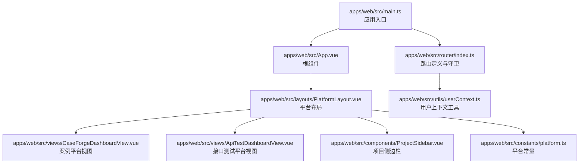
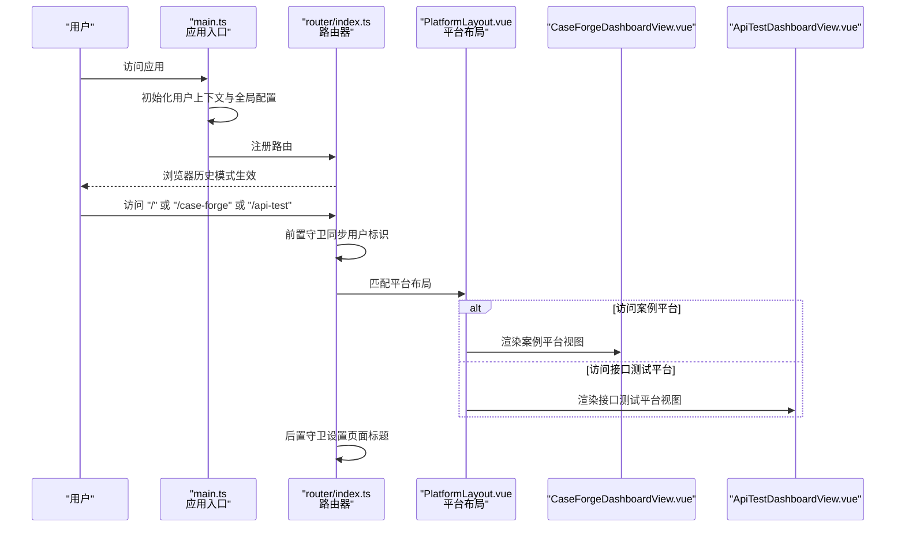
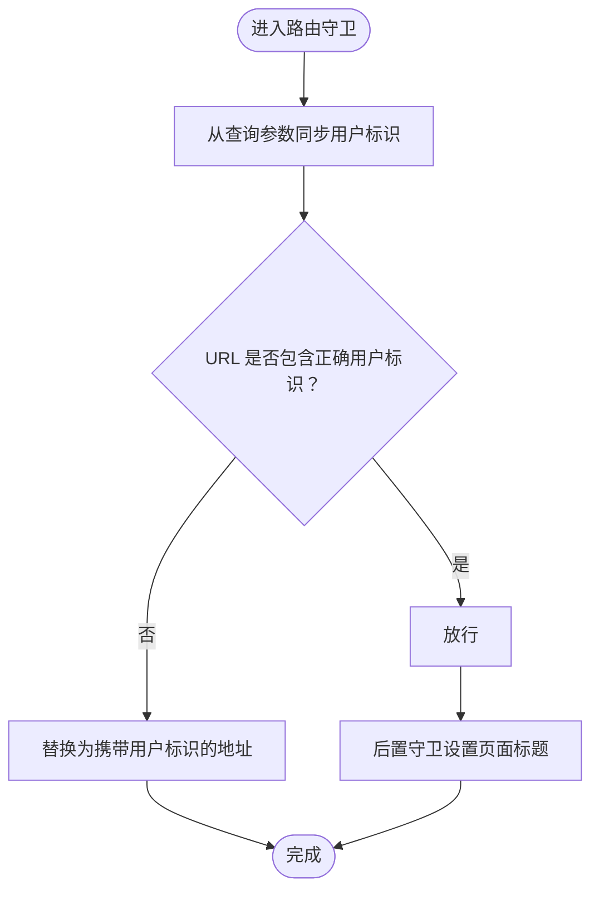
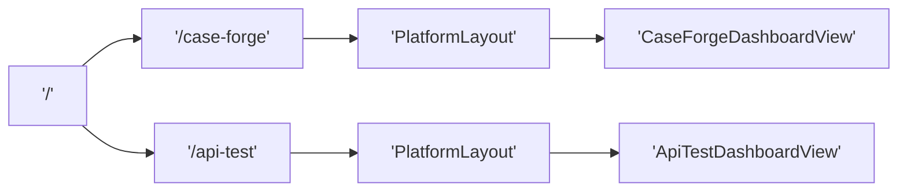
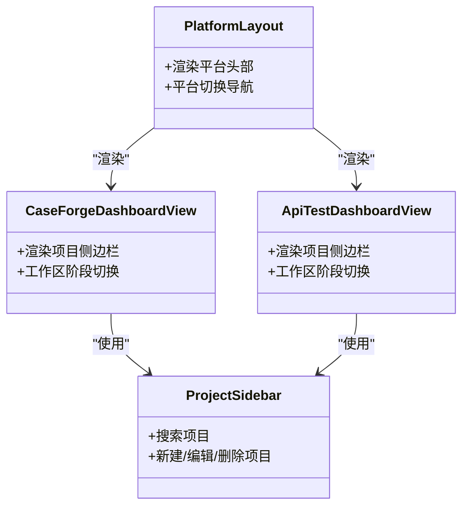
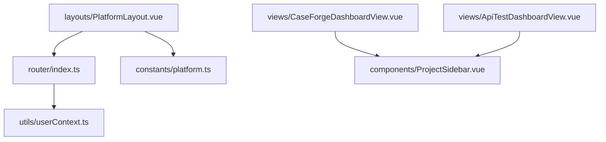

# 路由与导航

<cite>
**本文引用的文件**
- [apps/web/src/router/index.ts](file://apps/web/src/router/index.ts)
- [apps/web/src/main.ts](file://apps/web/src/main.ts)
- [apps/web/src/App.vue](file://apps/web/src/App.vue)
- [apps/web/src/layouts/PlatformLayout.vue](file://apps/web/src/layouts/PlatformLayout.vue)
- [apps/web/src/constants/platform.ts](file://apps/web/src/constants/platform.ts)
- [apps/web/src/utils/userContext.ts](file://apps/web/src/utils/userContext.ts)
- [apps/web/src/views/CaseForgeDashboardView.vue](file://apps/web/src/views/CaseForgeDashboardView.vue)
- [apps/web/src/views/ApiTestDashboardView.vue](file://apps/web/src/views/ApiTestDashboardView.vue)
- [apps/web/src/components/ProjectSidebar.vue](file://apps/web/src/components/ProjectSidebar.vue)
</cite>

## 目录
1. [引言](#引言)
2. [项目结构](#项目结构)
3. [核心组件](#核心组件)
4. [架构总览](#架构总览)
5. [详细组件分析](#详细组件分析)
6. [依赖关系分析](#依赖关系分析)
7. [性能考虑](#性能考虑)
8. [故障排查指南](#故障排查指南)
9. [结论](#结论)
10. [附录](#附录)

## 引言
本文件系统性梳理前端路由与导航体系，覆盖 Vue Router 配置、路由守卫、页面路由设计、嵌套路由与动态路由实践、导航菜单与面包屑思路、页面跳转策略、路由懒加载、权限控制与路由元信息管理，并给出导航性能优化、SEO 友好性与用户体验设计建议。本文所有技术细节均基于仓库现有实现进行归纳与总结。

## 项目结构
前端路由与导航相关的关键文件组织如下：
- 应用入口与挂载：应用在入口文件中初始化用户上下文、全局消息配置，并注册路由与状态管理。
- 路由定义与守卫：路由采用历史模式，定义了两个平台级嵌套路由，并通过前置守卫统一同步用户标识；通过后置守卫设置页面标题。
- 布局与导航：平台布局组件提供顶部导航栏与平台切换链接，配合常量定义平台元数据。
- 视图层：各平台的仪表盘视图负责渲染侧边栏与工作区内容。
- 用户上下文：通过 URL 查询参数与本地存储维护用户标识，贯穿导航与业务调用。

**图表来源**
- [apps/web/src/main.ts:1-20](file://apps/web/src/main.ts#L1-L20)
- [apps/web/src/router/index.ts:1-65](file://apps/web/src/router/index.ts#L1-L65)
- [apps/web/src/App.vue:1-13](file://apps/web/src/App.vue#L1-L13)
- [apps/web/src/layouts/PlatformLayout.vue:1-38](file://apps/web/src/layouts/PlatformLayout.vue#L1-L38)
- [apps/web/src/views/CaseForgeDashboardView.vue:1-139](file://apps/web/src/views/CaseForgeDashboardView.vue#L1-L139)
- [apps/web/src/views/ApiTestDashboardView.vue:1-190](file://apps/web/src/views/ApiTestDashboardView.vue#L1-L190)
- [apps/web/src/components/ProjectSidebar.vue:1-463](file://apps/web/src/components/ProjectSidebar.vue#L1-L463)
- [apps/web/src/constants/platform.ts:1-35](file://apps/web/src/constants/platform.ts#L1-L35)
- [apps/web/src/utils/userContext.ts:1-42](file://apps/web/src/utils/userContext.ts#L1-L42)

**章节来源**
- [apps/web/src/main.ts:1-20](file://apps/web/src/main.ts#L1-L20)
- [apps/web/src/router/index.ts:1-65](file://apps/web/src/router/index.ts#L1-L65)
- [apps/web/src/App.vue:1-13](file://apps/web/src/App.vue#L1-L13)

## 核心组件
- 路由器实例与历史模式：使用浏览器历史模式，定义根路径重定向与两个平台级嵌套路由。
- 路由守卫：
  - 前置守卫：从查询参数同步用户标识，若当前 URL 缺失或不一致则替换为携带用户标识的地址。
  - 后置守卫：根据路由元信息设置页面标题。
- 布局与导航：平台布局组件展示品牌与平台切换导航，切换时携带用户标识。
- 用户上下文：初始化与同步用户标识，保证跨平台分享与切换的一致性。
- 视图层：两个平台的仪表盘视图分别承载各自的侧边栏与工作区。

**章节来源**
- [apps/web/src/router/index.ts:7-42](file://apps/web/src/router/index.ts#L7-L42)
- [apps/web/src/router/index.ts:44-62](file://apps/web/src/router/index.ts#L44-L62)
- [apps/web/src/layouts/PlatformLayout.vue:11-21](file://apps/web/src/layouts/PlatformLayout.vue#L11-L21)
- [apps/web/src/utils/userContext.ts:4-29](file://apps/web/src/utils/userContext.ts#L4-L29)

## 架构总览
下图展示了从应用启动到路由导航的关键交互：

**图表来源**
- [apps/web/src/main.ts:16-19](file://apps/web/src/main.ts#L16-L19)
- [apps/web/src/router/index.ts:44-62](file://apps/web/src/router/index.ts#L44-L62)
- [apps/web/src/layouts/PlatformLayout.vue:1-38](file://apps/web/src/layouts/PlatformLayout.vue#L1-L38)
- [apps/web/src/views/CaseForgeDashboardView.vue:1-139](file://apps/web/src/views/CaseForgeDashboardView.vue#L1-L139)
- [apps/web/src/views/ApiTestDashboardView.vue:1-190](file://apps/web/src/views/ApiTestDashboardView.vue#L1-L190)

## 详细组件分析

### 路由器与路由守卫
- 路由配置要点
  - 历史模式：使用浏览器历史模式，利于 SEO 与分享。
  - 根路径重定向：访问根路径时自动重定向至案例平台，并携带用户标识。
  - 平台级嵌套路由：案例平台与接口测试平台各自定义一个子路由，作为布局容器。
- 路由元信息：每个子路由定义了平台标识与页面标题，用于后置守卫设置文档标题。
- 路由守卫
  - beforeEach：从查询参数解析用户标识，若缺失或不一致则替换为携带用户标识的地址，确保后续请求与分享一致性。
  - afterEach：读取路由元信息中的标题，设置 document.title。

**图表来源**
- [apps/web/src/router/index.ts:44-57](file://apps/web/src/router/index.ts#L44-L57)
- [apps/web/src/router/index.ts:59-62](file://apps/web/src/router/index.ts#L59-L62)
- [apps/web/src/utils/userContext.ts:16-29](file://apps/web/src/utils/userContext.ts#L16-L29)

**章节来源**
- [apps/web/src/router/index.ts:7-42](file://apps/web/src/router/index.ts#L7-L42)
- [apps/web/src/router/index.ts:44-62](file://apps/web/src/router/index.ts#L44-L62)
- [apps/web/src/utils/userContext.ts:4-29](file://apps/web/src/utils/userContext.ts#L4-L29)

### 页面路由设计与嵌套路由
- 页面路由设计
  - 根路径重定向：统一入口，便于分享与平台切换。
  - 平台路由：/case-forge 与 /api-test 分别对应两个平台。
- 嵌套路由
  - 平台布局作为父级路由组件，内部通过 router-view 渲染子路由视图。
  - 子路由为空路径，直接渲染仪表盘视图，形成“平台布局 -> 仪表盘”的嵌套结构。
- 导航菜单
  - 平台布局顶部提供平台切换链接，点击时携带当前用户标识，保持会话一致性。

**图表来源**
- [apps/web/src/router/index.ts:10-41](file://apps/web/src/router/index.ts#L10-L41)
- [apps/web/src/layouts/PlatformLayout.vue:11-21](file://apps/web/src/layouts/PlatformLayout.vue#L11-L21)

**章节来源**
- [apps/web/src/router/index.ts:10-41](file://apps/web/src/router/index.ts#L10-L41)
- [apps/web/src/layouts/PlatformLayout.vue:11-21](file://apps/web/src/layouts/PlatformLayout.vue#L11-L21)

### 动态路由与页面跳转策略
- 动态路由
  - 当前路由表未显式声明动态段参数，但平台切换与用户标识通过查询参数动态传递，实现“动态”行为。
- 页面跳转策略
  - 平台切换使用 RouterLink，携带用户标识，避免重复登录与上下文丢失。
  - 根路径重定向确保首次访问即进入目标平台，提升可用性。

**章节来源**
- [apps/web/src/layouts/PlatformLayout.vue:15](file://apps/web/src/layouts/PlatformLayout.vue#L15)
- [apps/web/src/router/index.ts:12-16](file://apps/web/src/router/index.ts#L12-L16)

### 导航菜单、面包屑与页面跳转
- 导航菜单
  - 平台布局提供顶部导航，支持在不同平台间快速切换。
- 面包屑导航
  - 当前实现未包含显式的面包屑组件；可在视图层按业务场景扩展，结合路由元信息与层级结构生成。
- 页面跳转
  - 使用 RouterLink 进行平台内跳转，携带用户标识，保证跨页面一致性。

**章节来源**
- [apps/web/src/layouts/PlatformLayout.vue:11-21](file://apps/web/src/layouts/PlatformLayout.vue#L11-L21)

### 路由懒加载、权限控制与路由元信息
- 路由懒加载
  - 当前路由定义采用同步导入视图组件；如需进一步优化首屏加载，可将视图组件改为动态导入以实现按需加载。
- 权限控制
  - 当前未在路由层实现细粒度权限校验；可在前置守卫中结合用户角色与路由元信息进行鉴权。
- 路由元信息
  - 路由元信息包含平台标识与页面标题，用于后置守卫设置文档标题，提升 SEO 与用户体验。

**章节来源**
- [apps/web/src/router/index.ts:25](file://apps/web/src/router/index.ts#L25)
- [apps/web/src/router/index.ts:37](file://apps/web/src/router/index.ts#L37)
- [apps/web/src/router/index.ts:59-62](file://apps/web/src/router/index.ts#L59-L62)

### 视图层与侧边栏导航
- 案例平台视图
  - 渲染项目侧边栏与工作区，支持沉浸式模式与阶段切换。
- 接口测试平台视图
  - 渲染项目侧边栏与工作区，支持事务工作区与阶段切换。
- 侧边栏导航
  - 项目侧边栏支持搜索、新建、编辑、删除等操作，承载平台内的二级导航职责。

**图表来源**
- [apps/web/src/layouts/PlatformLayout.vue:1-38](file://apps/web/src/layouts/PlatformLayout.vue#L1-L38)
- [apps/web/src/views/CaseForgeDashboardView.vue:1-139](file://apps/web/src/views/CaseForgeDashboardView.vue#L1-L139)
- [apps/web/src/views/ApiTestDashboardView.vue:1-190](file://apps/web/src/views/ApiTestDashboardView.vue#L1-L190)
- [apps/web/src/components/ProjectSidebar.vue:1-463](file://apps/web/src/components/ProjectSidebar.vue#L1-L463)

**章节来源**
- [apps/web/src/views/CaseForgeDashboardView.vue:1-139](file://apps/web/src/views/CaseForgeDashboardView.vue#L1-L139)
- [apps/web/src/views/ApiTestDashboardView.vue:1-190](file://apps/web/src/views/ApiTestDashboardView.vue#L1-L190)
- [apps/web/src/components/ProjectSidebar.vue:1-463](file://apps/web/src/components/ProjectSidebar.vue#L1-L463)

## 依赖关系分析
- 组件耦合
  - 路由器依赖用户上下文工具以保证导航一致性。
  - 平台布局依赖平台常量以识别当前平台并生成导航。
  - 视图层依赖 Pinia 状态管理与组合式函数以驱动工作区与侧边栏。
- 外部依赖
  - Vue Router 提供路由能力与守卫。
  - Ant Design Vue 提供 UI 组件与国际化配置。

**图表来源**
- [apps/web/src/router/index.ts:1-65](file://apps/web/src/router/index.ts#L1-L65)
- [apps/web/src/utils/userContext.ts:1-42](file://apps/web/src/utils/userContext.ts#L1-L42)
- [apps/web/src/layouts/PlatformLayout.vue:28-36](file://apps/web/src/layouts/PlatformLayout.vue#L28-L36)
- [apps/web/src/constants/platform.ts:1-35](file://apps/web/src/constants/platform.ts#L1-L35)
- [apps/web/src/views/CaseForgeDashboardView.vue:1-139](file://apps/web/src/views/CaseForgeDashboardView.vue#L1-L139)
- [apps/web/src/views/ApiTestDashboardView.vue:1-190](file://apps/web/src/views/ApiTestDashboardView.vue#L1-L190)
- [apps/web/src/components/ProjectSidebar.vue:1-463](file://apps/web/src/components/ProjectSidebar.vue#L1-L463)

**章节来源**
- [apps/web/src/router/index.ts:1-65](file://apps/web/src/router/index.ts#L1-L65)
- [apps/web/src/layouts/PlatformLayout.vue:28-36](file://apps/web/src/layouts/PlatformLayout.vue#L28-L36)
- [apps/web/src/constants/platform.ts:1-35](file://apps/web/src/constants/platform.ts#L1-L35)

## 性能考虑
- 路由懒加载
  - 将视图组件改为动态导入，减少初始包体积，提升首屏加载速度。
- keep-alive 与缓存
  - 在视图层使用 keep-alive 缓存组件状态，避免重复渲染与数据拉取。
- 路由守卫开销
  - 前置守卫仅做用户标识同步与必要判断，尽量避免复杂逻辑，降低导航延迟。
- 图片与资源
  - 优化布局与视图中的静态资源，启用压缩与懒加载策略。

[本节为通用指导，无需特定文件引用]

## 故障排查指南
- 用户标识不一致
  - 症状：跨平台切换后用户标识丢失或变化。
  - 排查：确认前置守卫是否正确从查询参数同步用户标识，并检查替换逻辑是否生效。
- 页面标题未更新
  - 症状：页面标题未随路由变化而更新。
  - 排查：确认路由元信息中是否存在标题字段，以及后置守卫是否被触发。
- 平台切换无效
  - 症状：点击平台切换链接后未跳转或未携带用户标识。
  - 排查：检查 RouterLink 的 to 对象是否包含用户标识查询参数，以及布局组件是否正确计算平台查询参数。

**章节来源**
- [apps/web/src/router/index.ts:44-62](file://apps/web/src/router/index.ts#L44-L62)
- [apps/web/src/utils/userContext.ts:16-29](file://apps/web/src/utils/userContext.ts#L16-L29)
- [apps/web/src/layouts/PlatformLayout.vue:15](file://apps/web/src/layouts/PlatformLayout.vue#L15)

## 结论
该路由与导航系统以简洁清晰的方式实现了平台级嵌套路由、统一的用户上下文与页面标题管理。通过前置与后置守卫保障导航一致性与 SEO 友好性，配合布局与视图层的导航组件，提供了良好的用户体验。未来可在路由懒加载、权限控制与面包屑导航等方面进一步增强，以满足更复杂的业务场景。

## 附录
- 最佳实践清单
  - 使用动态导入实现路由懒加载。
  - 在路由元信息中补充权限与面包屑所需字段。
  - 在前置守卫中集中处理权限与上下文校验。
  - 利用 keep-alive 缓存关键视图状态。
  - 为重要页面设置语义化的标题与描述，提升 SEO。

[本节为通用指导，无需特定文件引用]