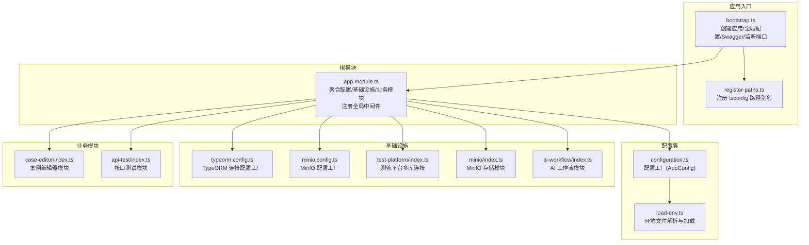
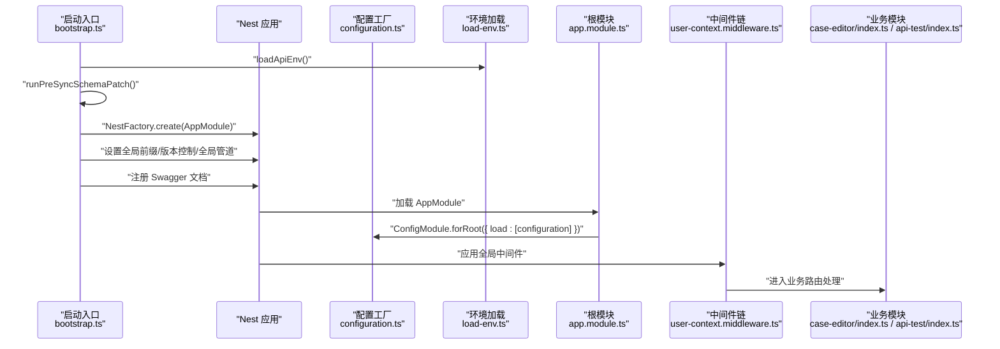
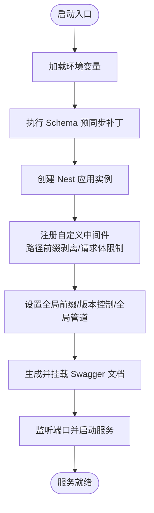
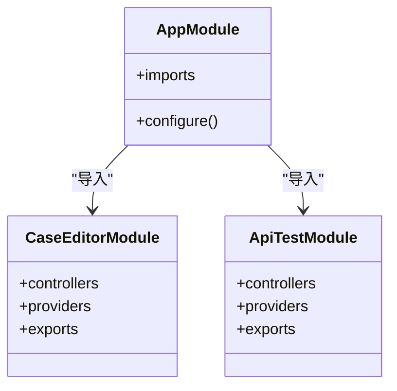
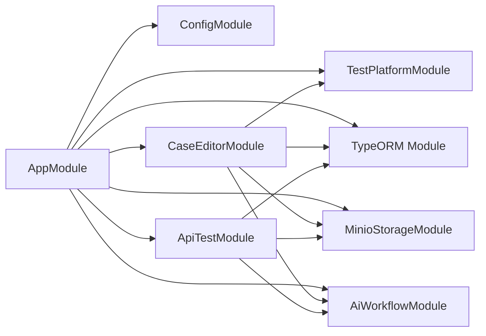

# NestJS 架构设计

<cite>
**本文引用的文件**
- [apps/api/src/app.module.ts](file://apps/api/src/app.module.ts)
- [apps/api/src/bootstrap.ts](file://apps/api/src/bootstrap.ts)
- [apps/api/src/register-paths.ts](file://apps/api/src/register-paths.ts)
- [apps/api/src/config/configuration.ts](file://apps/api/src/config/configuration.ts)
- [apps/api/src/config/load-env.ts](file://apps/api/src/config/load-env.ts)
- [apps/api/src/common/typeorm/typeorm.config.ts](file://apps/api/src/common/typeorm/typeorm.config.ts)
- [apps/api/src/common/minio/minio.config.ts](file://apps/api/src/common/minio/minio.config.ts)
- [apps/api/src/common/audit/user-context.middleware.ts](file://apps/api/src/common/audit/user-context.middleware.ts)
- [apps/api/src/common/ai-workflow/index.ts](file://apps/api/src/common/ai-workflow/index.ts)
- [apps/api/src/common/test-platform/index.ts](file://apps/api/src/common/test-platform/index.ts)
- [apps/api/src/common/minio/index.ts](file://apps/api/src/common/minio/index.ts)
- [apps/api/src/modules/case-editor/index.ts](file://apps/api/src/modules/case-editor/index.ts)
- [apps/api/src/modules/api-test/index.ts](file://apps/api/src/modules/api-test/index.ts)
- [apps/api/package.json](file://apps/api/package.json)
- [apps/api/nest-cli.json](file://apps/api/nest-cli.json)
</cite>

## 目录
1. [引言](#引言)
2. [项目结构](#项目结构)
3. [核心组件](#核心组件)
4. [架构总览](#架构总览)
5. [详细组件分析](#详细组件分析)
6. [依赖分析](#依赖分析)
7. [性能考虑](#性能考虑)
8. [故障排查指南](#故障排查指南)
9. [结论](#结论)
10. [附录](#附录)

## 引言
本文件系统性梳理该 NestJS 项目的架构设计，围绕模块系统、依赖注入容器、装饰器模式展开，重点阐释根模块配置、模块间依赖关系与生命周期管理、应用启动流程、全局配置与路径注册机制，并总结模块化设计原则、代码组织规范与最佳实践。通过架构图与序列图，帮助读者快速把握系统全貌与关键实现。

## 项目结构
该项目采用多包/多应用的 monorepo 组织方式，核心后端应用位于 apps/api。其结构遵循“按功能域划分模块”的组织原则，结合通用公共层（common）、业务模块（modules）、配置与引导（config、bootstrap、register-paths）以及脚本与工具（scripts），形成清晰的分层与职责边界。

- 根模块与启动
  - 根模块负责聚合配置、基础设施与各业务模块，并注册全局中间件。
  - 启动入口完成环境加载、预同步 Schema、创建 Nest 应用实例、设置全局前缀与版本控制、注册全局管道与 Swagger 文档、监听端口。
  - 路径别名注册确保开发与生产双模式下模块导入的一致性。

- 配置与环境
  - ConfigModule 以工厂函数形式加载环境变量，统一输出 AppConfig。
  - 环境文件解析支持多级优先级与注释过滤，避免覆盖已有变量。

- 公共能力
  - TypeORM 模块按应用配置动态生成连接参数，自动扫描实体与订阅者。
  - MinIO 模块以配置令牌注入 MinIO 客户端配置与服务。
  - 审计与用户上下文中间件贯穿请求生命周期，提供用户作用域与访问日志基础。

- 业务模块
  - 案例编辑器模块、接口测试模块、结构化文档模块、动态指令模块、项目管理模块等均以独立模块封装，内部通过 TypeORM 实体、服务与控制器协同，并按需导出可复用的服务。

图表来源
- [apps/api/src/bootstrap.ts:1-64](file://apps/api/src/bootstrap.ts#L1-L64)
- [apps/api/src/register-paths.ts:1-38](file://apps/api/src/register-paths.ts#L1-L38)
- [apps/api/src/app.module.ts:1-48](file://apps/api/src/app.module.ts#L1-L48)
- [apps/api/src/config/configuration.ts:1-48](file://apps/api/src/config/configuration.ts#L1-L48)
- [apps/api/src/config/load-env.ts:1-55](file://apps/api/src/config/load-env.ts#L1-L55)
- [apps/api/src/common/typeorm/typeorm.config.ts:1-43](file://apps/api/src/common/typeorm/typeorm.config.ts#L1-L43)
- [apps/api/src/common/minio/minio.config.ts:1-38](file://apps/api/src/common/minio/minio.config.ts#L1-L38)
- [apps/api/src/common/test-platform/index.ts:1-35](file://apps/api/src/common/test-platform/index.ts#L1-L35)
- [apps/api/src/common/minio/index.ts:1-18](file://apps/api/src/common/minio/index.ts#L1-L18)
- [apps/api/src/common/ai-workflow/index.ts:1-21](file://apps/api/src/common/ai-workflow/index.ts#L1-L21)
- [apps/api/src/modules/case-editor/index.ts:1-60](file://apps/api/src/modules/case-editor/index.ts#L1-L60)
- [apps/api/src/modules/api-test/index.ts:1-64](file://apps/api/src/modules/api-test/index.ts#L1-L64)

章节来源
- [apps/api/src/bootstrap.ts:1-64](file://apps/api/src/bootstrap.ts#L1-L64)
- [apps/api/src/register-paths.ts:1-38](file://apps/api/src/register-paths.ts#L1-L38)
- [apps/api/src/app.module.ts:1-48](file://apps/api/src/app.module.ts#L1-L48)
- [apps/api/src/config/configuration.ts:1-48](file://apps/api/src/config/configuration.ts#L1-L48)
- [apps/api/src/config/load-env.ts:1-55](file://apps/api/src/config/load-env.ts#L1-L55)

## 核心组件
- 根模块（AppModule）
  - 聚合 ConfigModule、TypeORM、测管平台模块、MinIO、AI 工作流、各业务模块。
  - 注册全局中间件：用户上下文中间件与 HTTP 访问日志中间件。
  - 作为依赖注入容器的根节点，承载全局生命周期钩子与中间件链路。

- 启动入口（bootstrap）
  - 预先执行 Schema 同步补丁。
  - 创建 Nest 应用实例，启用 CORS。
  - 自定义 Express 中间件：剥离带用户名的路径前缀、设置请求体大小限制。
  - 设置全局前缀与 URI 版本控制，注册全局验证管道。
  - 生成并挂载 Swagger 文档。
  - 读取端口并监听。

- 路径别名注册（register-paths）
  - 区分开发（src）与生产（dist）两种模式，注册统一的模块别名映射，便于跨模块导入。

- 配置工厂（configuration）
  - 输出 AppConfig，包含 Node 环境、端口、TypeORM 主库与测试库、MinIO、AI 工作流等配置项。

- 环境加载（load-env）
  - 解析多级 env 文件路径，按优先级加载，支持 // 与 # 注释行，避免覆盖已存在变量。

- TypeORM 配置工厂
  - 基于 AppConfig 动态生成连接参数，自动扫描实体与审计订阅者，按环境决定是否同步。

- MinIO 配置工厂与模块
  - 将 MinIO 配置以令牌注入，模块导出配置与存储服务，供业务模块使用。

- 审计与用户上下文中间件
  - 从路径、请求头或查询参数解析用户名，重写路径并注入请求上下文，为审计与权限提供基础。

章节来源
- [apps/api/src/app.module.ts:1-48](file://apps/api/src/app.module.ts#L1-L48)
- [apps/api/src/bootstrap.ts:1-64](file://apps/api/src/bootstrap.ts#L1-L64)
- [apps/api/src/register-paths.ts:1-38](file://apps/api/src/register-paths.ts#L1-L38)
- [apps/api/src/config/configuration.ts:1-48](file://apps/api/src/config/configuration.ts#L1-L48)
- [apps/api/src/config/load-env.ts:1-55](file://apps/api/src/config/load-env.ts#L1-L55)
- [apps/api/src/common/typeorm/typeorm.config.ts:1-43](file://apps/api/src/common/typeorm/typeorm.config.ts#L1-L43)
- [apps/api/src/common/minio/minio.config.ts:1-38](file://apps/api/src/common/minio/minio.config.ts#L1-L38)
- [apps/api/src/common/audit/user-context.middleware.ts:1-21](file://apps/api/src/common/audit/user-context.middleware.ts#L1-L21)

## 架构总览
下图展示从启动到路由处理的关键交互：启动入口创建应用、注册全局配置与中间件；根模块聚合各模块；业务模块通过 TypeORM 实体与服务协作；审计中间件贯穿请求生命周期。

图表来源
- [apps/api/src/bootstrap.ts:1-64](file://apps/api/src/bootstrap.ts#L1-L64)
- [apps/api/src/config/configuration.ts:1-48](file://apps/api/src/config/configuration.ts#L1-L48)
- [apps/api/src/config/load-env.ts:1-55](file://apps/api/src/config/load-env.ts#L1-L55)
- [apps/api/src/app.module.ts:1-48](file://apps/api/src/app.module.ts#L1-L48)
- [apps/api/src/common/audit/user-context.middleware.ts:1-21](file://apps/api/src/common/audit/user-context.middleware.ts#L1-L21)
- [apps/api/src/modules/case-editor/index.ts:1-60](file://apps/api/src/modules/case-editor/index.ts#L1-L60)
- [apps/api/src/modules/api-test/index.ts:1-64](file://apps/api/src/modules/api-test/index.ts#L1-L64)

## 详细组件分析

### 根模块与全局中间件
- 根模块通过 imports 聚合配置、基础设施与业务模块；configure 方法为所有路由应用用户上下文与访问日志中间件，确保请求进入业务逻辑前完成用户作用域解析与审计准备。
- 全局中间件的顺序与职责：
  - 用户上下文中间件：解析用户名并注入请求上下文。
  - HTTP 访问日志中间件：记录请求访问信息（具体实现位于 common/http 目录中）。

章节来源
- [apps/api/src/app.module.ts:1-48](file://apps/api/src/app.module.ts#L1-L48)
- [apps/api/src/common/audit/user-context.middleware.ts:1-21](file://apps/api/src/common/audit/user-context.middleware.ts#L1-L21)

### 启动流程与全局配置
- 启动流程要点：
  - 环境加载：优先级解析 env 文件并写入 process.env。
  - Schema 预同步：在应用启动前执行数据库 Schema 补丁。
  - 应用创建：启用 CORS，注册自定义中间件（路径前缀剥离、请求体大小限制）。
  - 全局配置：设置全局前缀、URI 版本控制、全局验证管道。
  - 文档与监听：生成 Swagger 文档并监听指定端口。

图表来源
- [apps/api/src/bootstrap.ts:1-64](file://apps/api/src/bootstrap.ts#L1-L64)
- [apps/api/src/config/load-env.ts:1-55](file://apps/api/src/config/load-env.ts#L1-L55)

章节来源
- [apps/api/src/bootstrap.ts:1-64](file://apps/api/src/bootstrap.ts#L1-L64)
- [apps/api/src/config/load-env.ts:1-55](file://apps/api/src/config/load-env.ts#L1-L55)

### 配置系统与环境管理
- 配置工厂将环境变量标准化为 AppConfig，涵盖 TypeORM 主库与测试库、MinIO、AI 工作流等。
- 环境文件解析支持多级优先级与注释过滤，避免覆盖已存在变量，保证不同环境下的配置安全注入。

章节来源
- [apps/api/src/config/configuration.ts:1-48](file://apps/api/src/config/configuration.ts#L1-L48)
- [apps/api/src/config/load-env.ts:1-55](file://apps/api/src/config/load-env.ts#L1-L55)

### 基础设施模块
- TypeORM 模块
  - 通过异步工厂从 ConfigService 获取 AppConfig，动态生成连接参数，自动扫描实体与审计订阅者，按环境决定是否同步。
- MinIO 模块
  - 以配置令牌注入 MinIO 客户端配置与存储服务，供业务模块使用。
- 测管平台模块
  - 多数据库连接（默认连接与测管平台连接），通过命名连接区分实体与服务。

章节来源
- [apps/api/src/common/typeorm/typeorm.config.ts:1-43](file://apps/api/src/common/typeorm/typeorm.config.ts#L1-L43)
- [apps/api/src/common/minio/minio.config.ts:1-38](file://apps/api/src/common/minio/minio.config.ts#L1-L38)
- [apps/api/src/common/test-platform/index.ts:1-35](file://apps/api/src/common/test-platform/index.ts#L1-L35)
- [apps/api/src/common/minio/index.ts:1-18](file://apps/api/src/common/minio/index.ts#L1-L18)

### 业务模块设计
- 案例编辑器模块
  - 导入多个相关实体并通过 TypeOrmModule.forFeature 注册；提供编辑、工作区、生成队列、流水线、导出与同步等服务；向外部导出可复用服务。
- 接口测试模块
  - 注册接口测试相关实体与服务，提供文档、用例、环境、执行集、执行、报告与事务等能力；向外部导出可复用服务。

图表来源
- [apps/api/src/app.module.ts:1-48](file://apps/api/src/app.module.ts#L1-L48)
- [apps/api/src/modules/case-editor/index.ts:1-60](file://apps/api/src/modules/case-editor/index.ts#L1-L60)
- [apps/api/src/modules/api-test/index.ts:1-64](file://apps/api/src/modules/api-test/index.ts#L1-L64)

章节来源
- [apps/api/src/modules/case-editor/index.ts:1-60](file://apps/api/src/modules/case-editor/index.ts#L1-L60)
- [apps/api/src/modules/api-test/index.ts:1-64](file://apps/api/src/modules/api-test/index.ts#L1-L64)

### 装饰器模式与依赖注入容器
- 模块装饰器（@Module）用于声明模块的 imports、controllers、providers 与 exports，形成依赖注入容器的装配单元。
- 提供者（Provider）通过构造函数注入（Constructor Injection）被容器管理，模块间通过 exports 暴露服务，实现松耦合复用。
- 异步工厂（如 TypeORM 的 forRootAsync、ConfigModule）用于延迟解析配置与连接，提升启动可控性与可测试性。

章节来源
- [apps/api/src/app.module.ts:1-48](file://apps/api/src/app.module.ts#L1-L48)
- [apps/api/src/common/test-platform/index.ts:1-35](file://apps/api/src/common/test-platform/index.ts#L1-L35)
- [apps/api/src/common/typeorm/typeorm.config.ts:1-43](file://apps/api/src/common/typeorm/typeorm.config.ts#L1-L43)

### 生命周期管理
- 根模块的 NestModule 生命周期钩子（configure）用于注册全局中间件，确保请求进入业务路由前完成上下文初始化。
- 启动阶段的 Schema 预同步补丁体现了对应用启动生命周期的精细化控制，保证数据一致性与稳定性。

章节来源
- [apps/api/src/app.module.ts:1-48](file://apps/api/src/app.module.ts#L1-L48)
- [apps/api/src/bootstrap.ts:1-64](file://apps/api/src/bootstrap.ts#L1-L64)

## 依赖分析
- 模块内聚与耦合
  - 业务模块内部高内聚（实体、服务、控制器），通过 exports 向上层暴露必要能力，降低对根模块的直接依赖。
  - 基础设施模块（TypeORM、MinIO、AI 工作流、测管平台）以配置令牌与异步工厂形式注入，避免业务模块直接感知底层细节。
- 外部依赖与集成点
  - NestJS 核心生态（Common、Config、Core、Platform-Express、Swagger、TypeORM）。
  - 数据库（MySQL）、对象存储（MinIO）、外部 AI 服务（通过 AI 工作流模块抽象）。

图表来源
- [apps/api/src/app.module.ts:1-48](file://apps/api/src/app.module.ts#L1-L48)
- [apps/api/src/common/test-platform/index.ts:1-35](file://apps/api/src/common/test-platform/index.ts#L1-L35)
- [apps/api/src/common/typeorm/typeorm.config.ts:1-43](file://apps/api/src/common/typeorm/typeorm.config.ts#L1-L43)
- [apps/api/src/common/minio/index.ts:1-18](file://apps/api/src/common/minio/index.ts#L1-L18)
- [apps/api/src/common/ai-workflow/index.ts:1-21](file://apps/api/src/common/ai-workflow/index.ts#L1-L21)
- [apps/api/src/modules/case-editor/index.ts:1-60](file://apps/api/src/modules/case-editor/index.ts#L1-L60)
- [apps/api/src/modules/api-test/index.ts:1-64](file://apps/api/src/modules/api-test/index.ts#L1-L64)

章节来源
- [apps/api/src/app.module.ts:1-48](file://apps/api/src/app.module.ts#L1-L48)
- [apps/api/src/modules/case-editor/index.ts:1-60](file://apps/api/src/modules/case-editor/index.ts#L1-L60)
- [apps/api/src/modules/api-test/index.ts:1-64](file://apps/api/src/modules/api-test/index.ts#L1-L64)

## 性能考虑
- 启动阶段
  - 预同步 Schema 补丁应尽量幂等且高效，避免阻塞主流程。
  - 全局中间件数量与复杂度需控制，确保请求首字节时间稳定。
- 数据访问
  - TypeORM 连接参数按环境选择，开发环境允许同步以提升迭代效率，生产环境关闭同步并开启连接池优化。
  - 实体扫描路径与订阅者加载范围应最小化，减少启动时的文件系统扫描开销。
- 存储与网络
  - MinIO 客户端配置与桶策略需合理规划，避免不必要的跨区域访问。
  - 大文件上传建议分片与并发控制，结合请求体大小限制避免内存压力。
- 版本与前缀
  - URI 版本控制与全局前缀有助于演进式 API 设计，但需注意缓存与代理层的配合。

## 故障排查指南
- 环境变量未生效
  - 检查环境文件解析优先级与注释格式，确认未被已有变量覆盖。
- 启动失败或 Schema 不一致
  - 查看预同步补丁执行日志，核对数据库连接参数与字符集设置。
- 中间件导致的路径异常
  - 核对用户路径前缀剥离逻辑与后续路由匹配规则，确保路径重写正确。
- Swagger 文档不可见
  - 确认全局前缀与文档挂载路径一致，检查端口与网络可达性。
- 业务模块服务不可用
  - 检查模块 exports 列表与依赖注入令牌，确认服务已在对应模块中注册并导出。

章节来源
- [apps/api/src/config/load-env.ts:1-55](file://apps/api/src/config/load-env.ts#L1-L55)
- [apps/api/src/bootstrap.ts:1-64](file://apps/api/src/bootstrap.ts#L1-L64)
- [apps/api/src/common/audit/user-context.middleware.ts:1-21](file://apps/api/src/common/audit/user-context.middleware.ts#L1-L21)

## 结论
该 NestJS 项目通过模块化设计实现了高内聚、低耦合的系统架构：根模块统一聚合配置与基础设施，业务模块按功能域拆分并以服务形式复用；依赖注入容器与异步工厂确保了配置与连接的灵活管理；全局中间件与启动流程保障了请求生命周期与系统稳定性。遵循本文的设计原则与最佳实践，可在保持扩展性的同时提升开发效率与运行性能。

## 附录
- 开发与构建
  - 启动脚本与构建配置位于应用包的 package.json 与 nest-cli.json 中，支持开发调试、本地运行与产物构建。
- 路径别名
  - register-paths.ts 提供开发与生产双模式的路径映射，确保模块导入一致性。

章节来源
- [apps/api/package.json:1-62](file://apps/api/package.json#L1-L62)
- [apps/api/nest-cli.json:1-16](file://apps/api/nest-cli.json#L1-L16)
- [apps/api/src/register-paths.ts:1-38](file://apps/api/src/register-paths.ts#L1-L38)