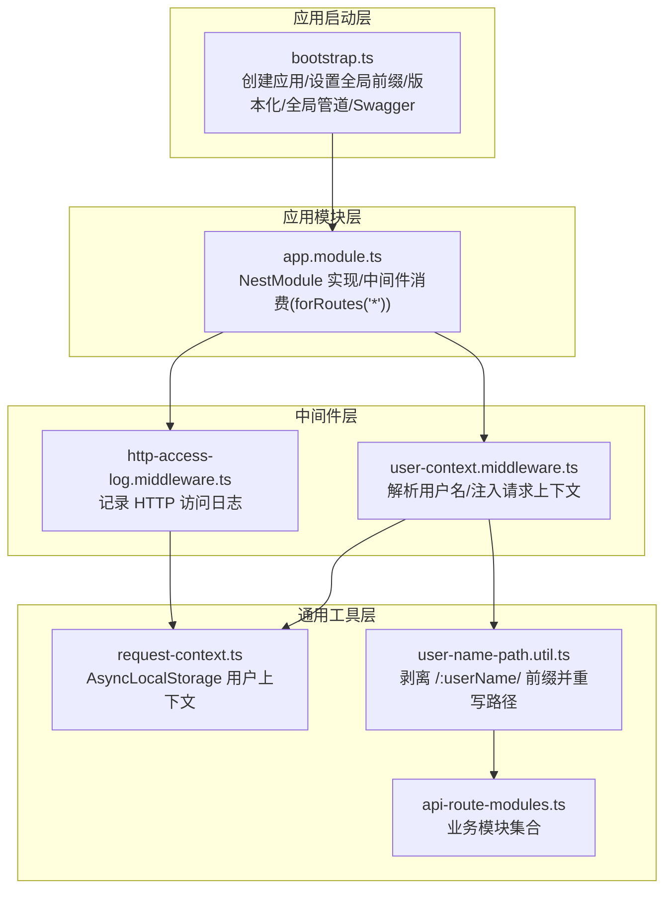
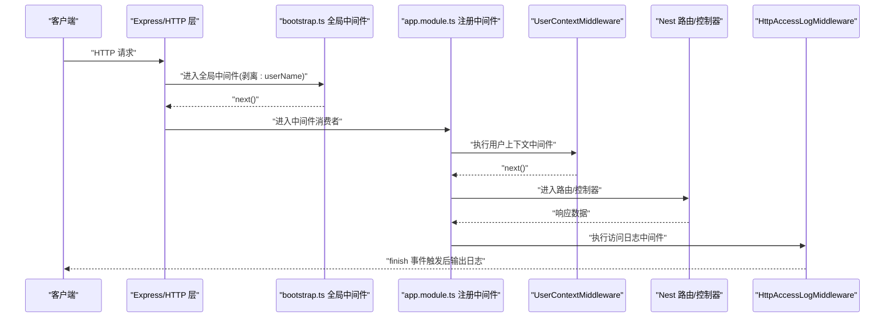
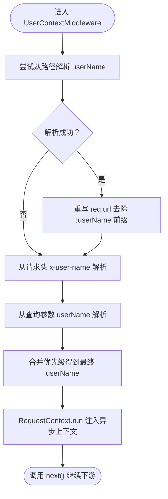
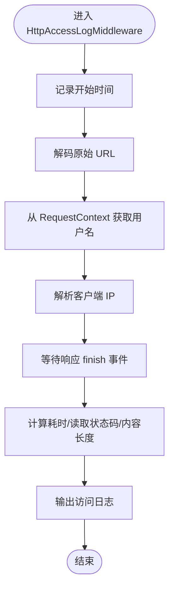
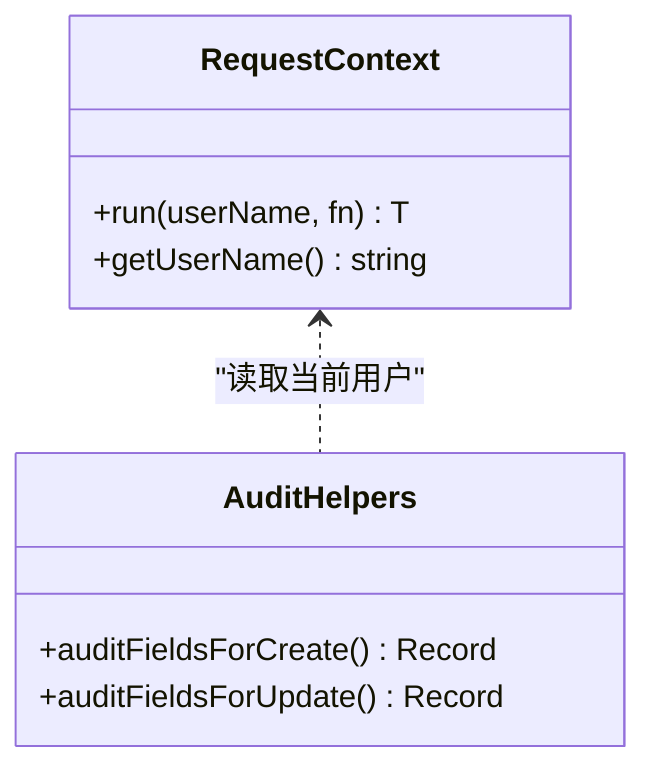
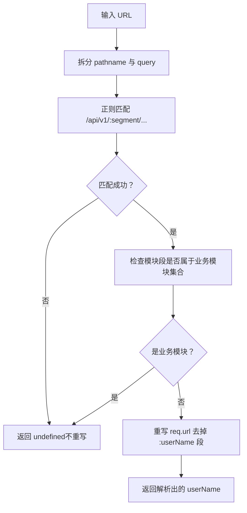
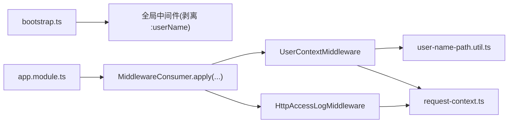

# 中间件与拦截器

<cite>
**本文引用的文件**
- [apps/api/src/bootstrap.ts](file://apps/api/src/bootstrap.ts)
- [apps/api/src/app.module.ts](file://apps/api/src/app.module.ts)
- [apps/api/src/common/audit/user-context.middleware.ts](file://apps/api/src/common/audit/user-context.middleware.ts)
- [apps/api/src/common/http/http-access-log.middleware.ts](file://apps/api/src/common/http/http-access-log.middleware.ts)
- [apps/api/src/common/audit/request-context.ts](file://apps/api/src/common/audit/request-context.ts)
- [apps/api/src/common/audit/user-name-path.util.ts](file://apps/api/src/common/audit/user-name-path.util.ts)
- [apps/api/src/common/audit/api-route-modules.ts](file://apps/api/src/common/audit/api-route-modules.ts)
</cite>

## 目录
1. [简介](#简介)
2. [项目结构](#项目结构)
3. [核心组件](#核心组件)
4. [架构总览](#架构总览)
5. [详细组件分析](#详细组件分析)
6. [依赖关系分析](#依赖关系分析)
7. [性能考量](#性能考量)
8. [故障排查指南](#故障排查指南)
9. [结论](#结论)
10. [附录](#附录)

## 简介
本技术指南聚焦于 NestJS 中间件与拦截器在实际工程中的执行顺序、请求处理流程与响应拦截机制，结合仓库中的审计中间件、用户上下文中间件与访问日志中间件，系统阐述中间件链路如何构建灵活且可扩展的请求处理通道。同时，基于现有代码，给出拦截器、异常过滤器与管道的最佳实践建议与落地方法，帮助读者在不破坏现有设计的前提下扩展功能。

## 项目结构
本项目采用标准的 NestJS 应用结构，启动入口负责全局中间件与全局管道的装配，根模块负责集中注册业务中间件，通用审计与 HTTP 日志中间件位于公共目录下，便于跨模块复用。

图示来源
- [apps/api/src/bootstrap.ts:18-61](file://apps/api/src/bootstrap.ts#L18-L61)
- [apps/api/src/app.module.ts:41-46](file://apps/api/src/app.module.ts#L41-L46)
- [apps/api/src/common/audit/user-context.middleware.ts:8-19](file://apps/api/src/common/audit/user-context.middleware.ts#L8-L19)
- [apps/api/src/common/http/http-access-log.middleware.ts:7-45](file://apps/api/src/common/http/http-access-log.middleware.ts#L7-L45)
- [apps/api/src/common/audit/request-context.ts:8-16](file://apps/api/src/common/audit/request-context.ts#L8-L16)
- [apps/api/src/common/audit/user-name-path.util.ts:7-29](file://apps/api/src/common/audit/user-name-path.util.ts#L7-L29)
- [apps/api/src/common/audit/api-route-modules.ts:1-10](file://apps/api/src/common/audit/api-route-modules.ts#L1-L10)

章节来源
- [apps/api/src/bootstrap.ts:18-61](file://apps/api/src/bootstrap.ts#L18-L61)
- [apps/api/src/app.module.ts:41-46](file://apps/api/src/app.module.ts#L41-L46)

## 核心组件
- 用户上下文中间件：负责从路径、请求头或查询参数解析用户名，剥离以用户名为前缀的路由段并重写请求路径，随后将用户名注入异步上下文，供后续控制器与服务使用。
- 访问日志中间件：在响应完成事件触发后，读取请求方法、路径、状态码、耗时、内容长度、用户与客户端 IP，输出统一格式的访问日志。
- 请求上下文：基于 AsyncLocalStorage 提供跨异步调用链的用户标识存取能力，并提供审计字段生成辅助函数。
- 路径用户名解析工具：识别并剥离形如 /api/v1/:userName/:module/... 的路径前缀，仅当模块段确属业务模块集合时才进行重写，避免误伤非用户域路径。

章节来源
- [apps/api/src/common/audit/user-context.middleware.ts:8-19](file://apps/api/src/common/audit/user-context.middleware.ts#L8-L19)
- [apps/api/src/common/http/http-access-log.middleware.ts:7-45](file://apps/api/src/common/http/http-access-log.middleware.ts#L7-L45)
- [apps/api/src/common/audit/request-context.ts:8-16](file://apps/api/src/common/audit/request-context.ts#L8-L16)
- [apps/api/src/common/audit/user-name-path.util.ts:7-29](file://apps/api/src/common/audit/user-name-path.util.ts#L7-L29)
- [apps/api/src/common/audit/api-route-modules.ts:1-10](file://apps/api/src/common/audit/api-route-modules.ts#L1-L10)

## 架构总览
下图展示了从应用启动到请求结束的完整链路，强调中间件的执行顺序与职责边界：

图示来源
- [apps/api/src/bootstrap.ts:24-31](file://apps/api/src/bootstrap.ts#L24-L31)
- [apps/api/src/app.module.ts:42-45](file://apps/api/src/app.module.ts#L42-L45)
- [apps/api/src/common/audit/user-context.middleware.ts:9-19](file://apps/api/src/common/audit/user-context.middleware.ts#L9-L19)
- [apps/api/src/common/http/http-access-log.middleware.ts:10-45](file://apps/api/src/common/http/http-access-log.middleware.ts#L10-L45)

## 详细组件分析

### 用户上下文中间件
- 执行时机：在所有路由匹配之前，由根模块集中注册，对所有路由生效。
- 关键逻辑：
  - 使用路径解析工具判断是否为以用户名为前缀的用户域路径；
  - 若是，则剥离前缀并重写请求路径，同时提取用户名；
  - 优先级：路径 > 请求头 x-user-name > 查询参数 userName；
  - 将最终用户名注入异步上下文，供后续服务层读取。
- 与全局中间件的关系：在应用启动阶段，先通过全局中间件剥离 /api/v1/:userName/ 前缀，再由根模块中间件消费阶段进行用户名解析与上下文注入，确保路由能正确匹配到业务模块。

图示来源
- [apps/api/src/common/audit/user-context.middleware.ts:9-19](file://apps/api/src/common/audit/user-context.middleware.ts#L9-L19)
- [apps/api/src/common/audit/user-name-path.util.ts:7-29](file://apps/api/src/common/audit/user-name-path.util.ts#L7-L29)
- [apps/api/src/common/audit/request-context.ts:8-16](file://apps/api/src/common/audit/request-context.ts#L8-L16)

章节来源
- [apps/api/src/common/audit/user-context.middleware.ts:8-19](file://apps/api/src/common/audit/user-context.middleware.ts#L8-L19)
- [apps/api/src/common/audit/user-name-path.util.ts:7-29](file://apps/api/src/common/audit/user-name-path.util.ts#L7-L29)
- [apps/api/src/common/audit/request-context.ts:8-16](file://apps/api/src/common/audit/request-context.ts#L8-L16)

### 访问日志中间件
- 执行时机：在路由处理完成后，通过响应 finish 事件收集状态码、耗时与内容长度等信息。
- 关键逻辑：
  - 记录开始时间与请求方法；
  - 对原始 URL 进行解码，避免乱码；
  - 从异步上下文中读取当前用户名；
  - 从请求头或套接字地址解析客户端 IP；
  - 输出包含方法、路径、状态码、耗时、用户与 IP 的统一格式日志。
- 性能注意：仅在 finish 事件中输出日志，避免阻塞主处理流程。

图示来源
- [apps/api/src/common/http/http-access-log.middleware.ts:10-45](file://apps/api/src/common/http/http-access-log.middleware.ts#L10-L45)
- [apps/api/src/common/audit/request-context.ts:13-15](file://apps/api/src/common/audit/request-context.ts#L13-L15)

章节来源
- [apps/api/src/common/http/http-access-log.middleware.ts:7-45](file://apps/api/src/common/http/http-access-log.middleware.ts#L7-L45)
- [apps/api/src/common/audit/request-context.ts:13-15](file://apps/api/src/common/audit/request-context.ts#L13-L15)

### 请求上下文与审计字段
- 异步上下文：通过 AsyncLocalStorage 存储当前操作用户，默认值为 system，保证在异步调用链中可读取。
- 审计字段：提供创建与更新场景下的审计字段生成函数，自动填充创建者与修改者信息，减少重复代码。

图示来源
- [apps/api/src/common/audit/request-context.ts:8-16](file://apps/api/src/common/audit/request-context.ts#L8-L16)
- [apps/api/src/common/audit/request-context.ts:47-56](file://apps/api/src/common/audit/request-context.ts#L47-L56)

章节来源
- [apps/api/src/common/audit/request-context.ts:8-16](file://apps/api/src/common/audit/request-context.ts#L8-L16)
- [apps/api/src/common/audit/request-context.ts:47-56](file://apps/api/src/common/audit/request-context.ts#L47-L56)

### 路径用户名解析与模块识别
- 识别规则：对 /api/v1/:segment/... 形式的路径，若第三段不是业务模块集合中的成员，则判定为以用户名为前缀的路径，剥离该段并重写请求路径。
- 安全性：仅在确认模块段属于已知业务模块时才进行重写，避免误伤其他路由。

图示来源
- [apps/api/src/common/audit/user-name-path.util.ts:7-29](file://apps/api/src/common/audit/user-name-path.util.ts#L7-L29)
- [apps/api/src/common/audit/api-route-modules.ts:1-10](file://apps/api/src/common/audit/api-route-modules.ts#L1-L10)

章节来源
- [apps/api/src/common/audit/user-name-path.util.ts:7-29](file://apps/api/src/common/audit/user-name-path.util.ts#L7-L29)
- [apps/api/src/common/audit/api-route-modules.ts:1-10](file://apps/api/src/common/audit/api-route-modules.ts#L1-L10)

## 依赖关系分析
- 中间件注册：根模块通过 MiddlewareConsumer 将用户上下文与访问日志中间件应用于所有路由，形成统一的请求处理链。
- 启动阶段前置：应用启动时的全局中间件负责剥离以用户名为前缀的路径，确保后续路由能正确匹配。
- 工具依赖：用户上下文中间件依赖路径解析工具与请求上下文；访问日志中间件依赖请求上下文以获取用户名。

图示来源
- [apps/api/src/bootstrap.ts:24-31](file://apps/api/src/bootstrap.ts#L24-L31)
- [apps/api/src/app.module.ts:42-45](file://apps/api/src/app.module.ts#L42-L45)
- [apps/api/src/common/audit/user-context.middleware.ts:9-19](file://apps/api/src/common/audit/user-context.middleware.ts#L9-L19)
- [apps/api/src/common/http/http-access-log.middleware.ts:22-22](file://apps/api/src/common/http/http-access-log.middleware.ts#L22-L22)
- [apps/api/src/common/audit/request-context.ts:8-16](file://apps/api/src/common/audit/request-context.ts#L8-L16)
- [apps/api/src/common/audit/user-name-path.util.ts:7-29](file://apps/api/src/common/audit/user-name-path.util.ts#L7-L29)

章节来源
- [apps/api/src/bootstrap.ts:24-31](file://apps/api/src/bootstrap.ts#L24-L31)
- [apps/api/src/app.module.ts:42-45](file://apps/api/src/app.module.ts#L42-L45)

## 性能考量
- 中间件顺序：用户上下文中间件在路由匹配前执行，避免后续路由处理因路径问题导致的失败与重试。
- 日志开销：访问日志仅在响应完成事件触发后输出，避免阻塞主处理流程；建议在高并发场景下控制日志级别与采样率。
- 上下文成本：AsyncLocalStorage 在异步链路中轻量存储用户标识，通常不会引入显著开销；但应避免在高频路径中频繁创建新上下文。
- 请求体大小：启动阶段设置了较大的 JSON/URL 编码请求体限制，满足大体积请求场景，需结合业务实际调整。

章节来源
- [apps/api/src/common/http/http-access-log.middleware.ts:30-42](file://apps/api/src/common/http/http-access-log.middleware.ts#L30-L42)
- [apps/api/src/bootstrap.ts:33-35](file://apps/api/src/bootstrap.ts#L33-L35)
- [apps/api/src/common/audit/request-context.ts:8-16](file://apps/api/src/common/audit/request-context.ts#L8-L16)

## 故障排查指南
- 用户名未生效：
  - 检查请求路径是否符合 /api/v1/:userName/:module/... 规范；
  - 确认模块段是否属于业务模块集合；
  - 核对请求头 x-user-name 或查询参数 userName 是否正确传递。
- 日志缺失：
  - 确认访问日志中间件已注册并应用于所有路由；
  - 检查响应是否正常完成（finish 事件是否触发）。
- 路由匹配失败：
  - 检查启动阶段的全局中间件是否正确剥离了 :userName 前缀；
  - 确认路径重写后的 URL 能被后续路由正确解析。

章节来源
- [apps/api/src/common/audit/user-name-path.util.ts:7-29](file://apps/api/src/common/audit/user-name-path.util.ts#L7-L29)
- [apps/api/src/common/audit/api-route-modules.ts:1-10](file://apps/api/src/common/audit/api-route-modules.ts#L1-L10)
- [apps/api/src/common/http/http-access-log.middleware.ts:30-42](file://apps/api/src/common/http/http-access-log.middleware.ts#L30-L42)
- [apps/api/src/bootstrap.ts:24-31](file://apps/api/src/bootstrap.ts#L24-L31)

## 结论
本项目通过“启动阶段全局中间件 + 根模块集中中间件”的组合，实现了清晰的请求预处理与统一的日志输出。用户上下文中间件与访问日志中间件协同工作，既保证了路由的正确匹配，又提供了可追溯的审计能力。在此基础上，建议按需引入拦截器、异常过滤器与管道，进一步完善请求处理链的可扩展性与可观测性。

## 附录
- 拦截器、异常过滤器与管道的最佳实践（基于现有实现的扩展建议）：
  - 拦截器：适用于统一响应包装、指标采集与权限校验前置等场景；建议在控制器或方法级别精细化启用，避免全局拦截带来的性能与调试复杂度。
  - 异常过滤器：建议按领域划分异常类型，统一输出结构化的错误响应，保留内部错误堆栈以便追踪。
  - 管道：结合全局 ValidationPipe 的白名单与转换策略，确保 DTO 输入安全与类型一致性；必要时在控制器或方法级别补充自定义管道。