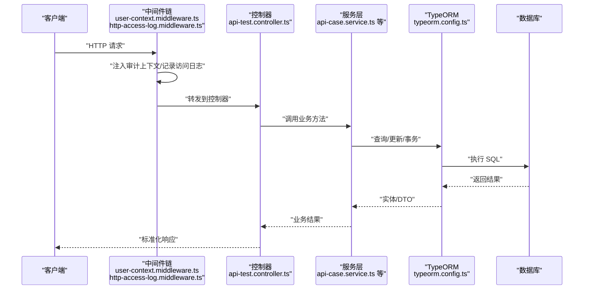
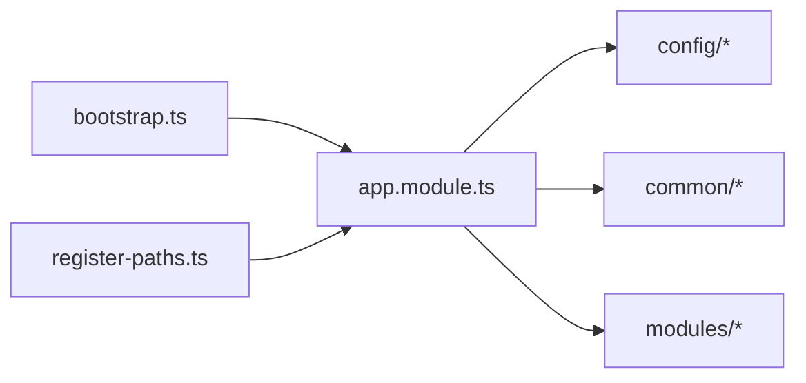
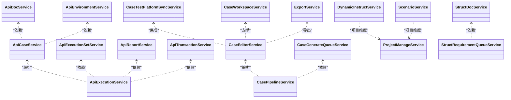
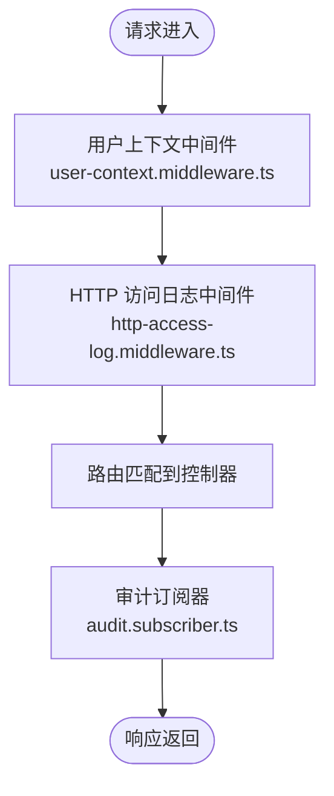
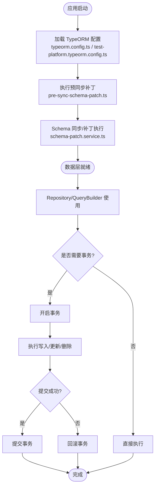
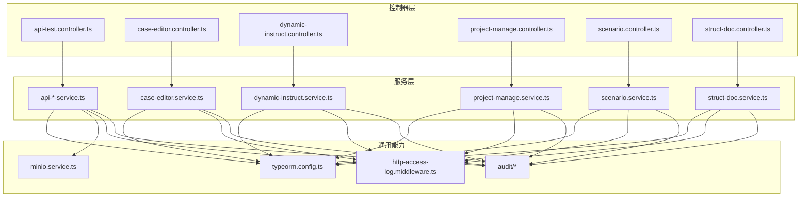

# 后端开发

<cite>
**本文引用的文件**
- [apps/api/src/app.module.ts](file://apps/api/src/app.module.ts)
- [apps/api/src/bootstrap.ts](file://apps/api/src/bootstrap.ts)
- [apps/api/src/register-paths.ts](file://apps/api/src/register-paths.ts)
- [apps/api/src/config/configuration.ts](file://apps/api/src/config/configuration.ts)
- [apps/api/src/config/load-env.ts](file://apps/api/src/config/load-env.ts)
- [apps/api/src/config/config-provider.util.ts](file://apps/api/src/config/config-provider.util.ts)
- [apps/api/src/config/app-config.types.ts](file://apps/api/src/config/app-config.types.ts)
- [apps/api/src/common/audit/user-context.middleware.ts](file://apps/api/src/common/audit/user-context.middleware.ts)
- [apps/api/src/common/audit/request-context.ts](file://apps/api/src/common/audit/request-context.ts)
- [apps/api/src/common/audit/audit.subscriber.ts](file://apps/api/src/common/audit/audit.subscriber.ts)
- [apps/api/src/common/audit/user-scope.ts](file://apps/api/src/common/audit/user-scope.ts)
- [apps/api/src/common/audit/api-route-modules.ts](file://apps/api/src/common/audit/api-route-modules.ts)
- [apps/api/src/common/http/http-access-log.middleware.ts](file://apps/api/src/common/http/http-access-log.middleware.ts)
- [apps/api/src/common/typeorm/typeorm.config.ts](file://apps/api/src/common/typeorm/typeorm.config.ts)
- [apps/api/src/common/typeorm/pre-sync-schema-patch.ts](file://apps/api/src/common/typeorm/pre-sync-schema-patch.ts)
- [apps/api/src/common/typeorm/schema-patch.service.ts](file://apps/api/src/common/typeorm/schema-patch.service.ts)
- [apps/api/src/common/typeorm/database-indexes.util.ts](file://apps/api/src/common/typeorm/database-indexes.util.ts)
- [apps/api/src/common/typeorm/api-schema-migrations.util.ts](file://apps/api/src/common/typeorm/api-schema-migrations.util.ts)
- [apps/api/src/common/typeorm/utf8mb4-schema.util.ts](file://apps/api/src/common/typeorm/utf8mb4-schema.util.ts)
- [apps/api/src/common/typeorm/test-platform.typeorm.config.ts](file://apps/api/src/common/typeorm/test-platform.typeorm.config.ts)
- [apps/api/src/common/minio/minio.config.ts](file://apps/api/src/common/minio/minio.config.ts)
- [apps/api/src/common/minio/service/minio.service.ts](file://apps/api/src/common/minio/service/minio.service.ts)
- [apps/api/src/common/project/touch-project.util.ts](file://apps/api/src/common/project/touch-project.util.ts)
- [apps/api/src/modules/api-test/entity/api-test-case.entity.ts](file://apps/api/src/modules/api-test/entity/api-test-case.entity.ts)
- [apps/api/src/modules/api-test/entity/api-endpoint.entity.ts](file://apps/api/src/modules/api-test/entity/api-endpoint.entity.ts)
- [apps/api/src/modules/api-test/entity/api-doc.entity.ts](file://apps/api/src/modules/api-test/entity/api-doc.entity.ts)
- [apps/api/src/modules/api-test/entity/api-test-environment.entity.ts](file://apps/api/src/modules/api-test/entity/api-test-environment.entity.ts)
- [apps/api/src/modules/api-test/entity/api-test-environment-service.entity.ts](file://apps/api/src/modules/api-test/entity/api-test-environment-service.entity.ts)
- [apps/api/src/modules/api-test/entity/api-test-execution-set.entity.ts](file://apps/api/src/modules/api-test/entity/api-test-execution-set.entity.ts)
- [apps/api/src/modules/api-test/entity/api-test-execution-set-case.entity.ts](file://apps/api/src/modules/api-test/entity/api-test-execution-set-case.entity.ts)
- [apps/api/src/modules/api-test/entity/api-test-run.entity.ts](file://apps/api/src/modules/api-test/entity/api-test-run.entity.ts)
- [apps/api/src/modules/api-test/entity/api-test-run-item.entity.ts](file://apps/api/src/modules/api-test/entity/api-test-run-item.entity.ts)
- [apps/api/src/modules/api-test/entity/api-transaction.entity.ts](file://apps/api/src/modules/api-test/entity/api-transaction.entity.ts)
- [apps/api/src/modules/api-test/controller/api-test.controller.ts](file://apps/api/src/modules/api-test/controller/api-test.controller.ts)
- [apps/api/src/modules/api-test/service/api-case.service.ts](file://apps/api/src/modules/api-test/service/api-case.service.ts)
- [apps/api/src/modules/api-test/service/api-doc.service.ts](file://apps/api/src/modules/api-test/service/api-doc.service.ts)
- [apps/api/src/modules/api-test/service/api-environment.service.ts](file://apps/api/src/modules/api-test/service/api-environment.service.ts)
- [apps/api/src/modules/api-test/service/api-execution.service.ts](file://apps/api/src/modules/api-test/service/api-execution.service.ts)
- [apps/api/src/modules/api-test/service/api-execution-set.service.ts](file://apps/api/src/modules/api-test/service/api-execution-set.service.ts)
- [apps/api/src/modules/api-test/service/api-report.service.ts](file://apps/api/src/modules/api-test/service/api-report.service.ts)
- [apps/api/src/modules/api-test/service/api-transaction.service.ts](file://apps/api/src/modules/api-test/service/api-transaction.service.ts)
- [apps/api/src/modules/case-editor/controller/case-editor.controller.ts](file://apps/api/src/modules/case-editor/controller/case-editor.controller.ts)
- [apps/api/src/modules/case-editor/service/case-editor.service.ts](file://apps/api/src/modules/case-editor/service/case-editor.service.ts)
- [apps/api/src/modules/case-editor/service/case-generate-queue.service.ts](file://apps/api/src/modules/case-editor/service/case-generate-queue.service.ts)
- [apps/api/src/modules/case-editor/service/case-pipeline.service.ts](file://apps/api/src/modules/case-editor/service/case-pipeline.service.ts)
- [apps/api/src/modules/case-editor/service/case-test-platform-sync.service.ts](file://apps/api/src/modules/case-editor/service/case-test-platform-sync.service.ts)
- [apps/api/src/modules/case-editor/service/case-workspace.service.ts](file://apps/api/src/modules/case-editor/service/case-workspace.service.ts)
- [apps/api/src/modules/case-editor/service/export.service.ts](file://apps/api/src/modules/case-editor/service/export.service.ts)
- [apps/api/src/modules/case-editor/entity/case-editor.entity.ts](file://apps/api/src/modules/case-editor/entity/case-editor.entity.ts)
- [apps/api/src/modules/case-editor/entity/case-generate-job.entity.ts](file://apps/api/src/modules/case-editor/entity/case-generate-job.entity.ts)
- [apps/api/src/modules/case-editor/entity/case-node-metadata.entity.ts](file://apps/api/src/modules/case-editor/entity/case-node-metadata.entity.ts)
- [apps/api/src/modules/case-editor/entity/case-tree.entity.ts](file://apps/api/src/modules/case-editor/entity/case-tree.entity.ts)
- [apps/api/src/modules/case-editor/entity/case-constraint.entity.ts](file://apps/api/src/modules/case-editor/entity/case-constraint.entity.ts)
- [apps/api/src/modules/project-manage/controller/project-manage.controller.ts](file://apps/api/src/modules/project-manage/controller/project-manage.controller.ts)
- [apps/api/src/modules/project-manage/service/project-manage.service.ts](file://apps/api/src/modules/project-manage/service/project-manage.service.ts)
- [apps/api/src/modules/project-manage/entity/project.entity.ts](file://apps/api/src/modules/project-manage/entity/project.entity.ts)
- [apps/api/src/modules/dynamic-instruct/controller/dynamic-instruct.controller.ts](file://apps/api/src/modules/dynamic-instruct/controller/dynamic-instruct.controller.ts)
- [apps/api/src/modules/dynamic-instruct/service/dynamic-instruct.service.ts](file://apps/api/src/modules/dynamic-instruct/service/dynamic-instruct.service.ts)
- [apps/api/src/modules/dynamic-instruct/entity/dynamic-instruct.ts](file://apps/api/src/modules/dynamic-instruct/entity/dynamic-instruct.ts)
- [apps/api/src/modules/dynamic-instruct/entity/test-point-instruct.entity.ts](file://apps/api/src/modules/dynamic-instruct/entity/test-point-instruct.entity.ts)
- [apps/api/src/modules/dynamic-instruct/entity/test-point-prompt.entity.ts](file://apps/api/src/modules/dynamic-instruct/entity/test-point-prompt.entity.ts)
- [apps/api/src/modules/scenario/controller/scenario.controller.ts](file://apps/api/src/modules/scenario/controller/scenario.controller.ts)
- [apps/api/src/modules/scenario/service/scenario.service.ts](file://apps/api/src/modules/scenario/service/scenario.service.ts)
- [apps/api/src/modules/scenario/entity/scenario.entity.ts](file://apps/api/src/modules/scenario/entity/scenario.entity.ts)
- [apps/api/src/modules/scenario/entity/prompt.entity.ts](file://apps/api/src/modules/scenario/entity/prompt.entity.ts)
- [apps/api/src/modules/struct-doc/controller/struct-doc.controller.ts](file://apps/api/src/modules/struct-doc/controller/struct-doc.controller.ts)
- [apps/api/src/modules/struct-doc/service/struct-doc.service.ts](file://apps/api/src/modules/struct-doc/service/struct-doc.service.ts)
- [apps/api/src/modules/struct-doc/service/struct-requirement-queue.service.ts](file://apps/api/src/modules/struct-doc/service/struct-requirement-queue.service.ts)
- [apps/api/src/modules/struct-doc/entity/struct-doc.entity.ts](file://apps/api/src/modules/struct-doc/entity/struct-doc.entity.ts)
- [apps/api/src/modules/struct-doc/entity/struct-requirement-job.entity.ts](file://apps/api/src/modules/struct-doc/entity/struct-requirement-job.entity.ts)
- [apps/api/src/modules/struct-doc/entity/test-point.entity.ts](file://apps/api/src/modules/struct-doc/entity/test-point.entity.ts)
- [apps/api/src/common/ai-workflow/service/ai-workflow.service.ts](file://apps/api/src/common/ai-workflow/service/ai-workflow.service.ts)
- [apps/api/src/common/ai-workflow/util/workflow-input.util.ts](file://apps/api/src/common/ai-workflow/util/workflow-input.util.ts)
- [apps/api/src/common/ai-workflow/ai-workflow.config.ts](file://apps/api/src/common/ai-workflow/ai-workflow.config.ts)
- [apps/api/src/common/document/document-text.util.ts](file://apps/api/src/common/document/document-text.util.ts)
- [apps/api/src/common/http/public-response.util.ts](file://apps/api/src/common/http/public-response.util.ts)
- [apps/api/src/common/project/touch-project.util.ts](file://apps/api/src/common/project/touch-project.util.ts)
- [apps/api/src/utils/file.util.ts](file://apps/api/src/utils/file.util.ts)
- [apps/api/src/common/typeorm/test-platform.typeorm.config.ts](file://apps/api/src/common/typeorm/test-platform.typeorm.config.ts)
- [apps/api/src/common/typeorm/typeorm.config.ts](file://apps/api/src/common/typeorm/typeorm.config.ts)
- [apps/api/src/common/typeorm/schema-patch.service.ts](file://apps/api/src/common/typeorm/schema-patch.service.ts)
- [apps/api/env/.env.example](file://apps/api/env/.env.example)
- [apps/api/package.json](file://apps/api/package.json)
- [apps/api/nest-cli.json](file://apps/api/nest-cli.json)
- [apps/api/tsconfig.json](file://apps/api/tsconfig.json)
- [apps/api/tsconfig.build.json](file://apps/api/tsconfig.build.json)
</cite>

## 目录
1. [引言](#引言)
2. [项目结构](#项目结构)
3. [核心组件](#核心组件)
4. [架构总览](#架构总览)
5. [详细组件分析](#详细组件分析)
6. [依赖关系分析](#依赖关系分析)
7. [性能考虑](#性能考虑)
8. [故障排查指南](#故障排查指南)
9. [结论](#结论)
10. [附录](#附录)

## 引言
本技术指南面向 CaseForge 后端开发团队与维护者，系统性梳理基于 NestJS 的服务端架构设计与实现要点。文档覆盖模块系统、依赖注入、装饰器模式应用；控制器层设计原则、服务层业务逻辑与中间件配置；TypeORM 实体映射、查询构建器与事务管理；认证授权、审计日志与异常处理；API 设计规范、错误码与响应格式标准化；以及配置管理、环境变量与部署最佳实践。目标是帮助读者快速理解并高效扩展后端能力。

## 项目结构
后端采用多包工作区（NestJS 应用）组织方式，核心入口位于 apps/api。该应用按“功能域+分层”的方式组织代码：common（通用能力）、modules（业务域模块）、config（配置）、bootstrap（启动流程）。各模块内部遵循 NestJS 推荐的分层结构：controller（控制器）、service（服务）、entity（实体）、dto（数据传输对象）、util（工具）等。

```mermaid
graph TB
subgraph "应用入口"
Bootstrap["bootstrap.ts"]
AppModule["app.module.ts"]
RegisterPaths["register-paths.ts"]
end
subgraph "配置层"
Config["configuration.ts"]
LoadEnv["load-env.ts"]
ProviderUtil["config-provider.util.ts"]
Types["app-config.types.ts"]
end
subgraph "通用能力(common)"
Audit["audit/*"]
HttpLog["http-access-log.middleware.ts"]
MinIO["minio/*"]
TypeORM["typeorm/*"]
AIWorkflow["ai-workflow/*"]
ProjectTouch["project/touch-project.util.ts"]
DocText["document/document-text.util.ts"]
PublicResp["http/public-response.util.ts"]
end
subgraph "业务模块(modules)"
ApiTest["api-test/*"]
CaseEditor["case-editor/*"]
DynamicInstruct["dynamic-instruct/*"]
ProjectManage["project-manage/*"]
Scenario["scenario/*"]
StructDoc["struct-doc/*"]
end
Bootstrap --> AppModule
AppModule --> Config
AppModule --> Audit
AppModule --> MinIO
AppModule --> TypeORM
AppModule --> ApiTest
AppModule --> CaseEditor
AppModule --> DynamicInstruct
AppModule --> ProjectManage
AppModule --> Scenario
AppModule --> StructDoc
```

图表来源
- [apps/api/src/bootstrap.ts:1-200](file://apps/api/src/bootstrap.ts#L1-L200)
- [apps/api/src/app.module.ts:1-200](file://apps/api/src/app.module.ts#L1-L200)
- [apps/api/src/register-paths.ts:1-200](file://apps/api/src/register-paths.ts#L1-L200)
- [apps/api/src/config/configuration.ts:1-200](file://apps/api/src/config/configuration.ts#L1-L200)
- [apps/api/src/common/audit/user-context.middleware.ts:1-200](file://apps/api/src/common/audit/user-context.middleware.ts#L1-L200)
- [apps/api/src/common/http/http-access-log.middleware.ts:1-200](file://apps/api/src/common/http/http-access-log.middleware.ts#L1-L200)
- [apps/api/src/common/minio/service/minio.service.ts:1-200](file://apps/api/src/common/minio/service/minio.service.ts#L1-L200)
- [apps/api/src/common/typeorm/typeorm.config.ts:1-200](file://apps/api/src/common/typeorm/typeorm.config.ts#L1-L200)
- [apps/api/src/modules/api-test/controller/api-test.controller.ts:1-200](file://apps/api/src/modules/api-test/controller/api-test.controller.ts#L1-L200)
- [apps/api/src/modules/case-editor/controller/case-editor.controller.ts:1-200](file://apps/api/src/modules/case-editor/controller/case-editor.controller.ts#L1-L200)

章节来源
- [apps/api/src/bootstrap.ts:1-200](file://apps/api/src/bootstrap.ts#L1-L200)
- [apps/api/src/app.module.ts:1-200](file://apps/api/src/app.module.ts#L1-L200)
- [apps/api/src/register-paths.ts:1-200](file://apps/api/src/register-paths.ts#L1-L200)

## 核心组件
- 模块系统与依赖注入：通过 app.module.ts 组织全局模块、配置模块、中间件注册与子模块导入，体现清晰的依赖注入与模块边界。
- 控制器层：各模块控制器负责请求路由、参数校验与响应封装，统一通过公共响应工具进行输出标准化。
- 服务层：承载业务逻辑，协调实体、仓储与外部服务（如 MinIO），并处理事务与并发控制。
- 中间件：审计上下文注入、HTTP 访问日志记录、用户作用域解析等，贯穿请求生命周期。
- TypeORM：集中式配置与迁移补丁服务，支持主库与测试平台双库配置，提供预同步补丁与索引管理。
- 配置管理：环境变量加载、类型化配置、配置提供器与运行时校验，确保安全与一致性。

章节来源
- [apps/api/src/app.module.ts:1-200](file://apps/api/src/app.module.ts#L1-L200)
- [apps/api/src/common/http/public-response.util.ts:1-200](file://apps/api/src/common/http/public-response.util.ts#L1-L200)
- [apps/api/src/common/typeorm/typeorm.config.ts:1-200](file://apps/api/src/common/typeorm/typeorm.config.ts#L1-L200)
- [apps/api/src/common/typeorm/schema-patch.service.ts:1-200](file://apps/api/src/common/typeorm/schema-patch.service.ts#L1-L200)

## 架构总览
下图展示从请求进入至数据库持久化的整体流程，涵盖中间件、控制器、服务与数据访问层的交互。

图表来源
- [apps/api/src/common/audit/user-context.middleware.ts:1-200](file://apps/api/src/common/audit/user-context.middleware.ts#L1-L200)
- [apps/api/src/common/http/http-access-log.middleware.ts:1-200](file://apps/api/src/common/http/http-access-log.middleware.ts#L1-L200)
- [apps/api/src/modules/api-test/controller/api-test.controller.ts:1-200](file://apps/api/src/modules/api-test/controller/api-test.controller.ts#L1-L200)
- [apps/api/src/modules/api-test/service/api-case.service.ts:1-200](file://apps/api/src/modules/api-test/service/api-case.service.ts#L1-L200)
- [apps/api/src/common/typeorm/typeorm.config.ts:1-200](file://apps/api/src/common/typeorm/typeorm.config.ts#L1-L200)

## 详细组件分析

### 模块系统与依赖注入
- 入口引导：bootstrap.ts 负责创建 Nest 应用实例、加载环境、注册全局拦截器/过滤器/守卫，并启动监听。
- 应用模块：app.module.ts 导入配置模块、中间件注册、业务模块与通用模块，形成清晰的模块边界与依赖方向。
- 路径注册：register-paths.ts 提供统一的别名路径映射，便于跨模块引用与 IDE 支持。

图表来源
- [apps/api/src/bootstrap.ts:1-200](file://apps/api/src/bootstrap.ts#L1-L200)
- [apps/api/src/app.module.ts:1-200](file://apps/api/src/app.module.ts#L1-L200)
- [apps/api/src/register-paths.ts:1-200](file://apps/api/src/register-paths.ts#L1-L200)

章节来源
- [apps/api/src/bootstrap.ts:1-200](file://apps/api/src/bootstrap.ts#L1-L200)
- [apps/api/src/app.module.ts:1-200](file://apps/api/src/app.module.ts#L1-L200)
- [apps/api/src/register-paths.ts:1-200](file://apps/api/src/register-paths.ts#L1-L200)

### 控制器层设计原则
- 单一职责：每个控制器聚焦于一个资源域（如 API 测试、用例编辑、动态指令等），避免过度聚合。
- 参数校验：结合 DTO 与装饰器进行输入校验，减少服务层重复校验。
- 响应标准化：统一通过公共响应工具输出，保证状态码、消息与数据结构一致。
- 审计可见性：通过中间件在控制器前注入用户与请求上下文，便于审计与日志追踪。

章节来源
- [apps/api/src/modules/api-test/controller/api-test.controller.ts:1-200](file://apps/api/src/modules/api-test/controller/api-test.controller.ts#L1-L200)
- [apps/api/src/modules/case-editor/controller/case-editor.controller.ts:1-200](file://apps/api/src/modules/case-editor/controller/case-editor.controller.ts#L1-L200)
- [apps/api/src/common/http/public-response.util.ts:1-200](file://apps/api/src/common/http/public-response.util.ts#L1-L200)

### 服务层业务逻辑实现
- API 测试域：api-case.service、api-doc.service、api-environment.service、api-execution.service、api-execution-set.service、api-report.service、api-transaction.service 分别承担用例、文档、环境、执行、报告与事务的业务编排。
- 用例编辑域：case-editor.service、case-generate-queue.service、case-pipeline.service、case-test-platform-sync.service、case-workspace.service、export.service 覆盖树形用例生成、队列调度、流水线、同步与导出。
- 动态指令域：dynamic-instruct.service 管理测试点指令与提示词。
- 项目管理域：project-manage.service 处理项目 CRUD。
- 场景域：scenario.service 管理场景与提示词。
- 结构化文档域：struct-doc.service 与 struct-requirement-queue.service 管理结构化文档与需求处理队列。

图表来源
- [apps/api/src/modules/api-test/service/api-case.service.ts:1-200](file://apps/api/src/modules/api-test/service/api-case.service.ts#L1-L200)
- [apps/api/src/modules/api-test/service/api-doc.service.ts:1-200](file://apps/api/src/modules/api-test/service/api-doc.service.ts#L1-L200)
- [apps/api/src/modules/api-test/service/api-environment.service.ts:1-200](file://apps/api/src/modules/api-test/service/api-environment.service.ts#L1-L200)
- [apps/api/src/modules/api-test/service/api-execution.service.ts:1-200](file://apps/api/src/modules/api-test/service/api-execution.service.ts#L1-L200)
- [apps/api/src/modules/api-test/service/api-execution-set.service.ts:1-200](file://apps/api/src/modules/api-test/service/api-execution-set.service.ts#L1-L200)
- [apps/api/src/modules/api-test/service/api-report.service.ts:1-200](file://apps/api/src/modules/api-test/service/api-report.service.ts#L1-L200)
- [apps/api/src/modules/api-test/service/api-transaction.service.ts:1-200](file://apps/api/src/modules/api-test/service/api-transaction.service.ts#L1-L200)
- [apps/api/src/modules/case-editor/service/case-editor.service.ts:1-200](file://apps/api/src/modules/case-editor/service/case-editor.service.ts#L1-L200)
- [apps/api/src/modules/case-editor/service/case-generate-queue.service.ts:1-200](file://apps/api/src/modules/case-editor/service/case-generate-queue.service.ts#L1-L200)
- [apps/api/src/modules/case-editor/service/case-pipeline.service.ts:1-200](file://apps/api/src/modules/case-editor/service/case-pipeline.service.ts#L1-L200)
- [apps/api/src/modules/case-editor/service/case-test-platform-sync.service.ts:1-200](file://apps/api/src/modules/case-editor/service/case-test-platform-sync.service.ts#L1-L200)
- [apps/api/src/modules/case-editor/service/case-workspace.service.ts:1-200](file://apps/api/src/modules/case-editor/service/case-workspace.service.ts#L1-L200)
- [apps/api/src/modules/case-editor/service/export.service.ts:1-200](file://apps/api/src/modules/case-editor/service/export.service.ts#L1-L200)
- [apps/api/src/modules/dynamic-instruct/service/dynamic-instruct.service.ts:1-200](file://apps/api/src/modules/dynamic-instruct/service/dynamic-instruct.service.ts#L1-L200)
- [apps/api/src/modules/project-manage/service/project-manage.service.ts:1-200](file://apps/api/src/modules/project-manage/service/project-manage.service.ts#L1-L200)
- [apps/api/src/modules/scenario/service/scenario.service.ts:1-200](file://apps/api/src/modules/scenario/service/scenario.service.ts#L1-L200)
- [apps/api/src/modules/struct-doc/service/struct-doc.service.ts:1-200](file://apps/api/src/modules/struct-doc/service/struct-doc.service.ts#L1-L200)
- [apps/api/src/modules/struct-doc/service/struct-requirement-queue.service.ts:1-200](file://apps/api/src/modules/struct-doc/service/struct-requirement-queue.service.ts#L1-L200)

章节来源
- [apps/api/src/modules/api-test/service/api-case.service.ts:1-200](file://apps/api/src/modules/api-test/service/api-case.service.ts#L1-L200)
- [apps/api/src/modules/case-editor/service/case-editor.service.ts:1-200](file://apps/api/src/modules/case-editor/service/case-editor.service.ts#L1-L200)
- [apps/api/src/modules/dynamic-instruct/service/dynamic-instruct.service.ts:1-200](file://apps/api/src/modules/dynamic-instruct/service/dynamic-instruct.service.ts#L1-L200)
- [apps/api/src/modules/project-manage/service/project-manage.service.ts:1-200](file://apps/api/src/modules/project-manage/service/project-manage.service.ts#L1-L200)
- [apps/api/src/modules/scenario/service/scenario.service.ts:1-200](file://apps/api/src/modules/scenario/service/scenario.service.ts#L1-L200)
- [apps/api/src/modules/struct-doc/service/struct-doc.service.ts:1-200](file://apps/api/src/modules/struct-doc/service/struct-doc.service.ts#L1-L200)

### 中间件配置与使用
- 用户上下文中间件：在请求进入时解析用户信息并注入到请求上下文中，供后续服务与审计使用。
- HTTP 访问日志中间件：统一记录请求路径、方法、耗时与状态码，便于监控与排障。
- 审计订阅器：基于 TypeORM 生命周期事件捕获实体变更，生成审计日志。

图表来源
- [apps/api/src/common/audit/user-context.middleware.ts:1-200](file://apps/api/src/common/audit/user-context.middleware.ts#L1-L200)
- [apps/api/src/common/http/http-access-log.middleware.ts:1-200](file://apps/api/src/common/http/http-access-log.middleware.ts#L1-L200)
- [apps/api/src/common/audit/audit.subscriber.ts:1-200](file://apps/api/src/common/audit/audit.subscriber.ts#L1-L200)

章节来源
- [apps/api/src/common/audit/user-context.middleware.ts:1-200](file://apps/api/src/common/audit/user-context.middleware.ts#L1-L200)
- [apps/api/src/common/http/http-access-log.middleware.ts:1-200](file://apps/api/src/common/http/http-access-log.middleware.ts#L1-L200)
- [apps/api/src/common/audit/audit.subscriber.ts:1-200](file://apps/api/src/common/audit/audit.subscriber.ts#L1-L200)

### TypeORM 实体映射、查询构建器与事务管理
- 集中式配置：typeorm.config.ts 提供连接池、同步策略、日志与时间精度设置；test-platform.typeorm.config.ts 提供独立的数据源配置。
- 实体映射：各模块实体（如 API 测试、用例编辑、项目管理、动态指令、场景、结构化文档）均通过装饰器声明映射关系与索引。
- 查询构建器：通过 Repository/QueryBuilder 进行复杂查询与联表操作，配合 DTO 返回标准化数据。
- 事务管理：在服务层对需要一致性的操作使用事务包裹，确保写入原子性。
- 迁移与补丁：schema-patch.service.ts 与 pre-sync-schema-patch.ts 在启动阶段自动执行补丁，保证数据库结构演进可控。
- 索引与字符集：database-indexes.util.ts 与 utf8mb4-schema.util.ts 确保查询性能与字符集兼容。

图表来源
- [apps/api/src/common/typeorm/typeorm.config.ts:1-200](file://apps/api/src/common/typeorm/typeorm.config.ts#L1-L200)
- [apps/api/src/common/typeorm/test-platform.typeorm.config.ts:1-200](file://apps/api/src/common/typeorm/test-platform.typeorm.config.ts#L1-L200)
- [apps/api/src/common/typeorm/pre-sync-schema-patch.ts:1-200](file://apps/api/src/common/typeorm/pre-sync-schema-patch.ts#L1-L200)
- [apps/api/src/common/typeorm/schema-patch.service.ts:1-200](file://apps/api/src/common/typeorm/schema-patch.service.ts#L1-L200)

章节来源
- [apps/api/src/common/typeorm/typeorm.config.ts:1-200](file://apps/api/src/common/typeorm/typeorm.config.ts#L1-L200)
- [apps/api/src/common/typeorm/test-platform.typeorm.config.ts:1-200](file://apps/api/src/common/typeorm/test-platform.typeorm.config.ts#L1-L200)
- [apps/api/src/common/typeorm/schema-patch.service.ts:1-200](file://apps/api/src/common/typeorm/schema-patch.service.ts#L1-L200)
- [apps/api/src/common/typeorm/pre-sync-schema-patch.ts:1-200](file://apps/api/src/common/typeorm/pre-sync-schema-patch.ts#L1-L200)

### 认证授权、审计日志与异常处理
- 认证授权：通过用户上下文中间件解析用户身份，并结合用户作用域（user-scope.ts）限制可访问资源范围。
- 审计日志：request-context.ts 统一请求上下文；audit.subscriber.ts 捕获实体变更事件；api-route-modules.ts 标注受审计保护的路由模块。
- 异常处理：建议在全局过滤器中统一捕获业务异常与系统异常，输出标准化错误响应（见“API 设计规范”）。

章节来源
- [apps/api/src/common/audit/user-context.middleware.ts:1-200](file://apps/api/src/common/audit/user-context.middleware.ts#L1-L200)
- [apps/api/src/common/audit/request-context.ts:1-200](file://apps/api/src/common/audit/request-context.ts#L1-L200)
- [apps/api/src/common/audit/audit.subscriber.ts:1-200](file://apps/api/src/common/audit/audit.subscriber.ts#L1-L200)
- [apps/api/src/common/audit/user-scope.ts:1-200](file://apps/api/src/common/audit/user-scope.ts#L1-L200)
- [apps/api/src/common/audit/api-route-modules.ts:1-200](file://apps/api/src/common/audit/api-route-modules.ts#L1-L200)

### API 设计规范、错误码与响应格式
- 统一响应：public-response.util.ts 提供统一的响应结构，包含状态码、消息与数据字段，便于前端解析与 UI 展示。
- 错误码：建议定义业务错误码枚举或常量集合，区分系统错误与业务错误，便于日志检索与告警。
- 响应格式：所有控制器返回值通过统一工具包装，确保一致性与可预期性。

章节来源
- [apps/api/src/common/http/public-response.util.ts:1-200](file://apps/api/src/common/http/public-response.util.ts#L1-L200)

### 配置管理、环境变量与部署最佳实践
- 环境变量：load-env.ts 加载 .env 文件，configuration.ts 定义默认值与校验规则，config-provider.util.ts 提供配置提供器。
- 类型化配置：app-config.types.ts 定义配置接口，确保编译期检查与 IDE 自动补全。
- 部署建议：生产环境启用只读数据库连接、最小权限账号、HTTPS、访问日志与健康检查端点；敏感配置通过密钥管理服务注入。

章节来源
- [apps/api/src/config/load-env.ts:1-200](file://apps/api/src/config/load-env.ts#L1-L200)
- [apps/api/src/config/configuration.ts:1-200](file://apps/api/src/config/configuration.ts#L1-L200)
- [apps/api/src/config/config-provider.util.ts:1-200](file://apps/api/src/config/config-provider.util.ts#L1-L200)
- [apps/api/src/config/app-config.types.ts:1-200](file://apps/api/src/config/app-config.types.ts#L1-L200)
- [apps/api/env/.env.example:1-200](file://apps/api/env/.env.example#L1-L200)

## 依赖关系分析
- 模块内聚：各业务模块控制器仅依赖对应服务，服务层再依赖实体与工具，形成清晰的单向依赖。
- 通用能力解耦：common 下的审计、HTTP 日志、MinIO、TypeORM、AI 工作流等能力以服务形式被模块复用。
- 外部集成：MinIO 服务用于对象存储，TypeORM 双数据源分别服务于主业务与测试平台。

图表来源
- [apps/api/src/modules/api-test/controller/api-test.controller.ts:1-200](file://apps/api/src/modules/api-test/controller/api-test.controller.ts#L1-L200)
- [apps/api/src/modules/case-editor/controller/case-editor.controller.ts:1-200](file://apps/api/src/modules/case-editor/controller/case-editor.controller.ts#L1-L200)
- [apps/api/src/modules/dynamic-instruct/controller/dynamic-instruct.controller.ts:1-200](file://apps/api/src/modules/dynamic-instruct/controller/dynamic-instruct.controller.ts#L1-L200)
- [apps/api/src/modules/project-manage/controller/project-manage.controller.ts:1-200](file://apps/api/src/modules/project-manage/controller/project-manage.controller.ts#L1-L200)
- [apps/api/src/modules/scenario/controller/scenario.controller.ts:1-200](file://apps/api/src/modules/scenario/controller/scenario.controller.ts#L1-L200)
- [apps/api/src/modules/struct-doc/controller/struct-doc.controller.ts:1-200](file://apps/api/src/modules/struct-doc/controller/struct-doc.controller.ts#L1-L200)
- [apps/api/src/common/audit/user-context.middleware.ts:1-200](file://apps/api/src/common/audit/user-context.middleware.ts#L1-L200)
- [apps/api/src/common/http/http-access-log.middleware.ts:1-200](file://apps/api/src/common/http/http-access-log.middleware.ts#L1-L200)
- [apps/api/src/common/minio/service/minio.service.ts:1-200](file://apps/api/src/common/minio/service/minio.service.ts#L1-L200)
- [apps/api/src/common/typeorm/typeorm.config.ts:1-200](file://apps/api/src/common/typeorm/typeorm.config.ts#L1-L200)

章节来源
- [apps/api/src/modules/api-test/controller/api-test.controller.ts:1-200](file://apps/api/src/modules/api-test/controller/api-test.controller.ts#L1-L200)
- [apps/api/src/modules/case-editor/controller/case-editor.controller.ts:1-200](file://apps/api/src/modules/case-editor/controller/case-editor.controller.ts#L1-L200)
- [apps/api/src/modules/dynamic-instruct/controller/dynamic-instruct.controller.ts:1-200](file://apps/api/src/modules/dynamic-instruct/controller/dynamic-instruct.controller.ts#L1-L200)
- [apps/api/src/modules/project-manage/controller/project-manage.controller.ts:1-200](file://apps/api/src/modules/project-manage/controller/project-manage.controller.ts#L1-L200)
- [apps/api/src/modules/scenario/controller/scenario.controller.ts:1-200](file://apps/api/src/modules/scenario/controller/scenario.controller.ts#L1-L200)
- [apps/api/src/modules/struct-doc/controller/struct-doc.controller.ts:1-200](file://apps/api/src/modules/struct-doc/controller/struct-doc.controller.ts#L1-L200)

## 性能考虑
- 数据库层面：合理使用索引（database-indexes.util.ts）、批量写入与分页查询；避免 N+1 查询；利用查询构建器进行联表优化。
- 缓存与队列：对高频读取数据引入缓存；长耗时任务放入队列（如生成用例、结构化文档处理）。
- 并发控制：服务层对关键写入使用事务与锁；队列服务控制并发度，避免资源争用。
- 日志与监控：开启访问日志与审计日志，结合指标采集定位性能瓶颈。

## 故障排查指南
- 启动失败：检查环境变量加载顺序与配置提供器；确认数据库连接字符串与凭据正确。
- 数据库不一致：执行 schema 补丁与预同步补丁；核对索引与字符集工具输出。
- 审计缺失：确认审计订阅器已注册且实体变更事件触发正常。
- 响应异常：检查控制器是否通过统一响应工具返回；核对错误码与消息格式。

章节来源
- [apps/api/src/config/load-env.ts:1-200](file://apps/api/src/config/load-env.ts#L1-L200)
- [apps/api/src/common/typeorm/schema-patch.service.ts:1-200](file://apps/api/src/common/typeorm/schema-patch.service.ts#L1-L200)
- [apps/api/src/common/audit/audit.subscriber.ts:1-200](file://apps/api/src/common/audit/audit.subscriber.ts#L1-L200)
- [apps/api/src/common/http/public-response.util.ts:1-200](file://apps/api/src/common/http/public-response.util.ts#L1-L200)

## 结论
本指南从模块系统、控制器与服务层、中间件、TypeORM、配置与部署等方面全面梳理了 CaseForge 后端架构。建议在后续迭代中持续完善全局异常处理、统一错误码体系与监控告警，以进一步提升系统的稳定性与可观测性。

## 附录
- 关键文件清单与用途概览
  - 应用入口与引导：bootstrap.ts、app.module.ts、register-paths.ts
  - 配置：configuration.ts、load-env.ts、config-provider.util.ts、app-config.types.ts
  - 通用能力：audit/*、http-access-log.middleware.ts、minio.service.ts、typeorm.config.ts、ai-workflow/*、document/document-text.util.ts、http/public-response.util.ts
  - 业务模块：api-test/*、case-editor/*、dynamic-instruct/*、project-manage/*、scenario/*、struct-doc/*
  - 环境变量示例：apps/api/env/.env.example