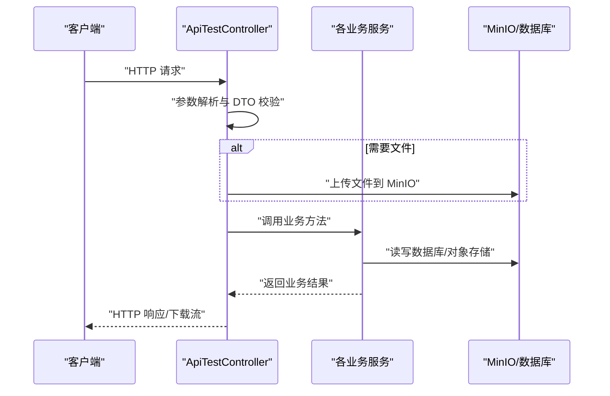
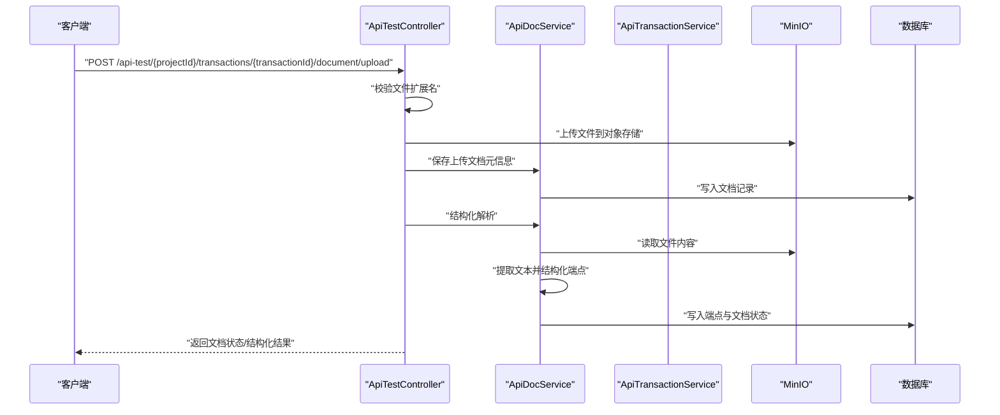
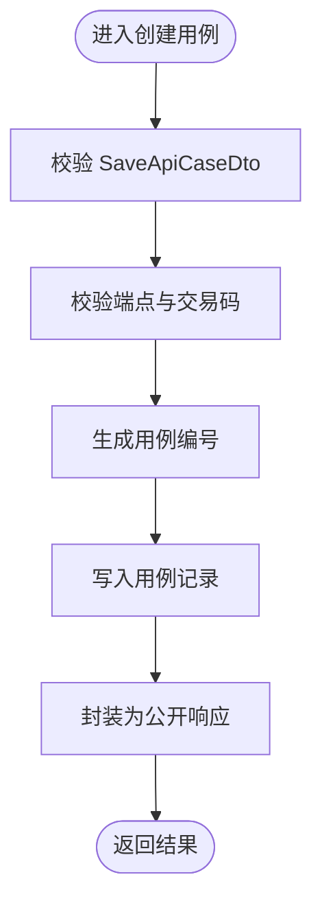
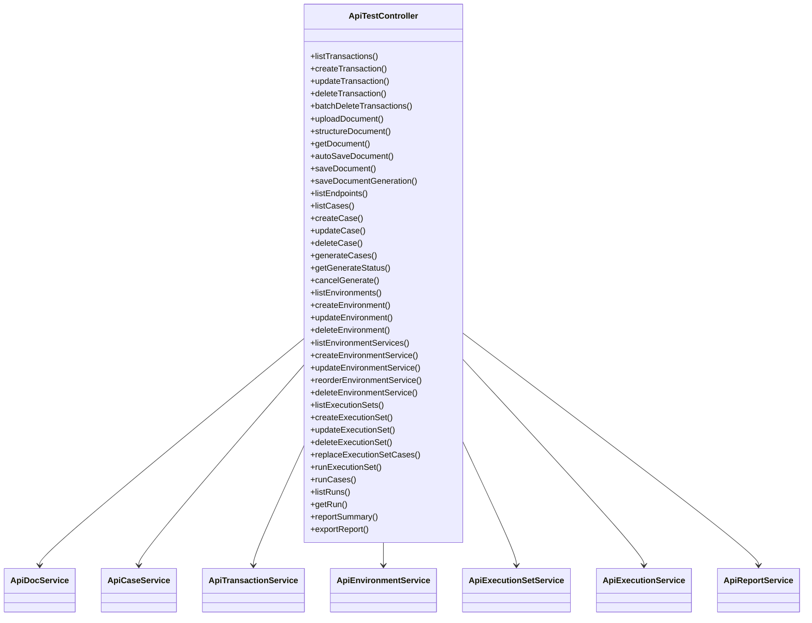

# API 测试控制器

<cite>
**本文引用的文件**
- [apps/api/src/modules/api-test/controller/api-test.controller.ts](file://apps/api/src/modules/api-test/controller/api-test.controller.ts)
- [apps/api/src/modules/api-test/dto/save-transaction.dto.ts](file://apps/api/src/modules/api-test/dto/save-transaction.dto.ts)
- [apps/api/src/modules/api-test/dto/save-api-case.dto.ts](file://apps/api/src/modules/api-test/dto/save-api-case.dto.ts)
- [apps/api/src/modules/api-test/dto/save-environment.dto.ts](file://apps/api/src/modules/api-test/dto/save-environment.dto.ts)
- [apps/api/src/modules/api-test/dto/execution-platform.dto.ts](file://apps/api/src/modules/api-test/dto/execution-platform.dto.ts)
- [apps/api/src/modules/api-test/dto/save-api-doc.dto.ts](file://apps/api/src/modules/api-test/dto/save-api-doc.dto.ts)
- [apps/api/src/modules/api-test/dto/batch-delete-transactions.dto.ts](file://apps/api/src/modules/api-test/dto/batch-delete-transactions.dto.ts)
- [apps/api/src/modules/api-test/dto/list-api-cases.dto.ts](file://apps/api/src/modules/api-test/dto/list-api-cases.dto.ts)
- [apps/api/src/modules/api-test/dto/list-api-execution-sets.dto.ts](file://apps/api/src/modules/api-test/dto/list-api-execution-sets.dto.ts)
- [apps/api/src/modules/api-test/dto/save-api-doc-generation.dto.ts](file://apps/api/src/modules/api-test/dto/save-api-doc-generation.dto.ts)
- [apps/api/src/modules/api-test/service/api-transaction.service.ts](file://apps/api/src/modules/api-test/service/api-transaction.service.ts)
- [apps/api/src/modules/api-test/service/api-case.service.ts](file://apps/api/src/modules/api-test/service/api-case.service.ts)
- [apps/api/src/modules/api-test/service/api-doc.service.ts](file://apps/api/src/modules/api-test/service/api-doc.service.ts)
</cite>

## 目录
1. [简介](#简介)
2. [项目结构](#项目结构)
3. [核心组件](#核心组件)
4. [架构总览](#架构总览)
5. [详细组件分析](#详细组件分析)
6. [依赖关系分析](#依赖关系分析)
7. [性能考量](#性能考量)
8. [故障排查指南](#故障排查指南)
9. [结论](#结论)
10. [附录](#附录)

## 简介
本文件面向 API 测试控制器的开发者与使用者，系统性梳理“API 测试”模块的控制器实现与配套 DTO、服务层职责，覆盖以下能力：
- 测试用例管理：创建、更新、删除、列表、生成与运行
- 接口文档导入与结构化：Excel 上传、解析、自动保存与结构化保存
- 环境配置管理：环境与环境服务的增删改查、排序与关联
- 执行集与执行：执行集的维护、替换用例、并发运行；单批用例运行
- 报告导出：按多种格式导出测试报告
- 事务操作：交易码的增删改查与批量删除
- 参数校验与响应处理：基于 DTO 的强类型输入校验与统一响应封装

## 项目结构
API 测试控制器位于 NestJS 模块内，采用“按功能域分层”的组织方式：
- 控制器层：集中暴露 REST API，负责路由映射、参数提取、调用服务层并返回结果
- DTO 层：定义请求体与查询参数的结构与校验规则
- 服务层：封装业务逻辑，协调实体与外部存储（MinIO、数据库）
- 实体层：对应数据库表结构，承载业务数据模型

```mermaid
graph TB
subgraph "控制器层"
C1["ApiTestController<br/>api-test.controller.ts"]
end
subgraph "DTO 层"
D1["save-transaction.dto.ts"]
D2["save-api-case.dto.ts"]
D3["save-environment.dto.ts"]
D4["execution-platform.dto.ts"]
D5["save-api-doc.dto.ts"]
D6["batch-delete-transactions.dto.ts"]
D7["list-api-cases.dto.ts"]
D8["list-api-execution-sets.dto.ts"]
D9["save-api-doc-generation.dto.ts"]
end
subgraph "服务层"
S1["ApiTransactionService"]
S2["ApiCaseService"]
S3["ApiDocService"]
S4["ApiEnvironmentService"]
S5["ApiExecutionSetService"]
S6["ApiExecutionService"]
S7["ApiReportService"]
S8["ApiTransactionService"]
end
C1 --> S1
C1 --> S2
C1 --> S3
C1 --> S4
C1 --> S5
C1 --> S6
C1 --> S7
C1 --> S8
C1 --> D1
C1 --> D2
C1 --> D3
C1 --> D4
C1 --> D5
C1 --> D6
C1 --> D7
C1 --> D8
C1 --> D9
```

图表来源
- [apps/api/src/modules/api-test/controller/api-test.controller.ts:58-564](file://apps/api/src/modules/api-test/controller/api-test.controller.ts#L58-L564)
- [apps/api/src/modules/api-test/dto/save-transaction.dto.ts:1-19](file://apps/api/src/modules/api-test/dto/save-transaction.dto.ts#L1-L19)
- [apps/api/src/modules/api-test/dto/save-api-case.dto.ts:1-136](file://apps/api/src/modules/api-test/dto/save-api-case.dto.ts#L1-L136)
- [apps/api/src/modules/api-test/dto/save-environment.dto.ts:1-50](file://apps/api/src/modules/api-test/dto/save-environment.dto.ts#L1-L50)
- [apps/api/src/modules/api-test/dto/execution-platform.dto.ts:1-148](file://apps/api/src/modules/api-test/dto/execution-platform.dto.ts#L1-L148)
- [apps/api/src/modules/api-test/dto/save-api-doc.dto.ts:1-22](file://apps/api/src/modules/api-test/dto/save-api-doc.dto.ts#L1-L22)
- [apps/api/src/modules/api-test/dto/batch-delete-transactions.dto.ts:1-11](file://apps/api/src/modules/api-test/dto/batch-delete-transactions.dto.ts#L1-L11)
- [apps/api/src/modules/api-test/dto/list-api-cases.dto.ts:1-21](file://apps/api/src/modules/api-test/dto/list-api-cases.dto.ts#L1-L21)
- [apps/api/src/modules/api-test/dto/list-api-execution-sets.dto.ts:1-21](file://apps/api/src/modules/api-test/dto/list-api-execution-sets.dto.ts#L1-L21)
- [apps/api/src/modules/api-test/dto/save-api-doc-generation.dto.ts:1-10](file://apps/api/src/modules/api-test/dto/save-api-doc-generation.dto.ts#L1-L10)

章节来源
- [apps/api/src/modules/api-test/controller/api-test.controller.ts:58-564](file://apps/api/src/modules/api-test/controller/api-test.controller.ts#L58-L564)

## 核心组件
- 控制器：ApiTestController，统一暴露“api-test”标签下的 REST 接口，涵盖交易码、文档、用例、环境、执行集、执行与报告等全链路能力
- DTO：对输入进行强类型约束与校验，确保接口契约清晰、安全
- 服务层：封装业务流程，协调数据库与对象存储，保证幂等与一致性
- 响应封装：通过公共工具函数将内部实体转换为对外公开的响应结构

章节来源
- [apps/api/src/modules/api-test/controller/api-test.controller.ts:58-564](file://apps/api/src/modules/api-test/controller/api-test.controller.ts#L58-L564)
- [apps/api/src/modules/api-test/service/api-transaction.service.ts:21-161](file://apps/api/src/modules/api-test/service/api-transaction.service.ts#L21-L161)
- [apps/api/src/modules/api-test/service/api-case.service.ts:38-200](file://apps/api/src/modules/api-test/service/api-case.service.ts#L38-L200)
- [apps/api/src/modules/api-test/service/api-doc.service.ts:32-200](file://apps/api/src/modules/api-test/service/api-doc.service.ts#L32-L200)

## 架构总览
控制器作为入口，接收 HTTP 请求后：
- 解析路径参数与查询参数（@Param/@Query）
- 解析请求体（@Body），结合 DTO 完成参数校验
- 对于文件上传场景，使用 @UseInterceptors(FileInterceptor) 处理 multipart/form-data
- 调用对应服务层方法执行业务逻辑
- 返回标准化响应或触发下载流式响应

图表来源
- [apps/api/src/modules/api-test/controller/api-test.controller.ts:135-166](file://apps/api/src/modules/api-test/controller/api-test.controller.ts#L135-L166)
- [apps/api/src/modules/api-test/service/api-doc.service.ts:59-80](file://apps/api/src/modules/api-test/service/api-doc.service.ts#L59-L80)

## 详细组件分析

### 交易码管理（Transactions）
- 列表、新增、更新、删除、批量删除
- 上传状态查询、Excel 文档上传、结构化解析、文档读取与保存、自动生成与保存生成提示、端点列表
- 关键流程：上传文件校验扩展名、转存 MinIO、持久化文档元信息、触发结构化解析、更新项目时间戳

图表来源
- [apps/api/src/modules/api-test/controller/api-test.controller.ts:135-189](file://apps/api/src/modules/api-test/controller/api-test.controller.ts#L135-L189)
- [apps/api/src/modules/api-test/service/api-doc.service.ts:59-129](file://apps/api/src/modules/api-test/service/api-doc.service.ts#L59-L129)

章节来源
- [apps/api/src/modules/api-test/controller/api-test.controller.ts:74-189](file://apps/api/src/modules/api-test/controller/api-test.controller.ts#L74-L189)
- [apps/api/src/modules/api-test/service/api-transaction.service.ts:32-161](file://apps/api/src/modules/api-test/service/api-transaction.service.ts#L32-L161)
- [apps/api/src/modules/api-test/service/api-doc.service.ts:48-200](file://apps/api/src/modules/api-test/service/api-doc.service.ts#L48-L200)

### 测试用例管理（Cases）
- 列表、创建、更新、删除、生成用例、查询生成状态、取消生成
- 关键流程：校验请求体、解析端点与交易码、生成用例编号、写入数据库、返回公开结构

图表来源
- [apps/api/src/modules/api-test/service/api-case.service.ts:91-141](file://apps/api/src/modules/api-test/service/api-case.service.ts#L91-L141)

章节来源
- [apps/api/src/modules/api-test/controller/api-test.controller.ts:246-316](file://apps/api/src/modules/api-test/controller/api-test.controller.ts#L246-L316)
- [apps/api/src/modules/api-test/service/api-case.service.ts:60-194](file://apps/api/src/modules/api-test/service/api-case.service.ts#L60-L194)
- [apps/api/src/modules/api-test/dto/save-api-case.dto.ts:19-92](file://apps/api/src/modules/api-test/dto/save-api-case.dto.ts#L19-L92)

### 环境配置管理（Environments）
- 环境与环境服务的 CRUD、排序、关联查询
- 关键流程：根据作用域与可见性过滤、支持默认环境标记、服务端地址与传输协议配置

章节来源
- [apps/api/src/modules/api-test/controller/api-test.controller.ts:318-420](file://apps/api/src/modules/api-test/controller/api-test.controller.ts#L318-L420)
- [apps/api/src/modules/api-test/dto/save-environment.dto.ts:10-49](file://apps/api/src/modules/api-test/dto/save-environment.dto.ts#L10-L49)
- [apps/api/src/modules/api-test/dto/execution-platform.dto.ts:12-98](file://apps/api/src/modules/api-test/dto/execution-platform.dto.ts#L12-L98)

### 执行集与执行（Execution Sets & Runs）
- 执行集的增删改查、替换用例、运行执行集
- 单批用例运行、运行列表与详情查询
- 关键流程：并发度控制、编码格式传递、环境与服务选择

章节来源
- [apps/api/src/modules/api-test/controller/api-test.controller.ts:422-532](file://apps/api/src/modules/api-test/controller/api-test.controller.ts#L422-L532)
- [apps/api/src/modules/api-test/dto/execution-platform.dto.ts:106-147](file://apps/api/src/modules/api-test/dto/execution-platform.dto.ts#L106-L147)
- [apps/api/src/modules/api-test/dto/save-api-case.dto.ts:107-124](file://apps/api/src/modules/api-test/dto/save-api-case.dto.ts#L107-L124)

### 报告导出（Reports）
- 支持 xlsx、pdf、html 三种格式导出
- 关键流程：根据运行 ID 生成报告内容，设置响应头并输出二进制流

章节来源
- [apps/api/src/modules/api-test/controller/api-test.controller.ts:543-562](file://apps/api/src/modules/api-test/controller/api-test.controller.ts#L543-L562)
- [apps/api/src/modules/api-test/dto/save-api-case.dto.ts:126-135](file://apps/api/src/modules/api-test/dto/save-api-case.dto.ts#L126-L135)

### DTO 使用模式与参数校验
- 强类型与校验：使用 class-validator/class-transformer 确保输入合法
- Swagger 注解：ApiProperty/ApiPropertyOptional 提供 OpenAPI 描述
- 分页查询：ListApiCasesDto 与 ListApiExecutionSetsDto 统一分页参数

章节来源
- [apps/api/src/modules/api-test/dto/save-transaction.dto.ts:3-18](file://apps/api/src/modules/api-test/dto/save-transaction.dto.ts#L3-L18)
- [apps/api/src/modules/api-test/dto/save-api-case.dto.ts:19-135](file://apps/api/src/modules/api-test/dto/save-api-case.dto.ts#L19-L135)
- [apps/api/src/modules/api-test/dto/save-environment.dto.ts:10-49](file://apps/api/src/modules/api-test/dto/save-environment.dto.ts#L10-L49)
- [apps/api/src/modules/api-test/dto/execution-platform.dto.ts:12-147](file://apps/api/src/modules/api-test/dto/execution-platform.dto.ts#L12-L147)
- [apps/api/src/modules/api-test/dto/save-api-doc.dto.ts:5-21](file://apps/api/src/modules/api-test/dto/save-api-doc.dto.ts#L5-L21)
- [apps/api/src/modules/api-test/dto/batch-delete-transactions.dto.ts:4-10](file://apps/api/src/modules/api-test/dto/batch-delete-transactions.dto.ts#L4-L10)
- [apps/api/src/modules/api-test/dto/list-api-cases.dto.ts:6-20](file://apps/api/src/modules/api-test/dto/list-api-cases.dto.ts#L6-L20)
- [apps/api/src/modules/api-test/dto/list-api-execution-sets.dto.ts:6-20](file://apps/api/src/modules/api-test/dto/list-api-execution-sets.dto.ts#L6-L20)
- [apps/api/src/modules/api-test/dto/save-api-doc-generation.dto.ts:4-9](file://apps/api/src/modules/api-test/dto/save-api-doc-generation.dto.ts#L4-L9)

### 错误处理策略
- 参数缺失/非法：抛出 BadRequestException
- 资源不存在：抛出 NotFoundException
- 幂等与一致性：通过审计字段与事务性操作保障
- 结构化失败：文档结构化异常时记录错误信息并返回

章节来源
- [apps/api/src/modules/api-test/controller/api-test.controller.ts:146-153](file://apps/api/src/modules/api-test/controller/api-test.controller.ts#L146-L153)
- [apps/api/src/modules/api-test/service/api-doc.service.ts:68-70](file://apps/api/src/modules/api-test/service/api-doc.service.ts#L68-L70)
- [apps/api/src/modules/api-test/service/api-doc.service.ts:99-103](file://apps/api/src/modules/api-test/service/api-doc.service.ts#L99-L103)

## 依赖关系分析
- 控制器依赖多个服务：ApiDocService、ApiCaseService、ApiEnvironmentService、ApiExecutionService、ApiReportService、ApiTransactionService
- 服务间协作：文档服务与 MinIO 协作完成文件存储；用例服务与端点/交易码实体交互；执行服务串联环境与用例
- 外部依赖：MinIO 对象存储、TypeORM 数据库

图表来源
- [apps/api/src/modules/api-test/controller/api-test.controller.ts:61-72](file://apps/api/src/modules/api-test/controller/api-test.controller.ts#L61-L72)

章节来源
- [apps/api/src/modules/api-test/controller/api-test.controller.ts:61-72](file://apps/api/src/modules/api-test/controller/api-test.controller.ts#L61-L72)

## 性能考量
- 文件上传：建议限制文件大小、启用流式处理与超时控制
- 结构化解析：大文档解析可能耗时，建议异步化与进度反馈
- 查询分页：合理设置分页大小，避免一次性加载过多数据
- 并发执行：执行集运行时注意并发度与资源占用，避免阻塞
- 缓存与去重：对重复上传与结构化结果进行缓存与去重判断

## 故障排查指南
- 上传失败
  - 现象：返回“请选择接口文档文件”或“仅支持 xls、xlsx”
  - 排查：确认 Content-Type 为 multipart/form-data，文件扩展名为 xls/xlsx
- 已存在文档覆盖
  - 现象：返回“已存在接口文档，请传 force=true 覆盖上传”
  - 排查：在查询参数中添加 force=true
- 结构化失败
  - 现象：文档状态变为 failed，并返回错误信息
  - 排查：检查 Excel 内容是否包含 METHOD+路径或标准表格
- 资源不存在
  - 现象：返回“交易码不存在”或“案例不存在”
  - 排查：确认 projectId、transactionId、caseId 是否正确

章节来源
- [apps/api/src/modules/api-test/controller/api-test.controller.ts:146-153](file://apps/api/src/modules/api-test/controller/api-test.controller.ts#L146-L153)
- [apps/api/src/modules/api-test/service/api-doc.service.ts:68-70](file://apps/api/src/modules/api-test/service/api-doc.service.ts#L68-L70)
- [apps/api/src/modules/api-test/service/api-doc.service.ts:99-103](file://apps/api/src/modules/api-test/service/api-doc.service.ts#L99-L103)
- [apps/api/src/modules/api-test/service/api-transaction.service.ts:150-159](file://apps/api/src/modules/api-test/service/api-transaction.service.ts#L150-L159)

## 结论
本控制器围绕“交易码—文档—用例—环境—执行集—执行—报告”的完整闭环，提供了清晰的 REST 接口与严格的参数校验。通过 DTO 封装输入、服务层封装业务、控制器统一封装响应，形成高内聚低耦合的架构。建议在生产环境中进一步完善异步任务、缓存与监控体系，以提升稳定性与可观测性。

## 附录
- 常用 HTTP 方法与路径
  - GET/POST/PATCH/DELETE/PUT：分别用于查询、创建、更新、删除与替换
  - 示例路径前缀：/api-test/{projectId}/transactions/{transactionId}/...
- 响应格式
  - 成功：返回业务数据或 {ok: true}
  - 下载：设置 Content-Type 与 Content-Disposition 后返回二进制流
- 最佳实践
  - 在前端对必填字段与格式进行预校验
  - 对大文件与长耗时操作采用异步任务与轮询
  - 对敏感字段（如 token）仅在必要时提交，避免泄露