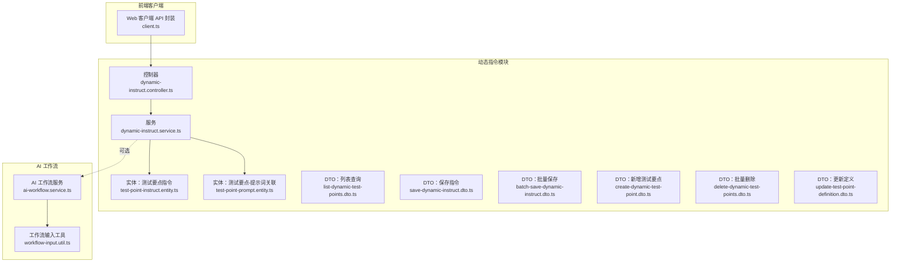
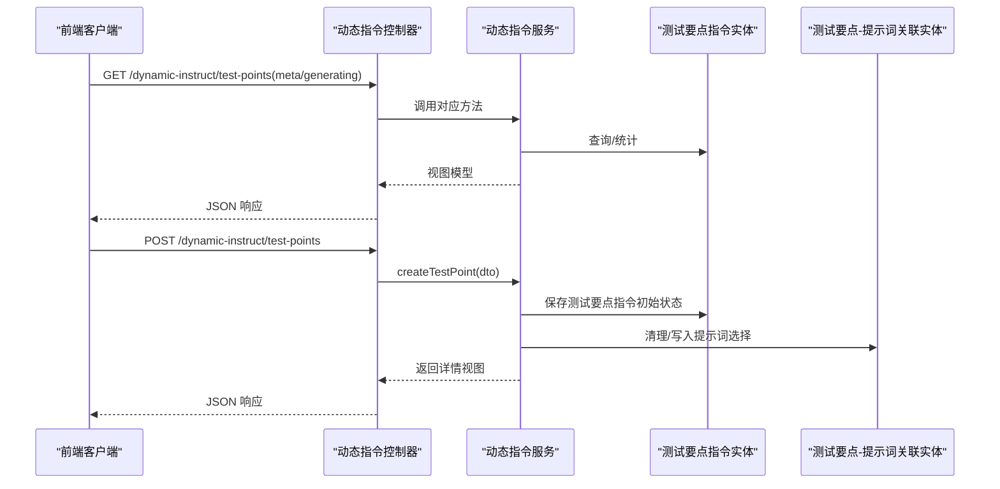
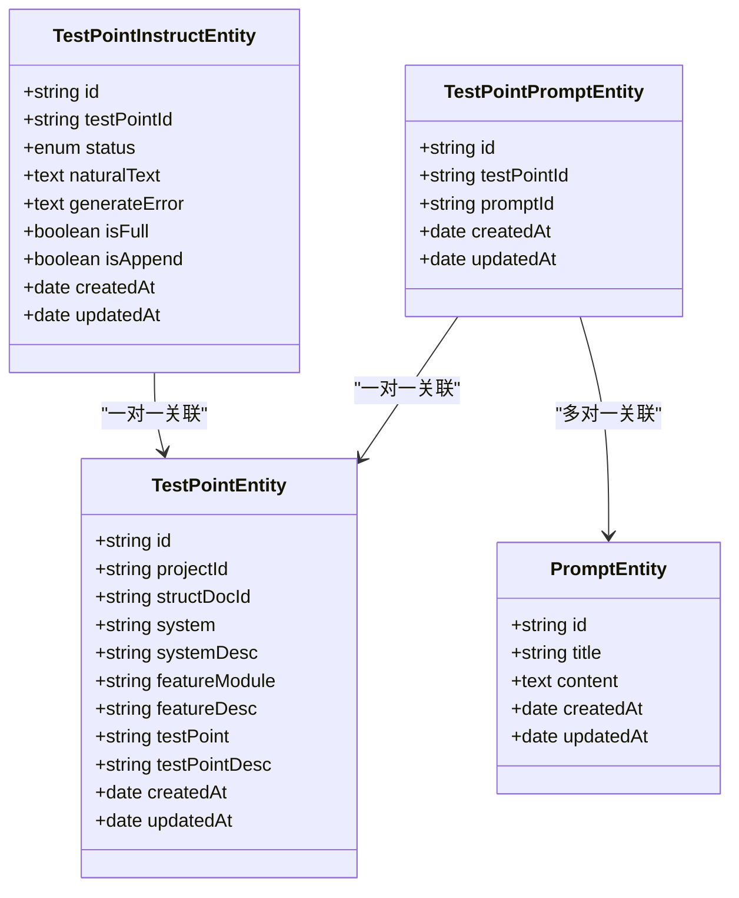
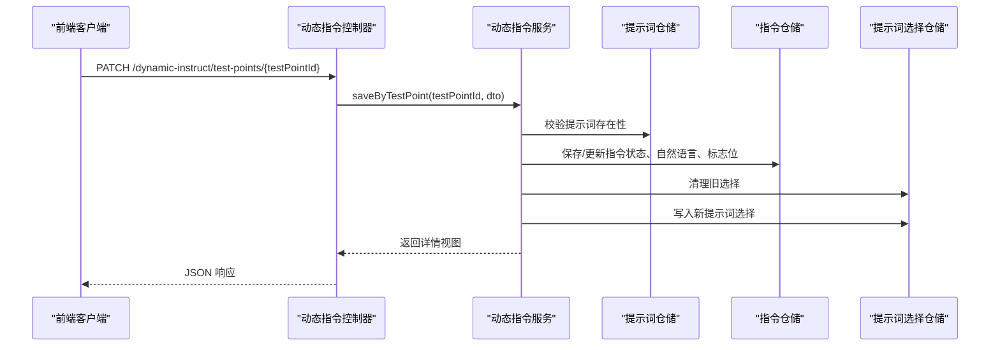
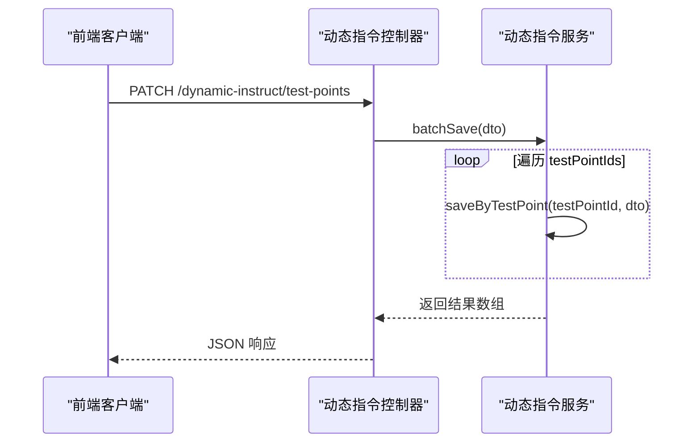
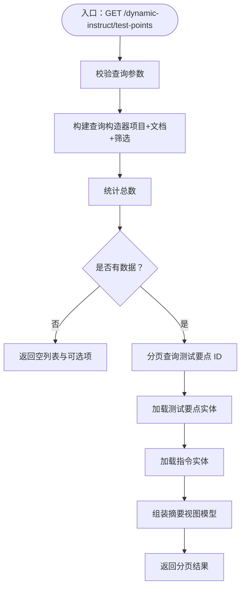
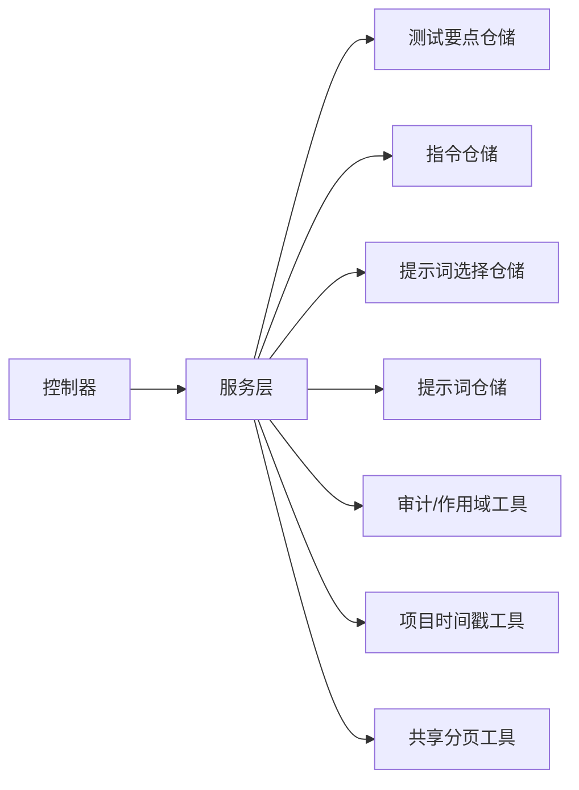

# 动态指令控制器

<cite>
**本文引用的文件**
- [apps/api/src/modules/dynamic-instruct/controller/dynamic-instruct.controller.ts](file://apps/api/src/modules/dynamic-instruct/controller/dynamic-instruct.controller.ts)
- [apps/api/src/modules/dynamic-instruct/service/dynamic-instruct.service.ts](file://apps/api/src/modules/dynamic-instruct/service/dynamic-instruct.service.ts)
- [apps/api/src/modules/dynamic-instruct/entity/test-point-instruct.entity.ts](file://apps/api/src/modules/dynamic-instruct/entity/test-point-instruct.entity.ts)
- [apps/api/src/modules/dynamic-instruct/entity/test-point-prompt.entity.ts](file://apps/api/src/modules/dynamic-instruct/entity/test-point-prompt.entity.ts)
- [apps/api/src/modules/dynamic-instruct/dto/list-dynamic-test-points.dto.ts](file://apps/api/src/modules/dynamic-instruct/dto/list-dynamic-test-points.dto.ts)
- [apps/api/src/modules/dynamic-instruct/dto/save-dynamic-instruct.dto.ts](file://apps/api/src/modules/dynamic-instruct/dto/save-dynamic-instruct.dto.ts)
- [apps/api/src/modules/dynamic-instruct/dto/batch-save-dynamic-instruct.dto.ts](file://apps/api/src/modules/dynamic-instruct/dto/batch-save-dynamic-instruct.dto.ts)
- [apps/api/src/modules/dynamic-instruct/dto/create-dynamic-test-point.dto.ts](file://apps/api/src/modules/dynamic-instruct/dto/create-dynamic-test-point.dto.ts)
- [apps/api/src/modules/dynamic-instruct/dto/delete-dynamic-test-points.dto.ts](file://apps/api/src/modules/dynamic-instruct/dto/delete-dynamic-test-points.dto.ts)
- [apps/api/src/modules/dynamic-instruct/dto/update-test-point-definition.dto.ts](file://apps/api/src/modules/dynamic-instruct/dto/update-test-point-definition.dto.ts)
- [apps/api/src/common/ai-workflow/service/ai-workflow.service.ts](file://apps/api/src/common/ai-workflow/service/ai-workflow.service.ts)
- [apps/api/src/common/ai-workflow/util/workflow-input.util.ts](file://apps/api/src/common/ai-workflow/util/workflow-input.util.ts)
- [apps/web/src/api/client.ts](file://apps/web/src/api/client.ts)
</cite>

## 目录
1. [简介](#简介)
2. [项目结构](#项目结构)
3. [核心组件](#核心组件)
4. [架构总览](#架构总览)
5. [详细组件分析](#详细组件分析)
6. [依赖关系分析](#依赖关系分析)
7. [性能考量](#性能考量)
8. [故障排查指南](#故障排查指南)
9. [结论](#结论)
10. [附录](#附录)

## 简介
本文件面向“动态指令控制器”的开发与维护，围绕动态测试指令的创建、保存、批量操作与测试点管理展开，系统性阐述控制器的接口设计、服务层的业务逻辑、DTO 参数校验、状态机与数据模型、以及与 AI 工作流的集成方式。文档同时给出关键流程的时序图与类图，帮助读者快速理解并高效扩展。

## 项目结构
动态指令模块位于后端 NestJS 应用的 dynamic-instruct 子域，采用“控制器-服务-实体-DTO”分层设计，配合前端 Web 客户端发起 REST 请求，形成闭环的测试要点与动态指令管理链路。

图表来源
- [apps/api/src/modules/dynamic-instruct/controller/dynamic-instruct.controller.ts:1-108](file://apps/api/src/modules/dynamic-instruct/controller/dynamic-instruct.controller.ts#L1-L108)
- [apps/api/src/modules/dynamic-instruct/service/dynamic-instruct.service.ts:1-474](file://apps/api/src/modules/dynamic-instruct/service/dynamic-instruct.service.ts#L1-L474)
- [apps/api/src/modules/dynamic-instruct/entity/test-point-instruct.entity.ts:1-87](file://apps/api/src/modules/dynamic-instruct/entity/test-point-instruct.entity.ts#L1-L87)
- [apps/api/src/modules/dynamic-instruct/entity/test-point-prompt.entity.ts:1-63](file://apps/api/src/modules/dynamic-instruct/entity/test-point-prompt.entity.ts#L1-L63)
- [apps/api/src/common/ai-workflow/service/ai-workflow.service.ts:1-360](file://apps/api/src/common/ai-workflow/service/ai-workflow.service.ts#L1-L360)
- [apps/api/src/common/ai-workflow/util/workflow-input.util.ts:1-185](file://apps/api/src/common/ai-workflow/util/workflow-input.util.ts#L1-L185)
- [apps/web/src/api/client.ts:562-642](file://apps/web/src/api/client.ts#L562-L642)

章节来源
- [apps/api/src/modules/dynamic-instruct/controller/dynamic-instruct.controller.ts:1-108](file://apps/api/src/modules/dynamic-instruct/controller/dynamic-instruct.controller.ts#L1-L108)
- [apps/api/src/modules/dynamic-instruct/service/dynamic-instruct.service.ts:1-474](file://apps/api/src/modules/dynamic-instruct/service/dynamic-instruct.service.ts#L1-L474)

## 核心组件
- 控制器：暴露 REST 接口，负责路由、参数绑定与响应包装，委派给服务层执行业务。
- 服务层：实现业务规则，包括测试要点与动态指令的查询、创建、更新、删除、批量保存；维护状态机与提示词关联；触达审计与项目时间戳。
- 实体层：定义测试要点指令主表与测试要点-提示词关联表，承载状态、自然语言、全量/追加标志等字段。
- DTO 层：统一输入校验与 Swagger 文档，确保参数合法性与一致性。
- AI 工作流：提供结构化需求、案例生成摘要等能力，为动态指令生成提供上游支撑（可选集成）。

章节来源
- [apps/api/src/modules/dynamic-instruct/controller/dynamic-instruct.controller.ts:24-108](file://apps/api/src/modules/dynamic-instruct/controller/dynamic-instruct.controller.ts#L24-L108)
- [apps/api/src/modules/dynamic-instruct/service/dynamic-instruct.service.ts:52-474](file://apps/api/src/modules/dynamic-instruct/service/dynamic-instruct.service.ts#L52-L474)
- [apps/api/src/modules/dynamic-instruct/entity/test-point-instruct.entity.ts:32-87](file://apps/api/src/modules/dynamic-instruct/entity/test-point-instruct.entity.ts#L32-L87)
- [apps/api/src/modules/dynamic-instruct/entity/test-point-prompt.entity.ts:20-63](file://apps/api/src/modules/dynamic-instruct/entity/test-point-prompt.entity.ts#L20-L63)

## 架构总览
动态指令控制器遵循“控制器-服务-仓储-实体”的分层架构，前端通过 Web 客户端发起请求，控制器接收并校验 DTO，服务层执行业务逻辑与数据持久化，实体层映射数据库表结构，AI 工作流模块提供可选的智能生成能力。

图表来源
- [apps/api/src/modules/dynamic-instruct/controller/dynamic-instruct.controller.ts:32-77](file://apps/api/src/modules/dynamic-instruct/controller/dynamic-instruct.controller.ts#L32-L77)
- [apps/api/src/modules/dynamic-instruct/service/dynamic-instruct.service.ts:178-383](file://apps/api/src/modules/dynamic-instruct/service/dynamic-instruct.service.ts#L178-L383)
- [apps/web/src/api/client.ts:562-642](file://apps/web/src/api/client.ts#L562-L642)

## 详细组件分析

### 控制器接口与路由
- 元数据与生成中要点查询
  - GET /dynamic-instruct/test-points/meta：返回编辑区自动完成与筛选项元数据（系统、功能模块、定义样例）。
  - GET /dynamic-instruct/test-points/generating：列出仍在“生成中”的测试要点，用于恢复轮询。
- 列表与筛选
  - GET /dynamic-instruct/test-points：分页查询测试要点摘要，支持按系统/功能模块筛选。
- 测试要点 CRUD
  - POST /dynamic-instruct/test-points：新增测试要点。
  - DELETE /dynamic-instruct/test-points：批量删除测试要点。
  - PATCH /dynamic-instruct/test-points/:testPointId/definition：更新测试要点定义字段。
- 动态指令 CRUD
  - GET /dynamic-instruct/test-points/:testPointId：获取单个测试要点的动态指令详情。
  - PATCH /dynamic-instruct/test-points/:testPointId：保存单个测试要点的动态指令（状态、自然语言、提示词、全量/追加）。
  - PATCH /dynamic-instruct/test-points：批量保存多个测试要点的动态指令（共用同一套约束配置）。

章节来源
- [apps/api/src/modules/dynamic-instruct/controller/dynamic-instruct.controller.ts:32-106](file://apps/api/src/modules/dynamic-instruct/controller/dynamic-instruct.controller.ts#L32-L106)
- [apps/web/src/api/client.ts:562-642](file://apps/web/src/api/client.ts#L562-L642)

### 服务层业务逻辑
- 列表与筛选
  - listByStructDoc：基于项目与结构化文档过滤，支持系统/功能模块筛选，分页返回摘要视图，包含状态排序与可用系统/模块集合。
- 元数据与生成中要点
  - getWorkspaceMeta：返回系统、功能模块与定义样例（不含动态指令正文），便于前端自动完成。
  - listGeneratingTestPoints：查询状态为“生成中”的测试要点，用于前端恢复轮询。
- 测试要点管理
  - createTestPoint：新增测试要点并初始化指令状态，触达项目更新时间。
  - updateTestPointDefinition：更新测试要点定义字段，禁止空值，触达项目更新时间。
  - deleteTestPoints：批量删除测试要点，级联清理指令与提示词选择。
- 动态指令管理
  - saveByTestPoint：保存单个测试要点的动态指令，校验提示词存在性，根据状态与内容推导最终状态，清理并重建提示词选择，触达项目更新时间。
  - batchSave：批量保存，逐条调用 saveByTestPoint。
  - listOne：查询单个测试要点的详情视图，包含状态、自然语言、提示词列表与标志位。

章节来源
- [apps/api/src/modules/dynamic-instruct/service/dynamic-instruct.service.ts:70-417](file://apps/api/src/modules/dynamic-instruct/service/dynamic-instruct.service.ts#L70-L417)

### 数据模型与状态机
- 测试要点指令实体
  - 状态枚举：待编辑、已编辑、再编辑、生成中、生成失败、生成完成。
  - 标志位：isFull（是否全量覆盖）、isAppend（是否追加案例）。
  - 自然语言字段：naturalText。
  - 外键：一对一关联测试要点。
- 测试要点-提示词关联实体
  - 多对多关联，唯一索引保证组合唯一性，支持按提示词索引检索。
- 状态排序 SQL 片段
  - 服务层内置状态排序表达式，用于列表按状态优先级排序。

图表来源
- [apps/api/src/modules/dynamic-instruct/entity/test-point-instruct.entity.ts:32-87](file://apps/api/src/modules/dynamic-instruct/entity/test-point-instruct.entity.ts#L32-L87)
- [apps/api/src/modules/dynamic-instruct/entity/test-point-prompt.entity.ts:20-63](file://apps/api/src/modules/dynamic-instruct/entity/test-point-prompt.entity.ts#L20-L63)

章节来源
- [apps/api/src/modules/dynamic-instruct/entity/test-point-instruct.entity.ts:16-87](file://apps/api/src/modules/dynamic-instruct/entity/test-point-instruct.entity.ts#L16-L87)
- [apps/api/src/modules/dynamic-instruct/entity/test-point-prompt.entity.ts:16-63](file://apps/api/src/modules/dynamic-instruct/entity/test-point-prompt.entity.ts#L16-L63)

### DTO 参数校验与响应模式
- 列表查询 DTO
  - 支持项目 ID、结构化文档 ID、系统、功能模块、分页参数，使用整型与枚举校验。
- 保存指令 DTO
  - 提示词 ID 数组、自然语言、状态枚举、全量/追加布尔标志。
- 批量保存 DTO
  - 在保存指令 DTO 基础上增加非空测试要点 ID 数组。
- 新增测试要点 DTO
  - 可选字段用于初始化系统/模块/测试要点及其描述。
- 批量删除 DTO
  - 非空字符串数组。
- 更新定义 DTO
  - 可选字符串字段，逐项更新。

章节来源
- [apps/api/src/modules/dynamic-instruct/dto/list-dynamic-test-points.dto.ts:10-42](file://apps/api/src/modules/dynamic-instruct/dto/list-dynamic-test-points.dto.ts#L10-L42)
- [apps/api/src/modules/dynamic-instruct/dto/save-dynamic-instruct.dto.ts:23-49](file://apps/api/src/modules/dynamic-instruct/dto/save-dynamic-instruct.dto.ts#L23-L49)
- [apps/api/src/modules/dynamic-instruct/dto/batch-save-dynamic-instruct.dto.ts:10-16](file://apps/api/src/modules/dynamic-instruct/dto/batch-save-dynamic-instruct.dto.ts#L10-L16)
- [apps/api/src/modules/dynamic-instruct/dto/create-dynamic-test-point.dto.ts:7-45](file://apps/api/src/modules/dynamic-instruct/dto/create-dynamic-test-point.dto.ts#L7-L45)
- [apps/api/src/modules/dynamic-instruct/dto/delete-dynamic-test-points.dto.ts:7-13](file://apps/api/src/modules/dynamic-instruct/dto/delete-dynamic-test-points.dto.ts#L7-L13)
- [apps/api/src/modules/dynamic-instruct/dto/update-test-point-definition.dto.ts:7-37](file://apps/api/src/modules/dynamic-instruct/dto/update-test-point-definition.dto.ts#L7-L37)

### 批量处理优化策略
- 逐条保存
  - 服务层的批量保存通过循环逐条调用单条保存，确保每条记录的校验与状态推导独立执行，避免跨记录耦合。
- 建议优化方向
  - 使用事务包裹批量保存，提升一致性与回滚能力。
  - 引入并发控制与队列调度，限制同时处理的记录数，避免数据库压力峰值。
  - 对提示词存在性与所有权校验进行预加载与缓存，减少重复查询。

章节来源
- [apps/api/src/modules/dynamic-instruct/service/dynamic-instruct.service.ts:389-395](file://apps/api/src/modules/dynamic-instruct/service/dynamic-instruct.service.ts#L389-L395)

### AI 工作流集成
- 能力概览
  - 支持需求结构化、案例生成摘要、OpenAI 兼容 Chat 调用、JSON 数组解析等。
- 与动态指令的关系
  - 动态指令控制器本身不直接调用 AI，但可通过工作流服务在外部流程中生成“需求总结”或“结构化文档”，为动态指令生成提供上下文输入。
- 集成建议
  - 在生成动态指令前，先调用 AI 工作流服务生成结构化需求摘要，再将摘要注入动态指令的自然语言字段或提示词选择中。
  - 通过配置开关控制是否启用 AI 生成路径，保障离线环境可用性。

章节来源
- [apps/api/src/common/ai-workflow/service/ai-workflow.service.ts:39-360](file://apps/api/src/common/ai-workflow/service/ai-workflow.service.ts#L39-L360)
- [apps/api/src/common/ai-workflow/util/workflow-input.util.ts:65-185](file://apps/api/src/common/ai-workflow/util/workflow-input.util.ts#L65-L185)

### 参数验证与响应处理模式
- 参数验证
  - 控制器通过 NestJS 的装饰器与 DTO 校验，确保输入类型与范围正确；服务层进一步进行所有权与存在性校验。
- 错误处理
  - 对缺失参数抛出“坏请求”异常，对不存在资源抛出“未找到”异常；状态机与默认值确保响应一致性。
- 响应模式
  - 列表返回分页对象（items、total、page、pageSize、可选项集合），详情返回包含状态、自然语言、提示词列表与标志位的视图模型。

章节来源
- [apps/api/src/modules/dynamic-instruct/service/dynamic-instruct.service.ts:299-395](file://apps/api/src/modules/dynamic-instruct/service/dynamic-instruct.service.ts#L299-L395)

### 关键流程时序图

#### 保存单个测试要点动态指令

图表来源
- [apps/api/src/modules/dynamic-instruct/controller/dynamic-instruct.controller.ts:80-86](file://apps/api/src/modules/dynamic-instruct/controller/dynamic-instruct.controller.ts#L80-L86)
- [apps/api/src/modules/dynamic-instruct/service/dynamic-instruct.service.ts:323-383](file://apps/api/src/modules/dynamic-instruct/service/dynamic-instruct.service.ts#L323-L383)

#### 批量保存多个测试要点动态指令

图表来源
- [apps/api/src/modules/dynamic-instruct/controller/dynamic-instruct.controller.ts:100-106](file://apps/api/src/modules/dynamic-instruct/controller/dynamic-instruct.controller.ts#L100-L106)
- [apps/api/src/modules/dynamic-instruct/service/dynamic-instruct.service.ts:389-395](file://apps/api/src/modules/dynamic-instruct/service/dynamic-instruct.service.ts#L389-L395)

#### 列表与筛选流程

图表来源
- [apps/api/src/modules/dynamic-instruct/service/dynamic-instruct.service.ts:70-140](file://apps/api/src/modules/dynamic-instruct/service/dynamic-instruct.service.ts#L70-L140)

## 依赖关系分析
- 控制器依赖服务层接口，服务层依赖仓储与公共工具（审计、项目时间戳、分页规范）。
- 实体间通过外键建立一对一/多对多关系，提示词选择实体承担“测试要点-提示词”桥接。
- DTO 作为契约层，约束输入与输出，保证前后端一致。

图表来源
- [apps/api/src/modules/dynamic-instruct/controller/dynamic-instruct.controller.ts:22-30](file://apps/api/src/modules/dynamic-instruct/controller/dynamic-instruct.controller.ts#L22-L30)
- [apps/api/src/modules/dynamic-instruct/service/dynamic-instruct.service.ts:54-65](file://apps/api/src/modules/dynamic-instruct/service/dynamic-instruct.service.ts#L54-L65)

章节来源
- [apps/api/src/modules/dynamic-instruct/service/dynamic-instruct.service.ts:21-35](file://apps/api/src/modules/dynamic-instruct/service/dynamic-instruct.service.ts#L21-L35)

## 性能考量
- 列表查询
  - 先 COUNT 再分页取 ID，再批量加载实体，避免一次性加载大量明细正文，降低网络与内存开销。
  - 使用状态排序表达式与索引字段，提升排序与筛选效率。
- 批量保存
  - 当前逐条保存，建议引入事务与并发限流；对提示词存在性进行预加载与去重，减少重复查询。
- 提示词选择
  - 保存时先清后写，避免脏数据；可考虑批量插入以减少往返次数。

章节来源
- [apps/api/src/modules/dynamic-instruct/service/dynamic-instruct.service.ts:70-140](file://apps/api/src/modules/dynamic-instruct/service/dynamic-instruct.service.ts#L70-L140)
- [apps/api/src/modules/dynamic-instruct/service/dynamic-instruct.service.ts:366-378](file://apps/api/src/modules/dynamic-instruct/service/dynamic-instruct.service.ts#L366-L378)

## 故障排查指南
- 常见错误与定位
  - 缺少测试要点 ID 或非法 ID：服务层断言所有权或未找到时抛出异常。
  - 批量删除未传 ID：控制器/服务层抛出“坏请求”异常。
  - 提示词不存在：保存指令时校验提示词存在性并抛出“未找到”异常。
  - 定义字段为空：更新定义时禁止系统、功能模块、测试要点为空。
- 建议排查步骤
  - 核对前端传参与 DTO 校验规则。
  - 检查项目与文档作用域是否匹配。
  - 查看数据库状态字段与提示词选择是否一致。
  - 如启用 AI 生成，确认 AI 工作流配置与网络连通性。

章节来源
- [apps/api/src/modules/dynamic-instruct/service/dynamic-instruct.service.ts:299-341](file://apps/api/src/modules/dynamic-instruct/service/dynamic-instruct.service.ts#L299-L341)
- [apps/api/src/modules/dynamic-instruct/dto/delete-dynamic-test-points.dto.ts:7-13](file://apps/api/src/modules/dynamic-instruct/dto/delete-dynamic-test-points.dto.ts#L7-L13)

## 结论
动态指令控制器通过清晰的分层设计与严格的 DTO 校验，提供了完整的测试要点与动态指令管理能力。服务层在状态机、提示词关联与批量处理方面具备良好扩展性；结合 AI 工作流，可进一步实现智能化的测试要点生成与约束提炼。建议在生产环境中引入事务与并发控制，持续优化批量处理与提示词选择的性能表现。

## 附录
- 前端 API 封装参考
  - 列表、元数据、生成中要点、详情、新增、删除、更新定义、保存指令等接口均已封装，便于前端直接调用。

章节来源
- [apps/web/src/api/client.ts:562-642](file://apps/web/src/api/client.ts#L562-L642)