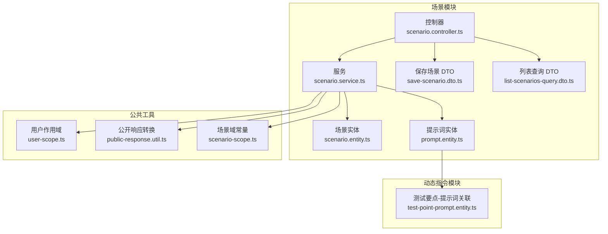
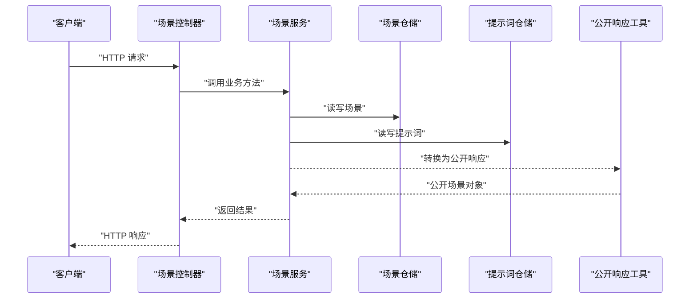
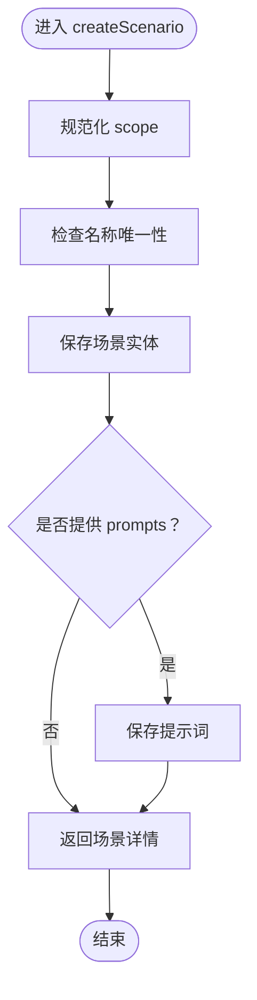
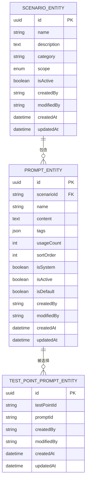
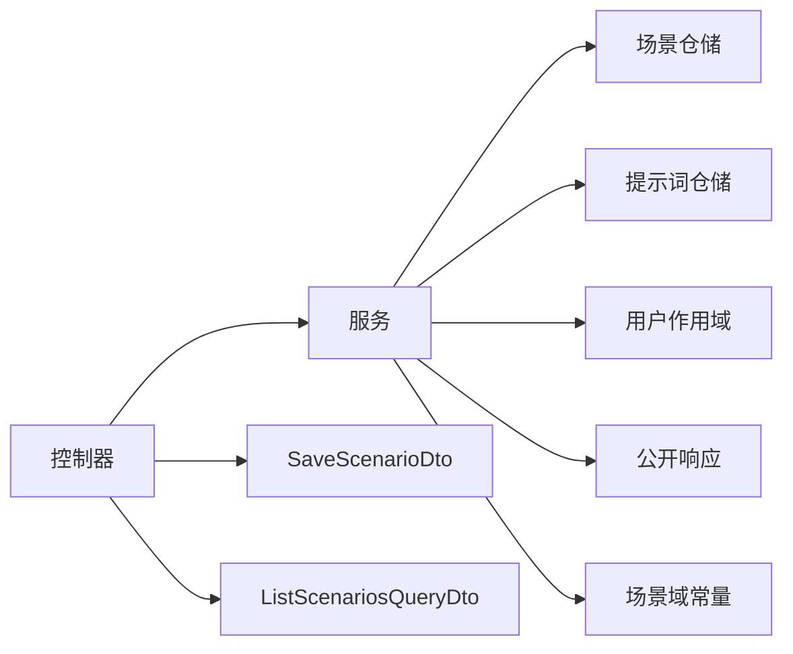

# 场景控制器

<cite>
**本文引用的文件**
- [apps/api/src/modules/scenario/controller/scenario.controller.ts](file://apps/api/src/modules/scenario/controller/scenario.controller.ts)
- [apps/api/src/modules/scenario/service/scenario.service.ts](file://apps/api/src/modules/scenario/service/scenario.service.ts)
- [apps/api/src/modules/scenario/dto/save-scenario.dto.ts](file://apps/api/src/modules/scenario/dto/save-scenario.dto.ts)
- [apps/api/src/modules/scenario/dto/list-scenarios-query.dto.ts](file://apps/api/src/modules/scenario/dto/list-scenarios-query.dto.ts)
- [apps/api/src/modules/scenario/entity/scenario.entity.ts](file://apps/api/src/modules/scenario/entity/scenario.entity.ts)
- [apps/api/src/modules/scenario/entity/prompt.entity.ts](file://apps/api/src/modules/scenario/entity/prompt.entity.ts)
- [apps/api/src/common/audit/user-scope.ts](file://apps/api/src/common/audit/user-scope.ts)
- [apps/api/src/common/http/public-response.util.ts](file://apps/api/src/common/http/public-response.util.ts)
- [packages/shared/src/scenario-scope.ts](file://packages/shared/src/scenario-scope.ts)
- [apps/api/src/modules/dynamic-instruct/entity/test-point-prompt.entity.ts](file://apps/api/src/modules/dynamic-instruct/entity/test-point-prompt.entity.ts)
</cite>

## 目录
1. [引言](#引言)
2. [项目结构](#项目结构)
3. [核心组件](#核心组件)
4. [架构总览](#架构总览)
5. [详细组件分析](#详细组件分析)
6. [依赖分析](#依赖分析)
7. [性能考虑](#性能考虑)
8. [故障排查指南](#故障排查指南)
9. [结论](#结论)
10. [附录](#附录)

## 引言
本文件面向“场景控制器”的开发与使用，围绕测试场景的创建、更新与管理接口进行深入解析。文档涵盖控制器的实现、DTO 的数据校验策略、业务规则处理、响应数据结构以及与 AI 工作流的集成路径。通过分层架构视角，帮助开发者快速理解从 HTTP 请求到数据库持久化、再到对外统一响应的完整流程，并提供可复用的最佳实践建议。

## 项目结构
场景相关模块位于后端 API 应用的 scenario 子模块，采用典型的分层设计：
- 控制器层：暴露 HTTP 接口，负责路由与参数绑定
- 服务层：封装业务逻辑，处理数据校验、权限控制与持久化
- 实体层：映射数据库表结构，定义关系与索引
- DTO 层：定义请求载荷与校验规则
- 公共工具：审计范围、公开响应转换、共享常量

图表来源
- [apps/api/src/modules/scenario/controller/scenario.controller.ts:1-61](file://apps/api/src/modules/scenario/controller/scenario.controller.ts#L1-L61)
- [apps/api/src/modules/scenario/service/scenario.service.ts:1-210](file://apps/api/src/modules/scenario/service/scenario.service.ts#L1-L210)
- [apps/api/src/modules/scenario/entity/scenario.entity.ts:1-72](file://apps/api/src/modules/scenario/entity/scenario.entity.ts#L1-L72)
- [apps/api/src/modules/scenario/entity/prompt.entity.ts:1-97](file://apps/api/src/modules/scenario/entity/prompt.entity.ts#L1-L97)
- [apps/api/src/modules/scenario/dto/save-scenario.dto.ts:1-103](file://apps/api/src/modules/scenario/dto/save-scenario.dto.ts#L1-L103)
- [apps/api/src/modules/scenario/dto/list-scenarios-query.dto.ts:1-16](file://apps/api/src/modules/scenario/dto/list-scenarios-query.dto.ts#L1-L16)
- [apps/api/src/common/audit/user-scope.ts:1-90](file://apps/api/src/common/audit/user-scope.ts#L1-L90)
- [apps/api/src/common/http/public-response.util.ts:1-284](file://apps/api/src/common/http/public-response.util.ts#L1-L284)
- [packages/shared/src/scenario-scope.ts:1-13](file://packages/shared/src/scenario-scope.ts#L1-L13)
- [apps/api/src/modules/dynamic-instruct/entity/test-point-prompt.entity.ts:1-63](file://apps/api/src/modules/dynamic-instruct/entity/test-point-prompt.entity.ts#L1-L63)

章节来源
- [apps/api/src/modules/scenario/controller/scenario.controller.ts:1-61](file://apps/api/src/modules/scenario/controller/scenario.controller.ts#L1-L61)
- [apps/api/src/modules/scenario/service/scenario.service.ts:1-210](file://apps/api/src/modules/scenario/service/scenario.service.ts#L1-L210)
- [apps/api/src/modules/scenario/dto/save-scenario.dto.ts:1-103](file://apps/api/src/modules/scenario/dto/save-scenario.dto.ts#L1-L103)
- [apps/api/src/modules/scenario/dto/list-scenarios-query.dto.ts:1-16](file://apps/api/src/modules/scenario/dto/list-scenarios-query.dto.ts#L1-L16)
- [apps/api/src/modules/scenario/entity/scenario.entity.ts:1-72](file://apps/api/src/modules/scenario/entity/scenario.entity.ts#L1-L72)
- [apps/api/src/modules/scenario/entity/prompt.entity.ts:1-97](file://apps/api/src/modules/scenario/entity/prompt.entity.ts#L1-L97)
- [apps/api/src/common/audit/user-scope.ts:1-90](file://apps/api/src/common/audit/user-scope.ts#L1-L90)
- [apps/api/src/common/http/public-response.util.ts:1-284](file://apps/api/src/common/http/public-response.util.ts#L1-L284)
- [packages/shared/src/scenario-scope.ts:1-13](file://packages/shared/src/scenario-scope.ts#L1-L13)
- [apps/api/src/modules/dynamic-instruct/entity/test-point-prompt.entity.ts:1-63](file://apps/api/src/modules/dynamic-instruct/entity/test-point-prompt.entity.ts#L1-L63)

## 核心组件
- 场景控制器：提供场景列表、详情、创建、更新、删除的 HTTP 接口，统一调用服务层完成业务处理
- 场景服务：实现场景与提示词的增删改查、名称唯一性校验、提示词全量替换、公开响应转换
- 场景实体与提示词实体：定义数据库表结构、关系与索引，支撑场景与提示词的持久化
- DTO：定义请求载荷结构与校验规则，确保输入数据符合业务约束
- 审计与公开响应：统一处理用户作用域、资源归属与对外响应格式

章节来源
- [apps/api/src/modules/scenario/controller/scenario.controller.ts:21-60](file://apps/api/src/modules/scenario/controller/scenario.controller.ts#L21-L60)
- [apps/api/src/modules/scenario/service/scenario.service.ts:33-208](file://apps/api/src/modules/scenario/service/scenario.service.ts#L33-L208)
- [apps/api/src/modules/scenario/entity/scenario.entity.ts:19-71](file://apps/api/src/modules/scenario/entity/scenario.entity.ts#L19-L71)
- [apps/api/src/modules/scenario/entity/prompt.entity.ts:22-96](file://apps/api/src/modules/scenario/entity/prompt.entity.ts#L22-L96)
- [apps/api/src/modules/scenario/dto/save-scenario.dto.ts:22-102](file://apps/api/src/modules/scenario/dto/save-scenario.dto.ts#L22-L102)
- [apps/api/src/common/audit/user-scope.ts:14-75](file://apps/api/src/common/audit/user-scope.ts#L14-L75)
- [apps/api/src/common/http/public-response.util.ts:34-59](file://apps/api/src/common/http/public-response.util.ts#L34-L59)

## 架构总览
场景控制器遵循“控制器-服务-仓储-实体”的分层架构，结合共享常量与公共工具，形成清晰的职责边界与可扩展性。

图表来源
- [apps/api/src/modules/scenario/controller/scenario.controller.ts:29-59](file://apps/api/src/modules/scenario/controller/scenario.controller.ts#L29-L59)
- [apps/api/src/modules/scenario/service/scenario.service.ts:42-142](file://apps/api/src/modules/scenario/service/scenario.service.ts#L42-L142)
- [apps/api/src/common/http/public-response.util.ts:34-59](file://apps/api/src/common/http/public-response.util.ts#L34-L59)

## 详细组件分析

### 控制器层：场景控制器
- 路由与方法
  - GET /scenario/list：按作用域列出场景，支持过滤
  - GET /scenario/:id：按 ID 获取场景详情
  - POST /scenario：创建场景（可同时创建初始提示词）
  - PATCH /scenario/:id：更新场景（可全量替换提示词）
  - DELETE /scenario/:id：删除场景（级联删除提示词）
- 参数绑定与作用域处理
  - 列表查询使用 ListScenariosQueryDto，支持 scope 过滤
  - 通过 normalizeScenarioScope 将字符串 scope 规范化为受控枚举
- 返回值
  - 统一委托服务层返回领域对象，控制器不直接操作实体

章节来源
- [apps/api/src/modules/scenario/controller/scenario.controller.ts:29-59](file://apps/api/src/modules/scenario/controller/scenario.controller.ts#L29-L59)
- [apps/api/src/modules/scenario/dto/list-scenarios-query.dto.ts:9-15](file://apps/api/src/modules/scenario/dto/list-scenarios-query.dto.ts#L9-L15)
- [packages/shared/src/scenario-scope.ts:7-12](file://packages/shared/src/scenario-scope.ts#L7-L12)

### 服务层：场景服务
- 场景列表与详情
  - listScenarios：按用户作用域与系统预置资源组合查询，按更新时间与提示词排序
  - getScenario：加载场景及其提示词，转换为公开响应
- 创建场景
  - 校验名称在 scope 下唯一
  - 保存场景后，如传入 prompts，则批量保存提示词
- 更新场景
  - 仅允许场景所有者更新
  - 支持全量替换提示词：先删除不在新列表中的旧提示词，再保存新提示词
- 删除场景
  - 仅允许场景所有者删除，级联删除提示词
- 数据校验与异常
  - 名称唯一性冲突抛出 400
  - 非法访问或资源不存在抛出 404
- 公开响应
  - 使用 toPublicScenario 将领域对象转为对外安全结构

图表来源
- [apps/api/src/modules/scenario/service/scenario.service.ts:91-108](file://apps/api/src/modules/scenario/service/scenario.service.ts#L91-L108)
- [apps/api/src/modules/scenario/service/scenario.service.ts:189-208](file://apps/api/src/modules/scenario/service/scenario.service.ts#L189-L208)

章节来源
- [apps/api/src/modules/scenario/service/scenario.service.ts:42-142](file://apps/api/src/modules/scenario/service/scenario.service.ts#L42-L142)
- [apps/api/src/common/http/public-response.util.ts:34-59](file://apps/api/src/common/http/public-response.util.ts#L34-L59)

### 实体层：场景与提示词
- 场景实体
  - 主键、名称、描述、类别、scope、启用状态、创建/修改人、时间戳
  - 一对多：场景包含多个提示词，级联删除
- 提示词实体
  - 主键、所属场景、名称、内容、标签、使用次数、排序、启用状态、默认勾选
  - 多对多：通过关联表与测试要点建立选择关系
- 索引
  - 场景：按启用+更新时间、名称、用户+更新时间
  - 提示词：按场景+名称唯一、场景+排序、场景索引

图表来源
- [apps/api/src/modules/scenario/entity/scenario.entity.ts:19-71](file://apps/api/src/modules/scenario/entity/scenario.entity.ts#L19-L71)
- [apps/api/src/modules/scenario/entity/prompt.entity.ts:22-96](file://apps/api/src/modules/scenario/entity/prompt.entity.ts#L22-L96)
- [apps/api/src/modules/dynamic-instruct/entity/test-point-prompt.entity.ts:20-62](file://apps/api/src/modules/dynamic-instruct/entity/test-point-prompt.entity.ts#L20-L62)

章节来源
- [apps/api/src/modules/scenario/entity/scenario.entity.ts:19-71](file://apps/api/src/modules/scenario/entity/scenario.entity.ts#L19-L71)
- [apps/api/src/modules/scenario/entity/prompt.entity.ts:22-96](file://apps/api/src/modules/scenario/entity/prompt.entity.ts#L22-L96)
- [apps/api/src/modules/dynamic-instruct/entity/test-point-prompt.entity.ts:20-62](file://apps/api/src/modules/dynamic-instruct/entity/test-point-prompt.entity.ts#L20-L62)

### DTO 层：数据契约与校验
- SavePromptDto
  - 提示词单项保存结构，支持 id、name、content、tags、usageCount、sortOrder、isSystem、isActive、isDefault
  - 校验：字符串长度限制、整数范围、数组元素类型、布尔可选
- SaveScenarioDto
  - 场景保存结构：name、description、category、isActive、scope、prompts[]
  - 校验：name/category 长度限制、scope 枚举校验、prompts 数组嵌套校验
- ListScenariosQueryDto
  - scope 过滤：可选，限定为受控枚举

章节来源
- [apps/api/src/modules/scenario/dto/save-scenario.dto.ts:22-102](file://apps/api/src/modules/scenario/dto/save-scenario.dto.ts#L22-L102)
- [apps/api/src/modules/scenario/dto/list-scenarios-query.dto.ts:9-15](file://apps/api/src/modules/scenario/dto/list-scenarios-query.dto.ts#L9-L15)

### 审计与公开响应
- 用户作用域
  - scopedWhere/scopedWhereWithSystem：按当前用户与系统预置资源构造查询条件
  - assertOwned/assertAccessible：校验资源归属与可见性，避免信息泄露
- 公开响应
  - toPublicScenario/toPublicPrompt：剔除敏感字段，统一对外输出结构

章节来源
- [apps/api/src/common/audit/user-scope.ts:14-75](file://apps/api/src/common/audit/user-scope.ts#L14-L75)
- [apps/api/src/common/http/public-response.util.ts:34-59](file://apps/api/src/common/http/public-response.util.ts#L34-L59)

### AI 工作流集成机制
- 场景与提示词的关系
  - 场景作为容器聚合提示词，提示词可被测试要点选择并参与动态指令生成
- 提示词与测试要点的多对多
  - 通过关联表记录测试要点勾选的提示词集合，便于在动态指令阶段拼装上下文
- 工作流输入
  - 动态指令模块可基于场景提示词与测试要点选择，形成工作流输入，驱动 LLM 生成具体用例或断言

章节来源
- [apps/api/src/modules/scenario/entity/prompt.entity.ts:42-45](file://apps/api/src/modules/scenario/entity/prompt.entity.ts#L42-L45)
- [apps/api/src/modules/dynamic-instruct/entity/test-point-prompt.entity.ts:20-49](file://apps/api/src/modules/dynamic-instruct/entity/test-point-prompt.entity.ts#L20-L49)

## 依赖分析
- 控制器依赖服务：通过 @Inject 注入 ScenarioService，解耦 HTTP 与业务
- 服务依赖仓储：通过 TypeORM Repository 访问数据库
- 服务依赖公共工具：用户作用域、公开响应转换
- DTO 依赖校验库：class-validator/class-transformer
- 共享常量：场景域枚举与归一化函数

图表来源
- [apps/api/src/modules/scenario/controller/scenario.controller.ts:18-19](file://apps/api/src/modules/scenario/controller/scenario.controller.ts#L18-L19)
- [apps/api/src/modules/scenario/service/scenario.service.ts:35-40](file://apps/api/src/modules/scenario/service/scenario.service.ts#L35-L40)
- [apps/api/src/common/audit/user-scope.ts:14-26](file://apps/api/src/common/audit/user-scope.ts#L14-L26)
- [apps/api/src/common/http/public-response.util.ts:34-59](file://apps/api/src/common/http/public-response.util.ts#L34-L59)
- [packages/shared/src/scenario-scope.ts:7-12](file://packages/shared/src/scenario-scope.ts#L7-L12)

章节来源
- [apps/api/src/modules/scenario/controller/scenario.controller.ts:18-19](file://apps/api/src/modules/scenario/controller/scenario.controller.ts#L18-L19)
- [apps/api/src/modules/scenario/service/scenario.service.ts:35-40](file://apps/api/src/modules/scenario/service/scenario.service.ts#L35-L40)
- [apps/api/src/common/audit/user-scope.ts:14-26](file://apps/api/src/common/audit/user-scope.ts#L14-L26)
- [apps/api/src/common/http/public-response.util.ts:34-59](file://apps/api/src/common/http/public-response.util.ts#L34-L59)
- [packages/shared/src/scenario-scope.ts:7-12](file://packages/shared/src/scenario-scope.ts#L7-L12)

## 性能考虑
- 查询优化
  - 场景与提示词均建立复合索引，支持按启用状态、更新时间、排序等高效筛选
- 写入优化
  - 批量保存提示词时，利用 ORM 的批量插入/更新能力减少往返
- 响应序列化
  - 使用公开响应工具统一序列化，避免泄露内部字段，降低前端解析负担

## 故障排查指南
- 400 错误
  - 场景名称重复：检查同 scope 下是否已有相同名称
  - 提示词名称重复：同一场景内不允许重复名称
- 404 错误
  - 资源不存在或越权访问：确认 createdBy 与当前用户一致，或资源为系统预置
- 删除失败
  - 确认当前用户为场景所有者，且未被其他外键约束阻止删除

章节来源
- [apps/api/src/modules/scenario/service/scenario.service.ts:162-187](file://apps/api/src/modules/scenario/service/scenario.service.ts#L162-L187)
- [apps/api/src/common/audit/user-scope.ts:48-75](file://apps/api/src/common/audit/user-scope.ts#L48-L75)

## 结论
场景控制器以清晰的分层设计实现了测试场景的全生命周期管理，结合严格的 DTO 校验、用户作用域控制与公开响应转换，既保证了数据一致性与安全性，又提供了良好的扩展性。通过场景与提示词的多对多关系，为后续 AI 工作流与动态指令生成奠定了坚实基础。

## 附录
- 常用接口清单
  - GET /scenario/list：按 scope 列出场景
  - GET /scenario/:id：获取场景详情
  - POST /scenario：创建场景（可带初始提示词）
  - PATCH /scenario/:id：更新场景（可全量替换提示词）
  - DELETE /scenario/:id：删除场景（级联删除提示词）