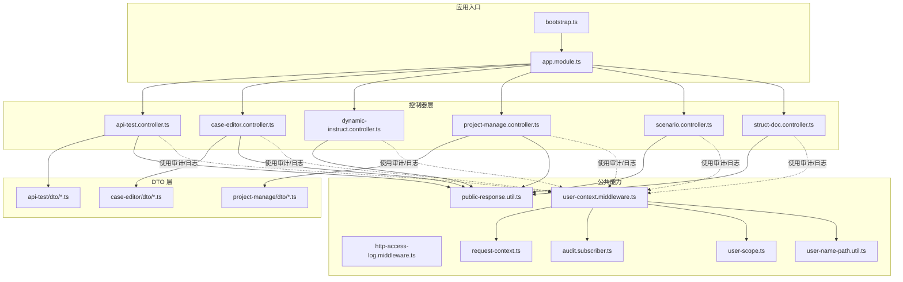
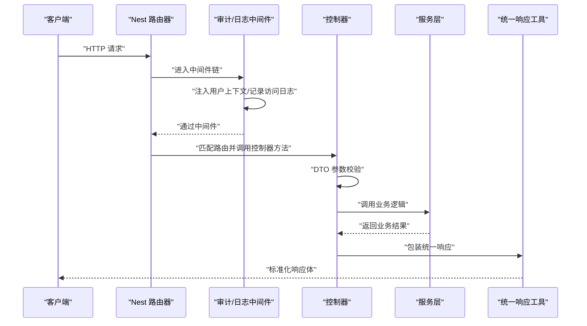
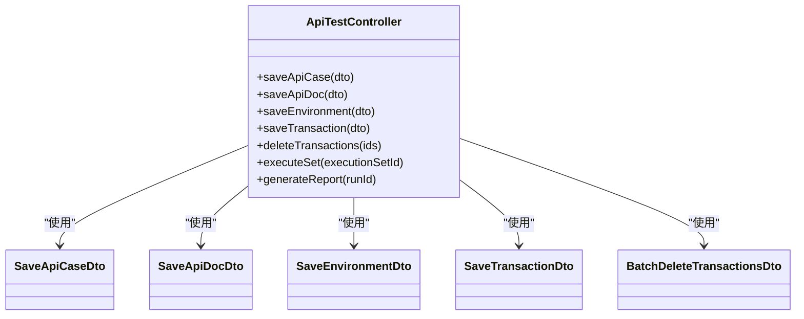
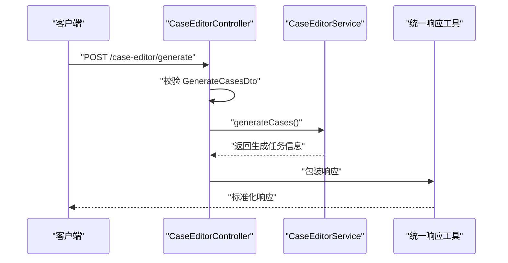
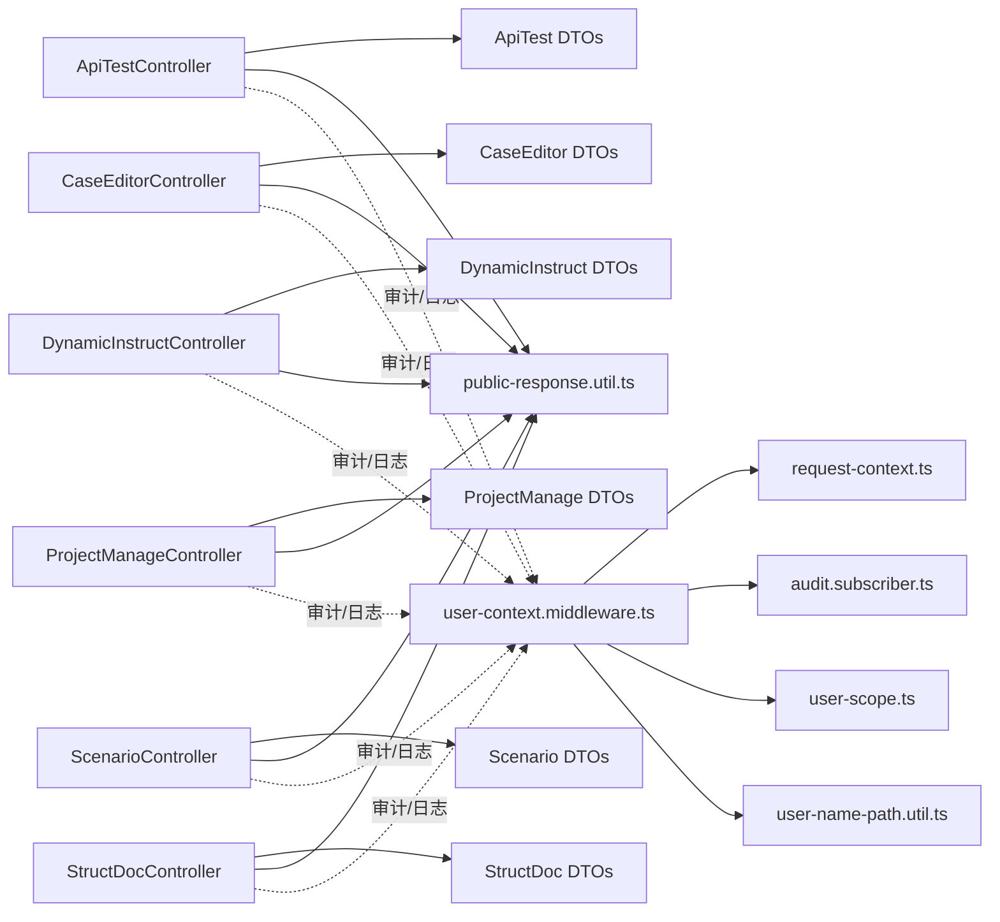

# 控制器层开发

<cite>
**本文档引用的文件**
- [apps/api/src/modules/api-test/controller/api-test.controller.ts](file://apps/api/src/modules/api-test/controller/api-test.controller.ts)
- [apps/api/src/modules/case-editor/controller/case-editor.controller.ts](file://apps/api/src/modules/case-editor/controller/case-editor.controller.ts)
- [apps/api/src/modules/dynamic-instruct/controller/dynamic-instruct.controller.ts](file://apps/api/src/modules/dynamic-instruct/controller/dynamic-instruct.controller.ts)
- [apps/api/src/modules/project-manage/controller/project-manage.controller.ts](file://apps/api/src/modules/project-manage/controller/project-manage.controller.ts)
- [apps/api/src/modules/scenario/controller/scenario.controller.ts](file://apps/api/src/modules/scenario/controller/scenario.controller.ts)
- [apps/api/src/modules/struct-doc/controller/struct-doc.controller.ts](file://apps/api/src/modules/struct-doc/controller/struct-doc.controller.ts)
- [apps/api/src/modules/api-test/dto/save-api-case.dto.ts](file://apps/api/src/modules/api-test/dto/save-api-case.dto.ts)
- [apps/api/src/modules/api-test/dto/save-api-doc.dto.ts](file://apps/api/src/modules/api-test/dto/save-api-doc.dto.ts)
- [apps/api/src/modules/api-test/dto/save-environment.dto.ts](file://apps/api/src/modules/api-test/dto/save-environment.dto.ts)
- [apps/api/src/modules/api-test/dto/save-transaction.dto.ts](file://apps/api/src/modules/api-test/dto/save-transaction.dto.ts)
- [apps/api/src/modules/case-editor/dto/create-project.dto.ts](file://apps/api/src/modules/case-editor/dto/create-project.dto.ts)
- [apps/api/src/modules/case-editor/dto/generate-cases.dto.ts](file://apps/api/src/modules/case-editor/dto/generate-cases.dto.ts)
- [apps/api/src/modules/case-editor/dto/update-document.dto.ts](file://apps/api/src/modules/case-editor/dto/update-document.dto.ts)
- [apps/api/src/modules/project-manage/dto/create-project.dto.ts](file://apps/api/src/modules/project-manage/dto/create-project.dto.ts)
- [apps/api/src/modules/project-manage/dto/update-project.dto.ts](file://apps/api/src/modules/project-manage/dto/update-project.dto.ts)
- [apps/api/src/common/http/public-response.util.ts](file://apps/api/src/common/http/public-response.util.ts)
- [apps/api/src/common/http/http-access-log.middleware.ts](file://apps/api/src/common/http/http-access-log.middleware.ts)
- [apps/api/src/common/audit/user-context.middleware.ts](file://apps/api/src/common/audit/user-context.middleware.ts)
- [apps/api/src/common/audit/request-context.ts](file://apps/api/src/common/audit/request-context.ts)
- [apps/api/src/common/audit/audit.subscriber.ts](file://apps/api/src/common/audit/audit.subscriber.ts)
- [apps/api/src/common/audit/user-scope.ts](file://apps/api/src/common/audit/user-scope.ts)
- [apps/api/src/common/audit/user-name-path.util.ts](file://apps/api/src/common/audit/user-name-path.util.ts)
- [apps/api/src/common/typeorm/index.ts](file://apps/api/src/common/typeorm/index.ts)
- [apps/api/src/common/typeorm/typeorm.config.ts](file://apps/api/src/common/typeorm/typeorm.config.ts)
- [apps/api/src/common/minio/index.ts](file://apps/api/src/common/minio/index.ts)
- [apps/api/src/common/minio/minio.config.ts](file://apps/api/src/common/minio/minio.config.ts)
- [apps/api/src/common/minio/service/minio.service.ts](file://apps/api/src/common/minio/service/minio.service.ts)
- [apps/api/src/app.module.ts](file://apps/api/src/app.module.ts)
- [apps/api/src/bootstrap.ts](file://apps/api/src/bootstrap.ts)
</cite>

## 目录
1. [引言](#引言)
2. [项目结构](#项目结构)
3. [核心组件](#核心组件)
4. [架构总览](#架构总览)
5. [详细组件分析](#详细组件分析)
6. [依赖关系分析](#依赖关系分析)
7. [性能考虑](#性能考虑)
8. [故障排除指南](#故障排除指南)
9. [结论](#结论)
10. [附录](#附录)

## 引言
本文件面向控制器层开发，系统性阐述 RESTful API 控制器的设计原则、HTTP 方法映射与路由配置、请求参数验证、DTO 使用与响应格式标准化、中间件配置与使用、日志记录与错误处理机制，并结合仓库中的实际控制器与配套模块，总结职责分离、业务封装与异常处理的最佳实践。目标是帮助开发者构建清晰、可维护、可扩展的 API 接口。

## 项目结构
控制器位于各功能域的 controller 目录下，每个域包含独立的控制器、DTO、实体与服务层，形成“按功能域划分”的模块化组织方式。公共能力包括审计上下文、访问日志、统一响应工具等，贯穿于控制器层之上。

图表来源
- [apps/api/src/bootstrap.ts](file://apps/api/src/bootstrap.ts)
- [apps/api/src/app.module.ts](file://apps/api/src/app.module.ts)
- [apps/api/src/modules/api-test/controller/api-test.controller.ts](file://apps/api/src/modules/api-test/controller/api-test.controller.ts)
- [apps/api/src/modules/case-editor/controller/case-editor.controller.ts](file://apps/api/src/modules/case-editor/controller/case-editor.controller.ts)
- [apps/api/src/modules/dynamic-instruct/controller/dynamic-instruct.controller.ts](file://apps/api/src/modules/dynamic-instruct/controller/dynamic-instruct.controller.ts)
- [apps/api/src/modules/project-manage/controller/project-manage.controller.ts](file://apps/api/src/modules/project-manage/controller/project-manage.controller.ts)
- [apps/api/src/modules/scenario/controller/scenario.controller.ts](file://apps/api/src/modules/scenario/controller/scenario.controller.ts)
- [apps/api/src/modules/struct-doc/controller/struct-doc.controller.ts](file://apps/api/src/modules/struct-doc/controller/struct-doc.controller.ts)
- [apps/api/src/common/http/public-response.util.ts](file://apps/api/src/common/http/public-response.util.ts)
- [apps/api/src/common/http/http-access-log.middleware.ts](file://apps/api/src/common/http/http-access-log.middleware.ts)
- [apps/api/src/common/audit/user-context.middleware.ts](file://apps/api/src/common/audit/user-context.middleware.ts)
- [apps/api/src/common/audit/request-context.ts](file://apps/api/src/common/audit/request-context.ts)
- [apps/api/src/common/audit/audit.subscriber.ts](file://apps/api/src/common/audit/audit.subscriber.ts)
- [apps/api/src/common/audit/user-scope.ts](file://apps/api/src/common/audit/user-scope.ts)
- [apps/api/src/common/audit/user-name-path.util.ts](file://apps/api/src/common/audit/user-name-path.util.ts)

章节来源
- [apps/api/src/app.module.ts](file://apps/api/src/app.module.ts)
- [apps/api/src/bootstrap.ts](file://apps/api/src/bootstrap.ts)

## 核心组件
- 控制器：负责 HTTP 路由映射、请求参数解析与校验、调用服务层、返回标准化响应。
- DTO：定义请求/响应数据结构，承载参数校验规则与序列化约束。
- 中间件：统一处理审计上下文、用户信息注入、访问日志记录。
- 统一响应工具：规范成功/失败响应格式，便于前端消费与错误处理。
- 审计与权限：通过中间件与订阅器记录操作轨迹，限制用户可见范围。

章节来源
- [apps/api/src/modules/api-test/controller/api-test.controller.ts](file://apps/api/src/modules/api-test/controller/api-test.controller.ts)
- [apps/api/src/modules/case-editor/controller/case-editor.controller.ts](file://apps/api/src/modules/case-editor/controller/case-editor.controller.ts)
- [apps/api/src/modules/dynamic-instruct/controller/dynamic-instruct.controller.ts](file://apps/api/src/modules/dynamic-instruct/controller/dynamic-instruct.controller.ts)
- [apps/api/src/modules/project-manage/controller/project-manage.controller.ts](file://apps/api/src/modules/project-manage/controller/project-manage.controller.ts)
- [apps/api/src/modules/scenario/controller/scenario.controller.ts](file://apps/api/src/modules/scenario/controller/scenario.controller.ts)
- [apps/api/src/modules/struct-doc/controller/struct-doc.controller.ts](file://apps/api/src/modules/struct-doc/controller/struct-doc.controller.ts)
- [apps/api/src/common/http/public-response.util.ts](file://apps/api/src/common/http/public-response.util.ts)
- [apps/api/src/common/http/http-access-log.middleware.ts](file://apps/api/src/common/http/http-access-log.middleware.ts)
- [apps/api/src/common/audit/user-context.middleware.ts](file://apps/api/src/common/audit/user-context.middleware.ts)
- [apps/api/src/common/audit/request-context.ts](file://apps/api/src/common/audit/request-context.ts)
- [apps/api/src/common/audit/audit.subscriber.ts](file://apps/api/src/common/audit/audit.subscriber.ts)
- [apps/api/src/common/audit/user-scope.ts](file://apps/api/src/common/audit/user-scope.ts)
- [apps/api/src/common/audit/user-name-path.util.ts](file://apps/api/src/common/audit/user-name-path.util.ts)

## 架构总览
控制器层遵循“按功能域”组织，每个域控制器仅暴露必要的 HTTP 端点，参数通过 DTO 校验，业务逻辑委托给对应服务，最终通过统一响应工具输出结果。审计与日志中间件在进入控制器之前完成上下文初始化与访问记录。

图表来源
- [apps/api/src/common/http/http-access-log.middleware.ts](file://apps/api/src/common/http/http-access-log.middleware.ts)
- [apps/api/src/common/audit/user-context.middleware.ts](file://apps/api/src/common/audit/user-context.middleware.ts)
- [apps/api/src/common/http/public-response.util.ts](file://apps/api/src/common/http/public-response.util.ts)
- [apps/api/src/modules/api-test/controller/api-test.controller.ts](file://apps/api/src/modules/api-test/controller/api-test.controller.ts)

## 详细组件分析

### API 测试域控制器（api-test.controller）
- 设计原则
  - 面向资源的路由设计：以测试用例、接口文档、环境变量、事务执行等资源为中心组织端点。
  - 单一职责：每个控制器聚焦一个领域，避免跨域混杂。
  - 参数校验前置：所有输入通过 DTO 承载校验规则，控制器只做路由与编排。
- HTTP 映射与路由
  - 基于装饰器声明路由前缀与方法，结合 DTO 进行路径参数、查询参数与请求体的解析与校验。
- 请求参数验证与 DTO 使用
  - 使用类级校验器（如必填、长度、格式）与自定义校验器，确保输入一致性。
  - DTO 作为“契约”，明确前后端交互的数据结构与约束。
- 响应格式标准化
  - 通过统一响应工具输出标准的成功/失败结构，包含状态码、消息与数据载体。
- 业务封装与异常处理
  - 将复杂流程拆分为多个服务方法，控制器仅编排；异常向上抛出或捕获后转换为统一错误响应。

图表来源
- [apps/api/src/modules/api-test/controller/api-test.controller.ts](file://apps/api/src/modules/api-test/controller/api-test.controller.ts)
- [apps/api/src/modules/api-test/dto/save-api-case.dto.ts](file://apps/api/src/modules/api-test/dto/save-api-case.dto.ts)
- [apps/api/src/modules/api-test/dto/save-api-doc.dto.ts](file://apps/api/src/modules/api-test/dto/save-api-doc.dto.ts)
- [apps/api/src/modules/api-test/dto/save-environment.dto.ts](file://apps/api/src/modules/api-test/dto/save-environment.dto.ts)
- [apps/api/src/modules/api-test/dto/save-transaction.dto.ts](file://apps/api/src/modules/api-test/dto/save-transaction.dto.ts)
- [apps/api/src/modules/api-test/dto/batch-delete-transactions.dto.ts](file://apps/api/src/modules/api-test/dto/batch-delete-transactions.dto.ts)

章节来源
- [apps/api/src/modules/api-test/controller/api-test.controller.ts](file://apps/api/src/modules/api-test/controller/api-test.controller.ts)
- [apps/api/src/modules/api-test/dto/save-api-case.dto.ts](file://apps/api/src/modules/api-test/dto/save-api-case.dto.ts)
- [apps/api/src/modules/api-test/dto/save-api-doc.dto.ts](file://apps/api/src/modules/api-test/dto/save-api-doc.dto.ts)
- [apps/api/src/modules/api-test/dto/save-environment.dto.ts](file://apps/api/src/modules/api-test/dto/save-environment.dto.ts)
- [apps/api/src/modules/api-test/dto/save-transaction.dto.ts](file://apps/api/src/modules/api-test/dto/save-transaction.dto.ts)
- [apps/api/src/modules/api-test/dto/batch-delete-transactions.dto.ts](file://apps/api/src/modules/api-test/dto/batch-delete-transactions.dto.ts)

### 案例编辑域控制器（case-editor.controller）
- 设计要点
  - 以“案例生成、同步、更新”为主线，端点围绕工作台树结构与生成队列展开。
  - 通过 DTO 精准控制输入参数，减少控制器内分支判断。
- 参数校验与响应
  - 使用 DTO 校验生成参数、取消生成、同步到测试平台等场景。
  - 统一响应工具保证一致的返回结构。
- 审计与日志
  - 通过中间件注入用户上下文，记录操作轨迹，便于回溯与审计。

图表来源
- [apps/api/src/modules/case-editor/controller/case-editor.controller.ts](file://apps/api/src/modules/case-editor/controller/case-editor.controller.ts)
- [apps/api/src/modules/case-editor/dto/generate-cases.dto.ts](file://apps/api/src/modules/case-editor/dto/generate-cases.dto.ts)
- [apps/api/src/common/http/public-response.util.ts](file://apps/api/src/common/http/public-response.util.ts)

章节来源
- [apps/api/src/modules/case-editor/controller/case-editor.controller.ts](file://apps/api/src/modules/case-editor/controller/case-editor.controller.ts)
- [apps/api/src/modules/case-editor/dto/generate-cases.dto.ts](file://apps/api/src/modules/case-editor/dto/generate-cases.dto.ts)
- [apps/api/src/common/http/public-response.util.ts](file://apps/api/src/common/http/public-response.util.ts)

### 动态指令域控制器（dynamic-instruct.controller）
- 职责边界
  - 负责动态测试点与指令的增删改查，端点设计遵循 REST 规范。
- 参数与响应
  - DTO 承载批量保存、列表查询、删除等场景的参数约束。
  - 统一响应工具保障前端一致的消费体验。

章节来源
- [apps/api/src/modules/dynamic-instruct/controller/dynamic-instruct.controller.ts](file://apps/api/src/modules/dynamic-instruct/controller/dynamic-instruct.controller.ts)
- [apps/api/src/modules/dynamic-instruct/dto/batch-save-dynamic-instruct.dto.ts](file://apps/api/src/modules/dynamic-instruct/dto/batch-save-dynamic-instruct.dto.ts)
- [apps/api/src/modules/dynamic-instruct/dto/list-dynamic-test-points.dto.ts](file://apps/api/src/modules/dynamic-instruct/dto/list-dynamic-test-points.dto.ts)
- [apps/api/src/modules/dynamic-instruct/dto/delete-dynamic-test-points.dto.ts](file://apps/api/src/modules/dynamic-instruct/dto/delete-dynamic-test-points.dto.ts)

### 项目管理域控制器（project-manage.controller）
- 资源建模
  - 以项目为核心资源，提供创建、更新、批量删除等端点。
- 参数与响应
  - 通过 DTO 约束项目名称、描述等字段，统一响应工具输出标准结果。

章节来源
- [apps/api/src/modules/project-manage/controller/project-manage.controller.ts](file://apps/api/src/modules/project-manage/controller/project-manage.controller.ts)
- [apps/api/src/modules/project-manage/dto/create-project.dto.ts](file://apps/api/src/modules/project-manage/dto/create-project.dto.ts)
- [apps/api/src/modules/project-manage/dto/update-project.dto.ts](file://apps/api/src/modules/project-manage/dto/update-project.dto.ts)
- [apps/api/src/common/http/public-response.util.ts](file://apps/api/src/common/http/public-response.util.ts)

### 场景域控制器（scenario.controller）
- 端点设计
  - 围绕场景与提示词进行保存、查询与管理，保持资源导向的命名风格。
- 参数与响应
  - DTO 用于约束场景保存请求体，统一响应工具输出标准化结果。

章节来源
- [apps/api/src/modules/scenario/controller/scenario.controller.ts](file://apps/api/src/modules/scenario/controller/scenario.controller.ts)
- [apps/api/src/modules/scenario/dto/save-scenario.dto.ts](file://apps/api/src/modules/scenario/dto/save-scenario.dto.ts)
- [apps/api/src/common/http/public-response.util.ts](file://apps/api/src/common/http/public-response.util.ts)

### 结构化文档域控制器（struct-doc.controller）
- 职责
  - 处理结构化文档的保存、自动保存与测试点管理，端点清晰、职责单一。
- 参数与响应
  - DTO 约束输入参数，统一响应工具输出一致的响应结构。

章节来源
- [apps/api/src/modules/struct-doc/controller/struct-doc.controller.ts](file://apps/api/src/modules/struct-doc/controller/struct-doc.controller.ts)
- [apps/api/src/modules/struct-doc/dto/save-struct-doc.dto.ts](file://apps/api/src/modules/struct-doc/dto/save-struct-doc.dto.ts)
- [apps/api/src/modules/struct-doc/dto/auto-save-struct-doc.dto.ts](file://apps/api/src/modules/struct-doc/dto/auto-save-struct-doc.dto.ts)
- [apps/api/src/common/http/public-response.util.ts](file://apps/api/src/common/http/public-response.util.ts)

## 依赖关系分析
- 控制器对 DTO 的依赖：所有控制器方法均通过 DTO 进行参数校验，降低控制器内的校验逻辑耦合度。
- 控制器对服务层的依赖：控制器不直接处理复杂业务，仅编排服务调用，提升可测试性与可维护性。
- 控制器对统一响应工具的依赖：所有控制器通过统一响应工具输出结果，保证前端消费一致性。
- 中间件对审计与日志的依赖：用户上下文中间件在控制器前注入用户信息，审计订阅器与日志中间件记录访问行为。

图表来源
- [apps/api/src/modules/api-test/controller/api-test.controller.ts](file://apps/api/src/modules/api-test/controller/api-test.controller.ts)
- [apps/api/src/modules/case-editor/controller/case-editor.controller.ts](file://apps/api/src/modules/case-editor/controller/case-editor.controller.ts)
- [apps/api/src/modules/dynamic-instruct/controller/dynamic-instruct.controller.ts](file://apps/api/src/modules/dynamic-instruct/controller/dynamic-instruct.controller.ts)
- [apps/api/src/modules/project-manage/controller/project-manage.controller.ts](file://apps/api/src/modules/project-manage/controller/project-manage.controller.ts)
- [apps/api/src/modules/scenario/controller/scenario.controller.ts](file://apps/api/src/modules/scenario/controller/scenario.controller.ts)
- [apps/api/src/modules/struct-doc/controller/struct-doc.controller.ts](file://apps/api/src/modules/struct-doc/controller/struct-doc.controller.ts)
- [apps/api/src/common/http/public-response.util.ts](file://apps/api/src/common/http/public-response.util.ts)
- [apps/api/src/common/audit/user-context.middleware.ts](file://apps/api/src/common/audit/user-context.middleware.ts)
- [apps/api/src/common/audit/request-context.ts](file://apps/api/src/common/audit/request-context.ts)
- [apps/api/src/common/audit/audit.subscriber.ts](file://apps/api/src/common/audit/audit.subscriber.ts)
- [apps/api/src/common/audit/user-scope.ts](file://apps/api/src/common/audit/user-scope.ts)
- [apps/api/src/common/audit/user-name-path.util.ts](file://apps/api/src/common/audit/user-name-path.util.ts)

章节来源
- [apps/api/src/common/http/public-response.util.ts](file://apps/api/src/common/http/public-response.util.ts)
- [apps/api/src/common/http/http-access-log.middleware.ts](file://apps/api/src/common/http/http-access-log.middleware.ts)
- [apps/api/src/common/audit/user-context.middleware.ts](file://apps/api/src/common/audit/user-context.middleware.ts)
- [apps/api/src/common/audit/request-context.ts](file://apps/api/src/common/audit/request-context.ts)
- [apps/api/src/common/audit/audit.subscriber.ts](file://apps/api/src/common/audit/audit.subscriber.ts)
- [apps/api/src/common/audit/user-scope.ts](file://apps/api/src/common/audit/user-scope.ts)
- [apps/api/src/common/audit/user-name-path.util.ts](file://apps/api/src/common/audit/user-name-path.util.ts)

## 性能考虑
- DTO 校验前置：将参数校验放在控制器层，减少无效请求进入服务层的成本。
- 统一响应工具：避免重复封装响应，减少序列化开销与分支判断。
- 中间件链路精简：仅在必要处注入上下文与记录日志，避免阻塞主流程。
- 服务层幂等与缓存：对于高频读取场景，在服务层引入缓存策略，降低数据库压力。
- 并发与限流：在网关或中间件层实施限流策略，防止突发流量冲击。

## 故障排除指南
- 参数校验失败
  - 现象：控制器收到 DTO 校验错误。
  - 排查：检查 DTO 字段约束与前端传参是否一致；确认统一响应工具是否正确包装错误。
- 审计上下文缺失
  - 现象：无法记录用户信息或操作轨迹。
  - 排查：确认用户上下文中间件是否注册；检查请求上下文初始化逻辑。
- 日志未记录
  - 现象：访问日志缺失。
  - 排查：确认访问日志中间件是否生效；检查日志级别与输出通道。
- 权限范围异常
  - 现象：用户看到不应见的数据。
  - 排查：核对用户作用域与数据过滤逻辑；确认订阅器是否正确记录操作。

章节来源
- [apps/api/src/common/http/public-response.util.ts](file://apps/api/src/common/http/public-response.util.ts)
- [apps/api/src/common/http/http-access-log.middleware.ts](file://apps/api/src/common/http/http-access-log.middleware.ts)
- [apps/api/src/common/audit/user-context.middleware.ts](file://apps/api/src/common/audit/user-context.middleware.ts)
- [apps/api/src/common/audit/request-context.ts](file://apps/api/src/common/audit/request-context.ts)
- [apps/api/src/common/audit/audit.subscriber.ts](file://apps/api/src/common/audit/audit.subscriber.ts)
- [apps/api/src/common/audit/user-scope.ts](file://apps/api/src/common/audit/user-scope.ts)

## 结论
通过将控制器层设计为“路由编排+参数校验+统一响应”的薄层，配合按功能域划分的模块化结构与完善的中间件体系，可以显著提升 API 的可维护性与可扩展性。建议在新增控制器时严格遵循本文最佳实践：使用 DTO 承载参数与约束、通过统一响应工具输出结果、在中间件中完成审计与日志、在服务层封装业务逻辑并保持幂等与可测试性。

## 附录
- 公共配置与模块
  - TypeORM 配置与索引工具：为控制器依赖的实体提供持久化支持。
  - MinIO 配置与服务：为需要对象存储的控制器提供上传/下载能力。
  - 应用启动与模块装配：确保控制器、服务、中间件与拦截器正确注册。

章节来源
- [apps/api/src/common/typeorm/index.ts](file://apps/api/src/common/typeorm/index.ts)
- [apps/api/src/common/typeorm/typeorm.config.ts](file://apps/api/src/common/typeorm/typeorm.config.ts)
- [apps/api/src/common/minio/index.ts](file://apps/api/src/common/minio/index.ts)
- [apps/api/src/common/minio/minio.config.ts](file://apps/api/src/common/minio/minio.config.ts)
- [apps/api/src/common/minio/service/minio.service.ts](file://apps/api/src/common/minio/service/minio.service.ts)
- [apps/api/src/app.module.ts](file://apps/api/src/app.module.ts)
- [apps/api/src/bootstrap.ts](file://apps/api/src/bootstrap.ts)