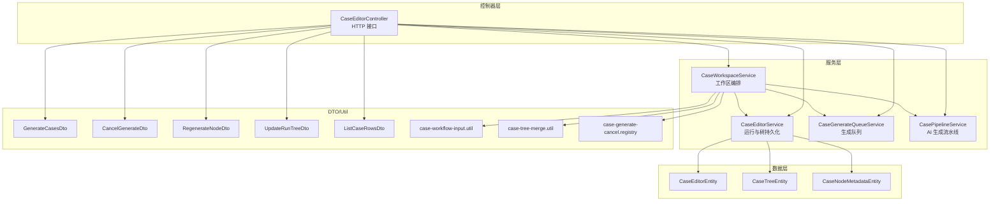
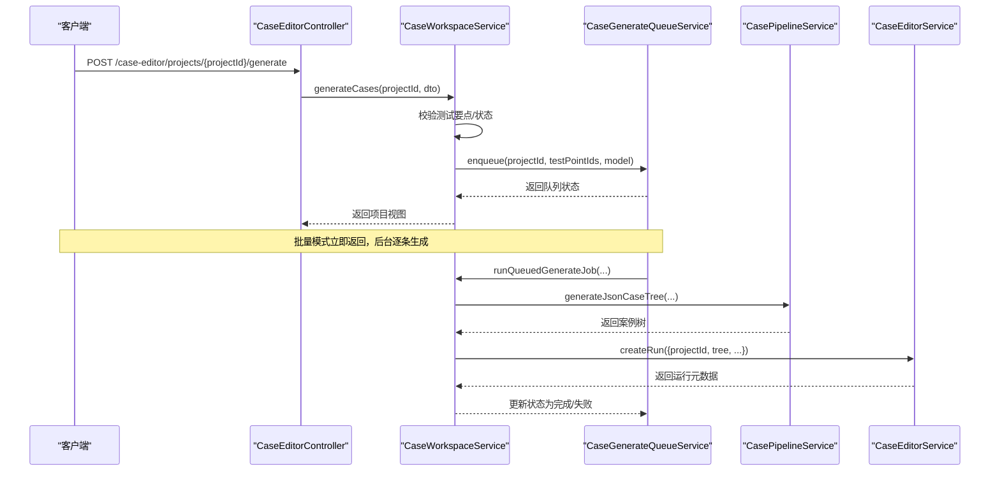
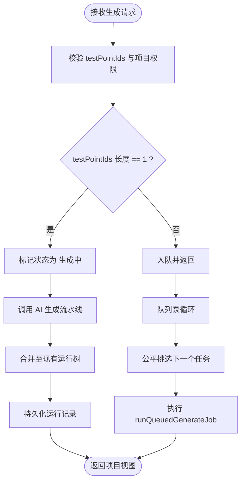
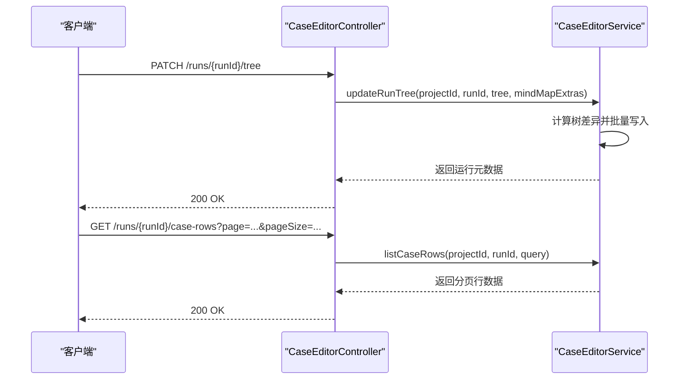
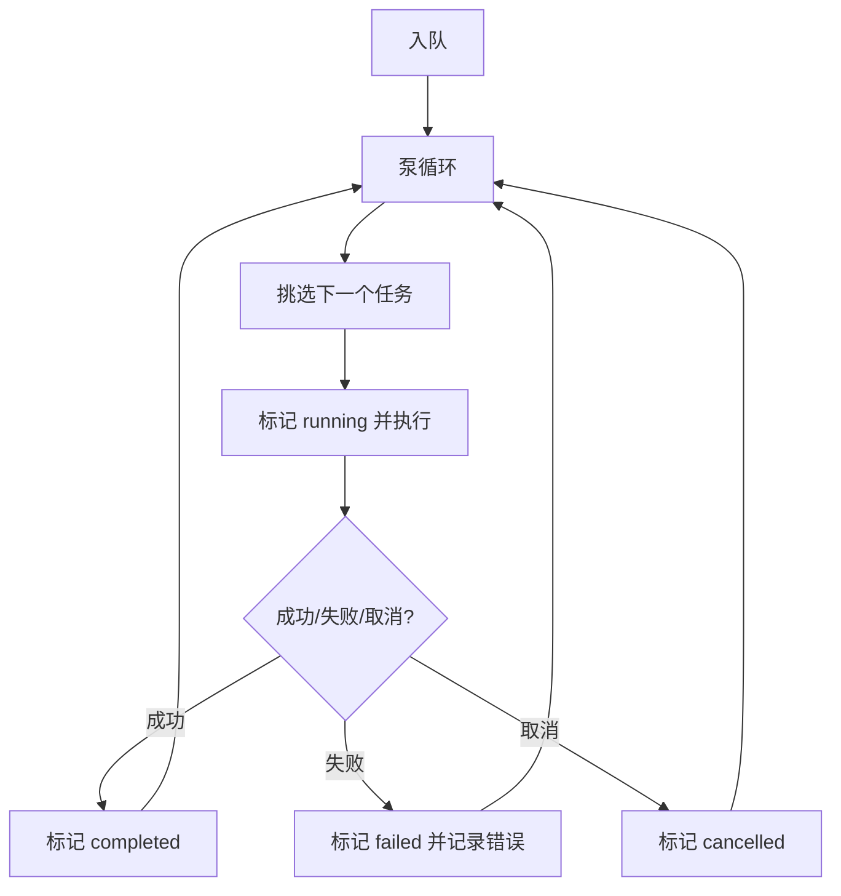
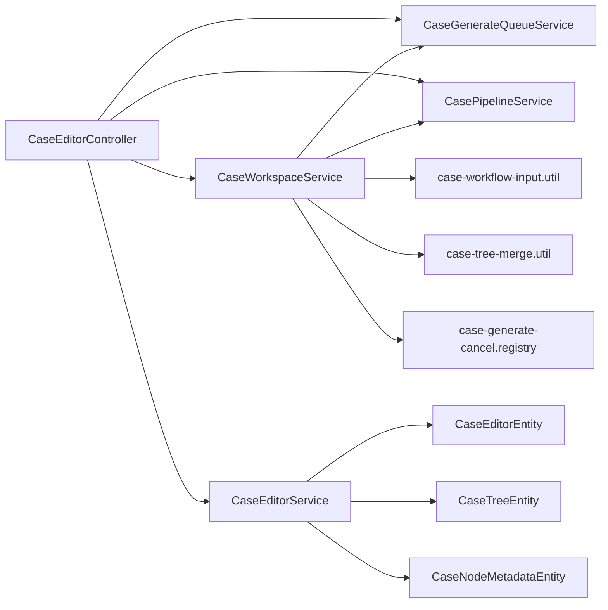
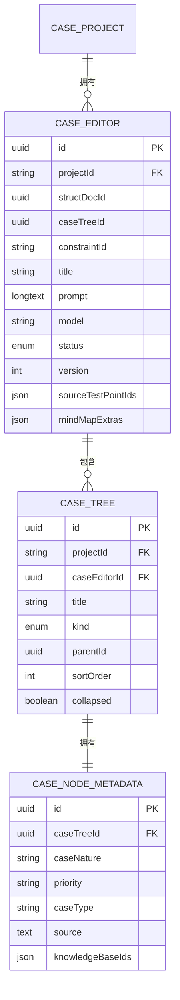

# 案例编辑器控制器

<cite>
**本文档引用的文件**
- [apps/api/src/modules/case-editor/controller/case-editor.controller.ts](file://apps/api/src/modules/case-editor/controller/case-editor.controller.ts)
- [apps/api/src/modules/case-editor/service/case-editor.service.ts](file://apps/api/src/modules/case-editor/service/case-editor.service.ts)
- [apps/api/src/modules/case-editor/service/case-workspace.service.ts](file://apps/api/src/modules/case-editor/service/case-workspace.service.ts)
- [apps/api/src/modules/case-editor/service/case-generate-queue.service.ts](file://apps/api/src/modules/case-editor/service/case-generate-queue.service.ts)
- [apps/api/src/modules/case-editor/service/case-pipeline.service.ts](file://apps/api/src/modules/case-editor/service/case-pipeline.service.ts)
- [apps/api/src/modules/case-editor/dto/generate-cases.dto.ts](file://apps/api/src/modules/case-editor/dto/generate-cases.dto.ts)
- [apps/api/src/modules/case-editor/dto/cancel-generate.dto.ts](file://apps/api/src/modules/case-editor/dto/cancel-generate.dto.ts)
- [apps/api/src/modules/case-editor/dto/regenerate-node.dto.ts](file://apps/api/src/modules/case-editor/dto/regenerate-node.dto.ts)
- [apps/api/src/modules/case-editor/dto/update-run-tree.dto.ts](file://apps/api/src/modules/case-editor/dto/update-run-tree.dto.ts)
- [apps/api/src/modules/case-editor/dto/list-case-rows.dto.ts](file://apps/api/src/modules/case-editor/dto/list-case-rows.dto.ts)
- [apps/api/src/modules/case-editor/entity/case-editor.entity.ts](file://apps/api/src/modules/case-editor/entity/case-editor.entity.ts)
- [apps/api/src/modules/case-editor/entity/case-tree.entity.ts](file://apps/api/src/modules/case-editor/entity/case-tree.entity.ts)
- [apps/api/src/modules/case-editor/entity/case-node-metadata.entity.ts](file://apps/api/src/modules/case-editor/entity/case-node-metadata.entity.ts)
- [apps/api/src/modules/case-editor/util/case-workflow-input.util.ts](file://apps/api/src/modules/case-editor/util/case-workflow-input.util.ts)
- [apps/api/src/modules/case-editor/util/case-tree-merge.util.ts](file://apps/api/src/modules/case-editor/util/case-tree-merge.util.ts)
- [apps/api/src/modules/case-editor/util/case-generate-cancel.registry.ts](file://apps/api/src/modules/case-editor/util/case-generate-cancel.registry.ts)
</cite>

## 目录
1. [简介](#简介)
2. [项目结构](#项目结构)
3. [核心组件](#核心组件)
4. [架构总览](#架构总览)
5. [详细组件分析](#详细组件分析)
6. [依赖关系分析](#依赖关系分析)
7. [性能考量](#性能考量)
8. [故障排查指南](#故障排查指南)
9. [结论](#结论)
10. [附录](#附录)

## 简介
本文件面向案例编辑器控制器的开发者与维护者，系统性梳理“案例生成、文档更新、运行树管理、案例行列表”等接口的实现与交互模式。重点涵盖：
- AI 案例生成的控制器逻辑与批量调度机制
- 案例树操作的 API 设计与参数验证
- 与服务层的职责划分与调用链
- 响应数据结构与错误处理策略
- 实战建议：如何构建高效的工作流 API

## 项目结构
案例编辑器相关代码位于 apps/api/src/modules/case-editor 下，采用按功能域分层组织：
- controller：HTTP 接口定义与路由
- service：业务编排与持久化
- dto：请求/响应参数校验
- entity：数据库实体
- util：工作流与工具方法
- prompts：提示词模板（外部资源）

图表来源
- [apps/api/src/modules/case-editor/controller/case-editor.controller.ts:30-215](file://apps/api/src/modules/case-editor/controller/case-editor.controller.ts#L30-L215)
- [apps/api/src/modules/case-editor/service/case-workspace.service.ts:80-100](file://apps/api/src/modules/case-editor/service/case-workspace.service.ts#L80-L100)
- [apps/api/src/modules/case-editor/service/case-editor.service.ts:53-66](file://apps/api/src/modules/case-editor/service/case-editor.service.ts#L53-L66)
- [apps/api/src/modules/case-editor/service/case-generate-queue.service.ts:72-86](file://apps/api/src/modules/case-editor/service/case-generate-queue.service.ts#L72-L86)
- [apps/api/src/modules/case-editor/service/case-pipeline.service.ts:95-102](file://apps/api/src/modules/case-editor/service/case-pipeline.service.ts#L95-L102)
- [apps/api/src/modules/case-editor/dto/generate-cases.dto.ts:10-23](file://apps/api/src/modules/case-editor/dto/generate-cases.dto.ts#L10-L23)
- [apps/api/src/modules/case-editor/dto/cancel-generate.dto.ts:5-11](file://apps/api/src/modules/case-editor/dto/cancel-generate.dto.ts#L5-L11)
- [apps/api/src/modules/case-editor/dto/regenerate-node.dto.ts:8-30](file://apps/api/src/modules/case-editor/dto/regenerate-node.dto.ts#L8-L30)
- [apps/api/src/modules/case-editor/dto/update-run-tree.dto.ts:9-18](file://apps/api/src/modules/case-editor/dto/update-run-tree.dto.ts#L9-L18)
- [apps/api/src/modules/case-editor/dto/list-case-rows.dto.ts:10-55](file://apps/api/src/modules/case-editor/dto/list-case-rows.dto.ts#L10-L55)
- [apps/api/src/modules/case-editor/util/case-workflow-input.util.ts:104-151](file://apps/api/src/modules/case-editor/util/case-workflow-input.util.ts#L104-L151)
- [apps/api/src/modules/case-editor/util/case-tree-merge.util.ts:17-45](file://apps/api/src/modules/case-editor/util/case-tree-merge.util.ts#L17-L45)
- [apps/api/src/modules/case-editor/util/case-generate-cancel.registry.ts:28-63](file://apps/api/src/modules/case-editor/util/case-generate-cancel.registry.ts#L28-L63)

章节来源
- [apps/api/src/modules/case-editor/controller/case-editor.controller.ts:30-215](file://apps/api/src/modules/case-editor/controller/case-editor.controller.ts#L30-L215)

## 核心组件
- 案例编辑器控制器：暴露 HTTP 接口，负责参数解析、调用服务层并返回响应。
- 工作区编排服务：聚合需求格式化、动态指令、案例生成与运行记录，协调批量队列与取消逻辑。
- 运行与树持久化服务：负责运行记录创建/查询/更新、树差异计算与批量写入。
- 生成队列服务：维护生成任务队列、公平调度、ETA 估算与中断恢复。
- AI 生成流水线：封装 AI Chat 与技能模板，输出标准化案例树。
- 实体与 DTO：定义数据库结构与参数校验规则。

章节来源
- [apps/api/src/modules/case-editor/service/case-editor.service.ts:53-66](file://apps/api/src/modules/case-editor/service/case-editor.service.ts#L53-L66)
- [apps/api/src/modules/case-editor/service/case-workspace.service.ts:80-100](file://apps/api/src/modules/case-editor/service/case-workspace.service.ts#L80-L100)
- [apps/api/src/modules/case-editor/service/case-generate-queue.service.ts:72-86](file://apps/api/src/modules/case-editor/service/case-generate-queue.service.ts#L72-L86)
- [apps/api/src/modules/case-editor/service/case-pipeline.service.ts:95-102](file://apps/api/src/modules/case-editor/service/case-pipeline.service.ts#L95-L102)

## 架构总览
控制器作为入口，将请求委派给工作区编排服务或直接调用运行服务。工作区编排服务进一步协调生成流水线与队列服务，最终通过运行服务持久化案例树。

图表来源
- [apps/api/src/modules/case-editor/controller/case-editor.controller.ts:52-59](file://apps/api/src/modules/case-editor/controller/case-editor.controller.ts#L52-L59)
- [apps/api/src/modules/case-editor/service/case-workspace.service.ts:197-207](file://apps/api/src/modules/case-editor/service/case-workspace.service.ts#L197-L207)
- [apps/api/src/modules/case-editor/service/case-generate-queue.service.ts:477-522](file://apps/api/src/modules/case-editor/service/case-generate-queue.service.ts#L477-L522)
- [apps/api/src/modules/case-editor/service/case-pipeline.service.ts:153-196](file://apps/api/src/modules/case-editor/service/case-pipeline.service.ts#L153-L196)
- [apps/api/src/modules/case-editor/service/case-editor.service.ts:68-108](file://apps/api/src/modules/case-editor/service/case-editor.service.ts#L68-L108)

## 详细组件分析

### 控制器接口与参数校验
- 案例生成
  - 路由：POST /case-editor/projects/{projectId}/generate
  - 请求体：GenerateCasesDto（model 可选；testPointIds 可选数组）
  - 行为：单条同步生成，多条批量入队
- 取消生成
  - 路由：POST /case-editor/projects/{projectId}/generate/cancel
  - 请求体：CancelGenerateDto（testPointIds 数组）
- 查询生成队列
  - 路由：GET /case-editor/projects/{projectId}/generate/queue?testPointIds=...
  - 行为：返回队列进度与 ETA
- 局部重生成节点
  - 路由：POST /case-editor/projects/{projectId}/regenerate-node
  - 请求体：RegenerateNodeDto（runId、nodeId、instruction、mode）
- 运行记录查询
  - GET /case-editor/projects/{projectId}/runs
  - GET /case-editor/projects/{projectId}/runs/{runId}
- 子树懒加载
  - GET /case-editor/projects/{projectId}/runs/{runId}/nodes/{nodeId}/children
- 案例行列表
  - GET /case-editor/projects/{projectId}/runs/{runId}/case-rows
  - 查询参数：ListCaseRowsDto（page、pageSize、requirement、priority、caseNature、keyword、focusCaseNodeId、idsOnly）
- 导出
  - GET /case-editor/projects/{projectId}/runs/{runId}/export?format=excel|xmind&template=1|true&caseNodeIds=...
- 同步至测管平台
  - POST /case-editor/projects/{projectId}/runs/{runId}/sync-test-platform
  - 请求体：SyncToTestPlatformDto（tree、caseNodeIds 数组）
- 保存案例树
  - PATCH /case-editor/projects/{projectId}/runs/{runId}/tree
  - 请求体：UpdateRunTreeDto（tree、mindMapExtras 可选）

章节来源
- [apps/api/src/modules/case-editor/controller/case-editor.controller.ts:52-213](file://apps/api/src/modules/case-editor/controller/case-editor.controller.ts#L52-L213)
- [apps/api/src/modules/case-editor/dto/generate-cases.dto.ts:10-23](file://apps/api/src/modules/case-editor/dto/generate-cases.dto.ts#L10-L23)
- [apps/api/src/modules/case-editor/dto/cancel-generate.dto.ts:5-11](file://apps/api/src/modules/case-editor/dto/cancel-generate.dto.ts#L5-L11)
- [apps/api/src/modules/case-editor/dto/regenerate-node.dto.ts:8-30](file://apps/api/src/modules/case-editor/dto/regenerate-node.dto.ts#L8-L30)
- [apps/api/src/modules/case-editor/dto/list-case-rows.dto.ts:10-55](file://apps/api/src/modules/case-editor/dto/list-case-rows.dto.ts#L10-L55)
- [apps/api/src/modules/case-editor/dto/update-run-tree.dto.ts:9-18](file://apps/api/src/modules/case-editor/dto/update-run-tree.dto.ts#L9-L18)

### AI 案例生成控制器逻辑
- 单条生成（testPointIds 长度为 1）：工作区服务标记“生成中”，立即调用生成流水线，完成后写入运行记录并更新状态为“生成完成”。
- 批量生成（长度 > 1）：先将所有测试要点标记“生成中”，立即返回；随后通过队列服务公平调度，逐条执行生成。
- 取消生成：仅对用户主动点击“停止”生效，刷新页面不触发；取消后按注册的 revertStatus 回写状态。

图表来源
- [apps/api/src/modules/case-editor/service/case-workspace.service.ts:197-207](file://apps/api/src/modules/case-editor/service/case-workspace.service.ts#L197-L207)
- [apps/api/src/modules/case-editor/service/case-generate-queue.service.ts:340-357](file://apps/api/src/modules/case-editor/service/case-generate-queue.service.ts#L340-L357)
- [apps/api/src/modules/case-editor/service/case-pipeline.service.ts:153-196](file://apps/api/src/modules/case-editor/service/case-pipeline.service.ts#L153-L196)

章节来源
- [apps/api/src/modules/case-editor/service/case-workspace.service.ts:228-277](file://apps/api/src/modules/case-editor/service/case-workspace.service.ts#L228-L277)
- [apps/api/src/modules/case-editor/service/case-generate-queue.service.ts:208-229](file://apps/api/src/modules/case-editor/service/case-generate-queue.service.ts#L208-L229)

### 案例树操作 API 设计
- 保存案例树（PATCH /case-rows/tree）
  - 参数：UpdateRunTreeDto（tree、mindMapExtras）
  - 逻辑：计算树差异，批量删除/插入/更新节点，递增版本号，返回运行元数据
- 按需加载子树（GET /runs/{runId}/nodes/{nodeId}/children）
  - 限制：仅 requirement 节点支持懒加载
- 案例行列表（GET /runs/{runId}/case-rows）
  - 支持筛选（requirement、priority、caseNature、keyword）与分页
  - 支持 idsOnly 仅返回 caseNodeId 列表
  - 支持 focusCaseNodeId 定位所在页

图表来源
- [apps/api/src/modules/case-editor/controller/case-editor.controller.ts:200-213](file://apps/api/src/modules/case-editor/controller/case-editor.controller.ts#L200-L213)
- [apps/api/src/modules/case-editor/service/case-editor.service.ts:221-252](file://apps/api/src/modules/case-editor/service/case-editor.service.ts#L221-L252)
- [apps/api/src/modules/case-editor/service/case-editor.service.ts:175-219](file://apps/api/src/modules/case-editor/service/case-editor.service.ts#L175-L219)

章节来源
- [apps/api/src/modules/case-editor/controller/case-editor.controller.ts:105-132](file://apps/api/src/modules/case-editor/controller/case-editor.controller.ts#L105-L132)
- [apps/api/src/modules/case-editor/service/case-editor.service.ts:153-173](file://apps/api/src/modules/case-editor/service/case-editor.service.ts#L153-L173)
- [apps/api/src/modules/case-editor/dto/list-case-rows.dto.ts:10-55](file://apps/api/src/modules/case-editor/dto/list-case-rows.dto.ts#L10-L55)

### 批量操作处理机制
- 入队与公平调度
  - 生成任务写入队列表，按用户最大并发与公平算法挑选下一个任务
  - 运行中任务中断或服务重启后自动恢复
- 取消与回退
  - 用户点击“停止”仅标记内存槽 cancelled，不直接改 DB
  - 统一在取消流程中按注册的 revertStatus 回写状态
- ETA 估算
  - 基于平均运行时长、全局排队数、用户排队数与并发上限计算

图表来源
- [apps/api/src/modules/case-editor/service/case-generate-queue.service.ts:340-357](file://apps/api/src/modules/case-editor/service/case-generate-queue.service.ts#L340-L357)
- [apps/api/src/modules/case-editor/service/case-generate-queue.service.ts:477-522](file://apps/api/src/modules/case-editor/service/case-generate-queue.service.ts#L477-L522)
- [apps/api/src/modules/case-editor/util/case-generate-cancel.registry.ts:40-47](file://apps/api/src/modules/case-editor/util/case-generate-cancel.registry.ts#L40-L47)

章节来源
- [apps/api/src/modules/case-editor/service/case-generate-queue.service.ts:231-313](file://apps/api/src/modules/case-editor/service/case-generate-queue.service.ts#L231-L313)
- [apps/api/src/modules/case-editor/util/case-generate-cancel.registry.ts:28-63](file://apps/api/src/modules/case-editor/util/case-generate-cancel.registry.ts#L28-L63)

### 控制器与服务层交互模式
- 控制器只做参数解析与转发，具体业务逻辑在服务层实现
- 工作区服务承担编排职责：校验、状态管理、队列调度、与流水线协作
- 运行服务专注树的持久化与差异计算，保证一致性与性能

章节来源
- [apps/api/src/modules/case-editor/controller/case-editor.controller.ts:52-213](file://apps/api/src/modules/case-editor/controller/case-editor.controller.ts#L52-L213)
- [apps/api/src/modules/case-editor/service/case-workspace.service.ts:289-454](file://apps/api/src/modules/case-editor/service/case-workspace.service.ts#L289-L454)
- [apps/api/src/modules/case-editor/service/case-editor.service.ts:254-288](file://apps/api/src/modules/case-editor/service/case-editor.service.ts#L254-L288)

### 参数验证规则与响应数据结构
- 参数验证
  - GenerateCasesDto：model 可选字符串；testPointIds 可选数组
  - CancelGenerateDto：testPointIds 非空数组
  - RegenerateNodeDto：runId、nodeId、instruction（最小长度）、mode（枚举）
  - UpdateRunTreeDto：tree 必填对象；mindMapExtras 可选
  - ListCaseRowsDto：page/pageSize/requirement/priority/caseNature/keyword/focusCaseNodeId/idsOnly
- 响应数据
  - 运行记录：GenerationRun/GenerationRunSummary（含 tree 元数据、mindMapExtras、sourceTestPointIds 等）
  - 队列状态：CaseGenerateQueueStatusResponse（含平均耗时、并发、排队数、ETA 等）

章节来源
- [apps/api/src/modules/case-editor/dto/generate-cases.dto.ts:10-23](file://apps/api/src/modules/case-editor/dto/generate-cases.dto.ts#L10-L23)
- [apps/api/src/modules/case-editor/dto/cancel-generate.dto.ts:5-11](file://apps/api/src/modules/case-editor/dto/cancel-generate.dto.ts#L5-L11)
- [apps/api/src/modules/case-editor/dto/regenerate-node.dto.ts:8-30](file://apps/api/src/modules/case-editor/dto/regenerate-node.dto.ts#L8-L30)
- [apps/api/src/modules/case-editor/dto/update-run-tree.dto.ts:9-18](file://apps/api/src/modules/case-editor/dto/update-run-tree.dto.ts#L9-L18)
- [apps/api/src/modules/case-editor/dto/list-case-rows.dto.ts:10-55](file://apps/api/src/modules/case-editor/dto/list-case-rows.dto.ts#L10-L55)
- [apps/api/src/modules/case-editor/service/case-editor.service.ts:479-493](file://apps/api/src/modules/case-editor/service/case-editor.service.ts#L479-L493)
- [apps/api/src/modules/case-editor/service/case-generate-queue.service.ts:62-70](file://apps/api/src/modules/case-editor/service/case-generate-queue.service.ts#L62-L70)

### 具体实现示例（路径指引）
- 触发案例生成
  - 控制器：[apps/api/src/modules/case-editor/controller/case-editor.controller.ts:52-59](file://apps/api/src/modules/case-editor/controller/case-editor.controller.ts#L52-L59)
  - 工作区服务：[apps/api/src/modules/case-editor/service/case-workspace.service.ts:197-207](file://apps/api/src/modules/case-editor/service/case-workspace.service.ts#L197-L207)
- 取消生成
  - 控制器：[apps/api/src/modules/case-editor/controller/case-editor.controller.ts:62-69](file://apps/api/src/modules/case-editor/controller/case-editor.controller.ts#L62-L69)
  - 工作区服务：[apps/api/src/modules/case-editor/service/case-workspace.service.ts:235-277](file://apps/api/src/modules/case-editor/service/case-workspace.service.ts#L235-L277)
- 查询队列状态
  - 控制器：[apps/api/src/modules/case-editor/controller/case-editor.controller.ts:72-86](file://apps/api/src/modules/case-editor/controller/case-editor.controller.ts#L72-L86)
  - 队列服务：[apps/api/src/modules/case-editor/service/case-generate-queue.service.ts:231-313](file://apps/api/src/modules/case-editor/service/case-generate-queue.service.ts#L231-L313)
- 局部重生成节点
  - 控制器：[apps/api/src/modules/case-editor/controller/case-editor.controller.ts:88-96](file://apps/api/src/modules/case-editor/controller/case-editor.controller.ts#L88-L96)
  - 工作区服务：[apps/api/src/modules/case-editor/service/case-workspace.service.ts:456-478](file://apps/api/src/modules/case-editor/service/case-workspace.service.ts#L456-L478)
- 运行记录与树操作
  - 控制器：[apps/api/src/modules/case-editor/controller/case-editor.controller.ts:98-213](file://apps/api/src/modules/case-editor/controller/case-editor.controller.ts#L98-L213)
  - 运行服务：[apps/api/src/modules/case-editor/service/case-editor.service.ts:110-252](file://apps/api/src/modules/case-editor/service/case-editor.service.ts#L110-L252)
- 案例行列表
  - 控制器：[apps/api/src/modules/case-editor/controller/case-editor.controller.ts:123-132](file://apps/api/src/modules/case-editor/controller/case-editor.controller.ts#L123-L132)
  - 运行服务：[apps/api/src/modules/case-editor/service/case-editor.service.ts:175-219](file://apps/api/src/modules/case-editor/service/case-editor.service.ts#L175-L219)
- 导出
  - 控制器：[apps/api/src/modules/case-editor/controller/case-editor.controller.ts:134-181](file://apps/api/src/modules/case-editor/controller/case-editor.controller.ts#L134-L181)
  - 导出服务：[apps/api/src/modules/case-editor/service/export.service.ts](file://apps/api/src/modules/case-editor/service/export.service.ts)
- 同步至测管平台
  - 控制器：[apps/api/src/modules/case-editor/controller/case-editor.controller.ts:183-197](file://apps/api/src/modules/case-editor/controller/case-editor.controller.ts#L183-L197)
  - 同步服务：[apps/api/src/modules/case-editor/service/case-test-platform-sync.service.ts](file://apps/api/src/modules/case-editor/service/case-test-platform-sync.service.ts)

## 依赖关系分析
- 控制器依赖工作区服务与运行服务，运行服务依赖实体与工具函数
- 工作区服务依赖队列服务与流水线服务，同时使用工作流输入与树合并工具
- 队列服务依赖并发控制与公平调度工具，以及取消注册表

图表来源
- [apps/api/src/modules/case-editor/controller/case-editor.controller.ts:30-43](file://apps/api/src/modules/case-editor/controller/case-editor.controller.ts#L30-L43)
- [apps/api/src/modules/case-editor/service/case-workspace.service.ts:80-100](file://apps/api/src/modules/case-editor/service/case-workspace.service.ts#L80-L100)
- [apps/api/src/modules/case-editor/service/case-editor.service.ts:53-66](file://apps/api/src/modules/case-editor/service/case-editor.service.ts#L53-L66)
- [apps/api/src/modules/case-editor/util/case-workflow-input.util.ts:104-151](file://apps/api/src/modules/case-editor/util/case-workflow-input.util.ts#L104-L151)
- [apps/api/src/modules/case-editor/util/case-tree-merge.util.ts:17-45](file://apps/api/src/modules/case-editor/util/case-tree-merge.util.ts#L17-L45)
- [apps/api/src/modules/case-editor/util/case-generate-cancel.registry.ts:28-63](file://apps/api/src/modules/case-editor/util/case-generate-cancel.registry.ts#L28-L63)

章节来源
- [apps/api/src/modules/case-editor/service/case-workspace.service.ts:80-100](file://apps/api/src/modules/case-editor/service/case-workspace.service.ts#L80-L100)
- [apps/api/src/modules/case-editor/service/case-editor.service.ts:53-66](file://apps/api/src/modules/case-editor/service/case-editor.service.ts#L53-L66)

## 性能考量
- 树持久化批量化：按批次插入/更新节点，降低数据库往返次数
- 懒加载子树：仅在需要时加载 requirement 子节点，减少前端传输压力
- 队列公平调度：限制单用户并发，提升整体吞吐与公平性
- ETA 估算：基于历史运行时长，帮助用户预估等待时间

## 故障排查指南
- 生成失败
  - 检查 AI Chat 与技能模板是否配置正确
  - 查看队列服务错误消息与运行日志
- 取消无效
  - 确认仅在前端“停止”按钮触发取消，刷新页面不会取消
  - 检查取消注册表状态是否被清理
- 队列卡住
  - 服务重启后会自动恢复“运行中”任务并重新入队
  - 检查全局并发与用户排队数是否异常

章节来源
- [apps/api/src/modules/case-editor/service/case-generate-queue.service.ts:97-115](file://apps/api/src/modules/case-editor/service/case-generate-queue.service.ts#L97-L115)
- [apps/api/src/modules/case-editor/util/case-generate-cancel.registry.ts:40-47](file://apps/api/src/modules/case-editor/util/case-generate-cancel.registry.ts#L40-L47)

## 结论
案例编辑器控制器通过清晰的分层与职责划分，实现了从需求格式化、AI 案例生成、运行树管理到批量调度与取消的完整工作流。配合严格的参数校验与性能优化策略，能够稳定支撑大规模并发生成与编辑场景。

## 附录
- 数据模型（简化）
  - 运行记录：CaseEditorEntity（关联项目、结构化文档、案例树根节点、状态、版本、mindMapExtras 等）
  - 案例树节点：CaseTreeEntity（kind、parentId、sortOrder、collapsed、metadata 关联）
  - 节点元数据：CaseNodeMetadataEntity（caseNature、priority、caseType、source、knowledgeBaseIds 等）

图表来源
- [apps/api/src/modules/case-editor/entity/case-editor.entity.ts:32-102](file://apps/api/src/modules/case-editor/entity/case-editor.entity.ts#L32-L102)
- [apps/api/src/modules/case-editor/entity/case-tree.entity.ts:26-91](file://apps/api/src/modules/case-editor/entity/case-tree.entity.ts#L26-L91)
- [apps/api/src/modules/case-editor/entity/case-node-metadata.entity.ts:18-61](file://apps/api/src/modules/case-editor/entity/case-node-metadata.entity.ts#L18-L61)