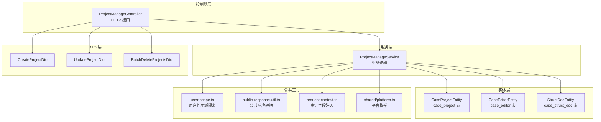
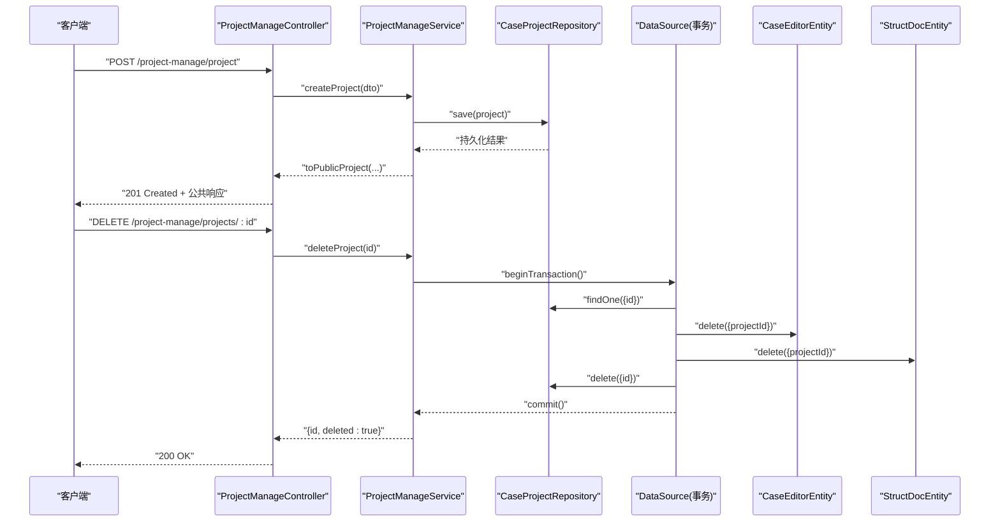
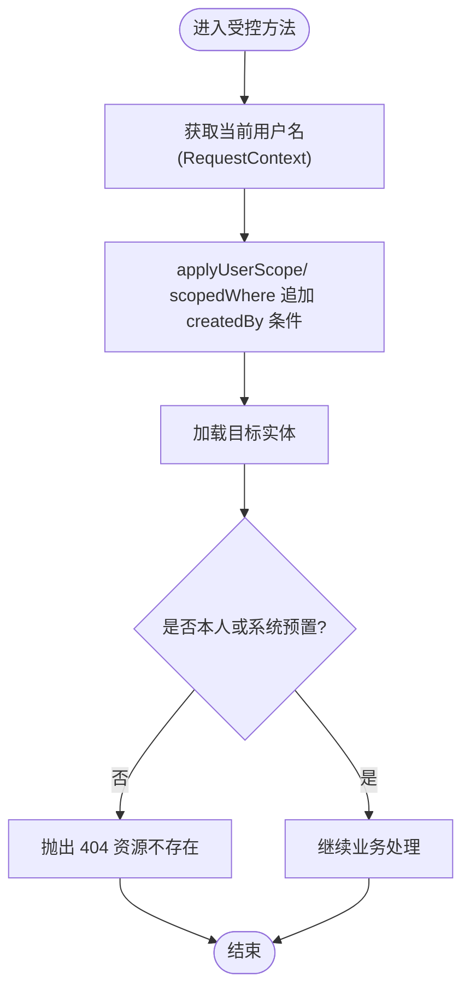
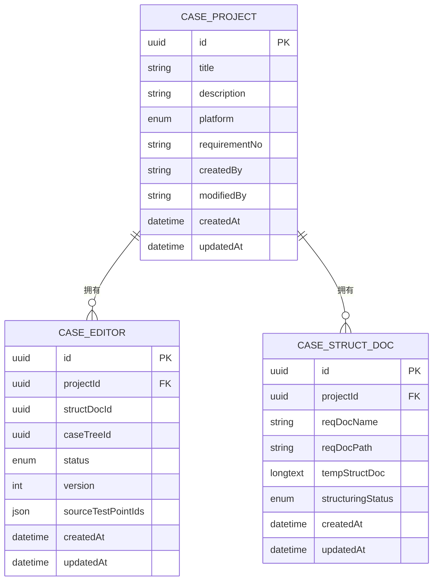
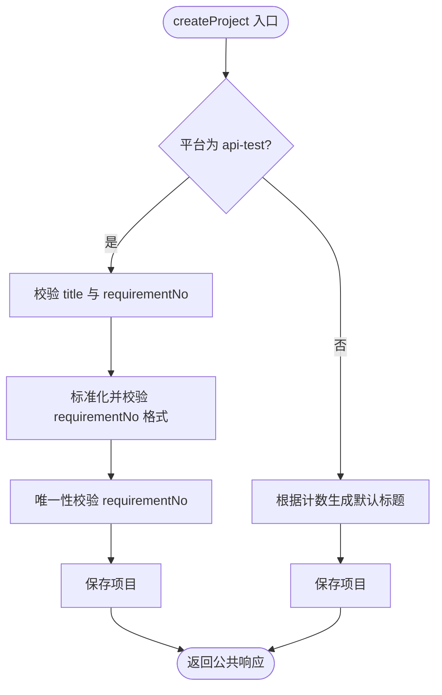
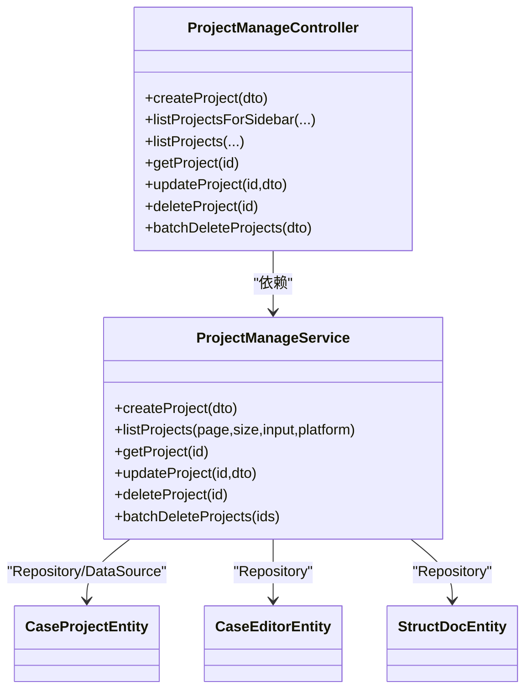

# 项目管理控制器

<cite>
**本文引用的文件**
- [apps/api/src/modules/project-manage/controller/project-manage.controller.ts](file://apps/api/src/modules/project-manage/controller/project-manage.controller.ts)
- [apps/api/src/modules/project-manage/dto/create-project.dto.ts](file://apps/api/src/modules/project-manage/dto/create-project.dto.ts)
- [apps/api/src/modules/project-manage/dto/update-project.dto.ts](file://apps/api/src/modules/project-manage/dto/update-project.dto.ts)
- [apps/api/src/modules/project-manage/dto/batch-delete-projects.dto.ts](file://apps/api/src/modules/project-manage/dto/batch-delete-projects.dto.ts)
- [apps/api/src/modules/project-manage/entity/project.entity.ts](file://apps/api/src/modules/project-manage/entity/project.entity.ts)
- [apps/api/src/modules/project-manage/service/project-manage.service.ts](file://apps/api/src/modules/project-manage/service/project-manage.service.ts)
- [apps/api/src/common/audit/user-scope.ts](file://apps/api/src/common/audit/user-scope.ts)
- [apps/api/src/common/http/public-response.util.ts](file://apps/api/src/common/http/public-response.util.ts)
- [packages/shared/src/platform.ts](file://packages/shared/src/platform.ts)
- [apps/api/src/modules/case-editor/entity/case-editor.entity.ts](file://apps/api/src/modules/case-editor/entity/case-editor.entity.ts)
- [apps/api/src/modules/struct-doc/entity/struct-doc.entity.ts](file://apps/api/src/modules/struct-doc/entity/struct-doc.entity.ts)
- [apps/api/src/common/audit/request-context.ts](file://apps/api/src/common/audit/request-context.ts)
- [apps/api/src/app.module.ts](file://apps/api/src/app.module.ts)
</cite>

## 目录
1. [简介](#简介)
2. [项目结构](#项目结构)
3. [核心组件](#核心组件)
4. [架构总览](#架构总览)
5. [详细组件分析](#详细组件分析)
6. [依赖关系分析](#依赖关系分析)
7. [性能考量](#性能考量)
8. [故障排查指南](#故障排查指南)
9. [结论](#结论)
10. [附录](#附录)

## 简介
本文件面向“项目管理控制器”的开发与维护，围绕项目创建、更新、删除与批量操作等核心接口，系统性梳理控制器逻辑、权限验证机制、批量处理策略、与项目实体的交互模式、数据验证规则以及响应格式设计，并提供可直接落地的实现参考与最佳实践，帮助在多用户协作场景下构建完整的项目生命周期管理 API。

## 项目结构
项目管理模块采用典型的分层架构：
- 控制器层：暴露 HTTP 接口，负责参数解析、Swagger 注解与基本校验。
- 服务层：封装业务逻辑，包含权限隔离、平台校验、关联数据清理、生成次数统计等。
- 实体层：映射数据库表结构，定义索引与字段约束。
- DTO 层：统一输入校验与文档注解。
- 公共工具：审计字段注入、用户作用域隔离、公共响应转换。

图表来源
- [apps/api/src/modules/project-manage/controller/project-manage.controller.ts:24-137](file://apps/api/src/modules/project-manage/controller/project-manage.controller.ts#L24-L137)
- [apps/api/src/modules/project-manage/service/project-manage.service.ts:44-53](file://apps/api/src/modules/project-manage/service/project-manage.service.ts#L44-L53)
- [apps/api/src/modules/project-manage/entity/project.entity.ts:19-58](file://apps/api/src/modules/project-manage/entity/project.entity.ts#L19-L58)
- [apps/api/src/modules/case-editor/entity/case-editor.entity.ts:32-102](file://apps/api/src/modules/case-editor/entity/case-editor.entity.ts#L32-L102)
- [apps/api/src/modules/struct-doc/entity/struct-doc.entity.ts:31-104](file://apps/api/src/modules/struct-doc/entity/struct-doc.entity.ts#L31-L104)
- [apps/api/src/modules/project-manage/dto/create-project.dto.ts:9-32](file://apps/api/src/modules/project-manage/dto/create-project.dto.ts#L9-L32)
- [apps/api/src/modules/project-manage/dto/update-project.dto.ts:8-26](file://apps/api/src/modules/project-manage/dto/update-project.dto.ts#L8-L26)
- [apps/api/src/modules/project-manage/dto/batch-delete-projects.dto.ts:8-14](file://apps/api/src/modules/project-manage/dto/batch-delete-projects.dto.ts#L8-L14)
- [apps/api/src/common/audit/user-scope.ts:14-89](file://apps/api/src/common/audit/user-scope.ts#L14-L89)
- [apps/api/src/common/http/public-response.util.ts:16-32](file://apps/api/src/common/http/public-response.util.ts#L16-L32)
- [apps/api/src/common/audit/request-context.ts:8-56](file://apps/api/src/common/audit/request-context.ts#L8-L56)
- [packages/shared/src/platform.ts:1-3](file://packages/shared/src/platform.ts#L1-L3)

章节来源
- [apps/api/src/modules/project-manage/controller/project-manage.controller.ts:1-138](file://apps/api/src/modules/project-manage/controller/project-manage.controller.ts#L1-L138)
- [apps/api/src/modules/project-manage/service/project-manage.service.ts:1-313](file://apps/api/src/modules/project-manage/service/project-manage.service.ts#L1-L313)
- [apps/api/src/modules/project-manage/entity/project.entity.ts:1-59](file://apps/api/src/modules/project-manage/entity/project.entity.ts#L1-L59)
- [apps/api/src/common/audit/user-scope.ts:1-90](file://apps/api/src/common/audit/user-scope.ts#L1-L90)
- [apps/api/src/common/http/public-response.util.ts:1-284](file://apps/api/src/common/http/public-response.util.ts#L1-L284)
- [packages/shared/src/platform.ts:1-3](file://packages/shared/src/platform.ts#L1-L3)

## 核心组件
- 控制器：提供项目创建、列表查询（含侧边栏摘要）、详情查询、更新、删除与批量删除接口；统一使用 Swagger 注解与查询/路径/请求体参数。
- 服务：实现权限隔离、平台校验、需求编号格式与唯一性校验、事务级联删除、生成次数统计与响应转换。
- 实体：定义项目表结构、索引与审计字段；关联案例编辑与结构化文档实体。
- DTO：定义输入校验规则与示例，确保接口契约清晰。
- 公共工具：用户作用域隔离、审计字段注入、公共响应转换。

章节来源
- [apps/api/src/modules/project-manage/controller/project-manage.controller.ts:24-137](file://apps/api/src/modules/project-manage/controller/project-manage.controller.ts#L24-L137)
- [apps/api/src/modules/project-manage/service/project-manage.service.ts:44-312](file://apps/api/src/modules/project-manage/service/project-manage.service.ts#L44-L312)
- [apps/api/src/modules/project-manage/entity/project.entity.ts:19-58](file://apps/api/src/modules/project-manage/entity/project.entity.ts#L19-L58)
- [apps/api/src/modules/project-manage/dto/create-project.dto.ts:9-32](file://apps/api/src/modules/project-manage/dto/create-project.dto.ts#L9-L32)
- [apps/api/src/modules/project-manage/dto/update-project.dto.ts:8-26](file://apps/api/src/modules/project-manage/dto/update-project.dto.ts#L8-L26)
- [apps/api/src/modules/project-manage/dto/batch-delete-projects.dto.ts:8-14](file://apps/api/src/modules/project-manage/dto/batch-delete-projects.dto.ts#L8-L14)
- [apps/api/src/common/audit/user-scope.ts:14-89](file://apps/api/src/common/audit/user-scope.ts#L14-L89)
- [apps/api/src/common/http/public-response.util.ts:16-32](file://apps/api/src/common/http/public-response.util.ts#L16-L32)
- [apps/api/src/common/audit/request-context.ts:8-56](file://apps/api/src/common/audit/request-context.ts#L8-L56)

## 架构总览
控制器通过依赖注入获得服务实例，服务层基于 TypeORM 完成数据库操作，结合用户作用域与审计上下文实现安全隔离与审计追踪。批量删除与级联删除在事务内执行，保证一致性。

图表来源
- [apps/api/src/modules/project-manage/controller/project-manage.controller.ts:32-136](file://apps/api/src/modules/project-manage/controller/project-manage.controller.ts#L32-L136)
- [apps/api/src/modules/project-manage/service/project-manage.service.ts:238-281](file://apps/api/src/modules/project-manage/service/project-manage.service.ts#L238-L281)
- [apps/api/src/modules/case-editor/entity/case-editor.entity.ts:32-102](file://apps/api/src/modules/case-editor/entity/case-editor.entity.ts#L32-L102)
- [apps/api/src/modules/struct-doc/entity/struct-doc.entity.ts:31-104](file://apps/api/src/modules/struct-doc/entity/struct-doc.entity.ts#L31-L104)

## 详细组件分析

### 控制器接口与路由
- 创建项目：POST /project-manage/project
- 侧边栏项目列表：GET /project-manage/projects/sidebar（支持平台、分页、关键字）
- 项目列表：GET /project-manage/projects（支持平台、分页、关键字）
- 获取项目详情：GET /project-manage/projects/:projectId
- 更新项目：PATCH /project-manage/projects/:projectId
- 删除项目：DELETE /project-manage/projects/:projectId
- 批量删除项目：POST /project-manage/projects/batch-delete

章节来源
- [apps/api/src/modules/project-manage/controller/project-manage.controller.ts:31-136](file://apps/api/src/modules/project-manage/controller/project-manage.controller.ts#L31-L136)

### 数据验证与 DTO 设计
- CreateProjectDto
  - 字段：title、description、requirementNo、platform
  - 规则：字符串、最大长度限制、platform 枚举校验
  - 平台缺省为 case-forge；api-test 平台要求必填 title 与符合格式的 requirementNo
- UpdateProjectDto
  - 字段：title、description、requirementNo（均可选）
  - 规则：字符串、最大长度限制
- BatchDeleteProjectsDto
  - 字段：ids（非空数组，元素为字符串）

章节来源
- [apps/api/src/modules/project-manage/dto/create-project.dto.ts:9-32](file://apps/api/src/modules/project-manage/dto/create-project.dto.ts#L9-L32)
- [apps/api/src/modules/project-manage/dto/update-project.dto.ts:8-26](file://apps/api/src/modules/project-manage/dto/update-project.dto.ts#L8-L26)
- [apps/api/src/modules/project-manage/dto/batch-delete-projects.dto.ts:8-14](file://apps/api/src/modules/project-manage/dto/batch-delete-projects.dto.ts#L8-L14)
- [packages/shared/src/platform.ts:1-3](file://packages/shared/src/platform.ts#L1-L3)

### 权限验证与用户作用域
- 用户作用域：所有查询均自动追加 createdBy = 当前用户，确保资源隔离
- 资源归属校验：findOwnedProject + assertOwned，避免越权访问与信息泄露
- 审计字段：创建/更新时自动注入 createdBy / modifiedBy
- 系统预置资源：SYSTEM_OWNER = "system"，允许公开读取

图表来源
- [apps/api/src/common/audit/user-scope.ts:14-89](file://apps/api/src/common/audit/user-scope.ts#L14-L89)
- [apps/api/src/common/audit/request-context.ts:8-56](file://apps/api/src/common/audit/request-context.ts#L8-L56)

章节来源
- [apps/api/src/common/audit/user-scope.ts:14-89](file://apps/api/src/common/audit/user-scope.ts#L14-L89)
- [apps/api/src/common/audit/request-context.ts:8-56](file://apps/api/src/common/audit/request-context.ts#L8-L56)

### 项目实体与关联关系
- CaseProjectEntity：项目主表，包含平台、需求编号、审计字段与索引
- CaseEditorEntity：案例编辑运行记录，外键指向项目，用于统计生成次数
- StructDocEntity：结构化文档记录，外键指向项目，用于级联删除

图表来源
- [apps/api/src/modules/project-manage/entity/project.entity.ts:19-58](file://apps/api/src/modules/project-manage/entity/project.entity.ts#L19-L58)
- [apps/api/src/modules/case-editor/entity/case-editor.entity.ts:32-102](file://apps/api/src/modules/case-editor/entity/case-editor.entity.ts#L32-L102)
- [apps/api/src/modules/struct-doc/entity/struct-doc.entity.ts:31-104](file://apps/api/src/modules/struct-doc/entity/struct-doc.entity.ts#L31-L104)

章节来源
- [apps/api/src/modules/project-manage/entity/project.entity.ts:19-58](file://apps/api/src/modules/project-manage/entity/project.entity.ts#L19-L58)
- [apps/api/src/modules/case-editor/entity/case-editor.entity.ts:32-102](file://apps/api/src/modules/case-editor/entity/case-editor.entity.ts#L32-L102)
- [apps/api/src/modules/struct-doc/entity/struct-doc.entity.ts:31-104](file://apps/api/src/modules/struct-doc/entity/struct-doc.entity.ts#L31-L104)

### 业务流程与处理策略

#### 创建项目
- 平台为 api-test 时，title 与 requirementNo 必填且 requirementNo 格式校验
- 平台为 api-test 时，requirementNo 唯一性校验
- 未传 title 时，自动生成默认名称
- 审计字段自动注入

图表来源
- [apps/api/src/modules/project-manage/service/project-manage.service.ts:59-93](file://apps/api/src/modules/project-manage/service/project-manage.service.ts#L59-L93)
- [apps/api/src/common/audit/request-context.ts:53-56](file://apps/api/src/common/audit/request-context.ts#L53-L56)

章节来源
- [apps/api/src/modules/project-manage/service/project-manage.service.ts:59-93](file://apps/api/src/modules/project-manage/service/project-manage.service.ts#L59-L93)
- [apps/api/src/common/audit/request-context.ts:53-56](file://apps/api/src/common/audit/request-context.ts#L53-L56)

#### 更新项目
- api-test 平台：title 与 requirementNo 的必填与格式校验
- requirementNo 更新时进行唯一性校验（排除自身）
- 其他平台：title 与 requirementNo 支持可选更新

章节来源
- [apps/api/src/modules/project-manage/service/project-manage.service.ts:173-212](file://apps/api/src/modules/project-manage/service/project-manage.service.ts#L173-L212)

#### 删除与批量删除
- 单个删除：事务内先删除关联数据（案例编辑、结构化文档），再删除项目
- 批量删除：去重后逐个执行相同流程，忽略不存在的 ID
- 删除成功返回 { id(s), deleted: true }

章节来源
- [apps/api/src/modules/project-manage/service/project-manage.service.ts:238-281](file://apps/api/src/modules/project-manage/service/project-manage.service.ts#L238-L281)

#### 列表与详情统计
- 列表查询：按平台过滤、按 updatedAt 降序、支持关键字模糊匹配
- 详情查询：返回项目信息 + 生成次数
- 生成次数：通过案例编辑表按项目分组统计

章节来源
- [apps/api/src/modules/project-manage/service/project-manage.service.ts:110-166](file://apps/api/src/modules/project-manage/service/project-manage.service.ts#L110-L166)
- [apps/api/src/modules/project-manage/service/project-manage.service.ts:283-303](file://apps/api/src/modules/project-manage/service/project-manage.service.ts#L283-L303)

### 响应格式设计
- 统一使用公共响应转换 toPublicProject，输出字段包括：id、title、description、platform、requirementNo、createdAt、updatedAt
- 列表项额外包含 generationCount（生成次数）
- 侧边栏摘要列表仅返回必要字段，便于前端快速渲染

章节来源
- [apps/api/src/common/http/public-response.util.ts:16-32](file://apps/api/src/common/http/public-response.util.ts#L16-L32)
- [apps/api/src/modules/project-manage/controller/project-manage.controller.ts:67-78](file://apps/api/src/modules/project-manage/controller/project-manage.controller.ts#L67-L78)

## 依赖关系分析
- 控制器依赖服务：通过 @Inject(ProjectManageService) 注入
- 服务依赖仓储与数据源：TypeORM Repository 与 DataSource(transaction)
- 服务依赖公共工具：用户作用域、审计字段、公共响应转换
- 实体间外键关系：项目 -> 案例编辑；项目 -> 结构化文档

图表来源
- [apps/api/src/modules/project-manage/controller/project-manage.controller.ts:24-137](file://apps/api/src/modules/project-manage/controller/project-manage.controller.ts#L24-L137)
- [apps/api/src/modules/project-manage/service/project-manage.service.ts:44-53](file://apps/api/src/modules/project-manage/service/project-manage.service.ts#L44-L53)

章节来源
- [apps/api/src/modules/project-manage/controller/project-manage.controller.ts:24-137](file://apps/api/src/modules/project-manage/controller/project-manage.controller.ts#L24-L137)
- [apps/api/src/modules/project-manage/service/project-manage.service.ts:44-53](file://apps/api/src/modules/project-manage/service/project-manage.service.ts#L44-L53)

## 性能考量
- 查询优化
  - 项目列表按平台与更新时间建立复合索引，减少扫描范围
  - 使用 skip/take 分页，避免一次性加载大量数据
- 统计优化
  - 生成次数通过一次分组聚合查询获取，避免 N+1 查询
- 写入优化
  - 删除操作在事务内批量执行，减少锁竞争
- 缓存建议
  - 对高频侧边栏摘要可引入缓存（需考虑数据一致性）

章节来源
- [apps/api/src/modules/project-manage/entity/project.entity.ts:20-26](file://apps/api/src/modules/project-manage/entity/project.entity.ts#L20-L26)
- [apps/api/src/modules/project-manage/service/project-manage.service.ts:139-149](file://apps/api/src/modules/project-manage/service/project-manage.service.ts#L139-L149)
- [apps/api/src/modules/project-manage/service/project-manage.service.ts:291-303](file://apps/api/src/modules/project-manage/service/project-manage.service.ts#L291-L303)

## 故障排查指南
- 参数校验失败
  - 检查 DTO 字段长度与枚举值是否符合规范
  - 确认平台参数与业务规则一致
- 需求编号冲突
  - api-test 平台更新时，若 requirementNo 重复会抛出异常
- 资源不存在或越权
  - 用户作用域隔离导致 404，确认当前用户与资源创建者一致
- 删除失败
  - 确认项目是否存在、是否被其他模块引用
  - 检查事务是否正常提交

章节来源
- [apps/api/src/modules/project-manage/dto/create-project.dto.ts:9-32](file://apps/api/src/modules/project-manage/dto/create-project.dto.ts#L9-L32)
- [apps/api/src/modules/project-manage/dto/update-project.dto.ts:8-26](file://apps/api/src/modules/project-manage/dto/update-project.dto.ts#L8-L26)
- [apps/api/src/modules/project-manage/service/project-manage.service.ts:214-232](file://apps/api/src/modules/project-manage/service/project-manage.service.ts#L214-L232)
- [apps/api/src/common/audit/user-scope.ts:48-89](file://apps/api/src/common/audit/user-scope.ts#L48-L89)

## 结论
项目管理控制器通过清晰的分层设计与严格的权限隔离，实现了多平台、多用户的项目生命周期管理。配合统一的响应格式与完善的校验规则，能够稳定支撑案例生成与接口测试两大平台的协作场景。建议在生产环境中进一步完善缓存策略与监控告警，持续提升性能与可观测性。

## 附录
- 应用模块集成：AppModule 导入 ProjectManageModule，并注册用户上下文中间件与访问日志中间件，确保审计与日志贯穿全链路。

章节来源
- [apps/api/src/app.module.ts:21-47](file://apps/api/src/app.module.ts#L21-L47)