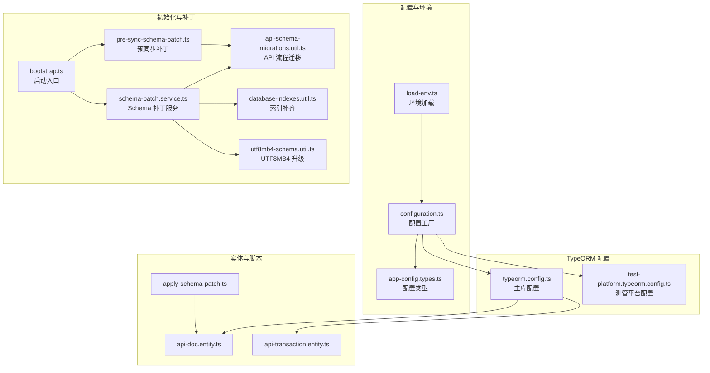
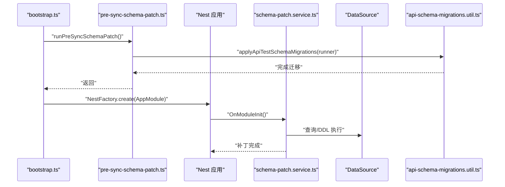
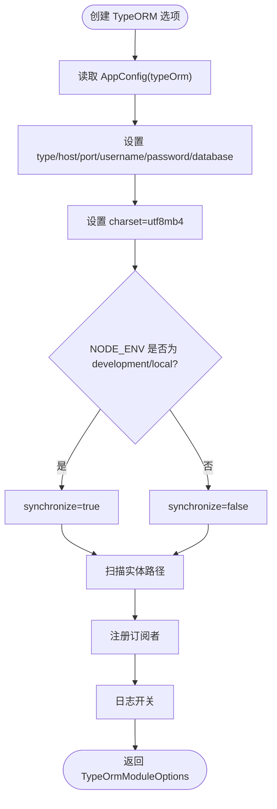
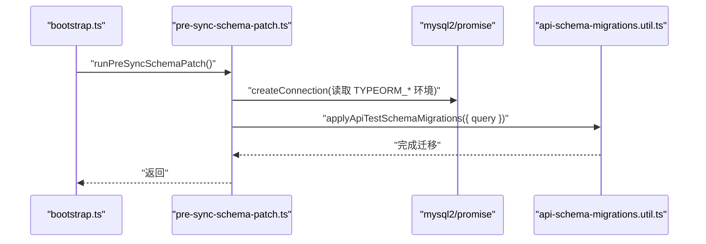
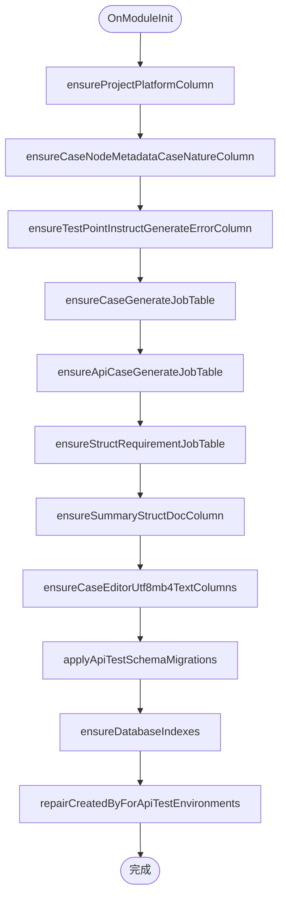
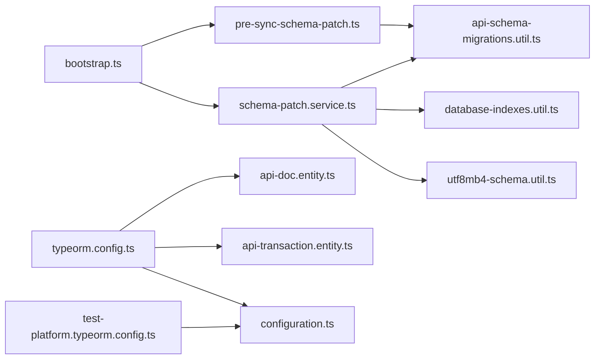

# TypeORM 配置与连接管理

<cite>
**本文引用的文件**
- [apps/api/src/common/typeorm/typeorm.config.ts](file://apps/api/src/common/typeorm/typeorm.config.ts)
- [apps/api/src/common/typeorm/pre-sync-schema-patch.ts](file://apps/api/src/common/typeorm/pre-sync-schema-patch.ts)
- [apps/api/src/common/typeorm/schema-patch.service.ts](file://apps/api/src/common/typeorm/schema-patch.service.ts)
- [apps/api/src/common/typeorm/api-schema-migrations.util.ts](file://apps/api/src/common/typeorm/api-schema-migrations.util.ts)
- [apps/api/src/common/typeorm/database-indexes.util.ts](file://apps/api/src/common/typeorm/database-indexes.util.ts)
- [apps/api/src/common/typeorm/utf8mb4-schema.util.ts](file://apps/api/src/common/typeorm/utf8mb4-schema.util.ts)
- [apps/api/src/common/test-platform/test-platform.typeorm.config.ts](file://apps/api/src/common/test-platform/test-platform.typeorm.config.ts)
- [apps/api/src/config/configuration.ts](file://apps/api/src/config/configuration.ts)
- [apps/api/src/config/app-config.types.ts](file://apps/api/src/config/app-config.types.ts)
- [apps/api/src/config/load-env.ts](file://apps/api/src/config/load-env.ts)
- [apps/api/src/bootstrap.ts](file://apps/api/src/bootstrap.ts)
- [apps/api/src/modules/api-test/entity/api-doc.entity.ts](file://apps/api/src/modules/api-test/entity/api-doc.entity.ts)
- [apps/api/src/modules/api-test/entity/api-transaction.entity.ts](file://apps/api/src/modules/api-test/entity/api-transaction.entity.ts)
- [apps/api/scripts/apply-schema-patch.ts](file://apps/api/scripts/apply-schema-patch.ts)
</cite>

## 目录
1. [简介](#简介)
2. [项目结构](#项目结构)
3. [核心组件](#核心组件)
4. [架构总览](#架构总览)
5. [详细组件分析](#详细组件分析)
6. [依赖关系分析](#依赖关系分析)
7. [性能考量](#性能考量)
8. [故障排查指南](#故障排查指南)
9. [结论](#结论)
10. [附录](#附录)

## 简介
本文件面向 TypeORM 的配置与连接管理，系统性梳理数据库连接配置、连接池参数调优、连接生命周期管理、数据库初始化流程、Schema 同步策略与迁移机制，并深入解析“预同步补丁”的作用与实现原理。同时给出连接超时、重连机制与错误处理的最佳实践，以及可直接参考的配置示例与常见问题解决方案。

## 项目结构
本项目采用多模块分层组织，TypeORM 相关逻辑集中在 common/typeorm 与 common/test-platform 下，配合配置工厂与环境加载工具，形成统一的连接与初始化流程。

图表来源
- [apps/api/src/config/configuration.ts:1-49](file://apps/api/src/config/configuration.ts#L1-L49)
- [apps/api/src/config/app-config.types.ts:1-45](file://apps/api/src/config/app-config.types.ts#L1-L45)
- [apps/api/src/common/typeorm/typeorm.config.ts:1-43](file://apps/api/src/common/typeorm/typeorm.config.ts#L1-L43)
- [apps/api/src/common/test-platform/test-platform.typeorm.config.ts:1-31](file://apps/api/src/common/test-platform/test-platform.typeorm.config.ts#L1-L31)
- [apps/api/src/bootstrap.ts:1-64](file://apps/api/src/bootstrap.ts#L1-L64)
- [apps/api/src/common/typeorm/pre-sync-schema-patch.ts:1-45](file://apps/api/src/common/typeorm/pre-sync-schema-patch.ts#L1-L45)
- [apps/api/src/common/typeorm/schema-patch.service.ts:1-269](file://apps/api/src/common/typeorm/schema-patch.service.ts#L1-L269)
- [apps/api/src/common/typeorm/api-schema-migrations.util.ts:1-291](file://apps/api/src/common/typeorm/api-schema-migrations.util.ts#L1-L291)
- [apps/api/src/common/typeorm/database-indexes.util.ts:1-239](file://apps/api/src/common/typeorm/database-indexes.util.ts#L1-L239)
- [apps/api/src/common/typeorm/utf8mb4-schema.util.ts:1-91](file://apps/api/src/common/typeorm/utf8mb4-schema.util.ts#L1-L91)
- [apps/api/src/modules/api-test/entity/api-doc.entity.ts:1-86](file://apps/api/src/modules/api-test/entity/api-doc.entity.ts#L1-L86)
- [apps/api/src/modules/api-test/entity/api-transaction.entity.ts:1-56](file://apps/api/src/modules/api-test/entity/api-transaction.entity.ts#L1-L56)
- [apps/api/scripts/apply-schema-patch.ts:1-56](file://apps/api/scripts/apply-schema-patch.ts#L1-L56)

章节来源
- [apps/api/src/common/typeorm/typeorm.config.ts:1-43](file://apps/api/src/common/typeorm/typeorm.config.ts#L1-L43)
- [apps/api/src/common/test-platform/test-platform.typeorm.config.ts:1-31](file://apps/api/src/common/test-platform/test-platform.typeorm.config.ts#L1-L31)
- [apps/api/src/config/configuration.ts:1-49](file://apps/api/src/config/configuration.ts#L1-L49)
- [apps/api/src/config/app-config.types.ts:1-45](file://apps/api/src/config/app-config.types.ts#L1-L45)
- [apps/api/src/config/load-env.ts:1-55](file://apps/api/src/config/load-env.ts#L1-L55)
- [apps/api/src/bootstrap.ts:1-64](file://apps/api/src/bootstrap.ts#L1-L64)

## 核心组件
- 主库连接配置工厂：基于环境变量与配置工厂生成 TypeORM 选项，启用 utf8mb4、按环境决定是否同步、扫描实体与订阅者。
- 测管平台连接配置工厂：独立的 MySQL 连接，禁用同步，显式声明实体集合。
- 预同步补丁：在应用启动前执行，确保 API 文档相关表结构满足后续 TypeORM 同步要求，避免外键约束冲突。
- Schema 补丁服务：应用模块初始化阶段执行幂等补丁，补齐缺失列、表与索引，修复历史数据字段。
- API 流程迁移工具：在同步前对 api_doc、api_endpoint、api_transaction 等表进行列/索引/唯一键调整。
- 索引补齐工具：幂等补齐热点查询索引，清理冗余索引。
- UTF8MB4 升级工具：将指定文本列字符集升级为 utf8mb4，保留类型与空值约束。
- 环境加载与配置工厂：从 .env 文件加载环境变量，提供 typeOrm 与 typeOrmTest 两套连接配置。

章节来源
- [apps/api/src/common/typeorm/typeorm.config.ts:15-42](file://apps/api/src/common/typeorm/typeorm.config.ts#L15-L42)
- [apps/api/src/common/test-platform/test-platform.typeorm.config.ts:11-30](file://apps/api/src/common/test-platform/test-platform.typeorm.config.ts#L11-L30)
- [apps/api/src/common/typeorm/pre-sync-schema-patch.ts:7-31](file://apps/api/src/common/typeorm/pre-sync-schema-patch.ts#L7-L31)
- [apps/api/src/common/typeorm/schema-patch.service.ts:16-28](file://apps/api/src/common/typeorm/schema-patch.service.ts#L16-L28)
- [apps/api/src/common/typeorm/api-schema-migrations.util.ts:57-67](file://apps/api/src/common/typeorm/api-schema-migrations.util.ts#L57-L67)
- [apps/api/src/common/typeorm/database-indexes.util.ts:202-212](file://apps/api/src/common/typeorm/database-indexes.util.ts#L202-L212)
- [apps/api/src/common/typeorm/utf8mb4-schema.util.ts:64-90](file://apps/api/src/common/typeorm/utf8mb4-schema.util.ts#L64-L90)
- [apps/api/src/config/configuration.ts:7-25](file://apps/api/src/config/configuration.ts#L7-L25)

## 架构总览
下图展示从启动到连接建立、预同步补丁执行、Schema 补丁服务运行的完整流程。

图表来源
- [apps/api/src/bootstrap.ts:18-22](file://apps/api/src/bootstrap.ts#L18-L22)
- [apps/api/src/common/typeorm/pre-sync-schema-patch.ts:7-31](file://apps/api/src/common/typeorm/pre-sync-schema-patch.ts#L7-L31)
- [apps/api/src/common/typeorm/schema-patch.service.ts:16-28](file://apps/api/src/common/typeorm/schema-patch.service.ts#L16-L28)
- [apps/api/src/common/typeorm/api-schema-migrations.util.ts:57-67](file://apps/api/src/common/typeorm/api-schema-migrations.util.ts#L57-L67)

## 详细组件分析

### 组件一：主库连接配置与初始化
- 配置来源：通过配置工厂读取环境变量，设置主机、端口、用户名、密码、数据库名、字符集、是否同步、实体扫描路径、订阅者与日志开关。
- 初始化策略：开发/本地环境启用同步；生产环境关闭同步，依赖补丁与迁移保证结构一致性。
- 实体与索引：实体文件中使用装饰器声明索引与唯一键，确保后续同步与补丁协同工作。

图表来源
- [apps/api/src/common/typeorm/typeorm.config.ts:15-42](file://apps/api/src/common/typeorm/typeorm.config.ts#L15-L42)
- [apps/api/src/config/configuration.ts:7-16](file://apps/api/src/config/configuration.ts#L7-L16)
- [apps/api/src/modules/api-test/entity/api-doc.entity.ts:24-26](file://apps/api/src/modules/api-test/entity/api-doc.entity.ts#L24-L26)
- [apps/api/src/modules/api-test/entity/api-transaction.entity.ts:13-14](file://apps/api/src/modules/api-test/entity/api-transaction.entity.ts#L13-L14)

章节来源
- [apps/api/src/common/typeorm/typeorm.config.ts:15-42](file://apps/api/src/common/typeorm/typeorm.config.ts#L15-L42)
- [apps/api/src/config/configuration.ts:7-16](file://apps/api/src/config/configuration.ts#L7-L16)
- [apps/api/src/modules/api-test/entity/api-doc.entity.ts:24-26](file://apps/api/src/modules/api-test/entity/api-doc.entity.ts#L24-L26)
- [apps/api/src/modules/api-test/entity/api-transaction.entity.ts:13-14](file://apps/api/src/modules/api-test/entity/api-transaction.entity.ts#L13-L14)

### 组件二：测管平台连接配置
- 独立配置：提供 typeOrmTest，便于与主库隔离，避免同步影响。
- 禁用同步：生产/测试库均禁用同步，通过补丁与迁移维护结构。
- 显式实体：集中声明测管平台相关实体，降低扫描成本。

章节来源
- [apps/api/src/common/test-platform/test-platform.typeorm.config.ts:11-30](file://apps/api/src/common/test-platform/test-platform.typeorm.config.ts#L11-L30)
- [apps/api/src/config/configuration.ts:17-25](file://apps/api/src/config/configuration.ts#L17-L25)

### 组件三：预同步补丁（启动前）
- 触发时机：应用启动入口在创建 Nest 应用前执行预同步补丁。
- 目标：在 TypeORM 同步前，先补齐 api_doc 等表的索引与唯一键，避免同步过程中因外键依赖导致的删除/重建冲突。
- 执行方式：使用独立的 MySQL 连接，调用迁移工具执行幂等 DDL。

图表来源
- [apps/api/src/bootstrap.ts:18-22](file://apps/api/src/bootstrap.ts#L18-L22)
- [apps/api/src/common/typeorm/pre-sync-schema-patch.ts:7-31](file://apps/api/src/common/typeorm/pre-sync-schema-patch.ts#L7-L31)
- [apps/api/src/common/typeorm/api-schema-migrations.util.ts:57-67](file://apps/api/src/common/typeorm/api-schema-migrations.util.ts#L57-L67)

章节来源
- [apps/api/src/bootstrap.ts:18-22](file://apps/api/src/bootstrap.ts#L18-L22)
- [apps/api/src/common/typeorm/pre-sync-schema-patch.ts:7-31](file://apps/api/src/common/typeorm/pre-sync-schema-patch.ts#L7-L31)

### 组件四：Schema 补丁服务（模块初始化）
- 生命周期：实现 OnModuleInit，在应用模块初始化时执行。
- 功能清单：补齐缺失列/表、修复历史数据字段、执行索引补齐与 UTF8MB4 升级。
- 幂等性：每个补丁检查目标是否存在，避免重复执行引发异常。

图表来源
- [apps/api/src/common/typeorm/schema-patch.service.ts:16-28](file://apps/api/src/common/typeorm/schema-patch.service.ts#L16-L28)
- [apps/api/src/common/typeorm/utf8mb4-schema.util.ts:64-90](file://apps/api/src/common/typeorm/utf8mb4-schema.util.ts#L64-L90)
- [apps/api/src/common/typeorm/api-schema-migrations.util.ts:57-67](file://apps/api/src/common/typeorm/api-schema-migrations.util.ts#L57-L67)
- [apps/api/src/common/typeorm/database-indexes.util.ts:202-212](file://apps/api/src/common/typeorm/database-indexes.util.ts#L202-L212)

章节来源
- [apps/api/src/common/typeorm/schema-patch.service.ts:16-28](file://apps/api/src/common/typeorm/schema-patch.service.ts#L16-L28)

### 组件五：API 流程迁移工具
- 目标表：api_doc、api_endpoint、api_transaction、api_test_case、执行平台相关表。
- 关键步骤：对 UUID 列字符集对齐、补齐缺失列、创建/调整索引、删除冲突唯一键、新增执行平台相关表与列。
- 顺序保障：先建项目索引，再删除旧唯一键，避免外键依赖导致的删除失败。

章节来源
- [apps/api/src/common/typeorm/api-schema-migrations.util.ts:57-67](file://apps/api/src/common/typeorm/api-schema-migrations.util.ts#L57-L67)
- [apps/api/src/common/typeorm/api-schema-migrations.util.ts:99-139](file://apps/api/src/common/typeorm/api-schema-migrations.util.ts#L99-L139)
- [apps/api/src/common/typeorm/api-schema-migrations.util.ts:182-290](file://apps/api/src/common/typeorm/api-schema-migrations.util.ts#L182-L290)

### 组件六：索引补齐与冗余索引清理
- 热点索引：针对高频查询字段补齐索引，提升查询性能。
- 冗余索引：识别并安全删除冗余索引，减少写入开销。
- 安全删除：对外键约束依赖的索引进行保护，避免删除失败。

章节来源
- [apps/api/src/common/typeorm/database-indexes.util.ts:202-212](file://apps/api/src/common/typeorm/database-indexes.util.ts#L202-L212)
- [apps/api/src/common/typeorm/database-indexes.util.ts:56-76](file://apps/api/src/common/typeorm/database-indexes.util.ts#L56-L76)

### 组件七：UTF8MB4 升级工具
- 单列升级：读取列元信息，保留类型与空值约束，将字符集升级为 utf8mb4。
- 批量升级：对案例编辑相关文本列执行批量升级，支持生僻字显示。

章节来源
- [apps/api/src/common/typeorm/utf8mb4-schema.util.ts:13-47](file://apps/api/src/common/typeorm/utf8mb4-schema.util.ts#L13-L47)
- [apps/api/src/common/typeorm/utf8mb4-schema.util.ts:64-90](file://apps/api/src/common/typeorm/utf8mb4-schema.util.ts#L64-L90)

### 组件八：环境加载与配置工厂
- 环境加载：按 NODE_ENV 优先级加载 .env 文件，支持注释行过滤。
- 配置工厂：提供 typeOrm 与 typeOrmTest 两套连接配置，支持测试库隔离。
- 启动入口：在应用启动前加载环境变量，确保配置可用。

章节来源
- [apps/api/src/config/load-env.ts:32-54](file://apps/api/src/config/load-env.ts#L32-L54)
- [apps/api/src/config/configuration.ts:7-25](file://apps/api/src/config/configuration.ts#L7-L25)
- [apps/api/src/bootstrap.ts:9](file://apps/api/src/bootstrap.ts#L9)

## 依赖关系分析
- 启动依赖：bootstrap.ts 依赖 pre-sync-schema-patch.ts；pre-sync-schema-patch.ts 依赖 api-schema-migrations.util.ts。
- 补丁依赖：schema-patch.service.ts 依赖 DataSource 与多个工具模块（迁移、索引、UTF8MB4）。
- 配置依赖：typeorm.config.ts 与 test-platform.typeorm.config.ts 依赖配置工厂与类型定义。
- 实体依赖：实体文件声明索引与唯一键，与迁移工具中的索引/唯一键调整保持一致。

图表来源
- [apps/api/src/bootstrap.ts:18-22](file://apps/api/src/bootstrap.ts#L18-L22)
- [apps/api/src/common/typeorm/pre-sync-schema-patch.ts:7-31](file://apps/api/src/common/typeorm/pre-sync-schema-patch.ts#L7-L31)
- [apps/api/src/common/typeorm/schema-patch.service.ts:14-28](file://apps/api/src/common/typeorm/schema-patch.service.ts#L14-L28)
- [apps/api/src/common/typeorm/api-schema-migrations.util.ts:57-67](file://apps/api/src/common/typeorm/api-schema-migrations.util.ts#L57-L67)
- [apps/api/src/common/typeorm/database-indexes.util.ts:202-212](file://apps/api/src/common/typeorm/database-indexes.util.ts#L202-L212)
- [apps/api/src/common/typeorm/utf8mb4-schema.util.ts:64-90](file://apps/api/src/common/typeorm/utf8mb4-schema.util.ts#L64-L90)
- [apps/api/src/common/typeorm/typeorm.config.ts:15-42](file://apps/api/src/common/typeorm/typeorm.config.ts#L15-L42)
- [apps/api/src/common/test-platform/test-platform.typeorm.config.ts:11-30](file://apps/api/src/common/test-platform/test-platform.typeorm.config.ts#L11-L30)
- [apps/api/src/modules/api-test/entity/api-doc.entity.ts:24-26](file://apps/api/src/modules/api-test/entity/api-doc.entity.ts#L24-L26)
- [apps/api/src/modules/api-test/entity/api-transaction.entity.ts:13-14](file://apps/api/src/modules/api-test/entity/api-transaction.entity.ts#L13-L14)
- [apps/api/src/config/configuration.ts:7-25](file://apps/api/src/config/configuration.ts#L7-L25)

## 性能考量
- 索引优化：通过 database-indexes.util.ts 幂等补齐热点查询索引，减少慢查询；同时清理冗余索引，降低写入放大。
- 字符集优化：utf8mb4-schema.util.ts 将文本列升级为 utf8mb4，避免存储生僻字符时的编码问题与回退成本。
- 同步策略：生产/测试库禁用同步，通过补丁与迁移保证结构一致性，避免频繁同步带来的锁与阻塞。
- 连接池参数：当前仓库未显式配置 TypeORM 连接池参数。建议结合业务并发与数据库资源评估，设置合适的连接池大小、超时与重试策略（见“最佳实践”）。

## 故障排查指南
- 外键约束冲突（删除唯一键失败）
  - 现象：同步或迁移过程中删除唯一键报错。
  - 原因：存在外键依赖。
  - 处理：先创建必要索引，再删除唯一键，遵循迁移工具中的顺序。
  - 参考：API 流程迁移工具对 api_doc 的索引与唯一键处理。
  
  章节来源
  - [apps/api/src/common/typeorm/api-schema-migrations.util.ts:123-139](file://apps/api/src/common/typeorm/api-schema-migrations.util.ts#L123-L139)

- 索引重复或冲突
  - 现象：创建索引时报重复键名。
  - 处理：幂等工具会捕获重复键名异常并忽略，确保补丁可重复执行。
  - 参考：索引补齐与冗余索引清理工具。
  
  章节来源
  - [apps/api/src/common/typeorm/database-indexes.util.ts:46-53](file://apps/api/src/common/typeorm/database-indexes.util.ts#L46-L53)
  - [apps/api/src/common/typeorm/database-indexes.util.ts:67-75](file://apps/api/src/common/typeorm/database-indexes.util.ts#L67-L75)

- 字段字符集不一致导致排序/比较异常
  - 现象：UUID 或文本列字符集不一致，影响外键或排序。
  - 处理：使用 UTF8MB4 升级工具对列字符集进行对齐与升级。
  
  章节来源
  - [apps/api/src/common/typeorm/utf8mb4-schema.util.ts:13-47](file://apps/api/src/common/typeorm/utf8mb4-schema.util.ts#L13-L47)

- 启动后结构缺失
  - 现象：应用启动后发现缺失列/表/索引。
  - 处理：Schema 补丁服务会在模块初始化时自动补齐；也可使用一次性脚本进行修复。
  - 参考：Schema 补丁服务与一次性修复脚本。
  
  章节来源
  - [apps/api/src/common/typeorm/schema-patch.service.ts:16-28](file://apps/api/src/common/typeorm/schema-patch.service.ts#L16-L28)
  - [apps/api/scripts/apply-schema-patch.ts:10-50](file://apps/api/scripts/apply-schema-patch.ts#L10-L50)

## 结论
本项目通过“启动前预同步补丁 + 模块初始化补丁服务 + 幂等迁移与索引补齐 + UTF8MB4 升级”的组合策略，实现了在生产/测试库禁用同步的前提下，保证数据库结构的一致性与性能。配合独立的测管平台连接配置，进一步提升了系统的可维护性与扩展性。建议在生产环境中补充连接池参数与监控告警，持续优化索引与查询计划。

## 附录

### 配置示例与最佳实践
- 环境变量示例（摘自配置工厂）
  - 主库连接：TYPEORM_HOST、TYPEORM_PORT、TYPEORM_USERNAME、TYPEORM_PASSWORD、TYPEORM_DATABASE
  - 测试库连接：TYPEORM_TEST_HOST、TYPEORM_TEST_PORT、TYPEORM_TEST_USERNAME、TYPEORM_TEST_PASSWORD、TYPEORM_TEST_DATABASE
  - 端口与环境：PORT、NODE_ENV
  - 参考路径：[apps/api/src/config/configuration.ts:7-25](file://apps/api/src/config/configuration.ts#L7-L25)

- 连接池参数建议（TypeORM）
  - 建议在 TypeOrmModule.forRootAsync 中增加连接池参数，如：
    - maxQueryExecutionTime：长查询告警阈值
    - replication：主从复制配置
    - poolSize：连接池大小
    - acquireTimeoutMillis：获取连接超时
    - idleTimeoutMillis：空闲连接回收
    - queueOptions：队列等待与超时
  - 参考路径：[apps/api/src/common/typeorm/typeorm.config.ts:15-42](file://apps/api/src/common/typeorm/typeorm.config.ts#L15-L42)

- 同步策略与迁移建议
  - 开发/本地：允许同步，便于快速迭代
  - 生产/测试：禁用同步，使用补丁与迁移工具保证结构一致性
  - 参考路径：[apps/api/src/common/typeorm/typeorm.config.ts:26-28](file://apps/api/src/common/typeorm/typeorm.config.ts#L26-L28)

- 预同步补丁与 Schema 补丁
  - 启动前：执行预同步补丁，确保 api_doc 等表结构满足同步要求
  - 启动后：Schema 补丁服务在模块初始化时执行幂等补丁
  - 参考路径：
    - [apps/api/src/bootstrap.ts:18-22](file://apps/api/src/bootstrap.ts#L18-L22)
    - [apps/api/src/common/typeorm/pre-sync-schema-patch.ts:7-31](file://apps/api/src/common/typeorm/pre-sync-schema-patch.ts#L7-L31)
    - [apps/api/src/common/typeorm/schema-patch.service.ts:16-28](file://apps/api/src/common/typeorm/schema-patch.service.ts#L16-L28)

- 索引与字符集优化
  - 热点索引补齐与冗余索引清理
  - 文本列 UTF8MB4 升级
  - 参考路径：
    - [apps/api/src/common/typeorm/database-indexes.util.ts:202-212](file://apps/api/src/common/typeorm/database-indexes.util.ts#L202-L212)
    - [apps/api/src/common/typeorm/utf8mb4-schema.util.ts:64-90](file://apps/api/src/common/typeorm/utf8mb4-schema.util.ts#L64-L90)

- 常见问题与解决方案
  - 删除唯一键失败：先建索引，再删除唯一键
  - 索引重复：幂等工具已处理重复键名异常
  - 字符集不一致：使用 UTF8MB4 升级工具
  - 启动后结构缺失：Schema 补丁服务或一次性修复脚本
  - 参考路径：
    - [apps/api/src/common/typeorm/api-schema-migrations.util.ts:123-139](file://apps/api/src/common/typeorm/api-schema-migrations.util.ts#L123-L139)
    - [apps/api/src/common/typeorm/database-indexes.util.ts:46-53](file://apps/api/src/common/typeorm/database-indexes.util.ts#L46-L53)
    - [apps/api/src/common/typeorm/utf8mb4-schema.util.ts:13-47](file://apps/api/src/common/typeorm/utf8mb4-schema.util.ts#L13-L47)
    - [apps/api/scripts/apply-schema-patch.ts:10-50](file://apps/api/scripts/apply-schema-patch.ts#L10-L50)