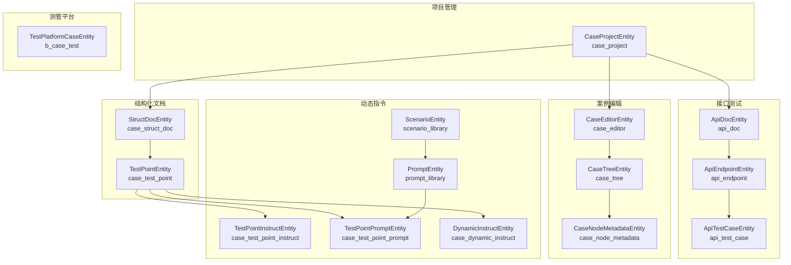
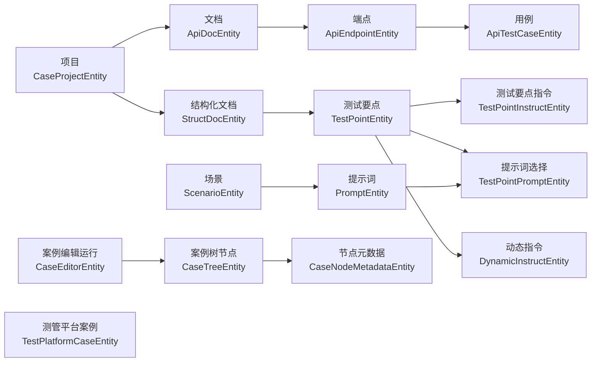
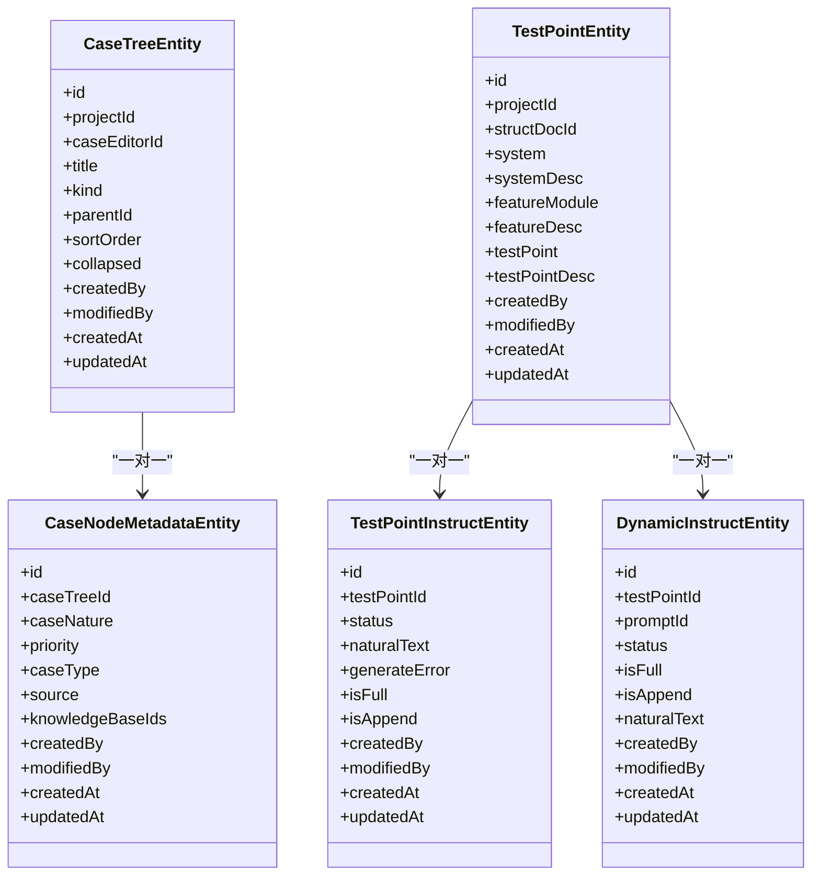
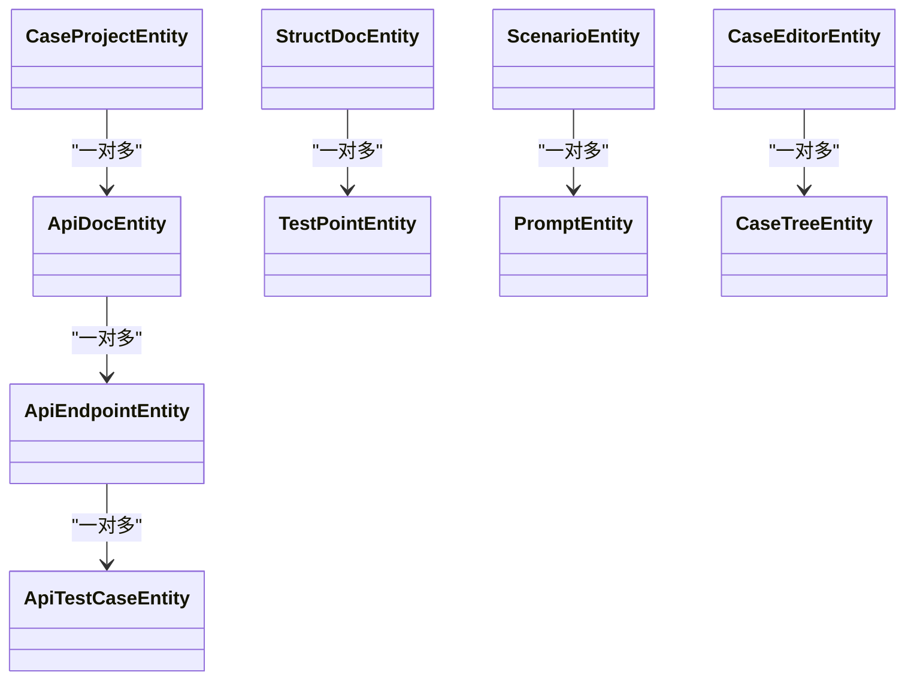
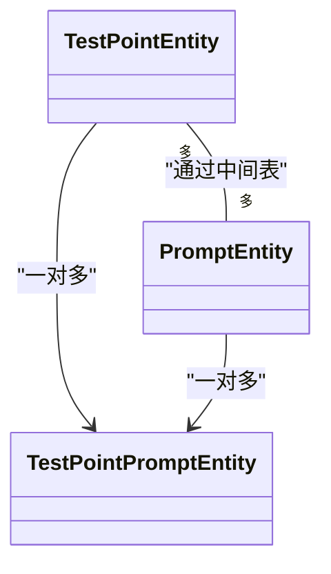
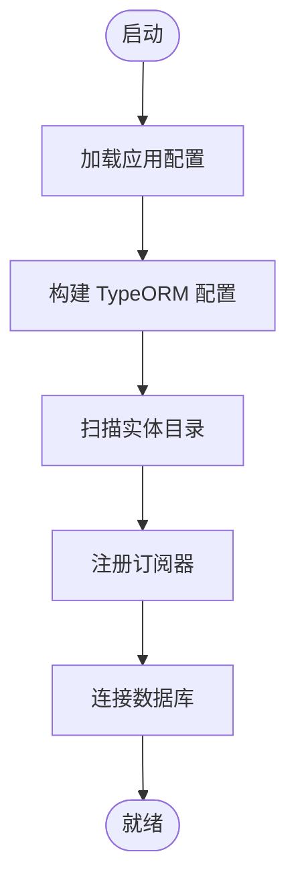

# 实体设计与映射

<cite>
**本文引用的文件**
- [apps/api/src/modules/api-test/entity/api-test-case.entity.ts](file://apps/api/src/modules/api-test/entity/api-test-case.entity.ts)
- [apps/api/src/modules/api-test/entity/api-endpoint.entity.ts](file://apps/api/src/modules/api-test/entity/api-endpoint.entity.ts)
- [apps/api/src/modules/api-test/entity/api-doc.entity.ts](file://apps/api/src/modules/api-test/entity/api-doc.entity.ts)
- [apps/api/src/modules/project-manage/entity/project.entity.ts](file://apps/api/src/modules/project-manage/entity/project.entity.ts)
- [apps/api/src/modules/case-editor/entity/case-editor.entity.ts](file://apps/api/src/modules/case-editor/entity/case-editor.entity.ts)
- [apps/api/src/modules/case-editor/entity/case-tree.entity.ts](file://apps/api/src/modules/case-editor/entity/case-tree.entity.ts)
- [apps/api/src/modules/case-editor/entity/case-node-metadata.entity.ts](file://apps/api/src/modules/case-editor/entity/case-node-metadata.entity.ts)
- [apps/api/src/modules/struct-doc/entity/struct-doc.entity.ts](file://apps/api/src/modules/struct-doc/entity/struct-doc.entity.ts)
- [apps/api/src/modules/struct-doc/entity/test-point.entity.ts](file://apps/api/src/modules/struct-doc/entity/test-point.entity.ts)
- [apps/api/src/modules/scenario/entity/scenario.entity.ts](file://apps/api/src/modules/scenario/entity/scenario.entity.ts)
- [apps/api/src/modules/scenario/entity/prompt.entity.ts](file://apps/api/src/modules/scenario/entity/prompt.entity.ts)
- [apps/api/src/modules/dynamic-instruct/entity/dynamic-instruct.ts](file://apps/api/src/modules/dynamic-instruct/entity/dynamic-instruct.ts)
- [apps/api/src/modules/dynamic-instruct/entity/test-point-instruct.entity.ts](file://apps/api/src/modules/dynamic-instruct/entity/test-point-instruct.entity.ts)
- [apps/api/src/modules/dynamic-instruct/entity/test-point-prompt.entity.ts](file://apps/api/src/modules/dynamic-instruct/entity/test-point-prompt.entity.ts)
- [apps/api/src/common/test-platform/entity/test-platform-case.entity.ts](file://apps/api/src/common/test-platform/entity/test-platform-case.entity.ts)
- [apps/api/src/common/typeorm/typeorm.config.ts](file://apps/api/src/common/typeorm/typeorm.config.ts)
</cite>

## 目录
1. [简介](#简介)
2. [项目结构](#项目结构)
3. [核心组件](#核心组件)
4. [架构总览](#架构总览)
5. [详细组件分析](#详细组件分析)
6. [依赖分析](#依赖分析)
7. [性能考虑](#性能考虑)
8. [故障排查指南](#故障排查指南)
9. [结论](#结论)
10. [附录](#附录)

## 简介
本文件围绕实体设计与映射展开，系统性梳理项目中各类实体的设计原则、属性映射、索引与约束策略，并深入讲解一对一、一对多、多对多关系的实现方式；同时总结主键、外键、唯一约束与检查约束的设计策略，给出软删除、时间戳字段与审计字段的实现模式，并结合实际业务场景提供多种实体关系示例与设计模式。

## 项目结构
本项目采用按功能域划分的模块化组织方式，实体主要分布在以下模块：
- 项目管理：项目实体
- 接口测试：文档、端点、用例、执行集、事务等
- 案例编辑：运行记录、案例树、节点元数据
- 结构化文档：文档、测试要点
- 动态指令：场景、提示词、测试要点指令、提示词选择、动态指令
- 测管平台：测管平台测试案例（只读映射）

图表来源
- [apps/api/src/modules/project-manage/entity/project.entity.ts:19-58](file://apps/api/src/modules/project-manage/entity/project.entity.ts#L19-L58)
- [apps/api/src/modules/api-test/entity/api-doc.entity.ts:24-84](file://apps/api/src/modules/api-test/entity/api-doc.entity.ts#L24-L84)
- [apps/api/src/modules/api-test/entity/api-endpoint.entity.ts:13-66](file://apps/api/src/modules/api-test/entity/api-endpoint.entity.ts#L13-L66)
- [apps/api/src/modules/api-test/entity/api-test-case.entity.ts:21-98](file://apps/api/src/modules/api-test/entity/api-test-case.entity.ts#L21-L98)
- [apps/api/src/modules/case-editor/entity/case-editor.entity.ts:32-102](file://apps/api/src/modules/case-editor/entity/case-editor.entity.ts#L32-L102)
- [apps/api/src/modules/case-editor/entity/case-tree.entity.ts:26-91](file://apps/api/src/modules/case-editor/entity/case-tree.entity.ts#L26-L91)
- [apps/api/src/modules/case-editor/entity/case-node-metadata.entity.ts:18-61](file://apps/api/src/modules/case-editor/entity/case-node-metadata.entity.ts#L18-L61)
- [apps/api/src/modules/struct-doc/entity/struct-doc.entity.ts:31-104](file://apps/api/src/modules/struct-doc/entity/struct-doc.entity.ts#L31-L104)
- [apps/api/src/modules/struct-doc/entity/test-point.entity.ts:23-119](file://apps/api/src/modules/struct-doc/entity/test-point.entity.ts#L23-L119)
- [apps/api/src/modules/scenario/entity/scenario.entity.ts:19-71](file://apps/api/src/modules/scenario/entity/scenario.entity.ts#L19-L71)
- [apps/api/src/modules/scenario/entity/prompt.entity.ts:22-96](file://apps/api/src/modules/scenario/entity/prompt.entity.ts#L22-L96)
- [apps/api/src/modules/dynamic-instruct/entity/test-point-instruct.entity.ts:32-86](file://apps/api/src/modules/dynamic-instruct/entity/test-point-instruct.entity.ts#L32-L86)
- [apps/api/src/modules/dynamic-instruct/entity/test-point-prompt.entity.ts:20-62](file://apps/api/src/modules/dynamic-instruct/entity/test-point-prompt.entity.ts#L20-L62)
- [apps/api/src/modules/dynamic-instruct/entity/dynamic-instruct.ts:11-67](file://apps/api/src/modules/dynamic-instruct/entity/dynamic-instruct.ts#L11-L67)
- [apps/api/src/common/test-platform/entity/test-platform-case.entity.ts:6-91](file://apps/api/src/common/test-platform/entity/test-platform-case.entity.ts#L6-L91)

章节来源
- [apps/api/src/common/typeorm/typeorm.config.ts:15-42](file://apps/api/src/common/typeorm/typeorm.config.ts#L15-L42)

## 核心组件
本节聚焦关键实体及其映射策略，涵盖主键、外键、索引、约束与审计字段等。

- 主键策略
  - 统一采用 UUID 或自增整型主键，确保全局唯一性与分布式安全。
  - 示例：项目、文档、端点、用例、结构化文档、测试要点、场景、提示词、动态指令、测管平台案例等均定义了主键列。

- 外键与关系
  - 一对一：案例树节点与其元数据、测试要点与其指令、测试要点与其动态指令。
  - 一对多：项目到文档、文档到端点、端点到用例、结构化文档到测试要点、场景到提示词、案例编辑到树节点。
  - 多对多：测试要点与提示词通过中间表关联。

- 索引与约束
  - 复合索引：为高频查询与连接建立复合索引，如项目+更新时间、项目+文档+创建时间等。
  - 唯一约束：如文档与事务的唯一映射、测试要点与提示词的唯一组合、测试要点指令的唯一绑定等。
  - 检查约束：通过枚举类型与布尔转换器实现逻辑校验，如状态枚举、tinyint布尔转换。

- 审计字段
  - 统一包含创建人、修改人、创建时间、更新时间字段，便于审计追踪。

章节来源
- [apps/api/src/modules/project-manage/entity/project.entity.ts:28-57](file://apps/api/src/modules/project-manage/entity/project.entity.ts#L28-L57)
- [apps/api/src/modules/api-test/entity/api-doc.entity.ts:28-84](file://apps/api/src/modules/api-test/entity/api-doc.entity.ts#L28-L84)
- [apps/api/src/modules/api-test/entity/api-endpoint.entity.ts:18-65](file://apps/api/src/modules/api-test/entity/api-endpoint.entity.ts#L18-L65)
- [apps/api/src/modules/api-test/entity/api-test-case.entity.ts:25-97](file://apps/api/src/modules/api-test/entity/api-test-case.entity.ts#L25-L97)
- [apps/api/src/modules/struct-doc/entity/struct-doc.entity.ts:35-103](file://apps/api/src/modules/struct-doc/entity/struct-doc.entity.ts#L35-L103)
- [apps/api/src/modules/struct-doc/entity/test-point.entity.ts:36-118](file://apps/api/src/modules/struct-doc/entity/test-point.entity.ts#L36-L118)
- [apps/api/src/modules/case-editor/entity/case-editor.entity.ts:36-101](file://apps/api/src/modules/case-editor/entity/case-editor.entity.ts#L36-L101)
- [apps/api/src/modules/case-editor/entity/case-tree.entity.ts:37-90](file://apps/api/src/modules/case-editor/entity/case-tree.entity.ts#L37-L90)
- [apps/api/src/modules/case-editor/entity/case-node-metadata.entity.ts:21-60](file://apps/api/src/modules/case-editor/entity/case-node-metadata.entity.ts#L21-L60)
- [apps/api/src/modules/scenario/entity/scenario.entity.ts:24-70](file://apps/api/src/modules/scenario/entity/scenario.entity.ts#L24-L70)
- [apps/api/src/modules/scenario/entity/prompt.entity.ts:27-95](file://apps/api/src/modules/scenario/entity/prompt.entity.ts#L27-L95)
- [apps/api/src/modules/dynamic-instruct/entity/test-point-instruct.entity.ts:38-85](file://apps/api/src/modules/dynamic-instruct/entity/test-point-instruct.entity.ts#L38-L85)
- [apps/api/src/modules/dynamic-instruct/entity/test-point-prompt.entity.ts:24-62](file://apps/api/src/modules/dynamic-instruct/entity/test-point-prompt.entity.ts#L24-L62)
- [apps/api/src/modules/dynamic-instruct/entity/dynamic-instruct.ts:13-66](file://apps/api/src/modules/dynamic-instruct/entity/dynamic-instruct.ts#L13-L66)
- [apps/api/src/common/test-platform/entity/test-platform-case.entity.ts:8-91](file://apps/api/src/common/test-platform/entity/test-platform-case.entity.ts#L8-L91)

## 架构总览
下图展示实体层的整体关系与依赖方向，体现“项目—文档—端点—用例”的测试链路，以及“结构化文档—测试要点—动态指令/提示词”的案例生成链路。

图表来源
- [apps/api/src/modules/project-manage/entity/project.entity.ts:27-57](file://apps/api/src/modules/project-manage/entity/project.entity.ts#L27-L57)
- [apps/api/src/modules/api-test/entity/api-doc.entity.ts:31-84](file://apps/api/src/modules/api-test/entity/api-doc.entity.ts#L31-L84)
- [apps/api/src/modules/api-test/entity/api-endpoint.entity.ts:17-65](file://apps/api/src/modules/api-test/entity/api-endpoint.entity.ts#L17-L65)
- [apps/api/src/modules/api-test/entity/api-test-case.entity.ts:24-97](file://apps/api/src/modules/api-test/entity/api-test-case.entity.ts#L24-L97)
- [apps/api/src/modules/struct-doc/entity/struct-doc.entity.ts:34-103](file://apps/api/src/modules/struct-doc/entity/struct-doc.entity.ts#L34-L103)
- [apps/api/src/modules/struct-doc/entity/test-point.entity.ts:35-118](file://apps/api/src/modules/struct-doc/entity/test-point.entity.ts#L35-L118)
- [apps/api/src/modules/dynamic-instruct/entity/test-point-instruct.entity.ts:37-85](file://apps/api/src/modules/dynamic-instruct/entity/test-point-instruct.entity.ts#L37-L85)
- [apps/api/src/modules/dynamic-instruct/entity/test-point-prompt.entity.ts:23-62](file://apps/api/src/modules/dynamic-instruct/entity/test-point-prompt.entity.ts#L23-L62)
- [apps/api/src/modules/dynamic-instruct/entity/dynamic-instruct.ts:12-66](file://apps/api/src/modules/dynamic-instruct/entity/dynamic-instruct.ts#L12-L66)
- [apps/api/src/modules/case-editor/entity/case-editor.entity.ts:35-101](file://apps/api/src/modules/case-editor/entity/case-editor.entity.ts#L35-L101)
- [apps/api/src/modules/case-editor/entity/case-tree.entity.ts:36-90](file://apps/api/src/modules/case-editor/entity/case-tree.entity.ts#L36-L90)
- [apps/api/src/modules/case-editor/entity/case-node-metadata.entity.ts:20-60](file://apps/api/src/modules/case-editor/entity/case-node-metadata.entity.ts#L20-L60)
- [apps/api/src/common/test-platform/entity/test-platform-case.entity.ts:6-91](file://apps/api/src/common/test-platform/entity/test-platform-case.entity.ts#L6-L91)

## 详细组件分析

### 一对一关系
- 案例树节点与其元数据：通过 OneToOne 建立一对一关系，元数据随节点级联创建与加载。
- 测试要点与其指令：一对一绑定，保证每个测试要点有且仅有一条指令记录。
- 测试要点与其动态指令：一对一绑定，支持动态指令的级联操作。

图表来源
- [apps/api/src/modules/case-editor/entity/case-tree.entity.ts:36-90](file://apps/api/src/modules/case-editor/entity/case-tree.entity.ts#L36-L90)
- [apps/api/src/modules/case-editor/entity/case-node-metadata.entity.ts:20-60](file://apps/api/src/modules/case-editor/entity/case-node-metadata.entity.ts#L20-L60)
- [apps/api/src/modules/struct-doc/entity/test-point.entity.ts:35-118](file://apps/api/src/modules/struct-doc/entity/test-point.entity.ts#L35-L118)
- [apps/api/src/modules/dynamic-instruct/entity/test-point-instruct.entity.ts:37-85](file://apps/api/src/modules/dynamic-instruct/entity/test-point-instruct.entity.ts#L37-L85)
- [apps/api/src/modules/dynamic-instruct/entity/dynamic-instruct.ts:12-66](file://apps/api/src/modules/dynamic-instruct/entity/dynamic-instruct.ts#L12-L66)

章节来源
- [apps/api/src/modules/case-editor/entity/case-tree.entity.ts:74-78](file://apps/api/src/modules/case-editor/entity/case-tree.entity.ts#L74-L78)
- [apps/api/src/modules/case-editor/entity/case-node-metadata.entity.ts:27-32](file://apps/api/src/modules/case-editor/entity/case-node-metadata.entity.ts#L27-L32)
- [apps/api/src/modules/struct-doc/entity/test-point.entity.ts:78-104](file://apps/api/src/modules/struct-doc/entity/test-point.entity.ts#L78-L104)
- [apps/api/src/modules/dynamic-instruct/entity/test-point-instruct.entity.ts:44-53](file://apps/api/src/modules/dynamic-instruct/entity/test-point-instruct.entity.ts#L44-L53)
- [apps/api/src/modules/dynamic-instruct/entity/dynamic-instruct.ts:33-50](file://apps/api/src/modules/dynamic-instruct/entity/dynamic-instruct.ts#L33-L50)

### 一对多关系
- 项目到文档：一个项目可拥有多个文档。
- 文档到端点：一个文档可包含多个端点。
- 端点到用例：一个端点可对应多个用例。
- 结构化文档到测试要点：一个文档可拆解为多个测试要点。
- 场景到提示词：一个场景包含多个提示词。
- 案例编辑到树节点：一次编辑运行包含多个树节点。

图表来源
- [apps/api/src/modules/project-manage/entity/project.entity.ts:27-43](file://apps/api/src/modules/project-manage/entity/project.entity.ts#L27-L43)
- [apps/api/src/modules/api-test/entity/api-doc.entity.ts:37-72](file://apps/api/src/modules/api-test/entity/api-doc.entity.ts#L37-L72)
- [apps/api/src/modules/api-test/entity/api-endpoint.entity.ts:30-35](file://apps/api/src/modules/api-test/entity/api-endpoint.entity.ts#L30-L35)
- [apps/api/src/modules/api-test/entity/api-test-case.entity.ts:34-39](file://apps/api/src/modules/api-test/entity/api-test-case.entity.ts#L34-L39)
- [apps/api/src/modules/struct-doc/entity/struct-doc.entity.ts:90-91](file://apps/api/src/modules/struct-doc/entity/struct-doc.entity.ts#L90-L91)
- [apps/api/src/modules/scenario/entity/scenario.entity.ts:54-57](file://apps/api/src/modules/scenario/entity/scenario.entity.ts#L54-L57)
- [apps/api/src/modules/case-editor/entity/case-editor.entity.ts:88-89](file://apps/api/src/modules/case-editor/entity/case-editor.entity.ts#L88-L89)

章节来源
- [apps/api/src/modules/api-test/entity/api-doc.entity.ts:71-72](file://apps/api/src/modules/api-test/entity/api-doc.entity.ts#L71-L72)
- [apps/api/src/modules/api-test/entity/api-endpoint.entity.ts:30-35](file://apps/api/src/modules/api-test/entity/api-endpoint.entity.ts#L30-L35)
- [apps/api/src/modules/api-test/entity/api-test-case.entity.ts:34-39](file://apps/api/src/modules/api-test/entity/api-test-case.entity.ts#L34-L39)
- [apps/api/src/modules/struct-doc/entity/struct-doc.entity.ts:90-91](file://apps/api/src/modules/struct-doc/entity/struct-doc.entity.ts#L90-L91)
- [apps/api/src/modules/scenario/entity/scenario.entity.ts:54-57](file://apps/api/src/modules/scenario/entity/scenario.entity.ts#L54-L57)
- [apps/api/src/modules/case-editor/entity/case-editor.entity.ts:88-89](file://apps/api/src/modules/case-editor/entity/case-editor.entity.ts#L88-L89)

### 多对多关系
- 测试要点与提示词：通过中间表 TestPointPromptEntity 建立多对多关系，支持测试要点勾选多个提示词。

图表来源
- [apps/api/src/modules/struct-doc/entity/test-point.entity.ts:86-92](file://apps/api/src/modules/struct-doc/entity/test-point.entity.ts#L86-L92)
- [apps/api/src/modules/scenario/entity/prompt.entity.ts:42-43](file://apps/api/src/modules/scenario/entity/prompt.entity.ts#L42-L43)
- [apps/api/src/modules/dynamic-instruct/entity/test-point-prompt.entity.ts:23-49](file://apps/api/src/modules/dynamic-instruct/entity/test-point-prompt.entity.ts#L23-L49)

章节来源
- [apps/api/src/modules/dynamic-instruct/entity/test-point-prompt.entity.ts:20-62](file://apps/api/src/modules/dynamic-instruct/entity/test-point-prompt.entity.ts#L20-L62)

### 主键、外键、唯一约束与检查约束
- 主键
  - 项目、文档、端点、用例、结构化文档、测试要点、场景、提示词、动态指令、测管平台案例等均定义主键列。
- 外键
  - 通过 @ManyToOne/@JoinColumn 建立外键关系，如端点到文档、用例到端点、结构化文档到项目等。
- 唯一约束
  - 文档与事务唯一映射、测试要点与提示词唯一组合、测试要点指令唯一绑定等。
- 检查约束
  - 通过枚举类型与布尔转换器实现逻辑校验，如状态枚举、tinyint布尔转换。

章节来源
- [apps/api/src/modules/api-test/entity/api-doc.entity.ts:25-26](file://apps/api/src/modules/api-test/entity/api-doc.entity.ts#L25-L26)
- [apps/api/src/modules/struct-doc/entity/test-point.entity.ts:34-34](file://apps/api/src/modules/struct-doc/entity/test-point.entity.ts#L34-L34)
- [apps/api/src/modules/dynamic-instruct/entity/test-point-instruct.entity.ts:33-35](file://apps/api/src/modules/dynamic-instruct/entity/test-point-instruct.entity.ts#L33-L35)
- [apps/api/src/modules/dynamic-instruct/entity/test-point-prompt.entity.ts:21-22](file://apps/api/src/modules/dynamic-instruct/entity/test-point-prompt.entity.ts#L21-L22)
- [apps/api/src/modules/scenario/entity/prompt.entity.ts:72-79](file://apps/api/src/modules/scenario/entity/prompt.entity.ts#L72-L79)

### 软删除、时间戳字段与审计字段
- 时间戳字段
  - 统一使用 CreateDateColumn 与 UpdateDateColumn 记录创建与更新时间。
- 审计字段
  - 统一包含 createdBy 与 modifiedBy 字段，默认值为 "system"，便于审计追踪。
- 软删除
  - 当前实体未见显式软删除字段或逻辑；如需软删除，建议在实体上增加 deletedAt 字段并在查询时过滤。

章节来源
- [apps/api/src/modules/api-test/entity/api-test-case.entity.ts:93-97](file://apps/api/src/modules/api-test/entity/api-test-case.entity.ts#L93-L97)
- [apps/api/src/modules/api-test/entity/api-endpoint.entity.ts:61-64](file://apps/api/src/modules/api-test/entity/api-endpoint.entity.ts#L61-L64)
- [apps/api/src/modules/project-manage/entity/project.entity.ts:53-57](file://apps/api/src/modules/project-manage/entity/project.entity.ts#L53-L57)
- [apps/api/src/modules/case-editor/entity/case-editor.entity.ts:97-101](file://apps/api/src/modules/case-editor/entity/case-editor.entity.ts#L97-L101)
- [apps/api/src/modules/struct-doc/entity/struct-doc.entity.ts:99-103](file://apps/api/src/modules/struct-doc/entity/struct-doc.entity.ts#L99-L103)
- [apps/api/src/modules/scenario/entity/scenario.entity.ts:66-70](file://apps/api/src/modules/scenario/entity/scenario.entity.ts#L66-L70)
- [apps/api/src/modules/dynamic-instruct/entity/dynamic-instruct.ts:62-66](file://apps/api/src/modules/dynamic-instruct/entity/dynamic-instruct.ts#L62-L66)

### 实际示例与设计模式
- 测试链路设计模式
  - 项目—文档—端点—用例：通过外键串联，配合复合索引优化查询与连接。
- 案例生成设计模式
  - 结构化文档—测试要点—动态指令/提示词：通过一对一与多对多关系，实现灵活的指令与提示词组合。
- 案例树设计模式
  - 案例编辑运行—案例树节点—节点元数据：通过邻接表与元数据分离，支持复杂层级与扩展信息。

章节来源
- [apps/api/src/modules/api-test/entity/api-doc.entity.ts:37-72](file://apps/api/src/modules/api-test/entity/api-doc.entity.ts#L37-L72)
- [apps/api/src/modules/struct-doc/entity/test-point.entity.ts:47-52](file://apps/api/src/modules/struct-doc/entity/test-point.entity.ts#L47-L52)
- [apps/api/src/modules/dynamic-instruct/entity/dynamic-instruct.ts:33-50](file://apps/api/src/modules/dynamic-instruct/entity/dynamic-instruct.ts#L33-L50)
- [apps/api/src/modules/case-editor/entity/case-tree.entity.ts:50-55](file://apps/api/src/modules/case-editor/entity/case-tree.entity.ts#L50-L55)

## 依赖分析
- 数据库连接与实体扫描
  - TypeORM 配置统一扫描 apps/api/src/**/entity/*.js，确保所有实体被正确加载。
  - 订阅器 AuditSubscriber 注册，用于审计事件处理。

图表来源
- [apps/api/src/common/typeorm/typeorm.config.ts:15-42](file://apps/api/src/common/typeorm/typeorm.config.ts#L15-L42)

章节来源
- [apps/api/src/common/typeorm/typeorm.config.ts:28-29](file://apps/api/src/common/typeorm/typeorm.config.ts#L28-L29)

## 性能考虑
- 索引策略
  - 为高频查询字段建立复合索引，如项目+更新时间、项目+文档+创建时间等，减少全表扫描。
- 关系加载
  - 对于需要频繁访问的关联，合理使用 eager 加载；对于大体量数据，建议惰性加载并分页查询。
- 枚举与布尔转换
  - 使用枚举与布尔转换器减少存储冗余与提升查询效率。
- 写入一致性
  - 对于强一致要求的场景，避免过度使用惰性加载导致 N+1 查询问题。

## 故障排查指南
- 实体未被扫描
  - 检查 TypeORM 配置中的实体扫描路径是否正确。
- 外键约束冲突
  - 删除或更新父实体前，确认子实体是否已被清理或迁移。
- 唯一约束冲突
  - 检查唯一索引对应的字段组合是否重复。
- 审计字段缺失
  - 确认请求上下文与中间件是否正确设置 createdBy/modifiedBy。

章节来源
- [apps/api/src/common/typeorm/typeorm.config.ts:28-29](file://apps/api/src/common/typeorm/typeorm.config.ts#L28-L29)

## 结论
本项目的实体设计遵循清晰的关系建模与一致的命名规范，通过主键、外键、索引与约束保障数据完整性与查询性能；审计字段与时间戳字段贯穿全表，便于审计与追踪。建议后续在需要软删除与更复杂的级联行为时，补充相应字段与策略，并持续优化索引与查询路径。

## 附录
- 关键实体一览
  - 项目：CaseProjectEntity
  - 接口测试：ApiDocEntity、ApiEndpointEntity、ApiTestCaseEntity
  - 案例编辑：CaseEditorEntity、CaseTreeEntity、CaseNodeMetadataEntity
  - 结构化文档：StructDocEntity、TestPointEntity
  - 动态指令：ScenarioEntity、PromptEntity、TestPointInstructEntity、TestPointPromptEntity、DynamicInstructEntity
  - 测管平台：TestPlatformCaseEntity