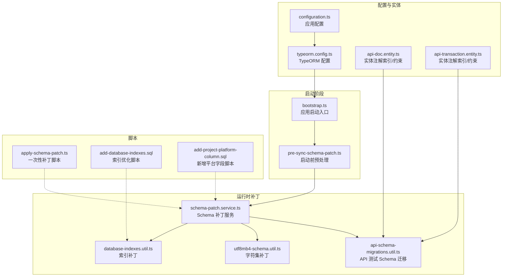
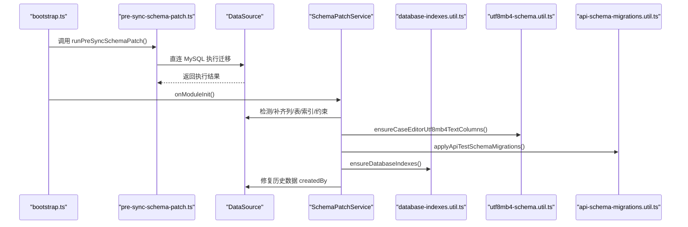
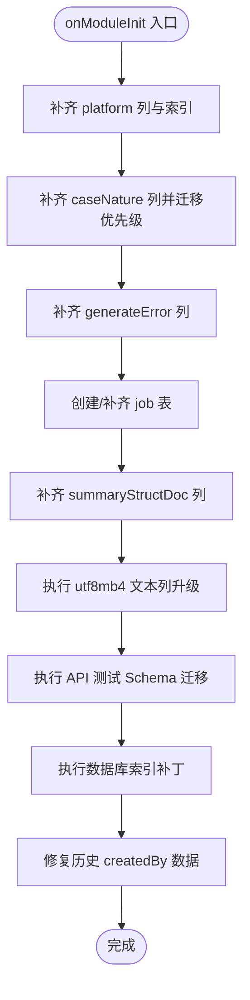
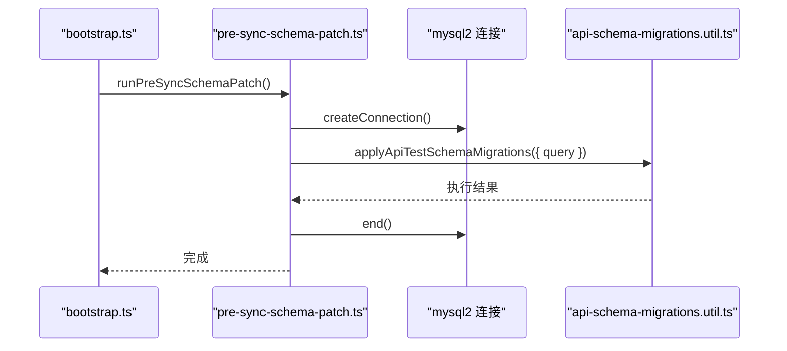
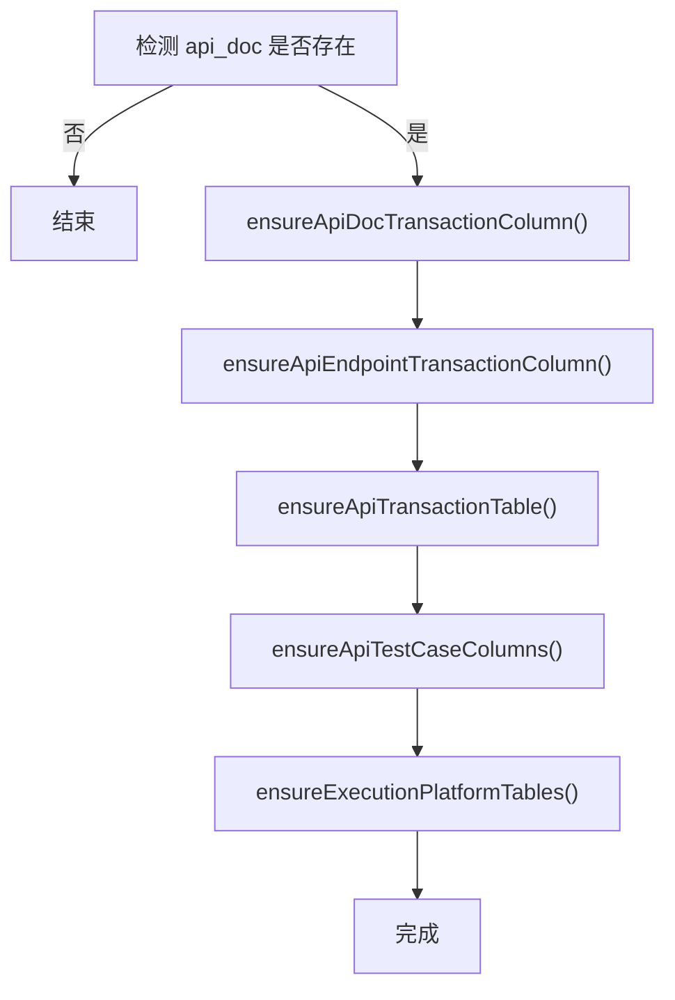
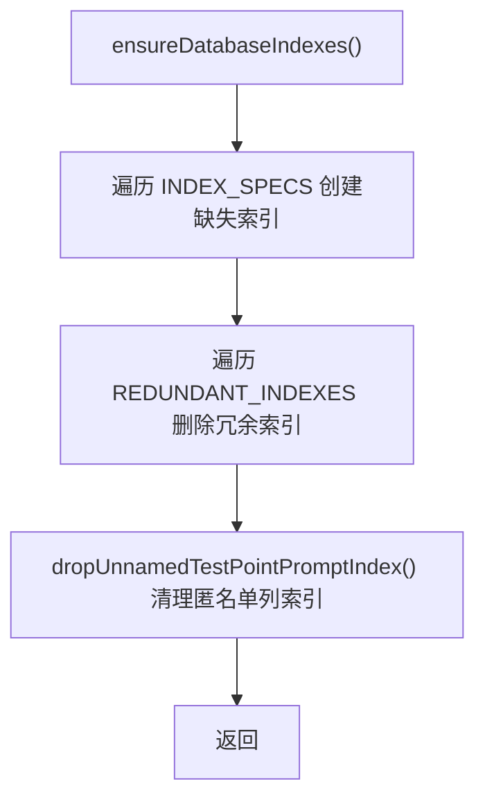
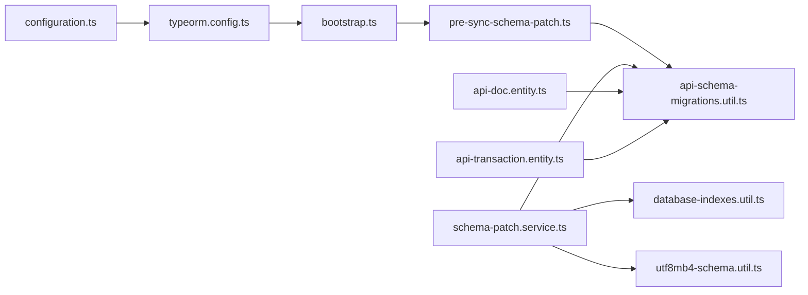
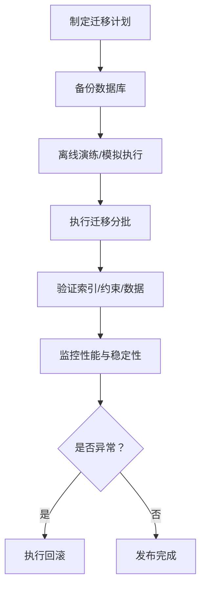

# 数据库迁移与 Schema 管理

<cite>
**本文引用的文件**
- [apps/api/src/common/typeorm/schema-patch.service.ts](file://apps/api/src/common/typeorm/schema-patch.service.ts)
- [apps/api/src/common/typeorm/pre-sync-schema-patch.ts](file://apps/api/src/common/typeorm/pre-sync-schema-patch.ts)
- [apps/api/src/common/typeorm/api-schema-migrations.util.ts](file://apps/api/src/common/typeorm/api-schema-migrations.util.ts)
- [apps/api/src/common/typeorm/database-indexes.util.ts](file://apps/api/src/common/typeorm/database-indexes.util.ts)
- [apps/api/src/common/typeorm/utf8mb4-schema.util.ts](file://apps/api/src/common/typeorm/utf8mb4-schema.util.ts)
- [apps/api/scripts/apply-schema-patch.ts](file://apps/api/scripts/apply-schema-patch.ts)
- [apps/api/scripts/add-database-indexes.sql](file://apps/api/scripts/add-database-indexes.sql)
- [apps/api/scripts/add-project-platform-column.sql](file://apps/api/scripts/add-project-platform-column.sql)
- [apps/api/src/common/typeorm/typeorm.config.ts](file://apps/api/src/common/typeorm/typeorm.config.ts)
- [apps/api/src/config/configuration.ts](file://apps/api/src/config/configuration.ts)
- [apps/api/src/bootstrap.ts](file://apps/api/src/bootstrap.ts)
- [apps/api/src/modules/api-test/entity/api-doc.entity.ts](file://apps/api/src/modules/api-test/entity/api-doc.entity.ts)
- [apps/api/src/modules/api-test/entity/api-transaction.entity.ts](file://apps/api/src/modules/api-test/entity/api-transaction.entity.ts)
</cite>

## 目录
1. [简介](#简介)
2. [项目结构](#项目结构)
3. [核心组件](#核心组件)
4. [架构总览](#架构总览)
5. [详细组件分析](#详细组件分析)
6. [依赖关系分析](#依赖关系分析)
7. [性能考量](#性能考量)
8. [故障排查指南](#故障排查指南)
9. [结论](#结论)
10. [附录](#附录)

## 简介
本文件面向数据库迁移与 Schema 管理，系统性阐述以下内容：
- 版本控制、变更追踪与回滚机制的设计思路与落地方式
- Schema 补丁服务的工作原理与执行流程
- 字符集转换、索引管理与约束添加的自动化策略
- 生产环境迁移的安全注意事项与最佳实践
- 迁移脚本编写指南与常见问题解决方案

## 项目结构
本项目的数据库迁移与 Schema 管理主要分布在以下位置：
- 类型化迁移与补丁：apps/api/src/common/typeorm 下的若干工具与服务
- 启动期预处理：apps/api/src/bootstrap.ts 中的预同步补丁执行
- 手动脚本：apps/api/scripts 下的 SQL 与一次性补丁脚本
- 实体定义：apps/api/src/modules/api-test/entity 下的实体注解驱动索引与约束
- 运行时配置：apps/api/src/common/typeorm/typeorm.config.ts 与 apps/api/src/config/configuration.ts

图表来源
- [apps/api/src/bootstrap.ts:18-22](file://apps/api/src/bootstrap.ts#L18-L22)
- [apps/api/src/common/typeorm/pre-sync-schema-patch.ts:7-31](file://apps/api/src/common/typeorm/pre-sync-schema-patch.ts#L7-L31)
- [apps/api/src/common/typeorm/schema-patch.service.ts:16-28](file://apps/api/src/common/typeorm/schema-patch.service.ts#L16-L28)
- [apps/api/src/common/typeorm/database-indexes.util.ts:202-212](file://apps/api/src/common/typeorm/database-indexes.util.ts#L202-L212)
- [apps/api/src/common/typeorm/utf8mb4-schema.util.ts:64-90](file://apps/api/src/common/typeorm/utf8mb4-schema.util.ts#L64-L90)
- [apps/api/src/common/typeorm/api-schema-migrations.util.ts:57-67](file://apps/api/src/common/typeorm/api-schema-migrations.util.ts#L57-L67)
- [apps/api/src/common/typeorm/typeorm.config.ts:15-32](file://apps/api/src/common/typeorm/typeorm.config.ts#L15-L32)
- [apps/api/src/config/configuration.ts:7-16](file://apps/api/src/config/configuration.ts#L7-L16)
- [apps/api/src/modules/api-test/entity/api-doc.entity.ts:24-26](file://apps/api/src/modules/api-test/entity/api-doc.entity.ts#L24-L26)
- [apps/api/src/modules/api-test/entity/api-transaction.entity.ts:13-14](file://apps/api/src/modules/api-test/entity/api-transaction.entity.ts#L13-L14)

章节来源
- [apps/api/src/bootstrap.ts:18-22](file://apps/api/src/bootstrap.ts#L18-L22)
- [apps/api/src/common/typeorm/typeorm.config.ts:15-32](file://apps/api/src/common/typeorm/typeorm.config.ts#L15-L32)
- [apps/api/src/config/configuration.ts:7-16](file://apps/api/src/config/configuration.ts#L7-L16)

## 核心组件
- Schema 补丁服务：在应用启动后幂等补齐缺失的列、表、索引与约束，确保业务可用性
- 预同步补丁：在 TypeORM 同步之前执行，规避外键依赖导致的删除/重建冲突
- API 测试 Schema 迁移：对 api_doc、api_transaction 等表进行列、索引与约束的有序调整
- 索引补丁：集中补齐热点查询索引，同时清理冗余索引
- 字符集补丁：将关键文本列升级为 utf8mb4，保障多语言与四字节字符
- 手动脚本：提供一次性补丁与索引优化脚本，便于生产环境快速修复
- 实体注解：通过 @Index/@Unique 等注解声明约束与索引，配合 TypeORM 同步

章节来源
- [apps/api/src/common/typeorm/schema-patch.service.ts:16-28](file://apps/api/src/common/typeorm/schema-patch.service.ts#L16-L28)
- [apps/api/src/common/typeorm/pre-sync-schema-patch.ts:7-31](file://apps/api/src/common/typeorm/pre-sync-schema-patch.ts#L7-L31)
- [apps/api/src/common/typeorm/api-schema-migrations.util.ts:57-67](file://apps/api/src/common/typeorm/api-schema-migrations.util.ts#L57-L67)
- [apps/api/src/common/typeorm/database-indexes.util.ts:202-212](file://apps/api/src/common/typeorm/database-indexes.util.ts#L202-L212)
- [apps/api/src/common/typeorm/utf8mb4-schema.util.ts:64-90](file://apps/api/src/common/typeorm/utf8mb4-schema.util.ts#L64-L90)

## 架构总览
下图展示了“启动期预处理 → 运行时补丁 → 实体同步”的整体流程，以及与手动脚本的协作关系。

图表来源
- [apps/api/src/bootstrap.ts:18-22](file://apps/api/src/bootstrap.ts#L18-L22)
- [apps/api/src/common/typeorm/pre-sync-schema-patch.ts:22-27](file://apps/api/src/common/typeorm/pre-sync-schema-patch.ts#L22-L27)
- [apps/api/src/common/typeorm/schema-patch.service.ts:16-28](file://apps/api/src/common/typeorm/schema-patch.service.ts#L16-L28)
- [apps/api/src/common/typeorm/database-indexes.util.ts:202-212](file://apps/api/src/common/typeorm/database-indexes.util.ts#L202-L212)
- [apps/api/src/common/typeorm/utf8mb4-schema.util.ts:64-90](file://apps/api/src/common/typeorm/utf8mb4-schema.util.ts#L64-L90)
- [apps/api/src/common/typeorm/api-schema-migrations.util.ts:57-67](file://apps/api/src/common/typeorm/api-schema-migrations.util.ts#L57-L67)

## 详细组件分析

### Schema 补丁服务（SchemaPatchService）
职责与流程
- 在模块初始化时依次执行多项幂等补丁，包括：
  - 补齐 case_project.platform 列、索引与默认值
  - 补齐 case_node_metadata.caseNature 列并迁移优先级
  - 补齐 case_test_point_instruct.generateError 列
  - 创建 case_generate_job、api_case_generate_job、struct_requirement_job 等表
  - 补齐 case_struct_doc.summaryStructDoc 列
  - 执行字符集补丁与 API 测试 Schema 迁移
  - 执行索引补丁
  - 修复历史数据 createdBy 字段（基于 modifiedBy）

幂等性与容错
- 每个补丁均先检查目标是否存在，避免重复执行
- 对“重复键名”等可预期错误进行捕获与忽略
- 记录警告与日志，便于审计与排障

图表来源
- [apps/api/src/common/typeorm/schema-patch.service.ts:16-28](file://apps/api/src/common/typeorm/schema-patch.service.ts#L16-L28)
- [apps/api/src/common/typeorm/schema-patch.service.ts:30-65](file://apps/api/src/common/typeorm/schema-patch.service.ts#L30-L65)
- [apps/api/src/common/typeorm/schema-patch.service.ts:67-94](file://apps/api/src/common/typeorm/schema-patch.service.ts#L67-L94)
- [apps/api/src/common/typeorm/schema-patch.service.ts:96-113](file://apps/api/src/common/typeorm/schema-patch.service.ts#L96-L113)
- [apps/api/src/common/typeorm/schema-patch.service.ts:115-148](file://apps/api/src/common/typeorm/schema-patch.service.ts#L115-L148)
- [apps/api/src/common/typeorm/schema-patch.service.ts:150-185](file://apps/api/src/common/typeorm/schema-patch.service.ts#L150-L185)
- [apps/api/src/common/typeorm/schema-patch.service.ts:187-216](file://apps/api/src/common/typeorm/schema-patch.service.ts#L187-L216)
- [apps/api/src/common/typeorm/schema-patch.service.ts:218-235](file://apps/api/src/common/typeorm/schema-patch.service.ts#L218-L235)
- [apps/api/src/common/typeorm/schema-patch.service.ts:241-266](file://apps/api/src/common/typeorm/schema-patch.service.ts#L241-L266)

章节来源
- [apps/api/src/common/typeorm/schema-patch.service.ts:16-28](file://apps/api/src/common/typeorm/schema-patch.service.ts#L16-L28)

### 预同步补丁（runPreSyncSchemaPatch）
目的
- 在 TypeORM 同步之前执行，避免删除唯一索引 uk_api_doc_project 时因外键依赖引发异常
- 仅在 local/development 环境执行，防止对生产造成影响

实现要点
- 直连 MySQL 执行迁移逻辑，绕过 TypeORM 同步
- 通过 Queryable 接口抽象 SQL 执行，便于统一处理

图表来源
- [apps/api/src/bootstrap.ts:18-22](file://apps/api/src/bootstrap.ts#L18-L22)
- [apps/api/src/common/typeorm/pre-sync-schema-patch.ts:7-31](file://apps/api/src/common/typeorm/pre-sync-schema-patch.ts#L7-L31)
- [apps/api/src/common/typeorm/api-schema-migrations.util.ts:57-67](file://apps/api/src/common/typeorm/api-schema-migrations.util.ts#L57-L67)

章节来源
- [apps/api/src/common/typeorm/pre-sync-schema-patch.ts:7-31](file://apps/api/src/common/typeorm/pre-sync-schema-patch.ts#L7-L31)

### API 测试 Schema 迁移（applyApiTestSchemaMigrations）
目标
- 对 api_doc、api_transaction、api_endpoint、api_test_* 等表进行列、索引与约束的有序调整
- 保证外键与索引依赖顺序正确（先建索引，再删唯一索引）

关键步骤
- 统一 UUID 列字符集与长度，确保外键一致
- 为 api_doc 增加 transactionId 列并建立索引，删除旧唯一索引后再建新唯一索引
- 为 api_endpoint 增加 transactionId 列并建立索引
- 为 api_test_* 表补齐 createdBy/modifiedBy 等审计字段
- 为 api_test_execution_set_case 建立唯一索引
- 为 api_test_run、api_test_environment 等表补齐必要列与索引

图表来源
- [apps/api/src/common/typeorm/api-schema-migrations.util.ts:57-67](file://apps/api/src/common/typeorm/api-schema-migrations.util.ts#L57-L67)
- [apps/api/src/common/typeorm/api-schema-migrations.util.ts:99-139](file://apps/api/src/common/typeorm/api-schema-migrations.util.ts#L99-L139)
- [apps/api/src/common/typeorm/api-schema-migrations.util.ts:141-165](file://apps/api/src/common/typeorm/api-schema-migrations.util.ts#L141-L165)
- [apps/api/src/common/typeorm/api-schema-migrations.util.ts:69-97](file://apps/api/src/common/typeorm/api-schema-migrations.util.ts#L69-L97)
- [apps/api/src/common/typeorm/api-schema-migrations.util.ts:167-180](file://apps/api/src/common/typeorm/api-schema-migrations.util.ts#L167-L180)
- [apps/api/src/common/typeorm/api-schema-migrations.util.ts:182-290](file://apps/api/src/common/typeorm/api-schema-migrations.util.ts#L182-L290)

章节来源
- [apps/api/src/common/typeorm/api-schema-migrations.util.ts:57-67](file://apps/api/src/common/typeorm/api-schema-migrations.util.ts#L57-L67)

### 索引补丁（ensureDatabaseIndexes）
目标
- 幂等补齐热点查询索引，清理冗余索引，避免外键依赖导致无法删除

策略
- 通过常量数组集中维护需要的索引规格
- 逐条检查表与索引是否存在，避免重复创建
- 对可能受外键约束影响的删除操作进行特殊处理

图表来源
- [apps/api/src/common/typeorm/database-indexes.util.ts:202-212](file://apps/api/src/common/typeorm/database-indexes.util.ts#L202-L212)
- [apps/api/src/common/typeorm/database-indexes.util.ts:191-200](file://apps/api/src/common/typeorm/database-indexes.util.ts#L191-L200)
- [apps/api/src/common/typeorm/database-indexes.util.ts:214-239](file://apps/api/src/common/typeorm/database-indexes.util.ts#L214-L239)

章节来源
- [apps/api/src/common/typeorm/database-indexes.util.ts:202-212](file://apps/api/src/common/typeorm/database-indexes.util.ts#L202-L212)

### 字符集补丁（ensureCaseEditorUtf8mb4TextColumns）
目标
- 将案例编辑相关文本列升级为 utf8mb4，支持四字节字符与多语言

策略
- 逐列检测 Collation，仅对非 utf8mb4 的列执行 ALTER
- 保留原列类型、是否可空与默认值，避免破坏数据完整性

章节来源
- [apps/api/src/common/typeorm/utf8mb4-schema.util.ts:64-90](file://apps/api/src/common/typeorm/utf8mb4-schema.util.ts#L64-L90)

### 手动脚本与一次性补丁
- 一次性补丁脚本：用于在不重启服务的情况下补齐 case_project.platform 等关键列
- 索引优化脚本：适用于生产/测试库已存在表结构且未开启 TypeORM synchronize 的场景
- 新增平台字段脚本：为已有库一次性添加 platform 字段与索引

章节来源
- [apps/api/scripts/apply-schema-patch.ts:10-50](file://apps/api/scripts/apply-schema-patch.ts#L10-L50)
- [apps/api/scripts/add-database-indexes.sql:1-73](file://apps/api/scripts/add-database-indexes.sql#L1-L73)
- [apps/api/scripts/add-project-platform-column.sql:1-12](file://apps/api/scripts/add-project-platform-column.sql#L1-L12)

### 实体注解驱动的约束与索引
- 通过 @Index/@Unique 等装饰器声明索引与唯一约束，TypeORM 在同步时自动应用
- 示例：ApiDocEntity 声明了 uk_api_doc_transaction 与 idx_api_doc_project；ApiTransactionEntity 声明 uk_api_transaction_project_code

章节来源
- [apps/api/src/modules/api-test/entity/api-doc.entity.ts:24-26](file://apps/api/src/modules/api-test/entity/api-doc.entity.ts#L24-L26)
- [apps/api/src/modules/api-test/entity/api-transaction.entity.ts:13-14](file://apps/api/src/modules/api-test/entity/api-transaction.entity.ts#L13-L14)

## 依赖关系分析
- 启动入口依赖预同步补丁，预同步补丁依赖 API 测试迁移工具
- Schema 补丁服务在运行时依赖 DataSource，并调用索引、字符集与 API 测试迁移工具
- TypeORM 配置决定是否同步，开发环境允许同步，生产环境关闭同步以依赖补丁服务
- 实体注解与工具函数共同构成“声明式 + 命令式”的双重保障

图表来源
- [apps/api/src/bootstrap.ts:18-22](file://apps/api/src/bootstrap.ts#L18-L22)
- [apps/api/src/common/typeorm/pre-sync-schema-patch.ts:22-27](file://apps/api/src/common/typeorm/pre-sync-schema-patch.ts#L22-L27)
- [apps/api/src/common/typeorm/schema-patch.service.ts:16-28](file://apps/api/src/common/typeorm/schema-patch.service.ts#L16-L28)
- [apps/api/src/common/typeorm/database-indexes.util.ts:202-212](file://apps/api/src/common/typeorm/database-indexes.util.ts#L202-L212)
- [apps/api/src/common/typeorm/utf8mb4-schema.util.ts:64-90](file://apps/api/src/common/typeorm/utf8mb4-schema.util.ts#L64-L90)
- [apps/api/src/common/typeorm/api-schema-migrations.util.ts:57-67](file://apps/api/src/common/typeorm/api-schema-migrations.util.ts#L57-L67)
- [apps/api/src/common/typeorm/typeorm.config.ts:15-32](file://apps/api/src/common/typeorm/typeorm.config.ts#L15-L32)
- [apps/api/src/config/configuration.ts:7-16](file://apps/api/src/config/configuration.ts#L7-L16)
- [apps/api/src/modules/api-test/entity/api-doc.entity.ts:24-26](file://apps/api/src/modules/api-test/entity/api-doc.entity.ts#L24-L26)
- [apps/api/src/modules/api-test/entity/api-transaction.entity.ts:13-14](file://apps/api/src/modules/api-test/entity/api-transaction.entity.ts#L13-L14)

章节来源
- [apps/api/src/common/typeorm/typeorm.config.ts:15-32](file://apps/api/src/common/typeorm/typeorm.config.ts#L15-L32)

## 性能考量
- 索引设计遵循“热点查询优先、避免冗余”的原则，减少全表扫描
- 复合索引优先于多个单列索引，降低写入成本与存储开销
- 对外键依赖的索引删除采用“先检查约束”的策略，避免阻塞
- 字符集升级仅针对必要列，兼顾兼容性与性能

## 故障排查指南
常见问题与定位建议
- “重复键名”错误：通常由重复创建索引引起，工具已捕获并忽略；如仍出现，检查索引规格一致性
- “外键约束导致无法删除索引”：某些索引被外键依赖，需先删除/修改外键或相关约束
- “字符集升级失败”：确认列当前 Collation 与目标字符集差异，检查默认值格式
- “UUID 外键失败”：确保关联列字符集与长度一致（统一为 varchar(36) utf8）

章节来源
- [apps/api/src/common/typeorm/database-indexes.util.ts:67-75](file://apps/api/src/common/typeorm/database-indexes.util.ts#L67-L75)
- [apps/api/src/common/typeorm/utf8mb4-schema.util.ts:37-46](file://apps/api/src/common/typeorm/utf8mb4-schema.util.ts#L37-L46)
- [apps/api/src/common/typeorm/api-schema-migrations.util.ts:45-55](file://apps/api/src/common/typeorm/api-schema-migrations.util.ts#L45-L55)

## 结论
本项目通过“启动期预处理 + 运行时补丁 + 实体注解 + 手动脚本”的组合，实现了对数据库迁移与 Schema 管理的全面覆盖。其核心优势在于：
- 幂等性与容错：所有补丁均具备幂等与异常处理能力
- 顺序安全：对外键与索引依赖进行严格顺序控制
- 可观测性：通过日志与警告记录补丁执行状态
- 可扩展性：通过工具函数与常量数组易于扩展新的补丁规则

## 附录

### 生产环境迁移安全清单
- 仅在维护窗口执行：避免业务高峰期
- 读写分离与只读降级：必要时将从库设为只读，减少锁竞争
- 备份先行：迁移前对关键表进行备份
- 分批执行：优先对热点表与关键索引进行补丁
- 回滚预案：准备逆向 SQL 与版本回退方案
- 监控告警：关注慢查询、锁等待与连接数指标

### 迁移脚本编写指南
- 幂等性：始终先检查目标是否存在，再执行创建/修改
- 顺序性：先建索引/约束，再删旧索引/约束
- 安全性：对删除类操作增加“外键依赖检查”
- 可观测性：输出明确的日志与错误信息
- 可回滚：为复杂变更提供逆向 SQL

### 关键流程图（概念示意）
