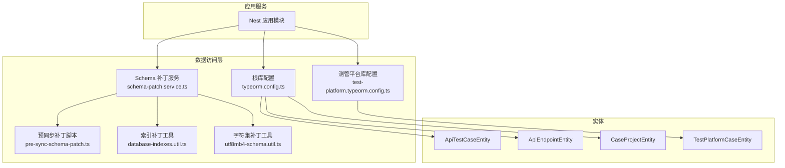
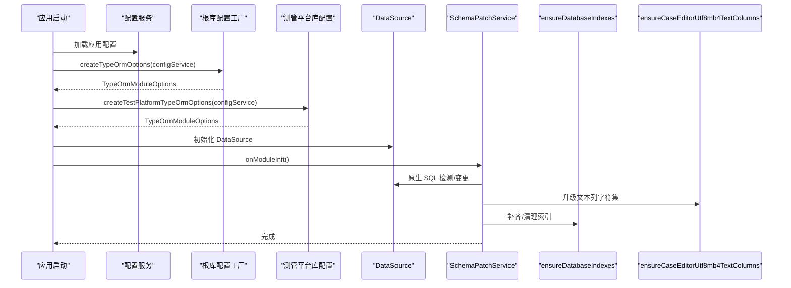
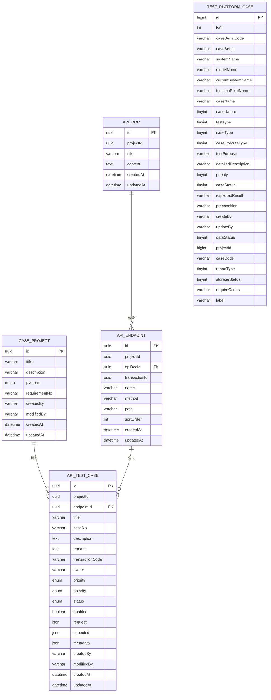
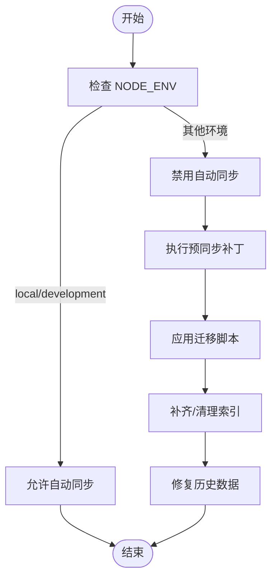
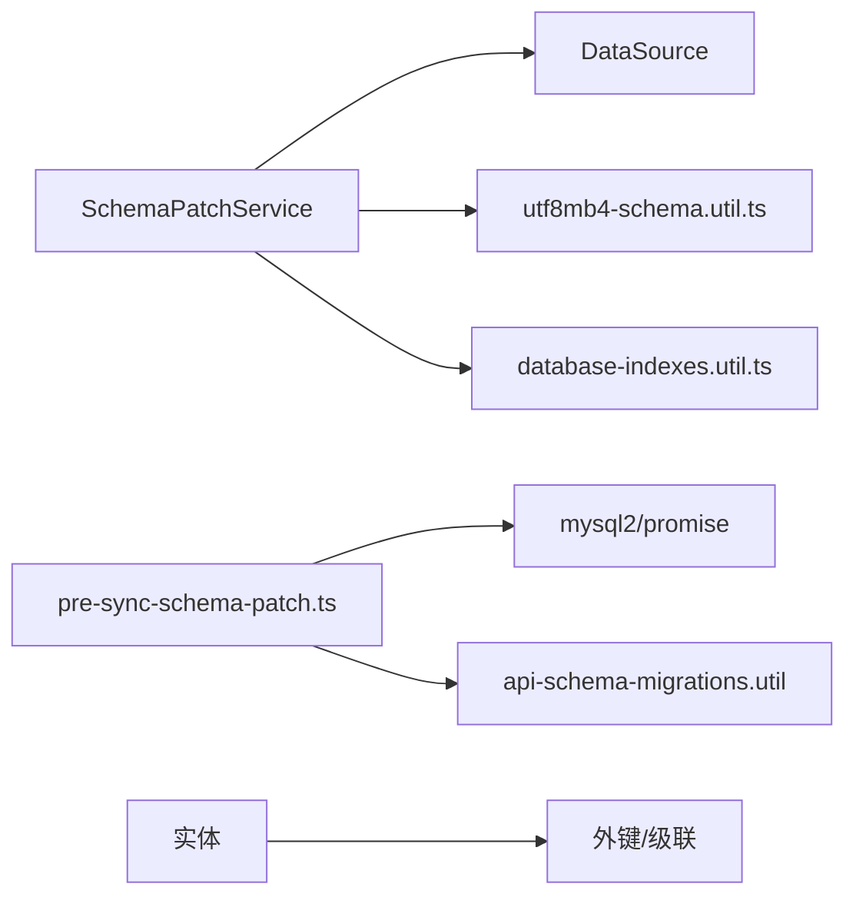

# 数据访问层与 ORM

<cite>
**本文引用的文件**
- [apps/api/src/common/typeorm/typeorm.config.ts](file://apps/api/src/common/typeorm/typeorm.config.ts)
- [apps/api/src/common/test-platform/test-platform.typeorm.config.ts](file://apps/api/src/common/test-platform/test-platform.typeorm.config.ts)
- [apps/api/src/common/typeorm/schema-patch.service.ts](file://apps/api/src/common/typeorm/schema-patch.service.ts)
- [apps/api/src/common/typeorm/pre-sync-schema-patch.ts](file://apps/api/src/common/typeorm/pre-sync-schema-patch.ts)
- [apps/api/src/common/typeorm/database-indexes.util.ts](file://apps/api/src/common/typeorm/database-indexes.util.ts)
- [apps/api/src/common/typeorm/utf8mb4-schema.util.ts](file://apps/api/src/common/typeorm/utf8mb4-schema.util.ts)
- [apps/api/src/modules/api-test/entity/api-test-case.entity.ts](file://apps/api/src/modules/api-test/entity/api-test-case.entity.ts)
- [apps/api/src/modules/api-test/entity/api-endpoint.entity.ts](file://apps/api/src/modules/api-test/entity/api-endpoint.entity.ts)
- [apps/api/src/modules/project-manage/entity/project.entity.ts](file://apps/api/src/modules/project-manage/entity/project.entity.ts)
- [apps/api/src/common/test-platform/entity/test-platform-case.entity.ts](file://apps/api/src/common/test-platform/entity/test-platform-case.entity.ts)
</cite>

## 目录
1. [简介](#简介)
2. [项目结构](#项目结构)
3. [核心组件](#核心组件)
4. [架构总览](#架构总览)
5. [详细组件分析](#详细组件分析)
6. [依赖分析](#依赖分析)
7. [性能考虑](#性能考虑)
8. [故障排查指南](#故障排查指南)
9. [结论](#结论)
10. [附录](#附录)

## 简介
本文件系统性梳理本仓库的数据访问层与 ORM 实践，重点覆盖以下方面：
- TypeORM 配置与多库连接管理
- 实体映射与关系设计
- 查询构建与原生 SQL 使用
- 事务管理与批量操作
- 数据库迁移、索引与字符集补丁
- 性能优化与最佳实践
- 典型实体实现示例与查询策略

## 项目结构
数据访问层主要分布在如下位置：
- 根级 TypeORM 配置工厂与工具：apps/api/src/common/typeorm/*
- 测管平台专用库配置：apps/api/src/common/test-platform/test-platform.typeorm.config.ts
- 实体定义：apps/api/src/modules/*/entity/*
- 审计与订阅：apps/api/src/common/audit/*

图表来源
- [apps/api/src/common/typeorm/typeorm.config.ts:1-43](file://apps/api/src/common/typeorm/typeorm.config.ts#L1-L43)
- [apps/api/src/common/test-platform/test-platform.typeorm.config.ts:1-31](file://apps/api/src/common/test-platform/test-platform.typeorm.config.ts#L1-L31)
- [apps/api/src/common/typeorm/schema-patch.service.ts:1-269](file://apps/api/src/common/typeorm/schema-patch.service.ts#L1-L269)
- [apps/api/src/common/typeorm/pre-sync-schema-patch.ts:1-45](file://apps/api/src/common/typeorm/pre-sync-schema-patch.ts#L1-L45)
- [apps/api/src/common/typeorm/database-indexes.util.ts:1-239](file://apps/api/src/common/typeorm/database-indexes.util.ts#L1-L239)
- [apps/api/src/common/typeorm/utf8mb4-schema.util.ts:1-91](file://apps/api/src/common/typeorm/utf8mb4-schema.util.ts#L1-L91)
- [apps/api/src/modules/api-test/entity/api-test-case.entity.ts:1-99](file://apps/api/src/modules/api-test/entity/api-test-case.entity.ts#L1-L99)
- [apps/api/src/modules/api-test/entity/api-endpoint.entity.ts:1-67](file://apps/api/src/modules/api-test/entity/api-endpoint.entity.ts#L1-L67)
- [apps/api/src/modules/project-manage/entity/project.entity.ts:1-59](file://apps/api/src/modules/project-manage/entity/project.entity.ts#L1-L59)
- [apps/api/src/common/test-platform/entity/test-platform-case.entity.ts:1-92](file://apps/api/src/common/test-platform/entity/test-platform-case.entity.ts#L1-L92)

章节来源
- [apps/api/src/common/typeorm/typeorm.config.ts:1-43](file://apps/api/src/common/typeorm/typeorm.config.ts#L1-L43)
- [apps/api/src/common/test-platform/test-platform.typeorm.config.ts:1-31](file://apps/api/src/common/test-platform/test-platform.typeorm.config.ts#L1-L31)

## 核心组件
- 根库 TypeORM 配置工厂：基于应用配置动态生成连接参数，启用实体扫描与审计订阅，开发环境自动同步。
- 测管平台库独立配置：隔离测管平台相关实体，禁用自动同步，显式声明实体集合。
- Schema 补丁服务：在不开启自动同步的前提下，幂等补齐缺失列、表与索引，并修复历史数据。
- 预同步补丁脚本：在 TypeORM 同步前执行 API 测试相关迁移，规避外键约束问题。
- 索引补丁工具：按清单幂等创建/清理索引，确保查询热点命中最优索引。
- 字符集补丁工具：对文本列进行 utf8mb4 升级，保障四字节字符存储。

章节来源
- [apps/api/src/common/typeorm/typeorm.config.ts:15-42](file://apps/api/src/common/typeorm/typeorm.config.ts#L15-L42)
- [apps/api/src/common/test-platform/test-platform.typeorm.config.ts:11-30](file://apps/api/src/common/test-platform/test-platform.typeorm.config.ts#L11-L30)
- [apps/api/src/common/typeorm/schema-patch.service.ts:10-28](file://apps/api/src/common/typeorm/schema-patch.service.ts#L10-L28)
- [apps/api/src/common/typeorm/pre-sync-schema-patch.ts:7-31](file://apps/api/src/common/typeorm/pre-sync-schema-patch.ts#L7-L31)
- [apps/api/src/common/typeorm/database-indexes.util.ts:202-212](file://apps/api/src/common/typeorm/database-indexes.util.ts#L202-L212)
- [apps/api/src/common/typeorm/utf8mb4-schema.util.ts:64-90](file://apps/api/src/common/typeorm/utf8mb4-schema.util.ts#L64-L90)

## 架构总览
下图展示了应用启动时的数据库初始化流程，包括配置加载、Schema 补丁与索引补丁的执行顺序。

图表来源
- [apps/api/src/common/typeorm/typeorm.config.ts:38-42](file://apps/api/src/common/typeorm/typeorm.config.ts#L38-L42)
- [apps/api/src/common/test-platform/test-platform.typeorm.config.ts:11-30](file://apps/api/src/common/test-platform/test-platform.typeorm.config.ts#L11-L30)
- [apps/api/src/common/typeorm/schema-patch.service.ts:16-28](file://apps/api/src/common/typeorm/schema-patch.service.ts#L16-L28)
- [apps/api/src/common/typeorm/database-indexes.util.ts:202-212](file://apps/api/src/common/typeorm/database-indexes.util.ts#L202-L212)
- [apps/api/src/common/typeorm/utf8mb4-schema.util.ts:64-90](file://apps/api/src/common/typeorm/utf8mb4-schema.util.ts#L64-L90)

## 详细组件分析

### TypeORM 配置与连接池管理
- 根库配置
  - 数据源类型：MySQL
  - 字符集：utf8mb4
  - 自动同步：仅在 development/local 环境启用
  - 实体扫描：通过通配路径自动发现所有模块下的实体
  - 订阅者：注册审计订阅者
  - 日志：默认关闭
- 测管平台库配置
  - 显式声明实体集合，禁用自动同步与日志
  - 适用于只读/同步场景的独立数据源

章节来源
- [apps/api/src/common/typeorm/typeorm.config.ts:15-32](file://apps/api/src/common/typeorm/typeorm.config.ts#L15-L32)
- [apps/api/src/common/test-platform/test-platform.typeorm.config.ts:11-30](file://apps/api/src/common/test-platform/test-platform.typeorm.config.ts#L11-L30)

### 实体映射与关系设计
- 项目实体（CaseProjectEntity）
  - 多维索引：产品线+更新时间、创建人+产品线+更新时间、产品线+需求编号
  - 平台枚举：区分不同产品线
- 接口端点实体（ApiEndpointEntity）
  - 外键关联接口文档，级联更新/删除
  - 多维索引：文档、事务、项目+事务
- 接口用例实体（ApiTestCaseEntity）
  - JSON 字段承载请求与期望
  - 外键关联端点，级联更新/删除
  - 多维索引：项目、项目+端点
- 测管平台用例实体（TestPlatformCaseEntity）
  - 直接映射外部表字段，适配只写字段集

图表来源
- [apps/api/src/modules/project-manage/entity/project.entity.ts:19-58](file://apps/api/src/modules/project-manage/entity/project.entity.ts#L19-L58)
- [apps/api/src/modules/api-test/entity/api-endpoint.entity.ts:13-66](file://apps/api/src/modules/api-test/entity/api-endpoint.entity.ts#L13-L66)
- [apps/api/src/modules/api-test/entity/api-test-case.entity.ts:21-98](file://apps/api/src/modules/api-test/entity/api-test-case.entity.ts#L21-L98)
- [apps/api/src/common/test-platform/entity/test-platform-case.entity.ts:6-91](file://apps/api/src/common/test-platform/entity/test-platform-case.entity.ts#L6-L91)

章节来源
- [apps/api/src/modules/project-manage/entity/project.entity.ts:19-58](file://apps/api/src/modules/project-manage/entity/project.entity.ts#L19-L58)
- [apps/api/src/modules/api-test/entity/api-endpoint.entity.ts:13-66](file://apps/api/src/modules/api-test/entity/api-endpoint.entity.ts#L13-L66)
- [apps/api/src/modules/api-test/entity/api-test-case.entity.ts:21-98](file://apps/api/src/modules/api-test/entity/api-test-case.entity.ts#L21-L98)
- [apps/api/src/common/test-platform/entity/test-platform-case.entity.ts:6-91](file://apps/api/src/common/test-platform/entity/test-platform-case.entity.ts#L6-L91)

### 查询构建与原生 SQL
- 原生 SQL 使用场景
  - Schema 补丁：通过 DataSource.query 执行 DDL/DML
  - 预同步补丁：使用 mysql2 连接执行迁移脚本
  - 索引补丁：按清单幂等创建/删除索引
- 查询构建建议
  - 热点查询优先利用复合索引
  - 复杂条件使用原生 SQL 或 QueryBuilder 组合
  - 分页查询务必带排序键，避免全表扫描

章节来源
- [apps/api/src/common/typeorm/schema-patch.service.ts:31-62](file://apps/api/src/common/typeorm/schema-patch.service.ts#L31-L62)
- [apps/api/src/common/typeorm/pre-sync-schema-patch.ts:13-30](file://apps/api/src/common/typeorm/pre-sync-schema-patch.ts#L13-L30)
- [apps/api/src/common/typeorm/database-indexes.util.ts:34-54](file://apps/api/src/common/typeorm/database-indexes.util.ts#L34-L54)

### 事务管理与批量操作
- 事务管理
  - 使用 DataSource.transaction 包裹原子性操作
  - 对外键敏感的 DDL 变更，先执行预同步补丁，再进行 TypeORM 同步
- 批量操作
  - 使用 QueryBuilder 的 insert/update/delete 批处理
  - 对大表操作采用分批提交，避免长事务锁表

章节来源
- [apps/api/src/common/typeorm/pre-sync-schema-patch.ts:7-31](file://apps/api/src/common/typeorm/pre-sync-schema-patch.ts#L7-L31)

### 数据库迁移、索引与约束
- 迁移策略
  - 开发/本地：允许自动同步；生产/测试：禁用自动同步
  - 通过 SchemaPatchService 与索引补丁工具保证一致性
- 索引设计
  - 热点查询字段组合建立复合索引
  - 定期清理冗余索引，降低写入成本
- 约束管理
  - 外键约束通过实体关系与级联策略控制
  - 对历史数据进行修复（如 createdBy 回填）

图表来源
- [apps/api/src/common/typeorm/pre-sync-schema-patch.ts:7-31](file://apps/api/src/common/typeorm/pre-sync-schema-patch.ts#L7-L31)
- [apps/api/src/common/typeorm/database-indexes.util.ts:202-212](file://apps/api/src/common/typeorm/database-indexes.util.ts#L202-L212)
- [apps/api/src/common/typeorm/schema-patch.service.ts:24-27](file://apps/api/src/common/typeorm/schema-patch.service.ts#L24-L27)

## 依赖分析
- 组件耦合
  - SchemaPatchService 依赖 DataSource 与多个补丁工具
  - 预同步补丁脚本依赖 mysql2 与迁移工具
  - 实体间通过外键与级联策略耦合
- 外部依赖
  - MySQL 8.x（utf8mb4 支持）
  - NestJS TypeORM 模块

图表来源
- [apps/api/src/common/typeorm/schema-patch.service.ts:14-28](file://apps/api/src/common/typeorm/schema-patch.service.ts#L14-L28)
- [apps/api/src/common/typeorm/pre-sync-schema-patch.ts:13-30](file://apps/api/src/common/typeorm/pre-sync-schema-patch.ts#L13-L30)
- [apps/api/src/common/typeorm/database-indexes.util.ts:202-212](file://apps/api/src/common/typeorm/database-indexes.util.ts#L202-L212)
- [apps/api/src/common/typeorm/utf8mb4-schema.util.ts:64-90](file://apps/api/src/common/typeorm/utf8mb4-schema.util.ts#L64-L90)

## 性能考虑
- 索引优化
  - 依据查询模式建立复合索引，避免全表扫描
  - 定期清理冗余索引，减少写入放大
- 字符集与存储
  - 文本列统一 utf8mb4，避免表情包/生僻字异常
- 查询策略
  - 热点字段加索引，避免 select *
  - 分页查询必须带稳定排序键
- 连接与并发
  - 合理设置连接池大小，避免超卖
  - 长事务拆分，缩短锁持有时间

## 故障排查指南
- 同步失败或外键报错
  - 确认是否在 development/local 环境
  - 如需迁移，请先运行预同步补丁脚本
- 索引缺失导致慢查询
  - 检查 SchemaPatchService 是否执行完成
  - 使用 ensureDatabaseIndexes 补齐/清理索引
- 历史数据审计字段异常
  - 观察 SchemaPatchService 的修复逻辑，必要时手动回填
- 字符集异常
  - 使用 ensureCaseEditorUtf8mb4TextColumns 升级文本列

章节来源
- [apps/api/src/common/typeorm/pre-sync-schema-patch.ts:7-31](file://apps/api/src/common/typeorm/pre-sync-schema-patch.ts#L7-L31)
- [apps/api/src/common/typeorm/database-indexes.util.ts:202-212](file://apps/api/src/common/typeorm/database-indexes.util.ts#L202-L212)
- [apps/api/src/common/typeorm/schema-patch.service.ts:241-266](file://apps/api/src/common/typeorm/schema-patch.service.ts#L241-L266)
- [apps/api/src/common/typeorm/utf8mb4-schema.util.ts:64-90](file://apps/api/src/common/typeorm/utf8mb4-schema.util.ts#L64-L90)

## 结论
本项目通过“禁用自动同步 + Schema 补丁 + 索引补丁”的组合策略，在生产/测试环境中实现了安全、可控且高性能的数据层演进路径。配合明确的实体关系与索引设计，能够有效支撑业务查询与写入需求。建议持续监控热点查询与索引命中率，定期优化索引与字符集配置。

## 附录
- 实体实现示例路径
  - [ApiTestCaseEntity:21-98](file://apps/api/src/modules/api-test/entity/api-test-case.entity.ts#L21-L98)
  - [ApiEndpointEntity:13-66](file://apps/api/src/modules/api-test/entity/api-endpoint.entity.ts#L13-L66)
  - [CaseProjectEntity:19-58](file://apps/api/src/modules/project-manage/entity/project.entity.ts#L19-L58)
  - [TestPlatformCaseEntity:6-91](file://apps/api/src/common/test-platform/entity/test-platform-case.entity.ts#L6-L91)
- 配置与工具示例路径
  - [根库配置工厂:15-42](file://apps/api/src/common/typeorm/typeorm.config.ts#L15-L42)
  - [测管平台库配置:11-30](file://apps/api/src/common/test-platform/test-platform.typeorm.config.ts#L11-L30)
  - [Schema 补丁服务:16-28](file://apps/api/src/common/typeorm/schema-patch.service.ts#L16-L28)
  - [预同步补丁脚本:7-31](file://apps/api/src/common/typeorm/pre-sync-schema-patch.ts#L7-L31)
  - [索引补丁工具:202-212](file://apps/api/src/common/typeorm/database-indexes.util.ts#L202-L212)
  - [字符集补丁工具:64-90](file://apps/api/src/common/typeorm/utf8mb4-schema.util.ts#L64-L90)