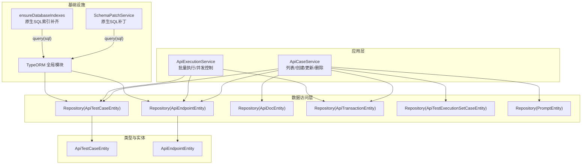
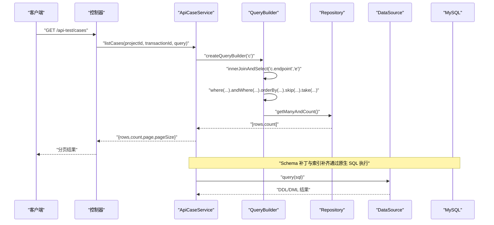
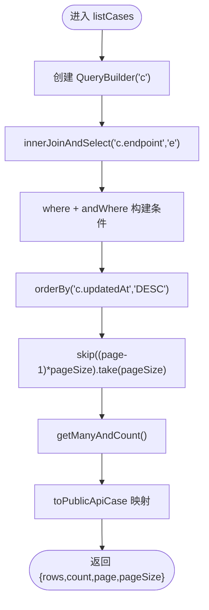
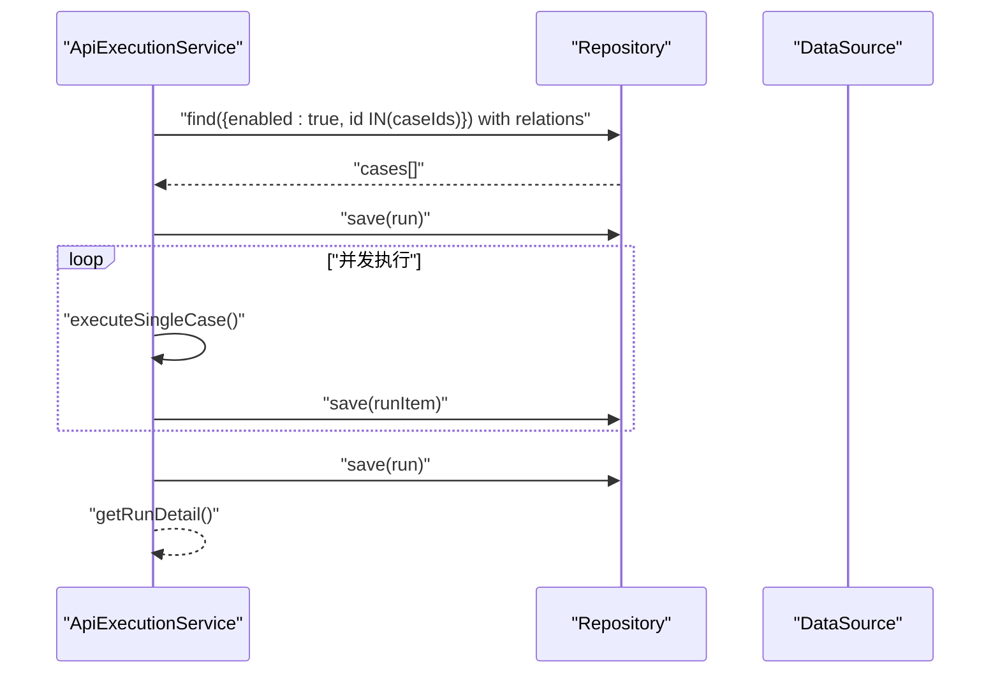
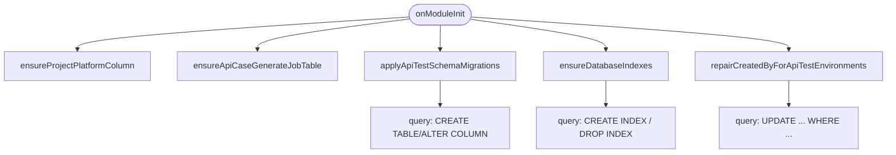
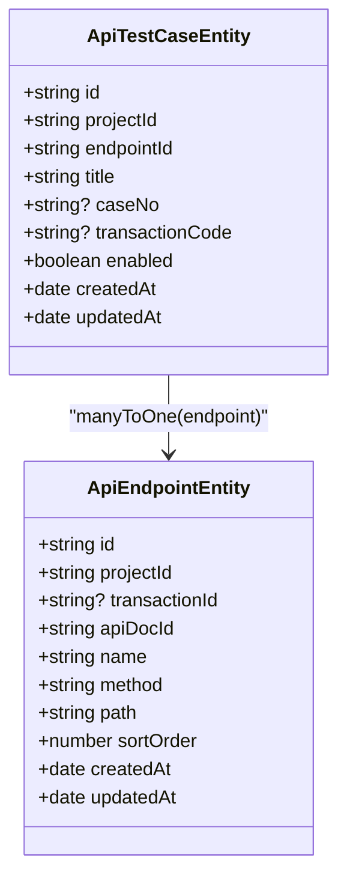

# 查询构建器与原生 SQL

<cite>
**本文引用的文件**
- [apps/api/src/modules/api-test/service/api-case.service.ts](file://apps/api/src/modules/api-test/service/api-case.service.ts)
- [apps/api/src/modules/api-test/entity/api-test-case.entity.ts](file://apps/api/src/modules/api-test/entity/api-test-case.entity.ts)
- [apps/api/src/modules/api-test/entity/api-endpoint.entity.ts](file://apps/api/src/modules/api-test/entity/api-endpoint.entity.ts)
- [apps/api/src/modules/api-test/service/api-execution.service.ts](file://apps/api/src/modules/api-test/service/api-execution.service.ts)
- [apps/api/src/common/audit/user-scope.ts](file://apps/api/src/common/audit/user-scope.ts)
- [apps/api/src/common/typeorm/typeorm.config.ts](file://apps/api/src/common/typeorm/typeorm.config.ts)
- [apps/api/src/common/typeorm/index.ts](file://apps/api/src/common/typeorm/index.ts)
- [apps/api/src/common/typeorm/schema-patch.service.ts](file://apps/api/src/common/typeorm/schema-patch.service.ts)
- [apps/api/src/common/typeorm/database-indexes.util.ts](file://apps/api/src/common/typeorm/database-indexes.util.ts)
- [apps/api/src/common/typeorm/api-schema-migrations.util.ts](file://apps/api/src/common/typeorm/api-schema-migrations.util.ts)
- [packages/shared/src/pagination.ts](file://packages/shared/src/pagination.ts)
</cite>

## 目录
1. [简介](#简介)
2. [项目结构](#项目结构)
3. [核心组件](#核心组件)
4. [架构总览](#架构总览)
5. [详细组件分析](#详细组件分析)
6. [依赖关系分析](#依赖关系分析)
7. [性能考量](#性能考量)
8. [故障排查指南](#故障排查指南)
9. [结论](#结论)
10. [附录](#附录)

## 简介
本指南聚焦于“查询构建器”与“原生 SQL”的开发实践，结合仓库中的 TypeORM 使用范式，系统讲解链式查询、条件构建、联表查询、分页与批量处理、以及索引与性能优化策略。文档同时覆盖复杂查询的实现模式与常见问题排查，帮助开发者在保证安全与可维护性的前提下，写出高效稳定的查询逻辑。

## 项目结构
本项目采用 NestJS + TypeORM 架构，数据库层通过全局模块注册连接，并在启动阶段进行必要的 schema 补丁与索引补齐。查询主要通过 Repository 与 QueryBuilder 实现，辅以原生 SQL 执行与结果映射。

图表来源
- [apps/api/src/common/typeorm/index.ts:10-21](file://apps/api/src/common/typeorm/index.ts#L10-L21)
- [apps/api/src/common/typeorm/typeorm.config.ts:15-42](file://apps/api/src/common/typeorm/typeorm.config.ts#L15-L42)
- [apps/api/src/common/typeorm/schema-patch.service.ts:16-28](file://apps/api/src/common/typeorm/schema-patch.service.ts#L16-L28)
- [apps/api/src/common/typeorm/database-indexes.util.ts:202-212](file://apps/api/src/common/typeorm/database-indexes.util.ts#L202-L212)

章节来源
- [apps/api/src/common/typeorm/index.ts:1-21](file://apps/api/src/common/typeorm/index.ts#L1-L21)
- [apps/api/src/common/typeorm/typeorm.config.ts:1-42](file://apps/api/src/common/typeorm/typeorm.config.ts#L1-L42)

## 核心组件
- 查询构建器与链式调用
  - 通过 Repository.createQueryBuilder 获取 QueryBuilder，支持链式调用：from、innerJoinAndSelect、where、andWhere、orderBy、skip/take 等。
  - 示例路径：[listCases 使用 QueryBuilder:60-89](file://apps/api/src/modules/api-test/service/api-case.service.ts#L60-L89)
- 条件构建与用户域隔离
  - 使用 scopedWhere/scopedWhereWithSystem 为查询自动附加 createdBy 约束，确保数据隔离。
  - 示例路径：[createCase 中的 scopedWhere:136-140](file://apps/api/src/modules/api-test/service/api-case.service.ts#L136-L140)
- 联表查询
  - innerJoinAndSelect 关联 endpoint，配合 orderBy、分页实现高性能列表。
  - 示例路径：[listCases 的联表与排序:70-80](file://apps/api/src/modules/api-test/service/api-case.service.ts#L70-L80)
- 分页与批量
  - 分页：normalizeCaseForgePageSize 规范页大小；skip/take 实现分页。
  - 批量：并发执行 runWithConcurrency 控制执行并发度。
  - 示例路径：[分页规范:15-23](file://packages/shared/src/pagination.ts#L15-L23)、[并发执行:477-491](file://apps/api/src/modules/api-test/service/api-execution.service.ts#L477-L491)
- 原生 SQL
  - SchemaPatchService 使用 DataSource.query 执行 DDL/DML，如列补齐、索引创建、表创建。
  - 示例路径：[Schema 补丁与索引补齐:31-62](file://apps/api/src/common/typeorm/schema-patch.service.ts#L31-L62)、[ensureDatabaseIndexes:202-212](file://apps/api/src/common/typeorm/database-indexes.util.ts#L202-L212)

章节来源
- [apps/api/src/modules/api-test/service/api-case.service.ts:60-89](file://apps/api/src/modules/api-test/service/api-case.service.ts#L60-L89)
- [apps/api/src/common/audit/user-scope.ts:18-36](file://apps/api/src/common/audit/user-scope.ts#L18-L36)
- [packages/shared/src/pagination.ts:15-23](file://packages/shared/src/pagination.ts#L15-L23)
- [apps/api/src/modules/api-test/service/api-execution.service.ts:477-491](file://apps/api/src/modules/api-test/service/api-execution.service.ts#L477-L491)
- [apps/api/src/common/typeorm/schema-patch.service.ts:31-62](file://apps/api/src/common/typeorm/schema-patch.service.ts#L31-L62)
- [apps/api/src/common/typeorm/database-indexes.util.ts:202-212](file://apps/api/src/common/typeorm/database-indexes.util.ts#L202-L212)

## 架构总览
下图展示查询路径与数据流：前端请求经控制器进入服务层，服务层通过 Repository/QueryBuilder 构建查询，必要时使用原生 SQL 完成 schema 补丁与索引维护，最终返回结果。

图表来源
- [apps/api/src/modules/api-test/service/api-case.service.ts:60-89](file://apps/api/src/modules/api-test/service/api-case.service.ts#L60-L89)
- [apps/api/src/common/typeorm/schema-patch.service.ts:16-28](file://apps/api/src/common/typeorm/schema-patch.service.ts#L16-L28)

## 详细组件分析

### 组件一：ApiCaseService（查询与分页）
- 功能要点
  - 列表查询：使用 QueryBuilder 进行联表、过滤、排序与分页。
  - 用户域隔离：使用 scopedWhere 自动附加 createdBy 约束。
  - 结果映射：统一转换为公开 DTO。
- 关键流程
  - 构建 QueryBuilder → innerJoinAndSelect → where/andWhere → orderBy → skip/take → getManyAndCount。
  - 使用 normalizeCaseForgePageSize 规范页大小，避免异常输入。
- 性能建议
  - 确保相关列具备合适索引（见“依赖关系分析”）。
  - 尽量减少 select 字段数量，仅关联必要字段。
- 示例路径
  - [listCases 实现:60-89](file://apps/api/src/modules/api-test/service/api-case.service.ts#L60-L89)
  - [分页规范:15-23](file://packages/shared/src/pagination.ts#L15-L23)

图表来源
- [apps/api/src/modules/api-test/service/api-case.service.ts:60-89](file://apps/api/src/modules/api-test/service/api-case.service.ts#L60-L89)

章节来源
- [apps/api/src/modules/api-test/service/api-case.service.ts:60-89](file://apps/api/src/modules/api-test/service/api-case.service.ts#L60-L89)
- [packages/shared/src/pagination.ts:15-23](file://packages/shared/src/pagination.ts#L15-L23)

### 组件二：ApiExecutionService（批量执行与并发）
- 功能要点
  - 批量执行：根据 caseIds 查询启用案例，按并发度执行。
  - 并发控制：runWithConcurrency 限制最大并发，避免资源争用。
  - 结果统计：汇总 passed/failed/error 数量，写入执行记录与明细。
- 关键流程
  - 查询启用案例（scopedWhere + In）→ 创建执行记录 → 并发执行 → 写入明细 → 更新执行记录。
- 性能建议
  - 合理设置并发度，避免数据库压力过大。
  - 对高频查询建立复合索引（见“依赖关系分析”）。
- 示例路径
  - [runCases 主流程:66-143](file://apps/api/src/modules/api-test/service/api-execution.service.ts#L66-L143)
  - [并发执行:477-491](file://apps/api/src/modules/api-test/service/api-execution.service.ts#L477-L491)

图表来源
- [apps/api/src/modules/api-test/service/api-execution.service.ts:66-143](file://apps/api/src/modules/api-test/service/api-execution.service.ts#L66-L143)

章节来源
- [apps/api/src/modules/api-test/service/api-execution.service.ts:66-143](file://apps/api/src/modules/api-test/service/api-execution.service.ts#L66-L143)
- [apps/api/src/modules/api-test/service/api-execution.service.ts:477-491](file://apps/api/src/modules/api-test/service/api-execution.service.ts#L477-L491)

### 组件三：SchemaPatchService 与原生 SQL（索引与迁移）
- 功能要点
  - Schema 补丁：通过 DataSource.query 执行 DDL，补齐缺失列、索引与表。
  - 索引补齐：ensureDatabaseIndexes 幂等创建热点表索引，dropIndexIfExists 清理冗余索引。
  - 迁移工具：applyApiTestSchemaMigrations 协调 api_doc/api_endpoint/api_transaction 等表结构演进。
- 关键流程
  - onModuleInit → ensureProjectPlatformColumn → ensureApiCaseGenerateJobTable → applyApiTestSchemaMigrations → ensureDatabaseIndexes → 修复历史数据。
- 性能建议
  - 在同步关闭场景下，务必通过 SchemaPatchService 与 ensureDatabaseIndexes 保障查询性能。
- 示例路径
  - [Schema 补丁入口:16-28](file://apps/api/src/common/typeorm/schema-patch.service.ts#L16-L28)
  - [索引补齐:202-212](file://apps/api/src/common/typeorm/database-indexes.util.ts#L202-L212)
  - [迁移工具:57-67](file://apps/api/src/common/typeorm/api-schema-migrations.util.ts#L57-L67)

图表来源
- [apps/api/src/common/typeorm/schema-patch.service.ts:16-28](file://apps/api/src/common/typeorm/schema-patch.service.ts#L16-L28)
- [apps/api/src/common/typeorm/database-indexes.util.ts:202-212](file://apps/api/src/common/typeorm/database-indexes.util.ts#L202-L212)
- [apps/api/src/common/typeorm/api-schema-migrations.util.ts:57-67](file://apps/api/src/common/typeorm/api-schema-migrations.util.ts#L57-L67)

章节来源
- [apps/api/src/common/typeorm/schema-patch.service.ts:16-28](file://apps/api/src/common/typeorm/schema-patch.service.ts#L16-L28)
- [apps/api/src/common/typeorm/database-indexes.util.ts:202-212](file://apps/api/src/common/typeorm/database-indexes.util.ts#L202-L212)
- [apps/api/src/common/typeorm/api-schema-migrations.util.ts:57-67](file://apps/api/src/common/typeorm/api-schema-migrations.util.ts#L57-L67)

## 依赖关系分析
- 类型与实体
  - ApiTestCaseEntity 与 ApiEndpointEntity 存在多对一关系，查询常需联表。
  - 实体定义包含复合索引，用于提升查询效率。
- 数据访问层
  - ApiCaseService 与 ApiExecutionService 通过 Repository 访问实体。
  - SchemaPatchService 与 database-indexes.util 通过 DataSource.query 执行原生 SQL。
- 关系图

图表来源
- [apps/api/src/modules/api-test/entity/api-test-case.entity.ts:21-99](file://apps/api/src/modules/api-test/entity/api-test-case.entity.ts#L21-L99)
- [apps/api/src/modules/api-test/entity/api-endpoint.entity.ts:13-67](file://apps/api/src/modules/api-test/entity/api-endpoint.entity.ts#L13-L67)

章节来源
- [apps/api/src/modules/api-test/entity/api-test-case.entity.ts:21-99](file://apps/api/src/modules/api-test/entity/api-test-case.entity.ts#L21-L99)
- [apps/api/src/modules/api-test/entity/api-endpoint.entity.ts:13-67](file://apps/api/src/modules/api-test/entity/api-endpoint.entity.ts#L13-L67)

## 性能考量
- 索引策略
  - 热点表与列：api_test_case.projectId、api_test_case.endpointId；api_endpoint.projectId+transactionId；api_test_execution_set.projectId+transactionId+updatedAt 等。
  - 幂等补齐：ensureDatabaseIndexes 与 SchemaPatchService 在启动时补齐索引，避免生产环境遗漏。
- 查询优化
  - 使用 QueryBuilder 的 innerJoinAndSelect 仅加载必要字段，避免 N+1。
  - 分页使用 skip/take，避免一次性拉取大量数据。
  - 对高频过滤条件（如 projectId、transactionId、createdBy）建立复合索引。
- 并发与吞吐
  - 批量执行使用 runWithConcurrency 控制并发度，防止数据库抖动。
  - 合理设置 DEFAULT_CONCURRENCY/MAX_CONCURRENCY，结合监控调整。
- 原生 SQL 的使用边界
  - 仅在 schema 补丁与索引维护场景使用，业务查询尽量通过 Repository/QueryBuilder。
- 示例路径
  - [ensureDatabaseIndexes 索引清单:78-189](file://apps/api/src/common/typeorm/database-indexes.util.ts#L78-L189)
  - [Schema 补丁幂等执行:16-28](file://apps/api/src/common/typeorm/schema-patch.service.ts#L16-L28)
  - [并发执行:477-491](file://apps/api/src/modules/api-test/service/api-execution.service.ts#L477-L491)

章节来源
- [apps/api/src/common/typeorm/database-indexes.util.ts:78-189](file://apps/api/src/common/typeorm/database-indexes.util.ts#L78-L189)
- [apps/api/src/common/typeorm/schema-patch.service.ts:16-28](file://apps/api/src/common/typeorm/schema-patch.service.ts#L16-L28)
- [apps/api/src/modules/api-test/service/api-execution.service.ts:477-491](file://apps/api/src/modules/api-test/service/api-execution.service.ts#L477-L491)

## 故障排查指南
- 查询不到数据或返回 404
  - 检查是否正确使用 scopedWhere/scopedWhereWithSystem 附加 createdBy 约束。
  - 示例路径：[scopedWhere 与断言:18-75](file://apps/api/src/common/audit/user-scope.ts#L18-L75)
- 分页不生效或数据错乱
  - 确认 orderBy 是否与索引匹配；检查 normalizeCaseForgePageSize 是否被调用。
  - 示例路径：[listCases 排序与分页:60-89](file://apps/api/src/modules/api-test/service/api-case.service.ts#L60-L89)、[分页规范:15-23](file://packages/shared/src/pagination.ts#L15-L23)
- 批量执行卡顿或超时
  - 降低并发度或增加数据库资源；检查网络与目标服务可用性。
  - 示例路径：[runCases 并发控制:66-143](file://apps/api/src/modules/api-test/service/api-execution.service.ts#L66-L143)
- 索引缺失导致慢查询
  - 通过 SchemaPatchService 与 ensureDatabaseIndexes 补齐索引；确认索引名称与列顺序正确。
  - 示例路径：[索引补齐:202-212](file://apps/api/src/common/typeorm/database-indexes.util.ts#L202-L212)
- 历史数据 createdBy 异常
  - SchemaPatchService 提供修复逻辑，扫描并回填 createdBy。
  - 示例路径：[修复历史数据:241-266](file://apps/api/src/common/typeorm/schema-patch.service.ts#L241-L266)

章节来源
- [apps/api/src/common/audit/user-scope.ts:18-75](file://apps/api/src/common/audit/user-scope.ts#L18-L75)
- [apps/api/src/modules/api-test/service/api-case.service.ts:60-89](file://apps/api/src/modules/api-test/service/api-case.service.ts#L60-L89)
- [packages/shared/src/pagination.ts:15-23](file://packages/shared/src/pagination.ts#L15-L23)
- [apps/api/src/modules/api-test/service/api-execution.service.ts:66-143](file://apps/api/src/modules/api-test/service/api-execution.service.ts#L66-L143)
- [apps/api/src/common/typeorm/database-indexes.util.ts:202-212](file://apps/api/src/common/typeorm/database-indexes.util.ts#L202-L212)
- [apps/api/src/common/typeorm/schema-patch.service.ts:241-266](file://apps/api/src/common/typeorm/schema-patch.service.ts#L241-L266)

## 结论
- 查询构建器是本项目的首选查询方式，配合链式调用、联表与分页，可满足大多数业务场景。
- 原生 SQL 仅用于 schema 补丁与索引维护，确保数据库结构与性能的持续优化。
- 通过用户域隔离、规范化分页与并发控制，可在保证安全性的同时获得稳定性能。
- 建议在新功能开发中遵循现有模式：优先 QueryBuilder，必要时使用原生 SQL；为高频查询建立合理索引；严格使用 scopedWhere 保障数据隔离。

## 附录
- 开发最佳实践
  - 新增实体后，及时在 INDEX_SPECS 中补充索引规划。
  - 对外暴露的列表接口必须使用 scopedWhere 与 orderBy + 分页。
  - 批量任务并发度应结合数据库与网络资源动态调整。
- 示例参考
  - [ApiCaseService.listCases:60-89](file://apps/api/src/modules/api-test/service/api-case.service.ts#L60-L89)
  - [ApiExecutionService.runCases:66-143](file://apps/api/src/modules/api-test/service/api-execution.service.ts#L66-L143)
  - [SchemaPatchService.onModuleInit:16-28](file://apps/api/src/common/typeorm/schema-patch.service.ts#L16-L28)