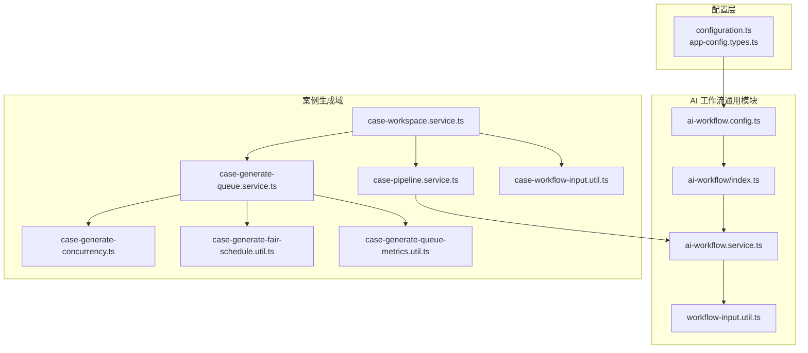
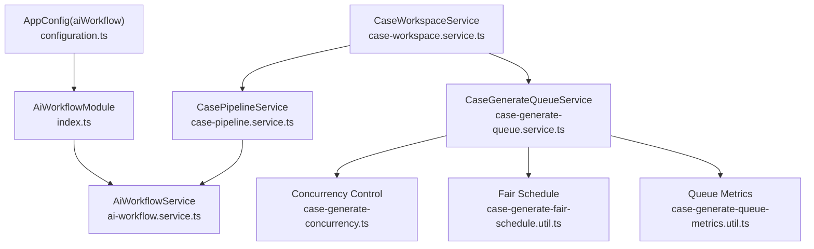
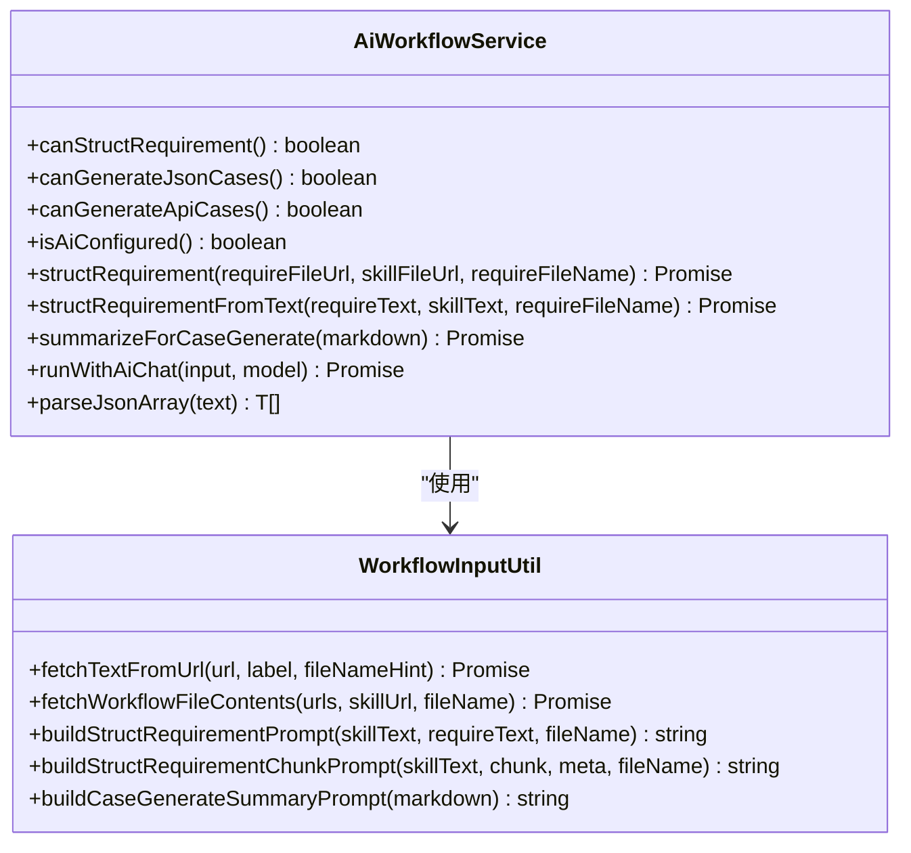
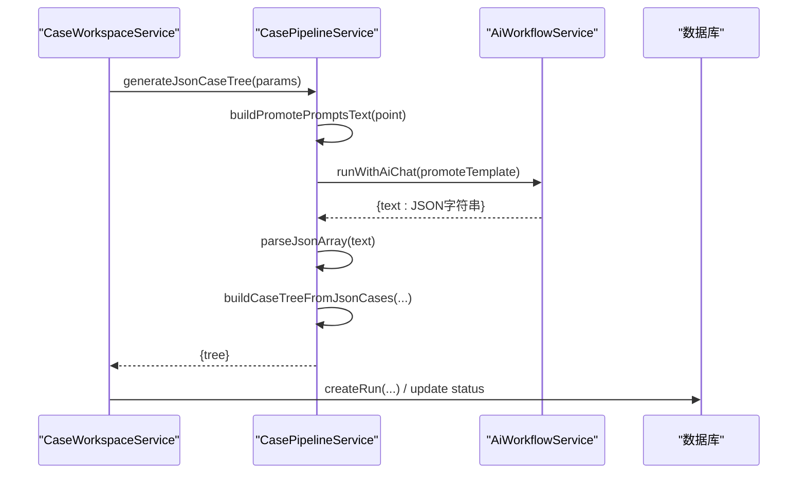
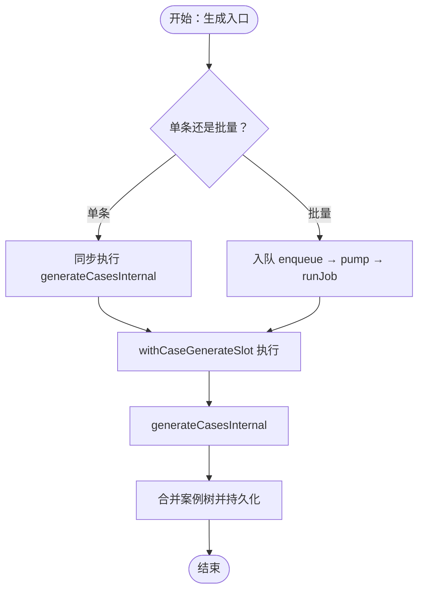
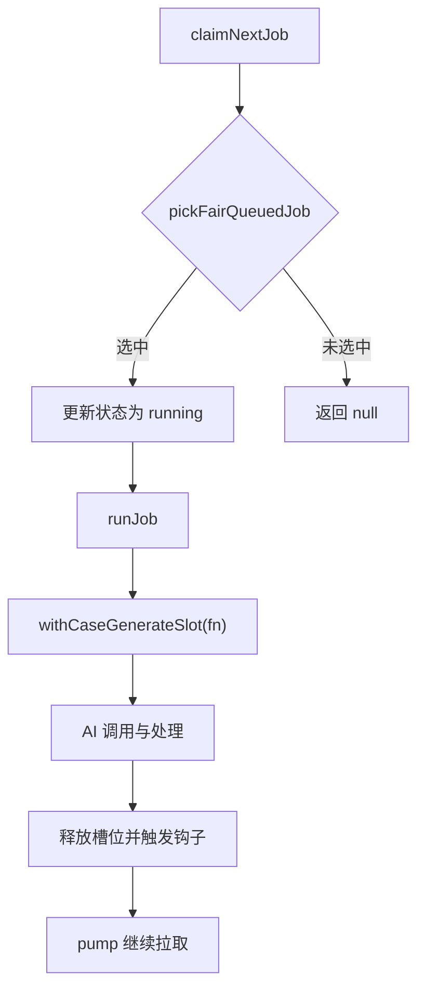
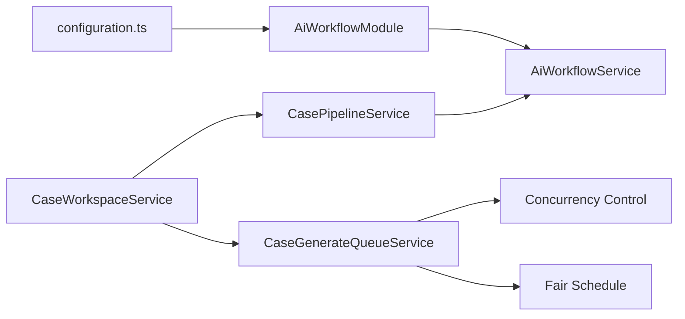

# AI 工作流服务

<cite>
**本文引用的文件**
- [apps/api/src/common/ai-workflow/index.ts](file://apps/api/src/common/ai-workflow/index.ts)
- [apps/api/src/common/ai-workflow/ai-workflow.config.ts](file://apps/api/src/common/ai-workflow/ai-workflow.config.ts)
- [apps/api/src/common/ai-workflow/service/ai-workflow.service.ts](file://apps/api/src/common/ai-workflow/service/ai-workflow.service.ts)
- [apps/api/src/common/ai-workflow/util/workflow-input.util.ts](file://apps/api/src/common/ai-workflow/util/workflow-input.util.ts)
- [apps/api/src/modules/case-editor/util/case-workflow-input.util.ts](file://apps/api/src/modules/case-editor/util/case-workflow-input.util.ts)
- [apps/api/src/modules/case-editor/service/case-generate-queue.service.ts](file://apps/api/src/modules/case-editor/service/case-generate-queue.service.ts)
- [apps/api/src/modules/case-editor/util/case-generate-concurrency.ts](file://apps/api/src/modules/case-editor/util/case-generate-concurrency.ts)
- [apps/api/src/modules/case-editor/util/case-generate-fair-schedule.util.ts](file://apps/api/src/modules/case-editor/util/case-generate-fair-schedule.util.ts)
- [apps/api/src/modules/case-editor/util/case-generate-queue-metrics.util.ts](file://apps/api/src/modules/case-editor/util/case-generate-queue-metrics.util.ts)
- [apps/api/src/modules/case-editor/service/case-workspace.service.ts](file://apps/api/src/modules/case-editor/service/case-workspace.service.ts)
- [apps/api/src/modules/case-editor/service/case-pipeline.service.ts](file://apps/api/src/modules/case-editor/service/case-pipeline.service.ts)
- [apps/api/src/config/configuration.ts](file://apps/api/src/config/configuration.ts)
- [apps/api/src/config/app-config.types.ts](file://apps/api/src/config/app-config.types.ts)
</cite>

## 目录
1. [简介](#简介)
2. [项目结构](#项目结构)
3. [核心组件](#核心组件)
4. [架构总览](#架构总览)
5. [详细组件分析](#详细组件分析)
6. [依赖关系分析](#依赖关系分析)
7. [性能考量](#性能考量)
8. [故障排查指南](#故障排查指南)
9. [结论](#结论)
10. [附录](#附录)

## 简介
本技术文档面向 AI 工作流服务，系统性阐述其架构设计、配置管理、执行机制与调度并发策略。重点覆盖如下主题：
- 工作流输入输出处理与提示词工程
- LLM 集成方式与错误处理
- 工作流调度、并发控制与公平队列
- 典型服务实现示例与可扩展实践
- 性能优化建议与监控指标

## 项目结构
AI 工作流服务主要分布在以下模块：
- 通用 AI 工作流模块：负责配置注入、LLM 调用、提示词构建与输入解析
- 案例生成工作区与流水线：负责需求结构化、案例生成、队列调度与合并
- 配置层：从环境变量加载运行时配置

图表来源
- [apps/api/src/config/configuration.ts:1-49](file://apps/api/src/config/configuration.ts#L1-L49)
- [apps/api/src/config/app-config.types.ts:1-45](file://apps/api/src/config/app-config.types.ts#L1-L45)
- [apps/api/src/common/ai-workflow/index.ts:1-21](file://apps/api/src/common/ai-workflow/index.ts#L1-L21)
- [apps/api/src/common/ai-workflow/ai-workflow.config.ts:1-21](file://apps/api/src/common/ai-workflow/ai-workflow.config.ts#L1-L21)
- [apps/api/src/common/ai-workflow/service/ai-workflow.service.ts:1-360](file://apps/api/src/common/ai-workflow/service/ai-workflow.service.ts#L1-L360)
- [apps/api/src/common/ai-workflow/util/workflow-input.util.ts:1-185](file://apps/api/src/common/ai-workflow/util/workflow-input.util.ts#L1-L185)
- [apps/api/src/modules/case-editor/service/case-workspace.service.ts:1-800](file://apps/api/src/modules/case-editor/service/case-workspace.service.ts#L1-L800)
- [apps/api/src/modules/case-editor/service/case-pipeline.service.ts:1-800](file://apps/api/src/modules/case-editor/service/case-pipeline.service.ts#L1-L800)
- [apps/api/src/modules/case-editor/service/case-generate-queue.service.ts:1-524](file://apps/api/src/modules/case-editor/service/case-generate-queue.service.ts#L1-L524)
- [apps/api/src/modules/case-editor/util/case-generate-concurrency.ts:1-91](file://apps/api/src/modules/case-editor/util/case-generate-concurrency.ts#L1-L91)
- [apps/api/src/modules/case-editor/util/case-generate-fair-schedule.util.ts:1-122](file://apps/api/src/modules/case-editor/util/case-generate-fair-schedule.util.ts#L1-L122)
- [apps/api/src/modules/case-editor/util/case-generate-queue-metrics.util.ts:1-54](file://apps/api/src/modules/case-editor/util/case-generate-queue-metrics.util.ts#L1-L54)
- [apps/api/src/modules/case-editor/util/case-workflow-input.util.ts:1-152](file://apps/api/src/modules/case-editor/util/case-workflow-input.util.ts#L1-L152)

章节来源
- [apps/api/src/common/ai-workflow/index.ts:1-21](file://apps/api/src/common/ai-workflow/index.ts#L1-L21)
- [apps/api/src/common/ai-workflow/ai-workflow.config.ts:1-21](file://apps/api/src/common/ai-workflow/ai-workflow.config.ts#L1-L21)
- [apps/api/src/common/ai-workflow/service/ai-workflow.service.ts:1-360](file://apps/api/src/common/ai-workflow/service/ai-workflow.service.ts#L1-L360)
- [apps/api/src/common/ai-workflow/util/workflow-input.util.ts:1-185](file://apps/api/src/common/ai-workflow/util/workflow-input.util.ts#L1-L185)
- [apps/api/src/modules/case-editor/util/case-workflow-input.util.ts:1-152](file://apps/api/src/modules/case-editor/util/case-workflow-input.util.ts#L1-L152)
- [apps/api/src/modules/case-editor/service/case-generate-queue.service.ts:1-524](file://apps/api/src/modules/case-editor/service/case-generate-queue.service.ts#L1-L524)
- [apps/api/src/modules/case-editor/util/case-generate-concurrency.ts:1-91](file://apps/api/src/modules/case-editor/util/case-generate-concurrency.ts#L1-L91)
- [apps/api/src/modules/case-editor/util/case-generate-fair-schedule.util.ts:1-122](file://apps/api/src/modules/case-editor/util/case-generate-fair-schedule.util.ts#L1-L122)
- [apps/api/src/modules/case-editor/util/case-generate-queue-metrics.util.ts:1-54](file://apps/api/src/modules/case-editor/util/case-generate-queue-metrics.util.ts#L1-L54)
- [apps/api/src/modules/case-editor/service/case-workspace.service.ts:1-800](file://apps/api/src/modules/case-editor/service/case-workspace.service.ts#L1-L800)
- [apps/api/src/modules/case-editor/service/case-pipeline.service.ts:1-800](file://apps/api/src/modules/case-editor/service/case-pipeline.service.ts#L1-L800)
- [apps/api/src/config/configuration.ts:1-49](file://apps/api/src/config/configuration.ts#L1-L49)
- [apps/api/src/config/app-config.types.ts:1-45](file://apps/api/src/config/app-config.types.ts#L1-L45)

## 核心组件
- AI 工作流模块（通用）
  - 配置注入与导出：通过注入令牌导出配置，供下游服务使用
  - LLM 调用封装：统一的 Chat Completions 调用、重试与结果解析
  - 提示词工程：需求结构化、分段结构化、案例生成摘要提示词构建
  - 输入解析：从 URL 拉取文件并解析为纯文本，支持多文件并行读取
- 案例生成流水线
  - 需求格式化：将原始需求文本格式化为结构化 Markdown 与分析对象
  - 案例生成：基于 promote-skill 与 AI Chat 生成 JSON 案例，转换为六级案例树
  - 合并与持久化：与历史 run 合并、写入编辑台运行记录
- 工作区编排
  - 单条/批量生成入口：单条同步、批量异步入队
  - 取消与回退：支持用户主动取消，回退至可编辑状态
  - 视图构建：聚合项目视图，返回前端所需数据
- 队列与并发
  - 全局并发槽：限制同时进行的 AI 调用数，避免打满 LLM 接口
  - 公平调度：按用户维度限制并发，保证多用户公平性
  - ETA 估算：基于平均耗时与排队位置估算等待与剩余时间

章节来源
- [apps/api/src/common/ai-workflow/index.ts:1-21](file://apps/api/src/common/ai-workflow/index.ts#L1-L21)
- [apps/api/src/common/ai-workflow/ai-workflow.config.ts:1-21](file://apps/api/src/common/ai-workflow/ai-workflow.config.ts#L1-L21)
- [apps/api/src/common/ai-workflow/service/ai-workflow.service.ts:1-360](file://apps/api/src/common/ai-workflow/service/ai-workflow.service.ts#L1-L360)
- [apps/api/src/common/ai-workflow/util/workflow-input.util.ts:1-185](file://apps/api/src/common/ai-workflow/util/workflow-input.util.ts#L1-L185)
- [apps/api/src/modules/case-editor/util/case-workflow-input.util.ts:1-152](file://apps/api/src/modules/case-editor/util/case-workflow-input.util.ts#L1-L152)
- [apps/api/src/modules/case-editor/service/case-workspace.service.ts:1-800](file://apps/api/src/modules/case-editor/service/case-workspace.service.ts#L1-L800)
- [apps/api/src/modules/case-editor/service/case-pipeline.service.ts:1-800](file://apps/api/src/modules/case-editor/service/case-pipeline.service.ts#L1-L800)
- [apps/api/src/modules/case-editor/service/case-generate-queue.service.ts:1-524](file://apps/api/src/modules/case-editor/service/case-generate-queue.service.ts#L1-L524)
- [apps/api/src/modules/case-editor/util/case-generate-concurrency.ts:1-91](file://apps/api/src/modules/case-editor/util/case-generate-concurrency.ts#L1-L91)
- [apps/api/src/modules/case-editor/util/case-generate-fair-schedule.util.ts:1-122](file://apps/api/src/modules/case-editor/util/case-generate-fair-schedule.util.ts#L1-L122)
- [apps/api/src/modules/case-editor/util/case-generate-queue-metrics.util.ts:1-54](file://apps/api/src/modules/case-editor/util/case-generate-queue-metrics.util.ts#L1-L54)

## 架构总览
AI 工作流服务采用“配置驱动 + 服务编排”的架构：
- 配置层：从环境变量加载 AppConfig，拆分出 aiWorkflow 子配置
- 通用模块：AiWorkflowService 封装 LLM 调用、提示词构建与输入解析
- 案例域：CaseWorkspaceService 与 CasePipelineService 协同完成需求结构化与案例生成
- 调度层：CaseGenerateQueueService 负责入队、出队、公平调度与 ETA 估算

图表来源
- [apps/api/src/config/configuration.ts:1-49](file://apps/api/src/config/configuration.ts#L1-L49)
- [apps/api/src/common/ai-workflow/index.ts:1-21](file://apps/api/src/common/ai-workflow/index.ts#L1-L21)
- [apps/api/src/common/ai-workflow/service/ai-workflow.service.ts:1-360](file://apps/api/src/common/ai-workflow/service/ai-workflow.service.ts#L1-L360)
- [apps/api/src/modules/case-editor/service/case-workspace.service.ts:1-800](file://apps/api/src/modules/case-editor/service/case-workspace.service.ts#L1-L800)
- [apps/api/src/modules/case-editor/service/case-pipeline.service.ts:1-800](file://apps/api/src/modules/case-editor/service/case-pipeline.service.ts#L1-L800)
- [apps/api/src/modules/case-editor/service/case-generate-queue.service.ts:1-524](file://apps/api/src/modules/case-editor/service/case-generate-queue.service.ts#L1-L524)
- [apps/api/src/modules/case-editor/util/case-generate-concurrency.ts:1-91](file://apps/api/src/modules/case-editor/util/case-generate-concurrency.ts#L1-L91)
- [apps/api/src/modules/case-editor/util/case-generate-fair-schedule.util.ts:1-122](file://apps/api/src/modules/case-editor/util/case-generate-fair-schedule.util.ts#L1-L122)
- [apps/api/src/modules/case-editor/util/case-generate-queue-metrics.util.ts:1-54](file://apps/api/src/modules/case-editor/util/case-generate-queue-metrics.util.ts#L1-L54)

## 详细组件分析

### AI 工作流服务（AiWorkflowService）
- 职责
  - LLM 调用：统一构建 OpenAI 兼容的 Chat Completions 请求，支持重试与日志
  - 提示词工程：构建需求结构化、分段结构化与案例生成摘要提示词
  - 输入解析：从 URL 拉取文件并解析为纯文本，支持并行读取
  - JSON 解析：从 AI 返回文本中解析 JSON 数组，兼容多种包裹形式
- 关键能力
  - 结构化需求：支持长文档分段结构化，自动合并并清洗输出
  - 需求摘要：将结构化 Markdown 压缩为案例生成用摘要
  - 能力开关：根据配置判断是否具备某类能力（结构化、JSON 案例、接口案例）

图表来源
- [apps/api/src/common/ai-workflow/service/ai-workflow.service.ts:1-360](file://apps/api/src/common/ai-workflow/service/ai-workflow.service.ts#L1-L360)
- [apps/api/src/common/ai-workflow/util/workflow-input.util.ts:1-185](file://apps/api/src/common/ai-workflow/util/workflow-input.util.ts#L1-L185)

章节来源
- [apps/api/src/common/ai-workflow/service/ai-workflow.service.ts:1-360](file://apps/api/src/common/ai-workflow/service/ai-workflow.service.ts#L1-L360)
- [apps/api/src/common/ai-workflow/util/workflow-input.util.ts:1-185](file://apps/api/src/common/ai-workflow/util/workflow-input.util.ts#L1-L185)

### 案例生成流水线（CasePipelineService）
- 职责
  - 需求格式化：将原始需求文本格式化为结构化 Markdown 与分析对象
  - 案例生成：基于 promote-skill 与 AI Chat 生成 JSON 案例，转换为六级案例树
  - 节点规范化：统一不同来源的案例节点为标准格式
- 关键流程
  - 为每个测试要点构建场景提示词与自然语言约束
  - 调用 AI Chat 生成 JSON 案例数组
  - 构建六级案例树并确保标题与优先级规范化

图表来源
- [apps/api/src/modules/case-editor/service/case-workspace.service.ts:280-454](file://apps/api/src/modules/case-editor/service/case-workspace.service.ts#L280-L454)
- [apps/api/src/modules/case-editor/service/case-pipeline.service.ts:145-196](file://apps/api/src/modules/case-editor/service/case-pipeline.service.ts#L145-L196)
- [apps/api/src/common/ai-workflow/service/ai-workflow.service.ts:227-291](file://apps/api/src/common/ai-workflow/service/ai-workflow.service.ts#L227-L291)

章节来源
- [apps/api/src/modules/case-editor/service/case-pipeline.service.ts:1-800](file://apps/api/src/modules/case-editor/service/case-pipeline.service.ts#L1-L800)
- [apps/api/src/modules/case-editor/service/case-workspace.service.ts:1-800](file://apps/api/src/modules/case-editor/service/case-workspace.service.ts#L1-L800)
- [apps/api/src/common/ai-workflow/service/ai-workflow.service.ts:1-360](file://apps/api/src/common/ai-workflow/service/ai-workflow.service.ts#L1-L360)

### 工作区编排（CaseWorkspaceService）
- 职责
  - 单条/批量生成入口：单条同步执行，批量异步入队
  - 取消与回退：支持用户主动取消，回退至可编辑状态
  - 视图构建：聚合项目视图，返回前端所需数据
  - 合并与持久化：与历史 run 合并、写入编辑台运行记录
- 关键流程
  - 生成入口：enqueue → pump → runJob → generateCasesInternal
  - 取消流程：cancelGenerateCases → 回退状态 → 清理槽位

图表来源
- [apps/api/src/modules/case-editor/service/case-workspace.service.ts:188-207](file://apps/api/src/modules/case-editor/service/case-workspace.service.ts#L188-L207)
- [apps/api/src/modules/case-editor/service/case-generate-queue.service.ts:340-357](file://apps/api/src/modules/case-editor/service/case-generate-queue.service.ts#L340-L357)
- [apps/api/src/modules/case-editor/util/case-generate-concurrency.ts:82-90](file://apps/api/src/modules/case-editor/util/case-generate-concurrency.ts#L82-L90)

章节来源
- [apps/api/src/modules/case-editor/service/case-workspace.service.ts:1-800](file://apps/api/src/modules/case-editor/service/case-workspace.service.ts#L1-L800)
- [apps/api/src/modules/case-editor/service/case-generate-queue.service.ts:1-524](file://apps/api/src/modules/case-editor/service/case-generate-queue.service.ts#L1-L524)
- [apps/api/src/modules/case-editor/util/case-generate-concurrency.ts:1-91](file://apps/api/src/modules/case-editor/util/case-generate-concurrency.ts#L1-L91)

### 队列与并发控制
- 全局并发槽
  - 通过 withCaseGenerateSlot 控制同时进行的 AI 调用数
  - 支持注册槽位释放钩子，实现队列即时推进
- 公平调度
  - 按用户维度限制 running 数，避免单用户独占资源
  - 以队首任务为基准，结合有效并行度估算等待时间
- ETA 估算
  - 基于最近完成任务的平均耗时，估算剩余时间
  - 考虑排队位置与用户并发上限，给出合理等待时间

图表来源
- [apps/api/src/modules/case-editor/service/case-generate-queue.service.ts:434-475](file://apps/api/src/modules/case-editor/service/case-generate-queue.service.ts#L434-L475)
- [apps/api/src/modules/case-editor/util/case-generate-fair-schedule.util.ts:49-85](file://apps/api/src/modules/case-editor/util/case-generate-fair-schedule.util.ts#L49-L85)
- [apps/api/src/modules/case-editor/util/case-generate-concurrency.ts:53-62](file://apps/api/src/modules/case-editor/util/case-generate-concurrency.ts#L53-L62)
- [apps/api/src/modules/case-editor/util/case-generate-queue-metrics.util.ts:7-53](file://apps/api/src/modules/case-editor/util/case-generate-queue-metrics.util.ts#L7-L53)

章节来源
- [apps/api/src/modules/case-editor/service/case-generate-queue.service.ts:1-524](file://apps/api/src/modules/case-editor/service/case-generate-queue.service.ts#L1-L524)
- [apps/api/src/modules/case-editor/util/case-generate-concurrency.ts:1-91](file://apps/api/src/modules/case-editor/util/case-generate-concurrency.ts#L1-L91)
- [apps/api/src/modules/case-editor/util/case-generate-fair-schedule.util.ts:1-122](file://apps/api/src/modules/case-editor/util/case-generate-fair-schedule.util.ts#L1-L122)
- [apps/api/src/modules/case-editor/util/case-generate-queue-metrics.util.ts:1-54](file://apps/api/src/modules/case-editor/util/case-generate-queue-metrics.util.ts#L1-L54)

## 依赖关系分析
- 配置依赖
  - configuration.ts 从环境变量加载 AppConfig，aiWorkflow 子配置用于 AiWorkflowModule 注入
- 服务依赖
  - CaseWorkspaceService 依赖 CasePipelineService 与 AiWorkflowService
  - CasePipelineService 依赖 AiWorkflowService 与 MinIO（用于拉取 skill 文件）
  - CaseGenerateQueueService 依赖并发控制与公平调度工具
- 外部依赖
  - LLM API：OpenAI 兼容的 Chat Completions
  - MinIO：拉取 skill 文件与结构化文档

图表来源
- [apps/api/src/config/configuration.ts:1-49](file://apps/api/src/config/configuration.ts#L1-L49)
- [apps/api/src/common/ai-workflow/index.ts:1-21](file://apps/api/src/common/ai-workflow/index.ts#L1-L21)
- [apps/api/src/common/ai-workflow/service/ai-workflow.service.ts:1-360](file://apps/api/src/common/ai-workflow/service/ai-workflow.service.ts#L1-L360)
- [apps/api/src/modules/case-editor/service/case-workspace.service.ts:1-800](file://apps/api/src/modules/case-editor/service/case-workspace.service.ts#L1-L800)
- [apps/api/src/modules/case-editor/service/case-pipeline.service.ts:1-800](file://apps/api/src/modules/case-editor/service/case-pipeline.service.ts#L1-L800)
- [apps/api/src/modules/case-editor/service/case-generate-queue.service.ts:1-524](file://apps/api/src/modules/case-editor/service/case-generate-queue.service.ts#L1-L524)
- [apps/api/src/modules/case-editor/util/case-generate-concurrency.ts:1-91](file://apps/api/src/modules/case-editor/util/case-generate-concurrency.ts#L1-L91)
- [apps/api/src/modules/case-editor/util/case-generate-fair-schedule.util.ts:1-122](file://apps/api/src/modules/case-editor/util/case-generate-fair-schedule.util.ts#L1-L122)

章节来源
- [apps/api/src/config/configuration.ts:1-49](file://apps/api/src/config/configuration.ts#L1-L49)
- [apps/api/src/common/ai-workflow/index.ts:1-21](file://apps/api/src/common/ai-workflow/index.ts#L1-L21)
- [apps/api/src/modules/case-editor/service/case-workspace.service.ts:1-800](file://apps/api/src/modules/case-editor/service/case-workspace.service.ts#L1-L800)
- [apps/api/src/modules/case-editor/service/case-pipeline.service.ts:1-800](file://apps/api/src/modules/case-editor/service/case-pipeline.service.ts#L1-L800)
- [apps/api/src/modules/case-editor/service/case-generate-queue.service.ts:1-524](file://apps/api/src/modules/case-editor/service/case-generate-queue.service.ts#L1-L524)

## 性能考量
- 并发控制
  - 全局并发上限：通过环境变量设置，避免同时打满 LLM 接口
  - 公平调度：限制单用户并发，提升多用户公平性
- ETA 估算
  - 基于最近完成任务的中位数耗时，减少极端值影响
  - 考虑排队位置与有效并行度，给出更合理的等待时间
- 输入处理
  - 需求结构化支持分段，降低单次请求长度，提高稳定性
  - 并行读取多个文件，缩短准备阶段耗时
- 错误与重试
  - LLM 调用具备重试机制，增强鲁棒性
  - 生成失败时记录错误信息，便于定位问题

## 故障排查指南
- 常见错误与定位
  - AI Chat 未配置：检查 AI_CHAT_URL、AI_CHAT_MODEL、AI_CHAT_API_KEY
  - 技能 URL 未配置：检查 REQ_DOC_SKILL_URL、CASE_DOC_PROMOTE_URL、AT_CASE_SKILL_URL
  - 输入参数无效：需求文档/技能文档 URL 为空或内容为空
  - 生成失败：查看任务状态与错误消息，确认是否被取消或网络异常
- 排查步骤
  - 确认配置项是否正确加载
  - 查看队列状态与 ETA，确认是否卡在排队或运行中
  - 检查 LLM 返回内容是否为空或格式异常
  - 如需回滚，使用取消接口并确认状态回退

章节来源
- [apps/api/src/common/ai-workflow/service/ai-workflow.service.ts:88-112](file://apps/api/src/common/ai-workflow/service/ai-workflow.service.ts#L88-L112)
- [apps/api/src/common/ai-workflow/service/ai-workflow.service.ts:227-291](file://apps/api/src/common/ai-workflow/service/ai-workflow.service.ts#L227-L291)
- [apps/api/src/modules/case-editor/service/case-workspace.service.ts:235-277](file://apps/api/src/modules/case-editor/service/case-workspace.service.ts#L235-L277)
- [apps/api/src/modules/case-editor/service/case-generate-queue.service.ts:97-115](file://apps/api/src/modules/case-editor/service/case-generate-queue.service.ts#L97-L115)

## 结论
本 AI 工作流服务通过“配置驱动 + 服务编排 + 公平调度”的设计，实现了从需求结构化到案例生成的完整链路。其关键优势包括：
- 明确的提示词工程与输入解析，确保输出质量与稳定性
- 全局并发与公平调度，兼顾吞吐与公平性
- 完整的队列与 ETA 估算，提升用户体验
- 可扩展的模块化设计，便于接入新的技能与 LLM

## 附录
- 配置项说明（节选）
  - aiWorkflow.reqDocSkillUrl：需求结构化技能 URL
  - aiWorkflow.caseDocPromoteUrl：案例生成 promote-skill URL
  - aiWorkflow.atCaseSkillUrl：接口测试案例生成技能 URL
  - aiWorkflow.aiChat.url/model/apiKey/retryTime：LLM 调用配置
- 环境变量
  - CASE_GENERATE_CONCURRENCY：全局并发上限
  - CASE_GENERATE_PER_USER_MAX：单用户并发上限

章节来源
- [apps/api/src/config/configuration.ts:35-47](file://apps/api/src/config/configuration.ts#L35-L47)
- [apps/api/src/config/app-config.types.ts:33-43](file://apps/api/src/config/app-config.types.ts#L33-L43)
- [apps/api/src/modules/case-editor/util/case-generate-concurrency.ts:44-51](file://apps/api/src/modules/case-editor/util/case-generate-concurrency.ts#L44-L51)
- [apps/api/src/modules/case-editor/util/case-generate-fair-schedule.util.ts:11-18](file://apps/api/src/modules/case-editor/util/case-generate-fair-schedule.util.ts#L11-L18)